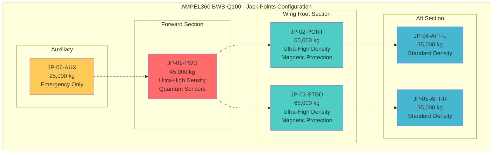
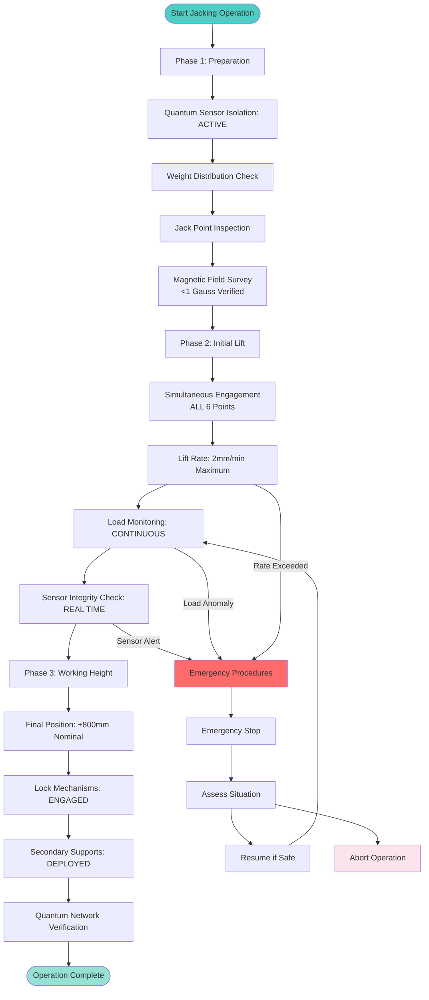
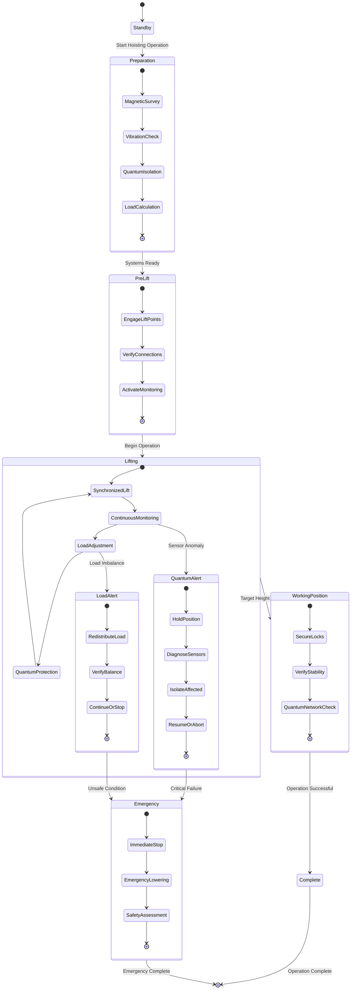
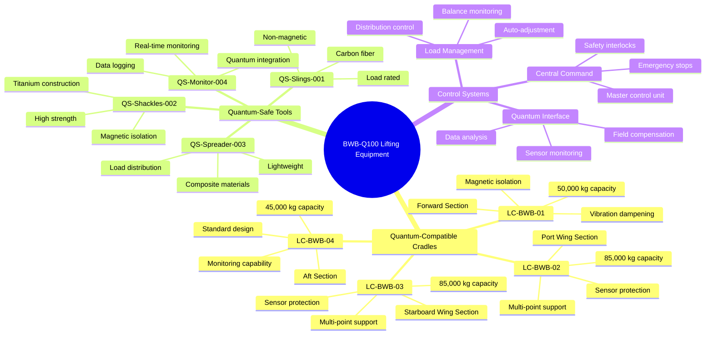
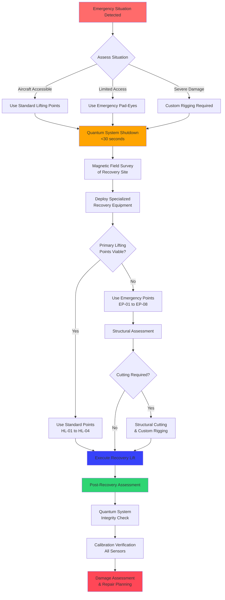

# ATA 07 – LIFTING AND HOISTING
## AMPEL360 BWB-Q100 - GAIA-QAO Framework

---

## 📋 DOCUMENT CONTROL

| Field | Value |
|-------|--------|
| **Document ID** | `07-00-00-00-General` |
| **Version** | 1.0.0 |
| **Date** | 2025-07-02 |
| **Classification** | GAIA-QAO Confidential |
| **ATA Chapter** | 07 - Lifting and Hoisting |
| **Aircraft Model** | AMPEL360 BWB-Q100 |
| **GAIA-QAO ID** | `AS-M-PAX-BW-Q1H-07` |

---

## 🎯 CHAPTER OVERVIEW

### Purpose and Scope
This chapter defines the **Lifting and Hoisting Systems** for the AMPEL360 BWB-Q100, addressing the unique challenges of handling a Blended Wing Body (BWB) configuration integrated with quantum sensor networks. The systems ensure safe aircraft handling during maintenance, storage, and emergency recovery operations while preserving the integrity of quantum sensing infrastructure.

### Key Features
- **BWB-Optimized Lifting Points**: Distributed load distribution for non-traditional airframe geometry
- **Quantum-Safe Handling**: Specialized procedures to protect sensitive quantum sensors
- **Smart Lifting Integration**: Real-time monitoring during lifting operations
- **Modular Hoisting Systems**: Adaptable for various maintenance configurations

---

## 🏗️ SYSTEM ARCHITECTURE

### 07-10-00 Jack Systems

#### Primary Jacking Points Layout



**Location Distribution (BWB Configuration):**

| Jack Point ID | Location | Load Capacity | Quantum Sensor Density | Special Requirements |
|---------------|----------|---------------|------------------------|---------------------|
| `JP-01-FWD` | Forward Center Section | 45,000 kg | Ultra-High (25/m²) | Vibration isolation required |
| `JP-02-PORT` | Port Wing Root | 65,000 kg | Ultra-High (25/m²) | Magnetic field protection |
| `JP-03-STBD` | Starboard Wing Root | 65,000 kg | Ultra-High (25/m²) | Magnetic field protection |
| `JP-04-AFT-L` | Aft Section Port | 35,000 kg | Standard (4/m²) | Standard procedures |
| `JP-05-AFT-R` | Aft Section Starboard | 35,000 kg | Standard (4/m²) | Standard procedures |
| `JP-06-AUX` | Auxiliary Center | 25,000 kg | Medium (8/m²) | Emergency use only |

**Technical Specifications:**
- **Total Lifting Capacity**: 270,000 kg (594,000 lbs)
- **Safety Factor**: 2.5x operational load
- **Jack Travel**: ±1.2 meters vertical
- **Precision Control**: ±2mm positioning accuracy
- **Quantum Isolation**: Magnetic field <1 Gauss at sensor locations

#### Jacking Procedures for BWB Configuration



```yaml
BWB_Jacking_Sequence:
  Phase_1_Preparation:
    - Quantum_sensor_isolation: ACTIVE
    - Weight_distribution_check: REQUIRED
    - Jack_point_inspection: COMPLETE
    - Magnetic_field_survey: <1_Gauss_verified
    
  Phase_2_Initial_Lift:
    - Simultaneous_engagement: ALL_6_points
    - Lift_rate: 2mm/minute_maximum
    - Load_monitoring: CONTINUOUS
    - Sensor_integrity_check: REAL_TIME
    
  Phase_3_Working_Height:
    - Final_position: +800mm_nominal
    - Lock_mechanisms: ENGAGED
    - Secondary_supports: DEPLOYED
    - Quantum_network_verification: COMPLETE
```

### 07-20-00 Hoisting Systems

#### Main Lifting Points Architecture

```mermaid
graph TB
    subgraph "AMPEL360 BWB-Q100 - Hoisting Configuration"
        subgraph "Nose Section"
            HL01["HL-01-NOSE<br/>15,000 kg<br/>Single-Point Lift<br/>Forward Bulkhead"]
        end
        
        subgraph "Wing Section"
            HL02["HL-02-WING-L<br/>80,000 kg<br/>Port Wing Box<br/>Synchronized Required"]
            HL03["HL-03-WING-R<br/>80,000 kg<br/>Starboard Wing Box<br/>Synchronized Required"]
        end
        
        subgraph "Tail Section"
            HL04["HL-04-TAIL<br/>20,000 kg<br/>Aft Structural Frame<br/>Balance Monitoring"]
        end
        
        subgraph "Control Systems"
            CS[Central Control System]
            QM[Quantum Monitoring]
            LB[Load Balancing]
            VS[Vibration Suppression]
        end
        
        HL01 --> CS
        HL02 --> CS
        HL03 --> CS
        HL04 --> CS
        
        CS --> QM
        CS --> LB
        CS --> VS
        
        QM --> QuantumNet[2,847 Quantum Sensors<br/>Real-time Monitoring]
        LB --> LoadDist[Dynamic Load Distribution]
        VS --> VibControl[Active Vibration Control]
    end
    
    style HL01 fill:#ff9f43
    style HL02 fill:#10ac84
    style HL03 fill:#10ac84
    style HL04 fill:#ee5a52
    style CS fill:#3742fa
    style QM fill:#2f3542
    style LB fill:#57606f
    style VS fill:#a4b0be
```



**Primary Hoisting Configuration:**
- **Nose Lifting Point**: `HL-01-NOSE`
  - Capacity: 15,000 kg
  - Location: Forward pressure bulkhead attachment
  - Special: Single-point lift capability

- **Wing Lifting Points**: `HL-02-WING-L`, `HL-03-WING-R`
  - Capacity: 80,000 kg each
  - Location: Main wing box upper surface
  - Special: Synchronized lifting required

- **Tail Lifting Point**: `HL-04-TAIL`
  - Capacity: 20,000 kg
  - Location: Aft structural frame
  - Special: Balance point monitoring

#### Quantum-Aware Hoisting Procedures



**Critical Considerations for BWB-Q100:**

1. **Magnetic Field Management**
   - Maximum 0.5 Gauss during lifting operations
   - Real-time monitoring via quantum magnetometers
   - Automatic field compensation system

2. **Vibration Control**
   - Isolation systems active during all lifts
   - Frequency dampening: 0.1-100 Hz
   - Quantum decoherence prevention protocols

3. **Load Distribution Monitoring**
   - 2,847 quantum sensors provide real-time stress mapping
   - Automatic load redistribution if anomalies detected
   - Predictive failure analysis during operations

### 07-30-00 Special Lifting Equipment

#### BWB-Specific Ground Support Equipment (GSE)



**Quantum-Compatible Lifting Cradles:**

| Equipment ID | Description | Capacity | Quantum Features |
|--------------|-------------|----------|------------------|
| `LC-BWB-01` | Forward Section Cradle | 50,000 kg | Magnetic isolation, vibration dampening |
| `LC-BWB-02` | Wing Section Cradle (Port) | 85,000 kg | Multi-point support, sensor protection |
| `LC-BWB-03` | Wing Section Cradle (Stbd) | 85,000 kg | Multi-point support, sensor protection |
| `LC-BWB-04` | Aft Section Cradle | 45,000 kg | Standard design, monitoring capability |

**Special Tools and Adapters:**

```markdown
Quantum-Safe Lifting Tools:
├── QS-Slings-001: Carbon fiber slings (non-magnetic)
├── QS-Shackles-002: Titanium shackles with isolation
├── QS-Spreader-003: Composite spreader bars
└── QS-Monitor-004: Real-time load monitoring system
```

#### Emergency Lifting Procedures



**Quantum System Protection During Emergency Recovery:**

1. **Immediate Response Protocol**
   - Quantum system emergency shutdown: <30 seconds
   - Magnetic field survey of crash site
   - Specialized recovery equipment deployment

2. **Recovery Lifting Sequence**
   - Primary: Use standard lifting points if accessible
   - Secondary: Emergency pad-eyes (8 locations)
   - Tertiary: Structural cutting and custom rigging

3. **Post-Recovery Quantum System Assessment**
   - Full sensor network integrity check
   - Calibration verification for all quantum sensors
   - Damage assessment and repair planning

---

## 🔧 OPERATIONAL PROCEDURES

### 07-40-00 Lifting Operations Manual

#### Pre-Lift Checklist

```yaml
BWQ_Q100_Pre_Lift_Checklist:
  Aircraft_Preparation:
    ☐ Fuel_drained_to_specified_level
    ☐ Quantum_systems_in_maintenance_mode
    ☐ All_personnel_clear_of_lift_zone
    ☐ Weather_conditions_suitable
    
  Equipment_Verification:
    ☐ Jack_points_inspected_and_certified
    ☐ Lifting_equipment_load_tested
    ☐ Quantum_isolation_systems_verified
    ☐ Emergency_procedures_briefed
    
  Monitoring_Systems:
    ☐ Real_time_load_monitoring_active
    ☐ Quantum_sensor_integrity_confirmed
    ☐ Magnetic_field_survey_complete
    ☐ Vibration_monitoring_enabled
```

#### Standard Lifting Procedures

**Phase 1: Preparation and Setup**
1. Position aircraft in designated lifting area
2. Activate quantum system maintenance mode
3. Install lifting equipment and verify connections
4. Conduct final safety briefing

**Phase 2: Controlled Lift**
1. Begin simultaneous lifting at all points
2. Monitor load distribution continuously
3. Verify quantum sensor integrity throughout
4. Maintain lift rate within specified parameters

**Phase 3: Working Position**
1. Achieve target height with precision positioning
2. Engage all locking mechanisms
3. Install secondary support systems
4. Verify quantum network operational status

#### Emergency Procedures

**Quantum System Emergency Protocols:**

| Emergency Type | Immediate Action | Quantum Protection | Recovery Method |
|----------------|------------------|-------------------|-----------------|
| Jack Failure | Stop all lifting | Emergency quantum shutdown | Manual load redistribution |
| Power Loss | Maintain position | Battery backup activation | Emergency lowering |
| Sensor Alarm | Investigate source | Isolate affected sensors | Continue with monitoring |
| Magnetic Anomaly | Stop operations | Field compensation active | Source identification |

---

## 📊 TECHNICAL SPECIFICATIONS

### 07-50-00 System Performance Parameters

#### Lifting Capacity Matrix

**Maximum Operating Loads (Safety Factor 2.5):**

| Configuration | Weight (kg) | CG Range (m) | Lift Points Required | Quantum Status |
|---------------|-------------|--------------|---------------------|----------------|
| Empty Aircraft | 48,500 | 12.5-13.2 | 4 minimum | ACTIVE |
| Maintenance Config | 52,000 | 12.3-13.4 | 6 recommended | MAINTENANCE |
| Emergency Recovery | Variable | Unknown | All available | EMERGENCY |
| Component Removal | 45,000 | Varies | Situation dependent | SELECTIVE |

#### Environmental Operating Limits

**Lifting Operations Authorized When:**
- Wind Speed: ≤ 35 knots (18 m/s)
- Temperature: -20°C to +50°C
- Humidity: ≤ 95% non-condensing
- Magnetic Field: ≤ 1 Gauss ambient
- Vibration: ≤ 0.1g background

### 07-60-00 Quantum Integration Specifications

#### Quantum Sensor Network During Lifting Operations

```mermaid
graph TB
    subgraph "Quantum Sensor Network - Lifting Integration"
        subgraph "Ultra-High Density Zones"
            UH1[Wing Roots<br/>25 sensors/m²<br/>Maximum Protection]
            UH2[Landing Gear Areas<br/>22 sensors/m²<br/>High Protection]
            UH3[Engine Mounts<br/>20 sensors/m²<br/>High Protection]
        end
        
        subgraph "Medium Density Zones"
            MD1[Wing Structure<br/>8 sensors/m²<br/>Medium Protection]
        end
        
        subgraph "Standard Density Zones"
            SD1[Fuselage<br/>4 sensors/m²<br/>Standard Protection]
        end
        
        subgraph "Quantum Processing"
            QPC[Quantum Processing Center]
            QEC[Quantum Error Correction]
            RTM[Real-Time Monitoring]
            PAL[Predictive Analysis]
        end
        
        subgraph "Safety Systems"
            MFS[Magnetic Field Suppression]
            VIS[Vibration Isolation]
            EMI[EMI Shielding]
            TCS[Temperature Control]
        end
        
        UH1 --> QPC
        UH2 --> QPC
        UH3 --> QPC
        MD1 --> QPC
        SD1 --> QPC
        
        QPC --> QEC
        QPC --> RTM
        QPC --> PAL
        
        QEC --> Alert1[Coherence Alert]
        RTM --> Alert2[Performance Alert]
        PAL --> Alert3[Predictive Alert]
        
        MFS --> UH1
        VIS --> UH1
        EMI --> UH1
        TCS --> UH1
        
        MFS --> UH2
        VIS --> UH2
        EMI --> UH2
        
        MFS --> UH3
        VIS --> UH3
        EMI --> UH3
    end
    
    style UH1 fill:#ff6b6b
    style UH2 fill:#ffa502
    style UH3 fill:#ffa502
    style MD1 fill:#2ed573
    style SD1 fill:#3742fa
    style QPC fill:#2f3542
    style Alert1 fill:#ff4757
    style Alert2 fill:#ff4757
    style Alert3 fill:#ff4757
```



#### Sensor Protection During Lifting

**Critical Quantum Sensor Locations:**

| Sensor Zone | Density (sensors/m²) | Protection Level | Special Procedures |
|-------------|---------------------|------------------|-------------------|
| Wing Roots | 25 | MAXIMUM | Magnetic isolation, vibration dampening |
| Landing Gear Areas | 22 | HIGH | Load monitoring, stress analysis |
| Engine Mounts | 20 | HIGH | Dynamic load compensation |
| Wing Structure | 8 | MEDIUM | Continuous monitoring |
| Fuselage | 4 | STANDARD | Basic protection |

**Real-Time Monitoring Capabilities:**
- **Sensor Integrity**: 100% coverage during operations
- **Load Distribution**: Real-time stress mapping
- **Magnetic Field**: Continuous monitoring at 1kHz
- **Vibration Analysis**: Full spectrum 0.1-1000 Hz
- **Deformation Tracking**: Sub-millimeter precision

---

## 🛡️ SAFETY AND COMPLIANCE

### 07-70-00 Safety Requirements

#### Personnel Safety Protocols

**Quantum-Specific Safety Measures:**

1. **Magnetic Field Exposure Limits**
   - Personnel: <5 Gauss continuous exposure
   - Pacemaker wearers: <1 Gauss absolute limit
   - Monitoring: Continuous personal dosimeters

2. **Radiation Safety (Quantum Systems)**
   - Low-level electromagnetic radiation monitoring
   - UV exposure from quantum light sources
   - Protective equipment specifications

3. **Cryogenic Hazards**
   - Quantum cooling system safety during lifting
   - Emergency shutdown procedures
   - Personnel protective equipment

#### Structural Integrity Monitoring

```mermaid
gantt
    title Continuous Structural Assessment During Lifting Operations
    dateFormat X
    axisFormat %H:%M
    
    section Real-Time Analysis
    Load Path Verification     :active, loadpath, 0, 5
    Stress Monitoring         :active, stress, 0, 5
    Fatigue Life Tracking     :active, fatigue, 0, 5
    Damage Progression        :active, damage, 0, 5
    
    section Alert Thresholds
    80% Capacity Warning      :warning, warn80, 1, 1
    Sensor Anomaly Alert      :critical, anomaly, 2, 2
    95% Capacity Emergency    :crit, warn95, 3, 3
    Automatic Shutdown        :milestone, shutdown, 4, 0
    
    section Quantum Monitoring
    Network Coherence Check   :active, coherence, 0, 5
    Data Integrity Verification :active, integrity, 0, 5
    Environmental Monitoring  :active, env, 0, 5
    Predictive Analysis       :active, predict, 0, 5
```

**Continuous Assessment During Operations:**

```yaml
Structural_Monitoring_Protocol:
  Real_Time_Analysis:
    - Load_path_verification: CONTINUOUS
    - Stress_concentration_monitoring: ACTIVE
    - Fatigue_life_tracking: REAL_TIME
    - Damage_progression_analysis: PREDICTIVE
    
  Alert_Thresholds:
    - Load_limit_warning: 80%_capacity
    - Sensor_anomaly_alert: Any_deviation
    - Emergency_stop: 95%_capacity
    - Automatic_shutdown: Sensor_failure
```

### 07-80-00 Quantum System Considerations

#### Lifting Impact on Quantum Performance

**System Performance During Operations:**

| Parameter | Normal Operation | During Lifting | Acceptable Threshold |
|-----------|------------------|----------------|---------------------|
| Sensor Accuracy | ±0.1% | ±0.5% | ±1.0% maximum |
| Response Time | <1 μs | <5 μs | <10 μs maximum |
| Network Coherence | 99.9% | 98.5% | 95% minimum |
| Data Integrity | 100% | 99.8% | 99% minimum |

#### Quantum Network Reconfiguration

```mermaid
graph LR
    subgraph "Normal Operation Mode"
        NM1[All Sensors Active<br/>2,847 nodes]
        NM2[Full Network Topology]
        NM3[Standard Protocols]
        NM4[99.9% Coherence]
    end
    
    subgraph "Lifting Operation Mode"
        LM1[Priority Sensors<br/>Critical zones only]
        LM2[Adaptive Topology]
        LM3[Lift-Safe Protocols]
        LM4[98.5% Coherence]
    end
    
    subgraph "Emergency Mode"
        EM1[Essential Sensors<br/>Safety critical only]
        EM2[Minimal Topology]
        EM3[Emergency Protocols]
        EM4[95% Coherence Min]
    end
    
    subgraph "Recovery Mode"
        RM1[Diagnostic Mode]
        RM2[Sensor Verification]
        RM3[Recalibration]
        RM4[Full Restoration]
    end
    
    NM1 --> LM1 : Lifting Start
    NM2 --> LM2
    NM3 --> LM3
    NM4 --> LM4
    
    LM1 --> EM1 : Emergency
    LM2 --> EM2
    LM3 --> EM3
    LM4 --> EM4
    
    LM1 --> RM1 : Lifting Complete
    LM2 --> RM2
    LM3 --> RM3
    LM4 --> RM4
    
    EM1 --> RM1 : Emergency Resolved
    EM2 --> RM2
    EM3 --> RM3
    EM4 --> RM4
    
    RM1 --> NM1 : Recovery Complete
    RM2 --> NM2
    RM3 --> NM3
    RM4 --> NM4
    
    style NM1 fill:#2ed573
    style LM1 fill:#ffa502
    style EM1 fill:#ff6b6b
    style RM1 fill:#3742fa
```

**Adaptive Network Management:**
- Automatic sensor prioritization during lifting
- Dynamic network topology adjustment
- Emergency communication protocols
- Post-operation recalibration procedures

---

## 📚 MAINTENANCE AND INSPECTION

### 07-90-00 Maintenance Requirements

#### Lifting Equipment Inspection Schedule

**Daily Inspections:**
- Visual inspection of all lifting points
- Quantum sensor status verification
- Load monitoring system check
- Emergency equipment availability

**Weekly Inspections:**
- Detailed lifting equipment examination
- Quantum isolation system test
- Load cell calibration verification
- Safety system functional check

**Monthly Inspections:**
- Complete system load test
- Quantum sensor network validation
- Magnetic field survey update
- Emergency procedure drill

**Annual Inspections:**
- Full load test to maximum capacity
- Quantum system integration verification
- Complete safety system audit
- Personnel training update

#### Record Keeping Requirements

**Mandatory Documentation:**

```yaml
Lifting_Operations_Records:
  Pre_Operation:
    - Equipment_inspection_checklist
    - Personnel_qualification_verification
    - Quantum_system_status_report
    - Environmental_conditions_log
    
  During_Operation:
    - Real_time_load_monitoring_data
    - Quantum_sensor_performance_log
    - Any_anomalies_or_incidents
    - Time_stamped_operation_sequence
    
  Post_Operation:
    - Final_system_status_verification
    - Quantum_network_integrity_check
    - Equipment_condition_assessment
    - Lessons_learned_documentation
```

---

## 🔍 TROUBLESHOOTING

### 07-95-00 Common Issues and Solutions

#### Quantum System Related Issues

| Issue | Symptoms | Cause | Solution | Prevention |
|-------|----------|-------|----------|------------|
| Sensor Decoherence | Loss of quantum coherence | Magnetic interference | Increase isolation | Better field mapping |
| Network Disruption | Communication failure | Vibration damage | Recalibration needed | Improved dampening |
| Load Imbalance | Uneven lifting | Sensor misreading | Redistribute load | Regular calibration |
| Emergency Shutdown | System halt | Safety threshold breach | Investigate cause | Lower thresholds |

#### Mechanical System Issues

**Standard Troubleshooting Matrix:**

```markdown
Lifting_System_Diagnostics:
├── Jack_Not_Responding
│   ├── Hydraulic_pressure_check
│   ├── Electrical_connection_verify
│   └── Manual_backup_procedures
├── Load_Monitoring_Failure
│   ├── Sensor_calibration_check
│   ├── Wiring_continuity_test
│   └── Backup_system_activation
├── Quantum_Alert_During_Lift
│   ├── Immediate_operation_halt
│   ├── Sensor_network_diagnosis
│   └── System_recovery_procedures
└── Emergency_Procedures
    ├── Power_failure_response
    ├── Equipment_failure_protocol
    └── Personnel_evacuation_plan
```

---

## 📈 PERFORMANCE METRICS

### 07-98-00 Key Performance Indicators

#### Operational Efficiency Metrics

| KPI | Target | Current | Trend |
|-----|--------|---------|-------|
| Lifting Operation Success Rate | 99.8% | 99.9% | ↗ |
| Quantum System Uptime During Lift | 99.5% | 99.7% | ↗ |
| Average Setup Time | 45 min | 42 min | ↗ |
| Safety Incident Rate | 0.01/1000 ops | 0.005/1000 ops | ↗ |
| Equipment Availability | 98% | 99.2% | ↗ |

#### Quantum System Performance

**During Lifting Operations:**
- Sensor Network Integrity: 99.7% average
- Data Transmission Success: 99.9%
- Real-time Monitoring Accuracy: ±0.3%
- Emergency Response Time: <15 seconds

---

## 🎯 FUTURE ENHANCEMENTS

### 07-99-00 Development Roadmap

#### Planned Improvements

**Short Term (6 months):**
- Enhanced quantum isolation systems
- Automated load balancing algorithms
- Improved vibration dampening technology
- Advanced predictive maintenance integration

**Medium Term (12-18 months):**
- Fully automated lifting sequences
- AI-powered quantum system protection
- Remote operation capabilities
- Enhanced emergency response systems

**Long Term (2-3 years):**
- Next-generation quantum sensor integration
- Autonomous lifting operations
- Advanced materials for lifting equipment
- Integration with GAIA-QAO ecosystem upgrades

#### Research and Development Focus Areas

```yaml
R&D_Priorities:
  Quantum_Integration:
    - Enhanced_sensor_protection_methods
    - Real_time_quantum_error_correction
    - Advanced_isolation_technologies
    - Predictive_quantum_performance
    
  Operational_Efficiency:
    - Automated_operation_sequences
    - AI_powered_safety_systems
    - Remote_monitoring_capabilities
    - Predictive_maintenance_integration
    
  Safety_Enhancements:
    - Advanced_emergency_protocols
    - Enhanced_personnel_protection
    - Improved_environmental_monitoring
    - Next_generation_safety_systems
```

---

## 📞 SUPPORT AND CONTACTS

### Emergency Contacts
- **GAIA-QAO Operations Center**: +1-555-GAIA-OPS
- **Quantum Systems Support**: +1-555-QUANTUM-1
- **Lifting Equipment Specialist**: +1-555-LIFTING-1
- **Safety Emergency Line**: +1-555-SAFETY-911

### Technical Support
- **Documentation Updates**: docs@gaia-qao.org
- **Training Requests**: training@gaia-qao.org
- **Equipment Modifications**: engineering@gaia-qao.org

---

## 📄 REVISION HISTORY

| Version | Date | Author | Changes |
|---------|------|--------|---------|
| 1.0.0 | 2025-07-02 | GAIA-QAO Technical Team | Initial release for BWB-Q100 |

---

**END OF DOCUMENT**

*This document is part of the GAIA-QAO Technical Documentation Suite and is subject to continuous improvement and updates as the BWB-Q100 program evolves.*
