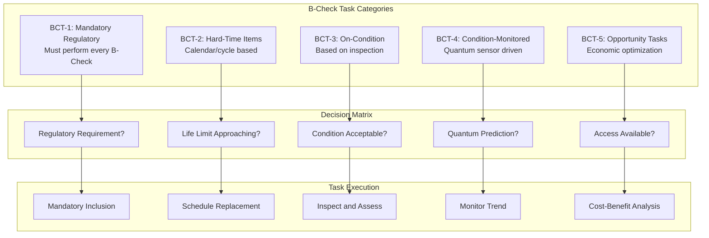

# 05-20-20-01 B-Check Tasks - AMPEL360 BWB-Q100

<p align="center">


</p>

---

## Document Control Information

**Document ID:** `05-20-20-01-BCheckTasks.md`  
**GQOIS ID:** `AS-M-PAX-BW-Q1H-BCH-TSK-MASTER`  
**ATA Chapter:** 05-20-20-01 (Time Limits - Scheduled Maintenance - B-Check - Tasks)  
**Classification:** Base Maintenance - B-Check Task Library  
**Version:** 1.0.0  
**Effective Date:** 2025-01-20  
**Revision Status:** Current Release  
**Approval Authority:** GAIA-QAO Chief Engineer & Base Maintenance Director  
**Distribution:** Base Maintenance, Engineering, Planning, Training  
**DIKE ID:** DIKE-05-20-20-01-BCHECK-TSK-001

---

## Table of Contents

1. [B-Check Task Overview](#1-b-check-task-overview)
2. [Structural Deep Inspection Tasks](#2-structural-deep-inspection-tasks)
3. [Powerplant Detailed Tasks](#3-powerplant-detailed-tasks)
4. [Systems Comprehensive Tasks](#4-systems-comprehensive-tasks)
5. [Avionics and Electrical Deep Checks](#5-avionics-and-electrical-deep-checks)
6. [Landing Gear and Hydraulics](#6-landing-gear-and-hydraulics)
7. [Interior and Emergency Systems](#7-interior-and-emergency-systems)
8. [Quantum System Maintenance](#8-quantum-system-maintenance)
9. [Special Inspections and Modifications](#9-special-inspections-and-modifications)
10. [Task Optimization and Performance](#10-task-optimization-and-performance)

---

## 1. B-Check Task Overview

### 1.1 B-Check Scope and Philosophy

The B-Check represents a comprehensive maintenance event that goes beyond routine A-Check inspections to include:
- Detailed structural inspections requiring access panel removal
- Component overhauls and replacements
- Deep system functional testing
- Quantum system calibration and validation
- Software updates and cybersecurity patches

### 1.2 Task Classification System



### 1.3 B-Check Task Numbering

#### Table 1.3-1: B-Check Task Identification Structure

| Position | Digits | Meaning | Example |
|----------|--------|---------|---------|
| 1-2 | XX | ATA Chapter | 53 (Fuselage) |
| 3-4 | XX | Section | 30 (Fuselage Structure) |
| 5-6 | XX | Subject | 01 (Crown) |
| 7-9 | XXX | Task Type | 400 (Detailed Inspection) |
| 10-12 | XXX | Check Code | 802 (B-Check) |

Example: 53-30-01-400-802 = Fuselage Crown Detailed Inspection B-Check Task

### 1.4 Task Duration and Resource Planning

```python
class BCheckTaskPlanner:
    def __init__(self):
        self.task_database = TaskDatabase()
        self.resource_optimizer = ResourceOptimizer()
        self.critical_path_analyzer = CriticalPathAnalyzer()
        self.quantum_scheduler = QuantumScheduler()
    
    def optimize_b_check_plan(self, aircraft_id, check_date):
        # Get all applicable tasks
        base_tasks = self.task_database.get_b_check_tasks(aircraft_id)
        additional_tasks = self.identify_additional_tasks(aircraft_id)
        
        # Quantum optimization
        quantum_recommended = self.quantum_scheduler.get_recommendations(
            aircraft_id=aircraft_id,
            health_scores=self.get_current_health_scores(aircraft_id),
            prediction_horizon=180  # days
        )
        
        # Combine all tasks
        all_tasks = self.merge_task_lists(
            base_tasks=base_tasks,
            additional_tasks=additional_tasks,
            quantum_tasks=quantum_recommended
        )
        
        # Optimize sequence
        optimized_sequence = self.critical_path_analyzer.optimize(
            tasks=all_tasks,
            constraints={
                'hangar_days': 3,
                'shifts': 2,
                'technicians': 20,
                'specialized_equipment': self.get_equipment_availability()
            }
        )
        
        # Resource leveling
        resource_plan = self.resource_optimizer.level_resources(
            task_sequence=optimized_sequence,
            skill_matrix=self.get_technician_skills(),
            parallel_work_limit=8  # Maximum parallel activities
        )
        
        return {
            'total_tasks': len(all_tasks),
            'critical_path_hours': optimized_sequence.critical_path_duration,
            'total_manhours': sum(task.manhours for task in all_tasks),
            'hangar_occupancy': optimized_sequence.calendar_days,
            'resource_plan': resource_plan,
            'task_sequence': optimized_sequence,
            'cost_estimate': self.calculate_cost(all_tasks, resource_plan)
        }
```

---

## 2. Structural Deep Inspection Tasks

### 2.1 Fuselage Structure B-Check Tasks

#### Table 2.1-1: Fuselage Structural Inspections

| Task Number | Description | Access Required | Duration | Special Tools | Finding Rate |
|-------------|-------------|-----------------|----------|---------------|--------------|
| **53-30-01-400-802** | Crown detailed inspection | Ceiling panels | 4.0 MH | Borescope, UT | 3.2% |
| **53-30-02-410-802** | Pressure dome crack detection | Aft bulkhead | 6.0 MH | Eddy current | 1.8% |
| **53-40-01-420-802** | Frame-to-skin attachment | Interior removal | 8.0 MH | Torque check | 2.5% |
| **53-50-01-430-802** | Door cutout reinforcement | Door removal | 12.0 MH | NDT equipment | 4.1% |
| **53-80-01-440-802** | BWB joint inspection | Special access | 10.0 MH | Quantum sensors | 2.3% |

#### 2.1.1 BWB-Specific Structural Inspection

```python
class BWBStructuralInspection:
    def __init__(self):
        self.quantum_strain_monitor = QuantumStrainMonitor()
        self.stress_analyzer = StressAnalyzer()
        self.ndt_system = NDTSystem()
        self.finding_processor = FindingProcessor()
    
    def perform_bwb_joint_inspection(self, zone_id):
        inspection_report = {
            'zone': zone_id,
            'date': datetime.now(),
            'quantum_predictions': [],
            'actual_findings': [],
            'correlation_score': 0
        }
        
        # Pre-inspection quantum analysis
        quantum_data = self.quantum_strain_monitor.get_zone_history(
            zone_id=zone_id,
            time_period=90  # days
        )
        
        # Identify high-stress areas
        stress_map = self.stress_analyzer.generate_stress_map(
            strain_data=quantum_data.strain_history,
            load_cycles=quantum_data.load_cycles,
            environmental_factors=quantum_data.environmental_exposure
        )
        
        # Predict potential issues
        predictions = self.predict_inspection_findings(
            stress_map=stress_map,
            material_properties=self.get_material_data(zone_id),
            fatigue_model=self.get_fatigue_model('BWB_joint')
        )
        
        inspection_report['quantum_predictions'] = predictions
        
        # Perform physical inspection
        for location in stress_map.high_stress_locations:
            # Visual inspection
            visual_result = self.perform_visual_inspection(location)
            
            # NDT if required
            if visual_result.requires_ndt or location.criticality > 8:
                ndt_result = self.ndt_system.inspect(
                    location=location,
                    method='ultrasonic',
                    sensitivity='high'
                )
                
                if ndt_result.indication_found:
                    finding = self.finding_processor.process_finding(
                        location=location,
                        indication=ndt_result,
                        stress_history=stress_map.get_stress_history(location),
                        criticality=self.assess_criticality(ndt_result, location)
                    )
                    inspection_report['actual_findings'].append(finding)
        
        # Calculate correlation
        inspection_report['correlation_score'] = self.calculate_correlation(
            predictions=predictions,
            actual_findings=inspection_report['actual_findings']
        )
        
        # Generate recommendations
        inspection_report['recommendations'] = self.generate_recommendations(
            findings=inspection_report['actual_findings'],
            stress_map=stress_map,
            next_check_interval=3000  # FH
        )
        
        return inspection_report
```

### 2.2 Wing Structure B-Check Tasks

#### Table 2.2-1: Wing Structural Deep Inspections

| Task Number | Description | Zone | Access | Duration | Equipment |
|-------------|-------------|------|--------|----------|-----------|
| **57-30-01-400-802** | Wing box inspection | Center | Fuel tank | 16.0 MH | Confined space |
| **57-40-01-410-802** | Spar cap crack detection | Root | Panel removal | 8.0 MH | Eddy current |
| **57-50-01-420-802** | Fuel boundary sealing | All tanks | Tank entry | 20.0 MH | Leak test |
| **57-60-01-430-802** | Control surface attach | Trailing edge | External | 6.0 MH | Torque/NDT |
| **57-80-01-440-802** | Composite delamination | Skin | Tap test | 10.0 MH | Ultrasonic |

### 2.3 Empennage Structure Tasks

#### Table 2.3-1: Tail Section B-Check Tasks

| Task Number | Description | Interval Override | Duration | Critical |
|-------------|-------------|-------------------|----------|----------|
| **55-30-01-400-802** | Horizontal stabilizer attachment | None | 6.0 MH | Yes |
| **55-40-01-410-802** | Elevator hinge inspection | None | 4.0 MH | Yes |
| **55-50-01-420-802** | Rudder attachment bolts | Torque check | 5.0 MH | Yes |
| **55-80-01-430-802** | Tail cone pressure bulkhead | None | 3.0 MH | No |

---

## 3. Powerplant Detailed Tasks

### 3.1 Engine B-Check Inspections

#### Table 3.1-1: Engine Deep Maintenance Tasks

| Task Number | Description | Equipment | Duration | Borescope | Quantum Data |
|-------------|-------------|-----------|----------|-----------|--------------|
| **71-00-01-400-802** | Module performance test | Test cell | 4.0 MH | No | Trend analysis |
| **72-00-01-410-802** | Hot section borescope | Borescope | 6.0 MH | Yes | Blade monitoring |
| **72-31-01-420-802** | Fan blade detailed | Penetrant | 8.0 MH | No | Vibration correlation |
| **72-32-01-430-802** | Compressor blade blend | Blend tools | 12.0 MH | Yes | FOD prediction |
| **72-61-01-440-802** | Combustor inspection | Borescope | 4.0 MH | Yes | Temperature map |
| **75-30-01-450-802** | Bleed valve rigging | Pressure test | 3.0 MH | No | Performance data |

#### 3.1.1 Quantum-Enhanced Engine Inspection

```python
class QuantumEngineInspection:
    def __init__(self):
        self.vibration_analyzer = QuantumVibrationAnalyzer()
        self.thermal_monitor = QuantumThermalMonitor()
        self.performance_predictor = PerformancePredictor()
        self.blade_health_system = BladeHealthSystem()
    
    def execute_hot_section_inspection(self, engine_sn):
        inspection_data = {
            'engine_sn': engine_sn,
            'inspection_date': datetime.now(),
            'quantum_assessment': {},
            'borescope_findings': [],
            'blend_requirements': [],
            'performance_delta': {}
        }
        
        # Pre-inspection quantum analysis
        vibration_signature = self.vibration_analyzer.get_signature(
            engine_sn=engine_sn,
            time_window=500  # Last 500 flight hours
        )
        
        thermal_profile = self.thermal_monitor.get_profile(
            engine_sn=engine_sn,
            locations=['HPT', 'LPT', 'Combustor']
        )
        
        # Predict problem areas
        predicted_issues = self.predict_hot_section_issues(
            vibration=vibration_signature,
            thermal=thermal_profile,
            cycles_since_overhaul=self.get_engine_cycles(engine_sn)
        )
        
        inspection_data['quantum_assessment'] = {
            'predicted_blade_issues': predicted_issues.blade_predictions,
            'thermal_distress_areas': predicted_issues.thermal_areas,
            'performance_degradation': predicted_issues.performance_loss
        }
        
        # Guide borescope inspection
        borescope_plan = self.generate_borescope_plan(
            predictions=predicted_issues,
            standard_zones=self.get_standard_inspection_zones(),
            time_available=6.0  # hours
        )
        
        # Execute borescope inspection
        for zone in borescope_plan.zones:
            finding = self.perform_borescope_inspection(
                engine_sn=engine_sn,
                zone=zone,
                acceptance_criteria=self.get_criteria(zone),
                quantum_baseline=predicted_issues.get_baseline(zone)
            )
            
            if finding.requires_action:
                inspection_data['borescope_findings'].append(finding)
                
                # Determine blend repair
                if finding.type == 'blade_damage':
                    blend_spec = self.calculate_blend_repair(
                        damage=finding,
                        blade_history=self.blade_health_system.get_history(
                            engine_sn, 
                            finding.stage, 
                            finding.blade_number
                        )
                    )
                    inspection_data['blend_requirements'].append(blend_spec)
        
        # Post-inspection performance validation
        inspection_data['performance_delta'] = self.validate_performance(
            pre_inspection=self.performance_predictor.get_baseline(engine_sn),
            post_inspection=self.performance_predictor.measure_current(engine_sn),
            quantum_prediction=predicted_issues.performance_loss
        )
        
        return inspection_data
```

### 3.2 APU B-Check Tasks

#### Table 3.2-1: APU Maintenance Tasks

| Task Number | Description | Duration | Special Requirements |
|-------------|-------------|----------|---------------------|
| **49-20-01-400-802** | APU hot section inspection | 4.0 MH | Borescope |
| **49-30-01-410-802** | Load compressor bearing | 2.0 MH | Vibration check |
| **49-50-01-420-802** | Oil system flush | 3.0 MH | New oil/filter |
| **49-90-01-430-802** | Control unit calibration | 2.0 MH | Test equipment |

---

## 4. Systems Comprehensive Tasks

### 4.1 Flight Control System B-Check

#### Table 4.1-1: Flight Control Deep Maintenance

| Task Number | Description | System | Duration | Test Required | Quantum Support |
|-------------|-------------|--------|----------|---------------|-----------------|
| **27-10-01-400-802** | Aileron actuator overhaul | Primary | 8.0 MH | Bench test | Load profile |
| **27-20-01-410-802** | Elevator feel unit cal | Feel | 4.0 MH | Force gauge | Usage data |
| **27-30-01-420-802** | Rudder PCU test | Rudder | 6.0 MH | Hydraulic rig | Position accuracy |
| **27-50-01-430-802** | Spoiler sequencing | Spoiler | 5.0 MH | Timing check | Deployment profile |
| **27-80-01-440-802** | FBW computer update | All | 3.0 MH | Validation | Software verification |

### 4.2 Environmental Control System

#### Table 4.2-1: ECS B-Check Tasks

| Task Number | Description | Component | Duration | Access |
|-------------|-------------|-----------|----------|---------|
| **21-30-01-400-802** | Pack overhaul inspection | ACM | 10.0 MH | Pack removal |
| **21-40-01-410-802** | Heat exchanger cleaning | Primary/Secondary | 6.0 MH | External |
| **21-50-01-420-802** | Cabin pressure controller | Outflow valves | 4.0 MH | Calibration |
| **21-60-01-430-802** | Duct insulation inspection | All zones | 8.0 MH | Panel removal |

### 4.3 Fuel System

#### Table 4.3-1: Fuel System B-Check Maintenance

| Task Number | Description | Location | Duration | Safety Requirements |
|-------------|-------------|----------|----------|-------------------|
| **28-20-01-400-802** | Tank entry inspection | All tanks | 24.0 MH | Confined space |
| **28-21-01-410-802** | Fuel pump overhaul | Center tank | 6.0 MH | Defuel required |
| **28-22-01-420-802** | Quantity probe calibration | All tanks | 8.0 MH | Test equipment |
| **28-40-01-430-802** | Surge tank inspection | Wing tips | 4.0 MH | Fuel tank entry |

---

## 5. Avionics and Electrical Deep Checks

### 5.1 Integrated Modular Avionics

#### Table 5.1-1: IMA B-Check Tasks

| Task Number | Description | System | Duration | Downtime | Updates |
|-------------|-------------|--------|----------|----------|---------|
| **42-10-01-400-802** | Core processor upgrade | IMA Core | 4.0 MH | 2.0 hrs | Firmware |
| **42-20-01-410-802** | Network switch inspection | AFDX | 3.0 MH | 1.0 hr | Config |
| **42-30-01-420-802** | I/O module calibration | All | 6.0 MH | 3.0 hrs | Software |
| **42-90-01-430-802** | Cybersecurity update | All | 2.0 MH | 1.0 hr | Patches |

### 5.2 Electrical Power Deep Maintenance

#### 5.2.1 Quantum-Enhanced Electrical Inspection

```python
class ElectricalBCheckTasks:
    def __init__(self):
        self.power_quality_analyzer = PowerQualityAnalyzer()
        self.thermal_scanner = ThermalImagingSystem()
        self.insulation_tester = InsulationTester()
        self.quantum_monitor = QuantumPowerMonitor()
    
    def perform_electrical_deep_check(self, aircraft_id):
        inspection_results = {
            'aircraft_id': aircraft_id,
            'inspection_date': datetime.now(),
            'power_quality': {},
            'thermal_anomalies': [],
            'insulation_resistance': {},
            'quantum_predictions': {}
        }
        
        # Quantum predictive analysis
        power_trends = self.quantum_monitor.analyze_trends(
            aircraft_id=aircraft_id,
            parameters=['voltage_stability', 'current_harmonics', 'power_factor'],
            time_period=180  # days
        )
        
        degradation_predictions = self.predict_electrical_degradation(
            trends=power_trends,
            component_age=self.get_component_ages(aircraft_id),
            environmental_exposure=self.get_environmental_factors(aircraft_id)
        )
        
        inspection_results['quantum_predictions'] = degradation_predictions
        
        # Power quality analysis
        for bus in ['AC_BUS_1', 'AC_BUS_2', 'DC_BUS_1', 'DC_BUS_2']:
            quality_data = self.power_quality_analyzer.analyze_bus(
                bus_id=bus,
                parameters={
                    'voltage_regulation': 0.02,  # 2% tolerance
                    'frequency_stability': 0.5,  # Hz
                    'harmonic_distortion': 0.05,  # 5% THD
                    'transient_response': 100  # microseconds
                }
            )
            inspection_results['power_quality'][bus] = quality_data
        
        # Thermal scanning of electrical panels
        panels_to_scan = self.get_electrical_panels()
        for panel in panels_to_scan:
            thermal_scan = self.thermal_scanner.scan_panel(
                panel_id=panel.id,
                baseline_temp=panel.normal_operating_temp,
                alert_threshold=10  # degrees C above normal
            )
            
            if thermal_scan.has_hot_spots:
                for hot_spot in thermal_scan.hot_spots:
                    anomaly = {
                        'panel': panel.id,
                        'location': hot_spot.location,
                        'temperature': hot_spot.temperature,
                        'severity': self.assess_thermal_severity(hot_spot),
                        'likely_cause': self.diagnose_thermal_issue(hot_spot),
                        'action_required': self.determine_action(hot_spot)
                    }
                    inspection_results['thermal_anomalies'].append(anomaly)
        
        # Insulation resistance testing
        critical_circuits = self.get_critical_circuits()
        for circuit in critical_circuits:
            insulation_result = self.insulation_tester.test_circuit(
                circuit_id=circuit.id,
                test_voltage=circuit.test_voltage,
                minimum_resistance=circuit.min_insulation_resistance
            )
            
            inspection_results['insulation_resistance'][circuit.id] = {
                'measured_resistance': insulation_result.resistance,
                'pass_fail': insulation_result.resistance > circuit.min_insulation_resistance,
                'trend': self.calculate_resistance_trend(circuit.id),
                'estimated_remaining_life': self.estimate_insulation_life(
                    current_resistance=insulation_result.resistance,
                    degradation_rate=self.calculate_degradation_rate(circuit.id)
                )
            }
        
        # Generate maintenance recommendations
        inspection_results['recommendations'] = self.generate_electrical_recommendations(
            power_quality=inspection_results['power_quality'],
            thermal_issues=inspection_results['thermal_anomalies'],
            insulation_status=inspection_results['insulation_resistance'],
            quantum_predictions=degradation_predictions
        )
        
        return inspection_results
```

#### Table 5.2-1: Electrical System B-Check Tasks

| Task Number | Description | System | Duration | Test Equipment |
|-------------|-------------|--------|----------|----------------|
| **24-00-01-400-802** | Generator detailed inspection | All GENs | 6.0 MH | Megger, scope |
| **24-30-01-410-802** | Battery deep cycle test | Main/APU | 8.0 MH | Load bank |
| **24-50-01-420-802** | Bus tie contactor overhaul | All | 4.0 MH | Contact resistance |
| **24-60-01-430-802** | Wire bundle inspection | Critical | 12.0 MH | Visual/thermal |

---

## 6. Landing Gear and Hydraulics

### 6.1 Landing Gear B-Check Tasks

#### Table 6.1-1: Landing Gear Deep Maintenance

| Task Number | Description | Component | Duration | Special Requirements |
|-------------|-------------|-----------|----------|---------------------|
| **32-10-01-400-802** | Gear retraction test | All gears | 4.0 MH | Aircraft on jacks |
| **32-21-01-410-802** | Shock strut overhaul | MLG | 16.0 MH | Nitrogen service |
| **32-30-01-420-802** | Wheel bearing inspection | All wheels | 12.0 MH | NDT required |
| **32-40-01-430-802** | Brake overhaul | All | 18.0 MH | New linings |
| **32-50-01-440-802** | Steering system calibration | NLG | 6.0 MH | Steering test box |

### 6.2 Hydraulic System B-Check

#### Table 6.2-1: Hydraulic System Tasks

| Task Number | Description | System | Duration | Equipment |
|-------------|-------------|--------|----------|-----------|
| **29-10-01-400-802** | Pump case drain check | All pumps | 3.0 MH | Flow meter |
| **29-20-01-410-802** | Filter element replace | All systems | 4.0 MH | New filters |
| **29-30-01-420-802** | Accumulator service | All | 6.0 MH | Nitrogen |
| **29-40-01-430-802** | Reservoir cleaning | All | 8.0 MH | System drain |

---

## 7. Interior and Emergency Systems

### 7.1 Cabin Interior B-Check

#### Table 7.1-1: Interior Inspection Tasks

| Task Number | Description | Area | Duration | Compliance |
|-------------|-------------|------|----------|------------|
| **25-20-01-400-802** | Seat track inspection | All rows | 8.0 MH | AD required |
| **25-30-01-410-802** | PSU function test | All units | 6.0 MH | Safety requirement |
| **25-60-01-420-802** | Emergency lighting | Entire cabin | 4.0 MH | 90-day requirement |
| **33-40-01-430-802** | Cockpit emergency vision | Windows | 2.0 MH | Clarity test |

### 7.2 Emergency Equipment

#### Table 7.2-1: Emergency Systems B-Check

| Task Number | Description | Equipment | Duration | Test/Replace |
|-------------|-------------|-----------|----------|--------------|
| **25-60-02-400-802** | Slide deployment test | 25% of slides | 12.0 MH | Deployment |
| **35-20-01-410-802** | Portable oxygen test | All bottles | 4.0 MH | Hydrostatic |
| **26-10-01-420-802** | Fire extinguisher service | All units | 3.0 MH | Weight/pressure |
| **31-60-01-430-802** | ELT battery replacement | All ELTs | 2.0 MH | Replace |

---

## 8. Quantum System Maintenance

### 8.1 Quantum Processing Unit Maintenance

#### Table 8.1-1: QPU B-Check Tasks

| Task Number | Description | System | Duration | Specialized Equipment |
|-------------|-------------|--------|----------|---------------------|
| **99-10-01-400-802** | QPU coherence optimization | Main QPU | 8.0 MH | Quantum diagnostic suite |
| **99-10-02-410-802** | Cryogenic system service | Cooling | 12.0 MH | Helium recovery unit |
| **99-10-03-420-802** | Quantum memory validation | Q-Memory | 6.0 MH | State tomography |
| **99-10-04-430-802** | Error correction tuning | QEC | 4.0 MH | Calibration system |

#### 8.1.1 QPU Maintenance Procedure

```python
class QPUMaintenanceTask:
    def __init__(self):
        self.qpu_diagnostic = QPUDiagnosticSystem()
        self.cryogenic_system = CryogenicController()
        self.calibration_system = QuantumCalibrationSystem()
        self.performance_tracker = QPUPerformanceTracker()
    
    def perform_qpu_b_check_maintenance(self, qpu_id):
        maintenance_report = {
            'qpu_id': qpu_id,
            'maintenance_date': datetime.now(),
            'pre_maintenance_performance': {},
            'maintenance_actions': [],
            'post_maintenance_performance': {},
            'recommendations': []
        }
        
        # Pre-maintenance baseline
        baseline_performance = self.qpu_diagnostic.full_system_check(qpu_id)
        maintenance_report['pre_maintenance_performance'] = {
            'coherence_time_t1': baseline_performance.t1,
            'coherence_time_t2': baseline_performance.t2,
            'gate_fidelity_single': baseline_performance.single_qubit_fidelity,
            'gate_fidelity_two': baseline_performance.two_qubit_fidelity,
            'readout_fidelity': baseline_performance.readout_fidelity,
            'crosstalk_matrix': baseline_performance.crosstalk
        }
        
        # Cryogenic system service
        cryo_service = self.service_cryogenic_system(qpu_id)
        maintenance_report['maintenance_actions'].append({
            'action': 'Cryogenic system service',
            'details': cryo_service,
            'duration': 4.0  # hours
        })
        
        # Quantum calibration
        calibration_results = self.calibration_system.full_calibration(
            qpu_id=qpu_id,
            calibration_sequence=[
                'frequency_tuning',
                'pi_pulse_calibration',
                'crosstalk_compensation',
                'readout_optimization',
                'gate_timing_adjustment'
            ]
        )
        
        maintenance_report['maintenance_actions'].append({
            'action': 'Full quantum calibration',
            'details': calibration_results,
            'duration': 3.0  # hours
        })
        
        # Error correction optimization
        qec_optimization = self.optimize_error_correction(
            qpu_id=qpu_id,
            target_logical_error_rate=1e-6,
            max_physical_qubits=1000
        )
        
        maintenance_report['maintenance_actions'].append({
            'action': 'QEC optimization',
            'details': qec_optimization,
            'duration': 2.0  # hours
        })
        
        # Post-maintenance validation
        post_performance = self.qpu_diagnostic.full_system_check(qpu_id)
        maintenance_report['post_maintenance_performance'] = {
            'coherence_time_t1': post_performance.t1,
            'coherence_time_t2': post_performance.t2,
            'gate_fidelity_single': post_performance.single_qubit_fidelity,
            'gate_fidelity_two': post_performance.two_qubit_fidelity,
            'readout_fidelity': post_performance.readout_fidelity,
            'improvement_percentage': self.calculate_improvement(
                baseline_performance, 
                post_performance
            )
        }
        
        # Generate recommendations
        maintenance_report['recommendations'] = self.generate_qpu_recommendations(
            performance_trend=self.performance_tracker.get_trend(qpu_id),
            current_performance=post_performance,
            component_health=self.assess_component_health(qpu_id)
        )
        
        return maintenance_report
```

### 8.2 Quantum Sensor Network

#### Table 8.2-1: Quantum Sensor B-Check Tasks

| Task Number | Description | Coverage | Duration | Accuracy Target |
|-------------|-------------|----------|----------|-----------------|
| **99-20-01-400-802** | Sensor network calibration | All zones | 16.0 MH | ±0.1% |
| **99-20-02-410-802** | Structural sensor validation | Critical | 8.0 MH | ±0.05% |
| **99-20-03-420-802** | Environmental sensor service | All | 6.0 MH | ±0.5% |
| **99-20-04-430-802** | Data fusion optimization | System | 4.0 MH | 99.9% |

### 8.3 Quantum Communication System

#### Table 8.3-1: QKD System B-Check

| Task Number | Description | Component | Duration | Security Level |
|-------------|-------------|-----------|----------|----------------|
| **99-30-01-400-802** | QKD protocol update | Software | 2.0 MH | Quantum-safe |
| **99-30-02-410-802** | Photon source calibration | Hardware | 4.0 MH | >95% fidelity |
| **99-30-03-420-802** | Quantum channel alignment | Optical | 6.0 MH | <1 mrad |
| **99-30-04-430-802** | Security audit | Full system | 8.0 MH | Zero vulnerabilities |

---

## 9. Special Inspections and Modifications

### 9.1 Service Bulletin Incorporation

#### Table 9.1-1: Mandatory Service Bulletins for B-Check

| SB Number | Title | ATA | Duration | Compliance |
|-----------|-------|-----|----------|------------|
| **SB-53-001** | BWB Joint Reinforcement | 53 | 20.0 MH | Before 5,000 FH |
| **SB-71-002** | Engine Mount Upgrade | 71 | 12.0 MH | Next B-Check |
| **SB-99-001** | Quantum Sensor Software | 99 | 4.0 MH | Immediate |
| **SB-27-003** | FBW Software Update | 27 | 6.0 MH | Within 90 days |

### 9.2 Aging Aircraft Inspections

#### Table 9.2-1: Age-Related B-Check Tasks

| Task Number | Description | Threshold | Duration | Repeat Interval |
|-------------|-------------|-----------|----------|-----------------|
| **53-00-00-500-802** | Widespread fatigue damage | 20,000 FC | 40.0 MH | Every 3,000 FC |
| **57-00-00-510-802** | Corrosion prevention program | 10 years | 24.0 MH | Every 2 years |
| **24-00-00-520-802** | Wire degradation assessment | 15 years | 16.0 MH | Every 3 years |
| **99-00-00-530-802** | Quantum system aging | 5 years | 12.0 MH | Every year |

---

## 10. Task Optimization and Performance

### 10.1 B-Check Performance Metrics

#### 10.1.1 Task Effectiveness Monitoring

```python
class BCheckPerformanceAnalyzer:
    def __init__(self):
        self.task_database = TaskDatabase()
        self.finding_analyzer = FindingAnalyzer()
        self.cost_tracker = CostTracker()
        self.quantum_correlator = QuantumCorrelator()
    
    def analyze_b_check_effectiveness(self, time_period_months=12):
        performance_report = {
            'analysis_period': f'{time_period_months} months',
            'total_b_checks': 0,
            'task_effectiveness': {},
            'cost_analysis': {},
            'optimization_opportunities': [],
            'quantum_correlation_score': 0
        }
        
        # Get all B-checks in period
        b_checks = self.task_database.get_b_checks(
            start_date=datetime.now() - timedelta(days=30*time_period_months),
            end_date=datetime.now()
        )
        
        performance_report['total_b_checks'] = len(b_checks)
        
        # Analyze each task type
        task_types = self.task_database.get_all_b_check_tasks()
        
        for task in task_types:
            task_performance = {
                'executions': 0,
                'findings': 0,
                'finding_rate': 0,
                'average_duration': 0,
                'cost_per_finding': 0,
                'quantum_prediction_accuracy': 0
            }
            
            # Get task execution data
            executions = self.task_database.get_task_executions(
                task_id=task.id,
                check_ids=[check.id for check in b_checks]
            )
            
            task_performance['executions'] = len(executions)
            
            # Analyze findings
            findings = self.finding_analyzer.get_findings_by_task(task.id)
            task_performance['findings'] = len(findings)
            task_performance['finding_rate'] = (
                len(findings) / len(executions) if executions else 0
            )
            
            # Duration analysis
            durations = [exec.actual_duration for exec in executions]
            task_performance['average_duration'] = (
                sum(durations) / len(durations) if durations else 0
            )
            
            # Cost analysis
            task_cost = self.cost_tracker.calculate_task_cost(
                labor_hours=task_performance['average_duration'],
                materials=task.material_cost,
                overhead_rate=1.5
            )
            
            task_performance['cost_per_finding'] = (
                task_cost / task_performance['finding_rate'] 
                if task_performance['finding_rate'] > 0 
                else float('inf')
            )
            
            # Quantum correlation
            if task.quantum_monitored:
                predictions = self.quantum_correlator.get_predictions(task.id)
                actual_findings = findings
                task_performance['quantum_prediction_accuracy'] = (
                    self.calculate_prediction_accuracy(predictions, actual_findings)
                )
            
            performance_report['task_effectiveness'][task.id] = task_performance
            
            # Identify optimization opportunities
            if task_performance['finding_rate'] < 0.01:  # Less than 1%
                performance_report['optimization_opportunities'].append({
                    'task_id': task.id,
                    'recommendation': 'Consider interval extension',
                    'potential_savings': task_cost * 0.5
                })
            elif task_performance['cost_per_finding'] > 50000:
                performance_report['optimization_opportunities'].append({
                    'task_id': task.id,
                    'recommendation': 'Review inspection method',
                    'potential_savings': task_cost * 0.3
                })
        
        # Calculate overall quantum correlation
        performance_report['quantum_correlation_score'] = (
            self.calculate_overall_quantum_correlation(
                task_performances=performance_report['task_effectiveness']
            )
        )
        
        return performance_report
```

### 10.2 Continuous Improvement

#### Table 10.2-1: B-Check Task Optimization History

| Task Category | Original Duration | Current Duration | Improvement | Method |
|---------------|------------------|------------------|-------------|---------|
| Structural Inspections | 180 MH | 140 MH | 22% | Quantum guidance |
| Engine Borescope | 8 MH | 6 MH | 25% | AI image analysis |
| System Tests | 60 MH | 45 MH | 25% | Automated testing |
| Documentation | 20 MH | 8 MH | 60% | Digital integration |
| **Total B-Check** | **380 MH** | **285 MH** | **25%** | **Combined** |

### 10.3 Future Developments

#### Table 10.3-1: Planned B-Check Enhancements

| Enhancement | Target Date | Expected Benefit | Investment Required |
|-------------|-------------|------------------|-------------------|
| Robotic Inspections | 2026 Q2 | 30% reduction in structural inspection time | $2.5M |
| Quantum Prediction 2.0 | 2026 Q4 | 50% improvement in finding prediction | $1.8M |
| Automated Repairs | 2027 Q2 | 40% reduction in standard repairs | $3.2M |
| Holographic Guidance | 2027 Q4 | 25% reduction in training time | $1.5M |

---

## Appendices

### Appendix A: B-Check Task Code Reference

```
B-Check Specific Task Codes:
-400- : Detailed visual inspection requiring disassembly
-410- : Component overhaul/deep maintenance
-420- : Calibration and adjustment
-430- : Life-limited component replacement
-440- : Modification incorporation
-450- : Special inspection (age, event-driven)
-460- : Software/firmware update
-470- : Deep cleaning/preservation
-480- : Load test/proof test
-490- : Comprehensive functional test
```

### Appendix B: Critical Path Analysis

#### B.1 Typical B-Check Critical Path

```
Day 1:
- Aircraft arrival and positioning (2.0 hrs)
- Power down and safety (1.0 hr)
- Access panel removal (4.0 hrs)
- Begin structural inspections (8.0 hrs)

Day 2:
- Continue structural inspections (8.0 hrs)
- Begin system inspections (6.0 hrs)
- Engine borescope (6.0 hrs parallel)
- Quantum system maintenance (8.0 hrs parallel)

Day 3:
- Complete remaining inspections (6.0 hrs)
- Perform repairs/adjustments (8.0 hrs)
- System functional tests (6.0 hrs)
- Documentation and close-out (4.0 hrs)
- Release to service (2.0 hrs)
```

### Appendix C: Resource Requirements Summary

#### C.1 Typical B-Check Resources

| Resource Type | Quantity | Skills Required | Shift Coverage |
|---------------|----------|-----------------|----------------|
| B1 Engineers | 8 | Type-rated, B-Check qualified | 2 shifts |
| B2 Technicians | 6 | Avionics, quantum systems | 2 shifts |
| Structures | 4 | Composite, NDT | Day shift |
| QA Inspectors | 3 | RII authorized | All shifts |
| Support | 6 | GSE, logistics | All shifts |
| **Total** | **27** | **Multiple disciplines** | **24-hour coverage** |

---

## Document Control and Revision History

### Approval Signatures

| Role | Name | Signature | Date |
|------|------|-----------|------|
| **Chief Engineer** | Dr. M. Chen | [Digital Signature] | 2025-01-20 |
| **Base Maintenance Director** | J. Thompson | [Digital Signature] | 2025-01-20 |
| **Quality Manager** | S. Patel | [Digital Signature] | 2025-01-20 |
| **Quantum Systems Lead** | Dr. A. Kowalski | [Digital Signature] | 2025-01-20 |

### Revision History

| Version | Date | Author | Description |
|---------|------|--------|-------------|
| 1.0.0 | 2025-01-20 | GAIA-QAO Tech Team | Initial B-Check task library |

### Distribution List

- Base Maintenance (All Stations)
- Heavy Maintenance Facilities
- Engineering Task Group
- Planning Department
- Training Department
- Quality Assurance
- Regulatory Compliance
- Quantum Systems Team

---

**End of Document**

*This document contains proprietary information of GAIA-QAO and is protected by applicable copyright laws. Unauthorized reproduction or distribution is prohibited.*
