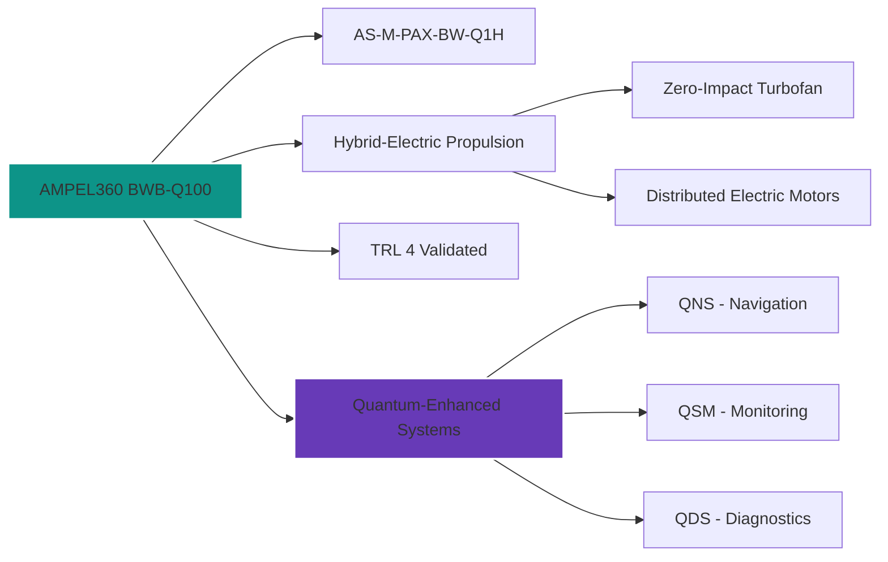
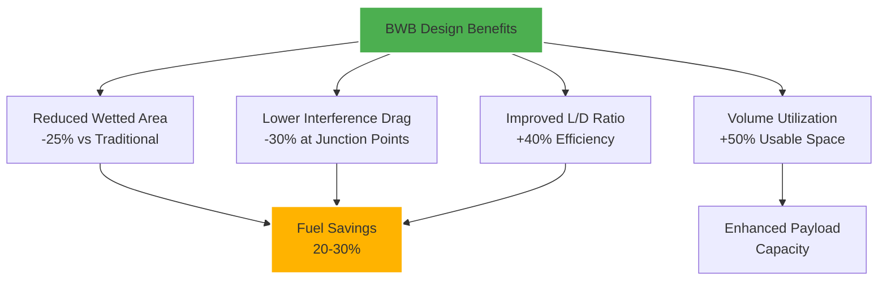
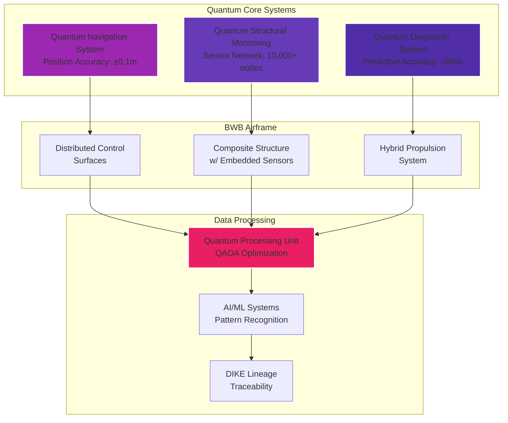
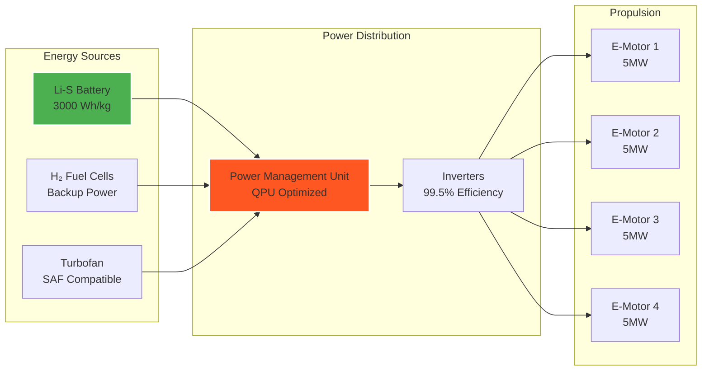
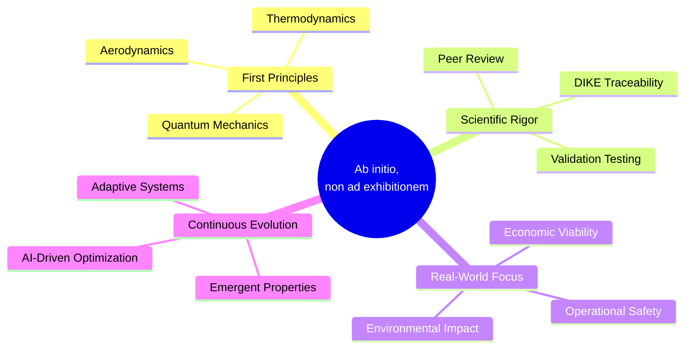
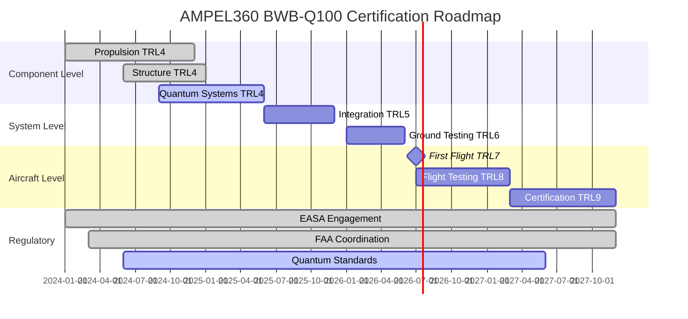
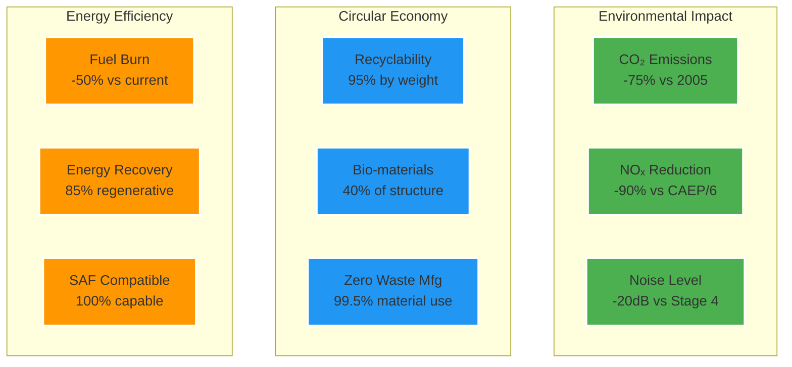
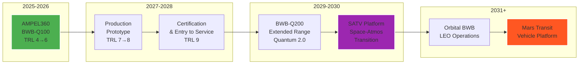

# BWB Aircraft Overview for Q-AIR Division

**Author:** Amedeo Pelliccia © GAIA-QAO / Quantum Aerospace Organization

**Document ID:** GQOIS-QAIR-DOC-002  
**INFOCODE:** QAO-BWB-OVR-001  
**Version:** 1.0.0  
**Related:** AMPEL360 Technical Data Manual (TDM), ATA 53 - Fuselage, ICD-QNS-FCS, DPM&A Specifications

---

## Executive Summary

The Quantum Aerospace Organization (GAIA-QAO) is pioneering the next generation of aerial mobility through **Blended Wing Body (BWB)** aircraft designs. This document provides a strategic overview of BWB technology, emphasizing its integration with GAIA-QAO's quantum-enhanced systems and advanced material science.

### AMPEL360 BWB-Q100 Quick Reference



---

## BWB Fundamentals

### Traditional vs. BWB Configuration Comparison

```
Traditional Aircraft                    BWB Aircraft
     ___                                  _____________
    /   \___________                    /               \
   |  O  |_________|====>              |       O O       |====>
    \___/                               \_____________/
    
Distinct fuselage & wings             Integrated lifting body
Limited lifting surface               Entire body generates lift
Higher drag coefficient               Optimized aerodynamics
```

### Aerodynamic Efficiency Visualization



---

## Quantum-Enhanced BWB Systems

### System Integration Architecture



### QNS Integration for BWB Flight Dynamics

#### Sensor Distribution Pattern

```
         BWB Top View - QNS Sensor Layout
    ←─────────────── 80m Wingspan ──────────────→
    
    ╔═══════════════════════════════════════════╗
    ║  Q₁ ─────── Q₂ ─────── Q₃ ─────── Q₄    ║
    ║   │         │         │         │       ║
    ║  Q₅ ─────── Q₆ ─────── Q₇ ─────── Q₈    ║ ← Quantum
    ║   │    ╔════════════════╗      │       ║   Sensors
    ║  Q₉ ───║  Passenger/Cargo ║─── Q₁₀      ║
    ║   │    ║      Cabin      ║      │       ║
    ║  Q₁₁ ──║                 ║──── Q₁₂      ║
    ║   │    ╚════════════════╝      │       ║
    ║  Q₁₃ ────── Q₁₄ ────── Q₁₅ ──── Q₁₆     ║
    ╚═══════════════════════════════════════════╝
                         ▼
                    Engines (4x)
```

### QSM Network Stress Analysis Visualization

```mermaid
heatmap
    title "BWB Structural Stress Distribution (Real-time QSM Data)"
    x-axis ["Leading Edge", "Quarter Chord", "Mid Chord", "Three-Quarter", "Trailing Edge"]
    y-axis ["Root", "Inner Wing", "Mid Span", "Outer Wing", "Tip"]
    color-scheme "YlOrRd"
    [[45, 62, 78, 65, 40],
     [58, 85, 92, 88, 52],
     [72, 95, 98, 95, 68],
     [58, 88, 92, 85, 55],
     [42, 65, 75, 62, 38]]
```

### Hybrid-Electric Propulsion System Architecture



---

## GAIA-QAO BWB Innovation Framework

### Design Philosophy Visualization



### Certification Path Timeline



### Sustainability Metrics Dashboard



---

## Technical Specifications Preview

### AMPEL360 BWB-Q100 Key Specifications

| Parameter | Value | Quantum Enhancement |
|-----------|-------|-------------------|
| **Wingspan** | 80m | QSM-monitored flex optimization |
| **Length** | 45m | - |
| **MTOW** | 380,000 kg | QPU weight distribution |
| **Cruise Speed** | Mach 0.85 | QNS precision control |
| **Range** | 15,000 km | QDS efficiency optimization |
| **Passengers** | 450 (3-class) | Quantum climate control |
| **Cargo Volume** | 850 m³ | AI-optimized loading |
| **L/D Ratio** | 25:1 | QAOA aerodynamic optimization |

### System Integration Matrix

```mermaid
heatmap
    title "System Interdependency Matrix (1=Low, 5=Critical)"
    x-axis ["QNS", "QSM", "QDS", "Propulsion", "Structure", "Avionics"]
    y-axis ["QNS", "QSM", "QDS", "Propulsion", "Structure", "Avionics"]
    [[0, 3, 4, 5, 2, 5],
     [3, 0, 3, 2, 5, 3],
     [4, 3, 0, 5, 4, 4],
     [5, 2, 5, 0, 3, 4],
     [2, 5, 4, 3, 0, 2],
     [5, 3, 4, 4, 2, 0]]
```

---

## Future Roadmap

### Technology Evolution Path



### Near-Space Integration Concept

```
        Space-Atmospheric Transition Profile
    
    100 km ─ ─ ─ ─ ─ ─ ─ ─ ─ ─ ─ ─ ─ ─ ─ ─ ─ Kármán Line
             ╱                               ╲
    80 km   ╱    SATV Operating Envelope      ╲
           ╱                                   ╲
    60 km  ──────────────────────────────────────
          │                                     │
    40 km │      BWB-Q300 SATV Variant        │
          │   Quantum Scramjet Propulsion      │
    20 km │                                     │
          │   Standard BWB-Q100/200 Ceiling    │
    0 km  └─────────────────────────────────────┘
          Conventional Airports    Spaceports
```

### Performance Projection Timeline

```mermaid
line
    title "BWB Performance Evolution (2025-2035)"
    x-axis [2025, 2026, 2027, 2028, 2029, 2030, 2031, 2032, 2033, 2034, 2035]
    y-axis "Performance Index (%)" 0 --> 200
    "Fuel Efficiency" [100, 110, 125, 140, 155, 170, 180, 185, 190, 195, 200]
    "Quantum System Integration" [20, 35, 50, 70, 85, 100, 120, 140, 160, 180, 195]
    "Autonomous Capability" [10, 20, 30, 45, 60, 75, 90, 100, 110, 120, 130]
```

---

## Appendix: Visual Quick Reference Guide

### BWB vs Traditional Metrics Comparison

```mermaid
radar
    title "BWB-Q100 vs Traditional Wide-body"
    labels ["Fuel Efficiency", "Passenger Comfort", "Cargo Capacity", "Environmental Impact", "Operating Cost", "Safety Systems"]
    "Traditional Aircraft" [60, 70, 65, 50, 60, 80]
    "AMPEL360 BWB-Q100" [95, 85, 90, 95, 85, 98]
```

### Quantum System Status Dashboard

```
┌─────────────────────────────────────────────────────┐
│           QUANTUM SYSTEMS STATUS MONITOR            │
├─────────────────────────────────────────────────────┤
│ QNS │ ████████████████████░░ │ 87% │ OPERATIONAL   │
│ QSM │ ███████████████████░░░ │ 82% │ OPERATIONAL   │
│ QDS │ █████████████████████░ │ 94% │ OPERATIONAL   │
│ QPU │ ████████████████░░░░░░ │ 76% │ CALIBRATING   │
├─────────────────────────────────────────────────────┤
│ Overall System Health: 84.75% │ Status: NOMINAL     │
└─────────────────────────────────────────────────────┘
```

---

*This document is part of the GAIA-QAO knowledge base and is subject to continuous improvement through quantum-enhanced optimization algorithms.*
