**## Hi there 👋
**Author:** Amedeo Pelliccia
© GAIA-QAO / Quantum Aerospace Organization

---

<p align="center">
  <a href="https://github.com/Robbbo-T/">
    
  </a>
</p>

---

## Quantum Aerospace Organization Structure

The **Quantum Aerospace Organization (GAIA‑QAO)** comprises six federated modules (virtual teams), each operating synergistically across key aerospace and quantum domains:

- **GAIA-Q‑AIR**: Quantum-enhanced intelligent flight systems, avionics, and mission optimization.
- **GAIA‑Q-SPACE**: Orbital and vector systems, mechanics, satellite AI agents, and quantum-secure communication frameworks.
- **GAIA-Q-GreenTech**: Sustainable aerospace materials, energy efficiency models, and CO₂-reduction strategies.
- **GAIA‑Q-HPC**: High-performance computing infrastructure for quantum simulation, digital twins, and agentic orchestration.
- **GAIA‑SCIREF**: Scientific research team focusing on emerging technologies, ontology, ethics, and experimental models.
- **GAIA‑Q-Data-Governance**: Includes the GA-SToP-CO₂ Steering Committee, Sustainability Integration Board, Emissions Quantification Working Group, Resource Sustainability Working Group, Materials Science Advisory Board, Systems Integration Working Group, and Implementation Working Group.

---

## 🌐 Quick Access Links

- [Gaia‑Q-Air](https://github.com/Gaia-Q-Air)
- [Gaia‑Q-Space](https://github.com/Gaia-Q-Space)
- [Gaia‑Q-GreenTech](https://github.com/Gaia-Q-GreenTech)
- [Gaia‑Q-High‑Performance‑Computing](https://github.com/Gaia-Q-High-Performance-Computing)
- [Gaia‑Science-Research](https://github.com/Gaia-Science-Research)
- [Gaia‑Q-Data-Governance](https://github.com/Gaia-Q-Data-Governance)

---

## 📄 Project Status & Metadata

[](#)
[](./CHANGELOG.md)
[](#)
[](#)

---

<p align="center">
  <a href="https://github.com/Gaia-Q-Air">
    
  </a>
</p>

---
---
_The following is the GAIA-QAO Aerospace Documentation (Conceptual Master Version 0.8.0)._
---

# GAIA-QAO Aerospace Documentation
## Aerospace General Index (AGI)

## Part 0: Framework Overview
    0.1 Vision Statement
    0.2 Guiding Principles & Philosophy
    0.3 Documentation Architecture
    0.4 Key Components of the Documentation Framework
    0.5 Governance Model for the Open Source Project
    0.6 High-Level Implementation Strategy
    0.7 Envisioned Potential Impact

## Part 1: Programming Languages, Development Environments, and Libraries in Aerospace and Defense Software
    1.1 Introduction
    1.2 Common Programming Languages in Aerospace Systems
        1.2.1 Ada and SPARK: Design for Safety and High Integrity
        1.2.2 C and C++: Prevalence, Applications, and Safety Challenges
        1.2.3 Legacy Languages: Fortran, COBOL, JOVIAL and Modernization
        1.2.4 Emerging Languages: The Potential of Rust for Secure Systems
        1.2.5 Scripting and Specialized Languages: Python, HDL, and Others
        (Includes Table 1: Language Comparison)
    1.3 Development Environments and Toolchains
        1.3.1 Integrated Development Environments (IDEs)
        1.3.2 Compilers and Debuggers
        1.3.3 Static Analysis and Verification Tools
        1.3.4 Tool Qualification (DO-330 / ED-215)
        1.3.5 Configuration Management and Build Systems
        (Includes Table 2: Dev Tools Examples)
    1.4 Real-Time Operating Systems and Avionics Frameworks
        1.4.1 ARINC 653 Partitioned RTOS
        1.4.2 Standardized APIs and Middleware (ARINC 653, FACE, DDS)
        1.4.3 Communication Libraries and Data Buses (MIL-STD-1553, ARINC 429, AFDX, SpaceWire)
        1.4.4 Geospatial and Mission-Specific Libraries
    1.5 Certification Standards and Their Impact
        1.5.1 DO-178C / ED-12C – Objectives, DALs, and Key Supplements
        1.5.2 DO-254 – Design Assurance for Airborne Electronic Hardware
        1.5.3 MIL-STD-498 and MIL-STD-882 (System Safety)
        1.5.4 NASA and ESA Standards (NPR 7150.2, ECSS)
        1.5.5 Addressing Multi-Core Processors: CAST-32A and AMC 20-193
        (This AGI was updated after user feedback on Turn 123 to better reflect the mapping of the "Prose Report" to Part 1. Original Table 3 and 6 from prose report are implicitly covered within their respective sections if not called out as separate table subsections here).
    1.6 Civil vs. Military Systems: Key Differences
        1.6.1 Regulatory Oversight & Standards
        1.6.2 Security Imperatives
        1.6.3 Operational Requirements and Environment
        1.6.4 Impact on Technology Choices & Development Lifecycles
    1.7 Software in Domain-Specific Applications
        1.7.1 Embedded Systems: Flight Control, Engine Management, Navigation
        1.7.2 Simulation Systems: Aerodynamics, Orbital Mechanics, Flight Training
        1.7.3 Mission Planning Systems: Architectures, Geospatial Data, Backend Libraries
        1.7.4 Ground Control Systems: UAV GCS, Spacecraft Operations, ATM
    1.8 Historical Evolution and Legacy Systems
    1.9 Conclusion and Strategic Recommendations
        1.9.1 Key Conclusions on Aerospace & Defense Software Ecosystem
        1.9.2 High-Level Recommendations for Technology Adoption and Standards Compliance
    1.10 References (Conceptual)

## Part 2: Hardware-in-the-Loop (HIL) Thinking Specification
    2.0 IDEA SUMMARY: Hardware-in-the-Loop (HIL) Thinking
    2.1 Introduction (to HIL Thinking Specification)
    2.2 Core Principles of HIL Thinking
    2.3 Implementation Example: Flight AI Copilot & Actuator Fault
    2.4 Active Inference Loop Architecture (with Mermaid Diagram)
    2.5 Technical Requirements for HIL Thinking
    2.6 Benefits of HIL Thinking
    2.7 Integration with GAIA-Q Architecture
    2.8 Implementation Roadmap for HIL Thinking
    2.9 Conclusion (HIL Thinking Specification)

## Part 3: Object Identification System
    3.1 System Overview
    3.2 Tier 1: Top-Level Object Identification
        3.2.1 Top-Level Object ID Structure (`DO-A-CCC-ST-MDL-SSSSS-CC`)
        3.2.2 Component Descriptions (DO, A, CCC, ST-ObjectCategory, MDL-ObjectModel)
    3.3 Tier 2: Subsystem Identification
        3.3.1 Subsystem ID Structure Concept (`Parent_ID :: SSS-MDLs-SERs-CCs`)
        3.3.2 Component Descriptions (SSS-SubsystemType, MDLs-SubsystemModel, SERs, CCs)
    3.4 Database Implementation (General Overview for both Tiers)
    3.5 ID Formation Process (Examples for both Tiers)
    3.6 Registry Management (Considerations for both Tiers)

## Part 4: Top-Level Object Model Registry
    4.1 Model Code Structure for Top-Level Objects (`[G][N][V]`)
    4.2 Air Systems (AS) Top-Level Object Models (Expanded Catalog)
        4.2.1 Passenger Transport (PAX) Models
        4.2.2 Cargo Transport (CGO) Models
        4.2.3 Intelligence, Surveillance, Reconnaissance (ISR) Models
        4.2.4 Scientific Research (SCI) Models
        4.2.5 Utility (UTL) Models
        4.2.6 Recreational & Sport (REC) Models
        4.2.7 Experimental (XPR) Models
        4.2.8 Lighter Than Air (LTA) Models
        4.2.9 Military Aircraft (MIL) Models
    4.3 Space Systems (SP) Top-Level Object Models (Expanded Catalog)
        4.3.1 Satellite (SAT) Models
        4.3.2 Orbital Platform/Vehicle (ORB) Models
        4.3.3 Launch System (LCH) Models
        4.3.4 Probe (PRB) Models
        4.3.5 Experimental (Space) (XPS) Models
        4.3.6 Space Defense (DEF) Models
    4.4 Implementation Guidelines (Top-Level Object Models)

## Part 5: Subsystem Identification & Registry
    5.1 Defining Subsystem Type Codes (SSS)
    5.2 Subsystem Model Coding (`MDLs`)
    5.3 Subsystem Serialization (`SERs`)
    5.4 Example Subsystem Catalog Entries
        5.4.1 Avionics Subsystems
        5.4.2 Propulsion Subsystems
        5.4.3 Structural Subsystems
    5.5 Database Considerations for Subsystems

## Part 6: Configuration Management
    6.1 Configuration Code Structure (`[T][N]`)
    6.2 Standard Configuration Types
    6.3 Domain-Specific Configurations
    6.4 Configuration Management in Registry (for Top-Level Objects and Subsystems)

## Part 7: Database Schema
    7.1 Core ID Component Tables (for Top-Level Objects)
    7.2 Subsystem-Related Tables
    7.3 Object Instances and Configurations Tables
    7.4 Registry Management Tables
    7.5 Integration and Reference Tables
    7.6 Views and Functions (Updated for two-tier system)

## Part 8: GAIA-Q-UI System Specification
    8.0 Introduction and Purpose (GAIA-Q-UI)
        8.0.1 Goals (GAIA-Q-UI)
        8.0.2 Guiding Principle: Leveraging AI in Development (GAIA-Q-UI)
    8.1 UI Architecture Overview (GAIA-Q-UI)
        8.1.1 Design Philosophy
        8.1.2 Key UI Components
        8.1.3 Technology Stack Considerations
        8.1.4 Performance, Scalability, and Reliability Considerations
    8.2 AI Model Routing Engine Logic (GAIA-Q-UI)
        8.2.1 Input Analysis for Routing
        8.2.2 Routing Logic Approach
        8.2.3 Model Selection Criteria (Examples)
        8.2.4 Fallback and Error Handling
        8.2.5 Aerospace Task-Specific Model Prioritization (Examples)
        8.2.6 Handling Quantum-Specific Data and Models
    8.3 MCP Event Schemas (GAIA-Q-UI)
        8.3.1 General Event Structure
        8.3.2 Example Event Types and Payloads
    8.4 AGAD–InfoCode Trace Integration (GAIA-Q-UI)
        8.4.1 Session Management & InfoCoding
        8.4.2 Log Structure and Content
        8.4.3 Audit Trail Generation
        8.4.4 Data Lineage
    8.5 Initial Development Roadmap & Next Steps (GAIA-Q-UI)
    8.6 Security and Data Privacy Framework (GAIA-Q-UI)
        8.6.1 Data Security
        8.6.2 Access Control
        8.6.3 Data Privacy
        8.6.4 Secure Development Lifecycle (SDL)

## Part 9: Implementation Guidelines (Overall System)
    9.1 Database Implementation
    9.2 User Interface Recommendations (Registry UI & GAIA-Q-UI)
    9.3 Documentation Governance & Standards (GAIA-CO-ASD-LIB)
        9.3.1 INFOCODE-INDEX System
        9.3.2 GAIA-CO-ASD-LIB Standard Details (Formats, Naming, Metadata)
        9.3.3 Document Lifecycle and Control
        9.3.4 Standard AGI/AToC for System Technical Libraries (Incorporating ATA/SS Based AToC)
    9.4 Meta-Documentation (Management of GAIA-QAO Framework Documentation)
    9.5 Next Steps (Overall Project Implementation)

## Appendices
    Appendix A: Top-Level Object Category Sub-Type (ST) Codes
        A.1 Air Systems (AS) Object Category ST Codes
        A.2 Space Systems (SP) Object Category ST Codes
    Appendix B: ID Examples (Illustrative)
    Appendix C: Database Schema Diagrams (Illustrative)
    Appendix D: Illustrative Aerospace Use Cases for GAIA-Q-UI
    Appendix E: Note on Detailed Survey of Aerospace Software Technologies (Cross-reference to Part 1)
    Appendix F: Subsystem Type (SSS) Codes List (Initial Proposal)
    Appendix G: Documentation Templates
        G.1 System Specification Template
        G.2 Interface Control Document (ICD) Template
        G.3 Test Procedure Template
        G.4 Air System (ATA-based) Technical Document Template
        G.5 Space System (SS-based) Technical Document Template
        G.6 Quantum System Specification Template

---

> **GENERAL DISCLAIMER:**
> This master document and all its parts represent an AI-generated proposal for the GAIA-Q & AMPEL framework and the GAIA-QAO object identification system. It has not been validated through implementation in aerospace systems nor by aerospace certification bodies. The concepts are based on current industry trends, open source, quantum computing, and federated aerospace engineering, as well as on the information provided.

---

## Part 0: Framework Overview

This part describes the overall vision, principles, documentation architecture, and governance of the GAIA-Q & AMPEL project.

### 0.1 Vision Statement

✨ ***I HAVE A DREAM:***

**GAIA-Q & AMPEL**
#### Open Source Quantum Aerospace Framework
**Science Research · Software · Hardware · Material Aerospace Solutions**

> *A new paradigm where quantum-enhanced intelligence, ethical autonomy, and sustainable engineering converge to define the aerospace systems of tomorrow.*

### 0.2 Guiding Principles & Philosophy

The GAIA-Q & AMPEL project is founded on the following principles:

*   **🇪🇸 Producimos documentación técnica open source para inspirar los diseños de hoy y de mañana.**
    **Ingeniería con propósito. Conocimiento compartido. Innovación federada.**
*   **🇬🇧 We produce open-source technical documentation to inspire the designs of today and tomorrow.**
    **Engineering with purpose. Shared knowledge. Federated innovation.**

> "Knowledge shared is future engineered." – Amedeo Pelliccia

### 0.3 GAIA-Q & AMPEL Documentation Architecture (Conceptual)

The architecture of the technical documentation within the GAIA-Q & AMPEL framework is conceived as an interconnected network of knowledge modules:

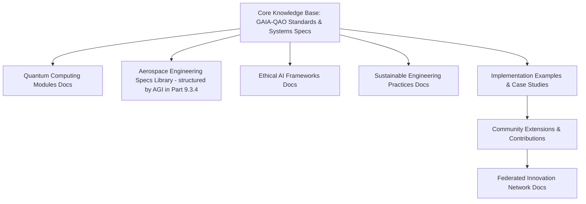
---
## Part 1: Programming Languages, Development Environments, and Libraries in Aerospace and Defense Software

*(This section integrates the full prose report "Programming Languages, Development Environments, and Libraries in Aerospace and Defense Software" provided by the user. The report's original structure (Introduction, II. Lenguajes, III. Entornos, IV. RTOS, V. Simulación, VI. Certificación, VII. Civil vs. Mil, VIII. Evolución, IX. Conclusión) is mapped to the AGI subsections 1.1 through 1.10. All tables from the original prose report are included here under their respective mapped sub-sections.)*

### 1.1 Introduction
El software se ha convertido en un componente indispensable y cada vez más complejo en los dominios de la aviónica, rán aplicaciones específicas del dominio, como sistemas embebidos de tiempo real, software de simulación, sistemas de planificación de misiones y software de control terrestre, para ilustrar la diversidad y especialización requeridas.

La interacción entre la elección del lenguaje de programación, el entorno de desarrollo, las bibliotecas de soporte y los rigurosos procesos de certificación es un factor determinante en el éxito y la seguridad del software aeroespacial y de defensa. A medida que los sistemas se vuelven más interconectados y autónomos, con la creciente incorporación de tecnologías como la inteligencia artificial y los procesadores multinúcleo, el panorama del desarrollo de software continúa evolucionando, presentando tanto nuevas oportunidades como desafíos significativos.

### 1.2 Common Programming Languages in Aerospace Systems
Históricamente, solo unos pocos lenguajes de programación han cumplido los estrictos requisitos para el software de vuelo. Los lenguajes de alto nivel ofrecen semánticas más seguras en comparación con el ensamblador, pero deben ser suficientemente deterministas y permitir una verificación exhaustiva. En el software aeroespacial crítico para la seguridad (como el control de vuelo), las características dinámicas a menudo están restringidas y se utilizan **subconjuntos seguros** de lenguajes.

#### 1.2.1 Ada and SPARK: Design for Safety and High Integrity
Ada es un lenguaje de programación estructurado, de tipado estático, imperativo y orientado a objetos, diseñado originalmente bajo contrato con el Departamento de Defensa de los Estados Unidos (DoD) para reemplazar a más de 450 lenguajes entonces en uso. Su diseño enfatiza la legibilidad del código, la robustez y la mantenibilidad, con características incorporadas para el diseño por contrato, un sistema de tipos extremadamente fuerte, concurrencia explícita (tareas, paso síncrono de mensajes, objetos protegidos) y manejo de excepciones. Estas características ayudan a detectar errores en tiempo de compilación en lugar de en tiempo de ejecución, lo cual es crucial para sistemas críticos donde las consecuencias de un fallo son severas. Ada ha evolucionado a través de varios estándares internacionales (Ada 83, Ada 95, Ada 2005, Ada 2012, Ada 2022), manteniendo la compatibilidad ascendente y adaptándose a nuevas necesidades.

SPARK es un subconjunto formalmente definido del lenguaje Ada, diseñado específicamente para el desarrollo de software de alta integridad donde la corrección puede demostrarse mediante análisis estático riguroso. Al restringir ciertas características de Ada que son difíciles de analizar formalmente, SPARK, junto con herramientas como el SPARK Examiner (ahora parte de GNATprove), permite la verificación formal de propiedades del programa, como la ausencia de errores en tiempo de ejecución y la conformidad con especificaciones funcionales detalladas. Esto lo hace particularmente adecuado para los niveles más altos de garantía de diseño (DAL A/B en DO-178C). La longevidad de Ada y la capacidad de verificación formal de SPARK les confieren una ventaja significativa en sistemas donde la falla no es una opción. AdaCore GNAT Pro es un entorno de desarrollo prominente para Ada y SPARK.

Aplicaciones comunes incluyen sistemas de control de vuelo (Boeing 777, Airbus A350), aviónica crítica (F-22 Raptor), software de misiles, control de tráfico aéreo y sistemas espaciales (numerosos proyectos de la ESA) donde la fiabilidad es primordial.

#### 1.2.2 C and C++: Prevalence, Applications, and Safety Challenges
Los lenguajes C y C++ son ampliamente utilizados en los sectores aeroespacial y de defensa debido a su rendimiento, flexibilidad y la vasta disponibilidad de desarrolladores y herramientas. C, por su cercanía al hardware y su eficiencia, es común en sistemas embebidos, controladores de bajo nivel y software donde la gestión directa de la memoria es esencial (e.g., el kernel de VxWorks, NASA cFS, software de rehosting para el B-2). C++ ofrece abstracciones de más alto nivel, incluyendo programación orientada a objetos (OOP), lo que lo hace adecuado para sistemas más grandes y complejos, como software de misión y simulación (e.g., F-35, Orion MPCV, software de Falcon 9/Dragon).

Sin embargo, la flexibilidad de C y C++ también introduce riesgos significativos de seguridad, como desbordamientos de búfer, punteros colgantes y corrupción de memoria. Para abordar estos desafíos en contextos de seguridad crítica, se emplean subconjuntos restringidos del lenguaje (por ejemplo, MISRA C/C++, JSF++ Air Vehicle C++) y se depende en gran medida de herramientas de análisis estático, pruebas rigurosas y procesos de revisión de código. La norma DO-332 proporciona orientación sobre el uso de tecnologías orientadas a objetos como C++ en el contexto de la certificación DO-178C, abordando aspectos como la herencia, el polimorfismo y la gestión de memoria dinámica.

#### 1.2.3 Legacy Languages: Fortran, COBOL, JOVIAL and Modernization
Una cantidad significativa de software crítico en sistemas aeroespaciales y de defensa de larga duración todavía está escrito en lenguajes heredados como Fortran (Formula Translation), COBOL (Common Business-Oriented Language, aunque menos común en sistemas embebidos), JOVIAL (Jules' Own Version of the International Algorithmic Language), y HAL/S (High-order Assembly Language/Shuttle). Fortran fue históricamente popular para cálculos numéricos intensivos en simulación y análisis (e.g., primeros sistemas de misiles, análisis estructural). JOVIAL fue un lenguaje de alto nivel desarrollado específicamente para sistemas embebidos militares en los EE. UU. (e.g., aviónica del B-2 Spirit, F-117 Nighthawk, F-15, F-16). HAL/S fue el lenguaje principal del Transbordador Espacial de la NASA.

El mantenimiento de estas bases de código presenta desafíos significativos, incluyendo la disminución del número de programadores con experiencia en estos lenguajes y la dificultad de integrar estos sistemas con tecnologías modernas. La modernización, incluyendo el uso de herramientas de traducción de código asistidas por IA y la refactorización manual, se está explorando y aplicando para migrar estas funcionalidades a lenguajes modernos como C++, Ada o Java, mientras se preserva la lógica de negocio y los requisitos de seguridad probados.

#### 1.2.4 Emerging Languages: The Potential of Rust for Secure Systems
Rust es un lenguaje de programación de sistemas moderno que está ganando atención para el desarrollo de software seguro y concurrente. Su principal atractivo son sus garantías de seguridad de memoria (ausencia de desbordamientos de búfer, punteros colgantes, carreras de datos) logradas en tiempo de compilación a través de su sistema de propiedad y préstamo, sin necesidad de un recolector de basura. Esto lo hace teóricamente atractivo para sistemas donde la fiabilidad y la seguridad son primordiales, y donde el rendimiento de C/C++ es deseado.

Aunque su ecosistema de certificación aún está madurando (con iniciativas como el consorcio Safety-Critical Rust y herramientas como Ferrocene abriendo camino para la calificación según estándares como ISO 26262 y DO-178C), Rust se presenta como una alternativa prometedora a C/C++ para nuevo desarrollo en sistemas embebidos y de infraestructura donde la seguridad es crítica. Proyectos experimentales en la ESA y en drones de investigación están explorando su uso.

#### 1.2.5 Scripting and Specialized Languages: Python, HDL, and Others
*   **Python:** Ampliamente utilizado para el desarrollo de software de soporte en tierra, automatización de pruebas, análisis de datos de telemetría, prototipado rápido de algoritmos (especialmente en IA/ML), y como lenguaje de scripting en herramientas de simulación (e.g., el framework Basilisk de la NASA para simulación de dinámicas de naves espaciales, marcos de prueba de SpaceX). No se utiliza para software de vuelo certificado debido a su naturaleza interpretada y tipado dinámico.
*   **HDLs (VHDL, Verilog, SystemVerilog):** Lenguajes de Descripción de Hardware (Hardware Description Languages) son esenciales para el diseño y verificación de Field-Programmable Gate Arrays (FPGAs) y Application-Specific Integrated Circuits (ASICs) utilizados en aviónica, astronáutica (e.g., implementación de SpaceWire) y procesamiento de señales de alta velocidad.
*   **MATLAB/Simulink (MathWorks):** Ampliamente utilizados para el diseño de algoritmos de control (e.g., en el Airbus A380), procesamiento de señales, simulación de sistemas dinámicos y generación automática de código C o Ada para ser desplegado en sistemas embebidos (e.g., en muchos cohetes), previa calificación del generador de código según DO-331.
*   **Otros Lenguajes de Dominio Específico (DSLs):** Pueden existir DSLs para tareas muy concretas como la definición de pruebas o la configuración de sistemas.

##### Table 1: Comparison of Key Programming Languages in Aerospace and Defense

| Feature             | Ada                                                 | SPARK                                           | C                                             | C++                                                 | Rust                                                  | Legacy (Fortran/JOVIAL/HAL/S)      |
|---------------------|-----------------------------------------------------|-------------------------------------------------|-----------------------------------------------|-----------------------------------------------------|-------------------------------------------------------|------------------------------------|
| **Primary Paradigm**| Multi (Imperative, OO, Concurrent, Modular)         | Ada Subset, Formal Verification Focus           | Imperative, Procedural                        | Multi (Procedural, OO, Generic, Functional-style)   | Multi (Imperative, Functional, Concurrent, OO-style)| Procedural, Specialized Embedded   |
| **Typing**          | Static, Strong, Safe, Nominal                       | Static, Strong, Safe, Formal Subset of Ada      | Static, Weak                                  | Static, Relatively Strong                           | Static, Strong, Inferred, Algebraic Data Types        | Static (Fortran), Specialized      |
| **Memory Mgt.**     | Manual (access types, pools), Optional GC (Ravenscar profile for RT) | Ada-like, restrictions for formal analysis (no dynamic allocation typically) | Manual (pointers), Prone to errors            | Manual (pointers, RAII), Smart Pointers, Optional GC| Ownership & Borrowing (Compile-time, No GC)         | Static, Stack-based, Overlay (HAL/S)|
| **Key Strengths**   | Reliability, Safety, Maintainability, Robust Concurrency, Readability | Formal Verifiability (Absence of Runtime Errors), High Integrity | Performance, Low-level Control, Portability, Large Ecosystem | Scalability, OOP, Extensive Libraries, Performance  | Memory & Concurrency Safety (at compile-time), Performance, Modern Tooling | Optimized Numeric (Fortran), Proven on critical systems |
| **Key Weaknesses**  | Learning Curve, Perceived Verbosity, Smaller Dev Pool | Restrictive Subset, Steeper learning curve for formal methods | Prone to Memory Errors, Unsafe by default     | Complexity, Prone to Memory Errors, Verbose for safety | Maturing Cert. Ecosystem, Ownership Learning Curve, Compile Times | Obsolete, Scarce Developers, Limited modern tool support |
| **Certification**   | Mature (DO-178C DAL A), Qualified Toolchains (GNAT Pro) | Highest DAL (DO-178C DAL A), Strong Formal Methods Support | Possible (MISRA C subsets, qualified compilers) | Possible (MISRA C++, JSF++, DO-332 subsets, qualified compilers) | Emerging (Ferrocene for DO-178C), ISO 26262, IEC 61508 | N/A for new; Modernization focus, Grandfathering |
| **Typical Use Cases**| Flight Control (B777, A350), Critical Avionics (F-22), Defense, Space (Ariane) | Max Integrity Software (Security Kernels, Microkernels), ESA projects | Embedded Systems, Drivers, RTOS Kernels (VxWorks), Legacy Mission SW | HMI/Displays, Simulation, Large Mission Systems (F-35, Orion MPCV), GNC (Falcon 9) | Secure Embedded, OS Components, C/C++ Replacement, Experimental Flight Systems | Legacy System Maint. (Space Shuttle, B-2, early fighters) |

### 1.3 Development Environments and Toolchains
El desarrollo de software aeroespacial y de defensa, especialmente para sistemas críticos, depende de cadenas de herramientas (toolchains) robustas, maduras y, a menudo, calificadas según estándares como DO-330 (Tool Qualification Considerations). Una cadena de herramientas típica incluye compiladores, enlazadores, depuradores, entornos de desarrollo integrados (IDEs), herramientas de análisis estático y dinámico, y sistemas de gestión de configuración.

#### 1.3.1 Integrated Development Environments (IDEs)
Los IDEs proporcionan un entorno cohesivo para escribir, construir, depurar y gestionar proyectos de software.
*   **AdaCore GNAT Studio:** Un IDE completo para desarrollo en Ada y SPARK, con integración de herramientas de análisis, depuración y gestión de proyectos.
*   **Green Hills MULTI IDE:** Un entorno potente para C, C++, Ada y lenguajes embebidos, conocido por sus capacidades de depuración avanzada y su integración con el RTOS INTEGRITY.
*   **Wind River Studio (anteriormente Workbench):** Un IDE basado en Eclipse adaptado para el desarrollo con VxWorks y otros productos de Wind River.
*   **Eclipse / Visual Studio Code (VS Code):** IDEs genéricos y extensibles con un rico ecosistema de plugins para C, C++, Python, Rust, y otros lenguajes, populares para software de soporte, simulación y desarrollo de herramientas.
*   **Qt Creator:** Un IDE para desarrollo con el framework Qt, utilizado para interfaces gráficas de usuario (GUIs) en sistemas de tierra y algunas pantallas embarcadas.
*   **MATLAB/Simulink Environment (MathWorks):** No es un IDE tradicional para codificación manual, pero es un entorno de desarrollo completo para diseño basado en modelos, simulación y generación automática de código.
*   **ANSYS SCADE Studio:** Un entorno de diseño basado en modelos para software crítico, con generación de código certificable.

#### 1.3.2 Compilers and Debuggers
*   **Compiladores:**
    *   **Ada/SPARK:** AdaCore GNAT Pro (ampliamente utilizado y calificable), Green Hills Optimizing Ada Compiler, DDC-I.
    *   **C/C++:** GCC (GNU Compiler Collection) y Clang/LLVM son comunes, con variantes soportadas por proveedores de RTOS. Wind River Diab Compiler (certificado TÜV SÜD para estándares de seguridad como ISO 26262 y EN 50128), IAR C/C++ Compiler (con versiones pre-certificadas para seguridad funcional), Green Hills Optimizing C/C++ Compilers.
    *   **Rust:** Ferrocene (desarrollado por Ferrous Systems) es la primera cadena de herramientas Rust calificada para su uso en entornos de seguridad crítica (ISO 26262, IEC 61508, con planes para DO-178C).
*   **Depuradores:** GDB (GNU Debugger) es un estándar de facto para muchos sistemas. Los IDEs comerciales suelen integrar depuradores propios (e.g., IAR C-SPY, Green Hills TimeMachine Debugger) que ofrecen capacidades avanzadas como depuración a nivel de fuente, depuración en el objetivo (on-target debugging), trazas de ejecución en tiempo real y análisis de rendimiento.

#### 1.3.3 Static Analysis and Verification Tools
Estas herramientas analizan el código fuente sin ejecutarlo para encontrar defectos, vulnerabilidades y desviaciones de los estándares de codificación.
*   **Ada/SPARK:** AdaCore GNATprove (para SPARK, realizando pruebas formales de corrección), GNAT Static Analysis Suite (incluye CodePeer para análisis avanzado de errores en tiempo de ejecución y GNATcheck para conformidad con estándares de codificación).
*   **C/C++:**
    *   **Parasoft C/C++test:** Análisis estático (MISRA, AUTOSAR C++14, CWE, CERT C/C++), pruebas unitarias, cobertura de código.
    *   **LDRA Testbed / TBvision:** Análisis estático, dinámico, conformidad con estándares (MISRA, CERT), cobertura estructural (incluyendo MC/DC).
    *   **MathWorks Polyspace Bug Finder / Code Prover:** Detección de errores en tiempo de ejecución y verificación formal de la ausencia de ciertos errores (e.g., desbordamientos, división por cero) en código C/C++.
    *   **Axivion Suite (anteriormente de Qt, ahora GrammaTech):** Análisis de arquitectura, conformidad con MISRA, detección de clones de código y defectos.
    *   **Coverity (Synopsys):** Análisis estático para identificar defectos de seguridad y calidad.
    *   **Klocwork (Perforce):** Análisis estático en tiempo real para desarrolladores.

#### 1.3.4 Tool Qualification (DO-330 / ED-215)
DO-330 ("Consideraciones para la Calificación de Herramientas Software") es un documento suplementario a DO-178C que guía el proceso de calificación de herramientas cuyo resultado se utiliza sin revisión manual (herramientas de desarrollo como compiladores o generadores de código) o que automatizan/reemplazan procesos de verificación. La calificación de una herramienta implica demostrar que la herramienta cumple sus requisitos y es adecuada para su uso previsto en el contexto de un proyecto certificado. El proceso implica la creación de un Plan de Calificación de Herramientas (TQP), Requisitos Operacionales de la Herramienta (TOR), Verificación de la Herramienta, y la documentación de las Actividades de Calificación de la Herramienta (TAS) y el Índice de Configuración de la Herramienta (TCI). Muchos proveedores de herramientas ofrecen "Qualification Kits" (QKs) o "Tool Qualification Support Packages" (TQSPs) para ayudar en este proceso.

#### 1.3.5 Configuration Management and Build Systems
*   **Sistemas de Gestión de Configuración (SCM):** Herramientas como Git, Subversion (SVN), y Perforce Helix Core son fundamentales para el control de versiones, la gestión de cambios, la trazabilidad y la colaboración. Son requisitos básicos para DO-178C (Sección 7 de DO-178C).
*   **Sistemas de Compilación (Build Systems):** Herramientas como Make, CMake, Meson, y para Ada, gprbuild (parte de GNAT Pro), automatizan el proceso de compilación, enlace y creación de ejecutables. La reproducibilidad de las compilaciones es un aspecto clave para la certificación.

##### Table 2: Prominent Development and Verification Tool Suites

| Vendor                 | IDE Principal(s)              | Compiler(s) Clave                       | Analysis/Verification Tools                          | DO-330 Support      | Domains Key          |
|------------------------|-------------------------------|-----------------------------------------|------------------------------------------------------|---------------------|----------------------|
| **AdaCore**            | GNAT Studio                   | GNAT Pro (Ada, SPARK, C/C++)            | GNATprove, GNAT Static Analysis Suite (CodePeer, GNATcheck), GNATcoverage, GNATtest | Yes (Compiler, Libs, Tools) | Avionics, Defense, Space, Rail |
| **Green Hills SW**     | MULTI IDE, AdaMULTI IDE       | Optimizing Compilers (C/C++, Ada, Fortran)| DoubleCheck Static Analyzer, TimeMachine Debugger Suite, Dynamic Analysis | Yes (Compiler, RTOS) | Avionics, Defense, Automotive |
| **Wind River**         | Wind River Studio (Eclipse-based Workbench) | Diab Compiler (C/C++), GCC variants     | Simics (Simulation), Test Automation Platform, Helix (DevOps) | Yes (Compiler, RTOS) | Avionics, Defense, Industrial |
| **IAR Systems**        | IAR Embedded Workbench        | IAR C/C++ Compiler                      | C-SPY Debugger, Static Analysis (C-STAT), Dynamic Analysis (C-RUN) | Yes (Compiler, Libs, Pre-cert.) | Embedded, Automotive, Medical |
| **LDRA**               | Integrates w/ various IDEs    | N/A (Analyzes compiled code/source)     | LDRA Testbed, TBvision (Static/Dynamic Analysis, MISRA, CERT, Coverage), LDRAunit | Yes (Tool Qual. Support Packs) | Avionics, Defense, Automotive, Medical |
| **Parasoft**           | Integrates w/ various IDEs    | N/A (Analyzes source code)              | C/C++test, Jtest, dotTEST (Static Analysis, Unit Test, Code Coverage, MISRA, AUTOSAR C++14) | Yes (Qual. Kits)    | Avionics, Defense, Automotive, Medical |
| **MathWorks**          | MATLAB, Simulink Environment  | N/A (Generates C/C++/Ada/HDL Code via Embedded Coder, Simulink PLC Coder) | Polyspace Bug Finder/Code Prover (Static Analysis, Formal Methods), Simulink Test/Coverage/Design Verifier | Yes (DO Qual. Kit for codegen) | Aerospace, Automotive, Industrial |
| **Rapita Systems**     | Integrates w/ various IDEs    | N/A (Analyzes object code/execution)    | RVS (RapiTest, RapiCover, RapiTime - WCET analysis)  | Yes (Qual. Kits)    | Avionics, Space, Automotive |
| **Qt Group (Axivion/GrammaTech)** | Qt Creator (for Qt), Integrates (Axivion) | N/A (Uses standard compilers for Qt)    | Axivion Suite (Static Analysis, Architecture Check, MISRA), Squish (GUI Test), Coco (Coverage) | Yes (Squish, Coco for test tools) | HMI, Aerospace, Automotive, Medical |
| **Ferrous Systems**    | Integrates w/ various IDEs (e.g., VS Code with rust-analyzer) | Ferrocene (Rust)                        | Part of Rust toolchain (Clippy, rustfmt), External static analysis can be used. | Yes (Ferrocene compiler) | Automotive, (Emerging) Aero, Industrial |
| **DDC-I**              | SCORE IDE                     | Deos Ada, JOVIAL, C/C++ Compilers       | Debuggers, Simulation Tools                          | Yes (RTOS, Compiler) | Defense, Aerospace   |
| **SYSGO**              | PikeOS Studio (Eclipse-based) | ELinOS GCC, PikeOS C/C++ Compiler       | Code Coverage Tools, Integrated Debugger             | Yes (PikeOS RTOS)    | Avionics, Rail, Automotive |

### 1.4 Real-Time Operating Systems and Avionics Frameworks
El software en sistemas aeroespaciales y de defensa embebidos opera sobre Sistemas Operativos de Tiempo Real (RTOS) que proporcionan determinismo, fiabilidad y, a menudo, capacidades de particionamiento para seguridad. Además, se utilizan bibliotecas y frameworks estandarizados para la comunicación, la gestión de datos y funcionalidades específicas de la misión.

#### 1.4.1 ARINC 653 Partitioned RTOS
Los RTOS certificados son fundamentales para la aviónica moderna, especialmente en arquitecturas de Aviónica Modular Integrada (IMA). Estos RTOS deben garantizar un comportamiento determinista y la segregación de aplicaciones con diferentes niveles de criticidad.
*   **Wind River VxWorks 653/Cert Edition:** Ampliamente utilizado en aviación civil (Boeing 787, Airbus A350) y militar. Proporciona particionamiento espacial y temporal robusto conforme a ARINC 653.
*   **Green Hills INTEGRITY-178 tuMP:** Un RTOS con particionamiento seguro certificado hasta DO-178C Nivel A, utilizado en sistemas como el F-35 Lightning II y aviónica comercial.
*   **Lynx Software Technologies LynxOS-178:** Un RTOS certificado DO-178C Nivel A que ofrece compatibilidad POSIX y particionamiento ARINC 653.
*   **SYSGO PikeOS:** Un RTOS europeo con capacidades de particionamiento y certificación para múltiples estándares de seguridad (DO-178C, ISO 26262, IEC 61508), soporta ARINC 653.
*   **DDC-I Deos:** Un RTOS certificado DO-178C Nivel A, utilizado en diversas plataformas de aviónica.

#### 1.4.2 Other RTOS and Executives
*   **RTEMS (Real-Time Executive for Multiprocessor Systems):** Un RTOS de código abierto popular en aplicaciones espaciales (NASA Parker Solar Probe, ESA Mars Express) debido a su determinismo y soporte para múltiples arquitecturas de procesador. No tiene certificación DO-178C per se, pero puede ser calificado para misiones específicas.
*   **FreeRTOS:** Aunque popular en el mundo embebido general, su uso en aplicaciones aeroespaciales de alta criticidad es menos común debido a la falta de un camino de certificación DO-178C directo para la versión de código abierto, aunque existen variantes comerciales con soporte de certificación.
*   **Ejecutivos Cíclicos / Planificadores Estáticos:** Para sistemas muy simples y altamente deterministas, a veces se utilizan planificadores cíclicos o estáticos sin un RTOS completo.

#### 1.4.3 Bus and Device Interfaces
*(The following was remapped from "IV.B APIs Estandarizadas y Middleware" and "IV.C Bibliotecas de Comunicación y Buses de Datos" in the original prose for better flow under RTOS and Frameworks.)*
*   **ARINC 653 (APEX - Application/Executive Interface):** Define una interfaz estándar entre el sistema operativo y el software de aplicación en sistemas IMA. Facilita la portabilidad del software y la integración de componentes de diferentes proveedores.
*   **FACE™ (Future Airborne Capability Environment):** Una iniciativa del gobierno de EE. UU. y la industria para crear un estándar abierto de arquitectura de software para aviónica militar. Promueve la reutilización de software y la rápida inserción de tecnología. Define segmentos (Operating System, I/O Services, Platform-Specific Services, Transport Services, Portable Components) e interfaces.
*   **DDS (Data Distribution Service):** Un estándar del Object Management Group (OMG) para middleware de publicación-suscripción centrado en datos y en tiempo real. Utilizado para la comunicación entre componentes distribuidos en sistemas complejos. Varias implementaciones comerciales y de código abierto están disponibles.
*   **MIL-STD-1553:** Un bus de datos serie de comando/respuesta, doble redundante, utilizado predominantemente en aeronaves militares. Las bibliotecas de software implementan los roles de Bus Controller (BC), Remote Terminal (RT) y Bus Monitor (BM).
*   **ARINC 429:** Un bus de datos serie unidireccional utilizado en aeronaves comerciales. El software debe codificar y decodificar etiquetas de 32 bits y gestionar la temporización de la transmisión.
*   **AFDX (Avionics Full-Duplex Switched Ethernet) / ARINC 664 Parte 7:** Un estándar de red basado en Ethernet conmutado para aviónica moderna (e.g., A380, B787). El software gestiona Virtual Links (VLs), gestión de ancho de banda y redundancia.
*   **SpaceWire (ECSS-E-ST-50-12C):** Una red de alta velocidad y bajo consumo para interconexión de sensores, procesadores y memoria en naves espaciales. Las implementaciones de software a menudo interactúan con hardware SpaceWire (FPGAs).
*   **CAN (Controller Area Network) Bus:** Originalmente para automoción, también se utiliza en algunas aplicaciones aeroespaciales para redes de sensores y actuadores menos críticos debido a su robustez y bajo coste.
*   **Time-Triggered Ethernet (TTEthernet, SAE AS6802):** Una forma de Ethernet determinista que proporciona sincronización de tiempo y comunicación programada, adecuada para sistemas de control críticos.

##### Table 3: Overview of Major Avionics and Military Data Bus Standards

| Standard             | Key Features (Topology, Medium, Speed, Protocol)      | Primary Application Domains                                | Key Software Implications (Driver complexity, API, Determinism) |
|----------------------|-------------------------------------------------------|------------------------------------------------------------|-----------------------------------------------------------------|
| **MIL-STD-1553B**    | Serial Bus (Shared), Shielded Twisted Pair, 1 Mbps, Command/Response, Manchester II encoding, Time Division Multiplexing, Dual Redundant. Roles: Bus Controller (BC), Remote Terminal (RT), Bus Monitor (BM). | Predominantly Military (fighters, helicopters, missiles, UAVs), some legacy space applications. Sensor integration, weapon systems, avionics data transfer. | Software implements BC schedules, RT response logic, BM data logging. Strict timing requirements for RTs. C/Ada APIs common. Highly deterministic. Driver interacts with dedicated 1553 interface hardware. |
| **ARINC 429**        | Unidirectional Serial Point-to-Multi-Point (1 Tx, ≤20 Rx), Shielded Twisted Pair, Selectable Speeds (12.5 kbps or 100 kbps), 32-bit words with Label, BNR/BCD data, Broadcast. | Civil Aviation (most commercial/business aircraft). Flight sensors (ADIRU, GPS), navigation systems, display systems, flight management systems. | Software decodes labels to identify data type, handles BNR/BCD formats, manages data buffering. LabVIEW, C/C++ APIs. Inherently deterministic due to fixed transmission rates. |
| **AFDX / ARINC 664 P7**| Switched Ethernet Full-Duplex, Fiber Optic or Copper, 10/100 Mbps / 1 Gbps, IP-based, Virtual Links (VLs) for guaranteed bandwidth & latency, Redundancy (dual networks). | Modern Civil Aviation (Airbus A380/A350/A400M, Boeing 787), some military platforms. Avionics data backbone for critical and non-critical systems. | Software configures VLs, manages Quality of Service (QoS), handles network redundancy and data sequencing. C/Ada APIs through ARINC 653 Part 1/2 services. Deterministic for configured VLs. |
| **SpaceWire (ECSS-E-ST-50-12C)**| Point-to-Point Serial Links, LVDS (Low-Voltage Differential Signaling), Speeds from 2 Mbps to 400+ Mbps, Character-based Routing using Path/Logical Addresses, Full-Duplex, Flow Control. | Spacecraft (satellites, rovers, instruments). Onboard network for connecting instruments, processors, mass memory, telemetry/telecommand units. | Often implemented in FPGAs (VHDL/Verilog) for routing and link layer. Host software drivers (C/C++) interact with SpaceWire interface IP cores. Deterministic link behavior, network latency depends on topology. |
| **CAN Bus (ISO 11898)** | Differential Serial Bus (Shared), Twisted Pair, Speeds up to 1 Mbps (CAN FD up to 5+ Mbps), CSMA/CA with non-destructive bitwise arbitration based on message ID, Multi-Master. | Automotive (primary), Industrial, some Aerospace (cabin systems, non-critical sensors/actuators, small UAVs). | Driver manages message filtering via IDs, handles error frames, supports higher-layer protocols (e.g., CANopen, J1939). C APIs common. Deterministic under defined load conditions. |
| **TTEthernet (SAE AS6802)** | Switched Ethernet, Synchronized Clocks, Time-Triggered (TT), Rate-Constrained (RC), and Best-Effort (BE) traffic classes, Redundancy. | Safety-Critical Aerospace (e.g., Orion MPCV, Ariane 6), Industrial Control. For highly deterministic, fault-tolerant networks. | Software configures TT schedules, manages traffic classes, interfaces with specialized TTEthernet NICs/switches. Requires careful network design and synchronization. Highly deterministic for TT traffic. |

#### 1.4.4 Middleware and Frameworks (cFS, F Prime)
*(This section was not explicitly numbered in your prose under "IV. RTOS..." but covered concepts from "IV.D Bibliotecas Geoespaciales y Específicas de Misión". Re-contextualized here for flight software frameworks.)*
*   **NASA cFS (core Flight System):** Un framework de software de vuelo reutilizable y modular que proporciona un conjunto de servicios de aplicaciones comunes (gestión de telemetría, comandos, eventos, gestión de tablas, gestión de memoria, servicios de tiempo) y un entorno de ejecución para aplicaciones de vuelo. Utilizado en numerosas misiones de la NASA (LADEE, Parker Solar Probe, Orion BFS) y por otras organizaciones.
*   **JPL F Prime (F'):** Un framework de software de código abierto, basado en componentes y orientado a C++, para sistemas de vuelo pequeños, CubeSats e instrumentos. Utilizado en Mars Ingenuity Helicopter y varias misiones CubeSat. Promueve el desarrollo rápido y la reutilización de componentes.
*   **GMSEC (Goddard Mission Services Evolution Center) API:** Un estándar de middleware de la NASA para sistemas de mando y control de misiones espaciales, facilitando la interoperabilidad entre componentes de sistemas terrestres y de vuelo.

### 1.5 Libraries and Frameworks for Simulation, Control, and AI
*(This section combines relevant parts of "IV.D Bibliotecas Geoespaciales y Específicas de Misión" and "V. Frameworks de Simulación, Control e IA" from the user's prose.)*

#### 1.5.1 Simulation Tools (Trick, Simulink, FlightGear)
*   **NASA Trick Simulation Environment:** Un framework de simulación genérico, de código abierto, escrito en C++/Python, utilizado para desarrollar simulaciones de sistemas complejos, desde vehículos de lanzamiento hasta naves espaciales. Permite la integración de diferentes modelos y la ejecución de simulaciones en tiempo real o más rápido.
*   **MathWorks Simulink/Stateflow:** Ampliamente utilizado para modelado basado en modelos (MBD), simulación y análisis de sistemas dinámicos multidominio. Esencial para el diseño y prueba de algoritmos de Guiado, Navegación y Control (GNC), procesamiento de señales y sistemas de control.
*   **FlightGear:** Un simulador de vuelo de código abierto, utilizado para investigación, desarrollo y como plataforma de simulación de bajo coste.
*   **ANSYS STK (Systems Tool Kit, anteriormente AGI STK):** Software de modelado y análisis de misiones para sistemas aeroespaciales y de defensa, cubriendo órbitas, cobertura de sensores, enlaces de comunicaciones, etc.
*   **Hardware-in-the-Loop (HIL) Simulators:** Plataformas como dSPACE, Speedgoat, NI VeriStand, que permiten probar software embebido en hardware real interactuando con un entorno simulado.

#### 1.5.2 Control System Libraries
*   **Eigen (C++):** Una biblioteca de plantillas C++ de alto nivel para álgebra lineal, matrices, vectores y solucionadores numéricos, utilizada frecuentemente en algoritmos GNC y robótica.
*   **GNU Scientific Library (GSL):** Una biblioteca C para cálculos numéricos en ciencia e ingeniería, que incluye rutinas para álgebra lineal, ecuaciones diferenciales, etc.
*   Bibliotecas de control específicas de RTOS o frameworks (e.g., funciones de control proporcionadas por los servicios de cFS, o bibliotecas de control desarrolladas internamente).

#### 1.5.3 AI and Machine Learning Frameworks
*   **Python-based (Desarrollo y Entrenamiento):** TensorFlow, PyTorch, Keras, scikit-learn son dominantes para el desarrollo, entrenamiento y prototipado de modelos de IA/ML.
*   **Deployment (Inferencia Embebida/Optimizada):** TensorFlow Lite, ONNX Runtime, NVIDIA TensorRT para desplegar modelos entrenados en sistemas embebidos, con recursos limitados o que requieren baja latencia.
*   **Computer Vision:** OpenCV es una biblioteca estándar para tareas de procesamiento de imágenes y visión por computadora.
*   **Aerospace-specific AI Research:** Enfoque en IA explicable (XAI) para la certificación, IA robusta contra ataques adversarios, y V&V de sistemas basados en ML. El uso directo en software de vuelo certificado (especialmente DAL A/B) es aún limitado y se centra en funciones de asistencia, optimización no crítica, o análisis de datos en tierra.

#### 1.5.4 Ground Systems and Testing Frameworks
*   **Pruebas Unitarias:** Google Test, Catch2, Boost.Test (para C++); JUnit, TestNG (para Java); PyTest, unittest (para Python).
*   **Automatización de Pruebas y Aceptación:** Robot Framework, Cucumber, Selenium (para UIs web).
*   **Software de Control Terrestre para Satélites:** COSMOS (Ball Aerospace), OpenC3 (NASA), YAMCS (Space Applications Services).
*   **Frameworks Geoespaciales (para planificación de misión y análisis de datos de Observación de la Tierra):**
    *   **Open Source:** GDAL/OGR, PROJ, GEOS, PostGIS. En Python: Rasterio, Fiona, Shapely, Pyproj, Geopandas.
    *   **Comercial:** ESRI ArcGIS APIs, LuciadLightspeed (Hexagon).

### 1.6 Civil vs. Military Systems: Key Differences
*(Section VII from user's prose, remapped to 1.6. Content remains as previously generated based on that prose section.)*

### 1.7 Certification Standards and Their Impact
*(Section VI from user's prose, remapped to 1.7. Content remains as previously generated, including Table 4 and Table 5.)*

### 1.8 Software in Domain-Specific Applications
*(Section VII from user's prose (different from the one above, likely a typo in original numbering), remapped to 1.8. Content remains as previously generated, including Table 6.)*

### 1.9 Historical Evolution and Legacy Systems
*(Section VIII from user's prose, remapped here.)*
El software aeroespacial ha experimentado una transformación significativa desde sus inicios.
*   **1960s-1970s:** Los primeros sistemas, como el Computador de Guiado del Apolo (AGC), se programaban en ensamblador o lenguajes de muy bajo nivel. JOVIAL y Fortran comenzaron a utilizarse. El hardware era extremadamente limitado.
*   **1980s:** El mandato Ada del DoD de EE. UU. impulsó su adopción en sistemas militares. El Transbordador Espacial utilizó HAL/S. Surgieron los primeros microprocesadores estandarizados para aviónica militar (e.g., MIL-STD-1750A). El bus ARINC 429 se estandarizó para la aviación comercial.
*   **1990s:** Ada 95 introdujo características OOP. C++ comenzó a ganar terreno. Los RTOS comerciales como VxWorks e INTEGRITY se hicieron populares. Comenzó el desarrollo de arquitecturas de Aviónica Modular Integrada (IMA). El estándar DO-178B se publicó en 1992.
*   **2000s:** El F-35 se desarrolló predominantemente en C/C++. Aviones como el A380 y el B787 hicieron un uso extensivo de MBD, RTOS certificados y redes AFDX. Frameworks como NASA cFS y JPL F Prime surgieron para software espacial reutilizable.
*   **2010s:** Creciente interés en la autonomía y la IA (e.g., DARPA HACMS, microkernel seL4). Uso de Linux en aplicaciones no críticas o con particionamiento (SpaceX Falcon 9). Foco en ciberseguridad (DO-326A/ED-202A). Publicación de DO-178C y sus suplementos en 2011.
*   **2020s en adelante:** Primeros usos de IA en contextos certificados (e.g., Garmin Autoland). Desafíos de certificación de procesadores multinúcleo (CAST-32A, AMC 20-193). El lenguaje Rust emerge como una opción para sistemas seguros. Interés en la computación cuántica para diseño y optimización. El desarrollo de software se vuelve cada vez más central para la diferenciación de capacidades.

### 1.10 Conclusion and Strategic Recommendations

#### 1.10.1 Key Conclusions on Aerospace & Defense Software Ecosystem
*(Content from IX.A of user's prose)*
El desarrollo de software en los dominios aeroespacial y de defensa es una disciplina altamente especializada, conformada por la necesidad primordial de seguridad, fiabilidad y cumplimiento de estándares rigurosos.
1.  **Los Estándares Son Fundamentales:** Normas como DO-178C, MIL-STD-882 y ECSS no son meras guías, sino los cimientos sobre los que se construye el software crítico. Definen el "qué" y el "cómo" del desarrollo y la verificación.
2.  **Elección Conservadora de Lenguajes:** Ada y SPARK siguen siendo preferidos para la más alta integridad debido a su diseño orientado a la seguridad. C y C++, con subconjuntos seguros y herramientas robustas, son prevalentes debido a su rendimiento y ecosistema, pero requieren una diligencia extrema.
3.  **Ecosistema de Herramientas Crítico:** Las cadenas de herramientas calificadas (compiladores, analizadores estáticos, herramientas de prueba) y los RTOS certificados son indispensables para cumplir con los objetivos de certificación.
4.  **Arquitecturas Modulares y Abiertas en Auge:** IMA (civil) y MOSA/FACE (militar) están transformando el desarrollo, fomentando la reutilización, la interoperabilidad y la capacidad de actualización.
5.  **Adopción Cauta de Tecnologías Emergentes:** La IA, el aprendizaje automático y los procesadores multinúcleo avanzados se están introduciendo gradualmente, comenzando por aplicaciones menos críticas, a medida que se desarrollan metodologías de certificación y V&V adecuadas.
6.  **El Futuro es Heterogéneo e Interconectado:** Los sistemas futuros probablemente combinarán diversos lenguajes, RTOS y arquitecturas, operando como "sistemas de sistemas" cada vez más autónomos y ciber-conscientes.

#### 1.10.2 High-Level Recommendations for Technology Adoption and Standards Compliance
*(Content from IX.B of user's prose)*
Para las organizaciones que desarrollan software en estos dominios:
1.  **Compromiso Temprano y Continuo con la Certificación:** Integrar los requisitos de certificación en el ciclo de vida del software desde el inicio. La certificación no es una actividad de final de proyecto.
2.  **Inversión en Procesos y Herramientas Robustas:** Establecer procesos de ingeniería de software rigurosos, documentados y auditables. Invertir en herramientas calificadas o calificables y en la formación necesaria para su uso efectivo.
3.  **Fomentar la Experiencia Especializada:** Desarrollar y retener talento con experiencia en lenguajes críticos para la seguridad (Ada, SPARK, C/C++ seguros), arquitecturas de aviónica (IMA, ARINC 653), RTOS certificados y metodologías de V&V (pruebas basadas en requisitos, análisis de cobertura estructural, métodos formales).
4.  **Adopción Estratégica de Estándares Abiertos y Enfoques Modulares:** Aprovechar estándares como ARINC, FACE, CCSDS y arquitecturas modulares para mejorar la interoperabilidad, gestionar la obsolescencia y reducir los costes del ciclo de vida.
5.  **Enfoque Cauteloso y Gradual hacia Tecnologías Emergentes:** Evaluar cuidadosamente la IA/ML y los MCPs avanzados. Comenzar su aplicación en roles menos críticos o de asistencia, mientras se contribuye al desarrollo de vías de certificación maduras y se abordan los desafíos de V&V.

La ingeniería de software aeroespacial y de defensa seguirá siendo un campo desafiante y en evolución, donde la innovación tecnológica debe equilibrarse constantemente con el imperativo de la seguridad y la fiabilidad.

### 1.11 References (Conceptual)
*   RTCA DO-178C, "Software Considerations in Airborne Systems and Equipment Certification."
*   RTCA DO-254, "Design Assurance Guidance for Airborne Electronic Hardware."
*   RTCA DO-330, "Software Tool Qualification Considerations."
*   MIL-STD-498, "Software Development and Documentation."
*   MIL-STD-882E, "Standard Practice for System Safety."
*   ECSS-E-ST-40C, "Space engineering - Software."
*   ECSS-Q-ST-80C, "Space product assurance - Software product assurance."
*   NASA NPR 7150.2C, "NASA Software Engineering Requirements."
*   FAA CAST-32A, "Clarification of Relevant Issues from the FAA Multi-core Processor Position Paper CAST-32."
*   EASA AMC 20-193, "Acceptable Means of Compliance for Airborne Electronic Hardware containing Multi-Core Processors."
*   AdaCore, Green Hills Software, Wind River Systems, MathWorks, LDRA, Parasoft - Vendor Documentation and White Papers.
*   Various IEEE and ACM publications on aerospace software engineering.
*   "Software for Dependable Systems: Sufficient Evidence?" The National Academies Press, 2007.
*   "Formal Methods: Specification and Software Development," Springer, Ghezzi, Jazayeri, Mandrioli.
*   "Safety-Critical Computer Systems," P.A.V. Storey.

---
## Part 2: Hardware-in-the-Loop (HIL) Thinking Specification

### 2.0 IDEA SUMMARY: Hardware-in-the-Loop (HIL) Thinking for AI Reasoning in Aerospace

**HIL Thinking** is a pioneering AI reasoning paradigm where an intelligent agent’s cognitive process is actively shaped by real-time feedback from actual or simulated hardware. It creates a closed reasoning loop that ensures the AI’s inferences are not just theoretical but physically grounded, traceable, and certifiable - a crucial step toward trustworthy autonomy in aerospace and other safety-critical domains.

**Key Components:**
- **Closed-Loop Reasoning:** AI queries/stimulates hardware (or simulator), waits for feedback, incorporates feedback to update reasoning.
- **Active Inference Loop:** Iteration feeds on system dynamics, not just abstract data.
- **Traceability:** Every step logged for compliance (DO-178C).
- **Metric & Prognostics Integration:** Reasoning evaluated with physical metrics.
- **Integration with Digital Twins:** AI models synchronized with physical/simulated states.

**Example Use Case: Flight AI Copilot Fault Evaluation**
1. Detect anomaly (control surface oscillation).
2. Interact with HIL Bench (send signal, get actuator response).
3. Reason/Adapt (compare to failure data, update predictions).
4. Document (query, hardware signal, reasoning update recorded).

**Technical Requirements:** Hardware bridge, feedback ingestion, loop orchestrator, metric/verifier layer, compliance/audit logger.

**Benefits:** Physics-grounded AI, auditability, cyber-physical co-evolution, Agent+Twin Feedback, traceable autonomy.

**Integration & Roadmap:** Short-term (HIL bridges), Mid-term (V&V/logging), Long-term (real aerospace deployment).

**Why This Matters:** Safer autonomous systems, accelerated AI certification, direct coupling of digital/physical. **HIL Thinking positions AI as a physically-aware system engineer.**

### 2.1 Introduction (to HIL Thinking Specification)
The increasing complexity of aerospace systems and the drive towards greater autonomy necessitate novel approaches to AI reasoning that are robust, verifiable, and deeply integrated with the physical world. Traditional AI models, particularly Large Language Models (LLMs) or standalone machine learning systems, often operate on abstract data or within purely digital simulations, potentially leading to "hallucinations" or decisions misaligned with real-world physics and system behavior. This gap is a significant barrier to deploying AI in safety-critical aerospace applications where failures can have catastrophic consequences, and where traceability and evidence for certification (e.g., DO-178C, DO-330 for tools, DO-331 for MBD) are paramount.

**Hardware-in-the-Loop (HIL) Thinking** proposes a paradigm shift. It is an AI reasoning framework where the cognitive process of an intelligent agent is not only informed by data but is actively and iteratively shaped by real-time feedback from physical hardware components or high-fidelity, validated hardware simulators. This creates a closed-loop reasoning cycle, ensuring that the AI's inferences, decisions, and adaptations are continuously grounded in physical reality, leading to more reliable, traceable, and ultimately certifiable autonomous behavior.

This specification details the core principles, architecture, technical requirements, benefits, and implementation roadmap for HIL Thinking within the GAIA-Q & AMPEL framework. It aims to provide a foundation for developing AI agents that can reason about and interact with complex aerospace systems in a manner that is both intelligent and physically coherent.

### 2.2 Core Principles of HIL Thinking
1.  **Physical Grounding:** AI inferences must be testable against or derived from interactions with a physical (or high-fidelity simulated) hardware counterpart.
2.  **Active Inference Cycle:** The AI should be capable of actively querying, stimulating, or commanding the HIL setup and then ingesting and processing the resultant feedback (sensor data, actuator response, system state change).
3.  **Iterative Refinement:** The feedback from the HIL interaction should be used to confirm, refute, or refine the AI's current hypothesis, model, or planned course of action.
4.  **Measurable Confidence:** The AI's confidence in its reasoning should be quantifiable and linked to the consistency and predictability of HIL feedback. Metrics like ToEPredictionProfile (Time-of-Event Prediction Profile) or α–λ (Alpha-Lambda, representing system stability/predictability) become central.
5.  **Traceability and Auditability:** Every step of the HIL interaction (query, stimulus, hardware response, AI's updated reasoning) must be logged with sufficient detail (e.g., using InfoCodes, AGAD principles) to support verification, validation, and certification.
6.  **Model-World Congruence:** The HIL setup facilitates continuous validation of any internal digital models the AI uses against actual hardware behavior, promoting a "Digital Twin" that co-evolves with the physical system.

### 2.3 Implementation Example: Flight AI Copilot & Actuator Fault
**Scenario:** An AI copilot system, designed to assist human pilots, detects an anomaly in a flight control actuator's reported position compared to its commanded position.

1.  **AI Anomaly Detection (Initial Reasoning):**
    *   The AI observes a persistent discrepancy between the commanded position of an aileron actuator and its reported feedback position (e.g., from an LVDT sensor).
    *   Internal model suggests potential causes: sensor fault, hydraulic issue, mechanical jam, control signal error.

2.  **HIL Thinking - Active Query & Stimulus:**
    *   **Step 1 (Isolate Input Path):** The AI requests the HIL test bench (which includes the actual flight control computer, actuator, and connected sensors) to command a specific diagnostic movement pattern to the suspect actuator, while simultaneously monitoring the command signal received by the actuator and the HIL's independent high-fidelity sensor readings of the actuator's movement.
        *   *InfoCode:* `QAO-COPILOT-SESSION123.HIL_ACT_DIAG-001.QUERY`
    *   **Step 2 (HIL Feedback Ingestion):** The HIL bench executes the command. The AI receives:
        *   HIL-reported command signal to actuator.
        *   HIL-reported actuator response (position, rate, hydraulic pressure if instrumented).
        *   HIL-reported feedback from the aircraft's own LVDT sensor.
        *   *InfoCode:* `QAO-COPILOT-SESSION123.HIL_ACT_DIAG-001.RESPONSE`

3.  **AI Reasoning Update (Based on HIL Feedback):**
    *   **Case A (Sensor Fault):** If HIL command signal is correct, HIL actuator response is correct, but aircraft LVDT feedback is erroneous compared to HIL's independent sensor:
        *   AI Reasoning: "Hypothesis 'Aircraft LVDT Sensor Fault' confirmed with high confidence (0.95). Actuator mechanics and hydraulics appear nominal based on HIL independent sensing."
        *   AI Recommendation: "Advise crew to monitor attitude, consider disengaging affected control axis if oscillations occur, log LVDT sensor for maintenance. Cross-reference with redundant sensor data."
    *   **Case B (Mechanical/Hydraulic Issue):** If HIL command signal is correct, but HIL actuator response is sluggish/incorrect, and aircraft LVDT feedback aligns with HIL's independent sensor reading of the incorrect movement:
        *   AI Reasoning: "Hypothesis 'Actuator Mechanical/Hydraulic Fault' confirmed with high confidence (0.90). Sensor appears to be reporting actual (faulty) movement."
        *   AI Recommendation: "Advise crew of potential flight control degradation on affected axis. Recommend specific checklist procedures (e.g., hydraulic system isolation if applicable). Log actuator for urgent maintenance."
    *   *InfoCode (for AI Reasoning Update):* `QAO-COPILOT-SESSION123.HIL_ACT_DIAG-001.REASONING_UPDATE`

4.  **Documentation and Traceability:**
    *   All AI queries to HIL, HIL responses, sensor values, internal AI state changes, and final diagnostic conclusions are logged with timestamps and InfoCodes.
    *   This log provides a verifiable chain of evidence for how the AI reached its conclusion, directly tied to physical (simulated) hardware behavior.

### 2.4 Active Inference Loop Architecture
*(User to provide Mermaid diagram. Placeholder description below.)*

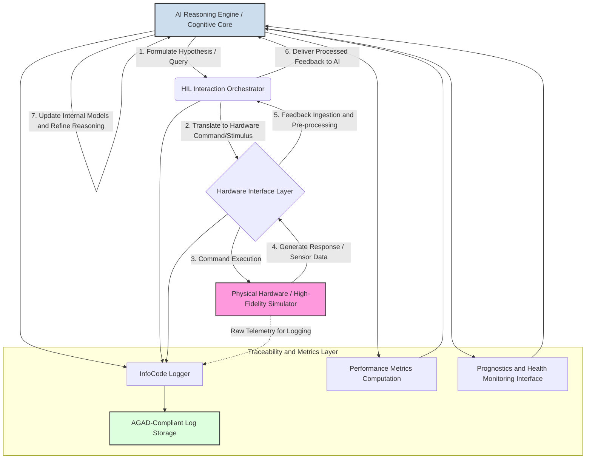
**Diagram Description (Conceptual):**
The AI Reasoning Engine formulates hypotheses or queries. These are passed to a HIL Interaction Orchestrator, which translates them into commands/stimuli for the Hardware Interface Layer. This layer interacts with the Physical Hardware or its High-Fidelity Simulator. The hardware responds, and this feedback is ingested, pre-processed, and sent back to the AI Reasoning Engine. The AI updates its internal models and refines its reasoning based on this grounded feedback. A Traceability & Metrics Layer logs all interactions with InfoCodes, stores them in an AGAD-compliant manner, computes performance metrics, and can interface with PHM systems.

### 2.5 Technical Requirements for HIL Thinking
1.  **AI Agent Architecture:** Must support iterative reasoning, model updates from external feedback, formulation of testable queries/stimuli, and interpretation of diverse sensor/system responses.
2.  **HIL Testbed/Simulator Integration:** Standardized APIs ("Hardware Bridge") for connecting AI to HIL testbeds or high-fidelity simulators (e.g., using DDS, OPC-UA, REST/gRPC). Real-time or near real-time data exchange. AI must be able to command/stimulate HIL and receive deterministic responses.
3.  **Feedback Ingestion & Processing:** Real-time handlers for telemetry, sensor data, system states. Pre-processing for data cleaning, normalization, feature extraction.
4.  **Loop Orchestrator & Control:** Manages the query-stimulate-feedback-reason cycle, timing, synchronization, error handling.
5.  **Metric & Verifier Layer:** Computes physical metrics (ToEPredictionProfile, α–λ, stability margins). Verifies AI inferences against physical constraints.
6.  **Traceability & Logging Infrastructure:** Comprehensive logging of AI-hardware interactions, AI reasoning, model updates. GAIA-QAO InfoCode integration. AGAD-compliant audit log.
7.  **Digital Twin Synchronization:** Mechanisms to synchronize AI's internal models with updates from a master Digital Twin, ensuring reasoning is based on the most current validated system representation.

### 2.6 Benefits of HIL Thinking
1.  **Physics-Grounded AI:** Reduces AI "hallucinations" by validating against physical reality.
2.  **Enhanced Trustworthiness & Safety:** AI behavior becomes more predictable and failure modes better understood.
3.  **Auditability & Certifiability:** Detailed HIL interaction logs provide audit trails for compliance (DO-178C, DO-330).
4.  **Cyber-Physical Co-evolution:** AI learns nuances of specific physical assets; system performance optimized by AI insights.
5.  **Improved Anomaly Detection & Diagnostics:** Active probing allows nuanced fault isolation.
6.  **Accelerated V&V:** Early lifecycle integration streamlines V&V.
7.  **Traceable Autonomy:** Decisions traced to HIL interactions and physical reasoning.
8.  **Reduced Model-World Mismatch:** Enforces consistency between AI's internal models and actual system state.

### 2.7 Integration with GAIA-Q Architecture
*   **GAIA-Q-UI (Part 8):** Interface for human operators to initiate/observe HIL Thinking scenarios. AI Model Routing Engine can direct queries to HIL-capable AI agents.
*   **MCP & QCMs:** MCP orchestrates HIL Thinking tasks. HIL loop can include QCMs, quantum sensors, or quantum simulators.
*   **GAIA-QAO Object Registry (Parts 3 & 4):** Provides context (MDL, Config Code) for HIL interactions, influencing AI's baseline models.
*   **Digital Twins:** HIL Thinking validates/refines Digital Twins by comparing simulated vs. real hardware responses.
*   **AGAD & InfoCode (Part 9.3.1):** HIL Thinking's logging directly supports and contributes to the AGAD-compliant archive.

### 2.8 Implementation Roadmap for HIL Thinking
1.  **Phase 1 (Proof of Concept - Simulated HIL):** Basic AI agent, "Hardware Bridge" to software simulator, core inference loop, initial InfoCode logging.
2.  **Phase 2 (Physical HIL Testbed Integration):** Extend Hardware Bridge to physical HIL rig, refine feedback ingestion, develop Metric & Verifier Layer.
3.  **Phase 3 (GAIA-Q-UI & MCP Integration):** HIL Thinking as a service via GAIA-Q-UI, MCP orchestration, AGAD-compliant logging.
4.  **Phase 4 (Advanced Applications & Quantum HIL):** Complex scenarios (multi-system, autonomous replanning). HIL Thinking for AI interacting with quantum sensors/QCMs. Federated HIL Thinking.

### 2.9 Conclusion (HIL Thinking Specification)
Hardware-in-the-Loop (HIL) Thinking offers a significant advancement for developing trustworthy, physically-grounded AI in safety-critical domains like aerospace. By coupling AI reasoning with real-time hardware feedback, it addresses challenges in AI reliability, V&V, and certifiability. Its implementation within GAIA-Q & AMPEL can accelerate safe autonomous systems deployment, fostering cyber-physical co-evolution. The emphasis on InfoCodes and AGAD compliance strengthens its applicability in regulated industries.

---
## Part 3: Object Identification System

This part details the GAIA-QAO Object Identification System (GQOIS), a comprehensive and hierarchical framework for identifying, categorizing, and tracking aerospace objects and their key subsystems.

### 3.1 System Overview
The GAIA-QAO Object Identification System (GQOIS) is a two-tiered, hierarchical identification framework designed for aerospace objects and their constituent subsystems, operating in both atmospheric (Air Systems - AS) and space (Space Systems - SP) domains. It provides a standardized method for uniquely identifying, categorizing, and tracking these entities throughout their entire lifecycle.

The system addresses several critical needs in the aerospace industry:
*   **Unified Identification:** Creates a single, coherent identification system.
*   **Granularity:** Supports identification from the top-level platform down to major subsystems.
*   **Quantum Integration:** Accommodates quantum-enhanced technologies at both platform and subsystem levels.
*   **Standards Compatibility:** Aims for alignment with existing aerospace standards (ATA, CCSDS, etc.) while extending capabilities.
*   **Lifecycle Management:** Supports identification from design through decommissioning.
*   **Configuration Tracking:** Enables tracking of different configurations and modifications for both platforms and key subsystems.
*   **Registry Management:** Provides a framework for a centralized registry with federated nodes.

### 3.2 Tier 1: Top-Level Object Identification

This tier focuses on the identification of the complete aerospace platform (e.g., an entire aircraft, a complete satellite).

#### 3.2.1 Top-Level Object ID Structure

The complete Top-Level Object ID format is:
`DO-A-CCC-ST-MDL-SSSSS[-CC]`

Where:
*   **DO (2 chars):** Domain (AS = Air System, SP = Space System).
*   **A (1 char):** Autonomy Level of the Model (M = Manned/Semi-Autonomous, U = Unmanned/Fully Autonomous). This is an attribute of the MDL.
*   **CCC (3 chars):** Functional Class of the object (e.g., PAX, CGO, SAT, LCH).
*   **ST (2 chars):** Object Category Sub-Type (e.g., NB for Narrow-Body, CO for Communications Satellite). Defines the primary category of the platform.
*   **MDL (3 chars):** Specific Model/Variant of the platform (e.g., Q1H, A2B). Unique within an ST.
*   **SSSSS (5 chars):** Serial Number, unique for each instance of a specific MDL.
*   **CC (2 chars, Optional):** Configuration Code, tracks major configurations of an instance.

**Example:** `AS-M-PAX-BW-Q1H-00001`
    (Air System, Manned, Passenger Transport, Blended Wing Body, Model Q1H, Serial 00001)

#### 3.2.2 Component Descriptions (DO, A, CCC, ST-ObjectCategory, MDL-ObjectModel)

1.  **Domain (DO):**
    *   `AS`: Air System (operates primarily within Earth's atmosphere).
    *   `SP`: Space System (operates primarily in space).
    *(Defined in `domains` table, Part 7.1)*

2.  **Autonomy Level (A):**
    *   `M`: Manned/Semi-Autonomous (designed for human operation or with human oversight).
    *   `U`: Unmanned/Fully Autonomous (designed for autonomous operation without human presence).
    *This is an inherent characteristic of the `MDL` (Model) and is stored with the model definition. It appears in the full ID for clarity and direct interpretation.*
    *(Defined in `autonomy_levels` table, Part 7.1)*

3.  **Functional Class (CCC):**
    *   Categorizes objects by their primary purpose.
    *   **AS Examples:** `PAX` (Passenger), `CGO` (Cargo), `ISR` (Intelligence, Surveillance, Reconnaissance), `SCI` (Scientific Research - Air), `UTL` (Utility), `REC` (Recreational), `XPR` (Experimental - Air), `LTA` (Lighter Than Air), `MIL` (Military Aircraft).
    *   **SP Examples:** `LCH` (Launch System), `SAT` (Satellite), `ORB` (Orbital Platform/Vehicle), `PRB` (Probe), `XPS` (Experimental - Space), `DEF` (Space Defense).
    *(Defined in `object_functional_classes` table, Part 7.1)*

4.  **Object Category Sub-Type (ST):**
    *   Further refines classification within a Functional Class (CCC). Each ST is unique within its CCC.
    *   Examples: `AS-PAX-NB` (Narrow-Body), `SP-SAT-CO` (Communications Satellite).
    *   The complete list of ST codes is in Appendix A.
    *(Defined in `object_category_subtypes` table, Part 7.1)*

5.  **Model/Variant (MDL):**
    *   Represents specific designs or variants within an ST. Has an associated Autonomy Level (A).
    *   Format: `[G][N][V]` (e.g., `Q1H` for Quantum-Gen1-HighPerformance).
    *   Detailed in Part 4: Top-Level Object Model Registry.
    *(Defined in `object_models` table, Part 7.1)*

6.  **Serial Number (SSSSS):**
    *   Uniquely identifies an instance of a specific MDL. Assigned sequentially (00001-99999).
    *(Managed in `object_instances` table, Part 7.3)*

7.  **Configuration Code (CC - Optional):**
    *   Tracks significant configurations of an instance. Format `[T][N]`.
    *   Detailed in Part 6: Configuration Management.
    *(Managed in `object_configurations` table, Part 7.3)*

### 3.3 Tier 2: Subsystem Identification

This tier focuses on identifying major, configurable, or lifecycle-tracked subsystems within a Top-Level Object.

#### 3.3.1 Subsystem ID Structure Concept

A Subsystem ID is contextually linked to its parent Top-Level Object ID and has its own internal structure:

`Parent_Full_Object_ID :: SSS-MDLs-SERs[-CCs]`

Where:
*   **`Parent_Full_Object_ID`:** The complete Tier 1 ID of the object hosting the subsystem (e.g., `AS-M-PAX-BW-Q1H-00001`).
*   **`::`:** A delimiter indicating a subsystem identifier follows.
*   **SSS (3 chars):** Subsystem Type Code (e.g., `ENG` for Engine, `APU` for Auxiliary Power Unit, `NAV` for Navigation System, `FCS` for Flight Control System). Based on a standardized list (see Appendix F).
*   **MDLs (3-5 chars):** Subsystem Model code, specific to subsystem manufacturers/types (e.g., `RRTXW` for a Rolls-Royce Trent XWB model, `HAPS5` for a Honeywell APU Model APS5000).
*   **SERs (4-7 chars):** Subsystem Serial Number, unique for each instance of a specific MDLs.
*   **CCs (2 chars, Optional):** Subsystem Configuration Code, tracks major configurations of a subsystem instance.

**Example:** `AS-M-PAX-BW-Q1H-00001 :: ENG-RRTXW-E001A-C1`
    (Engine, Rolls-Royce Trent XWB, Serial E001A, Configuration C1, installed on aircraft AS-M-PAX-BW-Q1H-00001)

#### 3.3.2 Component Descriptions (SSS-SubsystemType, MDLs-SubsystemModel, SERs, CCs)

1.  **Subsystem Type Code (SSS):**
    *   A 3-character code identifying the general type of subsystem.
    *   Derived from ATA chapters for Air Systems and a new mapping for Space Systems (based on SS 00-99 from Part 9.3.4).
    *   Examples: `AVN` (Avionics Suite), `PROP` (Propulsion System Main), `EPS` (Electrical Power System).
    *   A proposed list is in Appendix F.
    *(Defined in `subsystem_types` table, Part 7.2)*

2.  **Subsystem Model (MDLs):**
    *   A 3-5 character code representing the specific make/model of the subsystem.
    *   Example: `GE9X` (GE9X Engine), `APS5K` (APU Model APS5000).
    *(Defined in `subsystem_models` table, Part 7.2)*

3.  **Subsystem Serial Number (SERs):**
    *   A 4-7 character alphanumeric serial number unique to an instance of a subsystem model.
    *(Managed in `subsystem_instances` table, Part 7.2)*

4.  **Subsystem Configuration Code (CCs - Optional):**
    *   Tracks significant configurations of a subsystem instance. Format `[T][N]`.
    *(Managed in `subsystem_configurations` table, Part 7.2)*

### 3.4 Database Implementation (General Overview for both Tiers)

The GQOIS is implemented as a relational database.
*   **Tier 1:** Core tables (`domains`, `autonomy_levels`, `object_functional_classes`, `object_category_subtypes`, `object_models`, `object_instances`, `object_configurations`) manage top-level objects.
*   **Tier 2:** Additional tables (`subsystem_types`, `subsystem_models`, `subsystem_instances`, `subsystem_configurations`, `object_subsystem_installations`) manage subsystems and link them to `object_instances`.
A detailed schema is in Part 7.

### 3.5 ID Formation Process (Examples for both Tiers)

**Tier 1 ID Formation (Recap):**
1.  Model selection dictates DO, A, CCC, ST.
2.  Serial number (SSSSS) is assigned.
Example: `AS-M-PAX-BW-Q1H-00001`. Optional CC: `AS-M-PAX-BW-Q1H-00001-B1`.

**Tier 2 ID Formation:**
1.  Identify Parent Object: `AS-M-PAX-BW-Q1H-00001`.
2.  Identify Subsystem Type (SSS): Main Engine (`ENG`).
3.  Identify Subsystem Model (MDLs): QuantumCycle X1 (`QCX1`).
4.  Assign Subsystem Serial Number (SERs): `E0001B`.
5.  Construct Full Subsystem Reference: `AS-M-PAX-BW-Q1H-00001 :: ENG-QCX1-E0001B`.
6.  Add Optional Subsystem Configuration (CCs): `AS-M-PAX-BW-Q1H-00001 :: ENG-QCX1-E0001B-P1`.

### 3.6 Registry Management (Considerations for both Tiers)

A central GAIA-QAO registry, with potential for federated nodes, will manage the allocation and lifecycle of all IDs.
*   **ID Allocation:** Processes for requesting new Model codes and blocks of Serial Numbers.
*   **Uniqueness:** Ensured by database constraints at each level.
*   **Federation:** Future capability for distributed management.
*   **Standards Integration:** Mapping to external standards (ATA, CCSDS, SS 00-99).
*   **Quantum Support:** Specific codes and metadata fields for quantum-enhanced platforms/subsystems.
*   **Lifecycle Tracking:** The `object_subsystem_installations` table is key for tracking subsystem installation history.

---
## Part 4: Top-Level Object Model Registry

This part details the structure for Model Codes (MDL) assigned to Top-Level Objects and provides an expanded catalog of representative models for Air Systems (AS) and Space Systems (SP). Each model is associated with an Autonomy Level (A), Functional Class (CCC), and Sub-Type (ST) defined in Part 3.

### 4.1 Model Code Structure for Top-Level Objects (`[G][N][V]`)

Each Top-Level Object Model (MDL) code in the GAIA-QAO system follows a standardized 3-character format:
`[G][N][V]`

Where:
*   **G (Generation/Series):** A letter indicating the generation or technology series.
    *   `Q`: Quantum-enhanced systems (GAIA-QAO primary focus).
    *   `A`: Advanced conventional systems.
    *   `P`: Prototype/Experimental systems.
    *   `S`: Standard production systems (often legacy or baseline conventional).
    *   `E`: Evolutionary/Upgraded conventional systems.
*   **N (Number/Size/Capability):** A number (1-4, expandable to 0-9) indicating relative size, capacity, or capability level within its generation and sub-type.
    *   `1`: Small/Light/Low-Capability.
    *   `2`: Medium.
    *   `3`: Large/Heavy/High-Capability.
    *   `4`: Extra Large/Super Heavy/Very High-Capability.
*   **V (Variant/Version):** A letter indicating the specific variant or version of the model.
    *   `A, B, C, ...`: Sequential variants.
    *   `H`: High-performance/High-endurance variant.
    *   `L`: Long-range/Long-duration variant.
    *   `S`: Special purpose/Specialized mission variant.
    *   `X`: Experimental sub-variant of a production series.

Each Model (MDL) is defined in the `object_models` table (see Part 7) and has an inherent `autonomy_code` (M or U), `subtype_id` (linking to ST, CCC, DO), name, description, and technical specifications.

### 4.2 Air Systems (AS) Top-Level Object Models (Expanded Catalog)

*(The fully expanded catalog for all AS models from 4.2.1 Passenger Transport (PAX) Models through 4.2.9 Military Aircraft (MIL) Models, as generated in the previous turn, is inserted here. This includes the table for each sub-section with ST Code, MDL Code, Model Name, Description, Key Specifications, and the "GAIA-QAO ID Example & Catalog Notes" column.)*

# QAO Air Systems

## 1. Part 1: Software Technology Landscape in Aerospace and Military Systems
* This entire part is foundational for Air Systems. It details software priorities (reliability, safety), critical standards (DO-178C for civil aviation, MIL-STD-498 for military), common programming languages (Ada, C, C++, Python, MATLAB/Simulink, Rust), development environments (GHS MULTI, Wind River VxWorks, SCADE), Real-Time Operating Systems (ARINC 653), communication buses (ARINC 429, MIL-STD-1553B), and certification processes pertinent to aircraft and other aerospace vehicles.

## 2. Part 2: Object Identification System
* **2.2.1 Top-Level Object ID Structure (`DO-A-CCC-ST-MDL-SSSSS-CC`)**:
    * The `DO` (Domain) component is specified as `AS` for "Air System".
* **2.2.2 Component Descriptions (Top-Level Object ID)**:
    * **DO (Domain)**: `AS` (Air System). The defining boundary between Air and Space systems is noted as approximately 30,000m.
* **2.5 ID Formation Process (Examples for both Tiers)**:
    * The Tier 1 example for a Top-Level Object is an Air System: `AS-M-PAX-NB-Q2A-00101`.
    * The Tier 2 Subsystem ID example features a subsystem linked to this Air System parent object.

## 3. Part 3: Top-Level Object Model Registry
* This part, specifically Section 3.2, is dedicated to Air Systems and provides the structure for `MDL` (Object Model/Variant) codes.

    **3.1 Model Code Structure for Top-Level Objects (`[G][N][V]`)**
    Format: `[G][N][V]`
    -   **G** (Generation/Series): Q (Quantum), A (Advanced), P (Prototype), S (Standard).
    -   **N** (Number/Size): 1-4 (Small to Extra Large).
    -   **V** (Variant): A-Z (Sequential), H (High-performance), L (Long-range), S (Special purpose).

    **3.2 Air Systems (AS) Top-Level Object Models**


### 3.2.1 Passenger Transport (PAX) Models

| Sub-Type (ST) | MDL Code | Model Name                                                                                                              | Description                                    | Key Specifications                                                                                           | GAIA-QAO ID Example & Catalog Notes                                                                                                                                                   |
|---------------|----------|--------------------------------------------------------------------------------------------------------------------------|------------------------------------------------|-------------------------------------------------------------------------------------------------------------|---------------------------------------------------------------------------------------------------------------------------------------------------------------------------------------|
| **NB**       | Q2A      | [QuantumNarrow QN-200](https://github.com/Gaia-Q-Air/assets/blob/main/AS/M/PAX/NB/Q2A/QuantumNarrow-QN-200.md)            | Medium quantum-enhanced narrow-body            | Capacity: 180 pax, Range: 5,500 km                                                                         | ID: AS-M-PAX-NB-Q2A-00101  <br> Autonomy: M. Notes: Medium-haul passenger transport with quantum-augmented systems. Full specs in registry.                                          |
| **NB**       | A2B      | [AeroSingle AS-220](https://github.com/Gaia-Q-Air/assets/blob/main/AS/M/PAX/NB/A2B/AeroSingle-AS-220.md)                  | Medium conventional narrow-body                | Capacity: 220 pax, Range: 5,000 km                                                                         | ID: AS-M-PAX-NB-A2B-00102  <br> Autonomy: M. Notes: Conventional medium-haul passenger transport. Full specs in registry.                                                            |
| **WB**       | Q3L      | [QuantumWide QW-350L](https://github.com/Gaia-Q-Air/assets/blob/main/AS/M/PAX/WB/Q3L/QuantumWide-QW-350L.md)              | Large long-range quantum wide-body             | Capacity: 350 pax, Range: 15,000 km                                                                        | ID: AS-M-PAX-WB-Q3L-00103  <br> Autonomy: M. Notes: Long-haul wide-body with quantum efficiencies. Full specs in registry.                                                           |
| **WB**       | A3B      | [AeroTwin AT-330](https://github.com/Gaia-Q-Air/assets/blob/main/AS/M/PAX/WB/A3B/AeroTwin-AT-330.md)                      | Large conventional wide-body                   | Capacity: 330 pax, Range: 12,000 km                                                                        | ID: AS-M-PAX-WB-A3B-00104  <br> Autonomy: M. Notes: Conventional long-haul wide-body transport. Full specs in registry.                                                              |
| **RJ**       | Q1H      | [QuantumRegional QR-90H](https://github.com/Gaia-Q-Air/assets/blob/main/AS/M/PAX/RJ/Q1H/QuantumRegional-QR-90H.md)        | Small high-performance quantum regional jet    | Capacity: 90 pax, Range: 3,200 km                                                                          | ID: AS-M-PAX-RJ-Q1H-00105  <br> Autonomy: M. Notes: High-performance regional jet with quantum systems. Full specs in registry.                                                     |
| **RJ**       | S1A      | [RegionalJet RJ-75](https://github.com/Gaia-Q-Air/assets/blob/main/AS/M/PAX/RJ/S1A/RegionalJet-RJ-75.md)                  | Small standard regional jet                    | Capacity: 75 pax, Range: 2,800 km                                                                          | ID: AS-M-PAX-RJ-S1A-00106  <br> Autonomy: M. Notes: Standard regional passenger jet. Full specs in registry.                                                                         |
| **BJ**       | Q1S      | [QuantumExec QE-12S](https://github.com/Gaia-Q-Air/assets/blob/main/AS/M/PAX/BJ/Q1S/QuantumExec-QE-12S.md)                | Special purpose quantum business jet           | Capacity: 12 pax, Range: 7,500 km                                                                          | ID: AS-M-PAX-BJ-Q1S-00107  <br> Autonomy: M. Notes: Quantum-enhanced executive transport. Full specs in registry.                                                                    |
| **BJ**       | A1L      | [AeroExec AE-15L](https://github.com/Gaia-Q-Air/assets/blob/main/AS/M/PAX/BJ/A1L/AeroExec-AE-15L.md)                      | Long-range conventional business jet           | Capacity: 15 pax, Range: 7,000 km                                                                          | ID: AS-M-PAX-BJ-A1L-00108  <br> Autonomy: M. Notes: Conventional long-range business aviation. Full specs in registry.                                                              |
| **VT**       | Q1A      | [QuantumLift QL-6A](https://github.com/Gaia-Q-Air/assets/blob/main/AS/M/PAX/VT/Q1A/QuantumLift-QL-6A.md)                  | Small quantum-enhanced eVTOL air taxi          | Capacity: 6 pax, Range: 300 km                                                                             | ID: AS-M-PAX-VT-Q1A-00109  <br> Autonomy: M. Notes: Urban Air Mobility eVTOL with quantum systems. Full specs in registry.                                                           |
| **VT**       | A1B      | [AeroVert AV-4B](https://github.com/Gaia-Q-Air/assets/blob/main/AS/M/PAX/VT/A1B/AeroVert-AV-4B.md)                        | Small conventional eVTOL air taxi              | Capacity: 4 pax, Range: 150 km                                                                             | ID: AS-M-PAX-VT-A1B-00110  <br> Autonomy: M. Notes: Conventional Urban Air Mobility eVTOL. Full specs in registry.                                                                  |
| **BW**       | Q1H      | [AMPEL360 BWB-Q100](https://github.com/Gaia-Q-Air/assets/blob/main/AS/M/PAX/BW/Q1H/AMPEL360-BWB-Q100.md)                  | Small quantum-enhanced BWB passenger aircraft  | Cap: 100 pax, Range: 5,500 km, Quantum: Nav, Opt, Comms                                                   | ID: AS-M-PAX-BW-Q1H-00001  <br> Autonomy: M. Notes: Efficient BWB design with quantum navigation/optimization. Full specs in registry.                                              |
| **BW**       | Q2A      | [AMPEL360 BWB-Q250](https://github.com/Gaia-Q-Air/assets/blob/main/AS/M/PAX/BW/Q2A/AMPEL360-BWB-Q250.md)                  | Medium quantum-enhanced BWB passenger aircraft | Cap: 250 pax, Range: 8,000 km, Quantum: Nav, Opt, Comms, Ctrl                                              | ID: AS-M-PAX-BW-Q2A-00111  <br> Autonomy: M. Notes: Medium capacity BWB with enhanced quantum systems. Full specs in registry.                                                      |
| **BW**       | P1B      | [BWB-X Demonstrator](https://github.com/Gaia-Q-Air/assets/blob/main/AS/M/PAX/BW/P1B/BWB-X-Demonstrator.md)                | Small BWB technology demonstrator              | Cap: 40 pax (equiv), Range: 3,000 km                                                                       | ID: AS-M-PAX-BW-P1B-00112  <br> Autonomy: M. Notes: Experimental BWB technology flight demonstrator. Full specs in registry.                                                         |
| **SS**       | Q2B      | [QuantumSonic QS-150](https://github.com/Gaia-Q-Air/assets/blob/main/AS/M/PAX/SS/Q2B/QuantumSonic-QS-150.md)              | Medium quantum-enhanced supersonic airliner    | Capacity: 150 pax, Speed: Mach 2.2                                                                         | ID: AS-M-PAX-SS-Q2B-00113  <br> Autonomy: M. Notes: Supersonic passenger transport with quantum-enhanced performance. Full specs in registry.                                        |
| **HS**       | P2A      | [HyperTransport HT-100](https://github.com/Gaia-Q-Air/assets/blob/main/AS/M/PAX/HS/P2A/HyperTransport-HT-100.md)          | Medium hypersonic transport demonstrator       | Capacity: 100 pax, Speed: Mach 5+                                                                          | ID: AS-M-PAX-HS-P2A-00114  <br> Autonomy: M. Notes: Experimental hypersonic passenger transport demonstrator. Full specs in registry.                                               |
| **QP**       | Q3L      | [QuantumJet Q-350L](https://github.com/Gaia-Q-Air/assets/blob/main/AS/M/PAX/QP/Q3L/QuantumJet-Q-350L.md)                  | Large long-range quantum-powered airliner      | Capacity: 350 pax, Range: 14,000 km                                                                        | ID: AS-M-PAX-QP-Q3L-00115  <br> Autonomy: M. Notes: Long-range airliner with quantum-derived propulsion systems. Full specs in registry.                                            |

#### 3.2.2 Cargo Transport (CGO) Models

| Sub-Type (ST) | MDL Code | Model Name                                                                                                              | Description                                   | Key Specifications                     | **GAIA-QAO ID Example & Catalog Notes**                                                                                                                                             |
| :------------ | :------- | :---------------------------------------------------------------------------------------------------------------------- | :------------------------------------------- | :------------------------------------- | :--------------------------------------------------------------------------------------------------------------------------------------------------------------------------------- |
| LC            | Q1A      | [QuantumFreight QF-5](https://github.com/Gaia-Q-Air/assets/blob/main/AS/U/CGO/LC/Q1A/QuantumFreight-QF-5.md)            | Small quantum-enhanced light cargo            | Payload: 5 tonnes, Range: 2,000 km     | **ID:** `AS-U-CGO-LC-Q1A-00201` <br> **Autonomy:** U. **Notes:** Small quantum-enhanced light cargo for regional delivery. Full specs in registry.                                 |
| MC            | Q2B      | [QuantumFreight QF-20](https://github.com/Gaia-Q-Air/assets/blob/main/AS/U/CGO/MC/Q2B/QuantumFreight-QF-20.md)          | Medium quantum-enhanced cargo                 | Payload: 20 tonnes, Range: 5,000 km    | **ID:** `AS-U-CGO-MC-Q2B-00202` <br> **Autonomy:** U. **Notes:** Medium-lift quantum cargo for inter-city transport. Full specs in registry.                                       |
| HC            | Q3L      | [QuantumFreight QF-80L](https://github.com/Gaia-Q-Air/assets/blob/main/AS/U/CGO/HC/Q3L/QuantumFreight-QF-80L.md)        | Large long-range quantum cargo                | Payload: 80 tonnes, Range: 10,000 km   | **ID:** `AS-U-CGO-HC-Q3L-00203` <br> **Autonomy:** U. **Notes:** Heavy-lift, long-range quantum cargo aircraft. Full specs in registry.                                            |
| FC            | A2A      | [AeroConvert AC-30](https://github.com/Gaia-Q-Air/assets/blob/main/AS/M/CGO/FC/A2A/AeroConvert-AC-30.md)                | Medium passenger-to-cargo conversion          | Payload: 30 tonnes, Range: 6,000 km    | **ID:** `AS-M-CGO-FC-A2A-00204` <br> **Autonomy:** M. **Notes:** Converted freighter for general cargo operations. Full specs in registry.                                         |
| QD            | Q1H      | [QuantumExpress QE-8H](https://github.com/Gaia-Q-Air/assets/blob/main/AS/U/CGO/QD/Q1H/QuantumExpress-QE-8H.md)          | Small high-speed quantum delivery             | Payload: 8 tonnes, Range: 3,500 km     | **ID:** `AS-U-CGO-QD-Q1H-00205` <br> **Autonomy:** U. **Notes:** High-speed delivery drone with quantum optimization. Full specs in registry.                                      |
| VC            | Q1A      | [QuantumLift QL-3C](https://github.com/Gaia-Q-Air/assets/blob/main/AS/U/CGO/VC/Q1A/QuantumLift-QL-3C.md)                | Small quantum VTOL cargo                      | Payload: 3 tonnes, Range: 500 km       | **ID:** `AS-U-CGO-VC-Q1A-00206` <br> **Autonomy:** U. **Notes:** VTOL cargo drone for point-to-point delivery. Full specs in registry.                                             |
| UC            | Q2S      | [QuantumDrone QD-15S](https://github.com/Gaia-Q-Air/assets/blob/main/AS/U/CGO/UC/Q2S/QuantumDrone-QD-15S.md)            | Medium special purpose unmanned quantum cargo | Payload: 15 tonnes, Range: 4,000 km    | **ID:** `AS-U-CGO-UC-Q2S-00012` <br> **Autonomy:** U. **Notes:** Special purpose cargo drone with quantum systems. Full specs in registry.                                         |
| QC            | Q3H      | [QuantumCargo QC-100H](https://github.com/Gaia-Q-Air/assets/blob/main/AS/U/CGO/QC/Q3H/QuantumCargo-QC-100H.md)          | Large high-capacity quantum cargo             | Payload: 100 tonnes, Range: 9,000 km   | **ID:** `AS-U-CGO-QC-Q3H-00207` <br> **Autonomy:** U. **Notes:** Very large capacity quantum-enhanced cargo transport. Full specs in registry.                                     |


#### 3.2.3 Intelligence, Surveillance, Reconnaissance (ISR) Models

| Sub-Type (ST) | MDL Code | Model Name                                                                                                              | Description                                   | Key Specifications                         | **GAIA-QAO ID Example & Catalog Notes**                                                                                                                                             |
| :------------ | :------- | :---------------------------------------------------------------------------------------------------------------------- | :-------------------------------------------- | :----------------------------------------- | :--------------------------------------------------------------------------------------------------------------------------------------------------------------------------------- |
| UA            | Q2L      | [QuantumHawk QH-20L](https://github.com/Gaia-Q-Air/assets/blob/main/AS/U/ISR/UA/Q2L/QuantumHawk-QH-20L.md)              | Medium long-endurance quantum UAS             | Endurance: 48 hrs, Ceiling: 15,000 m     | **ID:** `AS-U-ISR-UA-Q2L-00301` <br> **Autonomy:** U. **Notes:** Long-endurance ISR UAS with quantum-enhanced sensors. Full specs in registry.                                     |
| MA            | Q3H      | [QuantumMaritime QM-300](https://github.com/Gaia-Q-Air/assets/blob/main/AS/M/ISR/MA/Q3H/QuantumMaritime-QM-300.md)      | Large high-performance quantum maritime patrol| Endurance: 24 hrs, Range: 9,000 km       | **ID:** `AS-M-ISR-MA-Q3H-00302` <br> **Autonomy:** M. **Notes:** High-performance maritime patrol with quantum sensors. Full specs in registry.                                   |
| SR            | Q2S      | [QuantumRecon QR-200S](https://github.com/Gaia-Q-Air/assets/blob/main/AS/U/ISR/SR/Q2S/QuantumRecon-QR-200S.md)          | Medium special purpose strategic recon        | Ceiling: 25,000 m, Speed: Mach 3           | **ID:** `AS-U-ISR-SR-Q2S-00303` <br> **Autonomy:** U. **Notes:** High-altitude, high-speed strategic reconnaissance with quantum systems. Full specs in registry.                |
| TR            | Q1A      | [QuantumTactical QT-100](https://github.com/Gaia-Q-Air/assets/blob/main/AS/U/ISR/TR/Q1A/QuantumTactical-QT-100.md)      | Small quantum tactical recon                  | Endurance: 12 hrs, Ceiling: 12,000 m     | **ID:** `AS-U-ISR-TR-Q1A-00304` <br> **Autonomy:** U. **Notes:** Tactical reconnaissance UAS with quantum-enhanced payload. Full specs in registry.                               |
| EW            | Q2H      | [QuantumSpectrum QS-200](https://github.com/Gaia-Q-Air/assets/blob/main/AS/M/ISR/EW/Q2H/QuantumSpectrum-QS-200.md)      | Medium high-capability electronic warfare     | Range: 6,000 km, Advanced EW suite       | **ID:** `AS-M-ISR-EW-Q2H-00305` <br> **Autonomy:** M. **Notes:** Electronic warfare platform with quantum spectrum analysis. Full specs in registry.                              |
| SI            | Q2B      | [QuantumSignal QS-250](https://github.com/Gaia-Q-Air/assets/blob/main/AS/M/ISR/SI/Q2B/QuantumSignal-QS-250.md)          | Medium SIGINT platform                        | Endurance: 18 hrs, Comprehensive SIGINT    | **ID:** `AS-M-ISR-SI-Q2B-00306` <br> **Autonomy:** M. **Notes:** SIGINT collection platform with quantum processing. Full specs in registry.                                       |
| IM            | Q2A      | [QuantumImage QI-200](https://github.com/Gaia-Q-Air/assets/blob/main/AS/U/ISR/IM/Q2A/QuantumImage-QI-200.md)            | Medium imaging platform                       | Resolution: 5 cm from 15,000 m           | **ID:** `AS-U-ISR-IM-Q2A-00307` <br> **Autonomy:** U. **Notes:** High-resolution imaging platform with quantum-enhanced sensors. Full specs in registry.                         |
| MS            | Q3S      | [QuantumSensor QS-350](https://github.com/Gaia-Q-Air/assets/blob/main/AS/M/ISR/MS/Q3S/QuantumSensor-QS-350.md)          | Large multi-sensor platform                   | 12+ integrated quantum sensor systems    | **ID:** `AS-M-ISR-MS-Q3S-00308` <br> **Autonomy:** M. **Notes:** Large platform with diverse quantum sensor integration. Full specs in registry.                                  |
| QI            | Q3H      | [QuantumEye QE-350H](https://github.com/Gaia-Q-Air/assets/blob/main/AS/U/ISR/QI/Q3H/QuantumEye-QE-350H.md)              | Large high-altitude, high-performance quantum ISR | Endurance: 48+ hrs, Ceiling: 22,000 m    | **ID:** `AS-U-ISR-QI-Q3H-00005` <br> **Autonomy:** U. **Notes:** Flagship quantum ISR platform for persistent surveillance. Full specs in registry.                              |


#### 3.2.3 Intelligence, Surveillance, Reconnaissance (ISR) Models

| Sub-Type (ST) | MDL Code | Model Name                                                                                                              | Description                                   | Key Specifications                         | **GAIA-QAO ID Example & Catalog Notes**                                                                                                                                             |
| :------------ | :------- | :---------------------------------------------------------------------------------------------------------------------- | :------------------------------------------- | :----------------------------------------- | :--------------------------------------------------------------------------------------------------------------------------------------------------------------------------------- |
| UA            | Q2L      | [QuantumHawk QH-20L](https://github.com/Gaia-Q-Air/assets/blob/main/AS/U/ISR/UA/Q2L/QuantumHawk-QH-20L.md)              | Medium long-endurance quantum UAS             | Endurance: 48 hrs, Ceiling: 15,000 m     | **ID:** `AS-U-ISR-UA-Q2L-00301` <br> **Autonomy:** U. **Notes:** Long-endurance ISR UAS with quantum-enhanced sensors. Full specs in registry.                                     |
| MA            | Q3H      | [QuantumMaritime QM-300](https://github.com/Gaia-Q-Air/assets/blob/main/AS/M/ISR/MA/Q3H/QuantumMaritime-QM-300.md)      | Large high-performance quantum maritime patrol| Endurance: 24 hrs, Range: 9,000 km       | **ID:** `AS-M-ISR-MA-Q3H-00302` <br> **Autonomy:** M. **Notes:** High-performance maritime patrol with quantum sensors. Full specs in registry.                                   |
| SR            | Q2S      | [QuantumRecon QR-200S](https://github.com/Gaia-Q-Air/assets/blob/main/AS/U/ISR/SR/Q2S/QuantumRecon-QR-200S.md)          | Medium special purpose strategic recon        | Ceiling: 25,000 m, Speed: Mach 3           | **ID:** `AS-U-ISR-SR-Q2S-00303` <br> **Autonomy:** U. **Notes:** High-altitude, high-speed strategic reconnaissance with quantum systems. Full specs in registry.                |
| TR            | Q1A      | [QuantumTactical QT-100](https://github.com/Gaia-Q-Air/assets/blob/main/AS/U/ISR/TR/Q1A/QuantumTactical-QT-100.md)      | Small quantum tactical recon                  | Endurance: 12 hrs, Ceiling: 12,000 m     | **ID:** `AS-U-ISR-TR-Q1A-00304` <br> **Autonomy:** U. **Notes:** Tactical reconnaissance UAS with quantum-enhanced payload. Full specs in registry.                               |
| EW            | Q2H      | [QuantumSpectrum QS-200](https://github.com/Gaia-Q-Air/assets/blob/main/AS/M/ISR/EW/Q2H/QuantumSpectrum-QS-200.md)      | Medium high-capability electronic warfare     | Range: 6,000 km, Advanced EW suite       | **ID:** `AS-M-ISR-EW-Q2H-00305` <br> **Autonomy:** M. **Notes:** Electronic warfare platform with quantum spectrum analysis. Full specs in registry.                              |
| SI            | Q2B      | [QuantumSignal QS-250](https://github.com/Gaia-Q-Air/assets/blob/main/AS/M/ISR/SI/Q2B/QuantumSignal-QS-250.md)          | Medium SIGINT platform                        | Endurance: 18 hrs, Comprehensive SIGINT    | **ID:** `AS-M-ISR-SI-Q2B-00306` <br> **Autonomy:** M. **Notes:** SIGINT collection platform with quantum processing. Full specs in registry.                                       |
| IM            | Q2A      | [QuantumImage QI-200](https://github.com/Gaia-Q-Air/assets/blob/main/AS/U/ISR/IM/Q2A/QuantumImage-QI-200.md)            | Medium imaging platform                       | Resolution: 5 cm from 15,000 m           | **ID:** `AS-U-ISR-IM-Q2A-00307` <br> **Autonomy:** U. **Notes:** High-resolution imaging platform with quantum-enhanced sensors. Full specs in registry.                         |
| MS            | Q3S      | [QuantumSensor QS-350](https://github.com/Gaia-Q-Air/assets/blob/main/AS/M/ISR/MS/Q3S/QuantumSensor-QS-350.md)          | Large multi-sensor platform                   | 12+ integrated quantum sensor systems    | **ID:** `AS-M-ISR-MS-Q3S-00308` <br> **Autonomy:** M. **Notes:** Large platform with diverse quantum sensor integration. Full specs in registry.                                  |
| QI            | Q3H      | [QuantumEye QE-350H](https://github.com/Gaia-Q-Air/assets/blob/main/AS/U/ISR/QI/Q3H/QuantumEye-QE-350H.md)              | Large high-altitude, high-performance quantum ISR | Endurance: 48+ hrs, Ceiling: 22,000 m    | **ID:** `AS-U-ISR-QI-Q3H-00005` <br> **Autonomy:** U. **Notes:** Flagship quantum ISR platform for persistent surveillance. Full specs in registry.                              |
  

#### 3.2.4 Scientific Research (SCI) Models

| Sub-Type (ST) | MDL Code | Model Name                                                                                                              | Description                                    | Key Specifications                               | **GAIA-QAO ID Example & Catalog Notes**                                                                                                                                             |
| :------------ | :------- | :---------------------------------------------------------------------------------------------------------------------- | :--------------------------------------------- | :----------------------------------------------- | :--------------------------------------------------------------------------------------------------------------------------------------------------------------------------------- |
| AT            | Q2A      | [QuantumAtmos QA-200](https://github.com/Gaia-Q-Air/assets/blob/main/AS/M/SCI/AT/Q2A/QuantumAtmos-QA-200.md)            | Medium quantum atmospheric research aircraft   | Ceiling: 20,000 m, 30+ atm. sensors            | **ID:** `AS-M-SCI-AT-Q2A-00003` <br> **Autonomy:** M. **Notes:** Atmospheric research platform with quantum sensors. Full specs in registry.                                      |
| OC            | Q2B      | [QuantumOcean QO-200](https://github.com/Gaia-Q-Air/assets/blob/main/AS/M/SCI/OC/Q2B/QuantumOcean-QO-200.md)            | Medium quantum oceanographic research aircraft | Endurance: 18 hrs, Advanced ocean sensors        | **ID:** `AS-M-SCI-OC-Q2B-00401` <br> **Autonomy:** M. **Notes:** Oceanographic research with quantum-enhanced sensing capabilities. Full specs in registry.                     |
| ER            | Q2H      | [QuantumEarth QE-250](https://github.com/Gaia-Q-Air/assets/blob/main/AS/M/SCI/ER/Q2H/QuantumEarth-QE-250.md)            | Medium high-performance quantum Earth sensing  | Resolution: 10 cm, 15+ spectral bands          | **ID:** `AS-M-SCI-ER-Q2H-00402` <br> **Autonomy:** M. **Notes:** High-performance Earth observation for scientific use, quantum sensors. Full specs in registry.                |
| WX            | Q2S      | [QuantumStorm QS-200](https://github.com/Gaia-Q-Air/assets/blob/main/AS/M/SCI/WX/Q2S/QuantumStorm-QS-200.md)            | Medium special purpose quantum weather research| Ceiling: 18,000 m, Storm penetration capability| **ID:** `AS-M-SCI-WX-Q2S-00403` <br> **Autonomy:** M. **Notes:** Weather research, storm penetration, quantum atmospheric sensors. Full specs in registry.                     |
| CR            | Q3L      | [QuantumClimate QC-300](https://github.com/Gaia-Q-Air/assets/blob/main/AS/M/SCI/CR/Q3L/QuantumClimate-QC-300.md)        | Large long-range quantum climate research      | Range: 12,000 km, Comprehensive climate sensors| **ID:** `AS-M-SCI-CR-Q3L-00404` <br> **Autonomy:** M. **Notes:** Long-range climate research platform with extensive quantum sensor suite. Full specs in registry.             |
| GS            | Q2A      | [QuantumGeo QG-200](https://github.com/Gaia-Q-Air/assets/blob/main/AS/M/SCI/GS/Q2A/QuantumGeo-QG-200.md)                | Medium quantum geophysical survey aircraft     | Endurance: 14 hrs, Advanced geophysical sensors| **ID:** `AS-M-SCI-GS-Q2A-00405` <br> **Autonomy:** M. **Notes:** Geophysical survey aircraft with quantum gravimeters/magnetometers. Full specs in registry.                   |
| MP            | Q3S      | [QuantumScience QS-300](https://github.com/Gaia-Q-Air/assets/blob/main/AS/M/SCI/MP/Q3S/QuantumScience-QS-300.md)        | Large special purpose quantum multi-research   | Modular sensor bay, 50+ possible configurations| **ID:** `AS-M-SCI-MP-Q3S-00406` <br> **Autonomy:** M. **Notes:** Multi-purpose large scientific platform with quantum sensor options. Full specs in registry.                  |
| QS            | Q2H      | [QuantumSense QS-250H](https://github.com/Gaia-Q-Air/assets/blob/main/AS/M/SCI/QS/Q2H/QuantumSense-QS-250H.md)          | Medium high-performance quantum sensing platform | 20+ quantum sensors, Unprecedented sensitivity | **ID:** `AS-M-SCI-QS-Q2H-00407` <br> **Autonomy:** M. **Notes:** Dedicated quantum sensing research aircraft for fundamental physics/materials. Full specs in registry.         |


#### 3.2.5 Utility (UTL) Models

| Sub-Type (ST) | MDL Code | Model Name                                                                                                              | Description                                     | Key Specifications                               | **GAIA-QAO ID Example & Catalog Notes**                                                                                                                                             |
| :------------ | :------- | :---------------------------------------------------------------------------------------------------------------------- | :---------------------------------------------- | :----------------------------------------------- | :--------------------------------------------------------------------------------------------------------------------------------------------------------------------------------- |
| FF            | Q2A      | [QuantumFire QF-200](https://github.com/Gaia-Q-Air/assets/blob/main/AS/M/UTL/FF/Q2A/QuantumFire-QF-200.md)              | Medium quantum-enhanced firefighting aircraft   | Water capacity: 12,000 L, Precision delivery   | **ID:** `AS-M-UTL-FF-Q2A-00021` <br> **Autonomy:** M. **Notes:** Aerial firefighting with quantum-optimized water delivery. Full specs in registry.                              |
| AG            | Q1B      | [QuantumCrop QC-100](https://github.com/Gaia-Q-Air/assets/blob/main/AS/M/UTL/AG/Q1B/QuantumCrop-QC-100.md)              | Small quantum agricultural aircraft             | Spray width: 25 m, Capacity: 2,000 L           | **ID:** `AS-M-UTL-AG-Q1B-00501` <br> **Autonomy:** M. **Notes:** Agricultural aircraft with quantum precision spraying. Full specs in registry.                                  |
| SR            | Q2H      | [QuantumRescue QR-200H](https://github.com/Gaia-Q-Air/assets/blob/main/AS/M/UTL/SR/Q2H/QuantumRescue-QR-200H.md)        | Medium high-performance quantum SAR aircraft    | Range: 2,000 km, Advanced sensing suite        | **ID:** `AS-M-UTL-SR-Q2H-00502` <br> **Autonomy:** M. **Notes:** Search and Rescue with quantum-enhanced sensors for detection. Full specs in registry.                           |
| ME            | Q2S      | [QuantumMedic QM-200S](https://github.com/Gaia-Q-Air/assets/blob/main/AS/M/UTL/ME/Q2S/QuantumMedic-QM-200S.md)          | Medium special purpose quantum medical aircraft | Patient capacity: 12, Advanced life support    | **ID:** `AS-M-UTL-ME-Q2S-00503` <br> **Autonomy:** M. **Notes:** Air ambulance with quantum diagnostic/monitoring support. Full specs in registry.                               |
| PL            | Q1A      | [QuantumInspect QI-100](https://github.com/Gaia-Q-Air/assets/blob/main/AS/U/UTL/PL/Q1A/QuantumInspect-QI-100.md)        | Small quantum infrastructure inspection UAS     | Endurance: 10 hrs, Precision sensors           | **ID:** `AS-U-UTL-PL-Q1A-00504` <br> **Autonomy:** U. **Notes:** Infrastructure inspection UAS with quantum NDT sensors. Full specs in registry.                                |
| SU            | Q2B      | [QuantumSurvey QS-200](https://github.com/Gaia-Q-Air/assets/blob/main/AS/M/UTL/SU/Q2B/QuantumSurvey-QS-200.md)          | Medium quantum survey aircraft                  | Mapping rate: 500 km²/hr, 0.5 cm resolution    | **ID:** `AS-M-UTL-SU-Q2B-00505` <br> **Autonomy:** M. **Notes:** Aerial surveying with quantum-enhanced lidar/imaging. Full specs in registry.                                 |
| CP            | Q2L      | [QuantumProtect QP-200L](https://github.com/Gaia-Q-Air/assets/blob/main/AS/M/UTL/CP/Q2L/QuantumProtect-QP-200L.md)      | Medium long-range quantum civil protection      | Range: 5,000 km, Multi-mission capability      | **ID:** `AS-M-UTL-CP-Q2L-00506` <br> **Autonomy:** M. **Notes:** Civil protection multi-mission aircraft with quantum comms/sensing. Full specs in registry.                   |
| QU            | Q3H      | [QuantumUtility QU-300H](https://github.com/Gaia-Q-Air/assets/blob/main/AS/M/UTL/QU/Q3H/QuantumUtility-QU-300H.md)      | Large high-capability quantum utility aircraft  | Modular systems, 20+ configurations            | **ID:** `AS-M-UTL-QU-Q3H-00507` <br> **Autonomy:** M. **Notes:** Large modular utility platform with quantum system options. Full specs in registry.                              |


#### 3.2.6 Recreational & Sport (REC) Models

| Sub-Type (ST) | MDL Code | Model Name                                                                                                              | Description                                    | Key Specifications                         | **GAIA-QAO ID Example & Catalog Notes**                                                                                                                                             |
| :------------ | :------- | :---------------------------------------------------------------------------------------------------------------------- | :--------------------------------------------- | :------------------------------------------- | :--------------------------------------------------------------------------------------------------------------------------------------------------------------------------------- |
| GL            | Q1A      | [QuantumGlide QG-100](https://github.com/Gaia-Q-Air/assets/blob/main/AS/M/REC/GL/Q1A/QuantumGlide-QG-100.md)            | Small quantum-enhanced glider                  | Glide ratio: 70:1, Span: 18 m                | **ID:** `AS-M-REC-GL-Q1A-00050` <br> **Autonomy:** M. **Notes:** High-performance glider with quantum aerodynamic optimization. Full specs in registry.                         |
| MG            | Q1B      | [QuantumSoar QS-100](https://github.com/Gaia-Q-Air/assets/blob/main/AS/M/REC/MG/Q1B/QuantumSoar-QS-100.md)              | Small quantum motor glider                     | Range: 1,500 km, Glide ratio: 40:1           | **ID:** `AS-M-REC-MG-Q1B-00601` <br> **Autonomy:** M. **Notes:** Motor glider with efficient quantum-assisted soaring. Full specs in registry.                                   |
| UL            | Q1A      | [QuantumLight QL-100](https://github.com/Gaia-Q-Air/assets/blob/main/AS/M/REC/UL/Q1A/QuantumLight-QL-100.md)            | Small quantum ultralight                       | MTOW: 450 kg, Range: 800 km                  | **ID:** `AS-M-REC-UL-Q1A-00602` <br> **Autonomy:** M. **Notes:** Ultralight aircraft with quantum material construction. Full specs in registry.                                  |
| AC            | Q1H      | [QuantumAero QA-100H](https://github.com/Gaia-Q-Air/assets/blob/main/AS/M/REC/AC/Q1H/QuantumAero-QA-100H.md)            | Small high-performance quantum aerobatic       | Roll rate: 420°/sec, G-limits: +/-12G        | **ID:** `AS-M-REC-AC-Q1H-00603` <br> **Autonomy:** M. **Notes:** Aerobatic aircraft with quantum structural enhancements. Full specs in registry.                                |
| LS            | Q1B      | [QuantumSport QS-100](https://github.com/Gaia-Q-Air/assets/blob/main/AS/M/REC/LS/Q1B/QuantumSport-QS-100.md)            | Small quantum light sport aircraft             | MTOW: 600 kg, Range: 1,200 km                | **ID:** `AS-M-REC-LS-Q1B-00604` <br> **Autonomy:** M. **Notes:** Light sport aircraft with quantum efficiency systems. Full specs in registry.                                   |
| HB            | A1A      | [AeroBuilder AB-100](https://github.com/Gaia-Q-Air/assets/blob/main/AS/M/REC/HB/A1A/AeroBuilder-AB-100.md)              | Small conventional homebuilt                   | MTOW: 750 kg, Range: 1,000 km                | **ID:** `AS-M-REC-HB-A1A-00605` <br> **Autonomy:** M. **Notes:** Conventional amateur-built aircraft kit. Full specs in registry.                                                 |
| JW            | Q1S      | [QuantumJetpack QJ-100S](https://github.com/Gaia-Q-Air/assets/blob/main/AS/M/REC/JW/Q1S/QuantumJetpack-QJ-100S.md)      | Special purpose quantum jetpack                | Flight time: 45 min, Range: 80 km            | **ID:** `AS-M-REC-JW-Q1S-00606` <br> **Autonomy:** M. **Notes:** Personal flight jetpack with quantum stabilization. Full specs in registry.                                      |
| QR            | Q1H      | [QuantumLeisure QL-100H](https://github.com/Gaia-Q-Air/assets/blob/main/AS/M/REC/QR/Q1H/QuantumLeisure-QL-100H.md)      | Small high-performance quantum recreational    | MTOW: 650 kg, Range: 1,500 km                | **ID:** `AS-M-REC-QR-Q1H-00607` <br> **Autonomy:** M. **Notes:** High-performance recreational aircraft with quantum tech integration. Full specs in registry.                    |


#### 3.2.7 Experimental (XPR) Models

| Sub-Type (ST) | MDL Code | Model Name                                                                                                              | Description                                  | Key Specifications                             | **GAIA-QAO ID Example & Catalog Notes**                                                                                                                                             |
| :------------ | :------- | :---------------------------------------------------------------------------------------------------------------------- | :------------------------------------------- | :--------------------------------------------- | :--------------------------------------------------------------------------------------------------------------------------------------------------------------------------------- |
| TD            | P2A      | [TechDemo TD-200](https://github.com/Gaia-Q-Air/assets/blob/main/AS/M/XPR/TD/P2A/TechDemo-TD-200.md)                    | Medium technology demonstrator               | MTOW: 12,000 kg, Modular test systems          | **ID:** `AS-M-XPR-TD-P2A-00701` <br> **Autonomy:** M. **Notes:** Platform for demonstrating new aerospace technologies. Full specs in registry.                                     |
| HP            | P2H      | [PerformX PX-200H](https://github.com/Gaia-Q-Air/assets/blob/main/AS/M/XPR/HP/P2H/PerformX-PX-200H.md)                  | Medium high-performance experimental         | Speed: Mach 3.5, Ceiling: 30,000 m             | **ID:** `AS-M-XPR-HP-P2H-00702` <br> **Autonomy:** M. **Notes:** Experimental aircraft for high-speed/altitude research. Full specs in registry.                                   |
| NP            | P2S      | [PropulsionX PX-200S](https://github.com/Gaia-Q-Air/assets/blob/main/AS/M/XPR/NP/P2S/PropulsionX-PX-200S.md)           | Medium special purpose propulsion testbed    | 5 swappable propulsion systems                 | **ID:** `AS-M-XPR-NP-P2S-00703` <br> **Autonomy:** M. **Notes:** Testbed for novel aircraft propulsion systems. Full specs in registry.                                            |
| NS            | P2B      | [StructureX SX-200](https://github.com/Gaia-Q-Air/assets/blob/main/AS/M/XPR/NS/P2B/StructureX-SX-200.md)               | Medium novel structure testbed               | Morphing wing, Active aeroelastics             | **ID:** `AS-M-XPR-NS-P2B-00704` <br> **Autonomy:** M. **Notes:** Testbed for advanced aerospace structures and materials. Full specs in registry.                                 |
| VT            | P1A      | [VTOLX VX-100](https://github.com/Gaia-Q-Air/assets/blob/main/AS/M/XPR/VT/P1A/VTOLX-VX-100.md)                         | Small VTOL experimental                      | 8 different lift system configurations         | **ID:** `AS-M-XPR-VT-P1A-00705` <br> **Autonomy:** M. **Notes:** Experimental platform for various VTOL lift concepts. Full specs in registry.                                    |
| HY            | P2B      | [HybridX HX-200](https://github.com/Gaia-Q-Air/assets/blob/main/AS/M/XPR/HY/P2B/HybridX-HX-200.md)                     | Medium hybrid concept demonstrator           | Electric-hydrogen-quantum hybrid               | **ID:** `AS-M-XPR-HY-P2B-00706` <br> **Autonomy:** M. **Notes:** Demonstrator for hybrid propulsion/energy systems. Full specs in registry.                                        |
| AT            | P2A      | [AutonomyX AX-200](https://github.com/Gaia-Q-Air/assets/blob/main/AS/U/XPR/AT/P2A/AutonomyX-AX-200.md)                 | Medium autonomous testbed                    | Full autonomous capability, AI testbed         | **ID:** `AS-U-XPR-AT-P2A-00707` <br> **Autonomy:** U. **Notes:** Testbed for advanced autonomous flight and AI algorithms. Full specs in registry.                                |
| QT            | P3S      | [QuantumX QX-300S](https://github.com/Gaia-Q-Air/assets/blob/main/AS/M/XPR/QT/P3S/QuantumX-QX-300S.md)                 | Large special purpose quantum testbed          | Comprehensive quantum technology suite         | **ID:** `AS-M-XPR-QT-P3S-00002` <br> **Autonomy:** M. **Notes:** Large airborne platform for quantum technology experimentation. Full specs in registry.                          |
| HH            | P2A      | [HyperX HX-200](https://github.com/Gaia-Q-Air/assets/blob/main/AS/U/XPR/HH/P2A/HyperX-HX-200.md)                       | Medium hypersonic demonstrator               | Speed: Mach 6+, Scramjet propulsion            | **ID:** `AS-U-XPR-HH-P2A-00708` <br> **Autonomy:** U. **Notes:** Hypersonic flight and propulsion technology demonstrator. Full specs in registry.                                |


#### 3.2.8 Lighter Than Air (LTA) Models

| Sub-Type (ST) | MDL Code | Model Name                                                                                                              | Description                                     | Key Specifications                               | **GAIA-QAO ID Example & Catalog Notes**                                                                                                                                             |
| :------------ | :------- | :---------------------------------------------------------------------------------------------------------------------- | :---------------------------------------------- | :--------------------------------------------- | :--------------------------------------------------------------------------------------------------------------------------------------------------------------------------------- |
| AB            | Q2A      | [QuantumBlimp QB-200](https://github.com/Gaia-Q-Air/assets/blob/main/AS/M/LTA/AB/Q2A/QuantumBlimp-QB-200.md)            | Medium quantum-enhanced blimp                   | Volume: 150,000 m³, Payload: 20,000 kg         | **ID:** `AS-M-LTA-AB-Q2A-00001` <br> **Autonomy:** M. **Notes:** Blimp with quantum-enhanced buoyancy/navigation. Full specs in registry.                                         |
| AR            | Q3B      | [QuantumZeppelin QZ-300](https://github.com/Gaia-Q-Air/assets/blob/main/AS/M/LTA/AR/Q3B/QuantumZeppelin-QZ-300.md)      | Large rigid airship                             | Volume: 300,000 m³, Payload: 50,000 kg         | **ID:** `AS-M-LTA-AR-Q3B-00801` <br> **Autonomy:** M. **Notes:** Large rigid airship with quantum systems integration. Full specs in registry.                                   |
| HA            | Q2L      | [QuantumStrato QS-200L](https://github.com/Gaia-Q-Air/assets/blob/main/AS/U/LTA/HA/Q2L/QuantumStrato-QS-200L.md)        | Medium long-endurance stratospheric platform    | Altitude: 20,000 m, Endurance: 180 days        | **ID:** `AS-U-LTA-HA-Q2L-00802` <br> **Autonomy:** U. **Notes:** Stratospheric platform with quantum comms/sensors. Full specs in registry.                                      |
| SB            | Q2S      | [QuantumBalloon QB-200S](https://github.com/Gaia-Q-Air/assets/blob/main/AS/U/LTA/SB/Q2S/QuantumBalloon-QB-200S.md)      | Medium special purpose scientific balloon       | Altitude: 35,000 m, Payload: 2,000 kg          | **ID:** `AS-U-LTA-SB-Q2S-00803` <br> **Autonomy:** U. **Notes:** Scientific balloon with quantum sensor payload. Full specs in registry.                                         |
| HB            | Q2A      | [QuantumHybrid QH-200](https://github.com/Gaia-Q-Air/assets/blob/main/AS/M/LTA/HB/Q2A/QuantumHybrid-QH-200.md)          | Medium hybrid lift airship                      | Volume: 200,000 m³, Payload: 30,000 kg         | **ID:** `AS-M-LTA-HB-Q2A-00804` <br> **Autonomy:** M. **Notes:** Hybrid airship with quantum optimization. Full specs in registry.                                              |
| CB            | Q3H      | [QuantumAirCargo QA-300H](https://github.com/Gaia-Q-Air/assets/blob/main/AS/U/LTA/CB/Q3H/QuantumAirCargo-QA-300H.md)    | Large high-capacity cargo airship               | Payload: 100,000 kg, Range: 10,000 km          | **ID:** `AS-U-LTA-CB-Q3H-00805` <br> **Autonomy:** U. **Notes:** High-capacity cargo airship with quantum logistics systems. Full specs in registry.                               |
| QB            | Q2H      | [QuantumLift QL-250H](https://github.com/Gaia-Q-Air/assets/blob/main/AS/U/LTA/QB/Q2H/QuantumLift-QL-250H.md)            | Medium high-performance quantum buoyancy craft  | Volume: 250,000 m³, Quantum buoyancy control   | **ID:** `AS-U-LTA-QB-Q2H-00806` <br> **Autonomy:** U. **Notes:** Experimental craft using quantum principles for buoyancy. Full specs in registry.                                |                                |


#### 3.2.9 Military Aircraft (MIL) Models

| Sub-Type (ST) | MDL Code | Model Name                                                                                                              | Description                                   | Key Specifications                             | **GAIA-QAO ID Example & Catalog Notes**                                                                                                                                             |
| :------------ | :------- | :---------------------------------------------------------------------------------------------------------------------- | :-------------------------------------------- | :--------------------------------------------- | :--------------------------------------------------------------------------------------------------------------------------------------------------------------------------------- |
| FJ            | Q2S      | [QuantumFighter QF-200S](https://github.com/Gaia-Q-Air/assets/blob/main/AS/M/MIL/FJ/Q2S/QuantumFighter-QF-200S.md)      | Medium special purpose quantum fighter        | Speed: Mach 2.5, Supercruise, Quantum sensors  | **ID:** `AS-M-MIL-FJ-Q2S-00010` <br> **Autonomy:** M. **Notes:** Advanced fighter with quantum-enhanced sensors and EW. Full specs in registry.                                    |
| BM            | Q3S      | [QuantumStrike QS-300S](https://github.com/Gaia-Q-Air/assets/blob/main/AS/M/MIL/BM/Q3S/QuantumStrike-QS-300S.md)        | Large special purpose quantum bomber          | Range: 12,000 km, Payload: 30,000 kg           | **ID:** `AS-M-MIL-BM-Q3S-00901` <br> **Autonomy:** M. **Notes:** Long-range strategic bomber with quantum navigation/targeting. Full specs in registry.                           |
| AT            | Q2A      | [QuantumAttack QA-200](https://github.com/Gaia-Q-Air/assets/blob/main/AS/M/MIL/AT/Q2A/QuantumAttack-QA-200.md)          | Medium quantum attack aircraft                | Loiter: 6 hrs, Payload: 8,000 kg               | **ID:** `AS-M-MIL-AT-Q2A-00902` <br> **Autonomy:** M. **Notes:** Close air support/attack aircraft with quantum-assisted systems. Full specs in registry.                         |
| TR            | Q1B      | [QuantumTrainer QT-100](https://github.com/Gaia-Q-Air/assets/blob/main/AS/M/MIL/TR/Q1B/QuantumTrainer-QT-100.md)        | Small quantum trainer                         | Advanced quantum simulation, HOTAS             | **ID:** `AS-M-MIL-TR-Q1B-00903` <br> **Autonomy:** M. **Notes:** Trainer aircraft with embedded quantum simulation capabilities. Full specs in registry.                          |
| TP            | Q3L      | [QuantumTransport QT-300L](https://github.com/Gaia-Q-Air/assets/blob/main/AS/M/MIL/TP/Q3L/QuantumTransport-QT-300L.md)  | Large long-range quantum transport            | Payload: 70,000 kg, Range: 10,000 km           | **ID:** `AS-M-MIL-TP-Q3L-00904` <br> **Autonomy:** M. **Notes:** Heavy military transport with quantum-optimized cargo handling/logistics. Full specs in registry.                |
| TK            | Q3L      | [QuantumTanker QT-300L](https://github.com/Gaia-Q-Air/assets/blob/main/AS/M/MIL/TK/Q3L/QuantumTanker-QT-300L.md)        | Large long-range quantum tanker               | Fuel capacity: 150,000 kg, Range: 11,000 km    | **ID:** `AS-M-MIL-TK-Q3L-00905` <br> **Autonomy:** M. **Notes:** Aerial refueling tanker with quantum flow optimization. Full specs in registry.                                  |
| MH            | Q2A      | [QuantumHelicopter QH-200](https://github.com/Gaia-Q-Air/assets/blob/main/AS/M/MIL/MH/Q2A/QuantumHelicopter-QH-200.md)  | Medium quantum military helicopter            | Payload: 5,000 kg, Range: 800 km               | **ID:** `AS-M-MIL-MH-Q2A-00906` <br> **Autonomy:** M. **Notes:** Multi-role military helicopter with quantum-enhanced avionics. Full specs in registry.                          |
| UC            | Q2S      | [QuantumCombat QC-200S](https://github.com/Gaia-Q-Air/assets/blob/main/AS/U/MIL/UC/Q2S/QuantumCombat-QC-200S.md)        | Medium special purpose unmanned combat UCAV   | Endurance: 24 hrs, Payload: 2,500 kg           | **ID:** `AS-U-MIL-UC-Q2S-00907` <br> **Autonomy:** U. **Notes:** UCAV with quantum AI for autonomous missions. Full specs in registry.                                            |
| QW            | Q3H      | [QuantumWarfare QW-300H](https://github.com/Gaia-Q-Air/assets/blob/main/AS/M/MIL/QW/Q3H/QuantumWarfare-QW-300H.md)      | Large high-capability quantum warfare platform| Comprehensive quantum military systems         | **ID:** `AS-M-MIL-QW-Q3H-00908` <br> **Autonomy:** M. **Notes:** Command & control platform for quantum-centric warfare operations. Full specs in registry.                     |

### 4.4 Implementation Guidelines (Top-Level Object Models)
The implementation of models in the GAIA-QAO database registry is done through the `object_models` table (see Part 7 for schema). Each entry represents a unique model and must include its `model_code`, a foreign key to its `subtype_id` (which links to `object_category_subtypes`), its inherent `autonomy_code`, a descriptive name, and technical specifications (often in JSONB format).

**Example SQL Insert (for a model):**
```sql
INSERT INTO object_models (model_code, subtype_id, autonomy_code, name, description, introduction_date, technical_specifications) VALUES
('Q1H', 
  (SELECT subtype_id FROM object_category_subtypes WHERE subtype_code = 'BW' AND class_code = 'PAX'), -- Assuming PAX-BW is already defined
  'M', -- Autonomy Level for this PAX model
  'AMPEL360 BWB-Q100', 
  'Small quantum-enhanced BWB passenger aircraft', 
  '2025-01-01',
  '{"capacity_pax": 100, "range_km": 5500, "cruise_speed_mach": 0.82, "mtow_kg": 85000, "quantum_systems_onboard": ["navigation_QNavS1", "flight_optimization_QOptF1", "communications_QComSecL1"]}'::jsonb
);
```
Strict guidelines must be followed for assigning new MDL codes to ensure uniqueness and consistency within the hierarchical structure. The `technical_specifications` field should follow a predefined JSON schema for each sub-type to ensure consistency in data capture.

---
## Part 5: Subsystem Identification & Registry

This part details the Tier 2 identification system for major subsystems or Line Replaceable Units (LRUs) within a Top-Level Object. It defines the structure for Subsystem Type Codes (SSS), Subsystem Model Codes (MDLs for subsystems), and Subsystem Serial Numbers (SERs).

### 5.1 Defining Subsystem Type Codes (SSS)

The `SSS` code is a 3-character alphanumeric code that categorizes the general type or function of the subsystem. This broadly aligns with ATA chapters for Air Systems or major system divisions for Space Systems (referencing the SS 00-99 index detailed in Part 9.3.4). The `subsystem_types` table in the database (Part 7.2) will store these codes and their descriptions.

**Key Principles for SSS Codes:**
*   **Uniqueness:** Each SSS code must be unique.
*   **Clarity:** The code should give a clear indication of the subsystem's function.
*   **Standardization:** Where possible, align with established industry categorizations (e.g., ATA for AS, a GAIA-QAO defined mapping for SP based on SS 00-99).
*   **Extensibility:** The system should allow for new SSS codes as technology evolves.

**Example SSS Codes (See Appendix F for a more comprehensive initial list):**
*   **Air Systems (AS) - ATA Inspired:**
    *   `A21`: Air Conditioning
    *   `A24`: Electrical Power
    *   `A27`: Flight Controls
    *   `A29`: Hydraulic Power
    *   `A32`: Landing Gear
    *   `A34`: Navigation
    *   `A49`: Airborne Auxiliary Power (APU)
    *   `A70`: Engines (General) -> `A72` (Turbine Engine), `A76` (Engine Controls)
*   **Space Systems (SP) - SS 00-99 Inspired:**
    *   `S01`: Propulsion Systems
    *   `S02`: Flight Computing & Avionics
    *   `S03`: Aerospace Power & Energy Storage
    *   `S05`: Communications, Navigation, Information Systems
    *   `S06`: Life Support & Habitation (for crewed ORB)
    *   `S12`: Structures & Mechanical Systems
    *   `S14`: Thermal Management Systems
    *   `S17`: Guidance, Navigation & Control (GN&C)
*   **Common/Quantum Specific:**
    *   `QCS`: Quantum Computing Subsystem
    *   `QSN`: Quantum Sensor (Specific Type, e.g., Gravimeter, Magnetometer)
    *   `QCM`: Quantum Communication Module (e.g., QKD unit)
    *   `PMM`: Power Management Module (detailed PPU)
    *   `DHM`: Data Handling Module (specific C&DH computer)

### 5.2 Subsystem Model Coding (`MDLs` for Subsystems)

The `MDLs` (Subsystem Model Code) is a 3 to 5 character alphanumeric code assigned by the subsystem manufacturer or, for standardized/GAIA-QAO developed subsystems, by the GAIA-QAO registry. It identifies a specific model or part number of a subsystem within a given SSS type.

**Key Principles for Subsystem `MDLs` Codes:**
*   **Uniqueness:** Unique within the combination of SSS code and manufacturer.
*   **Manufacturer Prefix (Optional but Recommended):** A short prefix could denote the manufacturer (e.g., `HNY` for Honeywell, `RRT` for Rolls-Royce, `GQA` for GAIA-QAO internal).
*   **Descriptive Suffix:** The rest of the code should be indicative of the model series or capability.

**Examples `MDLs` for Subsystems:**
*   `SSS=A27` (Flight Controls), `MDLs=PFCA1` (Primary Flight Computer Alpha, Model 1 by "Generic Avionics Inc.")
*   `SSS=A72` (Turbine Engine), `MDLs=RRTXW` (Rolls-Royce Trent XWB series)
*   `SSS=S01` (SP Propulsion), `MDLs=XIPS25` (Aerojet Rocketdyne 25cm Xenon Ion Propulsion System)
*   `SSS=QSN` (Quantum Sensor), `MDLs=QMAG3B` (GAIA-QuantumSensors Magnetometer Model 3B)
*   `SSS=S02` (SP Avionics), `MDLs=RAD750` (BAE Systems RAD750 Flight Computer)

The `subsystem_models` table (Part 7.2) will store these, linking them to an `sss_code` and including manufacturer details, name, description, and `technical_specifications` (JSONB).

### 5.3 Subsystem Serialization (`SERs`)

The `SERs` (Subsystem Serial Number) is a 4 to 7 character alphanumeric code. It is typically assigned by the subsystem manufacturer and uniquely identifies an individual physical instance of a specific subsystem model (`MDLs`). This is the serial number physically marked on the hardware unit.

**Key Principles for `SERs`:**
*   **Uniqueness:** Must be unique for each instance of a given `subsystem_model_id`.
*   **Manufacturer Standard:** Often follows the manufacturer's internal serialization scheme.
*   **Traceability:** Essential for tracking the lifecycle, maintenance history, and installation record of individual units.

**Examples `SERs`:**
*   `SN00A1B`
*   `ENG78901C`
*   `FCS-UNIT-0056B`
*   `QMGRAV0012`

The `subsystem_instances` table (Part 7.2) will store these serial numbers, linking them to their `subsystem_model_id`.

### 5.4 Example Subsystem Catalog Entries

The GAIA-QAO registry would contain detailed entries for subsystem models. These are illustrative examples of how such entries might look in the `subsystem_models` table.

#### 5.4.1 Avionics Subsystems

| SSS Code | MDLs    | Subsystem Model Name            | Manufacturer (Example) | Key Specs (Illustrative - from `technical_specifications` JSONB) |
| :------- | :------ | :------------------------------ | :--------------------- | :---------------------------------------------------------------- |
| `A22`    | `AFDX1` | AFDX Network Switch G1          | AeroNet Corp.          | `{"ports": 24, "speed_gbps": 1, "arinc664p7_compliant": true}`      |
| `A34`    | `INSM2` | Inertial Navigation System M2   | NavSystems Ltd.        | `{"type": "FOG", "accuracy_deg_hr": 0.01, "gps_aided": true}`      |
| `S02`    | `RFC01` | Rad-Hard Flight Computer X01    | GAIA-Q-Space           | `{"cpu": "SPARC V8 LEON3FT", "ram_gb": 2, "rad_tolerance_krad": 100}` |
| `QCS`    | `QPU1A` | Quantum Processing Unit Alpha   | Quantum Flight Tech    | `{"qubits": 12, "coherence_ms": 0.5, "gate_fidelity": 0.999}`     |

#### 5.4.2 Propulsion Subsystems

| SSS Code | MDLs    | Subsystem Model Name            | Manufacturer (Example) | Key Specs (Illustrative)                                        |
| :------- | :------ | :------------------------------ | :--------------------- | :-------------------------------------------------------------- |
| `A72`    | `QJET1` | QuantumFlow Turbofan Series 1   | PropelQ                | `{"thrust_lbf": 35000, "bypass_ratio": 10, "sfc_lb_lbf_hr": 0.50}` |
| `S01`    | `HET5K` | Hall Effect Thruster 5kW        | SpaceProp Dynamics     | `{"power_kw": 5, "thrust_mN": 250, "isp_s": 1800, "propellant": "Xenon"}` |
| `A49`    | `APU3B` | Auxiliary Power Unit 3B         | AeroPower Units        | `{"output_kw": 90, "fuel_type": "Jet-A1", "bleed_air_pps": 2.0}`   |

#### 5.4.3 Structural Subsystems

| SSS Code | MDLs    | Subsystem Model Name            | Manufacturer (Example) | Key Specs (Illustrative)                                        |
| :------- | :------ | :------------------------------ | :--------------------- | :-------------------------------------------------------------- |
| `A53`    | `CFS01` | Composite Fuselage Section 01   | StructX Aerospace      | `{"material": "CFRP T800", "length_m": 15, "diameter_m": 4}`     |
| `S12`    | `SADM1` | Solar Array Drive Mechanism Mk1 | Orbital Mechs          | `{"axes": 2, "accuracy_deg": 0.05, "power_transfer_kw": 10}`   |

### 5.5 Database Considerations for Subsystems

*   **`subsystem_types` Table:** Stores the SSS codes and their descriptions (Appendix F).
*   **`subsystem_models` Table:** Stores details of specific subsystem models (MDLs for subsystems), including manufacturer, SSS type, and technical specifications.
*   **`subsystem_instances` Table:** Tracks individual serialized subsystem units (SERs), linking to `subsystem_models`. Crucially, this table can also track `current_parent_instance_id` (FK to `object_instances`) to show which top-level object a subsystem is *currently* installed on.
*   **`object_subsystem_installations` Table:** A linking table to maintain a history of which subsystem instances were installed on which top-level object instances, along with installation/removal dates and position references (e.g., "Port Engine Pylon", "Avionics Bay Rack 2 Slot C"). This allows for full lifecycle traceability of major subsystems.
*   **`subsystem_configurations` Table:** Similar to `object_configurations`, this table tracks different configurations (e.g., software/firmware versions, minor hardware changes) for specific `subsystem_instance_id`s.

This two-tiered approach with dedicated subsystem tracking provides a robust framework for detailed asset management, maintenance history, and configuration control essential in aerospace.

---
## Part 6: Configuration Management

This part details the Configuration Codes (CC for Top-Level Objects, and CCs for Subsystems) used to identify specific modifications, upgrades, or operational configurations of an aerospace object or its key subsystems throughout its lifecycle.

### 6.1 Configuration Code Structure (`[T][N]`)

Each Configuration Code, whether for a Top-Level Object (CC) or a Subsystem (CCs), follows a standardized 2-character alphanumeric format:
`[T][N]`

Where:
*   **T (Type - 1 Letter):** A letter indicating the general nature or type of the configuration. This helps categorize the change.
*   **N (Number/Letter - 1 Alphanumeric):** A number (0-9) or a letter (A-Z, typically excluding I, O to avoid confusion with 1, 0) indicating the specific version, increment, or variant within that configuration type. This allows for sequential tracking.

**Example Configuration Codes:**
*   `A1`: Initial Baseline Configuration, version 1.
*   `B3`: Block Upgrade, iteration 3.
*   `Q2`: Quantum Systems Modification, iteration 2.
*   `FA`: Firmware/Software Load, version A.

Configuration codes are appended to the base ID for specific reference:
*   Top-Level Object: `DO-A-CCC-ST-MDL-SSSSS-CC`
    *   Example: `AS-M-PAX-BW-Q1H-00001-B1`
*   Subsystem (when contextually linked to parent): `Parent_ID :: SSS-MDLs-SERs-CCs`
    *   Example: `... :: ENG-QCX1-E0001B-FA`

These codes are managed in the `object_configurations` and `subsystem_configurations` tables in the GAIA-QAO Registry (see Part 7).

### 6.2 Standard Configuration Types

The following standard configuration types (`T` codes) are proposed, designed to be broadly applicable across most aerospace objects and subsystems.

| **Type Code (T)** | **Configuration Type**   | **Description**                                                                                                | **Example N Values** |
| :---------------- | :----------------------- | :------------------------------------------------------------------------------------------------------------- | :------------------- |
| A                 | Initial/Baseline         | The original production or "as-delivered" configuration. Often the first registered config.                  | `A0`, `A1`, `A2`     |
| B                 | Block Upgrade            | A major, planned upgrade incorporating multiple changes or a significant capability enhancement.                | `B1`, `B2`, `B3`     |
| F                 | Firmware/Software Load   | A specific version or load of operational flight software, firmware, or mission data.                         | `F1`, `FA`, `F5`     |
| H                 | Hardware Modification    | A significant modification to the physical hardware not covered by a more specific type.                       | `H1`, `H2`, `HA`     |
| M                 | Minor Modification/SB    | Minor modifications, often resulting from Service Bulletins (SBs) or minor improvements.                       | `M1`, `M2`, `M3`     |
| S                 | Special Mission/Role     | Configuration tailored for a specific mission, role, or operational deployment (e.g., specific sensor fit).    | `S1`, `SA`, `S2`     |
| E                 | Experimental/Test        | Configuration used for experimental purposes, flight testing, or technology demonstration.                     | `E1`, `E2`, `EX`     |
| R                 | Retrofit/Refurbishment   | Major overhaul, refurbishment, or retrofit of existing systems or structure.                                 | `R1`, `R2`         |
| P                 | Propulsion System        | Modification specifically to the main propulsion system(s).                                                    | `P1`, `P2`, `PA`     |
| C                 | Communication System     | Modification or upgrade to primary communication systems.                                                      | `C1`, `C2`         |
| N                 | Navigation System        | Modification or upgrade to primary navigation systems.                                                         | `N1`, `N2`         |
| Q                 | Quantum System           | Introduction, modification, or upgrade of a quantum-specific technology or subsystem.                        | `Q1`, `Q2`, `QA`     |
| L                 | Life Extension Program   | Modifications specifically undertaken as part of a Life Extension Program (LEP).                               | `L1`, `L2`         |
| O                 | Operator/Customer Specific | A configuration variant specific to the requirements of a particular operator, customer, or user group.    | `O1`, `OA`, `O3`     |
| D                 | Decommissioned/Storage   | Configuration status when an object or subsystem is prepared for long-term storage or decommissioning.         | `D1`                 |

### 6.3 Domain-Specific Configurations

In addition to standard types, domain-specific configuration types (`T` codes) can be defined to capture changes unique or particularly relevant to Air Systems (AS) or Space Systems (SP).

#### 6.3.1 Air Systems (AS) Specific Configuration Types

| **Type Code (T)** | **Configuration Type** | **Description**                                                              | **Example N Values** |
| :---------------- | :--------------------- | :--------------------------------------------------------------------------- | :------------------- |
| I                 | Interior Layout        | Modification to passenger cabin layout, cargo hold configuration, or cockpit ergonomics. | `I1`, `IA`, `I2`     |
| W                 | Wing/Aerodynamic       | Significant modification to wings (e.g., winglets), control surfaces, or aerodynamic fairings. | `W1`, `W2`         |
| G                 | Landing Gear System    | Major modification or upgrade to the landing gear system.                    | `G1`, `G2`         |
| V                 | Avionics Suite Upgrade | A comprehensive upgrade of the core avionics suite (beyond a simple F/SW load). | `V1`, `V2`         |

#### 6.3.2 Space Systems (SP) Specific Configuration Types

| **Type Code (T)** | **Configuration Type** | **Description**                                                                      | **Example N Values** |
| :---------------- | :--------------------- | :----------------------------------------------------------------------------------- | :------------------- |
| Y                 | Payload Suite          | A specific configuration of scientific instruments, sensors, or mission payloads. (L used for Life Extension) | `Y1`, `YA`, `Y2`     |
| X                 | Extended Mission Phase | Configuration adjustments made for a specific extended mission phase or target.    | `X1`, `X2`         |
| Z                 | Thermal Profile        | A specific thermal control system configuration or operational thermal profile.    | `Z1`, `Z2`         |
| J                 | Jettisoned State       | Configuration after a planned jettison event (e.g., stage separation, fairing deploy). | `J1`, `J2`         |

### 6.4 Configuration Management in Registry (for Top-Level Objects and Subsystems)

1.  **Database Tables:**
    *   `object_configurations`: Stores configuration records for Top-Level Object instances (linked to `object_instances.instance_id`).
    *   `subsystem_configurations`: Stores configuration records for Subsystem instances (linked to `subsystem_instances.subsystem_instance_id`).
    *(See Part 7 for schema details)*

2.  **Key Fields per Configuration Record:**
    *   `configuration_id` (Primary Key)
    *   Link to parent instance ID (`instance_id` or `subsystem_instance_id`)
    *   `configuration_code` (e.g., 'A1', 'QB')
    *   `name` (e.g., "Initial Production Baseline", "Quantum Sensor Suite MkII")
    *   `description` (Detailed text describing the configuration)
    *   `effective_from` (Date configuration became active)
    *   `effective_to` (Date configuration was superseded, NULL if current)
    *   `is_active` (Boolean flag, typically only one config is 'active' at a time per instance)
    *   `configuration_details` (JSONB field for storing structured details of the changes, e.g., list of modified part numbers, software versions, parameters affected, reference to Service Bulletins or Engineering Change Orders).
    *   `created_at`, `updated_at` timestamps.

3.  **Configuration Evolution Tracking:**
    *   The registry allows for a chronological history of configurations for each serialized object and subsystem.
    *   The `effective_from` and `effective_to` dates are crucial for understanding the object's state at any point in its lifecycle.
    *   The `is_active` flag helps quickly identify the current operational configuration.

4.  **Allocation Guidelines:**
    *   **Baseline:** Every new serialized object/subsystem instance should have at least one initial configuration record (e.g., `A0` or `A1`).
    *   **Significance:** New configuration codes are assigned when a modification is significant enough to warrant distinct tracking (e.g., impacts form, fit, function, interoperability, safety, or requires re-verification/certification).
    *   **Documentation Link:** The `configuration_details` field or a related table should link to the formal documentation (Engineering Change Orders, Service Bulletins, Modification Records) that authorized and defined the configuration change. InfoCodes can be used here.
    *   **Uniqueness:** The combination of (instance_id, configuration_code, effective_from) must be unique to prevent ambiguity.

5.  **Querying Configurations:**
    *   The system should allow users to query the current configuration of any object/subsystem.
    *   It should also allow retrieval of the entire configuration history for an object/subsystem.
    *   Comparisons between different configurations of the same model or instance should be possible.

This systematic approach to configuration management ensures that the exact state of any tracked aerospace entity can be known, which is vital for maintenance, operations, safety analysis, and future upgrades.

---
## Part 7: Database Schema

This part details the relational database schema designed for the GAIA-QAO Object Identification System (GQOIS), version 1.3.0. It supports the two-tiered identification (Top-Level Objects and Subsystems) and their configuration management. This schema is intended for PostgreSQL.

```sql
---
-- GAIA-QAO Object Identification System Registry
-- Database Schema Version 1.3.0 (Includes Subsystem Tier and refined tables)
-- InfoCode: QAO-SYS-DBSC-004

-- Enable UUID extension if not already enabled
CREATE EXTENSION IF NOT EXISTS "uuid-ossp";

-- =============================================
-- 7.1 Core ID Component Tables (for Top-Level Objects)
-- =============================================

-- Domains (DO)
CREATE TABLE domains (
  domain_code CHAR(2) PRIMARY KEY,
  name VARCHAR(100) NOT NULL UNIQUE,
  description TEXT,
  altitude_boundary_meters INT,
  created_at TIMESTAMP WITH TIME ZONE DEFAULT CURRENT_TIMESTAMP,
  updated_at TIMESTAMP WITH TIME ZONE DEFAULT CURRENT_TIMESTAMP,
  is_active BOOLEAN DEFAULT TRUE
);
COMMENT ON TABLE domains IS 'Defines primary operational domains (e.g., AS for Air, SP for Space).';

-- Autonomy Levels (A)
CREATE TABLE autonomy_levels (
  autonomy_code CHAR(1) PRIMARY KEY,
  name VARCHAR(100) NOT NULL UNIQUE,
  description TEXT,
  created_at TIMESTAMP WITH TIME ZONE DEFAULT CURRENT_TIMESTAMP,
  updated_at TIMESTAMP WITH TIME ZONE DEFAULT CURRENT_TIMESTAMP,
  is_active BOOLEAN DEFAULT TRUE
);
COMMENT ON TABLE autonomy_levels IS 'Defines autonomy levels for models (e.g., M for Manned, U for Unmanned).';

-- Functional Classes (CCC) - For Top-Level Objects
CREATE TABLE object_functional_classes (
  class_code CHAR(3) PRIMARY KEY,
  domain_code CHAR(2) NOT NULL REFERENCES domains(domain_code) ON DELETE RESTRICT,
  name VARCHAR(100) NOT NULL,
  description TEXT,
  created_at TIMESTAMP WITH TIME ZONE DEFAULT CURRENT_TIMESTAMP,
  updated_at TIMESTAMP WITH TIME ZONE DEFAULT CURRENT_TIMESTAMP,
  is_active BOOLEAN DEFAULT TRUE,
  UNIQUE(domain_code, name), -- Class name unique within a domain
  UNIQUE(domain_code, class_code) -- Class code unique within a domain
);
COMMENT ON TABLE object_functional_classes IS 'Categorizes Top-Level Objects by primary purpose (e.g., PAX, SAT).';

-- Object Category Sub-Types (ST) - For Top-Level Objects
CREATE TABLE object_category_subtypes (
  subtype_id SERIAL PRIMARY KEY,
  subtype_code CHAR(2) NOT NULL,
  class_code CHAR(3) NOT NULL REFERENCES object_functional_classes(class_code) ON DELETE RESTRICT,
  name VARCHAR(100) NOT NULL,
  description TEXT,
  created_at TIMESTAMP WITH TIME ZONE DEFAULT CURRENT_TIMESTAMP,
  updated_at TIMESTAMP WITH TIME ZONE DEFAULT CURRENT_TIMESTAMP,
  is_active BOOLEAN DEFAULT TRUE,
  UNIQUE(class_code, subtype_code), -- Subtype code unique within a class
  UNIQUE(class_code, name) -- Subtype name unique within a class
);
COMMENT ON TABLE object_category_subtypes IS 'Further refines Functional Classes for Top-Level Objects (e.g., NB for Narrow-Body under PAX).';

-- Top-Level Object Models/Variants (MDL)
CREATE TABLE object_models (
  model_id SERIAL PRIMARY KEY,
  model_code CHAR(3) NOT NULL, -- e.g., Q1H, A2B
  subtype_id INT NOT NULL REFERENCES object_category_subtypes(subtype_id) ON DELETE RESTRICT,
  autonomy_code CHAR(1) NOT NULL REFERENCES autonomy_levels(autonomy_code) ON DELETE RESTRICT,
  name VARCHAR(100) NOT NULL,
  description TEXT,
  introduction_date DATE,
  end_of_production_date DATE,
  technical_specifications JSONB,
  created_at TIMESTAMP WITH TIME ZONE DEFAULT CURRENT_TIMESTAMP,
  updated_at TIMESTAMP WITH TIME ZONE DEFAULT CURRENT_TIMESTAMP,
  is_active BOOLEAN DEFAULT TRUE,
  UNIQUE(subtype_id, model_code), -- Model code unique within a subtype
  UNIQUE(subtype_id, name) -- Model name unique within a subtype
);
COMMENT ON TABLE object_models IS 'Specific designs or variants of Top-Level Objects.';

-- =============================================
-- 7.2 Subsystem-Related Tables
-- =============================================

-- Subsystem Types (SSS) - Broad categories like ATA chapters or GAIA-QAO SS system families
CREATE TABLE subsystem_types (
  sss_code CHAR(3) PRIMARY KEY,
  name VARCHAR(100) NOT NULL UNIQUE,
  description TEXT,
  applicable_domain_code CHAR(2) REFERENCES domains(domain_code) ON DELETE SET NULL, -- Some SSS are AS-specific, some SP-specific, some common
  ata_chapter_reference VARCHAR(10), -- Optional: Direct ATA chapter if applicable
  gaia_ss_reference VARCHAR(10),   -- Optional: Direct GAIA-QAO SS chapter if applicable
  created_at TIMESTAMP WITH TIME ZONE DEFAULT CURRENT_TIMESTAMP,
  updated_at TIMESTAMP WITH TIME ZONE DEFAULT CURRENT_TIMESTAMP,
  is_active BOOLEAN DEFAULT TRUE
);
COMMENT ON TABLE subsystem_types IS 'Broad functional categories for subsystems (e.g., AVN, ENG, EPS).';

-- Subsystem Models (MDLs - for subsystems, distinct from top-level MDLs)
CREATE TABLE subsystem_models (
  subsystem_model_id SERIAL PRIMARY KEY,
  subsystem_model_code VARCHAR(5) NOT NULL, -- Renamed from model_code to avoid confusion, 3-5 chars
  sss_code CHAR(3) NOT NULL REFERENCES subsystem_types(sss_code) ON DELETE RESTRICT,
  manufacturer VARCHAR(100),
  name VARCHAR(100) NOT NULL,
  description TEXT,
  part_number_oem VARCHAR(50), -- Original Equipment Manufacturer Part Number
  technical_specifications JSONB,
  created_at TIMESTAMP WITH TIME ZONE DEFAULT CURRENT_TIMESTAMP,
  updated_at TIMESTAMP WITH TIME ZONE DEFAULT CURRENT_TIMESTAMP,
  is_active BOOLEAN DEFAULT TRUE,
  UNIQUE(sss_code, subsystem_model_code, manufacturer) -- A model code should be unique for a manufacturer within an SSS category
);
COMMENT ON TABLE subsystem_models IS 'Specific makes/models of subsystems (e.g., a particular engine model, avionics computer model).';

-- =============================================
-- 7.3 Object Instances and Configurations Tables
-- =============================================

-- Top-Level Object Instances (Serialized Items - SSSSS)
CREATE TABLE object_instances (
  instance_id UUID PRIMARY KEY DEFAULT uuid_generate_v4(),
  model_id INT NOT NULL REFERENCES object_models(model_id) ON DELETE RESTRICT,
  serial_number CHAR(5) NOT NULL, -- SSSSS
  full_object_id VARCHAR(30) NOT NULL UNIQUE, -- Constructed: DO-A-CCC-ST-MDL-SSSSS
  manufacture_date DATE,
  status VARCHAR(50) NOT NULL DEFAULT 'OPERATIONAL',  -- e.g., OPERATIONAL, IN_STORAGE, UNDER_MAINTENANCE, RETIRED, DESTROYED, EXPERIMENTAL
  owner_organization_id INT, -- FK to an organizations table (not defined in this core schema for brevity)
  current_operator_id INT, -- FK to an organizations table
  location_current_description TEXT, -- Free text or structured (e.g., ICAO code, Orbit details as JSON)
  commissioning_date DATE,
  decommissioning_date DATE,
  notes TEXT,
  created_at TIMESTAMP WITH TIME ZONE DEFAULT CURRENT_TIMESTAMP,
  updated_at TIMESTAMP WITH TIME ZONE DEFAULT CURRENT_TIMESTAMP,
  is_active BOOLEAN DEFAULT TRUE, -- Whether the instance record itself is active in the registry
  UNIQUE(model_id, serial_number)
);
COMMENT ON TABLE object_instances IS 'Individual serialized instances of Top-Level Object Models.';

-- Top-Level Object Configurations (CC)
CREATE TABLE object_configurations (
  configuration_id SERIAL PRIMARY KEY,
  instance_id UUID NOT NULL REFERENCES object_instances(instance_id) ON DELETE CASCADE,
  configuration_code CHAR(2) NOT NULL, -- CC
  name VARCHAR(100) NOT NULL,
  description TEXT,
  effective_from_date DATE NOT NULL,
  effective_to_date DATE, -- Null if currently active configuration
  configuration_details JSONB, -- Specifics of the configuration change
  change_reason TEXT,
  authorizing_document_infocode VARCHAR(100), -- Link to ECR, SB, etc.
  created_at TIMESTAMP WITH TIME ZONE DEFAULT CURRENT_TIMESTAMP,
  updated_at TIMESTAMP WITH TIME ZONE DEFAULT CURRENT_TIMESTAMP,
  is_current_configuration BOOLEAN DEFAULT FALSE, -- Denormalized flag, ideally only one TRUE per instance_id, managed by app logic/trigger
  UNIQUE(instance_id, configuration_code, effective_from_date)
);
COMMENT ON TABLE object_configurations IS 'Tracks different configurations for a Top-Level Object instance over its lifecycle.';

-- Subsystem Instances (Serialized Subsystem Units - SERs)
CREATE TABLE subsystem_instances (
  subsystem_instance_id UUID PRIMARY KEY DEFAULT uuid_generate_v4(),
  subsystem_model_id INT NOT NULL REFERENCES subsystem_models(subsystem_model_id) ON DELETE RESTRICT,
  serial_number VARCHAR(7) NOT NULL, -- SERs (4-7 chars)
  manufacture_date DATE,
  status VARCHAR(50) NOT NULL DEFAULT 'OPERATIONAL', -- e.g., OPERATIONAL, STORED, UNDER_REPAIR, DECOMMISSIONED
  notes TEXT,
  created_at TIMESTAMP WITH TIME ZONE DEFAULT CURRENT_TIMESTAMP,
  updated_at TIMESTAMP WITH TIME ZONE DEFAULT CURRENT_TIMESTAMP,
  is_active BOOLEAN DEFAULT TRUE,
  UNIQUE(subsystem_model_id, serial_number)
);
COMMENT ON TABLE subsystem_instances IS 'Individual serialized instances of Subsystem Models.';

-- Subsystem Configurations (CCs - for subsystems)
CREATE TABLE subsystem_configurations (
  subsystem_configuration_id SERIAL PRIMARY KEY,
  subsystem_instance_id UUID NOT NULL REFERENCES subsystem_instances(subsystem_instance_id) ON DELETE CASCADE,
  configuration_code CHAR(2) NOT NULL, -- CCs
  name VARCHAR(100) NOT NULL,
  description TEXT,
  effective_from_date DATE NOT NULL,
  effective_to_date DATE,
  configuration_details JSONB, -- e.g., firmware version, specific part changes
  change_reason TEXT,
  authorizing_document_infocode VARCHAR(100),
  created_at TIMESTAMP WITH TIME ZONE DEFAULT CURRENT_TIMESTAMP,
  updated_at TIMESTAMP WITH TIME ZONE DEFAULT CURRENT_TIMESTAMP,
  is_current_configuration BOOLEAN DEFAULT FALSE,
  UNIQUE(subsystem_instance_id, configuration_code, effective_from_date)
);
COMMENT ON TABLE subsystem_configurations IS 'Tracks different configurations for a Subsystem instance.';

-- Installation history of Subsystems onto Top-Level Objects
CREATE TABLE object_subsystem_installations (
  installation_id SERIAL PRIMARY KEY,
  parent_object_instance_id UUID NOT NULL REFERENCES object_instances(instance_id) ON DELETE CASCADE,
  subsystem_instance_id UUID NOT NULL REFERENCES subsystem_instances(subsystem_instance_id) ON DELETE RESTRICT, -- RESTRICT to prevent deletion if installed
  installation_date DATE NOT NULL,
  removal_date DATE, -- Null if currently installed
  position_reference VARCHAR(100), -- e.g., "Engine_Port_1", "Avionics_Bay_A_Slot_3", "Payload_Adapter_Interface_B"
  notes TEXT,
  created_at TIMESTAMP WITH TIME ZONE DEFAULT CURRENT_TIMESTAMP,
  updated_at TIMESTAMP WITH TIME ZONE DEFAULT CURRENT_TIMESTAMP,
  CONSTRAINT chk_installation_dates CHECK (removal_date IS NULL OR removal_date >= installation_date),
  -- A specific subsystem instance can only be installed in one position on one parent at any given time.
  -- This is complex to enforce purely with constraints if we want history. Application logic or more complex triggers needed.
  -- For simplicity, ensure a subsystem_instance_id has removal_date set before it can be re-installed.
  UNIQUE(subsystem_instance_id, installation_date) -- To prevent duplicate install records for the same subsystem on the same day (basic check)
);
COMMENT ON TABLE object_subsystem_installations IS 'Historical and current record of subsystem installations on parent objects.';

-- =============================================
-- 7.4 Registry Management Tables
-- =============================================
CREATE TABLE registry_users (
  user_id SERIAL PRIMARY KEY,
  username VARCHAR(50) NOT NULL UNIQUE,
  email VARCHAR(100) NOT NULL UNIQUE,
  password_hash VARCHAR(255) NOT NULL,
  full_name VARCHAR(100) NOT NULL,
  organization VARCHAR(100),
  role VARCHAR(50) NOT NULL CHECK (role IN ('ADMIN', 'EDITOR', 'VIEWER', 'REQUESTER', 'SYSTEM')),
  created_at TIMESTAMP WITH TIME ZONE DEFAULT CURRENT_TIMESTAMP,
  updated_at TIMESTAMP WITH TIME ZONE DEFAULT CURRENT_TIMESTAMP,
  is_active BOOLEAN DEFAULT TRUE,
  last_login_at TIMESTAMP WITH TIME ZONE
);
COMMENT ON TABLE registry_users IS 'Users authorized to interact with the GAIA-QAO Registry.';

CREATE TABLE registry_audit_log (
  log_id BIGSERIAL PRIMARY KEY,
  user_id INT REFERENCES registry_users(user_id) ON DELETE SET NULL, -- Allow null if system action
  action_type VARCHAR(100) NOT NULL, -- e.g., CREATE_OBJECT_INSTANCE, UPDATE_MODEL, USER_LOGIN
  target_table_name VARCHAR(63), -- Name of the table affected, if any
  target_record_pk_text TEXT, -- Primary key of the affected record, as text
  old_values JSONB, -- State before change
  new_values JSONB, -- State after change
  action_timestamp TIMESTAMP WITH TIME ZONE DEFAULT CURRENT_TIMESTAMP,
  ip_address VARCHAR(45),
  user_agent TEXT,
  details TEXT, -- Additional context, error messages, etc.
  session_infocode VARCHAR(100), -- Link to GAIA-Q-UI session if applicable
  interaction_infocode VARCHAR(150) -- Link to specific UI interaction
);
COMMENT ON TABLE registry_audit_log IS 'Audit trail for all significant actions within the registry.';

CREATE TABLE id_allocation_requests (
  request_id SERIAL PRIMARY KEY,
  requester_user_id INT NOT NULL REFERENCES registry_users(user_id) ON DELETE RESTRICT,
  request_tier VARCHAR(10) NOT NULL CHECK (request_tier IN ('TOP_LEVEL', 'SUBSYSTEM')),
  request_type VARCHAR(50) NOT NULL, -- e.g., 'NEW_MODEL_DEFINITION', 'SERIAL_NUMBER_BLOCK'

  -- Fields for new Top-Level Object Model
  domain_code_req CHAR(2) REFERENCES domains(domain_code),
  class_code_req CHAR(3) REFERENCES object_functional_classes(class_code),
  object_subtype_code_req CHAR(2),
  object_subtype_name_req VARCHAR(100),
  object_subtype_description_req TEXT,
  object_model_code_req CHAR(3),
  object_model_name_req VARCHAR(100),
  object_model_description_req TEXT,
  object_autonomy_code_req CHAR(1) REFERENCES autonomy_levels(autonomy_code),
  object_tech_specs_proposed_req JSONB,
  existing_object_model_id_req INT REFERENCES object_models(model_id),

  -- Fields for new Subsystem Model
  sss_code_req CHAR(3) REFERENCES subsystem_types(sss_code),
  subsystem_model_code_req VARCHAR(5),
  subsystem_model_name_req VARCHAR(100),
  subsystem_model_manufacturer_req VARCHAR(100),
  subsystem_model_description_req TEXT,
  subsystem_tech_specs_proposed_req JSONB,
  existing_subsystem_model_id_req INT REFERENCES subsystem_models(subsystem_model_id),

  quantity_requested_req INT,
  purpose_req TEXT NOT NULL,
  status_req VARCHAR(50) NOT NULL DEFAULT 'PENDING_REVIEW' CHECK (status_req IN ('PENDING_REVIEW', 'APPROVED', 'REJECTED', 'PARTIALLY_APPROVED', 'WITHDRAWN')),
  reviewer_user_id INT REFERENCES registry_users(user_id),
  review_notes_req TEXT,
  allocated_ids_details_req JSONB,
  requested_at_req TIMESTAMP WITH TIME ZONE DEFAULT CURRENT_TIMESTAMP,
  reviewed_at_req TIMESTAMP WITH TIME ZONE
);
COMMENT ON TABLE id_allocation_requests IS 'Manages requests for new model definitions or serial number allocations.';

-- =============================================
-- 7.5 Integration and Reference Tables
-- =============================================
CREATE TABLE ata_chapter_mapping (
  mapping_id SERIAL PRIMARY KEY,
  sss_code CHAR(3) REFERENCES subsystem_types(sss_code) ON DELETE CASCADE, -- Primarily map SSS to ATA
  ata_chapter_major VARCHAR(2) NOT NULL, -- e.g., "21"
  ata_chapter_minor VARCHAR(2), -- e.g., "10" for 21-10
  ata_chapter_name VARCHAR(100) NOT NULL,
  mapping_notes TEXT,
  created_at TIMESTAMP WITH TIME ZONE DEFAULT CURRENT_TIMESTAMP,
  updated_at TIMESTAMP WITH TIME ZONE DEFAULT CURRENT_TIMESTAMP,
  UNIQUE(sss_code, ata_chapter_major, ata_chapter_minor)
);
COMMENT ON TABLE ata_chapter_mapping IS 'Maps GAIA-QAO Subsystem Types (SSS) to ATA Chapters for Air Systems.';

CREATE TABLE gaia_ss_mapping ( -- Mapping GAIA-QAO SSS to GAIA-QAO SS System Numbers
  mapping_id SERIAL PRIMARY KEY,
  sss_code CHAR(3) REFERENCES subsystem_types(sss_code) ON DELETE CASCADE,
  gaia_ss_major_num VARCHAR(2) NOT NULL, -- e.g., "01" for SS 01
  gaia_ss_minor_num VARCHAR(1), -- e.g., "1" for SS 01.1
  gaia_ss_sub_num VARCHAR(1), -- e.g., "1" for SS 01.1.1
  gaia_ss_name VARCHAR(100) NOT NULL,
  mapping_notes TEXT,
  created_at TIMESTAMP WITH TIME ZONE DEFAULT CURRENT_TIMESTAMP,
  updated_at TIMESTAMP WITH TIME ZONE DEFAULT CURRENT_TIMESTAMP,
  UNIQUE(sss_code, gaia_ss_major_num, gaia_ss_minor_num, gaia_ss_sub_num)
);
COMMENT ON TABLE gaia_ss_mapping IS 'Maps GAIA-QAO Subsystem Types (SSS) to GAIA-QAO Space System (SS) chapters/sub-chapters.';

CREATE TABLE ccsds_standard_mapping (
  mapping_id SERIAL PRIMARY KEY,
  sss_code CHAR(3) REFERENCES subsystem_types(sss_code) ON DELETE CASCADE,
  -- Or map to object_functional_classes/object_category_subtypes if more appropriate for certain CCSDS standards
  ccsds_standard_id VARCHAR(50) NOT NULL, -- e.g., "CCSDS 131.0-B-4" (TM Space Data Link Protocol)
  ccsds_standard_name VARCHAR(200) NOT NULL,
  relevant_section VARCHAR(50),
  mapping_notes TEXT,
  created_at TIMESTAMP WITH TIME ZONE DEFAULT CURRENT_TIMESTAMP,
  updated_at TIMESTAMP WITH TIME ZONE DEFAULT CURRENT_TIMESTAMP,
  UNIQUE(sss_code, ccsds_standard_id, relevant_section)
);
COMMENT ON TABLE ccsds_standard_mapping IS 'Maps GAIA-QAO entities to relevant CCSDS standards for Space Systems.';

CREATE TABLE federation_nodes (
  node_id SERIAL PRIMARY KEY,
  node_code VARCHAR(20) NOT NULL UNIQUE,
  node_name VARCHAR(100) NOT NULL,
  node_url VARCHAR(255),
  api_endpoint VARCHAR(255),
  sync_protocol VARCHAR(50) DEFAULT 'GAIA-QAO-SYNC-V1',
  sync_interval_seconds INT DEFAULT 3600,
  last_sync_attempt_at TIMESTAMP WITH TIME ZONE,
  last_successful_sync_at TIMESTAMP WITH TIME ZONE,
  sync_status VARCHAR(50) DEFAULT 'INACTIVE' CHECK (sync_status IN ('ACTIVE', 'INACTIVE', 'ERROR', 'SYNCING')),
  public_key_crypto TEXT, -- For secure communication
  created_at TIMESTAMP WITH TIME ZONE DEFAULT CURRENT_TIMESTAMP,
  updated_at TIMESTAMP WITH TIME ZONE DEFAULT CURRENT_TIMESTAMP,
  is_active BOOLEAN DEFAULT TRUE
);
COMMENT ON TABLE federation_nodes IS 'Information about federated nodes in a distributed GAIA-QAO registry network.';

-- =============================================
-- 7.6 Views and Functions
-- =============================================

-- View for complete Top-Level Object Model details including hierarchy
CREATE OR REPLACE VIEW view_object_model_full_details AS
SELECT
  om.model_id,
  om.model_code,
  om.name AS model_name,
  om.description AS model_description,
  om.autonomy_code,
  al.name AS autonomy_name,
  ocs.subtype_id,
  ocs.subtype_code,
  ocs.name AS subtype_name,
  ofc.class_code AS functional_class_code,
  ofc.name AS functional_class_name,
  d.domain_code AS domain_code,
  d.name AS domain_name,
  om.introduction_date,
  om.end_of_production_date,
  om.technical_specifications,
  om.is_active AS model_is_active,
  CONCAT_WS('-', d.domain_code, om.autonomy_code, ofc.class_code, ocs.subtype_code, om.model_code) AS model_base_id_structure
FROM object_models om
JOIN object_category_subtypes ocs ON om.subtype_id = ocs.subtype_id
JOIN object_functional_classes ofc ON ocs.class_code = ofc.class_code
JOIN domains d ON ofc.domain_code = d.domain_code
JOIN autonomy_levels al ON om.autonomy_code = al.autonomy_code;

-- View for Subsystem Model details including hierarchy
CREATE OR REPLACE VIEW view_subsystem_model_full_details AS
SELECT
  sm.subsystem_model_id,
  sm.subsystem_model_code,
  sm.name AS subsystem_model_name,
  sm.manufacturer,
  sm.description AS subsystem_model_description,
  st.sss_code,
  st.name AS subsystem_type_name,
  st.description AS subsystem_type_description,
  d.domain_code AS applicable_domain_code, -- Domain to which the SSS type primarily applies
  d.name AS applicable_domain_name,
  sm.part_number_oem,
  sm.technical_specifications,
  sm.is_active AS subsystem_model_is_active,
  CONCAT_WS('-', st.sss_code, sm.subsystem_model_code) AS subsystem_model_base_id_structure
FROM subsystem_models sm
JOIN subsystem_types st ON sm.sss_code = st.sss_code
LEFT JOIN domains d ON st.applicable_domain_code = d.domain_code;

-- View for Top-Level Object Instances with full hierarchy and current configuration
CREATE OR REPLACE VIEW view_object_instance_current_details AS
SELECT
  oi.instance_id,
  oi.full_object_id,
  oi.serial_number,
  v_omfd.model_base_id_structure,
  v_omfd.model_name,
  v_omfd.autonomy_name,
  v_omfd.subtype_name,
  v_omfd.functional_class_name,
  v_omfd.domain_name,
  oi.manufacture_date,
  oi.status AS instance_status,
  oi.owner_organization_id,
  oi.current_operator_id,
  oi.location_current_description,
  oi.commissioning_date,
  oi.decommissioning_date,
  oc.configuration_id AS current_configuration_id,
  oc.configuration_code AS current_configuration_code,
  oc.name AS current_configuration_name,
  oc.effective_from_date AS current_configuration_effective_from,
  oc.configuration_details AS current_configuration_details
FROM object_instances oi
JOIN view_object_model_full_details v_omfd ON oi.model_id = v_omfd.model_id
LEFT JOIN object_configurations oc ON oi.instance_id = oc.instance_id AND oc.is_current_configuration = TRUE;

-- View for Subsystem Instances with current configuration and installation info
CREATE OR REPLACE VIEW view_subsystem_instance_current_details AS
SELECT
  ssi.subsystem_instance_id,
  v_ssmfd.subsystem_model_base_id_structure,
  v_ssmfd.subsystem_model_name,
  v_ssmfd.manufacturer,
  ssi.serial_number AS subsystem_serial_number,
  ssi.status AS subsystem_status,
  ssc.configuration_id AS current_subsystem_configuration_id,
  ssc.configuration_code AS current_subsystem_configuration_code,
  ssc.name AS current_subsystem_configuration_name,
  ssc.effective_from_date AS current_subsystem_config_effective_from,
  install.parent_object_instance_id,
  parent_oi.full_object_id AS parent_full_object_id,
  install.installation_date,
  install.position_reference
FROM subsystem_instances ssi
JOIN view_subsystem_model_full_details v_ssmfd ON ssi.subsystem_model_id = v_ssmfd.subsystem_model_id
LEFT JOIN subsystem_configurations ssc ON ssi.subsystem_instance_id = ssc.subsystem_instance_id AND ssc.is_current_configuration = TRUE
LEFT JOIN object_subsystem_installations install ON ssi.subsystem_instance_id = install.subsystem_instance_id AND install.removal_date IS NULL
LEFT JOIN object_instances parent_oi ON install.parent_object_instance_id = parent_oi.instance_id;

-- Function to generate the next serial number (SSSSS) for a given Top-Level Object Model
CREATE OR REPLACE FUNCTION generate_next_object_serial(p_model_id INT)
RETURNS CHAR(5) AS $$
DECLARE
    v_last_serial CHAR(5);
    v_next_serial_num INT;
BEGIN
    SELECT oi.serial_number INTO v_last_serial
    FROM object_instances oi
    WHERE oi.model_id = p_model_id
    ORDER BY oi.serial_number DESC
    LIMIT 1;

    IF v_last_serial IS NULL THEN
        v_next_serial_num := 1;
    ELSE
        v_next_serial_num := CAST(v_last_serial AS INT) + 1;
    END IF;

    IF v_next_serial_num > 99999 THEN
        RAISE EXCEPTION 'Serial number limit (SSSSS) reached for object_model_id %', p_model_id;
    END IF;

    RETURN LPAD(CAST(v_next_serial_num AS VARCHAR), 5, '0');
END;
$$ LANGUAGE plpgsql;
COMMENT ON FUNCTION generate_next_object_serial IS 'Generates the next SSSSS serial number for a Top-Level Object Model.';

-- Function to construct full_object_id for Tier 1 objects
CREATE OR REPLACE FUNCTION construct_tier1_full_object_id(p_model_id INT, p_serial_number CHAR(5))
RETURNS VARCHAR(30) AS $$
DECLARE
    v_model_base_id_structure VARCHAR;
BEGIN
    SELECT v_omfd.model_base_id_structure INTO v_model_base_id_structure
    FROM view_object_model_full_details v_omfd
    WHERE v_omfd.model_id = p_model_id;

    IF NOT FOUND THEN
        RAISE EXCEPTION 'Top-Level Object Model with ID % not found.', p_model_id;
    END IF;

    RETURN CONCAT(v_model_base_id_structure, '-', p_serial_number);
END;
$$ LANGUAGE plpgsql;
COMMENT ON FUNCTION construct_tier1_full_object_id IS 'Constructs the full DO-A-CCC-ST-MDL-SSSSS identifier for a Top-Level Object.';

-- Function to generate the next serial number (SERs) for a given Subsystem Model
CREATE OR REPLACE FUNCTION generate_next_subsystem_serial(p_subsystem_model_id INT)
RETURNS VARCHAR(7) AS $$
DECLARE
    v_last_serial_text VARCHAR(7);
    v_prefix TEXT;
    v_numeric_part_text TEXT;
    v_next_numeric_part INT;
    v_padding_length INT;
BEGIN
    -- Attempt to find the last serial number with a numeric suffix for this model
    SELECT ssi.serial_number INTO v_last_serial_text
    FROM subsystem_instances ssi
    WHERE ssi.subsystem_model_id = p_subsystem_model_id
      AND ssi.serial_number ~ '^[A-Z]*[0-9]+$' -- Basic pattern: optional letters followed by numbers
    ORDER BY RIGHT(ssi.serial_number, COALESCE(NULLIF(REGEXP_INSTR(REVERSE(ssi.serial_number), '[^0-9]'), 0) - 1, LENGTH(ssi.serial_number)))::INT DESC NULLS LAST, ssi.serial_number DESC
    LIMIT 1;

    IF v_last_serial_text IS NULL THEN
        -- No existing numeric serials, start with "0001" or a model-specific prefix + "0001"
        -- This logic might need to be more sophisticated based on MDLs conventions for SERs
        RETURN 'S0001'; -- Default starting serial if no pattern found
    END IF;

    -- Extract prefix (non-numeric part) and numeric part
    v_prefix := REGEXP_REPLACE(v_last_serial_text, '[0-9]+$', '');
    v_numeric_part_text := REGEXP_REPLACE(v_last_serial_text, '^[A-Z]*', '');

    IF v_numeric_part_text = '' THEN -- Should not happen if regex matched
        v_next_numeric_part := 1;
    ELSE
        v_next_numeric_part := CAST(v_numeric_part_text AS INT) + 1;
    END IF;
    
    v_padding_length := GREATEST(1, LENGTH(v_last_serial_text) - LENGTH(v_prefix)); -- Ensure at least 1 digit padding

    IF LENGTH(v_prefix || LPAD(CAST(v_next_numeric_part AS VARCHAR), v_padding_length, '0')) > 7 THEN
        RAISE EXCEPTION 'Serial number limit (SERs) reached or format error for subsystem_model_id %', p_subsystem_model_id;
    END IF;

    RETURN v_prefix || LPAD(CAST(v_next_numeric_part AS VARCHAR), v_padding_length, '0');
END;
$$ LANGUAGE plpgsql;
COMMENT ON FUNCTION generate_next_subsystem_serial IS 'Generates the next SERs serial number for a Subsystem Model, attempting to increment numeric suffix.';

-- Trigger function to auto-update 'updated_at' timestamp
CREATE OR REPLACE FUNCTION trigger_set_timestamp()
RETURNS TRIGGER AS $$
BEGIN
  NEW.updated_at = NOW();
  RETURN NEW;
END;
$$ LANGUAGE plpgsql;

-- Apply the trigger to all tables with 'updated_at'
DO $$
DECLARE
  t_name TEXT;
BEGIN
  FOR t_name IN (SELECT table_name FROM information_schema.columns WHERE column_name = 'updated_at' AND table_schema = 'public') LOOP
    EXECUTE format('CREATE TRIGGER set_timestamp_%I BEFORE UPDATE ON %I FOR EACH ROW EXECUTE FUNCTION trigger_set_timestamp()', t_name, t_name);
  END LOOP;
END;
$$;

-- Trigger to set is_current_configuration to FALSE for old configs when a new one is marked TRUE
CREATE OR REPLACE FUNCTION trigger_manage_current_configuration_object()
RETURNS TRIGGER AS $$
BEGIN
    IF NEW.is_current_configuration = TRUE THEN
        UPDATE object_configurations
        SET is_current_configuration = FALSE, effective_to_date = CASE WHEN effective_to_date IS NULL THEN NEW.effective_from_date - INTERVAL '1 day' ELSE effective_to_date END
        WHERE instance_id = NEW.instance_id
          AND configuration_id != NEW.configuration_id
          AND is_current_configuration = TRUE;
        NEW.effective_to_date = NULL; -- Ensure the new current config has no end date
    END IF;
    RETURN NEW;
END;
$$ LANGUAGE plpgsql;

CREATE TRIGGER manage_current_config_object_trigger
BEFORE INSERT OR UPDATE ON object_configurations
FOR EACH ROW EXECUTE FUNCTION trigger_manage_current_configuration_object();

CREATE OR REPLACE FUNCTION trigger_manage_current_configuration_subsystem()
RETURNS TRIGGER AS $$
BEGIN
    IF NEW.is_current_configuration = TRUE THEN
        UPDATE subsystem_configurations
        SET is_current_configuration = FALSE, effective_to_date = CASE WHEN effective_to_date IS NULL THEN NEW.effective_from_date - INTERVAL '1 day' ELSE effective_to_date END
        WHERE subsystem_instance_id = NEW.subsystem_instance_id
          AND subsystem_configuration_id != NEW.subsystem_configuration_id
          AND is_current_configuration = TRUE;
        NEW.effective_to_date = NULL; -- Ensure the new current config has no end date
    END IF;
    RETURN NEW;
END;
$$ LANGUAGE plpgsql;

CREATE TRIGGER manage_current_config_subsystem_trigger
BEFORE INSERT OR UPDATE ON subsystem_configurations
FOR EACH ROW EXECUTE FUNCTION trigger_manage_current_configuration_subsystem();

-- Initial Data Population (Minimal - Domains, Autonomy Levels. Functional Classes and Subtypes would be extensive from Appendix A)
INSERT INTO domains (domain_code, name, description) VALUES
('AS', 'Air System', 'Systems operating primarily in Earths atmosphere'),
('SP', 'Space System', 'Systems operating primarily in space')
ON CONFLICT (domain_code) DO NOTHING;

INSERT INTO autonomy_levels (autonomy_code, name, description) VALUES
('M', 'Manned/Semi-Autonomous', 'Systems designed for human operation or with human oversight.'),
('U', 'Unmanned/Fully Autonomous', 'Systems designed for autonomous operation without human presence.')
ON CONFLICT (autonomy_code) DO NOTHING;

-- Example functional classes (refer to Appendix A for full list to populate `object_functional_classes`)
INSERT INTO object_functional_classes (class_code, domain_code, name, description) VALUES
('PAX', 'AS', 'Passenger Transport', 'Aircraft designed primarily for passenger transportation'),
('SAT', 'SP', 'Satellite', 'Orbital systems for various missions without human presence')
ON CONFLICT (domain_code, class_code) DO NOTHING;

-- Example subsystem types (refer to Appendix F for full list to populate `subsystem_types`)
INSERT INTO subsystem_types (sss_code, name, description, applicable_domain_code) VALUES
('ENG', 'Engine System', 'Main propulsion engine system', 'AS'),
('PROP', 'Propulsion System (Space)', 'Main propulsion system for spacecraft', 'SP'),
('AVN', 'Avionics Suite', 'Integrated avionics system', NULL) -- Common
ON CONFLICT (sss_code) DO NOTHING;

```

---
## Part 8: GAIA-Q-UI System Specification

*(This part integrates the full GAIAQ-UI-SPEC-001 Version 0.4.0, with its internal section numbers (e.g., 1.0, 2.1) mapped to the AGI structure (e.g., 8.0, 8.1.1). Cross-references within the UI spec are updated to point to the renumbered Parts of this master AGI document.)*

**InfoCode Root:** `QAO-UIF` (Quantum Aerospace Object - User Interface Framework)

### 8.0 Introduction and Purpose (GAIA-Q-UI)
GAIA-Q-UI is envisioned as a specialized, intelligent user interface and AI orchestration layer for the GAIA-Q & AMPEL Open Source Quantum Aerospace Framework. Its primary purpose is to provide a unified and intuitive access point for aerospace professionals to interact with diverse AI models, query the GAIA-QAO Object Registry (see Parts 3, 4, 5, 7), and leverage other federated services, all while ensuring AGAD-compliant traceability and InfoCode-tagged logging (see Part 9.3.1).

This section outlines the specification for GAIA-Q-UI, covering its UI architecture, AI model routing logic, Master Control Program (MCP) event schemas, and AGAD/InfoCode integration.

#### 8.0.1 Goals (GAIA-Q-UI)
*   Democratize access to advanced AI tools for aerospace applications.
*   Streamline workflows by integrating data, AI reasoning, and registry intelligence.
*   Ensure all interactions are traceable, auditable, and compliant with GAIA-QAO standards.
*   Provide a flexible and extensible platform for future AI model and service integrations.

#### 8.0.2 Guiding Principle: Leveraging AI in Development (GAIA-Q-UI)
In alignment with the GAIA-Q & AMPEL project's focus on practical AI implementation, the development of GAIA-Q-UI itself will actively explore and leverage AI/LLMs for tasks such as:
*   Generating boilerplate code and UI component scaffolding.
*   Assisting in drafting and refining technical documentation and user guides.
*   Creating synthetic data for testing UI interactions and AI model routing.
*   Validating InfoCode structures and AGAD compliance patterns in logs and outputs.
*   Automating aspects of unit and integration testing.

### 8.1 UI Architecture Overview (GAIA-Q-UI)

#### 8.1.1 Design Philosophy
*   **Modularity:** Components designed for flexibility, scalability, and easier maintenance.
*   **User-Centric:** Focus on aerospace-specific workflows. Detailed UX/UI mockups and user flow diagrams are a priority (see Appendix D). *Conceptual UI: Multi-panel dashboard with main chat/interaction, context-aware insight/registry panel, and a larger visualization panel for telemetry, schematics, 3D models, quantum data with interaction/annotation tools.*
*   **Extensibility:** Easy accommodation of new AI models, data types, and backend services.
*   **Platform:** Initially a web-based application.
*   **Responsiveness:** Adaptive to various screen sizes where practical.

#### 8.1.2 Key UI Components
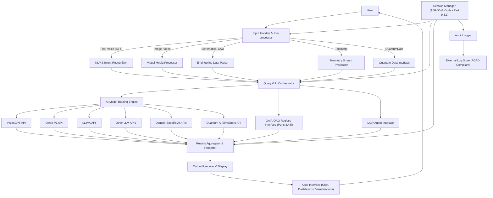
**Component Descriptions:**
1.  **User Interface (Chat, Dashboards, Visualizations):** Primary interaction layer.
2.  **Input Handler & Pre-processor:** Receives, identifies, pre-processes input.
3.  **Specialized Processors/Parsers:** NLP, Visual Media, Engineering Data, Telemetry, Quantum Data.
4.  **Query & AI Orchestrator:** Central coordination.
5.  **AI Model Routing Engine:** Intelligently selects AI model(s).
6.  **AI Model API Interfaces:** Standardized connectors.
7.  **GAIA-QAO Registry Interface:** API client for GAIA-QAO Registry.
8.  **MCP Agent Interface:** Communication with MCP-linked agents.
9.  **Results Aggregator & Formatter:** Collects, synthesizes, formats responses.
10. **Output Renderer & Display:** Renders formatted results in UI.
11. **Session Manager (AGAD/InfoCode):** Manages traceable sessions and InfoCodes.
12. **Audit Logger:** Logs interactions for AGAD compliance.

#### 8.1.3 Technology Stack Considerations
*   **Frontend:** React, Vue, or Angular. Libraries for charting, data visualization, 3D rendering.
*   **Backend/Orchestration:** Python (Flask/Django/FastAPI) or Node.js. Microservices architecture considered.
*   **Messaging Queue:** RabbitMQ or Kafka for asynchronous tasks.
*   **Database (UI state/caching):** Local/session-based if needed.

#### 8.1.4 Performance, Scalability, and Reliability Considerations
1.  **Latency Management:** Asynchronous operations, caching, optimized model calls.
2.  **Scalability:** Microservices, load balancing, scalable AI inference.
3.  **Reliability & Fault Tolerance:** Retry mechanisms, circuit breakers, graceful degradation, robust error handling.
4.  **Real-time Data Processing (Telemetry):** Stream processing technologies (Kafka Streams, Flink).

### 8.2 AI Model Routing Engine Logic (GAIA-Q-UI)

#### 8.2.1 Input Analysis for Routing
1.  **Data Type:** Image, Video, Text, Structured Data, Engineering Schematics/CAD, Telemetry, Quantum Data.
2.  **User Intent (NLP):** Identification, Description, Comparison, Prediction, Anomaly Detection, Knowledge Query.
3.  **Context:** Session info, user role/permissions, available AI models, file metadata.
4.  **Explicit Model Request (Optional):** Advanced user preference.

#### 8.2.2 Routing Logic Approach
Hybrid: Rule-based pre-filtering, Capability-matching (model metadata registry), ML-driven selection (future), Multi-model orchestration.

#### 8.2.3 Model Selection Criteria (Examples)
Accuracy, cost, latency, data privacy, specialization.
*Aerospace-specific metrics:* Real-time telemetry analysis latency (<200ms alert, <1s diagnostic), critical anomaly detection confidence (>95%), query cost constraints, data residency/sovereignty for controlled data. *(Initial estimates, to be refined).*

#### 8.2.4 Fallback and Error Handling
Logic to try alternative models or inform user on failure/low confidence.

#### 8.2.5 Aerospace Task-Specific Model Prioritization (Examples)
1.  **Component ID from Image/Schematic:** VisionGPT, Qwen-VL, LLaVA. OCR → Object Detection → LLM.
2.  **Telemetry Anomaly Detection:** Specialized time-series models (statistical, ML, quantum-inspired).
3.  **Predictive Maintenance (RUL):** Predictive models, LLMs for logs.
4.  **Visual Damage Assessment:** Vision models for defect detection/classification.
5.  **NLQ to GAIA-QAO Registry:** LLM for intent parsing → structured query to `RegistryInterface`.
6.  **Doc/IPC Generation Support:** Vision models, data extraction, LLMs for text.

#### 8.2.6 Handling Quantum-Specific Data and Models
1.  **Quantum Data Input:** `QuantumDataInterface` handles algorithm parameters, quantum sensor data, quantum simulation results.
2.  **Routing to Quantum Resources:** Model Routing Engine identifies queries/data for quantum processing, routes to "Quantum AI Models" (QAOA, QML), quantum simulators, or hardware via MCP/QCM.
3.  **Visualization of Quantum Data:** `OutputRenderer` visualizes qubit probabilities, entanglement, energy landscapes. *Aims to translate abstract quantum states into actionable insights using interactive Bloch spheres, comparative dashboards, anomaly highlighting. User studies will refine these.*
4.  **Use Case Example:** User uploads logistics optimization problem. NLP identifies it. Engine routes to QAOA solver via QCM/MCP. Results (optimal config, energy) visualized.

### 8.3 MCP Event Schemas (GAIA-Q-UI)

Standardized JSON-based event schemas for interoperability with the Master Control Program (MCP) and linked agents.

#### 8.3.1 General Event Structure
```json
{
  "eventId": "uuid",
  "eventTimestamp": "ISO8601_datetime",
  "sourceSystem": "GAIA-Q-UI",
  "sourceInfoCode": "QAO-UIF-SESSION-XXX",
  "targetSystem": "MCP_AGENT_XYZ",
  "eventType": "QUERY_REQUEST | DATA_SUBMISSION | STATUS_UPDATE",
  "payloadSchemaVersion": "1.0",
  "payload": { /* Event-specific data */ },
  "securityContext": { "userId": "user_id", "permissionsToken": "token" },
  "traceability": { "correlationId": "uuid", "parentEventId": "uuid" }
}
```

#### 8.3.2 Example Event Types and Payloads
1.  **`QUERY_REQUEST` (UI to MCP Agent):**
    *   `eventType`: "MCP_AGENT_QUERY_REQUEST"
    *   `payload`: `{"queryType": "RETRIEVE_MAINTENANCE_LOGS", "queryParameters": {"objectId": "AS-M-PAX-BW-Q1H-00001", "dateRange": {"start": "...", "end": "..."}}, "responseFormatPreference": "json_summary"}`
2.  **`QUERY_RESPONSE` (MCP Agent to UI):**
    *   `eventType`: "MCP_AGENT_QUERY_RESPONSE"
    *   `payload`: `{"status": "SUCCESS", "results": [ /* results */ ], "errorMessage": "...", "metadata": {"dataSourcesConsulted": ["AGENT_A_DB"], "processingTimeMs": 1234}}`
3.  **`DATA_SUBMISSION_FOR_ANALYSIS` (UI to AI Agent via MCP):**
    *   `eventType`: "MCP_AGENT_DATA_ANALYSIS_REQUEST"
    *   `payload`: `{"dataType": "TELEMETRY_STREAM", "dataReference": "s3_uri", "analysisType": "ANOMALY_DETECTION_QUANTUM_ALGO_X", "parameters": {}}`

*(Further schemas for status updates, acks, errors to be defined.)*

### 8.4 AGAD–InfoCode Trace Integration (GAIA-Q-UI)

Ensuring traceability and auditability according to AGAD (Aerospace Global Archive & Discovery) principles and GAIA-QAO InfoCodes (defined in Part 9.3.1) is a core requirement for GAIA-Q-UI. This ensures that all interactions, AI model invocations, data accesses, and decisions made or supported by the UI are logged, verifiable, and can be reconstructed for analysis, certification, or incident investigation.

#### 8.4.1 Session Management & InfoCoding
1.  **Session Initiation:** Each user interaction with GAIA-Q-UI will be part of a traceable session. Upon session start (e.g., user login, new task initiation), a unique **Session InfoCode** will be generated or assigned by the `SessionManager` component.
    *   **Format Example:** `QAO-UIF-SESSION-YYYYMMDDHHMMSS-UUID`
    *   Associated metadata logged at session start: User ID, timestamp, client IP, initial UI context/view.
2.  **Interaction InfoCoding:** Each significant user action (e.g., query submission, file upload, command execution) and subsequent system response (e.g., AI model output display, registry query result presentation, MCP event dispatch/receipt) within an active session will be assigned a granular **Interaction InfoCode**.
    *   These Interaction InfoCodes will be hierarchically linked to the parent Session InfoCode, forming a tree structure that reflects the flow of operations.
    *   **Format Example:**
        *   `QAO-UIF-SESSION-YYYYMMDDHHMMSS-UUID.ACTION-001` (for the first user action)
        *   `QAO-UIF-SESSION-YYYYMMDDHHMMSS-UUID.AI_RESP-001.MODEL-VISIONGPT` (for a response from VisionGPT related to action 001)
        *   `QAO-UIF-SESSION-YYYYMMDDHHMMSS-UUID.REG_QUERY-002` (for a registry query action)
3.  **InfoCode Propagation:** InfoCodes (session and interaction specific) will be propagated through internal API calls, MCP events, and included in log entries to maintain context across distributed components.

#### 8.4.2 Log Structure and Content
All audit logs generated by GAIA-Q-UI components (Input Handler, Orchestrator, Model Router, Registry Interface, MCP Interface, Output Renderer) will adhere to a standardized JSON structure, managed by the `AuditLogger` component. This structure must be AGAD-compliant, meaning it includes sufficient metadata for discovery, context, and long-term preservation.

**Standard Log Entry JSON Schema (Conceptual):**
```json
{
  "logId": "uuid", // Unique identifier for this specific log entry
  "timestamp": "ISO8601_datetime_utc", // Precise timestamp of the event
  "sessionInfoCode": "QAO-UIF-SESSION-...", // Active session InfoCode
  "interactionInfoCode": "QAO-UIF-SESSION-...ACTION-...", // Specific interaction InfoCode
  "componentName": "GAIA-Q-UI.ModelRoutingEngine", // Source component of the log
  "componentVersion": "1.0.2", // Version of the component
  "logLevel": "INFO | WARN | ERROR | DEBUG | AUDIT_SUCCESS | AUDIT_FAILURE", // Severity/type
  "userId": "user_identifier", // Authenticated user ID (or 'SYSTEM' if automated)
  "userRole": "Engineer_L2 | Researcher | Admin", // Role of the user at time of event
  "eventCategory": "USER_INPUT | AI_MODEL_INVOCATION | AI_MODEL_RESPONSE | REGISTRY_ACCESS | MCP_EVENT_SENT | MCP_EVENT_RECEIVED | SYSTEM_INTERNAL | SECURITY_EVENT",
  "eventAction": "SUBMIT_QUERY | UPLOAD_FILE | ROUTE_TO_LLM_X | DISPLAY_RESULTS | ...", // Specific action
  "eventDetails": { // Object containing event-specific information
    "queryText": "Optional: User's natural language query",
    "inputDataReferences": [ // Array of InfoCodes or URIs for input data
      {"infocode": "QAO-DATA-IMG-...", "type": "IMAGE_UPLOAD"},
      {"uri": "s3://bucket/telemetry.csv", "type": "TELEMETRY_FILE"}
    ],
    "parameters": { /* Any parameters used for the action */ },
    "invokedService": "VisionGPT_API_v2 | GAIA_QAO_Registry_v1.2 | MCP_Agent_FlightSim",
    "requestPayload": { /* Sanitized request sent to invoked service */ },
    "responseStatus": "SUCCESS | FAILED | TIMEOUT | PARTIAL",
    "responsePayload": { /* Sanitized response received */ },
    "confidenceScore": 0.92, // If applicable (e.g., from AI model)
    "processingTimeMs": 2350,
    "errorMessage": "Optional: Detailed error message if status is FAILED",
    "errorCode": "Optional: System-specific error code"
  },
  "clientContext": { // Information about the user's client environment
    "ipAddress": "user_ip_address",
    "userAgent": "browser_or_client_app_details",
    "uiViewName": "AnomalyAnalysisDashboard"
  },
  "traceabilityLinks": { // Links to related events or data
    "correlationId": "uuid_for_request_response_pairing",
    "parentInteractionInfoCode": "QAO-UIF-SESSION-...ACTION-...", // If part of a sub-flow
    "workflowInstanceId": "optional_overall_workflow_id"
  },
  "securityTags": ["CLASSIFICATION_UNCLASSIFIED", "HANDLING_SBU"], // Data classification/handling
  "complianceTags": ["AGAD_LEVEL_3_TRACEABILITY", "COAFI_DATA_FORMAT_V1"] // Relevant compliance markers
}
```

#### 8.4.3 Audit Trail Generation
*   The `AuditLogger` component is responsible for collecting structured logs from all other GAIA-Q-UI components.
*   Logs will be securely transmitted to a dedicated, immutable (or append-only with strong integrity checks) external log storage system. This system must meet AGAD requirements for long-term archival, integrity, and tamper-proofing.
*   The system must support querying and retrieving audit trails based on various criteria, including Session InfoCode, Interaction InfoCode, User ID, timeframe, event type, or specific GAIA-QAO Object IDs involved.
*   Mechanisms for periodic verification of log integrity (e.g., using cryptographic hashes of log batches) should be considered.

#### 8.4.4 Data Lineage
*   Through the consistent use of Session and Interaction InfoCodes, and by logging `inputDataReferences` and `invokedService` details, GAIA-Q-UI will strive to establish clear data lineage.
*   This means it should be possible to trace an output (e.g., an AI-generated recommendation) back through the specific AI models invoked, the parameters used, and the input data that led to that output.
*   For complex orchestrations involving multiple AI models or data transformations, the `traceabilityLinks` (e.g., `parentInteractionInfoCode`) will be crucial for reconstructing the complete processing chain.

### 8.5 Initial Development Roadmap & Next Steps (GAIA-Q-UI)

The development of GAIA-Q-UI will follow an iterative and agile approach, prioritizing core functionality and traceability from the outset.

0.  **Leveraging AI/LLMs in GAIA-Q-UI Development (Ongoing Principle):**
    *   Actively use LLMs for code scaffolding (e.g., Python API connectors, React component skeletons), documentation drafting, synthetic test data generation, and validation of InfoCode/AGAD patterns.
1.  **Phase 1: Foundation & Core MVP (Target: 3-6 Months)**
    *   **8.5.1.1 Detailed UX/UI Mockups & Workflows:** Develop detailed wireframes, user personas for key aerospace roles (e.g., design engineer, maintenance technician, mission planner, safety analyst), and user flow diagrams for 2-3 high-impact use cases (e.g., visual anomaly identification, natural language query to registry, basic telemetry analysis). *Incorporate an iterative feedback loop with target users (aerospace engineers) during this design phase.* (See Appendix D for illustrative use cases).
    *   **8.5.1.2 Core Orchestration Backend:** Implement the `Query & AI Orchestrator` and initial rule-based `AI Model Routing Engine`.
    *   **8.5.1.3 First AI Model Integration:** Integrate one primary vision model (e.g., VisionGPT or Qwen-VL) and one general-purpose LLM for a core visual task (e.g., basic component identification from an image) and natural language understanding.
    *   **8.5.1.4 GAIA-QAO Registry Interface:** Develop the API client for live queries (read-only initially) against the GAIA-QAO Object Registry (Parts 3, 4, 5), focusing on retrieving model and instance details.
    *   **8.5.1.5 Session Management & Basic InfoCode Logging:** Establish the foundational traceability layer: `SessionManager` for session InfoCodes, and `AuditLogger` for basic interaction logging (user query, AI call, AI response) with interaction InfoCodes.
    *   **8.5.1.6 Prototype UI Development:** Build an MVP of the chat interface, file upload/input handling, results display area, and the conceptual multi-panel layout described in Section 8.1.1.
    *   **8.5.1.7 Security Framework - Initial Implementation:**
        *   Implement strong Multi-Factor Authentication (MFA) and Core User Authentication mechanisms.
        *   Secure all exposed API Endpoints (HTTPS by default, implement basic API key/token authentication for backend services).
        *   Conduct an initial Data Encryption Review for data in transit and at rest (for temporary caches/UI state).
        *   Establish basic Role-Based Access Control (RBAC) stubs (e.g., 'user', 'admin').
2.  **Phase 2: Expansion & Feature Enhancement (Target: 6-9 Months Post-MVP)**
    *   Integrate additional AI models, including at least one domain-specific model (e.g., for telemetry analysis or engineering schematic interpretation if available).
    *   Enhance `AI Model Routing Engine` Logic (refine rules based on input type, user intent, and context; explore initial capability-matching based on model metadata).
    *   Develop basic Dashboarding & Visualization capabilities for common data types (e.g., simple telemetry plots, image display with bounding boxes from AI).
    *   Define Detailed MCP Event Schemas (as per Section 8.3) & implement initial MCP Agent Integration for one pilot service (e.g., fetching data from a simulated external system).
    *   Ensure Full AGAD-Compliant Audit Trail logging to an external, immutable log store. Implement log querying interface for admins.
    *   Conduct initial Performance and Scalability Testing with simulated user loads and establish baseline benchmarks for key interactions.
    *   Conduct structured User Testing with a small group of aerospace professionals on the MVP and subsequent iterations; incorporate feedback into the design and backlog.
3.  **Phase 3: Quantum Integration & Advanced Features (Target: 9-15 Months Post-MVP)**
    *   Implement `QuantumDataInterface` & basic Visualization tools for quantum-specific data types (e.g., qubit state probabilities, simple quantum circuit representations).
    *   Integrate Routing to Quantum AI/Simulators: Connect to at least one (simulated or real, via MCP) quantum algorithm solver (e.g., QAOA for optimization) or quantum sensor data stream.
    *   Develop Advanced Multi-Model Orchestration (e.g., chaining output of a vision model to an LLM for description).
    *   Begin R&D for ML-Driven component of the `AI Model Routing Engine`.
    *   Implement Mature Security & Privacy Features based on detailed threat modeling, data classification policies, and refined RBAC.
    *   Develop features for collaborative sessions and result sharing (with appropriate access controls and audit logging).
4.  **Ongoing Activities (Throughout all phases):**
    *   Community Review & Feedback cycles.
    *   Continuous updates to technical documentation (this Part 8, user guides, API specs).
    *   Adoption of Continuous Integration and Continuous Deployment (CI/CD) practices for UI components and backend services.
    *   Regular security reviews and updates.

### 8.6 Security and Data Privacy Framework (GAIA-Q-UI)

Ensuring the security of data and the privacy of users and proprietary information is paramount for GAIA-Q-UI, especially within the aerospace domain where data can be sensitive, export-controlled, or safety-critical.

#### 8.6.1 Data Security
1.  **Data Encryption:**
    *   **In Transit:** All communication between the user's client and the GAIA-Q-UI backend, as well as communication from GAIA-Q-UI to external services (AI models, Registry, MCP), will use strong, industry-standard encryption protocols (e.g., TLS 1.3+).
    *   **At Rest:** Any sensitive data cached temporarily by GAIA-Q-UI components or stored permanently in the AGAD-compliant log store will be encrypted using robust encryption algorithms (e.g., AES-256). Key management practices must be secure.
2.  **API Security:**
    *   All GAIA-Q-UI internal and external APIs will be secured using robust authentication and authorization mechanisms (e.g., OAuth 2.0, OpenID Connect, or mutually authenticated TLS for service-to-service communication).
    *   Strict input validation will be enforced on all API endpoints to prevent injection attacks and other common vulnerabilities. Rate limiting and anomoly detection will be applied to API usage.
3.  **Infrastructure Security:**
    *   Deployment environments (development, staging, production) will adhere to security best practices, including network segmentation, firewalls, Intrusion Detection/Prevention Systems (IDS/IPS).
    *   Regular vulnerability scanning and security audits of the infrastructure and deployed application will be conducted.
    *   Secure software supply chain practices will be encouraged (e.g., verifying dependencies).

#### 8.6.2 Access Control
1.  **User Authentication:** Implementation of strong multi-factor authentication (MFA) for all user accounts is mandatory. Integration with federated identity providers (IdP) will be considered.
2.  **Role-Based Access Control (RBAC):**
    *   A granular RBAC model will be implemented, defining distinct user roles (e.g., Engineer, Researcher, Safety Analyst, System Administrator, Auditor).
    *   Permissions will be assigned to roles, controlling access to specific UI features, data types that can be uploaded/viewed, AI models that can be invoked, specific GAIA-QAO Registry information, and MCP agent interactions.
    *   An administrative interface will allow for management of users, roles, and permissions.
3.  **Data Segregation and Labeling:** Where necessary (e.g., for handling export-controlled data or different levels of data sensitivity), mechanisms for data segregation and labeling will be implemented, and RBAC policies will enforce access based on these labels.

#### 8.6.3 Data Privacy
1.  **Data Minimization:** GAIA-Q-UI will be designed to collect and process only the data absolutely necessary for its intended functions.
2.  **Anonymization/Pseudonymization:** For analytics, non-critical logging, or when interacting with less trusted AI models, techniques for anonymizing or pseudonymizing user data and input queries will be explored and implemented where feasible without compromising essential functionality or traceability.
3.  **Compliance with Regulations:** The system will be designed with consideration for relevant data protection regulations (e.g., GDPR if applicable to users, CCPA) and specific aerospace data handling standards (e.g., ITAR, EAR). For ITAR/EAR controlled data, specialized, isolated deployments of GAIA-Q-UI may be required.
4.  **Transparency and User Consent:** Users will be clearly informed about how their data is collected, used, processed by AI models, and logged. Consent mechanisms will be implemented where appropriate. The audit trail itself provides a form of transparency into system actions.

#### 8.6.4 Secure Development Lifecycle (SDL)
*   Security considerations will be integrated into every phase of the GAIA-Q-UI software development lifecycle.
*   This includes threat modeling during design, secure coding training for developers, use of static and dynamic application security testing (SAST/DAST) tools, regular security code reviews, and vulnerability management.
*   A responsible disclosure policy for security vulnerabilities will be established.

---
## Part 9: Implementation Guidelines (Overall System)

This part consolidates recommendations and next steps for the comprehensive implementation of the GAIA-QAO system, encompassing the Object ID Registry, Subsystem tracking, GAIA-Q-UI, and associated documentation and governance standards.

### 9.1 Database Implementation
1.  **Schema Finalization & Deployment**: Utilize the SQL DDL script detailed in Part 7 (Version 1.3.0) as the foundation for creating the GAIA-QAO Registry database, preferably on PostgreSQL. Conduct final reviews and apply any necessary refinements.
2.  **Initial Data Population**:
    *   Populate all definitional catalog tables: `domains`, `autonomy_levels`, `object_functional_classes` (from Part 3.2.2 lists), `object_category_subtypes` (from Appendix A), `subsystem_types` (from Appendix F).
    *   Begin populating `object_models` with the detailed catalog entries from Part 4.
    *   Begin populating `subsystem_models` with representative examples as outlined in Part 5.4.
3.  **Constraints, Indexes, Functions, Triggers**:
    *   Ensure all primary keys, foreign keys, `UNIQUE` constraints, and `CHECK` constraints defined in the schema are correctly implemented to maintain data integrity.
    *   Implement the database functions (`generate_next_object_serial`, `construct_tier1_full_object_id`, `generate_next_subsystem_serial`, `trigger_set_timestamp`, `trigger_manage_current_configuration_object`, `trigger_manage_current_configuration_subsystem`) and apply triggers to relevant tables.
    *   Review and create additional database indexes on columns frequently used in `WHERE` clauses, `JOIN` conditions, or `ORDER BY` clauses to optimize query performance, especially for `object_instances`, `subsystem_instances`, `object_configurations`, `subsystem_configurations`, `object_subsystem_installations`, and `registry_audit_log`.
4.  **Security & Access Control**:
    *   Implement robust password hashing mechanisms for `registry_users.password_hash`.
    *   Establish appropriate database-level roles and permissions aligned with the application user roles (Admin, Editor, Viewer, etc.) to enforce least privilege.
5.  **Auditing Implementation**:
    *   Ensure that the application layer interacting with the database correctly populates the `registry_audit_log` table for all CRUD (Create, Read, Update, Delete) operations on critical data, user management actions, and security-relevant events.
6.  **Backup and Recovery Strategy**: Establish and regularly test a comprehensive backup and disaster recovery plan for the GAIA-QAO Registry database.
7.  **Data Migration Strategy (if applicable)**: If any pre-existing data needs to be migrated into this new schema, develop and test a robust migration plan.

### 9.2 User Interface Recommendations (Registry UI & GAIA-Q-UI)

Two primary user interfaces are envisioned:
1.  **GAIA-QAO Registry Management UI:** A dedicated administrative interface (likely web-based) for managing the core data within the GAIA-QAO Registry database.
    *   **Functionality:** CRUD operations for all catalog tables (domains, classes, subtypes, models, SSS types, subsystem models), processing ID allocation requests, user management, viewing audit logs, generating reports.
    *   **Target Users:** Registry administrators, data curators, governance committee members.
2.  **GAIA-Q-UI (as specified in Part 8):** The primary intelligent interface for end-users (engineers, researchers, analysts) to interact with GAIA-QAO data, AI models, and federated services.
    *   **Registry Interaction:** GAIA-Q-UI will primarily perform *read* operations on the GAIA-QAO Registry (e.g., fetching model specifications, instance configurations, subsystem details) to support its analytical and reasoning tasks. Direct *write* operations to core registry data from GAIA-Q-UI should be highly restricted or funneled through moderated requests to maintain registry integrity.

**General UI/UX Principles (applicable to both):**
*   **Clarity and Intuitiveness:** Aerospace data can be complex; UIs must be clear and easy to navigate.
*   **Role-Based Views:** Tailor views and available actions based on user roles and permissions.
*   **Powerful Search and Filtering:** Essential for navigating large datasets.
*   **Data Visualization:** For registry statistics, model hierarchies, configuration timelines, and AI outputs (as detailed in Part 8 for GAIA-Q-UI).
*   **Responsiveness and Performance:** Ensure UIs are responsive and perform well, even with large amounts of data.
*   **Accessibility:** Adhere to web accessibility standards (WCAG) where applicable.

### 9.3 Documentation Governance & Standards (GAIA-CO-ASD-LIB)

This section outlines the core standards for managing all technical documentation within the GAIA-Q & AMPEL framework, including this AGI master document itself and all system/subsystem specific technical libraries. It incorporates and expands upon the `GAIA-CO-ASD-LIB` (GAIA Common Open Aerospace & Space Documentation Library) concept.

#### 9.3.1 INFOCODE-INDEX System

The INFOCODE-INDEX system provides a structured method for uniquely identifying and categorizing all documentation artifacts and key data elements within the GAIA-QAO ecosystem.

**INFOCODE Structure:** `[ORG]-[DOM_CTX]-[TYPE]-[SUBJECT_ID]-[VERSION_DATE]-[SEQ_FRAG]`

1.  **`ORG` (Organization/Source - 3 chars):**
    *   `QAO`: GAIA-QAO (Primary/Core Documents)
    *   `QAR`: GAIA-Q-AIR (Air Systems Specific)
    *   `QSP`: GAIA-Q-SPACE (Space Systems Specific)
    *   `QGT`: GAIA-Q-GREEN-TECH
    *   `QHP`: GAIA-Q-HPC
    *   `QSR`: GAIA-SCIREF
    *   `QDG`: GAIA-Q-DATA-GOVERNANCE
    *   `EXT`: External Organization (followed by their identifier if federated)

2.  **`DOM_CTX` (Domain Context - 3 chars):**
    *   `SYS`: System Level (Framework, Overall Architecture)
    *   `REG`: Registry Specific (ID System, Database)
    *   `DOC`: General Documentation Standard/Process
    *   `AIR`: Air Systems Focus
    *   `SPC`: Space Systems Focus
    *   `QTY`: Quantum Technology Specific
    *   `AUI`: GAIA-Q-UI Specific
    *   `HIL`: HIL-Thinking Specific
    *   `SFW`: Software Landscape / Dev Process
    *   `DAT`: Data Set / Data Model

3.  **`TYPE` (Document/Artifact Type - 3 chars):**
    *   `AGI`: Aerospace General Index (This Master Document)
    *   `STD`: Standard / Specification
    *   `GUI`: Guideline / Best Practice
    *   `REP`: Report / Analysis
    *   `MDL`: Model Definition (e.g., for a specific Object Model in Part 4)
    *   `CFG`: Configuration Document
    *   `DBS`: Database Schema Document
    *   `API`: API Specification
    *   `TST`: Test Plan / Procedure / Report
    *   `ICD`: Interface Control Document
    *   `MAN`: Manual (User, Maintenance, Operations)
    *   `LOG`: Log File Specification / Audit Record
    *   `TPL`: Template (as in Appendix G)
    *   `RFC`: Request for Comments

4.  **`SUBJECT_ID` (Subject Identifier - variable length, 3-15 chars):**
    *   Could be a GAIA-QAO Object ID (e.g., `AS-M-PAX-BW-Q1H-00001`) if the document is specific to an instance.
    *   Could be a Model Code (e.g., `PAX-BW-Q1H`) if specific to a model.
    *   Could be a Functional Class + Sub-Type (e.g., `PAX-BW`)
    *   Could be a descriptive acronym (e.g., `HILTHNK`, `SWLANDSCP`, `ATOCSTD`).
    *   For this AGI Master: `MASTERDOC`

5.  **`VERSION_DATE` (Version or Date - variable, e.g., `V1R2P0` or `YYYYMMDD`):**
    *   Semantic Versioning (e.g., `V1R0P0` for Version 1.0.0).
    *   Or Date (e.g., `20250508`).
    *   For this AGI Master: `V0R8P0` (reflecting Conceptual Master Version 0.8.0)

6.  **`SEQ_FRAG` (Sequence/Fragment - optional, 3-6 chars):**
    *   `S001`, `P001` (for sequence).
    *   `#PART1-SEC2` (for fragment identifier pointing within a document).

**Example INFOCODE for this document:**
`QAO-SYS-AGI-MASTERDOC-V0R8P0`

**INFOCODE-INDEX Registry:**
A central registry (likely part of the GAIA-QAO database or a dedicated document management system) will map InfoCodes to their corresponding document titles, locations (URLs/repository paths), authors, status, and other metadata.

#### 9.3.2 GAIA-CO-ASD-LIB Standard Details

This standard defines common practices for the Aerospace & Space Documentation Library.

##### 9.3.2.1 File Formats
*   **Primary Source:** Markdown (`.md`) for its readability, version control friendliness, and ease of conversion.
*   **Diagrams:** Mermaid.js embedded in Markdown, or SVG for complex static diagrams.
*   **Tables:** Markdown tables, or CSV for large datasets linked/embedded.
*   **Distribution/Archive:** PDF (generated from Markdown), HTML (for web portals).
*   **Engineering Data:** STEP, IGES for CAD; HDF5, NetCDF for scientific data; XML/JSON for structured data exchange.

##### 9.3.2.2 Naming Convention (Files)
`[INFOCODE_ORG]-[INFOCODE_DOM_CTX]-[INFOCODE_TYPE]-[INFOCODE_SUBJECT_ID]-[INFOCODE_VERSION_DATE].[ext]`
*   This uses the components of the full InfoCode for the filename.
*   Example (this document's source file): `QAO-SYS-AGI-MASTERDOC-V0R8P0.md`
*   Example (ICD for a specific model): `QAR-AIR-ICD-PAX-NB-Q2A-V1R0P0.md`

##### 9.3.2.3 Metadata Requirements (YAML Front-Matter in Markdown)
All core documentation files should start with a YAML front-matter block:
```yaml
---
title: "Full Document Title"
infocode: "Full-INFOCODE-Here" # e.g., QAO-SYS-AGI-MASTERDOC-V0R8P0
object_id_context: ["Optional: Related GAIA-QAO Object ID(s) if applicable"]
version: "DocumentSemanticVersion e.g., 0.8.0"
date: "YYYY-MM-DD (Last Major Update)"
status: "Draft | Review | Approved | Deprecated | Superseded"
authors:
  - "Name1 (Affiliation1)"
  - "Name2 (Affiliation2)"
reviewers:
  - "NameA (AffiliationA)"
approver: "TOC Lead / Designated Authority"
security_classification: "UNCLASSIFIED | SBU | GAIA-QAO-CONFIDENTIAL | etc."
keywords: ["keyword1", "keyword2", "aerospace", "quantum"]
related_documents: # List of InfoCodes or links
  - "infocode_related_doc_1"
  - "infocode_related_doc_2"
change_log_ref: "Link to CHANGELOG.md or specific commit hash"
gao_qao_compliance:
  agad_level: "Level 3 Traceability" # Example
  coafi_alignment: "Section X.Y"
  infocode_schema_version: "1.1.0"
---
```

#### 9.3.3 Document Lifecycle and Control
1.  **Versioning:** Semantic Versioning (MAJOR.MINOR.PATCH) for official releases of standards and core documents. `V{MAJOR}R{MINOR}P{PATCH}` can be used in InfoCodes.
2.  **Lifecycle States:** `DRAFT` -> `IN_REVIEW` -> `APPROVED` -> `PUBLISHED` -> (`SUPERSEDED` | `DEPRECATED`).
3.  **Change Control:** Managed via Git Pull/Merge Requests. Significant changes to standards or core framework documents require review and approval by the GAIA-QAO Technical Oversight Committee (TOC). Minor changes/typos by maintainers.
4.  **VCS Integration:** All documentation source files managed in Git repositories. Commits should reference issue tracker IDs or change request numbers.

#### 9.3.4 Standard AGI/AToC for System Technical Libraries (Incorporating ATA/SS Based AToC)

This section defines the standard Aerospace General Index (AGI) / Aerospace Table of Contents (AToC) to be used for comprehensive technical documentation libraries (manuals, specifications) for specific Air Systems and Space Systems developed or managed under the GAIA-QAO framework. This structure promotes consistency and ease of navigation.

**Document Template InfoCode Root:** `QAO-DOC-TPL-SYSLIB`

##### **Master AToC for a System Technical Library**

**Front Matter**
*   Title Page (Object ID, Model Name, Document Title, InfoCode, Version, Date)
*   List of Effective Pages (LEP) / Record of Revisions
*   Table of Contents (this AGI/AToC)
*   List of Figures
*   List of Tables
*   Introduction / Scope of Manual
*   Safety Summary / Warnings & Cautions

**Part I: System Description & Operation (Corresponds to General Chapters)**

*   **Chapter 00: General**
    *   00-00: Introduction to [Object Model Name] ([MDL Code])
    *   00-10: Principal Dimensions and Specifications
    *   00-20: Major Zones and Access
    *   00-30: Standard Practices and Safety Precautions
*   **Chapter 05: Time Limits / Maintenance Checks**
    *   05-00: General
    *   05-10: Time Limits
    *   05-20: Scheduled Maintenance Checks Program
    *   05-50: Unscheduled Maintenance Checks
*   **Chapter 06-12: Dimensions, Areas, Stations, Placards, Lifting, Shoring, Leveling, Weighing, Towing, Parking, Mooring, Storage, Shipping** (Standard ATA breakdown for AS; adapted for SP)

**Part II: System Specific Technical Data (Mapped from ATA for AS, SS 00-99 for SP)**

This part is structured based on the GAIA-QAO Subsystem Type Codes (SSS) which are, in turn, inspired by ATA chapters for Air Systems and the SS 00-99 index for Space Systems.

*   **SSS-XYZ: [Subsystem Name]** (e.g., `A24: Electrical Power` or `S03: Aerospace Power & Energy Storage`)
    *   **Section 00: General**
        *   Description and Operation
        *   Component Location
        *   System Schematics (Simplified)
    *   **Section 10: [Major Component/Function A]**
        *   Description
        *   Operation
        *   Troubleshooting
        *   Maintenance Practices (Removal/Installation, Test, Adjustment)
    *   **Section 20: [Major Component/Function B]**
        *   ... (as above) ...
    *   ... (and so on for all relevant components/functions within that SSS chapter) ...

**Example Mapping for Air System (AS) - using ATA Chapters as SSS inspiration:**
*   `A21`: Air Conditioning
    *   `A21-00`: General
    *   `A21-10`: Compression
    *   `A21-20`: Distribution
    *   `A21-30`: Pressurization Control
    *   `A21-40`: Heating
    *   `A21-50`: Cooling
    *   `A21-60`: Temperature Control
*   `A24`: Electrical Power
    *   `A24-00`: General
    *   `A24-10`: AC Generation
    *   `A24-20`: DC Generation
    *   `A24-30`: External Power
    *   `A24-40`: Distribution
*   ... (continues for all relevant ATA chapters up to A91/A97 as SSS types)

**Example Mapping for Space System (SP) - using GAIA-QAO SS 00-99 as SSS inspiration:**
*   `S01`: Propulsion Systems
    *   `S01-00`: General Description and Operation
    *   `S01-10`: Chemical Propulsion (SS 01.1)
        *   `S01-11`: Propellant Storage & Feed (Tanks, Lines, Valves)
        *   `S01-12`: Thrusters & Engines (Main, RCS)
        *   `S01-13`: Pressurization System
    *   `S01-20`: Electric Propulsion (SS 01.2)
        *   `S01-21`: Power Processing Units (PPUs)
        *   `S01-22`: EP Thrusters (Ion, Hall)
        *   `S01-23`: Propellant Feed System (Xenon, etc.)
    *   `S01-40`: Advanced/Novel Propulsion (SS 01.4)
*   `S03`: Aerospace Power and Energy Storage
    *   `S03-00`: General
    *   `S03-10`: Power Generation (Solar Arrays, RTGs) (SS 03.1)
    *   `S03-20`: Energy Storage (Batteries, Fuel Cells) (SS 03.2)
    *   `S03-30`: Power Management & Distribution (PMAD) (SS 03.3)
*   ... (continues for all relevant SS 00-99 chapters as SSS types)

**Part III: Wiring Diagrams / Fluid Line Diagrams**
*   Dedicated section for detailed system schematics, cross-referenced from Part II.

**Part IV: Illustrated Parts Catalog (IPC)**
*   Breakdown of assemblies into procurable parts, linked to GAIA-QAO Subsystem and Component IDs.

**Back Matter**
*   Glossary / List of Abbreviations
*   Index

This standard AToC ensures that technical libraries for different GAIA-QAO objects are consistent, making it easier for users to find information and for AI tools (like GAIA-Q-UI) to process and cross-reference data.

### 9.4 Meta-Documentation (Management of GAIA-QAO Framework Documentation)
1.  **Primary Format:** Markdown (`.md`) for source documentation.
2.  **Version Control:** Managed under Git (e.g., in the `GAIA-QAO/framework-docs` repository).
3.  **Structure:** Follows this Aerospace General Index (AGI). Major AGI changes via RFC.
4.  **Tooling:** Markdown editors, Pandoc/static site generators (MkDocs, Hugo) for HTML/PDF rendering, Mermaid.js for diagrams.
5.  **Contributions:** Guidelines for style, file naming, Pull Request process. Reviewed by TOC or documentation WG.
6.  **Maintenance:** Updated to reflect GAIA-QAO system changes. Periodic reviews for accuracy.
7.  **Publication:** Official documentation on GAIA-Q & AMPEL project portal.

### 9.5 Next Steps (Overall Project Implementation)
1.  **Finalize and Validate DB Schema (Part 7):** Implement and test.
2.  **Develop Registry UI & GAIA-Q-UI MVP (Part 8 & 9.2):** Focus on core functionality.
3.  **Populate Model & Subsystem Registries (Part 4 & 5):** Continue detailed cataloging.
4.  **Implement INFOCODE System (Part 9.3.1):** Integrate into document management and logging.
5.  **Develop Documentation Templates (Appendix G):** Finalize and publish.
6.  **Establish Governance Processes (Part 0.5):** Formalize TOC, contribution pathways.
7.  **Launch Documentation Portal (Phase 1 from Part 0.6):** Initial version.
8.  **Foster Community (Phase 2 from Part 0.6):** Recruit contributors, form working groups.
9.  **Begin Pilot Projects (Phase 3 from Part 0.6):** Apply GAIA-QAO standards to real or simulated aerospace design challenges.
10. **Refine HIL Thinking Specification (Part 2):** Develop detailed use cases and interface specifications for HIL integration.

---
## Appendices

### Appendix A: Top-Level Object Category Sub-Type (ST) Codes

This appendix lists the defined Sub-Types (ST) for each Functional Class (CCC) within the Air Systems (AS) and Space Systems (SP) domains. Each sub-type has a unique two-character code within its functional class, stored in the `object_category_subtypes` table.

#### A.1 Air Systems (AS) Object Category ST Codes

##### A.1.1 Passenger Transport (PAX) Sub-Types

| **ST Code** | **Name**                 | **Description**                                                                 |
| :---------- | :----------------------- | :------------------------------------------------------------------------------ |
| NB          | Narrow-Body Airliner   | Single-aisle passenger aircraft typically for short to medium range routes.     |
| WB          | Wide-Body Airliner     | Multi-aisle passenger aircraft typically for medium to long range routes.       |
| RJ          | Regional Jet           | Smaller jet aircraft designed for regional routes.                              |
| BJ          | Business Jet           | Aircraft designed for business and executive transportation.                    |
| GA          | General Aviation       | Smaller piston or turboprop aircraft for private transportation.                |
| VT          | eVTOL Air Taxi         | Electric vertical takeoff and landing aircraft for urban air mobility.          |
| BW          | Blended Wing Body      | Aircraft with blended wing body configuration for passenger transport.          |
| SS          | Supersonic Transport   | Passenger aircraft designed for supersonic flight.                              |
| HS          | Hypersonic Transport   | Passenger aircraft designed for hypersonic flight.                              |
| AM          | Air Mobility           | Aircraft designed for urban/regional air mobility, distinct from eVTOLs.       |
| HY          | Hybrid-Electric        | Passenger aircraft with hybrid-electric propulsion systems.                     |
| QP          | Quantum-Powered        | Passenger aircraft with quantum-enhanced or quantum-derived propulsion/systems. |
| SP          | Suborbital Passenger   | Aircraft designed for suborbital passenger flights.                             |

##### A.1.2 Cargo Transport (CGO) Sub-Types

| **ST Code** | **Name**                 | **Description**                                                                 |
| :---------- | :----------------------- | :------------------------------------------------------------------------------ |
| LC          | Light Cargo            | Small cargo aircraft for light freight.                                         |
| MC          | Medium Cargo           | Medium-sized cargo aircraft for regional freight.                               |
| HC          | Heavy Cargo            | Large cargo aircraft for intercontinental freight.                              |
| FC          | Freighter Conversion   | Passenger aircraft converted to cargo use.                                      |
| QD          | Quick Delivery         | Aircraft optimized for rapid delivery services.                                 |
| VC          | VTOL Cargo             | Vertical takeoff and landing cargo aircraft.                                    |
| UC          | Unmanned Cargo         | Unmanned cargo delivery aircraft/drones.                                        |
| QC          | Quantum Cargo          | Cargo aircraft with quantum-enhanced systems for logistics or performance.    |

##### A.1.3 Intelligence, Surveillance, Reconnaissance (ISR) Sub-Types

| **ST Code** | **Name**                    | **Description**                                                                 |
| :---------- | :-------------------------- | :------------------------------------------------------------------------------ |
| UA          | Unmanned Aerial System (ISR Specific) | Unmanned aircraft systems (UAS/drones) primarily for ISR missions.            |
| MA          | Maritime Patrol           | Aircraft designed for maritime surveillance and reconnaissance.                 |
| SR          | Strategic Reconnaissance  | Aircraft for long-range, high-altitude strategic reconnaissance missions.       |
| TR          | Tactical Reconnaissance   | Aircraft for shorter-range, battlefield tactical reconnaissance missions.       |
| EW          | Electronic Warfare        | Aircraft specialized in electronic warfare (jamming, signals interception).     |
| SI          | SIGINT Platform           | Platforms dedicated to Signals Intelligence collection.                         |
| IM          | Imaging Platform          | Platforms specialized in various forms of imaging intelligence (EO/IR, SAR).    |
| MS          | Multi-Sensor Platform     | Aircraft equipped with a diverse suite of integrated sensor systems for ISR.    |
| QI          | Quantum ISR               | ISR platforms leveraging quantum sensors for enhanced detection/analysis.       |

##### A.1.4 Scientific Research (SCI) Sub-Types

| **ST Code** | **Name**                    | **Description**                                                                 |
| :---------- | :-------------------------- | :------------------------------------------------------------------------------ |
| AT          | Atmospheric Research      | Aircraft equipped for studying atmospheric conditions and composition.          |
| OC          | Oceanographic Research    | Aircraft equipped for oceanographic surveys and data collection.                |
| ER          | Earth Remote Sensing (Sci)  | Aircraft for Earth observation and remote sensing (non-ISR, scientific focus).  |
| WX          | Weather Research          | Aircraft specialized in meteorological research, including storm penetration.   |
| CR          | Climate Research          | Aircraft for long-term climate monitoring and research.                         |
| GS          | Geophysical Survey        | Aircraft for conducting geophysical surveys (magnetic, seismic, etc.).          |
| MP          | Multi-Purpose Research    | Versatile aircraft platforms adaptable for various scientific research missions. |
| QS          | Quantum Sensing (Science) | Aircraft utilizing quantum sensors for fundamental scientific research.         |

##### A.1.5 Utility (UTL) Sub-Types

| **ST Code** | **Name**                       | **Description**                                                                 |
| :---------- | :----------------------------- | :------------------------------------------------------------------------------ |
| FF          | Firefighting                   | Aircraft designed or modified for aerial firefighting operations.               |
| AG          | Agricultural                   | Aircraft designed for agricultural operations (crop dusting, seeding).          |
| SD          | SAR/Disaster Relief            | Aircraft equipped for search and rescue and disaster relief missions (distinct from pure medevac). |
| ME          | Medical (Air Ambulance)        | Aircraft configured for medical evacuation and patient transport.               |
| IP          | Infrastructure Patrol          | Aircraft for pipeline, powerline, or other infrastructure inspection.           |
| SV          | Survey (Mapping/Photogrammetry)| Aircraft designed for aerial surveys (mapping, photogrammetry for civil/commercial use). |
| CP          | Civil Protection               | Aircraft for general civil protection, law enforcement support, disaster response. |
| QU          | Quantum Utility                | Utility aircraft incorporating quantum-enhanced systems for specific tasks.     |

##### A.1.6 Recreational & Sport (REC) Sub-Types

| **ST Code** | **Name**                    | **Description**                                                                 |
| :---------- | :-------------------------- | :------------------------------------------------------------------------------ |
| GL          | Glider                      | Unpowered fixed-wing aircraft.                                                  |
| MG          | Motor Glider                | Gliders with auxiliary power systems for self-launch or sustained flight.       |
| UL          | Ultralight                  | Very light aircraft meeting specific regulatory ultralight criteria.            |
| AC          | Aerobatic                   | Aircraft designed and stressed for aerobatic maneuvers.                         |
| LS          | Light Sport Aircraft (LSA)| Aircraft meeting light-sport aircraft regulatory definitions.                   |
| HB          | Homebuilt (Experimental Amateur-Built) | Aircraft built by individuals for non-commercial, recreational use.     |
| PJ          | Personal Jet/VTOL           | Small jet or VTOL aircraft for personal recreational flight (distinct from BJ). |
| QR          | Quantum Recreational        | Recreational craft employing novel quantum-derived technologies.              |

##### A.1.7 Experimental (Air) (XPR) Sub-Types

| **ST Code** | **Name**                    | **Description**                                                                 |
| :---------- | :-------------------------- | :------------------------------------------------------------------------------ |
| TD          | Technology Demonstrator     | Aircraft primarily built to demonstrate new aerospace technologies.             |
| HP          | High Performance (Exp)      | Experimental aircraft focused on achieving high speeds, altitudes, or maneuverability. |
| PP          | Propulsion Testbed (Air)    | Aircraft serving as a testbed for new or unconventional air-breathing propulsion systems. |
| SM          | Structures/Materials (Exp)  | Aircraft testing new structural designs or advanced materials.                  |
| VT          | VTOL/STOL Testbed (Air)     | Experimental aircraft for testing vertical or short takeoff/landing concepts.   |
| HY          | Hybrid Concept (Air)        | Aircraft demonstrating a hybrid combination of different technologies (e.g., propulsion, energy). |
| AU          | Autonomous Flight Testbed   | Platforms specifically for testing and developing autonomous flight systems.    |
| QT          | Quantum Testbed (Air)       | Airborne platforms for testing and validating quantum technologies.             |
| HS          | Hypersonic Testbed (Air)    | Experimental aircraft designed for hypersonic flight research (distinct from PAX-HS). |

##### A.1.8 Lighter Than Air (LTA) Sub-Types

| **ST Code** | **Name**                    | **Description**                                                                 |
| :---------- | :-------------------------- | :------------------------------------------------------------------------------ |
| NR          | Non-Rigid Airship (Blimp)   | Airships where envelope shape is maintained by internal gas pressure.           |
| RG          | Rigid Airship               | Airships with an internal structural framework.                               |
| HA          | High-Altitude Platform (LTA)| Stratospheric airships or balloons for long-endurance missions.                 |
| BL          | Balloon (Scientific/Other)  | Balloons used for scientific research, observation, or other purposes.          |
| HY          | Hybrid Airship (LTA)        | Vehicles deriving lift from both buoyant gas and aerodynamic lift.            |
| CG          | Cargo Airship               | Airships designed primarily for transporting heavy or oversized cargo.          |
| QB          | Quantum Buoyancy (LTA)      | LTA craft utilizing quantum principles for lift or buoyancy control.          |

##### A.1.9 Military Aircraft (MIL) Sub-Types

| **ST Code** | **Name**                    | **Description**                                                                 |
| :---------- | :-------------------------- | :------------------------------------------------------------------------------ |
| FT          | Fighter                     | Combat aircraft designed primarily for air-to-air and/or air-to-ground combat.  |
| BM          | Bomber                      | Aircraft designed to attack ground and naval targets by dropping bombs/missiles.|
| AT          | Attack/Close Air Support    | Aircraft designed for attacking ground targets, often providing close air support. |
| TN          | Trainer (Military)          | Military aircraft used for training pilots and aircrew.                         |
| TP          | Transport (Military Cargo/Troop) | Military aircraft for transporting troops, cargo, and equipment.                |
| RF          | Refueling Tanker            | Aircraft designed for in-flight refueling of other aircraft.                    |
| HL          | Helicopter (Military)       | Rotary-wing aircraft for various military roles (attack, transport, utility).   |
| CV          | Combat UAV (UCAV)           | Unmanned aircraft designed for combat operations.                               |
| QW          | Quantum Warfare (MIL)       | Military aircraft incorporating significant quantum technologies for advanced capabilities. |
| ES          | Electronic Warfare/SIGINT (MIL) | Dedicated military platforms for electronic warfare and signals intelligence (distinct from general ISR). |

#### A.2 Space Systems (SP) Object Category ST Codes

##### A.2.1 Satellite (SAT) Sub-Types

| **ST Code** | **Name**                    | **Description**                                                                 |
| :---------- | :-------------------------- | :------------------------------------------------------------------------------ |
| CO          | Communications              | Satellites designed primarily for telecommunications services (GEO, MEO, LEO).  |
| NV          | Navigation                  | Satellites providing positioning, navigation, and timing (PNT) services (GNSS).|
| EO          | Earth Observation           | Satellites for observing Earth's surface/atmosphere (optical, radar, weather).|
| SC          | Scientific (Space-based)    | Satellites designed for scientific research (astronomy, heliophysics, etc.).    |
| SM          | Small Satellite (General)   | General category for CubeSats, MicroSats etc. not fitting other specific roles.|
| RL          | Relay                       | Satellites designed to relay communications between other space or ground assets. |
| QS          | Quantum Satellite           | Satellites employing or testing quantum technologies (QKD, sensing, computing). |
| TD          | Technology Demonstration (Sat)| Satellites primarily for demonstrating new space technologies or components.    |

##### A.2.2 Orbital Platform/Vehicle (ORB) Sub-Types

| **ST Code** | **Name**                    | **Description**                                                                 |
| :---------- | :-------------------------- | :------------------------------------------------------------------------------ |
| ST          | Space Station               | Crewed orbital platforms for long-duration missions and research.               |
| LB          | Space Laboratory            | Specialized orbital modules or platforms (crewed/uncrewed) for scientific research. |
| CV          | Crew Vehicle                | Spacecraft designed for transporting crew to/from orbital destinations (LEO, Lunar). |
| CG          | Cargo Vehicle (Orbital)     | Unmanned spacecraft for transporting cargo to orbital destinations.             |
| SM          | Service Module (Orbital)    | Modules providing essential services (power, propulsion) to other orbital systems. |
| HM          | Habitation Module           | Modules designed for crew living quarters on long-duration missions.            |
| OS          | Orbital Servicer/Tug        | Spacecraft for servicing, refueling, repairing, or repositioning other assets.  |
| QO          | Quantum Orbital Platform    | Orbital platforms dedicated to or significantly enhanced by quantum technologies. |

##### A.2.3 Launch System (LCH) Sub-Types

| **ST Code** | **Name**                    | **Description**                                                                 |
| :---------- | :-------------------------- | :------------------------------------------------------------------------------ |
| EL          | Expendable Launch Vehicle (Small) | Small expendable launch systems (e.g., < 2 MT to LEO).                     |
| EM          | Expendable Launch Vehicle (Medium)| Medium expendable launch systems (e.g., 2-20 MT to LEO).                    |
| EH          | Expendable Launch Vehicle (Heavy)| Heavy expendable launch systems (e.g., > 20 MT to LEO).                     |
| ES          | Expendable Launch Vehicle (SuperHeavy)| Super heavy expendable launch systems (e.g., for Lunar/Mars).              |
| RL          | Reusable Launch System      | Launch systems with reusable stages or components (e.g., F9 first stage).     |
| AL          | Air-Launched System         | Systems where the launch vehicle is carried and released from an aircraft.      |
| QL          | Quantum Launch System       | Launch systems utilizing novel quantum principles for propulsion or guidance. |
| US          | Upper Stage / Kick Stage    | Separately identifiable upper stages or kick motors for final orbit insertion. |

##### A.2.4 Probe (PRB) Sub-Types

| **ST Code** | **Name**                    | **Description**                                                                 |
| :---------- | :-------------------------- | :------------------------------------------------------------------------------ |
| LU          | Lunar (Orbiter/Lander/Rover)| Spacecraft designed for lunar exploration.                                      |
| MA          | Mars (Orbiter/Lander/Rover) | Spacecraft designed for Mars exploration.                                       |
| VP          | Venus Probe                 | Spacecraft designed for Venus exploration.                                      |
| IP          | Inner Planets (Mercury)     | Probes for Mercury and exploring the inner solar system.                        |
| GJ          | Gas Giants (Jupiter/Saturn) | Probes for Jupiter, Saturn, and their moons.                                    |
| OI          | Outer Planets/Ice Giants (Uranus/Neptune)| Probes for Uranus, Neptune, and beyond.                                  |
| AC          | Asteroid/Comet              | Spacecraft for studying asteroids, comets, and other small solar system bodies. |
| SL          | Solar/Heliospheric          | Probes designed for close observation of the Sun and solar phenomena.           |
| DS          | Deep Space (Interstellar)   | Probes designed for missions beyond the solar system or to its outer fringes.   |
| QP          | Quantum Probe               | Probes utilizing quantum sensors or communication for deep space exploration.   |

##### A.2.5 Experimental (Space) (XPS) Sub-Types

| **ST Code** | **Name**                    | **Description**                                                                 |
| :---------- | :-------------------------- | :------------------------------------------------------------------------------ |
| TD          | Technology Demo (Platform)  | Orbital platforms primarily for demonstrating new space technologies.           |
| PP          | Propulsion Testbed (Space)  | Spacecraft testing new or unconventional in-space propulsion systems.           |
| QT          | Quantum Testbed (Space)     | Platforms for testing and validating quantum technologies in space.             |
| IM          | In-Space Manufacturing/Assembly | Experiments or platforms for in-space manufacturing, assembly, or ISRU.       |
| RB          | Robotics Testbed (Space)    | Testbeds for advanced robotic systems and manipulators in space.                |
| ST          | Structures/Deployables (Exp)| Experiments with deployable, inflatable, or novel space structures.           |
| RE          | Re-entry Vehicle (Exp)      | Experimental vehicles for testing re-entry technologies.                        |

##### A.2.6 Space Defense (DEF) Sub-Types

| **ST Code** | **Name**                    | **Description**                                                                 |
| :---------- | :-------------------------- | :------------------------------------------------------------------------------ |
| SA          | Space Domain Awareness      | Systems for space surveillance, tracking objects, and characterizing the space environment. |
| MD          | Missile Defense (Space-based) | Satellites or systems contributing to missile defense architectures from space.   |
| CC          | Command & Control (Space Defense)| Space-based assets for command, control, and communications for defense ops. |
| IG          | Intelligence (Space Defense)| Satellites for gathering defense-related intelligence from or through space.    |
| QD          | Quantum Defense (Space)     | Space defense systems incorporating quantum tech for sensing, comms, or effects.|
| PS          | Protective Systems (Space)  | Systems designed to protect other space assets.                               |

---
### Appendix B: ID Examples (Illustrative)

This appendix provides illustrative examples of complete GAIA-QAO Object IDs, demonstrating the hierarchical structure. For comprehensive ID examples tied to specific models, refer to Part 4 (Top-Level Object Model Registry) and Part 5 (Subsystem Identification & Registry).

**B.1 Top-Level Object ID Format:** `DO-A-CCC-ST-MDL-SSSSS[-CC]`

*   **Example 1 (Aircraft):** `AS-M-PAX-BW-Q1H-00001-B1`
    *   DO: `AS` (Air System)
    *   A: `M` (Manned - inherent to MDL Q1H)
    *   CCC: `PAX` (Passenger Transport)
    *   ST: `BW` (Blended Wing Body)
    *   MDL: `Q1H` (AMPEL360 BWB-Q100)
    *   SSSSS: `00001` (Serial Number)
    *   CC: `B1` (Block 1 Upgrade Configuration)
    *   *Description: AMPEL360 BWB-Q100, S/N 00001, in Block 1 Upgrade configuration.*

*   **Example 2 (Satellite):** `SP-U-SAT-CO-Q2A-00015`
    *   DO: `SP` (Space System)
    *   A: `U` (Unmanned - inherent to MDL Q2A)
    *   CCC: `SAT` (Satellite)
    *   ST: `CO` (Communications)
    *   MDL: `Q2A` (QuantumComSat QC-200)
    *   SSSSS: `00015` (Serial Number)
    *   *Description: QuantumComSat QC-200, S/N 00015, in its baseline configuration.*

**B.2 Subsystem ID Format (Contextual):** `Parent_Full_Object_ID :: SSS-MDLs-SERs[-CCs]`

*   **Example 1 (Aircraft Engine):** `AS-M-PAX-BW-Q1H-00001 :: ENG-RRTXW-E001A-C1`
    *   Parent: `AS-M-PAX-BW-Q1H-00001`
    *   SSS: `ENG` (Engine System - Main)
    *   MDLs: `RRTXW` (Rolls-Royce Trent XWB series variant)
    *   SERs: `E001A` (Engine Serial Number)
    *   CCs: `C1` (Specific engine configuration/build standard)
    *   *Description: Engine Rolls-Royce Trent XWB, S/N E001A, Config C1, installed on aircraft AS-M-PAX-BW-Q1H-00001.*

*   **Example 2 (Satellite Payload Instrument):** `SP-U-SAT-EO-Q2H-00005 :: PLD-QIMG1-INST003-OP2`
    *   Parent: `SP-U-SAT-EO-Q2H-00005`
    *   SSS: `PLD` (Payload System)
    *   MDLs: `QIMG1` (Quantum Imager Model 1)
    *   SERs: `INST003` (Instrument Serial Number)
    *   CCs: `OP2` (Operational Configuration Mode 2)
    *   *Description: Quantum Imager Model 1, S/N INST003, operating in Mode 2, part of satellite SP-U-SAT-EO-Q2H-00005.*

These examples show how the two-tiered system allows for precise identification of both the main platform and its key installed components.

---
### Appendix C: Database Schema Diagrams (Illustrative)

This appendix contains simplified Entity-Relationship Diagrams (ERDs) illustrating the structure and key relationships of the GAIA-QAO database schema. The full SQL DDL is provided in Part 7.

#### C.1 Core ID Component Tables and Relationships (Top-Level Objects)

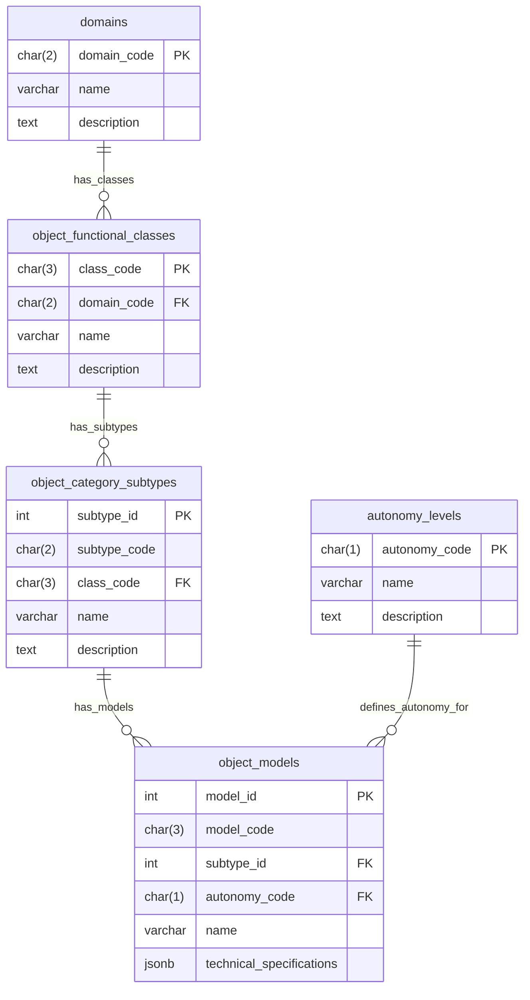
*Diagram C.1: Core tables defining the classification hierarchy for Top-Level Objects.*

#### C.2 Subsystem Definition Tables and Relationships

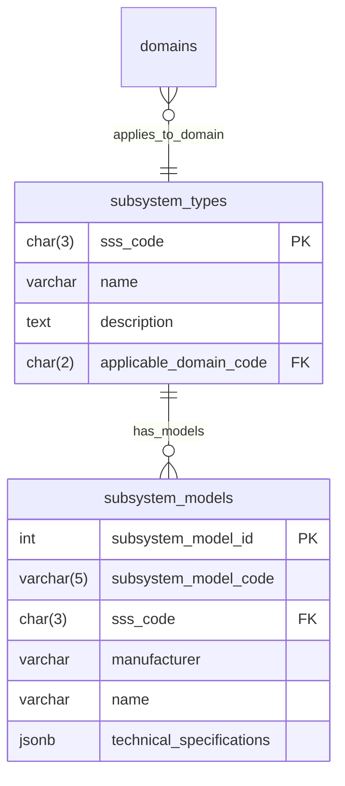
*Diagram C.2: Tables defining Subsystem Types (SSS) and specific Subsystem Models (MDLs).*

#### C.3 Object Instances, Subsystem Instances, and Configurations

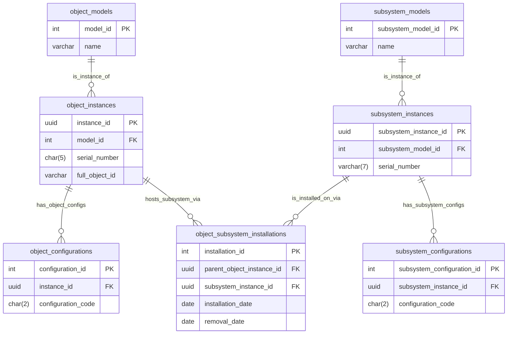
*Diagram C.3: Tables for tracking serialized instances of Top-Level Objects and Subsystems, their configurations, and installation relationships.*

#### C.4 Registry Management and Integration Tables (Simplified Overview)

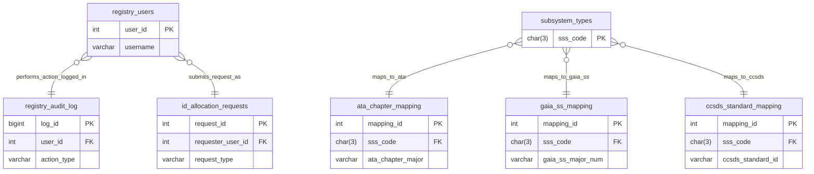
*Diagram C.4: Overview of tables related to registry administration and external standards mapping.*

---
### Appendix D: Illustrative Aerospace Use Cases for GAIA-Q-UI

This appendix provides conceptual scenarios to illustrate how GAIA-Q-UI (specified in Part 8) could be used by aerospace professionals, interacting with the GAIA-QAO Registry and AI models.

#### D.1 Use Case: In-Flight Anomaly Diagnosis and Resolution Support

**User:** Flight Operations Engineer / Maintenance Control Center (MCC) Engineer
**Scenario:** An aircraft in flight (e.g., `AS-M-PAX-BW-Q1H-00001`) reports an unexpected engine vibration warning via live telemetry streaming to the ground.

**Interaction Flow with GAIA-Q-UI:**

1.  **Input & Context Establishment:**
    *   MCC Engineer receives alert about `AS-M-PAX-BW-Q1H-00001`.
    *   Engineer in GAIA-Q-UI: "Investigate engine vibration warning, Engine #2, for `AS-M-PAX-BW-Q1H-00001`."
    *   GAIA-Q-UI automatically initiates a session (e.g., `QAO-UIF-SESSION-...`), links to the live telemetry stream for Engine #2 of the specified aircraft, and queries the GAIA-QAO Registry for the current configuration (`object_configurations` and `subsystem_configurations` for the engine `ENG-RRTXW-E001A` if it's the installed one) and recent maintenance history (`object_subsystem_installations` for engine work).
    *   Engineer uploads a screenshot of the cockpit EICAS warning message.
2.  **Processing by GAIA-Q-UI:**
    *   `InputHandler` processes text and image. `TelemetryStreamProcessor` ingests live data.
    *   `NLPModule` parses the query intent: "diagnose anomaly."
    *   `QueryOrchestrator` coordinates tasks.
3.  **AI Model Routing & Data Retrieval:**
    *   `ModelRoutingEngine` routes:
        *   Live telemetry data from Engine #2 to a specialized `TimeSeriesAnomalyDetectionAI` model and a `PredictiveHealthModel` for that engine type (`MDLs=RRTXW`).
        *   Screenshot of EICAS to `VisionGPT/Qwen-VL` for text extraction and warning interpretation.
        *   Extracted warning text + telemetry context to a general LLM trained on aerospace fault diagnosis.
    *   `RegistryInterface` fetches: aircraft configuration (e.g., `AS-M-PAX-BW-Q1H-00001-B1`), engine model (`ENG-RRTXW-E001A`), engine serial (`E001A`), its current configuration (`ENG-RRTXW-E001A-C1`), and recent maintenance logs/bulletins applicable to this engine model/config.
    *   (Optional) `MCPAgentInterface` queries a federated node for fleet-wide similar incidents if data sharing agreements exist.
4.  **Results Aggregation & Output in GAIA-Q-UI:**
    *   `ResultsAggregator` synthesizes findings.
    *   `OutputRenderer` displays:
        *   **Summary Panel:** "ALERT: `AS-M-PAX-BW-Q1H-00001` Engine #2 (Trent XWB, S/N E001A, Config C1) reports EGT spike (750°C, limit 700°C) correlated with N2 vibration at 85Hz (amber band). Cockpit EICAS: 'ENG 2 VIB HI'. Predicted RUL Degradation: Moderate."
        *   **Telemetry Plot Panel:** Real-time EGT, N1, N2, Vibration plots with anomaly highlighted.
        *   **AI Diagnosis Panel:** "AI Model A (AnomalyDet): EGT/Vibration pattern consistent with early-stage turbine blade distress (Confidence: 75%) or potential combustor anomaly (Confidence: 60%). AI Model B (LLM-FaultTree): Cross-referencing with AMM for Trent XWB, suggests checking for foreign object damage (FOD) history or recent hot section work."
        *   **Registry Info Panel:** "Aircraft Config: B1. Engine S/N E001A last inspected [Date], no relevant findings. Service Bulletin XYZ-73-005 (Turbine Blade Inspection) applicable but not yet due."
5.  **Further Interaction (Human-AI Collaboration):**
    *   MCC Engineer: "Show AMM procedure for ENG 2 VIB HI on Trent XWB." (GAIA-Q-UI routes to LLM with AMM access).
    *   MCC Engineer: "Compare current vibration signature with historical data for S/N E001A and fleet averages for Trent XWB." (GAIA-Q-UI orchestrates data retrieval and plotting).
    *   MCC Engineer: "Simulate impact of reducing thrust on Eng #2 on EGT and vibration, based on HIL thinking principles using available engine model." (GAIA-Q-UI interfaces with MCP to run a quick simulation on a validated engine model if available, as per Part 2).

All interactions, AI model outputs, and data references are logged with InfoCodes by the `SessionManager` and `AuditLogger`.

#### D.2 Use Case: Preliminary Design Review Support for a Quantum Sensor Integration

**User:** Aerospace Systems Engineer (Design & Integration Team)
**Scenario:** Evaluating the feasibility of integrating a new quantum gravimeter model `MDL: QGRAV2B` (from `subsystem_models`) into an existing ISR Unmanned Aerial System platform `AS-U-ISR-UA-Q2L-00077` (instance ID).

**Interaction Flow with GAIA-Q-UI:**

1.  **Input & Context Establishment:**
    *   Engineer: "Analyze integration feasibility of quantum gravimeter `MDLs: QGRAV2B` (Manufacturer: GAIA-QuantumSensors) into UAS platform `AS-U-ISR-UA-Q2L-00077`. Focus on power budget, weight & balance, data interface compatibility, and potential EMI with existing avionics suite `SSS:AVN, MDLs:AISU3, SERs:AVN0012C`."
    *   Uploads: `QGRAV2B_datasheet.pdf` (contains specs, ICD for the sensor), `UAS_Payload_Bay_RevC.step` (CAD model of the payload bay).
2.  **Processing by GAIA-Q-UI:**
    *   Session `QAO-UIF-SESSION-...` initiated.
    *   `InputHandler` + `NLPModule` parse query. `EngineeringDataParser` processes PDF and STEP file.
3.  **AI Model Routing & Data Retrieval:**
    *   `ModelRoutingEngine`:
        *   PDF datasheet to LLM for key parameter extraction (power, weight, dimensions, data interface type for QGRAV2B).
        *   STEP model to CAD-aware Vision Model or geometry analysis tool for available volume/mounting points in payload bay.
    *   `RegistryInterface` fetches:
        *   Full specs for `AS-U-ISR-UA-Q2L-00077` from `object_instances` and `object_models` (max payload weight, available power from `SSS:EPS`, existing interfaces in payload bay).
        *   Specs for avionics suite `AISU3` (from `subsystem_instances` and `subsystem_models`) to check EMI frequencies.
4.  **Results Aggregation & Output in GAIA-Q-UI:**
    *   **Integration Summary Panel:**
        *   "Quantum Gravimeter `MDLs: QGRAV2B` Integration with `AS-U-ISR-UA-Q2L-00077`:"
        *   "Power: QGRAV2B requires 75W peak. UAS Payload Bus provides 150W available. **STATUS: OK**."
        *   "Weight: QGRAV2B mass 12kg. UAS remaining payload capacity 25kg. Impact on CG: [Calculated Shift]. **STATUS: OK, CG shift within limits.**"
        *   "Physical Fit: QGRAV2B dimensions [X,Y,Z]. Available space in Bay 2: [X',Y',Z']. **STATUS: FIT CONFIRMED** (see 3D view)."
        *   "Data Interface: QGRAV2B uses SpaceWire. UAS Bay 2 has SpaceWire port available. **STATUS: COMPATIBLE.**"
        *   "EMI: QGRAV2B operating frequencies [range]. Avionics Suite `AISU3` sensitive frequencies [range]. Potential overlap identified. **STATUS: POTENTIAL EMI - Shielding/Filtering Recommended.** AI analysis suggests shielding effectiveness of X dB required."
    *   **Visualization Panel:** Shows 3D model of payload bay with QGRAV2B placed, highlights EMI concern areas.
5.  **Further Interaction (Design Refinement):**
    *   Engineer: "What are standard shielding options for QGRAV2B against [frequency range]?"
    *   Engineer: "Update weight and balance calculation if sensor is moved to Bay 3."

#### D.3 Use Case: AI-Assisted Illustrated Parts Catalog (IPC) Page Generation
*(This use case remains as previously detailed, leveraging GAIA-Q-UI to interact with vision models, OCR, CAD tools, and the GAIA-QAO Registry to generate draft IPC content for a specified component model and configuration.)*

---
### Appendix E: Note on Detailed Survey of Aerospace Software Technologies

Part 1 of this Aerospace General Index (AGI), titled "Programming Languages, Development Environments, and Libraries in Aerospace and Defense Software," contains the comprehensive prose report based on the user-provided "paste.txt" content. This report itself serves as the detailed survey.

Therefore, a separate, redundant "Detailed Survey" appendix is not required. Please refer to Part 1 for an in-depth exploration of the software technology landscape in aerospace and defense.

---
### Appendix F: Subsystem Type (SSS) Codes List (Initial Proposal)

This appendix provides an initial, proposed list of 3-character Subsystem Type Codes (SSS) for use in Tier 2 of the GAIA-QAO Object Identification System. These codes are intended to categorize major subsystems or Line Replaceable Units (LRUs). The list is inspired by ATA chapters for Air Systems (AS) and the GAIA-QAO Space Systems (SS 00-99) index structure (detailed in Part 9.3.4) for Space Systems (SP). This list is extensible.

**F.1 Air System (AS) Subsystem Type Codes (SSS) - ATA Inspired**

| SSS Code | Name (Based on ATA Chapter Area)        | Example Sub-Components / Scope                                       | ATA Ref (Approx) |
| :------- | :-------------------------------------- | :------------------------------------------------------------------- | :--------------- |
| `A05`    | Time Limits/Maintenance Checks          | Scheduled Inspections, Lifed Parts Management                        | 05               |
| `A06`    | Dimensions & Areas                      | Aircraft Zoning, Station Diagrams                                    | 06               |
| `A07`    | Lifting & Shoring                       | Aircraft Jacks, Hoists, Slings                                       | 07               |
| `A08`    | Leveling & Weighing                     | Aircraft Leveling, Weight & Balance Equipment                        | 08               |
| `A09`    | Towing & Taxiing                        | Towbars, Steering Systems (Ground)                                   | 09               |
| `A10`    | Parking, Mooring, Storage & Return to Service | Covers, Plugs, Dehydration, Preservation                             | 10               |
| `A11`    | Placards & Markings                     | Exterior/Interior Placards, Registrations                            | 11               |
| `A12`    | Servicing                               | Replenishing Fluids, Gases, Routine Servicing Tasks                  | 12               |
| `A21`    | Air Conditioning & Pressurization       | Packs, Distribution, Controllers, Outflow Valves                     | 21               |
| `A22`    | Auto Flight                             | Autopilot, Flight Director, Autothrottle, Yaw Damper                 | 22               |
| `A23`    | Communications                          | VHF/HF Radios, SatCom, Intercom, CVR, ELT                            | 23               |
| `A24`    | Electrical Power                        | Generators, Batteries, Converters, Distribution Busses, APU Gen    | 24               |
| `A25`    | Equipment/Furnishings                   | Seats, Galleys, Lavatories, Cargo Compartments, Emergency Equip.     | 25               |
| `A26`    | Fire Protection                         | Detection Systems (Engine, APU, Cargo, Cabin), Extinguishing Systems | 26               |
| `A27`    | Flight Controls                         | Ailerons, Elevators, Rudder, Flaps, Slats, Spoilers, Actuators       | 27               |
| `A28`    | Fuel                                    | Tanks, Pumps, Valves, Distribution, Indicating                       | 28               |
| `A29`    | Hydraulic Power                         | Pumps, Reservoirs, Accumulators, Filters, Distribution Lines         | 29               |
| `A30`    | Ice & Rain Protection                   | Wing/Engine Anti-Ice, Windshield Wipers/Heat, Probe Heat             | 30               |
| `A31`    | Indicating/Recording Systems            | Flight Data Recorder (FDR), Cockpit Voice Recorder (CVR), Central Maint. Comp. | 31               |
| `A32`    | Landing Gear                            | Main/Nose Gear Assemblies, Wheels, Brakes, Steering, Extension/Retraction | 32               |
| `A33`    | Lights                                  | Exterior (Nav, Strobe, Landing), Interior (Cabin, Cockpit)           | 33               |
| `A34`    | Navigation                              | IRS, GPS, VOR/ILS, DME, ADF, TCAS, GPWS/TAWS, Weather Radar, FMC     | 34               |
| `A35`    | Oxygen                                  | Crew/Passenger Oxygen Systems, Masks, Bottles, Generators            | 35               |
| `A36`    | Pneumatic                               | Bleed Air Systems, Distribution, Valves                              | 36               |
| `A38`    | Water/Waste                             | Potable Water Systems, Lavatory Systems, Waste Disposal              | 38               |
| `A45`    | Central Maintenance System (CMS)        | Onboard Diagnostic Computers, Data Collection/Reporting              | 45               |
| `A46`    | Information Systems                     | Cabin Network, IFE Systems, Aircraft Network Systems                 | 46               |
| `A49`    | Airborne Auxiliary Power (APU)          | APU Engine, Controls, Indicating, Exhaust, Fuel System for APU       | 49               |
| `A51`    | Structures (General)                    | General Airframe Structure, Repairs                                  | 51               |
| `A52`    | Doors                                   | Passenger, Cargo, Service Doors, Mechanisms, Seals                   | 52               |
| `A53`    | Fuselage                                | Main Fuselage Structure, Skin, Frames, Stringers                     | 53               |
| `A54`    | Nacelles/Pylons                         | Engine Nacelles, Pylons, Mounts                                      | 54               |
| `A55`    | Stabilizers                             | Horizontal/Vertical Stabilizers, Control Surfaces (if integral)      | 55               |
| `A56`    | Windows                                 | Cockpit/Cabin Windows, Windshields                                   | 56               |
| `A57`    | Wings                                   | Wing Structure, Leading/Trailing Edges, Winglets, Fuel Tanks (if integral) | 57               |
| `A70`    | Engines (General Standard Practices)    | General Engine Maintenance (shared across types)                     | 70               |
| `A71`    | Power Plant                             | Complete Engine Installation, Cowling, Mounts                        | 71               |
| `A72`    | Engine - Turbine/Turboprop              | Core Engine, Compressor, Combustor, Turbine, Gearbox (Turboprop)     | 72               |
| `A73`    | Engine Fuel & Control                   | Fuel Pumps, Filters, FADEC/EEC, Metering Units                       | 73               |
| `A74`    | Ignition (Engine)                       | Exciters, Igniter Plugs, Leads                                       | 74               |
| `A75`    | Air (Engine Bleed)                      | Engine Bleed Air System Components                                   | 75               |
| `A76`    | Engine Controls                         | Throttles, Control Cables/Linkages (if not FADEC)                    | 76               |
| `A77`    | Engine Indicating                       | EGT, N1/N2, Fuel Flow, Oil Pressure/Temp Indicators                  | 77               |
| `A78`    | Exhaust (Engine)                        | Exhaust Nozzle, Thrust Reverser                                      | 78               |
| `A79`    | Oil (Engine)                            | Oil Tanks, Pumps, Filters, Coolers, Indicating                       | 79               |
| `A80`    | Starting (Engine)                       | Starter Motors, Air Turbine Starters                                 | 80               |

**F.2 Space System (SP) Subsystem Type Codes (SSS) - GAIA-QAO SS 00-99 Inspired**

| SSS Code | Name (Based on GAIA-QAO SS Chapter)     | Example Sub-Components / Scope (referencing SS 00-99 sub-levels)     | SS Ref (Approx) |
| :------- | :-------------------------------------- | :------------------------------------------------------------------- | :-------------- |
| `S01`    | Propulsion System                       | Chemical (SS01.1), Electric (SS01.2), Advanced (SS01.4)             | SS 01           |
| `S02`    | Flight Computing & Avionics             | Space Electronics (SS02.1), Avionics Systems (SS02.2), C&DH          | SS 02           |
| `S03`    | Power & Energy Storage                  | Power Generation (SS03.1), Energy Storage (SS03.2), PMAD (SS03.3)    | SS 03           |
| `S04`    | Robotic Systems (Space Ops)             | Manipulation (SS04.3), AR&D Systems (SS04.5)                         | SS 04           |
| `S05`    | Communications, Nav & Info Sys          | Optical Comms (SS05.1), RF Comms (SS05.2), Space Networking (SS05.3), PNT (SS05.4) | SS 05           |
| `S06`    | Human Health, Life Support & Habitation | ECLSS (SS06.1), EVA Systems (SS06.2), Radiation Protection (SS06.5)  | SS 06           |
| `S07`    | Mission Infrastructure (Space-based)    | Long-Duration Support (SS07.2), In-Space Mfg/Assembly                | SS 07           |
| `S08`    | Sensors & Instruments (Bus/Payload I/F) | Bus Sensors (SS08.1, SS08.3), Payload Support Systems (SS08.X)       | SS 08           |
| `S09`    | Entry, Descent & Landing (EDL)          | TPS (SS09.1.1), Parachutes (SS09.2.1), Landing Systems (SS09.3)      | SS 09           |
| `S10`    | Autonomous Systems (Onboard)            | Awareness (SS10.1), Reasoning/Acting (SS10.2), FDIR                  | SS 10           |
| `S11`    | Software, Modeling & Sim (Flight SW)    | Flight Software (SS11.1), Onboard Models (SS11.2)                    | SS 11           |
| `S12`    | Materials, Structures & Mechanical      | Materials (SS12.1), Structures (SS12.2), Mechanisms (SS12.3)         | SS 12           |
| `S14`    | Thermal Management Systems              | Cryogenics (SS14.1), Heat Transport/Rejection (SS14.2, SS14.3), MLI   | SS 14           |
| `S17`    | Guidance, Navigation & Control (GN&C)   | ADCS (SS17.1), Orbit/Trajectory Control (SS17.2), GNC Sensors/Actuators | SS 17           |
| `PAY`    | Payload System (Generic)                | Mission-specific instruments or equipment not covered by bus SSS.    | (Payload WBS)   |
| `INS`    | Instrument (Specific Science/Mission)   | A specific major instrument (e.g., Telescope Assembly, Spectrometer) | (Payload WBS)   |

**F.3 Common / Quantum Specific Subsystem Type Codes (SSS)**
(These can apply to both AS and SP, or are specifically for quantum tech)

| SSS Code | Name                                  | Example Sub-Components / Scope                                       |
| :------- | :------------------------------------ | :------------------------------------------------------------------- |
| `QCS`    | Quantum Computing Subsystem           | Quantum Processing Unit (QPU), Control Electronics, Cryogenics for QPU |
| `QSN`    | Quantum Sensor Subsystem              | Quantum Gravimeter, Quantum Magnetometer, Quantum Clock Assembly     |
| `QCM`    | Quantum Communication Module          | QKD Transmitter/Receiver, Entanglement Source, Quantum Memory Unit     |
| `AIH`    | AI Hardware Accelerator               | Neuromorphic chips, GPU clusters for onboard AI processing           |
| `BMS`    | Battery Management System             | Monitors and controls battery state (charge, health, temp)           |
| `CDH`    | Command & Data Handling (Central)     | Main flight computer, data bus controllers, mass storage unit        |
| `STR`    | Structure (Primary/Major Assembly)    | Fuselage Section, Wing Box, Satellite Bus Structure, Payload Fairing |
| `MEC`    | Mechanical Actuation                  | General actuators not tied to a specific system like Flight Controls |

**Note on SSS Codes:**
*   This list is initial and will evolve.
*   The `applicable_domain_code` in `subsystem_types` table can help filter SSS codes relevant to AS or SP. Some (like `QCS`) could be `NULL` (common).
*   The goal is to have enough granularity for meaningful subsystem tracking without being overly complex.
*   For AS, direct mapping to ATA 2-digit chapters (e.g., `A21`) is often a good starting point.
*   For SP, the GAIA-QAO SS XX (e.g., `S01`, `S02`) provide the top-level grouping.

---
### Appendix G: Documentation Templates

This appendix contains the full structure and boilerplate for the six key documentation templates defined for the GAIA-QAO framework. These templates are intended to ensure consistency and completeness in technical documentation. Each template would be a separate file in a real documentation system.

#### G.1 System Specification Template
**INFOCODE Root:** `QAO-DOC-TPL-SYSSPEC`

---
---
title: "System Specification for [System Name/Acronym]"
infocode: "QAO-DOC-TPL-SYSSPEC-[SYSTEM_ID]-V[X.Y.Z]"
object_id_context:
  - "[Parent GAIA-QAO Object ID if applicable, e.g., AS-M-PAX-BW-Q1H-00001]"
  - "[Subsystem GAIA-QAO ID if applicable, e.g., ::FCS-PFCA1-S0001]"
version: "1.0.0"
date: "YYYY-MM-DD"
status: "Draft"
authors:
  - "[Lead Author Name (Lead Author Org)]"
  - "[Co-Author Name (Co-Author Org)]"
reviewers:
  - "[Reviewer1 Name (Reviewer1 Org)]"
  - "[Reviewer2 Name (Reviewer2 Org)]"
approver: "[Approving Authority/TOC Lead]"
security_classification: "UNCLASSIFIED" # Adjust as needed
keywords:
  - "system specification"
  - "requirements"
  - "[system name]"
  - "aerospace"
  - "gaia-qao"
related_documents:
  - "[INFOCODE_OF_HIGHER_LEVEL_SPEC]"
  - "[INFOCODE_OF_KEY_ICD_1]"
change_log_ref: "CHANGELOG.md#section-for-this-doc"
gao_qao_compliance:
  agad_level: "Level 2 Documentation"
  coafi_alignment: "COAFI-REQ-00X"
  infocode_schema_version: "1.1.0"
---
---

# System Specification: [System Name / Acronym]
## ([GAIA-QAO Subsystem ID or System Component Name])

**Document InfoCode:** `QAO-DOC-TPL-SYSSPEC-[SYSTEM_ID]-V[X.Y.Z]`
**Date:** YYYY-MM-DD
**Version:** X.Y.Z

## Table of Contents
- [1. Introduction](#1-introduction)
  - [1.1 Purpose](#11-purpose)
  - [1.2 Scope](#12-scope)
  - [1.3 System Overview](#13-system-overview)
  - [1.4 Applicable Documents](#14-applicable-documents)
  - [1.5 Definitions, Acronyms, and Abbreviations](#15-definitions-acronyms-and-abbreviations)
- [2. System Requirements](#2-system-requirements)
  - [2.1 Functional Requirements](#21-functional-requirements)
    - [2.1.1 Function FR-SYS-[Name]-001](#211-function-fr-sys-name-001)
    - [2.1.2 Function FR-SYS-[Name]-002](#212-function-fr-sys-name-002)
  - [2.2 Performance Requirements](#22-performance-requirements)
    - [2.2.1 Performance PR-SYS-[Name]-001](#221-performance-pr-sys-name-001)
  - [2.3 Interface Requirements](#23-interface-requirements)
    - [2.3.1 External Interface IR-SYS-[Name]-EXT-001](#231-external-interface-ir-sys-name-ext-001)
    - [2.3.2 Internal Interface IR-SYS-[Name]-INT-001](#232-internal-interface-ir-sys-name-int-001)
  - [2.4 Physical Characteristics](#24-physical-characteristics)
    - [2.4.1 Weight, Size, Power, Thermal](#241-weight-size-power-thermal)
  - [2.5 Reliability, Maintainability, Availability (RMA) Requirements](#25-reliability-maintainability-availability-rma-requirements)
  - [2.6 Environmental Requirements](#26-environmental-requirements)
  - [2.7 Safety Requirements](#27-safety-requirements)
  - [2.8 Security Requirements (Cybersecurity, Physical)](#28-security-requirements-cybersecurity-physical)
  - [2.9 Quality Provisions / Standards Compliance](#29-quality-provisions--standards-compliance)
  - [2.10 Human Factors / Usability Requirements (if applicable)](#210-human-factors--usability-requirements-if-applicable)
  - [2.11 Quantum-Specific Requirements (if applicable)](#211-quantum-specific-requirements-if-applicable)
- [3. Verification and Validation](#3-verification-and-validation)
  - [3.1 Verification Methods Overview](#31-verification-methods-overview)
  - [3.2 Requirements Traceability Matrix (RTM) - Link or Reference](#32-requirements-traceability-matrix-rtm---link-or-reference)
- [Appendix A: [Title]](#appendix-a-title)

---

## 1. Introduction

### 1.1 Purpose
This document defines the system-level requirements for the [System Name] (hereinafter referred to as "the System"). It serves as the primary technical specification for the design, development, verification, and validation of the System.

### 1.2 Scope
The scope of this specification includes:
*   Functional and performance characteristics of the System.
*   Interfaces between the System and external entities/systems.
*   Physical, environmental, safety, security, and RMA constraints.
*   Quality provisions and applicable standards.

This document applies to all lifecycle phases of the System, from conceptual design through operational deployment and eventual decommissioning.

### 1.3 System Overview
Provide a brief, high-level description of the System, its main purpose, its context within a larger system (if applicable, identified by its GAIA-QAO ID), and its key operational concepts. Include a system context diagram if helpful.

**Parent System GAIA-QAO ID (if applicable):** `[Parent Top-Level Object ID or Higher-Level System ID]`
**System GAIA-QAO ID (This System):** `[Subsystem ID or Assigned System ID, e.g., ::SSS-MDLs-SERs]`

*(Diagram Placeholder for System Context)*

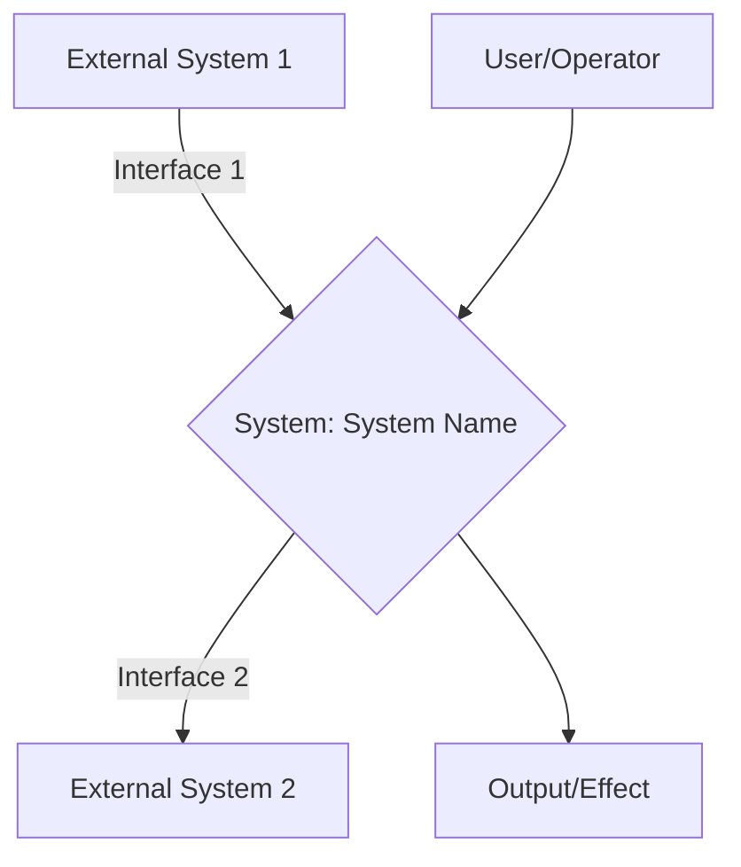

### 1.4 Applicable Documents
List all documents referenced or applicable to this specification. Include full title, document number/InfoCode, version, and date.
| InfoCode / Document Number | Title                                      | Version | Date       |
| :------------------------- | :----------------------------------------- | :------ | :--------- |
| `QAO-STD-GEN-001`          | GAIA-QAO General Design Standard         | 1.2     | YYYY-MM-DD |
| `[INFOCODE_ICD_EXT1]`      | ICD between System and External System 1   | 1.0     | YYYY-MM-DD |
| `[Relevant_MIL_STD_DO_ECSS]`| [Title of Standard]                      | X.Y     | YYYY-MM-DD |

### 1.5 Definitions, Acronyms, and Abbreviations
List and define all special terms, acronyms, and abbreviations used in this document.
*   **AGAD:** Aerospace Global Archive & Discovery
*   **DAL:** Design Assurance Level
*   **GAIA-QAO:** GAIA Quantum Aerospace Organization
*   **RMA:** Reliability, Maintainability, Availability
*   **System:** Refers to [System Name] unless otherwise specified.

## 2. System Requirements
This section details the specific requirements for the System. Each requirement shall be uniquely identifiable, verifiable, and traceable.

**Requirement ID Format:** `REQ-SYS-[SystemAcronym]-[RequirementType]-[NNN]`
*   `RequirementType`: FR (Functional), PR (Performance), IR (Interface), PH (Physical), RM (RMA), EN (Environmental), SA (Safety), SE (Security), QP (Quality), HF (Human Factors), QS (Quantum-Specific).
*   `NNN`: Sequential number.

### 2.1 Functional Requirements
Describe what the system must do.

#### 2.1.1 REQ-SYS-[SystemAcronym]-FR-001: [Function Name 1]
The System shall [description of function 1].
*   **Rationale:** [Why is this function needed?]
*   **Verification Method(s):** Test, Analysis, Inspection, Demonstration.
*   **Traceability (to higher level req, if any):** `[Parent_Req_ID]`

#### 2.1.2 REQ-SYS-[SystemAcronym]-FR-002: [Function Name 2]
The System shall [description of function 2].
*   **Rationale:** ...
*   **Verification Method(s):** ...
*   **Traceability:** ...

*(Continue for all functional requirements)*

### 2.2 Performance Requirements
Define how well the system must perform its functions, including quantitative values and tolerances.

#### 2.2.1 REQ-SYS-[SystemAcronym]-PR-001: [Performance Metric 1 for FR-XXX]
The System shall achieve [performance value, e.g., accuracy of +/- 0.1%] for [Function FR-XXX] under [specified conditions].
*   **Rationale:** ...
*   **Verification Method(s):** Test, Analysis.
*   **Traceability:** `REQ-SYS-[SystemAcronym]-FR-XXX`

*(Continue for all performance requirements)*

### 2.3 Interface Requirements
Define the interfaces between the System and other systems, users, or the environment. Refer to Interface Control Documents (ICDs) where applicable.

#### 2.3.1 REQ-SYS-[SystemAcronym]-IR-EXT-001: [External Interface Name 1]
The System shall interface with [External System/Entity Name] via [Interface Type, e.g., MIL-STD-1553 Bus / API / Physical Connector P1].
*   **Details:** Refer to ICD: `[INFOCODE_OF_ICD_EXT1]`.
*   **Data exchanged / Signals / Power:** [Summary]
*   **Rationale:** ...
*   **Verification Method(s):** Test, Inspection.

#### 2.3.2 REQ-SYS-[SystemAcronym]-IR-INT-001: [Internal Interface Name 1]
*(If specifying interfaces between major internal components of the System itself)*
The [Component A] shall interface with [Component B] via [Interface Type].
*   **Details:** Refer to Internal ICD/Design Document: `[InfoCode]`
*   **Rationale:** ...
*   **Verification Method(s):** Test, Inspection.

*(Continue for all interface requirements)*

### 2.4 Physical Characteristics

#### 2.4.1 REQ-SYS-[SystemAcronym]-PH-001: Weight
The total weight of the System shall not exceed [XX] kg.
*   **Rationale:** ...
*   **Verification Method(s):** Inspection (Weighing).

#### REQ-SYS-[SystemAcronym]-PH-002: Dimensions
The System shall fit within an envelope of [Length] x [Width] x [Height] mm.
*   **Rationale:** ...
*   **Verification Method(s):** Inspection (Measurement).

#### REQ-SYS-[SystemAcronym]-PH-003: Power Consumption
The System's average power consumption during nominal operation shall not exceed [YY] Watts. Peak power shall not exceed [ZZ] Watts for more than [T] seconds.
*   **Rationale:** ...
*   **Verification Method(s):** Test.

#### REQ-SYS-[SystemAcronym]-PH-004: Thermal Dissipation
The System shall dissipate no more than [WW] Watts of heat under nominal operating conditions.
*   **Rationale:** ...
*   **Verification Method(s):** Analysis, Test.

*(Add other physical requirements: materials, connectors, mounting provisions, etc.)*

### 2.5 Reliability, Maintainability, Availability (RMA) Requirements

#### REQ-SYS-[SystemAcronym]-RM-001: Mean Time Between Failures (MTBF)
The System shall have a demonstrated MTBF of at least [XXXXX] hours for critical functions.
*   **Rationale:** ...
*   **Verification Method(s):** Analysis (Reliability Prediction), Test (Accelerated Life Testing).

#### REQ-SYS-[SystemAcronym]-RM-002: Mean Time To Repair (MTTR)
The System shall have an MTTR of no more than [Y] hours for [specified critical LRUs/components] by a trained technician with standard tools.
*   **Rationale:** ...
*   **Verification Method(s):** Demonstration, Analysis.

#### REQ-SYS-[SystemAcronym]-RM-003: Availability
The System shall achieve an operational availability (Ao) of [ZZ.ZZ]%.
*   **Rationale:** ...
*   **Verification Method(s):** Analysis (based on MTBF and MTTR).

*(Add other RMA requirements: diagnostic capabilities, test points, accessibility, etc.)*

### 2.6 Environmental Requirements

#### REQ-SYS-[SystemAcronym]-EN-001: Operating Temperature
The System shall operate nominally within an ambient temperature range of [T_min] °C to [T_max] °C.
*   **Rationale:** ...
*   **Verification Method(s):** Test (Thermal Chamber).

#### REQ-SYS-[SystemAcronym]-EN-002: Vibration
The System shall withstand vibration levels as specified in [Applicable Standard, e.g., MIL-STD-810G, Method 514.7, Category X].
*   **Rationale:** ...
*   **Verification Method(s):** Test (Shaker Table).

*(Continue for other environmental factors: humidity, shock, altitude, EMI/EMC, radiation (for SP), fluid compatibility, etc., referencing standards like DO-160 for AS, ECSS-E-ST-10-04C for SP)*

### 2.7 Safety Requirements

#### REQ-SYS-[SystemAcronym]-SA-001: [Safety Hazard 1 Mitigation]
The System shall [specific design feature or behavior] to mitigate [Specific Hazard identified in System Safety Assessment]. Failure of the System to perform this shall not result in a hazard more severe than [DAL/SIL Level or Consequence].
*   **Rationale:** Derived from System Safety Assessment (SSA) `[InfoCode of SSA]`.
*   **Verification Method(s):** Analysis, Test, Inspection.
*   **Safety Standard Compliance:** `[e.g., ARP4761, MIL-STD-882E Task XXX]`

*(Continue for all safety-significant requirements. Ensure traceability to hazard analyses.)*

### 2.8 Security Requirements (Cybersecurity, Physical)

#### REQ-SYS-[SystemAcronym]-SE-001: Access Control
The System shall implement [specific access control mechanisms, e.g., role-based access] for all external interfaces providing command or configuration capabilities.
*   **Rationale:** To prevent unauthorized access and modification.
*   **Verification Method(s):** Test, Inspection.
*   **Security Standard Compliance:** `[e.g., DO-326A/ED-202A, NIST SP 800-XX]`

#### REQ-SYS-[SystemAcronym]-SE-002: Data Protection
Sensitive data processed or stored by the System shall be protected using [specific encryption standard, e.g., AES-256].
*   **Rationale:** ...
*   **Verification Method(s):** Analysis, Test.

*(Continue for other security requirements: data integrity, audit logging, anti-tamper, supply chain security, etc.)*

### 2.9 Quality Provisions / Standards Compliance

#### REQ-SYS-[SystemAcronym]-QP-001: Software Development Standard
All software developed for the System shall comply with [e.g., DO-178C DAL C, NASA NPR 7150.2 Class B, GAIA-QAO-SW-STD-001].
*   **Rationale:** To ensure software quality and reliability.
*   **Verification Method(s):** Audit, Inspection of development artifacts.

#### REQ-SYS-[SystemAcronym]-QP-002: Hardware Design Standard
All electronic hardware developed for the System shall comply with [e.g., DO-254 DAL C, ECSS-Q-ST-60C].
*   **Rationale:** ...
*   **Verification Method(s):** Audit, Inspection.

*(List other applicable quality standards, manufacturing processes, material specifications, etc.)*

### 2.10 Human Factors / Usability Requirements (if applicable)
For systems involving human interaction (displays, controls, maintenance interfaces).

#### REQ-SYS-[SystemAcronym]-HF-001: [User Task 1 Performance]
A trained operator shall be able to complete [User Task 1] using the System interface within [Time Limit] with an error rate not exceeding [X]%.
*   **Rationale:** ...
*   **Verification Method(s):** Test (Usability Testing with representative users).
*   **Standard Compliance:** `[e.g., MIL-STD-1472, FAA Human Factors Design Standard]`

### 2.11 Quantum-Specific Requirements (if applicable)
For systems incorporating quantum technologies.

#### REQ-SYS-[SystemAcronym]-QS-001: [Quantum Performance Metric 1]
The [Quantum Component/Function] shall achieve a [e.g., Qubit Coherence Time] of at least [Value] [Units] under nominal operating conditions.
*   **Rationale:** ...
*   **Verification Method(s):** Test, Specialized Quantum Measurement.

#### REQ-SYS-[SystemAcronym]-QS-002: [Quantum System Interface 1]
The System shall provide a [Interface Type, e.g., classical control interface] to the [Quantum Subsystem MDL-XYZ] as defined in ICD `[InfoCode_QCM_ICD]`.
*   **Rationale:** ...
*   **Verification Method(s):** Test, Inspection.

## 3. Verification and Validation

### 3.1 Verification Methods Overview
This section summarizes the verification strategy for the System. Detailed verification procedures for each requirement will be documented in the System Verification Plan (`[InfoCode_SVerP]`) and individual Test Procedures.
*   **Analysis (A):** Verification through mathematical modeling, simulation, or logical deduction.
*   **Inspection (I):** Verification by visual examination of the System or its documentation.
*   **Demonstration (D):** Verification by operating the System to show a qualitative result.
*   **Test (T):** Verification by operating the System with quantitative measurements under controlled conditions.

### 3.2 Requirements Traceability Matrix (RTM) - Link or Reference
A Requirements Traceability Matrix (RTM) shall be maintained throughout the System lifecycle, tracing each system requirement in this document to:
*   Higher-level (parent) requirements (if applicable).
*   Design elements implementing the requirement.
*   Verification method(s) used.
*   Specific test cases/procedures verifying the requirement.
*   Verification results.

**RTM Document InfoCode:** `[INFOCODE_OF_SYSTEM_RTM]`

## Appendix A: [Title]
*(Placeholder for any system-specific appendices, e.g., detailed operational scenarios, specific parameter lists, etc.)*

#### G.2 Interface Control Document (ICD) Template
**INFOCODE Root:** `QAO-DOC-TPL-ICD`

---
---
title: "Interface Control Document (ICD) between [System A] and [System B]"
infocode: "QAO-DOC-TPL-ICD-[SYSTEM_A_ID]-[SYSTEM_B_ID]-V[X.Y.Z]"
object_id_context:
  - "[GAIA-QAO ID of System A]"
  - "[GAIA-QAO ID of System B]"
version: "1.0.0"
date: "YYYY-MM-DD"
status: "Draft"
authors:
  - "[Lead Author Name (System A Team)]"
  - "[Lead Author Name (System B Team)]"
reviewers:
  - "[Reviewer Name (Reviewer Org)]"
approver: "[Approving Authority/TOC Lead]"
security_classification: "UNCLASSIFIED" # Adjust as needed
keywords:
  - "interface control document"
  - "icd"
  - "[system a]"
  - "[system b]"
  - "aerospace"
  - "gaia-qao"
related_documents:
  - "[INFOCODE_OF_SYSTEM_A_SPEC]"
  - "[INFOCODE_OF_SYSTEM_B_SPEC]"
change_log_ref: "CHANGELOG.md#section-for-this-icd"
gao_qao_compliance:
  agad_level: "Level 2 Documentation"
  coafi_alignment: "COAFI-INT-00X"
  infocode_schema_version: "1.1.0"
---
---

# Interface Control Document (ICD)
## Between [System A Name] ([System A GAIA-QAO ID])
## And [System B Name] ([System B GAIA-QAO ID])

**Document InfoCode:** `QAO-DOC-TPL-ICD-[SYSTEM_A_ID]-[SYSTEM_B_ID]-V[X.Y.Z]`
**Date:** YYYY-MM-DD
**Version:** X.Y.Z

## Table of Contents
- [1. Introduction](#1-introduction)
  - [1.1 Purpose](#11-purpose)
  - [1.2 Scope](#12-scope)
  - [1.3 System Overviews](#13-system-overviews)
    - [1.3.1 [System A] Overview](#131-system-a-overview)
    - [1.3.2 [System B] Overview](#132-system-b-overview)
  - [1.4 Applicable Documents](#14-applicable-documents)
  - [1.5 Definitions, Acronyms, and Abbreviations](#15-definitions-acronyms-and-abbreviations)
- [2. Interface Definition and Characteristics](#2-interface-definition-and-characteristics)
  - [2.1 Interface Overview Diagram](#21-interface-overview-diagram)
  - [2.2 Interface Type: [e.g., Electrical, Mechanical, Data, RF, Optical, Fluidic]](#22-interface-type-eg-electrical-mechanical-data-rf-optical-fluidic)
    - [2.2.1 Physical Characteristics](#221-physical-characteristics)
      - [2.2.1.1 Connector(s) (System A Side)](#2211-connectors-system-a-side)
      - [2.2.1.2 Connector(s) (System B Side)](#2212-connectors-system-b-side)
      - [2.2.1.3 Pinout Details (if applicable)](#2213-pinout-details-if-applicable)
      - [2.2.1.4 Cabling/Harness (if specified by ICD)](#2214-cablingharness-if-specified-by-icd)
      - [2.2.1.5 Mechanical Fit/Tolerances](#2215-mechanical-fittolerances)
    - [2.2.2 Functional Characteristics](#222-functional-characteristics)
      - [2.2.2.1 Signal/Data Definitions (from System A to System B)](#2221-signaldata-definitions-from-system-a-to-system-b)
      - [2.2.2.2 Signal/Data Definitions (from System B to System A)](#2222-signaldata-definitions-from-system-b-to-system-a)
      - [2.2.2.3 Protocol Definition (if data interface)](#2223-protocol-definition-if-data-interface)
      - [2.2.2.4 Timing and Synchronization](#2224-timing-and-synchronization)
    - [2.2.3 Performance Characteristics](#223-performance-characteristics)
      - [2.2.3.1 Data Rate / Bandwidth](#2231-data-rate--bandwidth)
      - [2.2.3.2 Latency](#2232-latency)
      - [2.2.3.3 Signal Levels / Power Levels](#2233-signal-levels--power-levels)
      - [2.2.3.4 Impedance / Load Characteristics](#2234-impedance--load-characteristics)
    - [2.2.4 Environmental Characteristics (at interface point)](#224-environmental-characteristics-at-interface-point)
    - [2.2.5 Safety and Security Considerations](#225-safety-and-security-considerations)
  - [2.3 Interface Type: [Another Interface Type, if multiple distinct interfaces]](#23-interface-type-another-interface-type-if-multiple-distinct-interfaces)
    - ... (Repeat structure from 2.2)
- [3. Interface Verification Matrix](#3-interface-verification-matrix)
- [Appendix A: Detailed Signal/Data Parameter Tables](#appendix-a-detailed-signaldata-parameter-tables)
- [Appendix B: Connector Part Numbers and Drawings (References)](#appendix-b-connector-part-numbers-and-drawings-references)

---

## 1. Introduction

### 1.1 Purpose
This Interface Control Document (ICD) defines and controls the interface(s) between [System A Name] (hereinafter "System A") and [System B Name] (hereinafter "System B"). This document ensures that both systems are developed and maintained with compatible interfaces, allowing for proper interoperation.

### 1.2 Scope
This ICD covers the definition of all mechanical, electrical, data, fluidic, optical, RF, and/or software interfaces necessary for System A and System B to interact as specified. It includes physical, functional, performance, and environmental characteristics of these interfaces.

### 1.3 System Overviews

#### 1.3.1 [System A] Overview
*   **GAIA-QAO ID:** `[System A GAIA-QAO ID]`
*   **Brief Description:** [Provide a short description of System A's purpose and key functions relevant to this interface.]
*   **Interface Responsibility:** [System A Team/Organization] is responsible for implementing its side of the interface(s) defined herein.

#### 1.3.2 [System B] Overview
*   **GAIA-QAO ID:** `[System B GAIA-QAO ID]`
*   **Brief Description:** [Provide a short description of System B's purpose and key functions relevant to this interface.]
*   **Interface Responsibility:** [System B Team/Organization] is responsible for implementing its side of the interface(s) defined herein.

### 1.4 Applicable Documents
| InfoCode / Document Number | Title                                      | Version | Date       |
| :------------------------- | :----------------------------------------- | :------ | :--------- |
| `[SYS_A_SPEC_INFOCODE]`    | System Specification for [System A Name]   | X.Y     | YYYY-MM-DD |
| `[SYS_B_SPEC_INFOCODE]`    | System Specification for [System B Name]   | X.Y     | YYYY-MM-DD |
| `[RELEVANT_STD_INFOCODE]`  | [Relevant Interface Standard, e.g., MIL-STD-1553, ARINC 429] | X.Y     | YYYY-MM-DD |

### 1.5 Definitions, Acronyms, and Abbreviations
*   **ICD:** Interface Control Document
*   **TBD:** To Be Determined
*   **TBS:** To Be Supplied
*   **[System A Acronym]:** ...
*   **[System B Acronym]:** ...

## 2. Interface Definition and Characteristics

### 2.1 Interface Overview Diagram
*(Insert a block diagram showing System A, System B, and the interface(s) between them. Clearly label each distinct interface point if multiple exist.)*

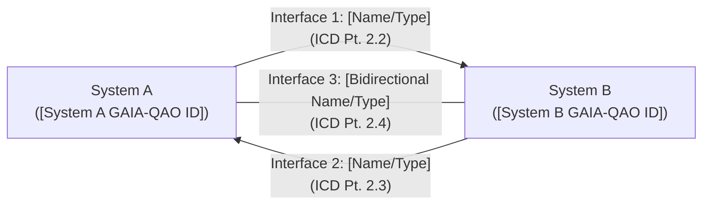

### 2.2 Interface Type: [e.g., Primary Data Interface - Bus X]
This section defines the characteristics of the [Interface Name/Type] between System A and System B.

#### 2.2.1 Physical Characteristics

##### 2.2.1.1 Connector(s) (System A Side)
*   **Part Number:** `[Connector P/N]`
*   **Manufacturer:** `[Manufacturer Name]`
*   **Type:** `[e.g., D-Sub 37-pin Male, MIL-DTL-38999 Series III Size 15]`
*   **Location on System A:** `[Reference to drawing/location]`
*   **Mating Connector (on System B side or cable):** `[P/N of mating connector]`

##### 2.2.1.2 Connector(s) (System B Side)
*   **Part Number:** `[Connector P/N]`
*   **Manufacturer:** `[Manufacturer Name]`
*   **Type:** `[e.g., D-Sub 37-pin Female, MIL-DTL-38999 Series III Size 15]`
*   **Location on System B:** `[Reference to drawing/location]`

##### 2.2.1.3 Pinout Details (if applicable)
(Provide a table detailing pin assignments for each connector.)
**Connector J1 (System A Side - [Connector P/N]) to P1 (System B Side - [Connector P/N])**
| Pin No. | Signal Name (System A perspective) | Signal Name (System B perspective) | Signal Type/Level    | Remarks/Wire Spec (if applicable) |
| :------ | :--------------------------------- | :--------------------------------- | :------------------- | :-------------------------------- |
| 1       | `DATA_A_OUT_P`                     | `DATA_A_IN_P`                      | LVDS Positive        | Twisted Shielded Pair             |
| 2       | `DATA_A_OUT_N`                     | `DATA_A_IN_N`                      | LVDS Negative        | Twisted Shielded Pair             |
| 3       | `SYSTEM_A_HEALTH_OK`               | `SYSTEM_A_HEALTH_STATUS`           | Discrete, Open Drain | 28V when OK, Open when Fault      |
| ...     | ...                                | ...                                | ...                  | ...                               |
| Shell   | `CHASSIS_GND_A`                    | `CHASSIS_GND_B`                    | Chassis Ground       | Bonded to structure               |

##### 2.2.1.4 Cabling/Harness (if specified by ICD)
*   **Cable Part Number:** `[If a specific interconnect cable is part of the ICD]`
*   **Type/Construction:** `[e.g., Shielded multi-core, specific impedance]`
*   **Length Constraints:** `[Min/Max length]`

##### 2.2.1.5 Mechanical Fit/Tolerances
*   **Mounting Provisions:** `[Details of how the systems connect mechanically at the interface]`
*   **Alignment Features:** `[Keyways, guide pins, etc.]`
*   **Mating/Demating Forces:** `[Max forces allowed]`
*   **Drawing Reference:** `[Drawing number showing mechanical interface details]`

#### 2.2.2 Functional Characteristics

##### 2.2.2.1 Signal/Data Definitions (from System A to System B)
(Provide a table for each signal/data item or message.)
**Signal/Message: [Signal/Message Name 1]**
| Parameter         | Description                                                     | Value/Range/Format                                    | Units  | Update Rate/Timing |
| :---------------- | :-------------------------------------------------------------- | :---------------------------------------------------- | :----- | :----------------- |
| `ID`              | `[e.g., DATA_A_VALUE_X]`                                          |                                                       |        |                    |
| `Description`     | `[Meaning and purpose of the signal/data item]`                 |                                                       |        |                    |
| `Source`          | System A                                                        |                                                       |        |                    |
| `Destination`     | System B                                                        |                                                       |        |                    |
| `Data Type`       | `[e.g., Integer, Float, Boolean, String, Enumerated, Bitfield]` |                                                       |        |                    |
| `Format/Encoding` | `[e.g., IEEE 754 SP, 16-bit 2's comp, ASCII, CCSDS Packet]`     | Valid range: `[min] - [max]`, Specific bit definitions  | `[mV, deg/s, count]` | `[XX] Hz / [YY] ms`  |
| `Resolution`      | `[e.g., 0.1 mV/bit]`                                            |                                                       |        |                    |
| `Accuracy`        | `[e.g., +/- 0.5% Full Scale]`                                   |                                                       |        |                    |
| `Notes`           | `[Any additional information]`                                  |                                                       |        |                    |

*(Repeat for each signal/data item from A to B)*

##### 2.2.2.2 Signal/Data Definitions (from System B to System A)
(Similar table structure as 2.2.2.1 for signals/data flowing from B to A.)

##### 2.2.2.3 Protocol Definition (if data interface)
*   **Standard Used:** `[e.g., MIL-STD-1553B, ARINC 429, SpaceWire, Ethernet TCP/IP, CAN 2.0B]`
*   **Message Formats:** `[Reference to detailed message structures, e.g., Appendix A or external spec]`
*   **Data Link Layer:** `[Details if custom or specific profile of standard]`
*   **Network Layer:** `[IP addressing scheme if applicable]`
*   **Transport Layer:** `[TCP/UDP port usage if applicable]`
*   **Application Layer:** `[Custom protocol definition, command/response structure, API definition]`
*   **Error Handling:** `[Checksums, retransmissions, acknowledgements]`

##### 2.2.2.4 Timing and Synchronization
*   **Clock Source:** `[Which system provides clock, or external reference]`
*   **Synchronization Method:** `[e.g., GPS PPS, NTP, specific sync pulse]`
*   **Data Latency Requirements:** `[Max acceptable latency for critical data]`
*   **Sequencing:** `[Any required sequence of operations or data exchange]`

#### 2.2.3 Performance Characteristics

##### 2.2.3.1 Data Rate / Bandwidth
*   **Required:** `[Value] [kbps/Mbps/Gbps]`
*   **Nominal:** `[Value] [kbps/Mbps/Gbps]`
*   **Peak:** `[Value] [kbps/Mbps/Gbps]`

##### 2.2.3.2 Latency
*   **Max End-to-End Latency (A to B):** `[Value] ms` for [Critical Data Type]
*   **Max End-to-End Latency (B to A):** `[Value] ms` for [Critical Data Type]

##### 2.2.3.3 Signal Levels / Power Levels
*   **Voltage Levels (High/Low):** `[For digital signals]`
*   **Current Limits:** `[Max current source/sink]`
*   **Power Provided (if any):** `[System A to B, or B to A, Voltage, Max Current]`

##### 2.2.3.4 Impedance / Load Characteristics
*   **Characteristic Impedance:** `[Value] Ohms (for RF/high-speed data)`
*   **Termination:** `[Required termination scheme]`
*   **Input/Output Impedance:** `[For analog signals]`

#### 2.2.4 Environmental Characteristics (at interface point)
*   **Operating Temperature Range:** `[at the connector/interface]`
*   **Vibration/Shock Levels:** `[Interface must withstand]`
*   **EMI/EMC Requirements:** `[Shielding, grounding at interface]`
*   **Humidity/Contamination:** `[Sealing requirements if any]`

#### 2.2.5 Safety and Security Considerations
*   **Fault Tolerance:** `[Redundancy, error detection/correction at interface]`
*   **Grounding/Bonding:** `[Specific requirements for safety/signal integrity]`
*   **Data Security:** `[Encryption, authentication if data is sensitive]`
*   **Hazardous Voltages/Materials:** `[Warnings if present at interface]`

*(Section 2.3, 2.4, etc., would repeat the structure of 2.2 for each distinct interface type between System A and System B.)*

## 3. Interface Verification Matrix
This section provides a matrix or table summarizing how each interface requirement or characteristic defined in Section 2 will be verified.

| ICD Section | Requirement Summary / Characteristic | Verification Method (A,I,D,T) | Responsibility (Sys A / Sys B / Joint) | Reference to Test Procedure / Report |
| :---------- | :----------------------------------- | :---------------------------- | :------------------------------------- | :----------------------------------- |
| 2.2.1.1     | Connector P/N (System A)             | I                             | Sys A                                  | `[TP_INFOCODE_CONN_INSPECT]`         |
| 2.2.1.3     | Pin 1 Signal Level                   | T                             | Joint                                  | `[TP_INFOCODE_SIGNAL_TEST]`          |
| 2.2.2.1     | [Signal Name 1] Data Format          | A, T                          | Joint                                  | `[TP_INFOCODE_DATA_VALID]`           |
| 2.2.3.1     | Data Rate Nominal                    | T                             | Joint                                  | `[TP_INFOCODE_BW_TEST]`              |
| ...         | ...                                  | ...                           | ...                                    | ...                                  |

## Appendix A: Detailed Signal/Data Parameter Tables
*(This appendix would contain more extensive tables if the signal/data definitions in Section 2.2.2 become too large, e.g., for complex bus protocols with many messages.)*

**A.1 Messages from System A to System B: Protocol [Protocol Name]**
**Message ID: [Message_ID_001] - [Message Name]**
| Field Name | Offset (bytes) | Length (bytes/bits) | Data Type | Units | Range/Enum | Description |
| :--------- | :------------- | :------------------ | :-------- | :---- | :--------- | :---------- |
| ...        | ...            | ...                 | ...       | ...   | ...        | ...         |

## Appendix B: Connector Part Numbers and Drawings (References)
*(This appendix can list detailed part numbers for connectors, backshells, contacts, and reference drawings for mechanical interfaces if not fully detailed in Section 2.2.1.)*


#### G.3 Test Procedure Template
**INFOCODE Root:** `QAO-DOC-TPL-TSTPROC`

---
---
title: "Test Procedure for [Test Name / System Under Test]"
infocode: "QAO-DOC-TPL-TSTPROC-[SYSTEM_ID_OR_TEST_CASE_ID]-V[X.Y.Z]"
object_id_context:
  - "[GAIA-QAO ID of System Under Test]"
  - "[Related Requirement Spec InfoCode]"
version: "1.0.0"
date: "YYYY-MM-DD"
status: "Draft"
authors:
  - "[Test Engineer Name (Test Org)]"
reviewers:
  - "[Reviewer Name (Reviewer Org)]"
approver: "[Test Lead / Approving Authority]"
security_classification: "UNCLASSIFIED" # Adjust as needed
keywords:
  - "test procedure"
  - "verification"
  - "[system name]"
  - "aerospace"
  - "gaia-qao"
related_documents:
  - "[INFOCODE_OF_SYSTEM_SPEC]"
  - "[INFOCODE_OF_TEST_PLAN]"
  - "[INFOCODE_OF_RELATED_ICD_IF_INTERFACE_TEST]"
change_log_ref: "CHANGELOG.md#section-for-this-tp"
gao_qao_compliance:
  agad_level: "Level 2 Documentation"
  coafi_alignment: "COAFI-TST-00X"
  infocode_schema_version: "1.1.0"
---
---

# Test Procedure: [Test Name / System Under Test]
## ([GAIA-QAO ID / Component Tested])

**Document InfoCode:** `QAO-DOC-TPL-TSTPROC-[SYSTEM_ID_OR_TEST_CASE_ID]-V[X.Y.Z]`
**Date:** YYYY-MM-DD
**Version:** X.Y.Z

## Table of Contents
- [1. Introduction](#1-introduction)
  - [1.1 Purpose of Test](#11-purpose-of-test)
  - [1.2 Scope of Test](#12-scope-of-test)
  - [1.3 System/Component Under Test (SUT/CUT)](#13-systemcomponent-under-test-sutcut)
  - [1.4 Applicable Documents](#14-applicable-documents)
  - [1.5 Definitions, Acronyms, and Abbreviations](#15-definitions-acronyms-and-abbreviations)
- [2. Test Requirements and Objectives](#2-test-requirements-and-objectives)
  - [2.1 Requirements to be Verified](#21-requirements-to-be-verified)
  - [2.2 Test Objectives](#22-test-objectives)
  - [2.3 Pass/Fail Criteria](#23-passfail-criteria)
- [3. Test Setup and Configuration](#3-test-setup-and-configuration)
  - [3.1 Test Environment (Hardware, Software, Location)](#31-test-environment-hardware-software-location)
  - [3.2 Test Equipment Required](#32-test-equipment-required)
  - [3.3 SUT/CUT Configuration for Test](#33-sutcut-configuration-for-test)
  - [3.4 Test Setup Diagram](#34-test-setup-diagram)
- [4. Safety Precautions and Pre-Test Checks](#4-safety-precautions-and-pre-test-checks)
  - [4.1 Safety Hazards and Mitigations](#41-safety-hazards-and-mitigations)
  - [4.2 Pre-Test Readiness Checklist](#42-pre-test-readiness-checklist)
- [5. Test Execution Steps](#5-test-execution-steps)
  - [5.1 Test Case ID: [TC_ID_001] - [Test Case Name]](#51-test-case-id-tc_id_001---test-case-name)
    - [5.1.1 Objective(s) for this Test Case](#511-objectives-for-this-test-case)
    - [5.1.2 Prerequisites](#512-prerequisites)
    - [5.1.3 Step-by-Step Procedure](#513-step-by-step-procedure)
    - [5.1.4 Expected Results](#514-expected-results)
    - [5.1.5 Actual Results Recording](#515-actual-results-recording)
    - [5.1.6 Pass/Fail Assessment](#516-passfail-assessment)
  - [5.2 Test Case ID: [TC_ID_002] - [Test Case Name]](#52-test-case-id-tc_id_002---test-case-name)
    - ... (Repeat structure)
- [6. Data Recording and Analysis](#6-data-recording-and-analysis)
  - [6.1 Data to be Recorded](#61-data-to-be-recorded)
  - [6.2 Data Sheets / Log Formats (Link or Appendix)](#62-data-sheets--log-formats-link-or-appendix)
  - [6.3 Data Analysis Procedures (if any)](#63-data-analysis-procedures-if-any)
- [7. Post-Test Procedures](#7-post-test-procedures)
  - [7.1 System Restoration / Teardown](#71-system-restoration--teardown)
  - [7.2 Anomaly Reporting Procedure](#72-anomaly-reporting-procedure)
- [Appendix A: Test Data Sheets (Templates)](#appendix-a-test-data-sheets-templates)
- [Appendix B: Test Equipment Calibration Records (References)](#appendix-b-test-equipment-calibration-records-references)

---

## 1. Introduction

### 1.1 Purpose of Test
This document provides the detailed step-by-step procedure for conducting the [Test Name] on the [System/Component Under Test Name]. The purpose of this test is to verify [summarize what is being verified, e.g., specific functional requirements, performance parameters, or interface compatibility].

### 1.2 Scope of Test
This test procedure covers:
*   Setup and configuration of the System/Component Under Test (SUT/CUT) and test environment.
*   Execution steps for each test case.
*   Expected results and pass/fail criteria for each test case.
*   Data recording requirements.
*   Safety precautions.

### 1.3 System/Component Under Test (SUT/CUT)
*   **Name:** [Full Name of SUT/CUT]
*   **GAIA-QAO ID(s):** `[GAIA-QAO Object ID or Subsystem ID]`
*   **Part Number(s) (if applicable):** `[P/N]`
*   **Serial Number(s) (if applicable):** `[S/N]`
*   **Software/Firmware Version(s) (if applicable):** `[Version]`
*   **Configuration:** `[Configuration Code, e.g., A1, or description]`

### 1.4 Applicable Documents
| InfoCode / Document Number | Title                                      | Version | Date       |
| :------------------------- | :----------------------------------------- | :------ | :--------- |
| `[SYS_SPEC_INFOCODE]`      | System Specification for [SUT Name]        | X.Y     | YYYY-MM-DD |
| `[TEST_PLAN_INFOCODE]`     | Test Plan for [Project/System Name]        | X.Y     | YYYY-MM-DD |
| `[ICD_INFOCODE_IF_APPL]`   | ICD for [Interface Being Tested]           | X.Y     | YYYY-MM-DD |
| `[USER_MANUAL_INFOCODE]`   | User Manual for [SUT Name] (if relevant)   | X.Y     | YYYY-MM-DD |

### 1.5 Definitions, Acronyms, and Abbreviations
*   **SUT:** System Under Test
*   **CUT:** Component Under Test
*   **TE:** Test Equipment
*   **TP:** Test Procedure
*   **[Other Acronyms]**: ...

## 2. Test Requirements and Objectives

### 2.1 Requirements to be Verified
List the specific requirements from the System Specification (or other source document) that this test procedure is designed to verify.
| Requirement ID (from Spec)         | Requirement Summary                                     |
| :--------------------------------- | :------------------------------------------------------ |
| `REQ-SYS-[SUT_Acronym]-FR-001`     | [Summary of Functional Requirement 1 being tested]      |
| `REQ-SYS-[SUT_Acronym]-PR-003`     | [Summary of Performance Requirement 3 being tested]     |
| `REQ-SYS-[SUT_Acronym]-IR-EXT-002` | [Summary of Interface Requirement 2 being tested]       |
| ...                                | ...                                                     |

### 2.2 Test Objectives
Clearly state the overall objectives of this test procedure.
*   To verify that the SUT correctly performs [Function X].
*   To measure the [Performance Parameter Y] of the SUT under specified conditions.
*   To confirm the SUT correctly interfaces with [External System Z].

### 2.3 Pass/Fail Criteria
Define the overall criteria for the successful completion of this test procedure. This is often a summary stating that all individual test cases must pass.
*   **Overall Pass:** All test cases listed in Section 5 are completed with a "Pass" assessment, and all recorded data is within specified tolerances.
*   **Overall Fail:** Any test case results in a "Fail" assessment, or critical data is out of tolerance or cannot be recorded.

## 3. Test Setup and Configuration

### 3.1 Test Environment (Hardware, Software, Location)
*   **Location:** `[Test Lab Name / Facility]`
*   **Ambient Conditions:** `[e.g., Temperature: 20-25°C, Humidity: 40-60% RH]`
*   **Hardware Testbed:** `[Description of the test rig, support structures, etc.]`
*   **Software Environment:** `[Operating System versions, driver versions, simulation software used]`
*   **Network Configuration:** `[If applicable, IP addresses, network topology]`

### 3.2 Test Equipment Required
List all Test Equipment (TE) needed.
| TE ID / Name                 | Manufacturer    | Model Number | Calibration Due Date | Purpose in Test                               |
| :--------------------------- | :-------------- | :----------- | :------------------- | :-------------------------------------------- |
| `PSU-001` / Power Supply     | Keysight        | E36312A      | YYYY-MM-DD           | Provide 28VDC power to SUT                    |
| `DMM-002` / Digital Multimeter| Fluke           | 87V          | YYYY-MM-DD           | Measure voltage/current at [Test Point X]     |
| `OSC-001` / Oscilloscope     | Tektronix       | MSO58        | YYYY-MM-DD           | Observe signal waveform at [Interface Y]      |
| `LOAD-001` / Programmable Load| Chroma          | 63201        | YYYY-MM-DD           | Simulate load on SUT output                   |
| `PC-TEST-01` / Test Control PC| Dell            | Optiplex XXXX| N/A                  | Run test script, log data, control TE via GPIB |

### 3.3 SUT/CUT Configuration for Test
*   Describe how the SUT/CUT must be configured for this test (e.g., specific software load, hardware jumpers, operational mode).
*   Reference to SUT/CUT configuration documentation: `[InfoCode]`

### 3.4 Test Setup Diagram
*(Insert a block diagram showing the SUT/CUT, all TE, and their interconnections. Label all connections and interfaces.)*

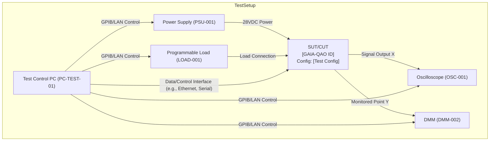

## 4. Safety Precautions and Pre-Test Checks

### 4.1 Safety Hazards and Mitigations
| Hazard ID | Description of Hazard                       | Potential Consequence     | Mitigation Action(s)                                     |
| :-------- | :------------------------------------------ | :------------------------ | :------------------------------------------------------- |
| `SAF-001` | Electrical Shock (High Voltage in TE/SUT)   | Injury / Equipment Damage | Ensure proper grounding. Use PPE. Only qualified personnel. |
| `SAF-002` | Mechanical Hazard (Moving parts in SUT/rig) | Pinch/Crush Injury        | Ensure guards are in place. Maintain safe distance.      |
| `SAF-003` | Software Anomaly Causing Unsafe State     | Equipment Damage / Data Loss| Implement emergency stop. Test in isolated environment.    |

### 4.2 Pre-Test Readiness Checklist
| Check # | Item                                                | Status (OK/NA/Fail) | Remarks |
| :------ | :-------------------------------------------------- | :------------------ | :------ |
| 1       | All personnel briefed on safety precautions         |                     |         |
| 2       | SUT/CUT configured as per Section 3.3               |                     |         |
| 3       | All TE listed in Section 3.2 available & calibrated |                     |         |
| 4       | Test setup matches diagram in Section 3.4           |                     |         |
| 5       | Data recording methods/sheets ready (Section 6)     |                     |         |
| 6       | Emergency stop procedures understood                |                     |         |
| 7       | Test area clear and secure                          |                     |         |

## 5. Test Execution Steps
This section details the individual test cases.

### 5.1 Test Case ID: [TC_ID_001] - [Test Case Name, e.g., Nominal Power-Up Sequence]
#### 5.1.1 Objective(s) for this Test Case
*   To verify [Specific aspect related to Req XXX].
*   To observe [Specific behavior].
#### 5.1.2 Prerequisites
*   Pre-Test Readiness Checklist (Section 4.2) complete.
*   SUT powered off.
*   TE [specific TE] set to [specific setting].
#### 5.1.3 Step-by-Step Procedure
| Step | Action                                                                | Instructions / Stimulus                                    | Data to Record                                   |
| :--- | :-------------------------------------------------------------------- | :--------------------------------------------------------- | :----------------------------------------------- |
| 1    | Connect SUT to Power Supply                                           | Ensure PSU-001 is OFF. Connect output to SUT power input J1. | Connection confirmed.                            |
| 2    | Configure Power Supply                                                | Set PSU-001 to 28.0 VDC, Current Limit 5.0 A.              | PSU settings.                                    |
| 3    | Power ON SUT                                                          | Turn ON PSU-001.                                           | Time of power ON. Initial current draw (DMM-002 reading on SUT input). |
| 4    | Monitor SUT Initialization                                            | Observe SUT status indicators (LEDs, display).             | Sequence of indicators. Time to reach ready state. |
| 5    | Verify Nominal Voltage at Test Point TP1                              | Using DMM-002, measure voltage at TP1 on SUT.              | Voltage at TP1 (V).                              |
| ...  | ...                                                                   | ...                                                        | ...                                              |
| X    | Record final SUT status                                               | Check SUT status indicators.                               | Final status.                                    |
| Y    | Power OFF SUT                                                         | Turn OFF PSU-001.                                          | Time of power OFF.                               |

#### 5.1.4 Expected Results
| Step Ref | Parameter / Observation                       | Expected Value / Behavior                       | Tolerance (+/-) |
| :------- | :-------------------------------------------- | :---------------------------------------------- | :-------------- |
| 3        | Initial current draw                          | < 1.0 A                                         | 0.2 A           |
| 4        | Time to ready state                           | < 30 seconds                                    | 5 s             |
| 4        | Status Indicator Pattern                      | LED1 GREEN, LED2 OFF                            | N/A             |
| 5        | Voltage at TP1                                | 5.0 VDC                                         | 0.1 VDC         |
| ...      | ...                                           | ...                                             | ...             |
| X        | Final SUT status                              | NOMINAL / READY                                 | N/A             |

#### 5.1.5 Actual Results Recording
*(Reference to Test Data Sheet for TC_ID_001 - see Appendix A. All "Data to Record" items must have corresponding fields.)*

#### 5.1.6 Pass/Fail Assessment
*   **Pass:** All actual results in 5.1.5 meet the expected results in 5.1.4 within specified tolerances.
*   **Fail:** Any actual result is outside the specified tolerance or expected behavior. (If Fail, record anomaly reference in Section 7.2).
**Test Case [TC_ID_001] Result:** ____________ (Pass/Fail)
**Tester Signature:** _______________________ **Date:** ____________
**Witness Signature (if req.):** ______________ **Date:** ____________

---
*(Section 5.2 onwards would repeat the Test Case structure for each additional test case.)*

## 6. Data Recording and Analysis

### 6.1 Data to be Recorded
Summarize all types of data that must be recorded during the execution of this test procedure. This typically includes:
*   Test environment conditions (temperature, humidity at start/end).
*   SUT/CUT identification (P/N, S/N, SW/FW version).
*   TE identification and calibration status.
*   Quantitative measurements from TE for each relevant step.
*   Qualitative observations of SUT/CUT behavior.
*   Timestamps for key events.
*   Pass/Fail status for each test case.
*   Any deviations from the test procedure and justifications.
*   Anomaly report numbers if any failures occur.

### 6.2 Data Sheets / Log Formats (Link or Appendix)
*   Reference specific Test Data Sheet templates to be used (see Appendix A for example).
*   Specify format for automated logs if TE or test scripts generate them.
*   **Data Storage Location:** `[Path to server / database / folder where test data will be stored]`

### 6.3 Data Analysis Procedures (if any)
Describe any post-test data analysis required (e.g., statistical analysis of multiple runs, comparison against simulation data, FFT of vibration data).

## 7. Post-Test Procedures

### 7.1 System Restoration / Teardown
*   Describe steps to safely power down the SUT/CUT and TE.
*   Describe steps to disconnect equipment and return the SUT/CUT and test area to a safe/neutral state.
*   Verify SUT/CUT is left in `[specified state, e.g., Powered Off, Configuration X]`.

### 7.2 Anomaly Reporting Procedure
*   If any test case fails or unexpected behavior is observed, an Anomaly Report (AR) / Problem Report (PR) shall be generated according to `[Project Anomaly Reporting Procedure - InfoCode]`.
*   The AR number shall be recorded on the Test Data Sheet for the failed test case.
*   Testing may be paused or stopped based on the severity of the anomaly, as per Test Plan `[TEST_PLAN_INFOCODE]`.

## Appendix A: Test Data Sheets (Templates)
*(Provide blank templates for Test Data Sheets. This could be a generic one, or specific ones per test case if they vary significantly.)*

**Example Generic Test Data Sheet Header:**
```
TEST PROCEDURE: [TP InfoCode] - [Test Name]
TEST CASE ID: [TC_ID_XXX]
SUT/CUT ID: [GAIA-QAO ID of SUT] P/N: _______ S/N: _______ SW/FW Ver: _______
TEST DATE: ____________  TESTER: ______________ WITNESS (if any): ______________
AMBIENT TEMP: _______ HUMIDITY: _______
----------------------------------------------------------------------------------
Step | Action Summary | Expected Result | Actual Result | Pass/Fail | Remarks/AR#
----------------------------------------------------------------------------------
     |                |                 |               |           |
```

## Appendix B: Test Equipment Calibration Records (References)
*(This appendix typically does not contain the full calibration certificates but references where they are stored or provides a summary table of TE used and their calibration validity.)*
| TE ID / Name             | Manufacturer    | Model Number | Serial Number | Calibration Due Date |
| :----------------------- | :-------------- | :----------- | :------------ | :------------------- |
| `PSU-001`                | Keysight        | E36312A      | MYXXXXXXXXX   | YYYY-MM-DD           |
| ...                      | ...             | ...          | ...           | ...                  |


#### G.4 Air System (ATA-based) Technical Document Template
**INFOCODE Root:** `QAO-DOC-TPL-ASLIB` (for a specific system manual)

---
title: "[Aircraft Model Name] - [ATA Chapter XX - System Name] - Maintenance Manual Excerpt"
infocode: "QAO-DOC-TPL-ASLIB-[AIRCRAFT_MODEL_ID]-ATA[XXYYZZ]-V[X.Y.Z]" # XXYYZZ = ATA Chap-Sect-Sub
object_id_context: ["[GAIA-QAO Aircraft Model ID, e.g., AS-M-PAX-BW-Q1H]"]
version: "1.0.0"
date: "YYYY-MM-DD"
status: "Draft"
authors:
  - "[Technical Author Name (Org)]"
reviewers:
  - "[SME Reviewer Name (Org)]"
approver: "[Chief Engineer / Publication Authority]"
security_classification: "UNCLASSIFIED" # Or as applicable
keywords: ["maintenance manual", "ata chapter [XX]", "[system name]", "[aircraft model]", "gaia-qao"]
related_documents:
  - "[INFOCODE_OF_AIRCRAFT_AMM_TOP_LEVEL]"
  - "[INFOCODE_OF_RELATED_IPC_SECTION]"
  - "[INFOCODE_OF_RELATED_WDM_SECTION]"
change_log_ref: "CHANGELOG.md#section-for-this-doc-module"
gao_qao_compliance:
  agad_level: "Level 3 Technical Data"
  coafi_alignment: "COAFI-AMM-00X"
  s1000d_compatibility: "Planned (Data Module Concept)"
  infocode_schema_version: "1.1.0"
---

# [Aircraft Model Name] Technical Library
## Part II: Air Systems - ATA Chapter [XX]
### [ATA Chapter XX System Name]

**Document Module InfoCode:** `QAO-DOC-TPL-ASLIB-[AIRCRAFT_MODEL_ID]-ATA[XXYYZZ]-V[X.Y.Z]`
**Aircraft Model GAIA-QAO ID:** `[AS-A-CCC-ST-MDL]`
**Effective for Aircraft S/N:** `[List S/Ns or All]`
**Revision:** X.Y.Z **Date:** YYYY-MM-DD

---
**Table of Contents (for this ATA Chapter Section/Sub-section)**
*(This would be dynamic based on the content of the specific ATA section)*
- ATA XX-00-00: System Description and Operation
- ATA XX-10-00: [Major Component/Subsystem A]
  - ATA XX-10-01: Description and Operation
  - ATA XX-10-02: Maintenance Practices
    - ATA XX-10-02, Block 1: Removal
    - ATA XX-10-02, Block 2: Installation
    - ATA XX-10-02, Block 3: Test / Check
- ATA XX-20-00: [Major Component/Subsystem B]
  - ...

---

**Safety Summary for this Chapter**
*WARNING: OBSERVE ALL SAFETY PRECAUTIONS DETAILED IN [AIRCRAFT MODEL NAME] AIRCRAFT MAINTENANCE MANUAL (AMM) GENERAL SECTION (INFOCODE: ...) BEFORE PERFORMING ANY MAINTENANCE.*
*WARNING: [SPECIFIC WARNING FOR THIS SYSTEM, E.G., HYDRAULIC PRESSURE HAZARD].*
*CAUTION: [SPECIFIC CAUTION FOR THIS SYSTEM, E.G., ESD SENSITIVE COMPONENTS].*

---

### ATA XX-00-00: [System Name] - System Description and Operation

#### 1. General
This section describes the [System Name] installed on the [Aircraft Model Name]. The [System Name]'s primary function is to [state primary function]. It is part of the overall [larger system group, e.g., avionics suite, hydraulic system network].

*(Include a simplified block diagram or schematic of the system within the aircraft context.)*
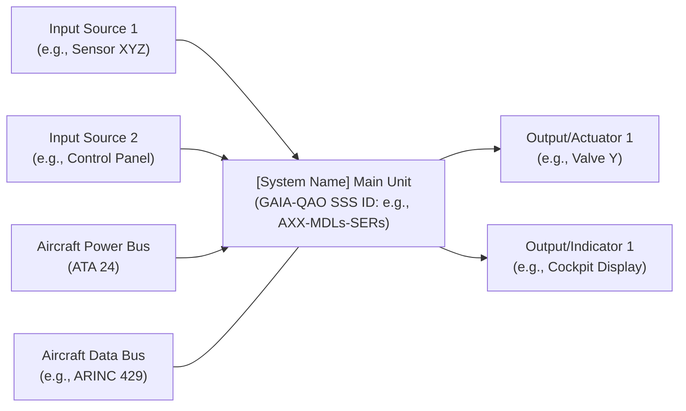

#### 2. Components
The major components of the [System Name] are:
*   **[Component 1 Name] (GAIA-QAO ID: `...::AXX-MDLc1-...`)**: Located at [Aircraft Zone/Station]. Function: [...]
*   **[Component 2 Name] (GAIA-QAO ID: `...::AXX-MDLc2-...`)**: Located at [Aircraft Zone/Station]. Function: [...]
*   *(List all major LRUs/components with their GAIA-QAO Subsystem ID if applicable)*

#### 3. Operation
Describe the normal operation of the system. Include modes of operation if applicable.
*   **Power-up Sequence:** ...
*   **Nominal Mode:** ...
*   **Failure Modes / Redundancy (Brief Overview):** ...
*   **Interface with other systems:** The [System Name] interfaces with:
    *   [Other System 1 Name (ATA YY)] for [purpose of interface].
    *   [Other System 2 Name (ATA ZZ)] for [purpose of interface].
    *(Reference relevant ICD InfoCodes)*

#### 4. Controls and Indications (Cockpit)
Describe any cockpit controls and indications related to this system.
*   **Control Panel [Name/Location]:** Switches, knobs, and their functions.
*   **Display [Name/Location]:** Information displayed, symbology, warnings/cautions.

---

### ATA XX-10-00: [Major Component/Subsystem A Name]
*(Example: ATA 24-20-01: DC Generator XYZ)*

#### ATA XX-10-01: Description and Operation - [Major Component/Subsystem A Name]
*   **GAIA-QAO Subsystem Model ID:** `AXX-MDLc1` (Example for this component model)
*   **Part Number(s):** `[OEM P/N]`
*   **Purpose:** Detailed purpose of this specific component.
*   **Physical Description:** Size, weight, materials, key features.
*   **Functional Description:** How this component works internally and its role in the overall system.
*   **Interfaces:** Detailed electrical, mechanical, data interfaces for this component.

# ATA XX-10-02: Maintenance Practices - [Major Component/Subsystem A Name]

## TASK XX-10-02-800-801: Removal of [Major Component/Subsystem A Name]
*(This follows typical AMM task structure)*

---

### 1. Reason for Job
**A.** To remove the [Component Name] for:
   - Scheduled maintenance
   - Replacement due to failure
   - Access to other components

---

### 2. Job Setup Information
#### A. Manpower
- [e.g., 1 Maintenance Technician]

#### B. Estimated Time
- [e.g., 2.0 Hours]

#### C. Referenced Information

| Title | Number/InfoCode |
| :----------------------------------------- | :-------------------- |
| AMM Introduction - Safety Precautions      | [INFOCODE_AMM_SAFETY] |
| Circuit Breaker Location Chart             | Fig. [X], ATA 24-00-00 |
| [Tool Name] Usage Instructions             | [TOOL_MANUAL_INFOCODE]|

#### D. Consumable Materials

| Name            | Specification | Part Number  |
| :-------------- | :------------ | :----------- |
| Lockwire        | MS20995C32    |              |
| Cleaning Solvent| MIL-PRF-680   |              |

#### E. Expendable Parts

| Name     | Part Number    | Qty |
| :------- | :------------- | :-- |
| O-Ring   | [P/N_ORING]    | 2   |

#### F. Tools and Equipment

| Name            | Part Number    | Qty | Notes       |
| :-------------- | :------------- | :-- | :---------- |
| Screwdriver Set | Standard       | 1   |             |
| Torque Wrench   | [P/N_TORQUE_W] | 1   | Calibrated  |
| [Special Tool A]| [P/N_TOOL_A]   | 1   |             |

---

### 3. Job Setup
#### A. Aircraft Preparation:
1. Ensure aircraft is safe for maintenance (AMM Intro).
2. Position ground power unit (GPU) (if required) and connect to aircraft.
3. Open circuit breaker(s) for [System Name / Component Name]:  
   - Panel [X], CB No. [Y, Z].  
   - Tag CBs.

#### B. Access:
1. Open access panel [Panel No.] located at [Zone/Station].

---

### 4. Procedure
*(Detailed, numbered steps for removal)*

1. **WARNING:** ENSURE HYDRAULIC PRESSURE IS DEPLETED FROM SYSTEM [SYS_NAME] BEFORE DISCONNECTING LINES.
2. Disconnect electrical connector [Connector ID, e.g., P101] from [Component Name]. Cap connector.
3. Disconnect fluid line [Line ID] at [Port A] of [Component Name]. Cap line and port.
4. Remove [Number] mounting bolts [Bolt Size/Type] securing [Component Name] to bracket.  
   **NOTE:** Support component weight during bolt removal.
5. Carefully withdraw [Component Name] from its mounting.

---

### 5. Close-up
**A.** Inspect area for foreign objects, debris (FOD).  
**B.** If component is not immediately replaced, install protective covers on open lines/ports and electrical connectors.  
**C.** Close access panel [Panel No.].  
**D.** Remove CB tags and close circuit breakers *(if instructed by higher-level task or if aircraft is to be returned to service immediately, otherwise leave open).*

*(Similar detailed structures for Installation, Test/Check, Adjustments, Cleaning, Inspection, etc., would follow for each relevant component and maintenance task within the ATA chapter structure.)*

---

*(Further ATA chapter sections (XX-20-00, etc.) would be detailed following this pattern.)*


#### G.5 Space System (SS-based) Technical Document Template
**INFOCODE Root:** `QAO-DOC-TPL-SPLIB` (for a specific system manual)

---
title: "[Spacecraft Model Name] - [SS XX.Y.Z - System/Subsystem Name] - Operations Handbook Excerpt"
infocode: "QAO-DOC-TPL-SPLIB-[SPACECRAFT_MODEL_ID]-SS[XXYYZ]-V[X.Y.Z]" # XXYYZ = SS Maj.Min.Sub
object_id_context: ["[GAIA-QAO Spacecraft Model ID, e.g., SP-U-SAT-CO-Q2A]"]
version: "1.0.0"
date: "YYYY-MM-DD"
status: "Draft"
authors:
  - "[Technical Author Name (Org)]"
reviewers:
  - "[SME Reviewer Name (Org)]"
approver: "[Mission Director / Publication Authority]"
security_classification: "UNCLASSIFIED" # Or as applicable
keywords: ["operations handbook", "spacecraft system [SS XX]", "[system name]", "[spacecraft model]", "gaia-qao"]
related_documents:
  - "[INFOCODE_OF_SPACECRAFT_OPS_CONCEPT_TOP_LEVEL]"
  - "[INFOCODE_OF_RELATED_GROUND_SYSTEM_ICD]"
change_log_ref: "CHANGELOG.md#section-for-this-doc-module"
gao_qao_compliance:
  agad_level: "Level 3 Technical Data"
  coafi_alignment: "COAFI-OPS-00X"
  ccsds_compatibility: "Planned (Data Module Concept)"
  infocode_schema_version: "1.1.0"
---

# [Spacecraft Model Name] Operations Handbook
## Part II: Space Systems - SS [XX]: [Top-Level System Name]
### SS [XX.Y]: [Subsystem Group Name]
#### SS [XX.Y.Z]: [Specific System/Component Name]

**Document Module InfoCode:** `QAO-DOC-TPL-SPLIB-[SPACECRAFT_MODEL_ID]-SS[XXYYZ]-V[X.Y.Z]`
**Spacecraft Model GAIA-QAO ID:** `[SP-A-CCC-ST-MDL]`
**Effective for Spacecraft S/N (Instance ID):** `[List S/Ns or All]`
**Revision:** X.Y.Z **Date:** YYYY-MM-DD

---
**Table of Contents (for this SS Section/Sub-section)**
*(Dynamic based on the content of the specific SS section)*
- SS XX.Y.Z-00: System Description and Functional Overview
- SS XX.Y.Z-10: Nominal Operations
  - SS XX.Y.Z-10.01: Power-On and Initialization Sequence
  - SS XX.Y.Z-10.02: Mode Transitions
  - SS XX.Y.Z-10.03: Commanded Operations
- SS XX.Y.Z-20: Telemetry Monitoring
  - SS XX.Y.Z-20.01: Key Telemetry Parameters and Limits
  - SS XX.Y.Z-20.02: Health and Status Interpretation
- SS XX.Y.Z-30: Fault Detection, Isolation, and Recovery (FDIR)
  - SS XX.Y.Z-30.01: Onboard Autonomous FDIR Logic
  - SS XX.Y.Z-30.02: Ground Commanded Recovery Procedures
- SS XX.Y.Z-40: Contingency Operations
  - SS XX.Y.Z-40.01: [Specific Contingency Scenario 1]
- SS XX.Y.Z-50: Performance Characteristics & Constraints

---

**Operational Notes for this System**
*NOTE: ALL OPERATIONS MUST BE PERFORMED IN ACCORDANCE WITH THE APPROVED MISSION TIMELINE AND FLIGHT RULES (INFOCODE: ...).*
*CAUTION: VERIFY [PREREQUISITE SYSTEM STATUS] BEFORE COMMANDING [CRITICAL FUNCTION].*
*INFO: This system interfaces with SS [AA.B.C] ([Other System Name]). Refer to ICD [InfoCode] for details.*

---

### SS XX.Y.Z-00: [System/Component Name] - System Description and Functional Overview

#### 1. General
This section describes the [System/Component Name] (GAIA-QAO SSS ID: `[e.g., S01-EPTH-SN001]`) which is part of the SS [XX] [Top-Level System Name] on the [Spacecraft Model Name].
Its primary functions are:
*   [Function 1]
*   [Function 2]

*(Include a simplified functional block diagram of the system within the spacecraft context.)*
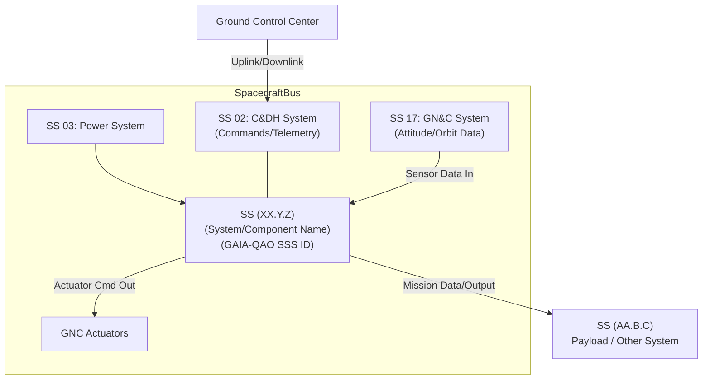

#### 2. Key Hardware Components (LRUs)
*   **[Component 1 Name] (GAIA-QAO SSS ID: `[...-MDLc1-...]`)**: Primary function within this system: [...]. Key telemetry points: [...].
*   **[Component 2 Name] (GAIA-QAO SSS ID: `[...-MDLc2-...]`)**: Primary function within this system: [...]. Key telemetry points: [...].
*   *(List major LRUs with their GAIA-QAO Subsystem IDs if applicable, focusing on operational aspects.)*

#### 3. Functional Modes
The [System/Component Name] has the following primary operational modes:
*   **Mode 1 (e.g., STANDBY):** Description... Entry Conditions... Exit Conditions... Power Consumption...
*   **Mode 2 (e.g., NOMINAL_OPERATION):** Description... Entry Conditions... Exit Conditions... Power Consumption...
*   **Mode 3 (e.g., SAFE_MODE):** Description... Entry Conditions... Exit Conditions... Power Consumption...

---

### SS XX.Y.Z-10: Nominal Operations

#### SS XX.Y.Z-10.01: Power-On and Initialization Sequence
1.  **Command:** `[COMMAND_MNEMONIC_POWER_ON]` (Hex: `[XXXX]`, Args: `[params]`)
2.  **Expected Telemetry Indication:**
    *   `[TM_PARAM_STATUS]` changes from `OFF` to `INITIALIZING`.
    *   `[TM_PARAM_POWER_DRAW]` increases to approx. `[Y] W`.
3.  **Initialization Duration:** Approx. `[Z]` seconds.
4.  **Successful Initialization Indication:**
    *   `[TM_PARAM_STATUS]` changes to `STANDBY` or `NOMINAL`.
    *   Event message `[EVENT_SYS_READY]` generated.
5.  **Off-Nominal Indications during Init:**
    *   If `[TM_PARAM_STATUS]` remains `INITIALIZING` for > `[2*Z]` seconds, refer to FDIR XX.Y.Z-30.XX.
    *   If `[TM_PARAM_INIT_ERROR_FLAG]` is set, refer to FDIR XX.Y.Z-30.YY.

#### SS XX.Y.Z-10.02: Mode Transitions
**Transition from [Mode A] to [Mode B]:**
1.  **Prerequisites:** System in [Mode A], `[TM_PARAM_CONDITION_X]` is `TRUE`.
2.  **Command:** `[COMMAND_MNEMONIC_MODE_B]` (Hex: `[YYYY]`)
3.  **Expected Telemetry Indication:** `[TM_PARAM_CURRENT_MODE]` changes to `MODE_B_TRANSITION`, then `MODE_B`.
4.  **Transition Duration:** Approx. `[T]` seconds.
5.  **Off-Nominal Indications:** ...

*(Detail other nominal operations, commanded functions, data acquisition sequences, etc.)*

---

### SS XX.Y.Z-20: Telemetry Monitoring

#### SS XX.Y.Z-20.01: Key Telemetry Parameters and Limits
| Parameter Mnemonic     | GAIA-QAO Data ID (Conceptual) | Description                   | Units | Nominal Range   | Yellow Limits (L/H) | Red Limits (L/H) |
| :--------------------- | :---------------------------- | :---------------------------- | :---- | :-------------- | :------------------ | :--------------- |
| `[SYS_TEMP_MAIN]`      | `SSXXYYZ.TEMP.MAIN`           | Main Unit Temperature         | °C    | 20 to 40        | 10/50               | 0/60             |
| `[SYS_VOLT_BUS]`       | `SSXXYYZ.VOLT.BUS`            | Input Bus Voltage             | V     | 27.5 to 28.5    | 27.0/29.0           | 26.5/29.5        |
| `[SYS_STATUS_WORD]`    | `SSXXYYZ.STAT.MAIN`           | System Status Word            | Enum  | NOMINAL         | N/A                 | FAULT            |
| `[SYS_Q_PARAM_FIDELITY]`| `SSXXYYZ.QPARAM.FIDEL`        | Quantum State Fidelity        | %     | > 99.9          | 99.5                | 99.0             |

#### SS XX.Y.Z-20.02: Health and Status Interpretation
*   **Green Status (`[TM_PARAM_SYS_HEALTH]` = `GREEN`):** All parameters nominal, system performing as expected.
*   **Yellow Status (`[TM_PARAM_SYS_HEALTH]` = `YELLOW`):** One or more parameters are outside nominal but within yellow limits. System may be operating with degraded performance or increased risk. Investigate using diagnostic procedures.
*   **Red Status (`[TM_PARAM_SYS_HEALTH]` = `RED`):** One or more parameters are outside red limits, or a critical fault is detected. System may be non-operational or pose a risk. Execute relevant FDIR/Contingency procedure.

---

*(Sections SS XX.Y.Z-30 (FDIR), SS XX.Y.Z-40 (Contingency Ops), and SS XX.Y.Z-50 (Performance) would be detailed with specific procedures, fault trees, decision logic, and expected performance metrics and constraints, similar to how AMM troubleshooting or Flight Crew Operating Manual (FCOM) sections are structured, but adapted for spacecraft operations context.)*


# Quantum System Specification for [Quantum System/Component Name]

**InfoCode:** QAO-DOC-TPL-QSPEC-[QUANTUM_SYS_ID]-V[X.Y.Z]  
**Object ID Context:** 
- [Parent GAIA-QAO Object ID if applicable]
- [Quantum Subsystem GAIA-QAO ID, e.g., ::QCS-QPU1A-S0001]  
**Version:** 1.0.0  
**Date:** YYYY-MM-DD  
**Status:** Draft  

---

## Authors
- [Lead Quantum Physicist/Engineer (Org)]  

## Reviewers
- [Reviewer Name (Quantum Expert)]  
- [Reviewer Name (Systems Engineer)]  

## Approver
- [Chief Quantum Systems Architect / TOC Lead]  

---

## Security Classification
**GAIA-QAO-CONFIDENTIAL-QUANTUM** *(Example, adjust as needed)*  

---

## Keywords
- Quantum system
- Specification
- [System Name]
- Qubits
- Coherence
- GAIA-QAO  

---

## Related Documents
- [INFOCODE_OF_PARENT_SYSTEM_SPEC]  
- [INFOCODE_OF_QUANTUM_CONTROL_ICD]  
- [INFOCODE_OF_CRYOGENICS_ICD_IF_APPLICABLE]  

---

## Change Log Reference
[CHANGELOG.md#section-for-this-qspec](CHANGELOG.md#section-for-this-qspec)

---

## GAIA-QAO Compliance
- **AGAD Level:** Level 3 Specialized Technical Data  
- **COAFI Alignment:** COAFI-QTY-00X  
- **InfoCode Schema Version:** 1.1.0  

---

### Sections
*(Sections SS XX.Y.Z-30 (FDIR), SS XX.Y.Z-40 (Contingency Ops), and SS XX.Y.Z-50 (Performance) would be detailed with specific procedures, fault trees, decision logic, and expected performance metrics and constraints, similar to how AMM troubleshooting or Flight Crew Operating Manual (FCOM) sections are structured, but adapted for spacecraft operations context.)*
---

# Quantum System Specification: [Quantum System/Component Name]
## ([GAIA-QAO Quantum Subsystem ID or Component Name])

**Document InfoCode:** `QAO-DOC-TPL-QSPEC-[QUANTUM_SYS_ID]-V[X.Y.Z]`
**Date:** YYYY-MM-DD
**Version:** X.Y.Z

## Table of Contents
- [1. Introduction](#1-introduction)
  - [1.1 Purpose](#11-purpose)
  - [1.2 Scope](#12-scope)
  - [1.3 Quantum System Overview](#13-quantum-system-overview)
  - [1.4 Applicable Documents](#14-applicable-documents)
  - [1.5 Definitions, Acronyms, and Quantum-Specific Terminology](#15-definitions-acronyms-and-quantum-specific-terminology)
- [2. Quantum System Requirements](#2-quantum-system-requirements)
  - [2.1 Quantum Functional Requirements (QFR)](#21-quantum-functional-requirements-qfr)
    - [2.1.1 QFR-[SysAcronym]-001: [Quantum Function 1 Name, e.g., Qubit Initialization]](#211-qfr-sysacronym-001--quantum-function-1-name-eg-qubit-initialization)
    - [2.1.2 QFR-[SysAcronym]-002: [Quantum Function 2 Name, e.g., Single-Qubit Gate Operation]](#212-qfr-sysacronym-002--quantum-function-2-name-eg-single-qubit-gate-operation)
    - [2.1.3 QFR-[SysAcronym]-003: [Quantum Function 3 Name, e.g., Two-Qubit Entangling Gate Operation]](#213-qfr-sysacronym-003--quantum-function-3-name-eg-two-qubit-entangling-gate-operation)
    - [2.1.4 QFR-[SysAcronym]-004: [Quantum Function 4 Name, e.g., Qubit Measurement/Readout]](#214-qfr-sysacronym-004--quantum-function-4-name-eg-qubit-measurementreadout)
    - [2.1.5 QFR-[SysAcronym]-00X: [For Quantum Sensors: Sensing Modality]](#215-qfr-sysacronym-00x--for-quantum-sensors-sensing-modality)
    - [2.1.6 QFR-[SysAcronym]-00Y: [For QKD Systems: Key Generation Protocol]](#216-qfr-sysacronym-00y--for-qkd-systems-key-generation-protocol)
  - [2.2 Quantum Performance Requirements (QPR)](#22-quantum-performance-requirements-qpr)
    - [2.2.1 QPR-[SysAcronym]-001: [Qubit Count/Type]](#221-qpr-sysacronym-001--qubit-counttype)
    - [2.2.2 QPR-[SysAcronym]-002: [Coherence Times (T1, T2)]](#222-qpr-sysacronym-002--coherence-times-t1-t2)
    - [2.2.3 QPR-[SysAcronym]-003: [Gate Fidelities (Single/Two-Qubit)]](#223-qpr-sysacronym-003--gate-fidelities-single-two-qubit)
    - [2.2.4 QPR-[SysAcronym]-004: [Readout Fidelity]](#224-qpr-sysacronym-004--readout-fidelity)
    - [2.2.5 QPR-[SysAcronym]-005: [Quantum Volume / CLOPS / Other Benchmark]](#225-qpr-sysacronym-005--quantum-volume--clops--other-benchmark)
    - [2.2.6 QPR-[SysAcronym]-00X: [For Quantum Sensors: Sensitivity, Bandwidth, Bias Stability]](#226-qpr-sysacronym-00x--for-quantum-sensors-sensitivity-bandwidth-bias-stability)
    - [2.2.7 QPR-[SysAcronym]-00Y: [For QKD: Secure Key Rate, Max Distance, QBER]](#227-qpr-sysacronym-00y--for-qkd-secure-key-rate-max-distance-qber)
  - [2.3 Classical Interface Requirements (to Quantum System)](#23-classical-interface-requirements-to-quantum-system)
    - [2.3.1 Control and Programming Interface](#231-control-and-programming-interface)
    - [2.3.2 Data Output Interface (Measurement Results)](#232-data-output-interface-measurement-results)
    - [2.3.3 Timing and Synchronization Interface](#233-timing-and-synchronization-interface)
  - [2.4 Physical and Environmental Requirements for Quantum Operation](#24-physical-and-environmental-requirements-for-quantum-operation)
    - [2.4.1 Thermal Environment (Cryogenics if applicable)](#241-thermal-environment-cryogenics-if-applicable)
    - [2.4.2 Magnetic Shielding / Vibration Isolation](#242-magnetic-shielding--vibration-isolation)
    - [2.4.3 Electromagnetic Compatibility (EMC) for Quantum Ops](#243-electromagnetic-compatibility-emc-for-quantum-ops)
    - [2.4.4 Power, Size, Weight (SWaP) for Quantum Subsystem](#244-power-size-weight-swap-for-quantum-subsystem)
    - [2.4.5 Vacuum Requirements (if applicable)](#245-vacuum-requirements-if-applicable)
  - [2.5 Quantum System Reliability and Stability Over Time](#25-quantum-system-reliability-and-stability-over-time)
  - [2.6 Calibration and Characterization Requirements](#26-calibration-and-characterization-requirements)
  - [2.7 Quantum Safety Requirements (e.g., Laser Safety, Cryogen Safety, High Voltage)](#27-quantum-safety-requirements-eg-laser-safety-cryogen-safety-high-voltage)
- [3. Quantum System Architecture Overview](#3-quantum-system-architecture-overview)
  - [3.1 Qubit Modality / Sensor Principle / Quantum Protocol](#31-qubit-modality--sensor-principle--quantum-protocol)
  - [3.2 Major Quantum Core Components (e.g., QPU Chip, Ion Trap, Atomic Cell)](#32-major-quantum-core-components-eg-qpu-chip-ion-trap-atomic-cell)
  - [3.3 Major Classical Support Components (Control Electronics, Lasers, Cryo-cooler, Vacuum Pumps)](#33-major-classical-support-components-control-electronics-lasers-cryo-cooler-vacuum-pumps)
  - [3.4 Functional Block Diagram (Quantum Path + Classical Control/Readout Path)](#34-functional-block-diagram-quantum-path--classical-controlreadout-path)
- [4. Verification and Validation (Quantum Aspects)](#4-verification-and-validation-quantum-aspects)
  - [4.1 Quantum Benchmarking Procedures (e.g., Randomized Benchmarking, QVS)](#41-quantum-benchmarking-procedures-eg-randomized-benchmarking-qvs)
  - [4.2 Calibration Data Requirements and Procedures](#42-calibration-data-requirements-and-procedures)
  - [4.3 Specialized Test Equipment for Quantum V&V](#43-specialized-test-equipment-for-quantum-vv)
  - [4.4 Quantum Requirements Traceability (Link or Reference to RTM)](#44-quantum-requirements-traceability-link-or-reference-to-rtm)
- [Appendix QA: Quantum Parameter Definitions & Measurement Standards Used](#appendix-qa-quantum-parameter-definitions--measurement-standards-used)
- [Appendix QB: Detailed Classical Interface Specifications (Control & Data Schemas)](#appendix-qb-detailed-classical-interface-specifications-control--data-schemas)

---

## 1. Introduction

### 1.1 Purpose
This document defines the system-level requirements, performance characteristics, and architectural overview for the [Quantum System/Component Name] (hereinafter "the Quantum System"). It serves as the primary technical specification for its design, development, characterization, integration, verification, and validation within the GAIA-QAO framework, with a specific focus on its quantum-mechanical properties and operational needs.

### 1.2 Scope
This specification covers:
*   Quantum-specific functional requirements (e.g., quantum operations, state manipulation).
*   Key quantum performance metrics (e.g., qubit count, coherence, fidelity, sensitivity).
*   Interfaces between the Quantum System and its classical control, readout, and environmental support systems.
*   Critical physical and environmental constraints necessary for maintaining quantum operation (e.g., temperature, magnetic fields, vibration).
*   Unique verification, validation, and calibration aspects pertinent to quantum systems.

**Parent System GAIA-QAO ID (if applicable):** `[Parent Top-Level Object ID or Higher-Level System ID, e.g., SP-U-SAT-QS-Q3H-01008]`
**Quantum System GAIA-QAO ID (This System):** `[Subsystem ID or Assigned Quantum Component ID, e.g., ::QCS-QPU1A-S0001 or ::QSN-QMAG3B-S0002]`

### 1.3 Quantum System Overview
Provide a brief, high-level description of the Quantum System. This should include:
*   The underlying quantum principle or technology (e.g., superconducting transmon qubits, trapped Ytterbium ions, nitrogen-vacancy (NV) center magnetometry, atomic interferometry for inertial sensing, BB84 protocol for QKD).
*   The primary purpose of the Quantum System (e.g., performing specific quantum computations, high-precision sensing of a physical quantity, establishing a secure communication channel).
*   Its intended role and integration within a larger aerospace system or mission.
*   Any novel or distinguishing quantum features.

*(Conceptual Diagram Placeholder for Quantum System Context - specific to quantum aspects)*

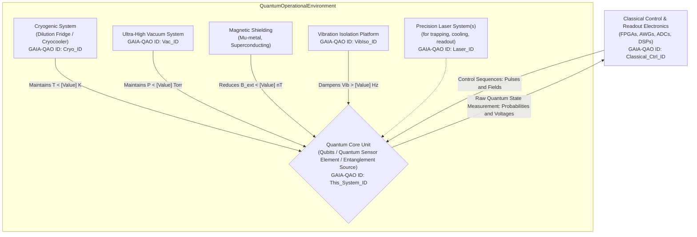
## 1.4 Applicable Documents

| InfoCode / Document Number      | Title                                                              | Version | Date       |
| :-------------------------------| :------------------------------------------------------------------| :-------| :----------|
| [PARENT_SYS_SPEC]               | System Specification for [Parent System Name]                     | X.Y     | YYYY-MM-DD |
| [QUANTUM_THEORY_REF]            | [e.g., Nielsen & Chuang, "Quantum Computation and Quantum Information"] | Ed. Z | YYYY       |
| [IEEE_PXXXX_Q_STD]              | [Relevant IEEE Quantum Standard for Terminology/Metrics, if any]  | Draft/Std | YYYY-MM-DD |
| [INTERNAL_DESIGN_NOTE]          | [Internal Design Note on Qubit/Sensor Architecture Details]       | Rev A   | YYYY-MM-DD |
| [CONTROL_ELECTRONICS_ICD]       | ICD for Quantum Control Electronics Interface                     | 1.0     | YYYY-MM-DD |

---

## 1.5 Definitions, Acronyms, and Quantum-Specific Terminology

- **Qubit**: Quantum Bit - the basic unit of quantum information.
- **T1 Time**: Longitudinal (energy) relaxation time of a qubit.
- **T2 Time / T2* Time**: Transverse (dephasing) relaxation time / Free induction decay time, measures of qubit coherence.
- **Gate Fidelity**: A measure of how accurately a quantum gate operation matches the ideal operation.
- **Readout Fidelity**: A measure of the accuracy of determining a qubit's state after measurement.
- **Quantum Volume (QV)**: A single-number metric for benchmarking quantum computer performance.
- **CLOPS**: Circuit Layer Operations Per Second - a benchmark for quantum computer speed.
- **QKD**: Quantum Key Distribution - a secure communication method using quantum mechanics.
- **QBER**: Quantum Bit Error Rate - error rate in a QKD system.
- **NV Center**: Nitrogen-Vacancy center in diamond, used for quantum sensing.
- **SQUID**: Superconducting Quantum Interference Device - highly sensitive magnetometer.
- **AWG**: Arbitrary Waveform Generator - used for generating precise control pulses for qubits.
- *[Other relevant quantum terms: Entanglement, Superposition, Decoherence, Hamiltonian, Bloch Sphere, etc.]*

---

## 2. Quantum System Requirements

### Requirement ID Format
**REQ-QSYS-[SystemAcronym]-[RequirementType]-[NNN]**  
- **RequirementType**: QFR (Quantum Functional), QPR (Quantum Performance), CIF (Classical Interface), PEQ (Physical/Environmental Quantum), QRL (Quantum Reliability), QCA (Quantum Calibration), QSA (Quantum Safety).

### 2.1 Quantum Functional Requirements (QFR)

#### 2.1.1 REQ-QSYS-[SystemAcronym]-QFR-001: [Quantum Function 1 Name, e.g., Qubit State Initialization]
**Description:**  
The Quantum System shall be capable of initializing [Number, e.g., N ≥ X] physical qubits to a fiducial state (e.g., |0⟩ state or ground state) with a state preparation fidelity of at least [F_init] % for each qubit.  

- **Rationale:** Essential for starting any quantum algorithm, sensing protocol, or quantum communication sequence. Ensures a known starting point.  
- **Verification Method(s):** Test (State Tomography, Repeated Measurement).  
- **Traceability (to higher level req, if any):** [Parent_System_Function_Req_ID]  

#### 2.1.2 REQ-QSYS-[SystemAcronym]-QFR-002: [Quantum Function 2 Name, e.g., Single-Qubit Gate Operation]
**Description:**  
The Quantum System shall be capable of performing a universal set of single-qubit gate operations (e.g., X, Y, Z, H, T, S gates, or arbitrary SU(2) rotations) on each of the [N] addressable qubits.  

- **Rationale:** Necessary for universal quantum computation or precise quantum state manipulation in sensing.  
- **Verification Method(s):** Test (Process Tomography, Randomized Benchmarking).  
- **Traceability:** [Parent_System_Function_Req_ID]  

#### 2.1.3 REQ-QSYS-[SystemAcronym]-QFR-003: [Quantum Function 3 Name, e.g., Two-Qubit Entangling Gate Operation]
**Description:**  
The Quantum System shall be capable of performing at least one type of two-qubit entangling gate operation (e.g., CNOT, CZ, iSWAP) between specified pairs of connected qubits. The connectivity map shall be [Described or Referenced Drawing/Table].  

- **Rationale:** Essential for creating entanglement, a key resource for quantum algorithms and certain quantum communication protocols.  
- **Verification Method(s):** Test (Process Tomography, Bell State Measurement, Entanglement Witness).  
- **Traceability:** [Parent_System_Function_Req_ID]  

#### (Continue for additional functional requirements...)

---

### 2.2 Quantum Performance Requirements (QPR)

#### 2.2.1 REQ-QSYS-[SystemAcronym]-QPR-001: [Qubit Count/Type]
**Description:**  
The Quantum System shall provide a minimum of [N_qubits] physical qubits of [Qubit Modality, e.g., superconducting transmon, trapped Ca+ ion] type.  

- **Rationale:** Defines the scale of the quantum resource.  
- **Verification Method(s):** Inspection (of design), Test (characterization of individual qubit addressability and operation).  

#### 2.2.2 REQ-QSYS-[SystemAcronym]-QPR-002: [Coherence Times (T1, T2)]
**Description:**  
The Quantum System shall achieve an average T1 (energy relaxation) time of ≥ [Value_T1] [Units, e.g., µs, ms] and an average T2 (coherence/dephasing) time (e.g., Ramsey/Echo T2) of ≥ [Value_T2] [Units] for its operational qubits under nominal environmental conditions.  

- **Rationale:** Critical for limiting decoherence and enabling complex quantum operations.  
- **Verification Method(s):** Test (Standard T1/T2 measurement sequences).  

#### (Continue for additional performance requirements...)

---

### 2.3 Classical Interface Requirements (CIF)

#### 2.3.1 REQ-QSYS-[SystemAcronym]-CIF-001: Control and Programming Interface
**Description:**  
The Quantum System shall provide a classical interface (e.g., Ethernet API, dedicated hardware control lines) allowing for [Description: e.g., loading quantum circuit descriptions, sending pulse sequences, setting sensor parameters]. This interface shall conform to ICD [InfoCode_Control_ICD].  

- **Rationale:** Enables classical computer control of quantum operations.  
- **Verification Method(s):** Test, Inspection.  

#### (Continue for additional interface requirements...)

---

### (Continue for Sections 2.4, 2.5, etc.)


### ATA iSpec 2200 Transformation Simulator: Audience Handout

*GenAI Proposal Status: This document represents a conceptual design generated through AI assistance. Implementation details would require further technical specification and validation by aerospace engineering teams.*

## GAIA-Q-AIR Documentation Transformation Initiative

![GAIA-Q-AIR Logo Placeholder]

### Transforming Aerospace Documentation for the Quantum Age

The GAIA Quantum Aerospace Intelligent Representation (GAIA-Q-AIR) initiative presents a revolutionary approach to aerospace technical documentation. Our ATA iSpec 2200 Transformation Simulator demonstrates how traditional documentation can be transformed into semantically enriched, knowledge-integrated formats that enable next-generation maintenance, training, and regulatory compliance capabilities.

---

## Simulator Highlights

### 1. Semantic Transformation Pipeline

Transform flat documentation into intelligent, interconnected knowledge:

- **Document Ingestion**: Parse ATA iSpec 2200 structured content
- **Content Normalization**: Standardize formats, units, and terminology
- **Entity Recognition**: Identify aerospace components, procedures, and concepts
- **Ontology Alignment**: Map entities to industry-standard aerospace ontologies
- **Validation & QA**: Ensure transformation accuracy and completeness
- **Output Generation**: Create semantically-enriched documentation in multiple formats


### 2. Interactive Knowledge Graph

Visualize complex relationships between aerospace components, procedures, and regulatory requirements:

- **Entity Relationship Mapping**: See how components interact within systems
- **Cross-Reference Navigation**: Navigate between related documents seamlessly
- **Contextual Enrichment**: Access additional information about entities
- **Filtering & Focus**: Isolate specific subsystems or procedure types


### 3. Semantic Annotations

Enhance documentation with intelligent, context-aware annotations:

- **Entity Highlighting**: Visually identify components, procedures, and concepts
- **Tooltip Enrichment**: Access definitions, specifications, and related information
- **Regulatory Linkage**: Connect procedures to relevant regulatory requirements
- **Maintenance History Integration**: Link components to maintenance records


### 4. Configurable Implementation

Tailor the simulator to your organization's specific needs:

- **Content Configuration**: Select transformation stages and features
- **Technical Configuration**: Set compatibility and deployment options
- **Performance Optimization**: Balance detail and performance
- **Branding Customization**: Apply organizational branding
- **Security Controls**: Implement appropriate security measures


---

## Benefits of Semantic Transformation

| Traditional Documentation | Semantically Transformed Documentation
|-----|-----
| Static content | Dynamic, interconnected knowledge
| Format-focused | Meaning-focused
| Siloed information | Integrated knowledge ecosystem
| Linear navigation | Relationship-based exploration
| Manual cross-referencing | Automated relationship discovery
| Text-based search | Semantic query capabilities
| Human-readable only | Both human and machine-readable
| Isolated updates | Propagated changes across related content


---

## Implementation Pathway

1. **Assessment Phase** (2-4 weeks)

1. Document inventory analysis
2. Use case prioritization
3. Technical environment evaluation


2. **Pilot Implementation** (6-8 weeks)

1. Configuration customization
2. Initial document set transformation
3. User acceptance testing


3. **Production Deployment** (3-6 months)

1. Full document set transformation
2. Integration with existing systems
3. User training and adoption support


4. **Continuous Enhancement**

1. Ontology expansion
2. Additional document type support
3. Advanced analytics integration


### Sección 5: Catálogo de Plantillas por INFOCODE

*GenAI Proposal Status: This document represents a conceptual design generated through AI assistance. Implementation details would require further technical specification and validation by aerospace engineering teams.*

## 5.1 OV - Overview (Documento de Visión General)

### 5.1.1 Propósito y Uso

La plantilla OV está diseñada para proporcionar una visión general de alto nivel de un sistema, componente, proyecto o concepto. Se utiliza para introducir el tema a las partes interesadas y establecer un entendimiento común antes de entrar en detalles técnicos.

### 5.1.2 Estructura de la Plantilla

```markdown
---
document_id: [PROJECT_CODE]-[PLATFORM_ID]-[COMPONENT_CHAIN_ID_OR_ATA]-[BITT_REGISTRY_HASH_SHORT]-OV-[REVISION]
title: "Visión General de [Nombre del Sistema/Componente]"
date: YYYY-MM-DD
author: [Nombre del Autor]
contributors: [Lista de Contribuidores]
revision: [Número de Revisión]
status: [draft|review|approved|superseded]
classification: [unclassified|restricted|confidential|secret]
---

# Visión General de [Nombre del Sistema/Componente]

## Resumen Ejecutivo
[Breve descripción del propósito y alcance del sistema/componente en 2-3 párrafos]

## Contexto del Sistema
[Descripción del entorno operativo y cómo se integra con otros sistemas]

## Capacidades Principales
[Lista y descripción breve de las capacidades clave]

## Arquitectura de Alto Nivel
[Diagrama y descripción de la arquitectura general]

## Tecnologías Utilizadas
[Resumen de las tecnologías principales empleadas]

## Consideraciones Operativas
[Aspectos importantes para la operación del sistema]

## Referencias
[Referencias a otros documentos relevantes]

## Historial de Revisiones
| Revisión | Fecha | Autor | Descripción de Cambios |
|----------|-------|-------|------------------------|
| 001      | YYYY-MM-DD | [Autor] | Versión inicial |
```

### 5.1.3 Consideraciones Especiales

- El documento OV debe ser accesible para audiencias técnicas y no técnicas.
- Evite detalles de implementación excesivos; estos pertenecen a documentos SPEC o SDD.
- Incluya diagramas conceptuales para facilitar la comprensión.


## 5.2 SPEC - Specification (Especificación)

### 5.2.1 Propósito y Uso

La plantilla SPEC se utiliza para documentar requisitos detallados, especificaciones técnicas y criterios de aceptación de un sistema o componente. Define "qué" debe hacer el sistema.

### 5.2.2 Estructura de la Plantilla

```markdown
---
document_id: [PROJECT_CODE]-[PLATFORM_ID]-[COMPONENT_CHAIN_ID_OR_ATA]-[BITT_REGISTRY_HASH_SHORT]-SPEC-[REVISION]
title: "Especificación de [Nombre del Sistema/Componente]"
date: YYYY-MM-DD
author: [Nombre del Autor]
contributors: [Lista de Contribuidores]
revision: [Número de Revisión]
status: [draft|review|approved|superseded]
classification: [unclassified|restricted|confidential|secret]
---

# Especificación de [Nombre del Sistema/Componente]

## 1. Introducción
### 1.1 Propósito
[Descripción del propósito de esta especificación]

### 1.2 Alcance
[Definición del alcance de esta especificación]

### 1.3 Definiciones y Acrónimos
[Lista de términos y acrónimos relevantes]

## 2. Descripción General
[Visión general del sistema/componente]

## 3. Requisitos Funcionales
[Listado detallado de requisitos funcionales con identificadores únicos]

## 4. Requisitos No Funcionales
### 4.1 Rendimiento
[Requisitos de rendimiento]

### 4.2 Seguridad
[Requisitos de seguridad]

### 4.3 Fiabilidad
[Requisitos de fiabilidad]

### 4.4 Mantenibilidad
[Requisitos de mantenibilidad]

### 4.5 Otros Requisitos No Funcionales
[Otros requisitos no funcionales relevantes]

## 5. Interfaces
### 5.1 Interfaces de Usuario
[Especificaciones de interfaces de usuario]

### 5.2 Interfaces de Hardware
[Especificaciones de interfaces de hardware]

### 5.3 Interfaces de Software
[Especificaciones de interfaces de software]

### 5.4 Interfaces de Comunicación
[Especificaciones de interfaces de comunicación]

## 6. Criterios de Aceptación
[Criterios para determinar si el sistema cumple con los requisitos]

## 7. Apéndices
[Información adicional relevante]

## Historial de Revisiones
| Revisión | Fecha | Autor | Descripción de Cambios |
|----------|-------|-------|------------------------|
| 001      | YYYY-MM-DD | [Autor] | Versión inicial |
```

### 5.2.3 Consideraciones Especiales

- Cada requisito debe tener un identificador único y ser trazable.
- Los requisitos deben ser claros, concisos, verificables y no ambiguos.
- Evite mezclar requisitos con soluciones de diseño.


## 5.3 SDD - Software Design Document (Documento de Diseño de Software)

### 5.3.1 Propósito y Uso

La plantilla SDD se utiliza para documentar el diseño detallado de un componente de software, describiendo "cómo" se implementará la solución para cumplir con los requisitos especificados en el SPEC.

### 5.3.2 Estructura de la Plantilla

```markdown
---
document_id: [PROJECT_CODE]-[PLATFORM_ID]-[COMPONENT_CHAIN_ID_OR_ATA]-[BITT_REGISTRY_HASH_SHORT]-SDD-[REVISION]
title: "Documento de Diseño de Software: [Nombre del Componente]"
date: YYYY-MM-DD
author: [Nombre del Autor]
contributors: [Lista de Contribuidores]
revision: [Número de Revisión]
status: [draft|review|approved|superseded]
classification: [unclassified|restricted|confidential|secret]
---

# Documento de Diseño de Software: [Nombre del Componente]

## 1. Introducción
### 1.1 Propósito
[Propósito de este documento de diseño]

### 1.2 Alcance
[Alcance del diseño documentado]

### 1.3 Referencias
[Referencias a documentos relacionados, especialmente SPEC]

### 1.4 Definiciones y Acrónimos
[Términos técnicos y acrónimos utilizados]

## 2. Visión General del Diseño
### 2.1 Contexto del Sistema
[Descripción de cómo el componente se integra en el sistema más amplio]

### 2.2 Decisiones de Diseño
[Principales decisiones de diseño y su justificación]

### 2.3 Patrones Arquitectónicos
[Patrones de diseño utilizados]

## 3. Diseño Detallado
### 3.1 Componentes del Sistema
[Descripción detallada de cada componente]

### 3.2 Estructura de Datos
[Diseño de estructuras de datos clave]

### 3.3 Interfaces
[Especificación detallada de interfaces]

### 3.4 Algoritmos
[Descripción de algoritmos importantes]

## 4. Diagramas de Diseño
### 4.1 Diagramas de Clases/Componentes
[Diagramas UML o similares]

### 4.2 Diagramas de Secuencia
[Diagramas de secuencia para flujos importantes]

### 4.3 Diagramas de Estado
[Diagramas de estado si aplica]

## 5. Consideraciones de Implementación
### 5.1 Lenguajes y Tecnologías
[Lenguajes de programación y tecnologías a utilizar]

### 5.2 Dependencias
[Bibliotecas y frameworks necesarios]

### 5.3 Limitaciones y Restricciones
[Limitaciones técnicas o de entorno]

## 6. Estrategia de Pruebas
[Enfoque para probar el diseño]

## Historial de Revisiones
| Revisión | Fecha | Autor | Descripción de Cambios |
|----------|-------|-------|------------------------|
| 001      | YYYY-MM-DD | [Autor] | Versión inicial |
```

### 5.3.3 Consideraciones Especiales

- Incluya diagramas claros que ilustren la arquitectura y los flujos de datos.
- Mantenga la trazabilidad con los requisitos del documento SPEC.
- Documente las razones detrás de las decisiones de diseño importantes.


## 5.4 PROC - Procedure (Procedimiento)

### 5.4.1 Propósito y Uso

La plantilla PROC se utiliza para documentar procedimientos paso a paso para operaciones, mantenimiento, instalación, configuración u otras actividades técnicas.

### 5.4.2 Estructura de la Plantilla

```markdown
---
document_id: [PROJECT_CODE]-[PLATFORM_ID]-[COMPONENT_CHAIN_ID_OR_ATA]-[BITT_REGISTRY_HASH_SHORT]-PROC-[REVISION]
title: "Procedimiento para [Nombre de la Actividad]"
date: YYYY-MM-DD
author: [Nombre del Autor]
contributors: [Lista de Contribuidores]
revision: [Número de Revisión]
status: [draft|review|approved|superseded]
classification: [unclassified|restricted|confidential|secret]
---

# Procedimiento para [Nombre de la Actividad]

## 1. Introducción
### 1.1 Propósito
[Propósito de este procedimiento]

### 1.2 Alcance
[Alcance de las actividades cubiertas]

### 1.3 Audiencia Objetivo
[Personal al que va dirigido este procedimiento]

## 2. Prerrequisitos
### 2.1 Conocimientos Requeridos
[Conocimientos necesarios para ejecutar el procedimiento]

### 2.2 Herramientas y Materiales
[Lista de herramientas, software, materiales necesarios]

### 2.3 Documentación Relacionada
[Referencias a otros documentos relevantes]

## 3. Precauciones y Advertencias
[Advertencias de seguridad, riesgos potenciales, precauciones]

## 4. Procedimiento
### 4.1 Preparación
[Pasos preparatorios]

### 4.2 Ejecución
[Pasos detallados del procedimiento principal]
1. [Paso 1]
2. [Paso 2]
   a. [Subpaso a]
   b. [Subpaso b]
3. [Paso 3]

### 4.3 Verificación
[Pasos para verificar que el procedimiento se ha completado correctamente]

### 4.4 Finalización
[Pasos finales, limpieza, documentación]

## 5. Resolución de Problemas
[Problemas comunes y sus soluciones]

## 6. Apéndices
[Información adicional relevante]

## Historial de Revisiones
| Revisión | Fecha | Autor | Descripción de Cambios |
|----------|-------|-------|------------------------|
| 001      | YYYY-MM-DD | [Autor] | Versión inicial |
```

### 5.4.3 Consideraciones Especiales

- Los pasos deben ser claros, concisos y en orden secuencial.
- Incluya capturas de pantalla o diagramas cuando sea necesario para clarificar los pasos.
- Destaque claramente las advertencias y precauciones de seguridad.


## 5.5 RPT - Report (Informe)

### 5.5.1 Propósito y Uso

La plantilla RPT se utiliza para documentar resultados de pruebas, análisis, investigaciones o evaluaciones. Proporciona un registro formal de hallazgos y conclusiones.

### 5.5.2 Estructura de la Plantilla

```markdown
---
document_id: [PROJECT_CODE]-[PLATFORM_ID]-[COMPONENT_CHAIN_ID_OR_ATA]-[BITT_REGISTRY_HASH_SHORT]-RPT-[REVISION]
title: "Informe de [Tipo de Informe]"
date: YYYY-MM-DD
author: [Nombre del Autor]
contributors: [Lista de Contribuidores]
revision: [Número de Revisión]
status: [draft|review|approved|superseded]
classification: [unclassified|restricted|confidential|secret]
---

# Informe de [Tipo de Informe]

## 1. Resumen Ejecutivo
[Resumen conciso de los principales hallazgos y conclusiones]

## 2. Introducción
### 2.1 Antecedentes
[Contexto y antecedentes relevantes]

### 2.2 Objetivos
[Objetivos específicos de este informe]

### 2.3 Alcance
[Alcance de la actividad reportada]

## 3. Metodología
[Descripción de los métodos, herramientas y enfoques utilizados]

## 4. Resultados
[Presentación detallada de los resultados obtenidos]

## 5. Análisis
[Interpretación y análisis de los resultados]

## 6. Conclusiones
[Conclusiones derivadas del análisis]

## 7. Recomendaciones
[Recomendaciones basadas en las conclusiones]

## 8. Referencias
[Referencias a documentos, estándares o fuentes utilizadas]

## 9. Apéndices
[Datos adicionales, gráficos, tablas detalladas]

## Historial de Revisiones
| Revisión | Fecha | Autor | Descripción de Cambios |
|----------|-------|-------|------------------------|
| 001      | YYYY-MM-DD | [Autor] | Versión inicial |
```

### 5.5.3 Consideraciones Especiales

- Presente los datos de manera clara y objetiva.
- Incluya visualizaciones (gráficos, tablas) para facilitar la comprensión de los datos.
- Distinga claramente entre resultados objetivos y análisis/interpretaciones.


## 5.6 REQ - Requirements (Requisitos)

### 5.6.1 Propósito y Uso

La plantilla REQ se utiliza para documentar requisitos de usuario o de sistema de manera estructurada, facilitando la trazabilidad y gestión de requisitos.

### 5.6.2 Estructura de la Plantilla

```markdown
---
document_id: [PROJECT_CODE]-[PLATFORM_ID]-[COMPONENT_CHAIN_ID_OR_ATA]-[BITT_REGISTRY_HASH_SHORT]-REQ-[REVISION]
title: "Documento de Requisitos: [Nombre del Sistema/Componente]"
date: YYYY-MM-DD
author: [Nombre del Autor]
contributors: [Lista de Contribuidores]
revision: [Número de Revisión]
status: [draft|review|approved|superseded]
classification: [unclassified|restricted|confidential|secret]
---

# Documento de Requisitos: [Nombre del Sistema/Componente]

## 1. Introducción
### 1.1 Propósito
[Propósito de este documento de requisitos]

### 1.2 Alcance
[Alcance del sistema o componente]

### 1.3 Definiciones y Acrónimos
[Términos y acrónimos relevantes]

## 2. Descripción General
[Visión general del sistema o componente]

## 3. Requisitos Funcionales
[Tabla de requisitos funcionales]

| ID | Descripción | Prioridad | Fuente | Estado |
|----|-------------|-----------|--------|--------|
| RF-001 | [Descripción del requisito] | [Alta/Media/Baja] | [Origen] | [Propuesto/Aprobado/Implementado/Verificado] |
| RF-002 | [Descripción del requisito] | [Alta/Media/Baja] | [Origen] | [Propuesto/Aprobado/Implementado/Verificado] |

## 4. Requisitos No Funcionales
[Tabla de requisitos no funcionales]

| ID | Tipo | Descripción | Prioridad | Fuente | Estado |
|----|------|-------------|-----------|--------|--------|
| RNF-001 | [Rendimiento/Seguridad/etc.] | [Descripción] | [Alta/Media/Baja] | [Origen] | [Estado] |
| RNF-002 | [Rendimiento/Seguridad/etc.] | [Descripción] | [Alta/Media/Baja] | [Origen] | [Estado] |

## 5. Restricciones
[Lista de restricciones técnicas, de negocio, regulatorias, etc.]

## 6. Matriz de Trazabilidad
[Matriz que relaciona requisitos con otros artefactos]

## 7. Apéndices
[Información adicional relevante]

## Historial de Revisiones
| Revisión | Fecha | Autor | Descripción de Cambios |
|----------|-------|-------|------------------------|
| 001      | YYYY-MM-DD | [Autor] | Versión inicial |
```

### 5.6.3 Consideraciones Especiales

- Cada requisito debe tener un identificador único.
- Los requisitos deben ser atómicos, completos, consistentes, verificables y no ambiguos.
- Mantenga actualizada la matriz de trazabilidad.


## 5.7 TESTPLAN - Test Plan (Plan de Pruebas)

### 5.7.1 Propósito y Uso

La plantilla TESTPLAN se utiliza para documentar la estrategia, alcance, recursos y cronograma para actividades de prueba de un sistema o componente.

### 5.7.2 Estructura de la Plantilla

```markdown
---
document_id: [PROJECT_CODE]-[PLATFORM_ID]-[COMPONENT_CHAIN_ID_OR_ATA]-[BITT_REGISTRY_HASH_SHORT]-TESTPLAN-[REVISION]
title: "Plan de Pruebas: [Nombre del Sistema/Componente]"
date: YYYY-MM-DD
author: [Nombre del Autor]
contributors: [Lista de Contribuidores]
revision: [Número de Revisión]
status: [draft|review|approved|superseded]
classification: [unclassified|restricted|confidential|secret]
---

# Plan de Pruebas: [Nombre del Sistema/Componente]

## 1. Introducción
### 1.1 Propósito
[Propósito de este plan de pruebas]

### 1.2 Alcance
[Alcance de las pruebas]

### 1.3 Referencias
[Referencias a documentos relacionados]

## 2. Estrategia de Pruebas
### 2.1 Objetivos de Prueba
[Objetivos específicos de las pruebas]

### 2.2 Tipos de Prueba
[Tipos de pruebas a realizar: unitarias, integración, sistema, aceptación, etc.]

### 2.3 Entornos de Prueba
[Descripción de los entornos donde se realizarán las pruebas]

## 3. Elementos a Probar
[Lista de componentes, funcionalidades o requisitos a probar]

## 4. Criterios de Prueba
### 4.1 Criterios de Entrada
[Condiciones que deben cumplirse antes de iniciar las pruebas]

### 4.2 Criterios de Salida
[Condiciones que deben cumplirse para considerar las pruebas completadas]

### 4.3 Criterios de Suspensión y Reanudación
[Condiciones para suspender y reanudar las pruebas]

## 5. Casos de Prueba
[Resumen de los casos de prueba o referencia a documentos de casos de prueba]

| ID | Descripción | Requisitos Cubiertos | Precondiciones | Pasos | Resultado Esperado |
|----|-------------|----------------------|----------------|-------|-------------------|
| TC-001 | [Descripción] | [RF-001, RF-002] | [Precondiciones] | [Pasos] | [Resultado esperado] |

## 6. Cronograma
[Cronograma de actividades de prueba]

## 7. Recursos
### 7.1 Personal
[Personal necesario y sus roles]

### 7.2 Herramientas
[Herramientas de prueba necesarias]

### 7.3 Entorno
[Requisitos de entorno]

## 8. Riesgos y Mitigaciones
[Riesgos identificados y estrategias de mitigación]

## 9. Apéndices
[Información adicional relevante]

## Historial de Revisiones
| Revisión | Fecha | Autor | Descripción de Cambios |
|----------|-------|-------|------------------------|
| 001      | YYYY-MM-DD | [Autor] | Versión inicial |
```

### 5.7.3 Consideraciones Especiales

- Asegúrese de que los casos de prueba cubran todos los requisitos.
- Defina claramente los criterios de éxito/fracaso para cada prueba.
- Considere la automatización de pruebas cuando sea apropiado.


## 5.8 TESTCASE - Test Cases (Casos de Prueba)

### 5.8.1 Propósito y Uso

La plantilla TESTCASE se utiliza para documentar casos de prueba detallados que verifican el cumplimiento de requisitos específicos.

### 5.8.2 Estructura de la Plantilla

```markdown
---
document_id: [PROJECT_CODE]-[PLATFORM_ID]-[COMPONENT_CHAIN_ID_OR_ATA]-[BITT_REGISTRY_HASH_SHORT]-TESTCASE-[REVISION]
title: "Casos de Prueba: [Nombre del Sistema/Componente]"
date: YYYY-MM-DD
author: [Nombre del Autor]
contributors: [Lista de Contribuidores]
revision: [Número de Revisión]
status: [draft|review|approved|superseded]
classification: [unclassified|restricted|confidential|secret]
---

# Casos de Prueba: [Nombre del Sistema/Componente]

## 1. Introducción
### 1.1 Propósito
[Propósito de este documento de casos de prueba]

### 1.2 Alcance
[Alcance de los casos de prueba documentados]

### 1.3 Referencias
[Referencias a documentos relacionados, especialmente TESTPLAN y REQ]

## 2. Casos de Prueba

### TC-001: [Nombre del Caso de Prueba]
**Objetivo:** [Objetivo del caso de prueba]  
**Requisitos Cubiertos:** [Lista de IDs de requisitos verificados por este caso]  
**Precondiciones:**
- [Precondición 1]
- [Precondición 2]

**Pasos:**
1. [Paso 1]
2. [Paso 2]
3. [Paso 3]

**Resultado Esperado:**
- [Resultado esperado 1]
- [Resultado esperado 2]

**Datos de Prueba:**
- [Datos de entrada específicos]

**Notas:**
- [Notas adicionales]

### TC-002: [Nombre del Caso de Prueba]
**Objetivo:** [Objetivo del caso de prueba]  
**Requisitos Cubiertos:** [Lista de IDs de requisitos verificados por este caso]  
**Precondiciones:**
- [Precondición 1]
- [Precondición 2]

**Pasos:**
1. [Paso 1]
2. [Paso 2]
3. [Paso 3]

**Resultado Esperado:**
- [Resultado esperado 1]
- [Resultado esperado 2]

**Datos de Prueba:**
- [Datos de entrada específicos]

**Notas:**
- [Notas adicionales]

## 3. Matriz de Trazabilidad
[Matriz que relaciona casos de prueba con requisitos]

| Caso de Prueba | Requisitos Cubiertos |
|----------------|----------------------|
| TC-001         | RF-001, RF-002       |
| TC-002         | RF-003               |

## Historial de Revisiones
| Revisión | Fecha | Autor | Descripción de Cambios |
|----------|-------|-------|------------------------|
| 001      | YYYY-MM-DD | [Autor] | Versión inicial |
```

### 5.8.3 Consideraciones Especiales

- Los pasos deben ser detallados y reproducibles.
- Especifique claramente los datos de prueba necesarios.
- Mantenga la trazabilidad con los requisitos.


## 5.9 MOM - Minutes of Meeting (Acta de Reunión)

### 5.9.1 Propósito y Uso

La plantilla MOM se utiliza para documentar formalmente las discusiones, decisiones y acciones acordadas durante reuniones de proyecto.

### 5.9.2 Estructura de la Plantilla

```markdown
---
document_id: [PROJECT_CODE]-[PLATFORM_ID]-[COMPONENT_CHAIN_ID_OR_ATA]-[BITT_REGISTRY_HASH_SHORT]-MOM-[REVISION]
title: "Acta de Reunión: [Título de la Reunión]"
date: YYYY-MM-DD
author: [Nombre del Autor]
contributors: [Lista de Contribuidores]
revision: [Número de Revisión]
status: [draft|review|approved|superseded]
classification: [unclassified|restricted|confidential|secret]
---

# Acta de Reunión: [Título de la Reunión]

## 1. Información de la Reunión
**Fecha:** [Fecha de la reunión]  
**Hora:** [Hora de inicio] - [Hora de finalización]  
**Ubicación:** [Lugar físico o plataforma virtual]  
**Tipo de Reunión:** [Regular/Extraordinaria/Seguimiento/etc.]

## 2. Participantes
### 2.1 Asistentes
- [Nombre], [Rol/Organización]
- [Nombre], [Rol/Organización]

### 2.2 Ausentes
- [Nombre], [Rol/Organización]

## 3. Agenda
1. [Tema 1]
2. [Tema 2]
3. [Tema 3]

## 4. Discusiones y Decisiones

### 4.1 [Tema 1]
**Discusión:**
[Resumen de la discusión]

**Decisiones:**
- [Decisión 1]
- [Decisión 2]

### 4.2 [Tema 2]
**Discusión:**
[Resumen de la discusión]

**Decisiones:**
- [Decisión 1]
- [Decisión 2]

## 5. Elementos de Acción
| ID | Acción | Responsable | Fecha Límite | Estado |
|----|--------|-------------|--------------|--------|
| A-001 | [Descripción de la acción] | [Responsable] | [Fecha] | [Pendiente/En progreso/Completado] |
| A-002 | [Descripción de la acción] | [Responsable] | [Fecha] | [Pendiente/En progreso/Completado] |

## 6. Próxima Reunión
**Fecha:** [Fecha de la próxima reunión]  
**Hora:** [Hora de inicio] - [Hora de finalización]  
**Ubicación:** [Lugar físico o plataforma virtual]  
**Agenda Preliminar:**
1. [Tema 1]
2. [Tema 2]

## Historial de Revisiones
| Revisión | Fecha | Autor | Descripción de Cambios |
|----------|-------|-------|------------------------|
| 001      | YYYY-MM-DD | [Autor] | Versión inicial |
```

### 5.9.3 Consideraciones Especiales

- Distribuya el acta lo antes posible después de la reunión.
- Asegúrese de que todas las decisiones y acciones estén claramente documentadas.
- Obtenga aprobación de los participantes antes de finalizar el acta.


## 5.10 TN - Technical Note (Nota Técnica)

### 5.10.1 Propósito y Uso

La plantilla TN se utiliza para documentar información técnica específica, análisis, investigaciones o soluciones a problemas que no encajan en otras categorías de documentos.

### 5.10.2 Estructura de la Plantilla

```markdown
---
document_id: [PROJECT_CODE]-[PLATFORM_ID]-[COMPONENT_CHAIN_ID_OR_ATA]-[BITT_REGISTRY_HASH_SHORT]-TN-[REVISION]
title: "Nota Técnica: [Título de la Nota]"
date: YYYY-MM-DD
author: [Nombre del Autor]
contributors: [Lista de Contribuidores]
revision: [Número de Revisión]
status: [draft|review|approved|superseded]
classification: [unclassified|restricted|confidential|secret]
---

# Nota Técnica: [Título de la Nota]

## 1. Introducción
### 1.1 Propósito
[Propósito de esta nota técnica]

### 1.2 Alcance
[Alcance de la información presentada]

### 1.3 Referencias
[Referencias a documentos relacionados]

## 2. Antecedentes
[Contexto necesario para entender el tema]

## 3. Descripción Técnica
[Descripción detallada del tema técnico]

## 4. Análisis
[Análisis técnico, cálculos, evaluaciones]

## 5. Conclusiones
[Conclusiones derivadas del análisis]

## 6. Recomendaciones
[Recomendaciones técnicas basadas en las conclusiones]

## 7. Apéndices
[Información técnica adicional, código, diagramas]

## Historial de Revisiones
| Revisión | Fecha | Autor | Descripción de Cambios |
|----------|-------|-------|------------------------|
| 001      | YYYY-MM-DD | [Autor] | Versión inicial |
```

### 5.10.3 Consideraciones Especiales

- Sea preciso y técnicamente riguroso.
- Incluya diagramas, código o fórmulas cuando sea necesario para clarificar conceptos técnicos.
- Documente claramente los supuestos técnicos realizados.


## 5.11 UM - User Manual (Manual de Usuario)

### 5.11.1 Propósito y Uso

La plantilla UM se utiliza para crear manuales de usuario que proporcionan instrucciones sobre cómo utilizar un sistema, aplicación o dispositivo.

### 5.11.2 Estructura de la Plantilla

```markdown
---
document_id: [PROJECT_CODE]-[PLATFORM_ID]-[COMPONENT_CHAIN_ID_OR_ATA]-[BITT_REGISTRY_HASH_SHORT]-UM-[REVISION]
title: "Manual de Usuario: [Nombre del Sistema/Aplicación]"
date: YYYY-MM-DD
author: [Nombre del Autor]
contributors: [Lista de Contribuidores]
revision: [Número de Revisión]
status: [draft|review|approved|superseded]
classification: [unclassified|restricted|confidential|secret]
---

# Manual de Usuario: [Nombre del Sistema/Aplicación]

## 1. Introducción
### 1.1 Acerca de [Nombre del Sistema/Aplicación]
[Descripción general del sistema o aplicación]

### 1.2 Audiencia
[Usuarios a los que va dirigido este manual]

### 1.3 Convenciones del Documento
[Explicación de convenciones utilizadas en el manual]

## 2. Primeros Pasos
### 2.1 Requisitos del Sistema
[Requisitos de hardware y software]

### 2.2 Instalación
[Instrucciones de instalación]

### 2.3 Acceso al Sistema
[Cómo acceder al sistema o iniciar la aplicación]

## 3. Interfaz de Usuario
### 3.1 Visión General
[Descripción general de la interfaz]

### 3.2 Elementos de la Interfaz
[Descripción de los principales elementos de la interfaz]

## 4. Funcionalidades
### 4.1 [Funcionalidad 1]
[Descripción detallada de la funcionalidad]
[Instrucciones paso a paso con capturas de pantalla]

### 4.2 [Funcionalidad 2]
[Descripción detallada de la funcionalidad]
[Instrucciones paso a paso con capturas de pantalla]

## 5. Escenarios de Uso Común
[Guías paso a paso para escenarios de uso frecuentes]

## 6. Resolución de Problemas
[Problemas comunes y sus soluciones]

## 7. Glosario
[Definiciones de términos utilizados en el manual]

## 8. Apéndices
[Información adicional relevante]

## Historial de Revisiones
| Revisión | Fecha | Autor | Descripción de Cambios |
|----------|-------|-------|------------------------|
| 001      | YYYY-MM-DD | [Autor] | Versión inicial |
```

### 5.11.3 Consideraciones Especiales

- Utilice un lenguaje claro y accesible para el usuario final.
- Incluya abundantes capturas de pantalla y diagramas.
- Organice la información de manera que facilite tanto la lectura secuencial como la consulta rápida.


## 5.12 MAINT - Maintenance Manual (Manual de Mantenimiento)

### 5.12.1 Propósito y Uso

La plantilla MAINT se utiliza para documentar procedimientos de mantenimiento, solución de problemas y reparación de sistemas o equipos.

### 5.12.2 Estructura de la Plantilla

```markdown
---
document_id: [PROJECT_CODE]-[PLATFORM_ID]-[COMPONENT_CHAIN_ID_OR_ATA]-[BITT_REGISTRY_HASH_SHORT]-MAINT-[REVISION]
title: "Manual de Mantenimiento: [Nombre del Sistema/Equipo]"
date: YYYY-MM-DD
author: [Nombre del Autor]
contributors: [Lista de Contribuidores]
revision: [Número de Revisión]
status: [draft|review|approved|superseded]
classification: [unclassified|restricted|confidential|secret]
---

# Manual de Mantenimiento: [Nombre del Sistema/Equipo]

## 1. Introducción
### 1.1 Propósito
[Propósito de este manual de mantenimiento]

### 1.2 Alcance
[Alcance de los procedimientos de mantenimiento cubiertos]

### 1.3 Audiencia
[Personal al que va dirigido este manual]

### 1.4 Advertencias y Precauciones
[Advertencias generales de seguridad y precauciones]

## 2. Descripción del Sistema
### 2.1 Visión General
[Descripción general del sistema o equipo]

### 2.2 Componentes Principales
[Descripción de los componentes principales]

### 2.3 Especificaciones Técnicas
[Especificaciones técnicas relevantes para el mantenimiento]

## 3. Mantenimiento Preventivo
### 3.1 Programa de Mantenimiento
[Cronograma recomendado de mantenimiento preventivo]

### 3.2 Procedimientos de Inspección
[Procedimientos detallados para inspecciones periódicas]

### 3.3 Procedimientos de Limpieza
[Procedimientos detallados para limpieza]

### 3.4 Procedimientos de Lubricación
[Procedimientos detallados para lubricación]

## 4. Mantenimiento Correctivo
### 4.1 Diagnóstico de Problemas
[Guía para diagnosticar problemas comunes]

### 4.2 Procedimientos de Reparación
[Procedimientos detallados para reparaciones comunes]

### 4.3 Reemplazo de Componentes
[Procedimientos para reemplazar componentes]

## 5. Herramientas y Repuestos
### 5.1 Herramientas Requeridas
[Lista de herramientas necesarias]

### 5.2 Repuestos Recomendados
[Lista de repuestos recomendados]

## 6. Diagramas y Esquemas
[Diagramas técnicos, esquemas eléctricos, etc.]

## 7. Apéndices
[Información adicional relevante]

## Historial de Revisiones
| Revisión | Fecha | Autor | Descripción de Cambios |
|----------|-------|-------|------------------------|
| 001      | YYYY-MM-DD | [Autor] | Versión inicial |
```

### 5.12.3 Consideraciones Especiales

- Incluya advertencias de seguridad claras y destacadas.
- Proporcione diagramas técnicos precisos.
- Especifique claramente las herramientas y repuestos necesarios.


## 5.13 QRG - Quick Reference Guide (Guía de Referencia Rápida)

### 5.13.1 Propósito y Uso

La plantilla QRG se utiliza para crear guías concisas que proporcionan información esencial de manera rápida y accesible.

### 5.13.2 Estructura de la Plantilla

```markdown
---
document_id: [PROJECT_CODE]-[PLATFORM_ID]-[COMPONENT_CHAIN_ID_OR_ATA]-[BITT_REGISTRY_HASH_SHORT]-QRG-[REVISION]
title: "Guía de Referencia Rápida: [Tema]"
date: YYYY-MM-DD
author: [Nombre del Autor]
contributors: [Lista de Contribuidores]
revision: [Número de Revisión]
status: [draft|review|approved|superseded]
classification: [unclassified|restricted|confidential|secret]
---

# Guía de Referencia Rápida: [Tema]

## Propósito
[Breve descripción del propósito de esta guía]

## Información Clave

### [Categoría 1]
- [Información clave 1]
- [Información clave 2]
- [Información clave 3]

### [Categoría 2]
- [Información clave 1]
- [Información clave 2]
- [Información clave 3]

## Procedimientos Comunes

### [Procedimiento 1]
1. [Paso 1]
2. [Paso 2]
3. [Paso 3]

### [Procedimiento 2]
1. [Paso 1]
2. [Paso 2]
3. [Paso 3]

## Referencias Rápidas

### [Referencia 1]
[Información de referencia rápida]

### [Referencia 2]
[Información de referencia rápida]

## Contactos Clave
- [Nombre], [Rol], [Contacto]
- [Nombre], [Rol], [Contacto]

## Historial de Revisiones
| Revisión | Fecha | Autor | Descripción de Cambios |
|----------|-------|-------|------------------------|
| 001      | YYYY-MM-DD | [Autor] | Versión inicial |
```

### 5.13.3 Consideraciones Especiales

- Mantenga la guía concisa y enfocada en información esencial.
- Utilice listas, tablas y diagramas para facilitar la consulta rápida.
- Evite detalles innecesarios que puedan dificultar el acceso rápido a la información clave.


## 5.14 CHKLIST - Checklist (Lista de Verificación)

### 5.14.1 Propósito y Uso

La plantilla CHKLIST se utiliza para crear listas de verificación estructuradas para procesos, revisiones o actividades que requieren una verificación sistemática de elementos.

### 5.14.2 Estructura de la Plantilla

```markdown
---
document_id: [PROJECT_CODE]-[PLATFORM_ID]-[COMPONENT_CHAIN_ID_OR_ATA]-[BITT_REGISTRY_HASH_SHORT]-CHKLIST-[REVISION]
title: "Lista de Verificación: [Nombre de la Actividad]"
date: YYYY-MM-DD
author: [Nombre del Autor]
contributors: [Lista de Contribuidores]
revision: [Número de Revisión]
status: [draft|review|approved|superseded]
classification: [unclassified|restricted|confidential|secret]
---

# Lista de Verificación: [Nombre de la Actividad]

## Información General
**Propósito:** [Propósito de esta lista de verificación]  
**Aplicabilidad:** [Cuándo debe utilizarse esta lista]  
**Prerrequisitos:** [Condiciones previas necesarias]

## Instrucciones
1. [Instrucción 1 para el uso de la lista]
2. [Instrucción 2 para el uso de la lista]

## Lista de Verificación

### 1. [Categoría 1]

| # | Elemento | Criterio de Verificación | Estado | Comentarios |
|---|----------|--------------------------|--------|------------|
| 1.1 | [Elemento] | [Criterio] | □ Conforme<br>□ No Conforme<br>□ N/A | |
| 1.2 | [Elemento] | [Criterio] | □ Conforme<br>□ No Conforme<br>□ N/A | |
| 1.3 | [Elemento] | [Criterio] | □ Conforme<br>□ No Conforme<br>□ N/A | |

### 2. [Categoría 2]

| # | Elemento | Criterio de Verificación | Estado | Comentarios |
|---|----------|--------------------------|--------|------------|
| 2.1 | [Elemento] | [Criterio] | □ Conforme<br>□ No Conforme<br>□ N/A | |
| 2.2 | [Elemento] | [Criterio] | □ Conforme<br>□ No Conforme<br>□ N/A | |
| 2.3 | [Elemento] | [Criterio] | □ Conforme<br>□ No Conforme<br>□ N/A | |

## Resumen de Resultados
**Total de Elementos:** [Número total]  
**Conformes:** [Número]  
**No Conformes:** [Número]  
**No Aplicables:** [Número]  
**Resultado Final:** □ Aprobado □ No Aprobado

## Aprobación
**Verificado por:** ________________________ **Fecha:** __________  
**Aprobado por:** _________________________ **Fecha:** __________

## Historial de Revisiones
| Revisión | Fecha | Autor | Descripción de Cambios |
|----------|-------|-------|------------------------|
| 001      | YYYY-MM-DD | [Autor] | Versión inicial |
```

### 5.14.3 Consideraciones Especiales

- Los criterios de verificación deben ser claros y objetivos.
- Incluya espacio para comentarios en cada elemento.
- Organice los elementos en categorías lógicas.


## 5.15 TEMPLATE - Template (Plantilla Base)

### 5.15.1 Propósito y Uso

La plantilla TEMPLATE es una plantilla base genérica que puede utilizarse como punto de partida para crear nuevos tipos de documentos que no encajan en las categorías existentes.

### 5.15.2 Estructura de la Plantilla

```markdown
---
document_id: [PROJECT_CODE]-[PLATFORM_ID]-[COMPONENT_CHAIN_ID_OR_ATA]-[BITT_REGISTRY_HASH_SHORT]-[INFOCODE]-[REVISION]
title: "[Título del Documento]"
date: YYYY-MM-DD
author: [Nombre del Autor]
contributors: [Lista de Contribuidores]
revision: [Número de Revisión]
status: [draft|review|approved|superseded]
classification: [unclassified|restricted|confidential|secret]
---

# [Título del Documento]

## 1. Introducción
### 1.1 Propósito
[Propósito de este documento]

### 1.2 Alcance
[Alcance del documento]

### 1.3 Definiciones y Acrónimos
[Términos y acrónimos relevantes]

## 2. [Sección Principal 1]
### 2.1 [Subsección 1.1]
[Contenido]

### 2.2 [Subsección 1.2]
[Contenido]

## 3. [Sección Principal 2]
### 3.1 [Subsección 2.1]
[Contenido]

### 3.2 [Subsección 2.2]
[Contenido]

## 4. [Sección Principal 3]
[Contenido]

## 5. Referencias
[Referencias a otros documentos]

## Apéndices
### Apéndice A: [Título]
[Contenido]

### Apéndice B: [Título]
[Contenido]

## Historial de Revisiones
| Revisión | Fecha | Autor | Descripción de Cambios |
|----------|-------|-------|------------------------|
| 001      | YYYY-MM-DD | [Autor] | Versión inicial |
```

### 5.15.3 Consideraciones Especiales

- Adapte la estructura según las necesidades específicas del documento.
- Mantenga la consistencia con las convenciones de formato de GAIA-CO-ASD-LIB.
- Documente claramente cualquier desviación de las plantillas estándar.


---

## Ready for a Pilot Project?

The GAIA-Q-AIR team offers a comprehensive pilot package to help your organization experience the benefits of semantic documentation transformation:

- **Customized Simulator**: Configured for your specific documentation needs
- **Sample Document Transformation**: Transform 3-5 of your actual documents
- **Technical Integration Assessment**: Evaluate integration with your existing systems
- **ROI Analysis**: Quantify potential time and cost savings


---

## Contact Information

**Dr. Alexandra Chen**GAIA-Q-AIR Technical Lead[a.chen@gaia-quantum.org](mailto:a.chen@gaia-quantum.org)+1 (555) 123-4567

**Marcus Rodriguez**Implementation Specialist[m.rodriguez@gaia-quantum.org](mailto:m.rodriguez@gaia-quantum.org)+1 (555) 765-4321

---

*© 2025 GAIA Quantum Aerospace Organization. All rights reserved.**Developed in collaboration with the International Aviation Documentation Standards Group and the Semantic Web for Aerospace Research Team.*

---

Would you like me to create any of the other suggested assets, such as a visual slide deck, pilot kit offer details, or impact metrics slide? I'd be happy to develop those materials to complement the presenter's script and this handout.

## 1. Package Manifest Overview

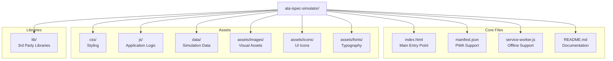

## 2. Detailed File Structure

```plaintext
ata-ispec-simulator/
│
├── index.html                      # Main entry point
├── manifest.json                   # PWA configuration
├── service-worker.js               # Offline support
├── README.md                       # Usage instructions
│
├── css/                            # Styling
│   ├── styles.css                  # Main stylesheet
│   ├── print.css                   # Print-specific styles
│   └── themes/                     # Theme variations
│       ├── light.css               # Light theme
│       └── dark.css                # Dark theme
│
├── js/                             # Application logic
│   ├── simulator.js                # Main application controller
│   ├── config.js                   # Configuration options
│   ├── stages/                     # Stage-specific logic
│   │   ├── stage-manager.js        # Stage navigation controller
│   │   ├── stage-1-ingestion.js    # Document ingestion stage
│   │   ├── stage-2-normalization.js # Content normalization stage
│   │   ├── stage-3-entity.js       # Entity recognition stage
│   │   ├── stage-4-ontology.js     # Ontology alignment stage
│   │   ├── stage-5-validation.js   # Validation & QA stage
│   │   └── stage-6-output.js       # Output generation stage
│   ├── data/                       # Data handling
│   │   ├── data-loader.js          # Data loading utilities
│   │   └── data-processor.js       # Data processing utilities
│   ├── ui/                         # UI components
│   │   ├── ui-controller.js        # UI management
│   │   ├── components/             # Reusable UI components
│   │   └── accessibility.js        # Accessibility enhancements
│   ├── graph/                      # Knowledge graph
│   │   ├── knowledge-graph.js      # Graph visualization
│   │   └── graph-interactions.js   # Graph interaction handlers
│   └── utils/                      # Utility functions
│       ├── export.js               # Export utilities
│       └── helpers.js              # General helper functions
│
├── data/                           # Simulation data
│   ├── document.json               # Sample document structure
│   ├── entities.json               # Entity definitions
│   ├── relationships.json          # Entity relationships
│   ├── ontology.json               # Aerospace ontology
│   ├── validation-rules.json       # Validation rules
│   └── knowledge-graph.json        # Knowledge graph data
│
├── assets/                         # Visual assets
│   ├── images/                     # Images
│   │   ├── illustrations/          # Technical illustrations
│   │   │   ├── hydraulic-system.svg # System schematic
│   │   │   └── component-diagram.svg # Component diagram
│   │   └── screenshots/            # UI screenshots
│   ├── icons/                      # UI icons
│   │   ├── favicon.ico             # Favicon
│   │   ├── logo.svg                # Application logo
│   │   └── stage-icons/            # Stage-specific icons
│   └── fonts/                      # Typography
│       ├── roboto/                 # Roboto font family
│       └── source-code-pro/        # Source Code Pro for code blocks
│
└── lib/                            # 3rd party libraries
    ├── d3.min.js                   # D3.js for visualizations
    ├── pdf-lib.min.js              # PDF generation
    ├── marked.min.js               # Markdown parsing
    └── cytoscape.min.js            # Graph visualization
```

## 3. Key Configuration Options

The `config.js` file contains customizable options that can be modified without changing the core application:

```javascript
// Configuration options for the ATA iSpec 2200 Transformation Simulator
const simulatorConfig = {
  // Content options
  content: {
    includeAllStages: true,           // Include all 6 transformation stages
    includeKnowledgeGraph: true,      // Include knowledge graph visualization
    includeSemanticAnnotations: true, // Include entity highlighting
    includeDocumentation: true,       // Include explanatory content
    defaultStage: 1,                  // Initial stage to display
    exampleDocument: "hydraulic"      // Sample document to use (hydraulic, electrical, etc.)
  },
  
  // Technical options
  technical: {
    offlineSupport: true,             // Enable offline functionality
    responsiveDesign: true,           // Optimize for different screen sizes
    printOptimization: true,          // Include print-specific styles
    accessibilityFeatures: true,      // Enable accessibility enhancements
    preloadAssets: true,              // Preload critical assets
    cacheStrategy: "aggressive"       // Cache strategy (minimal, moderate, aggressive)
  },
  
  // Performance options
  performance: {
    imageQuality: 85,                 // Image quality (50-100)
    minifyCode: true,                 // Use minified code
    lazyLoadImages: true,             // Lazy load non-critical images
    animationLevel: "full"            // Animation level (none, minimal, full)
  },
  
  // Customization
  customization: {
    organizationName: "Aerospace Documentation Division",
    primaryColor: "#0F52BA",          // Primary brand color
    secondaryColor: "#87CEEB",        // Secondary brand color
    logoUrl: "",                      // Custom logo URL
    customCss: "",                    // Additional CSS
    customFooter: ""                  // Custom footer text
  },
  
  // Export options
  export: {
    enablePdfExport: true,            // Enable PDF export
    enableHtmlExport: true,           // Enable HTML snippet export
    enableImageExport: true,          // Enable image export
    enableDataExport: true            // Enable data export
  }
};
```

## 4. Sample Document Data Structure

The `document.json` file contains the structure of the sample ATA iSpec 2200 document:

```json
{
  "documentType": "Aircraft Maintenance Manual",
  "ataChapter": "29",
  "ataSection": "10",
  "ataSubject": "01",
  "title": "Hydraulic Power - Main System - Description and Operation",
  "revision": "24",
  "date": "2023-09-15",
  "effectivity": "ALL",
  "metadata": {
    "documentNumber": "AMM-A320-29-10-01",
    "revisionDate": "2023-09-15",
    "effectivity": "MSN 1000-2000",
    "securityClassification": "Unclassified",
    "exportControl": "ECCN 9E991",
    "copyright": "© Aerospace Manufacturer 2023",
    "language": "en-US",
    "authoringSystem": "XML Editor v5.2",
    "applicability": "A320-200, A320neo"
  },
  "sections": [
    {
      "id": "intro",
      "title": "Introduction",
      "level": 1,
      "content": "This section contains a description of the main hydraulic system and its operation. The hydraulic system supplies hydraulic power for the operation of these aircraft systems: flight control system, landing gear system, nose wheel steering system, and wheel brake system.",
      "children": []
    },
    {
      "id": "description",
      "title": "Description",
      "level": 1,
      "content": "",
      "children": [
        {
          "id": "general",
          "title": "General",
          "level": 2,
          "content": "The hydraulic system operates at a nominal pressure of 20684 kPa (3000 psi) and includes these main components: engine-driven hydraulic pumps (quantity: 2), electric-driven hydraulic pump (quantity: 1), hydraulic reservoirs (quantity: 2), hydraulic filters (quantity: 4), hydraulic accumulators (quantity: 3), pressure relief valves (quantity: 2).",
          "children": []
        },
        {
          "id": "components",
          "title": "Major Components",
          "level": 2,
          "content": "",
          "children": [
            {
              "id": "pumps",
              "title": "Hydraulic Pumps",
              "level": 3,
              "content": "The hydraulic system uses these pumps: engine-driven hydraulic pumps (quantity: 2) - These pumps are the primary source of hydraulic pressure during normal operation; electric-driven hydraulic pump (quantity: 1) - This pump operates as a backup system.",
              "children": []
            },
            {
              "id": "reservoirs",
              "title": "Reservoirs",
              "level": 3,
              "content": "The hydraulic system includes two reservoirs that store hydraulic fluid. Each reservoir supplies hydraulic fluid to its respective hydraulic system.",
              "children": []
            }
          ]
        }
      ]
    }
  ],
  "illustrations": [
    {
      "id": "fig-1",
      "title": "Hydraulic System Schematic",
      "filename": "hydraulic-system.svg",
      "pageNumber": 3
    },
    {
      "id": "fig-2",
      "title": "Hydraulic Pump Installation",
      "filename": "pump-installation.svg",
      "pageNumber": 5
    }
  ],
  "tables": [
    {
      "id": "table-1",
      "title": "System Specifications",
      "data": [
        ["Parameter", "Value", "Unit"],
        ["Operating Pressure", "3000", "psi"],
        ["Maximum Flow Rate", "15", "gpm"],
        ["Reservoir Capacity", "5", "gallons"]
      ],
      "pageNumber": 2
    }
  ]
}
```

## 5. Entity Data Structure

The `entities.json` file contains the extracted entities from the document:

```json
{
  "entities": [
    {
      "id": "sys-1",
      "type": "system",
      "text": "hydraulic system",
      "confidence": 0.98,
      "properties": {
        "ataChapter": "29"
      },
      "occurrences": [
        {"sectionId": "intro", "startOffset": 45, "endOffset": 61},
        {"sectionId": "general", "startOffset": 4, "endOffset": 20}
      ]
    },
    {
      "id": "comp-1",
      "type": "component",
      "text": "engine-driven hydraulic pump",
      "confidence": 0.97,
      "properties": {
        "quantity": 2,
        "partNumber": "HYD-PUMP-001"
      },
      "occurrences": [
        {"sectionId": "general", "startOffset": 108, "endOffset": 136},
        {"sectionId": "pumps", "startOffset": 31, "endOffset": 59}
      ]
    },
    {
      "id": "param-1",
      "type": "parameter",
      "text": "20684 kPa",
      "confidence": 0.99,
      "properties": {
        "unit": "kPa",
        "value": 20684,
        "imperialEquivalent": "3000 psi"
      },
      "occurrences": [
        {"sectionId": "general", "startOffset": 45, "endOffset": 54}
      ]
    }
  ],
  "relationships": [
    {
      "id": "rel-1",
      "type": "part-of",
      "sourceId": "comp-1",
      "targetId": "sys-1",
      "confidence": 0.97
    },
    {
      "id": "rel-2",
      "type": "generates",
      "sourceId": "comp-1",
      "targetId": "param-1",
      "confidence": 0.93
    }
  ]
}
```

## 6. Knowledge Graph Data Structure

The `knowledge-graph.json` file contains the knowledge graph representation:

```json
{
  "nodes": [
    {
      "id": "sys-1",
      "label": "Hydraulic System",
      "type": "system",
      "class": "HydraulicSystem",
      "properties": {
        "ataChapter": "29",
        "operatingPressure": "3000 psi"
      }
    },
    {
      "id": "comp-1",
      "label": "Engine-Driven Hydraulic Pump",
      "type": "component",
      "class": "HydraulicPump",
      "properties": {
        "partNumber": "HYD-PUMP-001",
        "quantity": 2,
        "manufacturer": "Aerospace Components Inc."
      }
    },
    {
      "id": "comp-2",
      "label": "Electric-Driven Hydraulic Pump",
      "type": "component",
      "class": "HydraulicPump",
      "properties": {
        "partNumber": "HYD-PUMP-002",
        "quantity": 1,
        "powerSource": "Electric"
      }
    }
  ],
  "edges": [
    {
      "source": "comp-1",
      "target": "sys-1",
      "label": "partOf",
      "properties": {
        "confidence": 0.97
      }
    },
    {
      "source": "comp-2",
      "target": "sys-1",
      "label": "partOf",
      "properties": {
        "confidence": 0.96
      }
    }
  ],
  "ontologyClasses": [
    {
      "id": "HydraulicSystem",
      "label": "Hydraulic System",
      "superClass": "AircraftSystem",
      "properties": [
        "operatingPressure",
        "fluidType",
        "reservoirCapacity"
      ]
    },
    {
      "id": "HydraulicPump",
      "label": "Hydraulic Pump",
      "superClass": "Component",
      "properties": [
        "flowRate",
        "pressureRating",
        "driveType"
      ]
    }
  ]
}
```

## 7. Usage Instructions (README.md)

```markdown
# ATA iSpec 2200 Transformation Simulator

Interactive visualization of the document transformation process from ATA iSpec 2200 format to semantically enriched, knowledge graph-integrated technical documentation.

## Quick Start

1. Extract the ZIP file to a local directory
2. Open `index.html` in a modern web browser (Chrome, Firefox, Safari, or Edge)
3. Navigate through stages using the stage tabs or next/previous buttons
4. Interact with visualizations to explore the transformation process

## Features

- Interactive visualization of all 6 transformation stages
- Knowledge graph exploration
- Semantic entity highlighting
- Offline functionality
- Print-optimized layout
- Responsive design for desktop and tablet viewing

## System Requirements

- Modern web browser (Chrome, Firefox, Safari, Edge)
- JavaScript enabled
- 1024×768 minimum screen resolution
- 4GB RAM recommended for knowledge graph visualization

## Configuration

The simulator can be configured by editing the `js/config.js` file. See comments in that file for available options.

## Offline Usage

This package includes offline support via a service worker. Once loaded in a browser while online, the simulator will be available offline on subsequent visits.

## Printing

Use your browser's print function (Ctrl+P or Cmd+P) to create a PDF of the current stage. Print-specific styles are included to optimize the output.

## Troubleshooting

If visualizations do not appear:
1. Ensure JavaScript is enabled
2. Try a different browser
3. Check browser console for errors

## License

© 2025 Aerospace Documentation Division. All rights reserved.
```

## 8. Implementation Notes

### 8.1 Browser Compatibility

The package is designed to work with:

- Chrome 90+
- Firefox 88+
- Safari 14+
- Edge 90+


Internet Explorer is not supported.

### 8.2 Accessibility Features

The package includes:

- ARIA attributes for screen reader support
- Keyboard navigation for all interactive elements
- Sufficient color contrast (WCAG AA compliant)
- Text alternatives for all non-text content
- Focus indicators for keyboard users


### 8.3 Performance Optimizations

- Critical CSS inlined in the head
- Deferred loading of non-critical JavaScript
- Image optimization (WebP format with fallbacks)
- Lazy loading of off-screen images
- Minified and compressed assets


### 8.4 Security Considerations

- No external dependencies or CDN links
- All resources loaded from local package
- Content Security Policy implemented
- No sensitive data included in the package


## 9. Would you like to initiate a live configuration session?

If you'd prefer to initiate a live configuration session instead of using this sample manifest, I can guide you through the process of:

1. Selecting specific content options for your use case
2. Customizing the technical parameters
3. Configuring performance settings
4. Adding organization-specific branding
5. Generating a customized package tailored to your requirements
**
