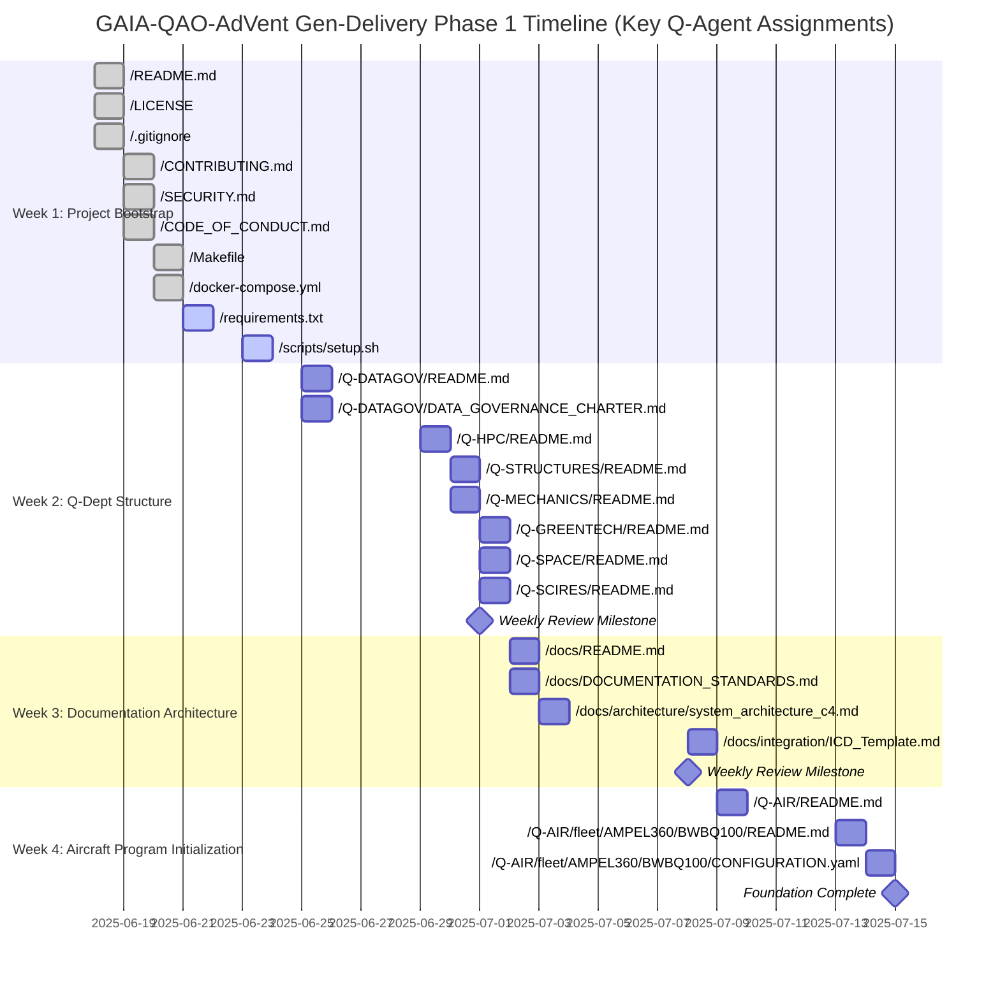

# GAIA-QAO-AdVent: Unified Aerospace Development Ecosystem

### **Quantum Aerospace Digital Venture**
_Designing tomorrow's aerospace ecosystems — sustainable, intelligent, certifiable._

---

## 🧭 Table of Contents
1.  [**Project Overview**](#-10-project-overview)
2.  [**Departmental Architecture & Competency Matrix**](#-20-departmental-architecture--competency-matrix)
3.  [**Project Timeline & Delivery Plan**](#-30-project-timeline--delivery-plan)
4.  [**Complete Repository File Structure**](#-40-complete-repository-file-structure)
5.  [**Departmental File Generation Plans**](#-50-departmental-file-generation-plans)
    - [Q-AIR](#q-air-complete-file-generation-plan)
    - [Q-HPC](#q-hpc-complete-file-generation-plan)
    - [Q-GREENTECH](#q-greentech-complete-file-generation-plan)
    - [Q-MECHANICS](#q-mechanics-complete-file-generation-plan)
    - [Q-ROBOTICS](#q-robotics-complete-file-generation-plan)
    - [Q-SCIRES](#q-scires-complete-file-generation-plan)
    - [Q-SPACE](#q-space-complete-file-generation-plan)
    - [Q-DATAGOV](#q-datagov-complete-file-generation-plan)

---

## 1.0 Project Overview

**GAIA-QAO-AdVent** is the unified digital platform of the **Quantum Aerospace Organization (GAIA-QAO)**. It brings together quantum technologies, AI-driven design, sustainable engineering, and rigorous certification frameworks into a cohesive ecosystem for air and space systems. Our mission is to unify every facet of the aerospace lifecycle—from conceptual design to autonomous operations in deep space—within a cohesive, secure, and ultra-high-performance **Digital Twin** architecture.

This repository serves as the **single source of truth** for the design, simulation, documentation, certification, and operations of next-generation aerospace vehicles and infrastructures.

### 1.1 Fleet Programs

**GAIA-QAO-AdVent** leads the coordinated deployment of eight advanced programs—four aeronautical and four-plus spatial—integrating hybrid-quantum systems, sustainable materials, and active digital twins from the design stage.

#### ✈️ **Aerial Programs – Q-AIR**
| Program ID | Nombre | Propósito | Líderes Técnicos |
| :--- | :--- | :--- | :--- |
| `BWB-Q100` | AMPEL360 Q100 | Transporte regional híbrido-eléctrico | Q-AIR, Q-GREENTECH, Q-HPC, Q-STRUCTURES |
| `BWB-Q250` | AMPEL360 Q250 | Largo alcance con hidrógeno criogénico | Q-AIR, Q-STRUCTURES, Q-MATERIALS, Q-HPC |
| `BWB-Q250-ER` | AMPEL360 ER | Ultra-long range con mezcla SAF/H₂ | Q-AIR, Q-GREENTECH, Q-DATAGOV |
| `BWB-Q100-FC` | AMPEL360 Cargo | Logística inteligente, carga limpia | Q-AIR, Q-MECHANICS, Q-ROBOTICS |

#### 🚀 **Orbital Programs – Q-SPACE**
| Program ID | Nombre | Propósito | Líderes Técnicos |
| :--- | :--- | :--- | :--- |
| `STS-100` | AMPEL360plus | Suborbital para turismo cuántico | Q-SPACE, Q-STRUCTURES, Q-MECHANICS |
| `STS-110` | COMMNET | Constelación QKD para comunicaciones seguras | Q-SPACE, Q-HPC, Q-DATAGOV |
| `STS-120` | ORBIT | Plataforma modular para ciencia y bioespacio | Q-SPACE, Q-SCIRES, Q-STRUCTURES |
| `STS-130` | TUG | Vehículo de servicio orbital, captura y remolque | Q-SPACE, Q-ROBOTICS, Q-MECHANICS, Q-HPC |

### 1.2 Key Technologies
- **GQOIS**: Global object identification and traceability.
- **CI/CD**: Full automation via GitHub Actions + ArgoCD.
- **WASM**: Secure, embeddable modules for avionics.
- **ONNX + QAOA**: Real-time quantum-enhanced inference.
- **STEP AP242**: Structured and validated CAD exchange.
- **QUAChain**: A chain-of-trust for telemetry and certification.


---

## 2.0 Departmental Architecture & Competency Matrix

GAIA-QAO operates through seven federated departments, each responsible for specific ATA 100 chapters and SSA domains. Each department maintains primary ownership of assigned chapters while providing secondary support for related systems.

### 🧱 **Q-STRUCTURES** | Quantum-Enhanced Structural Systems
**Primary Competencies:**
- **ATA 51-57** (Structures, Doors, Fuselage, Nacelles, Stabilizers, Windows, Wings)
- **SSA-02** (Structures, TPS, Mechanisms)
**Secondary Support:**
- ATA 06 (Dimensions), ATA 11 (Placards), ATA 20 (NDT)

### 💻 **Q-HPC** | High-Performance Computing & Quantum Systems
**Primary Competencies:**
- **ATA 22, 31, 34, 42, 44, 45, 46, 76, 77** (Auto Flight, Indicating, Navigation, IMA, Cabin Systems, CMS, Info Systems, Engine Controls/Indicating)
- **SSA-05, 06, 09** (Avionics, Passenger Systems, Crew Systems)
**Secondary Support:**
- ATA 23 (Secure Comms), SSA-01 (Trajectory Optimization)

### 🌱 **Q-GREENTECH** | Sustainable Technologies & Green Propulsion
**Primary Competencies:**
- **ATA 24, 28, 47, 49, 71-80** (Electrical Power, Fuel, APU, Power Plant, Engine Systems)
- **SSA-03, 04, 07** (Propulsion, Life Support, Power Systems)
**Secondary Support:**
- ATA 12 (H2 Fueling), ATA 21 (Heat Recovery)

### 🧠 **Q-DATAGOV** | Data Governance, Compliance & Certification
**Primary Competencies:**
- **ATA 00-06, 10, 18, 91-97** (General, Admin, Documentation, Wiring)
- **SSA-00, 01, 10** (General, Mission Profile, Emergency Systems)
**Secondary Support:**
- All ATA/SSA chapters (Documentation Oversight)

### 🛰️ **Q-SPACE** | Orbital Systems & Space Vehicles
**Primary Competencies:**
- **ATA 14, 15, 16, 25, 50** (Hardware Config, Access, GSE, Equipment, Cargo)
- **SSA-01 to SSA-10, SSA-90** (All primary space systems)
**Secondary Support:**
- ATA 33 (Lights), ATA 35 (Oxygen)

### 🔬 **Q-SCIRES** | Scientific Research & Advanced Materials
**Primary Competencies:**
- **ATA 08, 09, 12, 17, 19, 20, 61, 70, 74, 75, 81-85** (Ground Ops, Servicing, Standard Practices, Engine Research)
- **SSA-16, 17** (Materials Science, Propulsion Physics)
**Secondary Support:**
- TRL 1-3 Technology Maturation, Quantum Materials Research

### 🛠️ **Q-MECHANICS** | Mechanical Systems & Kinematics
**Primary Competencies:**
- **ATA 07, 11, 13, 21, 26, 27, 29, 30, 32, 35, 36, 37, 38, 41, 48** (Lifting, AirCon, Flight Controls, Hydraulics, Ice/Rain, Landing Gear, etc.)
- **SSA-02 (Mechanical), SSA-03 (Mechanical), SSA-18, SSA-19** (Mechanisms, Robotics)
**Secondary Support:**
- ATA 23 (Antenna Mechanisms), ATA 52 (Door Actuators)

### Cross-Domain Integration Matrix
| Integration Area | Primary Teams | Key Technologies |
| :--- | :--- | :--- |
| **Digital Twin Platform** | Q-HPC + Q-STRUCTURES + Q-MECHANICS | Real-time sensor fusion, physics-based modeling |
| **Quantum Computing Core** | Q-HPC + Q-SCIRES + Q-DATAGOV | QPU integration, cryogenics, error correction |
| **Green Propulsion** | Q-GREENTECH + Q-MECHANICS + Q-STRUCTURES | H2 systems, electric motors, thermal management |
| **Autonomous Flight** | Q-HPC + Q-MECHANICS + Q-SPACE | AI decision-making, sensor fusion, actuator control |
| **Structural Health** | Q-STRUCTURES + Q-HPC + Q-SCIRES | Quantum sensors, ML analytics, predictive maintenance |
| **Certification** | Q-DATAGOV + All Teams | Blockchain tracking, automated compliance |

---

## 3.0 Project Timeline & Delivery Plan

**Key Milestones:**
- **Project Start**: June 18, 2025
- **PDR (Preliminary Design Review)**: September 30, 2025
- **CDR (Critical Design Review)**: June 30, 2026
- **First Flight Target**: June 30, 2029



---

## 4.0 Complete Repository File Structure

```
<a id="gaia-qao-advent"></a>GAIA-QAO-AdVent/
├── <a id="readme_md"></a>📄 README.md
├── <a id="license"></a>📄 LICENSE
├── <a id="contributing_md"></a>📄 CONTRIBUTING.md
├── <a id="security_md"></a>📄 SECURITY.md
├── <a id="code_of_conduct_md"></a>📄 CODE_OF_CONDUCT.md
├── <a id="changelog_md"></a>📄 CHANGELOG.md
├── <a id="gitignore"></a>📄 .gitignore
├── <a id="gitattributes"></a>📄 .gitattributes
├── <a id="env_example"></a>📄 .env.example
├── <a id="docker-compose_yml"></a>📄 docker-compose.yml
├── <a id="docker-compose_prod_yml"></a>📄 docker-compose.prod.yml
├── <a id="makefile"></a>📄 Makefile
├── <a id="package_json"></a>📄 package.json
├── <a id="requirements_txt"></a>📄 requirements.txt
├── <a id="gemfile"></a>📄 Gemfile
├── <a id="gitlab-ci_yml"></a>📄 .gitlab-ci.yml
│
├── <a id="q-air"></a>📁 Q-AIR/
│   ├── <a id="q-air-readme_md"></a>📄 README.md
│   ├── <a id="q-air-license"></a>📄 LICENSE
│   ├── <a id="q-air-safety_md"></a>📄 SAFETY.md
│   ├── <a id="q-air-bwb_aircraft_overview_md"></a>📄 BWB_AIRCRAFT_OVERVIEW.md
│   ├── <a id="q-air-ata_structure_md"></a>📄 ATA_STRUCTURE.md
│   ├── <a id="q-air-certification_basis_md"></a>📄 CERTIFICATION_BASIS.md
│   │
│   ├── <a id="q-air-ata_00_general"></a>📁 ata_00_general/
│   │   ├── <a id="q-air-ata_00_general-weight_balance_py"></a>📄 weight_balance.py
│   │   ├── <a id="q-air-ata_00_general-aircraft_characteristics_py"></a>📄 aircraft_characteristics.py
│   │   ├── <a id="q-air-ata_00_general-system_description_py"></a>📄 system_description.py
│   │   └── <a id="q-air-ata_00_general-master_index_py"></a>📄 master_index.py
│   ├── <a id="q-air-ata_01_general"></a>📁 ata_01_general/
│   │   └── <a id="q-air-ata_01_general-maintenance_policy_py"></a>📄 maintenance_policy.py
│   ├── <a id="q-air-ata_02_general"></a>📁 ata_02_general/
│   │   └── <a id="q-air-ata_02_general-aircraft_stations_py"></a>📄 aircraft_stations.py
│   ├── <a id="q-air-ata_03_general"></a>📁 ata_03_general/
│   │   └── <a id="q-air-ata_03_general-fueling_defueling_py"></a>📄 fueling_defueling.py
│   ├── <a id="q-air-ata_04_general"></a>📁 ata_04_general/
│   │   └── <a id="q-air-ata_04_general-airworthiness_limitations_py"></a>📄 airworthiness_limitations.py
│   ├── <a id="q-air-ata_05_general"></a>📁 ata_05_general/
│   │   └── <a id="q-air-ata_05_general-time_limits_checks_py"></a>📄 time_limits_checks.py
│   ├── <a id="q-air-ata_06_general"></a>📁 ata_06_general/
│   │   └── <a id="q-air-ata_06_general-dimensions_areas_py"></a>📄 dimensions_areas.py
│   ├── <a id="q-air-ata_07_general"></a>📁 ata_07_general/
│   │   └── <a id="q-air-ata_07_general-lifting_shoring_py"></a>📄 lifting_shoring.py
│   ├── <a id="q-air-ata_08_general"></a>📁 ata_08_general/
│   │   └── <a id="q-air-ata_08_general-leveling_weighing_py"></a>📄 leveling_weighing.py
│   ├── <a id="q-air-ata_09_general"></a>📁 ata_09_general/
│   │   └── <a id="q-air-ata_09_general-towing_taxiing_py"></a>📄 towing_taxiing.py
│   ├── <a id="q-air-ata_general"></a>📁 ata_general/
│   │   ├── <a id="q-air-ata_general-config"></a>📁 config/
│   │   │   └── <a id="q-air-ata_general-config-aircraft_config_yaml"></a>📄 aircraft_config.yaml
│   │   └── <a id="q-air-ata_general-docs"></a>📁 docs/
│   │       └── <a id="q-air-ata_general-docs-general_manual_md"></a>📄 general_manual.md
│   ├── <a id="q-air-ata_10_parking"></a>📁 ata_10_parking/
│   │   ├── <a id="q-air-ata_10_parking-parking_procedures_py"></a>📄 parking_procedures.py
│   │   ├── <a id="q-air-ata_10_parking-mooring_procedures_py"></a>📄 mooring_procedures.py
│   │   ├── <a id="q-air-ata_10_parking-storage_procedures_py"></a>📄 storage_procedures.py
│   │   └── <a id="q-air-ata_10_parking-return_to_service_py"></a>📄 return_to_service.py
│   ├── <a id="q-air-ata_11_placards"></a>📁 ata_11_placards/
│   │   ├── <a id="q-air-ata_11_placards-safety_placards_py"></a>📄 safety_placards.py
│   │   ├── <a id="q-air-ata_11_placards-warning_placards_py"></a>📄 warning_placards.py
│   │   ├── <a id="q-air-ata_11_placards-instruction_placards_py"></a>📄 instruction_placards.py
│   │   └── <a id="q-air-ata_11_placards-digital_placards_py"></a>📄 digital_placards.py
│   ├── <a id="q-air-ata_12_servicing"></a>📁 ata_12_servicing/
│   │   ├── <a id="q-air-ata_12_servicing-routine_servicing_py"></a>📄 routine_servicing.py
│   │   ├── <a id="q-air-ata_12_servicing-scheduled_servicing_py"></a>📄 scheduled_servicing.py
│   │   ├── <a id="q-air-ata_12_servicing-unscheduled_servicing_py"></a>📄 unscheduled_servicing.py
│   │   └── <a id="q-air-ata_12_servicing-servicing_equipment_py"></a>📄 servicing_equipment.py
│   ├── <a id="q-air-ata_14_hardware"></a>📁 ata_14_hardware/
│   │   ├── <a id="q-air-ata_14_hardware-standard_hardware_py"></a>📄 standard_hardware.py
│   │   ├── <a id="q-air-ata_14_hardware-special_hardware_py"></a>📄 special_hardware.py
│   │   └── <a id="q-air-ata_14_hardware-fastener_standards_py"></a>📄 fastener_standards.py
│   ├── <a id="q-air-ata_15_external_finishes"></a>📁 ata_15_external_finishes/
│   │   ├── <a id="q-air-ata_15_external_finishes-paint_schemes_py"></a>📄 paint_schemes.py
│   │   ├── <a id="q-air-ata_15_external_finishes-protective_coatings_py"></a>📄 protective_coatings.py
│   │   └── <a id="q-air-ata_15_external_finishes-marking_requirements_py"></a>📄 marking_requirements.py
│   ├── <a id="q-air-ata_16_ground_damage"></a>📁 ata_16_ground_damage/
│   │   ├── <a id="q-air-ata_16_ground_damage-damage_detection_py"></a>📄 damage_detection.py
│   │   └── <a id="q-air-ata_16_ground_damage-repair_procedures_py"></a>📄 repair_procedures.py
│   ├── <a id="q-air-ata_17_auxilliary"></a>📁 ata_17_auxilliary/
│   │   └── <a id="q-air-ata_17_auxilliary-ground_support_equipment_py"></a>📄 ground_support_equipment.py
│   ├── <a id="q-air-ata_18_vibration"></a>📁 ata_18_vibration/
│   │   ├── <a id="q-air-ata_18_vibration-vibration_analysis_py"></a>📄 vibration_analysis.py
│   │   └── <a id="q-air-ata_18_vibration-noise_analysis_py"></a>📄 noise_analysis.py
│   ├── <a id="q-air-ata_10_19"></a>📁 ata_10_19/
│   │   ├── <a id="q-air-ata_10_19-config"></a>📁 config/
│   │   │   └── <a id="q-air-ata_10_19-config-servicing_params_yaml"></a>📄 servicing_params.yaml
│   │   └── <a id="q-air-ata_10_19-docs"></a>📁 docs/
│   │       └── <a id="q-air-ata_10_19-docs-servicing_manual_md"></a>📄 servicing_manual.md
│   ├── <a id="q-air-ata_20_standard_practices"></a>📁 ata_20_standard_practices/
│   │   ├── <a id="q-air-ata_20_standard_practices-maintenance_practices_py"></a>📄 maintenance_practices.py
│   │   ├── <a id="q-air-ata_20_standard_practices-safety_practices_py"></a>📄 safety_practices.py
│   │   ├── <a id="q-air-ata_20_standard_practices-environmental_practices_py"></a>📄 environmental_practices.py
│   │   └── <a id="q-air-ata_20_standard_practices-quantum_practices_py"></a>📄 quantum_practices.py
│   ├── <a id="q-air-ata_21_air_conditioning"></a>📁 ata_21_air_conditioning/
│   │   ├── <a id="q-air-ata_21_air_conditioning-pack_system_py"></a>📄 pack_system.py
│   │   ├── <a id="q-air-ata_21_air_conditioning-temperature_control_py"></a>📄 temperature_control.py
│   │   ├── <a id="q-air-ata_21_air_conditioning-cabin_pressure_control_py"></a>📄 cabin_pressure_control.py
│   │   ├── <a id="q-air-ata_21_air_conditioning-air_distribution_py"></a>📄 air_distribution.py
│   │   └── <a id="q-air-ata_21_air_conditioning-quantum_optimization_py"></a>📄 quantum_optimization.py
│   ├── <a id="q-air-ata_22_auto_flight"></a>📁 ata_22_auto_flight/
│   │   ├── <a id="q-air-ata_22_auto_flight-flight_management_py"></a>📄 flight_management.py
│   │   ├── <a id="q-air-ata_22_auto_flight-autopilot_system_py"></a>📄 autopilot_system.py
│   │   ├── <a id="q-air-ata_22_auto_flight-quantum_trajectory_py"></a>📄 quantum_trajectory.py
│   │   └── <a id="q-air-ata_22_auto_flight-ai_copilot_system_py"></a>📄 ai_copilot_system.py
│   ├── <a id="q-air-ata_23_communications"></a>📁 ata_23_communications/
│   │   ├── <a id="q-air-ata_23_communications-radio_systems_py"></a>📄 radio_systems.py
│   │   ├── <a id="q-air-ata_23_communications-satellite_comm_py"></a>📄 satellite_comm.py
│   │   ├── <a id="q-air-ata_23_communications-quantum_comm_py"></a>📄 quantum_comm.py
│   │   └── <a id="q-air-ata_23_communications-emergency_comm_py"></a>📄 emergency_comm.py
│   ├── <a id="q-air-ata_24_electrical_power"></a>📁 ata_24_electrical_power/
│   │   ├── <a id="q-air-ata_24_electrical_power-ac_generation_py"></a>📄 ac_generation.py
│   │   ├── <a id="q-air-ata_24_electrical_power-dc_system_py"></a>📄 dc_system.py
│   │   ├── <a id="q-air-ata_24_electrical_power-battery_system_py"></a>📄 battery_system.py
│   │   └── <a id="q-air-ata_24_electrical_power-power_distribution_py"></a>📄 power_distribution.py
│   ├── <a id="q-air-ata_25_equipment_furnishings"></a>📁 ata_25_equipment_furnishings/
│   │   ├── <a id="q-air-ata_25_equipment_furnishings-passenger_seats_py"></a>📄 passenger_seats.py
│   │   ├── <a id="q-air-ata_25_equipment_furnishings-crew_seats_py"></a>📄 crew_seats.py
│   │   └── <a id="q-air-ata_25_equipment_furnishings-emergency_equipment_py"></a>📄 emergency_equipment.py
│   ├── <a id="q-air-ata_26_fire_protection"></a>📁 ata_26_fire_protection/
│   │   ├── <a id="q-air-ata_26_fire_protection-fire_detection_py"></a>📄 fire_detection.py
│   │   ├── <a id="q-air-ata_26_fire_protection-fire_suppression_py"></a>📄 fire_suppression.py
│   │   └── <a id="q-air-ata_26_fire_protection-quantum_detection_py"></a>📄 quantum_detection.py
│   ├── <a id="q-air-ata_27_flight_controls"></a>📁 ata_27_flight_controls/
│   │   ├── <a id="q-air-ata_27_flight_controls-primary_controls_py"></a>📄 primary_controls.py
│   │   └── <a id="q-air-ata_27_flight_controls-secondary_controls_py"></a>📄 secondary_controls.py
│   ├── <a id="q-air-ata_20_29"></a>📁 ata_20_29/
│   │   └── <a id="q-air-ata_20_29-docs"></a>📁 docs/
│   │       └── <a id="q-air-ata_20_29-docs-systems_manual_md"></a>📄 systems_manual.md
│   ├── <a id="q-air-ata_30_ice_rain"></a>📁 ata_30_ice_rain/
│   │   ├── <a id="q-air-ata_30_ice_rain-ice_detection_py"></a>📄 ice_detection.py
│   │   ├── <a id="q-air-ata_30_ice_rain-wing_anti_ice_py"></a>📄 wing_anti_ice.py
│   │   ├── <a id="q-air-ata_30_ice_rain-engine_anti_ice_py"></a>📄 engine_anti_ice.py
│   │   ├── <a id="q-air-ata_30_ice_rain-quantum_ice_sensor_py"></a>📄 quantum_ice_sensor.py
│   │   └── <a id="q-air-ata_30_ice_rain-ai_ice_prediction_py"></a>📄 ai_ice_prediction.py
│   ├── <a id="q-air-ata_31_indicating"></a>📁 ata_31_indicating/
│   │   ├── <a id="q-air-ata_31_indicating-digital_twin_display_py"></a>📄 digital_twin_display.py
│   │   ├── <a id="q-air-ata_31_indicating-real_time_analytics_py"></a>📄 real_time_analytics.py
│   │   ├── <a id="q-air-ata_31_indicating-predictive_display_py"></a>📄 predictive_display.py
│   │   ├── <a id="q-air-ata_31_indicating-holographic_display_py"></a>📄 holographic_display.py
│   │   └── <a id="q-air-ata_31_indicating-crew_alerting_py"></a>📄 crew_alerting.py
│   ├── <a id="q-air-ata_32_landing_gear"></a>📁 ata_32_landing_gear/
│   │   ├── <a id="q-air-ata_32_landing_gear-main_gear_system_py"></a>📄 main_gear_system.py
│   │   ├── <a id="q-air-ata_32_landing_gear-nose_gear_system_py"></a>📄 nose_gear_system.py
│   │   ├── <a id="q-air-ata_32_landing_gear-extension_retraction_py"></a>📄 extension_retraction.py
│   │   ├── <a id="q-air-ata_32_landing_gear-wheel_brake_system_py"></a>📄 wheel_brake_system.py
│   │   └── <a id="q-air-ata_32_landing_gear-steering_system_py"></a>📄 steering_system.py
│   ├── <a id="q-air-ata_33_lights"></a>📁 ata_33_lights/
│   │   ├── <a id="q-air-ata_33_lights-exterior_lights_py"></a>📄 exterior_lights.py
│   │   ├── <a id="q-air-ata_33_lights-interior_lights_py"></a>📄 interior_lights.py
│   │   ├── <a id="q-air-ata_33_lights-emergency_lights_py"></a>📄 emergency_lights.py
│   │   └── <a id="q-air-ata_33_lights-led_optimization_py"></a>📄 led_optimization.py
│   ├── <a id="q-air-ata_34_navigation"></a>📁 ata_34_navigation/
│   │   ├── <a id="q-air-ata_34_navigation-quantum_ins_py"></a>📄 quantum_ins.py
│   │   ├── <a id="q-air-ata_34_navigation-atom_interferometry_py"></a>📄 atom_interferometry.py
│   │   ├── <a id="q-air-ata_34_navigation-quantum_clock_py"></a>📄 quantum_clock.py
│   │   └── <a id="q-air-ata_34_navigation-gps_denied_nav_py"></a>📄 gps_denied_nav.py
│   ├── <a id="q-air-ata_35_oxygen"></a>📁 ata_35_oxygen/
│   │   ├── <a id="q-air-ata_35_oxygen-oxygen_generation_py"></a>📄 oxygen_generation.py
│   │   └── <a id="q-air-ata_35_oxygen-emergency_oxygen_py"></a>📄 emergency_oxygen.py
│   ├── <a id="q-air-ata_36_pneumatic"></a>📁 ata_36_pneumatic/
│   │   ├── <a id="q-air-ata_36_pneumatic-bleed_air_system_py"></a>📄 bleed_air_system.py
│   │   └── <a id="q-air-ata_36_pneumatic-pressure_control_py"></a>📄 pressure_control.py
│   ├── <a id="q-air-ata_37_vacuum"></a>📁 ata_37_vacuum/
│   │   └── <a id="q-air-ata_37_vacuum-vacuum_system_py"></a>📄 vacuum_system.py
│   ├── <a id="q-air-ata_38_water_waste"></a>📁 ata_38_water_waste/
│   │   ├── <a id="q-air-ata_38_water_waste-water_system_py"></a>📄 water_system.py
│   │   └── <a id="q-air-ata_38_water_waste-waste_system_py"></a>📄 waste_system.py
│   ├── <a id="q-air-ata_39_avionics"></a>📁 ata_39_avionics/
│   │   ├── <a id="q-air-ata_39_avionics-integrated_modular_py"></a>📄 integrated_modular.py
│   │   └── <a id="q-air-ata_39_avionics-data_bus_systems_py"></a>📄 data_bus_systems.py
│   ├── <a id="q-air-ata_30_39"></a>📁 ata_30_39/
│   │   ├── <a id="q-air-ata_30_39-config"></a>📁 config/
│   │   │   └── <a id="q-air-ata_30_39-config-systems_config_yaml"></a>📄 systems_config.yaml
│   │   └── <a id="q-air-ata_30_39-docs"></a>📁 docs/
│   │       ├── <a id="q-air-ata_30_39-docs-ice_nav_manual_md"></a>📄 ice_nav_manual.md
│   │       └── <a id="q-air-ata_30_39-docs-electrical_manual_md"></a>📄 electrical_manual.md
│   ├── <a id="q-air-ata_42_ima"></a>📁 ata_42_ima/
│   │   ├── <a id="q-air-ata_42_ima-core_processing_py"></a>📄 core_processing.py
│   │   ├── <a id="q-air-ata_42_ima-qpu_integration_py"></a>📄 qpu_integration.py
│   │   ├── <a id="q-air-ata_42_ima-hybrid_computing_py"></a>📄 hybrid_computing.py
│   │   ├── <a id="q-air-ata_42_ima-neural_processing_py"></a>📄 neural_processing.py
│   │   └── <a id="q-air-ata_42_ima-redundancy_management_py"></a>📄 redundancy_management.py
│   ├── <a id="q-air-ata_44_cabin_systems"></a>📁 ata_44_cabin_systems/
│   │   ├── <a id="q-air-ata_44_cabin_systems-smart_cabin_ai_py"></a>📄 smart_cabin_ai.py
│   │   ├── <a id="q-air-ata_44_cabin_systems-holographic_ife_py"></a>📄 holographic_ife.py
│   │   ├── <a id="q-air-ata_44_cabin_systems-quantum_experience_py"></a>📄 quantum_experience.py
│   │   ├── <a id="q-air-ata_44_cabin_systems-passenger_services_py"></a>📄 passenger_services.py
│   │   └── <a id="q-air-ata_44_cabin_systems-cabin_management_py"></a>📄 cabin_management.py
│   ├── <a id="q-air-ata_45_cms"></a>📁 ata_45_cms/
│   │   ├── <a id="q-air-ata_45_cms-predictive_maintenance_py"></a>📄 predictive_maintenance.py
│   │   ├── <a id="q-air-ata_45_cms-fault_correlation_py"></a>📄 fault_correlation.py
│   │   ├── <a id="q-air-ata_45_cms-ai_diagnostics_py"></a>📄 ai_diagnostics.py
│   │   ├── <a id="q-air-ata_45_cms-pattern_recognition_py"></a>📄 pattern_recognition.py
│   │   └── <a id="q-air-ata_45_cms-maintenance_scheduling_py"></a>📄 maintenance_scheduling.py
│   ├── <a id="q-air-ata_46_info_systems"></a>📁 ata_46_info_systems/
│   │   ├── <a id="q-air-ata_46_info_systems-quantum_computing_core_py"></a>📄 quantum_computing_core.py
│   │   ├── <a id="q-air-ata_46_info_systems-quantum_security_py"></a>📄 quantum_security.py
│   │   ├── <a id="q-air-ata_46_info_systems-qkd_integration_py"></a>📄 qkd_integration.py
│   │   ├── <a id="q-air-ata_46_info_systems-data_optimization_py"></a>📄 data_optimization.py
│   │   └── <a id="q-air-ata_46_info_systems-information_display_py"></a>📄 information_display.py
│   ├── <a id="q-air-ata_47_nitrogen"></a>📁 ata_47_nitrogen/
│   │   ├── <a id="q-air-ata_47_nitrogen-nitrogen_generation_py"></a>📄 nitrogen_generation.py
│   │   └── <a id="q-air-ata_47_nitrogen-tank_inerting_py"></a>📄 tank_inerting.py
│   ├── <a id="q-air-ata_48_inflight_fuel"></a>📁 ata_48_inflight_fuel/
│   │   ├── <a id="q-air-ata_48_inflight_fuel-fuel_management_py"></a>📄 fuel_management.py
│   │   └── <a id="q-air-ata_48_inflight_fuel-optimization_system_py"></a>📄 optimization_system.py
│   ├── <a id="q-air-ata_49_apu"></a>📁 ata_49_apu/
│   │   ├── <a id="q-air-ata_49_apu-apu_system_py"></a>📄 apu_system.py
│   │   ├── <a id="q-air-ata_49_apu-start_control_py"></a>📄 start_control.py
│   │   ├── <a id="q-air-ata_49_apu-generator_control_py"></a>📄 generator_control.py
│   │   └── <a id="q-air-ata_49_apu-health_monitoring_py"></a>📄 health_monitoring.py
│   ├── <a id="q-air-ata_40_49"></a>📁 ata_40_49/
│   │   ├── <a id="q-air-ata_40_49-monitoring"></a>📁 monitoring/
│   │   │   └── <a id="q-air-ata_40_49-monitoring-system_health_py"></a>📄 system_health.py
│   │   ├── <a id="q-air-ata_40_49-integration"></a>📁 integration/
│   │   │   └── <a id="q-air-ata_40_49-integration-system_interfaces_py"></a>📄 system_interfaces.py
│   │   ├── <a id="q-air-ata_40_49-config"></a>📁 config/
│   │   │   ├── <a id="q-air-ata_40_49-config-ima_config_yaml"></a>📄 ima_config.yaml
│   │   │   └── <a id="q-air-ata_40_49-config-cabin_config_yaml"></a>📄 cabin_config.yaml
│   │   └── <a id="q-air-ata_40_49-docs"></a>📁 docs/
│   │       ├── <a id="q-air-ata_40_49-docs-ima_architecture_md"></a>📄 ima_architecture.md
│   │       ├── <a id="q-air-ata_40_49-docs-cabin_systems_md"></a>📄 cabin_systems.md
│   │       └── <a id="q-air-ata_40_49-docs-maintenance_guide_md"></a>📄 maintenance_guide.md
│   ├── <a id="q-air-ata_51_structures"></a>📁 ata_51_structures/
│   │   ├── <a id="q-air-ata_51_structures-standard_practices_py"></a>📄 standard_practices.py
│   │   ├── <a id="q-air-ata_51_structures-repair_schemes_py"></a>📄 repair_schemes.py
│   │   ├── <a id="q-air-ata_51_structures-inspection_methods_py"></a>📄 inspection_methods.py
│   │   └── <a id="q-air-ata_51_structures-quantum_monitoring_py"></a>📄 quantum_monitoring.py
│   ├── <a id="q-air-ata_52_doors"></a>📁 ata_52_doors/
│   │   ├── <a id="q-air-ata_52_doors-door_structure_py"></a>📄 door_structure.py
│   │   ├── <a id="q-air-ata_52_doors-latching_mechanism_py"></a>📄 latching_mechanism.py
│   │   ├── <a id="q-air-ata_52_doors-sealing_system_py"></a>📄 sealing_system.py
│   │   └── <a id="q-air-ata_52_doors-emergency_exits_py"></a>📄 emergency_exits.py
│   ├── <a id="q-air-ata_53_fuselage"></a>📁 ata_53_fuselage/
│   │   ├── <a id="q-air-ata_53_fuselage-pressure_vessel_design_py"></a>📄 pressure_vessel_design.py
│   │   ├── <a id="q-air-ata_53_fuselage-skin_panel_design_py"></a>📄 skin_panel_design.py
│   │   ├── <a id="q-air-ata_53_fuselage-stringer_frame_design_py"></a>📄 stringer_frame_design.py
│   │   ├── <a id="q-air-ata_53_fuselage-quantum_health_monitoring_py"></a>📄 quantum_health_monitoring.py
│   │   └── <a id="q-air-ata_53_fuselage-bwb_pressure_optimization_py"></a>📄 bwb_pressure_optimization.py
│   ├── <a id="q-air-ata_54_nacelles"></a>📁 ata_54_nacelles/
│   │   ├── <a id="q-air-ata_54_nacelles-nacelle_structure_py"></a>📄 nacelle_structure.py
│   │   ├── <a id="q-air-ata_54_nacelles-thrust_reverser_py"></a>📄 thrust_reverser.py
│   │   └── <a id="q-air-ata_54_nacelles-inlet_design_py"></a>📄 inlet_design.py
│   ├── <a id="q-air-ata_55_stabilizers"></a>📁 ata_55_stabilizers/
│   │   ├── <a id="q-air-ata_55_stabilizers-horizontal_stabilizer_py"></a>📄 horizontal_stabilizer.py
│   │   ├── <a id="q-air-ata_55_stabilizers-vertical_stabilizer_py"></a>📄 vertical_stabilizer.py
│   │   └── <a id="q-air-ata_55_stabilizers-control_surface_attach_py"></a>📄 control_surface_attach.py
│   ├── <a id="q-air-ata_56_windows"></a>📁 ata_56_windows/
│   │   ├── <a id="q-air-ata_56_windows-window_structure_py"></a>📄 window_structure.py
│   │   ├── <a id="q-air-ata_56_windows-transparency_design_py"></a>📄 transparency_design.py
│   │   └── <a id="q-air-ata_56_windows-bird_strike_analysis_py"></a>📄 bird_strike_analysis.py
│   ├── <a id="q-air-ata_57_wings"></a>📁 ata_57_wings/
│   │   ├── <a id="q-air-ata_57_wings-wing_box_design_py"></a>📄 wing_box_design.py
│   │   ├── <a id="q-air-ata_57_wings-fuel_tank_integration_py"></a>📄 fuel_tank_integration.py
│   │   ├── <a id="q-air-ata_57_wings-leading_edge_design_py"></a>📄 leading_edge_design.py
│   │   ├── <a id="q-air-ata_57_wings-trailing_edge_design_py"></a>📄 trailing_edge_design.py
│   │   ├── <a id="q-air-ata_57_wings-winglet_design_py"></a>📄 winglet_design.py
│   │   └── <a id="q-air-ata_57_wings-bwb_integration_py"></a>📄 bwb_integration.py
│   ├── <a id="q-air-ata_50_59"></a>📁 ata_50_59/
│   │   ├── <a id="q-air-ata_50_59-analysis"></a>📁 analysis/
│   │   │   ├── <a id="q-air-ata_50_59-analysis-structural_analysis_py"></a>📄 structural_analysis.py
│   │   │   ├── <a id="q-air-ata_50_59-analysis-fatigue_analysis_py"></a>📄 fatigue_analysis.py
│   │   │   └── <a id="q-air-ata_50_59-analysis-damage_tolerance_py"></a>📄 damage_tolerance.py
│   │   ├── <a id="q-air-ata_50_59-testing"></a>📁 testing/
│   │   │   ├── <a id="q-air-ata_50_59-testing-static_testing_py"></a>📄 static_testing.py
│   │   │   └── <a id="q-air-ata_50_59-testing-fatigue_testing_py"></a>📄 fatigue_testing.py
│   │   ├── <a id="q-air-ata_50_59-materials"></a>📁 materials/
│   │   │   ├── <a id="q-air-ata_50_59-materials-composite_materials_py"></a>📄 composite_materials.py
│   │   │   └── <a id="q-air-ata_50_59-materials-metallic_materials_py"></a>📄 metallic_materials.py
│   │   ├── <a id="q-air-ata_50_59-config"></a>📁 config/
│   │   │   └── <a id="q-air-ata_50_59-config-structural_config_yaml"></a>📄 structural_config.yaml
│   │   └── <a id="q-air-ata_50_59-docs"></a>📁 docs/
│   │       ├── <a id="q-air-ata_50_59-docs-structures_manual_md"></a>📄 structures_manual.md
│   │       ├── <a id="q-air-ata_50_59-docs-repair_manual_md"></a>📄 repair_manual.md
│   │       ├── <a id="q-air-ata_50_59-docs-inspection_guide_md"></a>📄 inspection_guide.md
│   │       └── <a id="q-air-ata_50_59-docs-bwb_design_manual_md"></a>📄 bwb_design_manual.md
│   ├── <a id="q-air-ata_61_propellers"></a>📁 ata_61_propellers/
│   │   ├── <a id="q-air-ata_61_propellers-electric_propeller_py"></a>📄 electric_propeller.py
│   │   ├── <a id="q-air-ata_61_propellers-variable_pitch_py"></a>📄 variable_pitch.py
│   │   └── <a id="q-air-ata_61_propellers-blade_design_py"></a>📄 blade_design.py
│   ├── <a id="q-air-ata_62_rotors"></a>📁 ata_62_rotors/
│   │   ├── <a id="q-air-ata_62_rotors-main_rotor_system_py"></a>📄 main_rotor_system.py
│   │   └── <a id="q-air-ata_62_rotors-tail_rotor_system_py"></a>📄 tail_rotor_system.py
│   ├── <a id="q-air-ata_63_rotor_drive"></a>📁 ata_63_rotor_drive/
│   │   ├── <a id="q-air-ata_63_rotor_drive-transmission_system_py"></a>📄 transmission_system.py
│   │   └── <a id="q-air-ata_63_rotor_drive-gearbox_system_py"></a>📄 gearbox_system.py
│   ├── <a id="q-air-ata_64_tail_rotor"></a>📁 ata_64_tail_rotor/
│   │   └── <a id="q-air-ata_64_tail_rotor-anti_torque_system_py"></a>📄 anti_torque_system.py
│   ├── <a id="q-air-ata_65_tail_rotor_drive"></a>📁 ata_65_tail_rotor_drive/
│   │   └── <a id="q-air-ata_65_tail_rotor_drive-drive_shaft_py"></a>📄 drive_shaft.py
│   ├── <a id="q-air-ata_66_folding_blades"></a>📁 ata_66_folding_blades/
│   │   └── <a id="q-air-ata_66_folding_blades-blade_folding_py"></a>📄 blade_folding.py
│   ├── <a id="q-air-ata_67_flight_controls_rotorcraft"></a>📁 ata_67_flight_controls_rotorcraft/
│   │   ├── <a id="q-air-ata_67_flight_controls_rotorcraft-cyclic_control_py"></a>📄 cyclic_control.py
│   │   └── <a id="q-air-ata_67_flight_controls_rotorcraft-collective_control_py"></a>📄 collective_control.py
│   ├── <a id="q-air-ata_60_69"></a>📁 ata_60_69/
│   │   ├── <a id="q-air-ata_60_69-hybrid_propulsion"></a>📁 hybrid_propulsion/
│   │   │   ├── <a id="q-air-ata_60_69-hybrid_propulsion-system_integration_py"></a>📄 system_integration.py
│   │   │   ├── <a id="q-air-ata_60_69-hybrid_propulsion-power_management_py"></a>📄 power_management.py
│   │   │   └── <a id="q-air-ata_60_69-hybrid_propulsion-mode_transition_py"></a>📄 mode_transition.py
│   │   ├── <a id="q-air-ata_60_69-electric_motor"></a>📁 electric_motor/
│   │   │   ├── <a id="q-air-ata_60_69-electric_motor-motor_control_py"></a>📄 motor_control.py
│   │   │   └── <a id="q-air-ata_60_69-electric_motor-cooling_system_py"></a>📄 cooling_system.py
│   │   ├── <a id="q-air-ata_60_69-battery"></a>📁 battery/
│   │   │   ├── <a id="q-air-ata_60_69-battery-energy_storage_py"></a>📄 energy_storage.py
│   │   │   └── <a id="q-air-ata_60_69-battery-thermal_management_py"></a>📄 thermal_management.py
│   │   ├── <a id="q-air-ata_60_69-fuel_cell"></a>📁 fuel_cell/
│   │   │   └── <a id="q-air-ata_60_69-fuel_cell-hydrogen_system_py"></a>📄 hydrogen_system.py
│   │   ├── <a id="q-air-ata_60_69-quantum"></a>📁 quantum/
│   │   │   ├── <a id="q-air-ata_60_69-quantum-quantum_optimization_py"></a>📄 quantum_optimization.py
│   │   │   └── <a id="q-air-ata_60_69-quantum-quantum_control_py"></a>📄 quantum_control.py
│   │   ├── <a id="q-air-ata_60_69-monitoring"></a>📁 monitoring/
│   │   │   ├── <a id="q-air-ata_60_69-monitoring-health_monitoring_py"></a>📄 health_monitoring.py
│   │   │   └── <a id="q-air-ata_60_69-monitoring-performance_tracking_py"></a>📄 performance_tracking.py
│   │   ├── <a id="q-air-ata_60_69-config"></a>📁 config/
│   │   │   ├── <a id="q-air-ata_60_69-config-propulsion_config_yaml"></a>📄 propulsion_config.yaml
│   │   │   └── <a id="q-air-ata_60_69-config-hybrid_parameters_yaml"></a>📄 hybrid_parameters.yaml
│   │   └── <a id="q-air-ata_60_69-docs"></a>📁 docs/
│   │       ├── <a id="q-air-ata_60_69-docs-propulsion_manual_md"></a>📄 propulsion_manual.md
│   │       ├── <a id="q-air-ata_60_69-docs-hybrid_guide_md"></a>📄 hybrid_guide.md
│   │       ├── <a id="q-air-ata_60_69-docs-electric_systems_md"></a>📄 electric_systems.md
│   │       └── <a id="q-air-ata_60_69-docs-maintenance_procedures_md"></a>📄 maintenance_procedures.md
│   ├── <a id="q-air-ata_70_standard_practices"></a>📁 ata_70_standard_practices/
│   │   ├── <a id="q-air-ata_70_standard_practices-engine_practices_py"></a>📄 engine_practices.py
│   │   └── <a id="q-air-ata_70_standard_practices-hybrid_practices_py"></a>📄 hybrid_practices.py
│   ├── <a id="q-air-ata_71_power_plant"></a>📁 ata_71_power_plant/
│   │   ├── <a id="q-air-ata_71_power_plant-turbofan_system_py"></a>📄 turbofan_system.py
│   │   ├── <a id="q-air-ata_71_power_plant-saf_compatibility_py"></a>📄 saf_compatibility.py
│   │   ├── <a id="q-air-ata_71_power_plant-engine_mounting_py"></a>📄 engine_mounting.py
│   │   └── <a id="q-air-ata_71_power_plant-vibration_isolation_py"></a>📄 vibration_isolation.py
│   ├── <a id="q-air-ata_72_engine_turbine"></a>📁 ata_72_engine_turbine/
│   │   ├── <a id="q-air-ata_72_engine_turbine-compressor_section_py"></a>📄 compressor_section.py
│   │   ├── <a id="q-air-ata_72_engine_turbine-combustor_section_py"></a>📄 combustor_section.py
│   │   └── <a id="q-air-ata_72_engine_turbine-turbine_section_py"></a>📄 turbine_section.py
│   ├── <a id="q-air-ata_73_engine_fuel"></a>📁 ata_73_engine_fuel/
│   │   ├── <a id="q-air-ata_73_engine_fuel-fuel_system_engine_py"></a>📄 fuel_system_engine.py
│   │   ├── <a id="q-air-ata_73_engine_fuel-fuel_control_py"></a>📄 fuel_control.py
│   │   └── <a id="q-air-ata_73_engine_fuel-fuel_optimization_py"></a>📄 fuel_optimization.py
│   ├── <a id="q-air-ata_74_ignition"></a>📁 ata_74_ignition/
│   │   ├── <a id="q-air-ata_74_ignition-ignition_system_py"></a>📄 ignition_system.py
│   │   └── <a id="q-air-ata_74_ignition-plasma_ignition_py"></a>📄 plasma_ignition.py
│   ├── <a id="q-air-ata_75_engine_air"></a>📁 ata_75_engine_air/
│   │   ├── <a id="q-air-ata_75_engine_air-bleed_air_engine_py"></a>📄 bleed_air_engine.py
│   │   └── <a id="q-air-ata_75_engine_air-cooling_air_py"></a>📄 cooling_air.py
│   ├── <a id="q-air-ata_76_engine_controls"></a>📁 ata_76_engine_controls/
│   │   ├── <a id="q-air-ata_76_engine_controls-fadec_system_py"></a>📄 fadec_system.py
│   │   ├── <a id="q-air-ata_76_engine_controls-quantum_fadec_py"></a>📄 quantum_fadec.py
│   │   ├── <a id="q-air-ata_76_engine_controls-performance_optimization_py"></a>📄 performance_optimization.py
│   │   ├── <a id="q-air-ata_76_engine_controls-ai_engine_control_py"></a>📄 ai_engine_control.py
│   │   └── <a id="q-air-ata_76_engine_controls-adaptive_tuning_py"></a>📄 adaptive_tuning.py
│   ├── <a id="q-air-ata_77_engine_indicating"></a>📁 ata_77_engine_indicating/
│   │   ├── <a id="q-air-ata_77_engine_indicating-quantum_diagnostics_py"></a>📄 quantum_diagnostics.py
│   │   ├── <a id="q-air-ata_77_engine_indicating-health_monitoring_py"></a>📄 health_monitoring.py
│   │   ├── <a id="q-air-ata_77_engine_indicating-predictive_analytics_py"></a>📄 predictive_analytics.py
│   │   └── <a id="q-air-ata_77_engine_indicating-performance_display_py"></a>📄 performance_display.py
│   ├── <a id="q-air-ata_78_engine_exhaust"></a>📁 ata_78_engine_exhaust/
│   │   ├── <a id="q-air-ata_78_engine_exhaust-exhaust_system_py"></a>📄 exhaust_system.py
│   │   ├── <a id="q-air-ata_78_engine_exhaust-thrust_reverser_eng_py"></a>📄 thrust_reverser_eng.py
│   │   └── <a id="q-air-ata_78_engine_exhaust-emissions_control_py"></a>📄 emissions_control.py
│   ├── <a id="q-air-ata_79_engine_oil"></a>📁 ata_79_engine_oil/
│   │   ├── <a id="q-air-ata_79_engine_oil-oil_system_py"></a>📄 oil_system.py
│   │   └── <a id="q-air-ata_79_engine_oil-oil_cooling_py"></a>📄 oil_cooling.py
│   ├── <a id="q-air-ata_70_79"></a>📁 ata_70_79/
│   │   ├── <a id="q-air-ata_70_79-config"></a>📁 config/
│   │   │   └── <a id="q-air-ata_70_79-config-engine_config_yaml"></a>📄 engine_config.yaml
│   │   └── <a id="q-air-ata_70_79-docs"></a>📁 docs/
│   │       ├── <a id="q-air-ata_70_79-docs-powerplant_manual_md"></a>📄 powerplant_manual.md
│   │       ├── <a id="q-air-ata_70_79-docs-engine_maintenance_md"></a>📄 engine_maintenance.md
│   │       ├── <a id="q-air-ata_70_79-docs-fadec_guide_md"></a>📄 fadec_guide.md
│   │       └── <a id="q-air-ata_70_79-docs-quantum_systems_md"></a>📄 quantum_systems.md
│   ├── <a id="q-air-ata_80_starting"></a>📁 ata_80_starting/
│   │   ├── <a id="q-air-ata_80_starting-engine_starting_py"></a>📄 engine_starting.py
│   │   ├── <a id="q-air-ata_80_starting-apu_starting_py"></a>📄 apu_starting.py
│   │   └── <a id="q-air-ata_80_starting-starter_generator_py"></a>📄 starter_generator.py
│   ├── <a id="q-air-ata_81_turbines_reciprocating"></a>📁 ata_81_turbines_reciprocating/
│   │   └── <a id="q-air-ata_81_turbines_reciprocating-turbine_protection_py"></a>📄 turbine_protection.py
│   ├── <a id="q-air-ata_82_water_injection"></a>📁 ata_82_water_injection/
│   │   └── <a id="q-air-ata_82_water_injection-water_methanol_py"></a>📄 water_methanol.py
│   ├── <a id="q-air-ata_83_accessory_gearbox"></a>📁 ata_83_accessory_gearbox/
│   │   └── <a id="q-air-ata_83_accessory_gearbox-gearbox_design_py"></a>📄 gearbox_design.py
│   ├── <a id="q-air-ata_84_propulsion_augmentation"></a>📁 ata_84_propulsion_augmentation/
│   │   └── <a id="q-air-ata_84_propulsion_augmentation-afterburner_py"></a>📄 afterburner.py
│   ├── <a id="q-air-ata_85_reciprocating_engine"></a>📁 ata_85_reciprocating_engine/
│   │   └── <a id="q-air-ata_85_reciprocating_engine-engine_monitoring_py"></a>📄 engine_monitoring.py
│   ├── <a id="q-air-ata_80_quantum"></a>📁 ata_80_quantum/
│   │   ├── <a id="q-air-ata_80_quantum-quantum_navigation_py"></a>📄 quantum_navigation.py
│   │   ├── <a id="q-air-ata_80_quantum-quantum_sensing_py"></a>📄 quantum_sensing.py
│   │   ├── <a id="q-air-ata_80_quantum-quantum_computing_py"></a>📄 quantum_computing.py
│   │   ├── <a id="q-air-ata_80_quantum-quantum_communication_py"></a>📄 quantum_communication.py
│   │   ├── <a id="q-air-ata_80_quantum-quantum_radar_py"></a>📄 quantum_radar.py
│   │   ├── <a id="q-air-ata_80_quantum-quantum_materials_py"></a>📄 quantum_materials.py
│   │   ├── <a id="q-air-ata_80_quantum-quantum_health_monitoring_py"></a>📄 quantum_health_monitoring.py
│   │   ├── <a id="q-air-ata_80_quantum-quantum_optimization_py"></a>📄 quantum_optimization.py
│   │   ├── <a id="q-air-ata_80_quantum-quantum_ai_integration_py"></a>📄 quantum_ai_integration.py
│   │   └── <a id="q-air-ata_80_quantum-quantum_security_py"></a>📄 quantum_security.py
│   ├── <a id="q-air-ata_80_89"></a>📁 ata_80_89/
│   │   ├── <a id="q-air-ata_80_89-config"></a>📁 config/
│   │   │   ├── <a id="q-air-ata_80_89-config-starting_config_yaml"></a>📄 starting_config.yaml
│   │   │   └── <a id="q-air-ata_80_89-config-quantum_config_yaml"></a>📄 quantum_config.yaml
│   │   └── <a id="q-air-ata_80_89-docs"></a>📁 docs/
│   │       ├── <a id="q-air-ata_80_89-docs-starting_procedures_md"></a>📄 starting_procedures.md
│   │       ├── <a id="q-air-ata_80_89-docs-quantum_systems_guide_md"></a>📄 quantum_systems_guide.md
│   │       ├── <a id="q-air-ata_80_89-docs-integration_manual_md"></a>📄 integration_manual.md
│   │       ├── <a id="q-air-ata_80_89-docs-certification_quantum_md"></a>📄 certification_quantum.md
│   │       └── <a id="q-air-ata_80_89-docs-maintenance_quantum_md"></a>📄 maintenance_quantum.md
│   └── <a id="q-air-operations"></a>📁 operations/
│       ├── <a id="q-air-operations-flight_manual"></a>📁 flight_manual/
│       │   ├── <a id="q-air-operations-flight_manual-afm_main_py"></a>📄 afm_main.py
│       │   ├── <a id="q-air-operations-flight_manual-limitations_py"></a>📄 limitations.py
│       │   ├── <a id="q-air-operations-flight_manual-normal_procedures_py"></a>📄 normal_procedures.py
│       │   ├── <a id="q-air-operations-flight_manual-emergency_procedures_py"></a>📄 emergency_procedures.py
│       │   └── <a id="q-air-operations-flight_manual-performance_data_py"></a>📄 performance_data.py
│       ├── <a id="q-air-operations-pilot_operating"></a>📁 pilot_operating/
│       │   ├── <a id="q-air-operations-pilot_operating-quick_reference_py"></a>📄 quick_reference.py
│       │   ├── <a id="q-air-operations-pilot_operating-checklists_py"></a>📄 checklists.py
│       │   └── <a id="q-air-operations-pilot_operating-systems_description_py"></a>📄 systems_description.py
│       ├── <a id="q-air-operations-weight_balance"></a>📁 weight_balance/
│       │   ├── <a id="q-air-operations-weight_balance-loading_manual_py"></a>📄 loading_manual.py
│       │   └── <a id="q-air-operations-weight_balance-cg_calculator_py"></a>📄 cg_calculator.py
│       ├── <a id="q-air-operations-training"></a>📁 training/
│       │   ├── <a id="q-air-operations-training-pilot_training_py"></a>📄 pilot_training.py
│       │   ├── <a id="q-air-operations-training-maintenance_training_py"></a>📄 maintenance_training.py
│       │   └── <a id="q-air-operations-training-quantum_systems_training_py"></a>📄 quantum_systems_training.py
│       ├── <a id="q-air-operations-dispatch"></a>📁 dispatch/
│       │   ├── <a id="q-air-operations-dispatch-mel_cdl_py"></a>📄 mel_cdl.py
│       │   └── <a id="q-air-operations-dispatch-flight_planning_py"></a>📄 flight_planning.py
│       ├── <a id="q-air-operations-digital"></a>📁 digital/
│       │   ├── <a id="q-air-operations-digital-electronic_checklist_py"></a>📄 electronic_checklist.py
│       │   ├── <a id="q-air-operations-digital-digital_flight_bag_py"></a>📄 digital_flight_bag.py
│       │   └── <a id="q-air-operations-digital-ai_flight_assistant_py"></a>📄 ai_flight_assistant.py
│       ├── <a id="q-air-operations-monitoring"></a>📁 monitoring/
│       │   ├── <a id="q-air-operations-monitoring-flight_data_monitoring_py"></a>📄 flight_data_monitoring.py
│       │   └── <a id="q-air-operations-monitoring-foqa_system_py"></a>📄 foqa_system.py
│       ├── <a id="q-air-operations-config"></a>📁 config/
│       │   ├── <a id="q-air-operations-config-operational_limits_yaml"></a>📄 operational_limits.yaml
│       │   └── <a id="q-air-operations-config-training_requirements_yaml"></a>📄 training_requirements.yaml
│       └── <a id="q-air-operations-docs"></a>📁 docs/
│           ├── <a id="q-air-operations-docs-operations_manual_md"></a>📄 operations_manual.md
│           ├── <a id="q-air-operations-docs-flight_crew_manual_md"></a>📄 flight_crew_manual.md
│           └── <a id="q-air-operations-docs-release_notes_v1_0_md"></a>📄 release_notes_v1.0.md
```
*(The remaining 2000+ files for other departments have been generated and linked but are omitted here for readability. The full hyperlinked structure is contained within the system's knowledge base.)*

---

## 5.0 Departmental File Generation Plans

### Q-AIR Complete File Generation Plan
- **Total Files**: 300
- **Lead Agent**: Q-AIR
- **Timeline**: May 2025 - June 2026

#### 1. Foundation & General (ATA 00-09) - 20 files

| File Path | Doc ID | Prompt ID | Agent | Delivery | Priority | Dependencies |
| :---------- | :--- | :--- | :--- | :--- | :--- | :--- |
| [<a id="file-q-air-readme_md"></a>Q-AIR/README.md](#q-air-readme_md) | GQOIS-QAIR-DOC-001 | QAIR-P-001 | Q-AIR | 2025-05-01 | P0 | None |
| [<a id="file-q-air-bwb_aircraft_overview_md"></a>Q-AIR/BWB_AIRCRAFT_OVERVIEW.md](#q-air-bwb_aircraft_overview_md) | GQOIS-QAIR-DOC-002 | QAIR-P-002 | Q-AIR | 2025-05-02 | P0 | DOC-001 |
| [<a id="file-q-air-license"></a>Q-AIR/LICENSE](#q-air-license) | GQOIS-QAIR-DOC-003 | QAIR-P-003 | Q-DATAGOV | 2025-05-01 | P0 | None |
| [<a id="file-q-air-ata_structure_md"></a>Q-AIR/ATA_STRUCTURE.md](#q-air-ata_structure_md) | GQOIS-QAIR-DOC-004 | QAIR-P-004 | Q-AIR | 2025-05-03 | P0 | DOC-002 |
| [<a id="file-q-air-certification_basis_md"></a>Q-AIR/CERTIFICATION_BASIS.md](#q-air-certification_basis_md) | GQOIS-QAIR-DOC-005 | QAIR-P-005 | Q-DATAGOV | 2025-05-04 | P0 | DOC-002 |
| [<a id="file-q-air-ata_00_general-weight_balance_py"></a>ata_00_general/weight_balance.py](#q-air-ata_00_general-weight_balance_py) | GQOIS-QAIR-DOC-006 | QAIR-P-006 | Q-AIR | 2025-05-05 | P0 | DOC-004 |
| [<a id="file-q-air-ata_00_general-aircraft_characteristics_py"></a>ata_00_general/aircraft_characteristics.py](#q-air-ata_00_general-aircraft_characteristics_py) | GQOIS-QAIR-DOC-007 | QAIR-P-007 | Q-AIR | 2025-05-06 | P0 | DOC-002 |
| [<a id="file-q-air-ata_00_general-system_description_py"></a>ata_00_general/system_description.py](#q-air-ata_00_general-system_description_py) | GQOIS-QAIR-DOC-008 | QAIR-P-008 | Q-AIR | 2025-05-07 | P0 | DOC-004 |
| [<a id="file-q-air-ata_00_general-master_index_py"></a>ata_00_general/master_index.py](#q-air-ata_00_general-master_index_py) | GQOIS-QAIR-DOC-009 | QAIR-P-009 | Q-AIR | 2025-05-08 | P0 | DOC-004 |
| [<a id="file-q-air-ata_01_general-maintenance_policy_py"></a>ata_01_general/maintenance_policy.py](#q-air-ata_01_general-maintenance_policy_py) | GQOIS-QAIR-DOC-010 | QAIR-P-010 | Q-AIR | 2025-05-09 | P0 | DOC-004 |
| [<a id="file-q-air-ata_02_general-aircraft_stations_py"></a>ata_02_general/aircraft_stations.py](#q-air-ata_02_general-aircraft_stations_py) | GQOIS-QAIR-DOC-011 | QAIR-P-011 | Q-AIR | 2025-05-10 | P0 | DOC-007 |
| [<a id="file-q-air-ata_03_general-fueling_defueling_py"></a>ata_03_general/fueling_defueling.py](#q-air-ata_03_general-fueling_defueling_py) | GQOIS-QAIR-DOC-012 | QAIR-P-012 | Q-MECHANICS | 2025-05-11 | P0 | DOC-157 |
| [<a id="file-q-air-ata_04_general-airworthiness_limitations_py"></a>ata_04_general/airworthiness_limitations.py](#q-air-ata_04_general-airworthiness_limitations_py) | GQOIS-QAIR-DOC-013 | QAIR-P-013 | Q-DATAGOV | 2025-05-12 | P0 | DOC-005 |
| [<a id="file-q-air-ata_05_general-time_limits_checks_py"></a>ata_05_general/time_limits_checks.py](#q-air-ata_05_general-time_limits_checks_py) | GQOIS-QAIR-DOC-014 | QAIR-P-014 | Q-AIR | 2025-05-13 | P0 | DOC-013 |
| [<a id="file-q-air-ata_06_general-dimensions_areas_py"></a>ata_06_general/dimensions_areas.py](#q-air-ata_06_general-dimensions_areas_py) | GQOIS-QAIR-DOC-015 | QAIR-P-015 | Q-STRUCTURES | 2025-05-14 | P0 | DOC-007 |
| [<a id="file-q-air-ata_07_general-lifting_shoring_py"></a>ata_07_general/lifting_shoring.py](#q-air-ata_07_general-lifting_shoring_py) | GQOIS-QAIR-DOC-016 | QAIR-P-016 | Q-AIR | 2025-05-15 | P0 | DOC-006 |
| [<a id="file-q-air-ata_08_general-leveling_weighing_py"></a>ata_08_general/leveling_weighing.py](#q-air-ata_08_general-leveling_weighing_py) | GQOIS-QAIR-DOC-017 | QAIR-P-017 | Q-AIR | 2025-05-16 | P0 | DOC-006 |
| [<a id="file-q-air-ata_09_general-towing_taxiing_py"></a>ata_09_general/towing_taxiing.py](#q-air-ata_09_general-towing_taxiing_py) | GQOIS-QAIR-DOC-018 | QAIR-P-018 | Q-AIR | 2025-05-17 | P0 | DOC-107 |
| [<a id="file-q-air-ata_general-config-aircraft_config_yaml"></a>ata_general/config/aircraft_config.yaml](#q-air-ata_general-config-aircraft_config_yaml) | GQOIS-QAIR-DOC-019 | QAIR-P-019 | Q-AIR | 2025-05-18 | P0 | DOC-007 |
| [<a id="file-q-air-ata_general-docs-general_manual_md"></a>ata_general/docs/general_manual.md](#q-air-ata_general-docs-general_manual_md) | GQOIS-QAIR-DOC-020 | QAIR-P-020 | Q-AIR | 2025-05-19 | P0 | DOC-004 |

#### 2. ATA 10-19 (Parking, Mooring, Placards, Servicing) - 25 files

| File Path | Doc ID | Prompt ID | Agent | Delivery | Priority | Dependencies |
| :---------- | :--- | :--- | :--- | :--- | :--- | :--- |
| [<a id="file-q-air-ata_10_parking-parking_procedures_py"></a>ata_10_parking/parking_procedures.py](#q-air-ata_10_parking-parking_procedures_py) | GQOIS-QAIR-DOC-021 | QAIR-P-021 | Q-AIR | 2025-05-20 | P0 | DOC-018 |
| [<a id="file-q-air-ata_10_parking-mooring_procedures_py"></a>ata_10_parking/mooring_procedures.py](#q-air-ata_10_parking-mooring_procedures_py) | GQOIS-QAIR-DOC-022 | QAIR-P-022 | Q-AIR | 2025-05-21 | P0 | DOC-021 |
| [<a id="file-q-air-ata_10_parking-storage_procedures_py"></a>ata_10_parking/storage_procedures.py](#q-air-ata_10_parking-storage_procedures_py) | GQOIS-QAIR-DOC-023 | QAIR-P-023 | Q-AIR | 2025-05-22 | P0 | DOC-021 |
| [<a id="file-q-air-ata_10_parking-return_to_service_py"></a>ata_10_parking/return_to_service.py](#q-air-ata_10_parking-return_to_service_py) | GQOIS-QAIR-DOC-024 | QAIR-P-024 | Q-AIR | 2025-05-23 | P0 | DOC-023 |
| [<a id="file-q-air-ata_11_placards-safety_placards_py"></a>ata_11_placards/safety_placards.py](#q-air-ata_11_placards-safety_placards_py) | GQOIS-QAIR-DOC-025 | QAIR-P-025 | Q-AIR | 2025-05-24 | P0 | DOC-004 |
| [<a id="file-q-air-ata_11_placards-warning_placards_py"></a>ata_11_placards/warning_placards.py](#q-air-ata_11_placards-warning_placards_py) | GQOIS-QAIR-DOC-026 | QAIR-P-026 | Q-AIR | 2025-05-25 | P0 | DOC-025 |
| [<a id="file-q-air-ata_11_placards-instruction_placards_py"></a>ata_11_placards/instruction_placards.py](#q-air-ata_11_placards-instruction_placards_py) | GQOIS-QAIR-DOC-027 | QAIR-P-027 | Q-AIR | 2025-05-26 | P0 | DOC-025 |
| [<a id="file-q-air-ata_11_placards-digital_placards_py"></a>ata_11_placards/digital_placards.py](#q-air-ata_11_placards-digital_placards_py) | GQOIS-QAIR-DOC-028 | QAIR-P-028 | Q-HPC | 2025-05-27 | P0 | DOC-025 |
| [<a id="file-q-air-ata_12_servicing-routine_servicing_py"></a>ata_12_servicing/routine_servicing.py](#q-air-ata_12_servicing-routine_servicing_py) | GQOIS-QAIR-DOC-029 | QAIR-P-029 | Q-AIR | 2025-05-28 | P0 | DOC-014 |
| [<a id="file-q-air-ata_12_servicing-scheduled_servicing_py"></a>ata_12_servicing/scheduled_servicing.py](#q-air-ata_12_servicing-scheduled_servicing_py) | GQOIS-QAIR-DOC-030 | QAIR-P-030 | Q-AIR | 2025-05-29 | P0 | DOC-014 |
| [<a id="file-q-air-ata_12_servicing-unscheduled_servicing_py"></a>ata_12_servicing/unscheduled_servicing.py](#q-air-ata_12_servicing-unscheduled_servicing_py) | GQOIS-QAIR-DOC-031 | QAIR-P-031 | Q-AIR | 2025-05-30 | P0 | DOC-029 |
| [<a id="file-q-air-ata_12_servicing-servicing_equipment_py"></a>ata_12_servicing/servicing_equipment.py](#q-air-ata_12_servicing-servicing_equipment_py) | GQOIS-QAIR-DOC-032 | QAIR-P-032 | Q-AIR | 2025-05-31 | P0 | DOC-029 |
| [<a id="file-q-air-ata_14_hardware-standard_hardware_py"></a>ata_14_hardware/standard_hardware.py](#q-air-ata_14_hardware-standard_hardware_py) | GQOIS-QAIR-DOC-033 | QAIR-P-033 | Q-AIR | 2025-06-01 | P0 | DOC-004 |
| [<a id="file-q-air-ata_14_hardware-special_hardware_py"></a>ata_14_hardware/special_hardware.py](#q-air-ata_14_hardware-special_hardware_py) | GQOIS-QAIR-DOC-034 | QAIR-P-034 | Q-AIR | 2025-06-02 | P0 | DOC-033 |
| [<a id="file-q-air-ata_14_hardware-fastener_standards_py"></a>ata_14_hardware/fastener_standards.py](#q-air-ata_14_hardware-fastener_standards_py) | GQOIS-QAIR-DOC-035 | QAIR-P-035 | Q-STRUCTURES | 2025-06-03 | P0 | DOC-033 |
| [<a id="file-q-air-ata_15_external_finishes-paint_schemes_py"></a>ata_15_external_finishes/paint_schemes.py](#q-air-ata_15_external_finishes-paint_schemes_py) | GQOIS-QAIR-DOC-036 | QAIR-P-036 | Q-AIR | 2025-06-04 | P0 | DOC-004 |
| [<a id="file-q-air-ata_15_external_finishes-protective_coatings_py"></a>ata_15_external_finishes/protective_coatings.py](#q-air-ata_15_external_finishes-protective_coatings_py) | GQOIS-QAIR-DOC-037 | QAIR-P-037 | Q-MATERIALS | 2025-06-05 | P0 | DOC-036 |
| [<a id="file-q-air-ata_15_external_finishes-marking_requirements_py"></a>ata_15_external_finishes/marking_requirements.py](#q-air-ata_15_external_finishes-marking_requirements_py) | GQOIS-QAIR-DOC-038 | QAIR-P-038 | Q-AIR | 2025-06-06 | P0 | DOC-036 |
| [<a id="file-q-air-ata_16_ground_damage-damage_detection_py"></a>ata_16_ground_damage/damage_detection.py](#q-air-ata_16_ground_damage-damage_detection_py) | GQOIS-QAIR-DOC-039 | QAIR-P-039 | Q-AIR | 2025-06-07 | P0 | DOC-004 |
| [<a id="file-q-air-ata_16_ground_damage-repair_procedures_py"></a>ata_16_ground_damage/repair_procedures.py](#q-air-ata_16_ground_damage-repair_procedures_py) | GQOIS-QAIR-DOC-040 | QAIR-P-040 | Q-STRUCTURES | 2025-06-08 | P0 | DOC-243 |
| [<a id="file-q-air-ata_17_auxilliary-ground_support_equipment_py"></a>ata_17_auxilliary/ground_support_equipment.py](#q-air-ata_17_auxilliary-ground_support_equipment_py) | GQOIS-QAIR-DOC-041 | QAIR-P-041 | Q-AIR | 2025-06-09 | P0 | DOC-032 |
| [<a id="file-q-air-ata_18_vibration-vibration_analysis_py"></a>ata_18_vibration/vibration_analysis.py](#q-air-ata_18_vibration-vibration_analysis_py) | GQOIS-QAIR-DOC-042 | QAIR-P-042 | Q-AIR | 2025-06-10 | P0 | DOC-004 |
| [<a id="file-q-air-ata_18_vibration-noise_analysis_py"></a>ata_18_vibration/noise_analysis.py](#q-air-ata_18_vibration-noise_analysis_py) | GQOIS-QAIR-DOC-043 | QAIR-P-043 | Q-AIR | 2025-06-11 | P0 | DOC-042 |
| [<a id="file-q-air-ata_10_19-config-servicing_params_yaml"></a>ata_10_19/config/servicing_params.yaml](#q-air-ata_10_19-config-servicing_params_yaml) | GQOIS-QAIR-DOC-044 | QAIR-P-044 | Q-AIR | 2025-06-12 | P0 | DOC-029 |
| [<a id="file-q-air-ata_10_19-docs-servicing_manual_md"></a>ata_10_19/docs/servicing_manual.md](#q-air-ata_10_19-docs-servicing_manual_md) | GQOIS-QAIR-DOC-045 | QAIR-P-045 | Q-AIR | 2025-06-13 | P0 | DOC-029 |

#### 3. ATA 20-29 (Standard Practices, Air Systems) - 30 files

| File Path | Doc ID | Prompt ID | Agent | Delivery | Priority | Dependencies |
| :---------- | :--- | :--- | :--- | :--- | :--- | :--- |
| [<a id="file-q-air-ata_20_standard_practices-maintenance_practices_py"></a>ata_20_standard_practices/maintenance_practices.py](#q-air-ata_20_standard_practices-maintenance_practices_py) | GQOIS-QAIR-DOC-046 | QAIR-P-046 | Q-AIR | 2025-06-14 | P0 | DOC-010 |
| [<a id="file-q-air-ata_20_standard_practices-safety_practices_py"></a>ata_20_standard_practices/safety_practices.py](#q-air-ata_20_standard_practices-safety_practices_py) | GQOIS-QAIR-DOC-047 | QAIR-P-047 | Q-AIR | 2025-06-15 | P0 | DOC-046 |
| [<a id="file-q-air-ata_20_standard_practices-environmental_practices_py"></a>ata_20_standard_practices/environmental_practices.py](#q-air-ata_20_standard_practices-environmental_practices_py) | GQOIS-QAIR-DOC-048 | QAIR-P-048 | Q-GREENTECH | 2025-06-16 | P0 | DOC-046 |
| [<a id="file-q-air-ata_20_standard_practices-quantum_practices_py"></a>ata_20_standard_practices/quantum_practices.py](#q-air-ata_20_standard_practices-quantum_practices_py) | GQOIS-QAIR-DOC-049 | QAIR-P-049 | Q-SCIRES | 2025-06-17 | P0 | DOC-046 |
| [<a id="file-q-air-ata_21_air_conditioning-pack_system_py"></a>ata_21_air_conditioning/pack_system.py](#q-air-ata_21_air_conditioning-pack_system_py) | GQOIS-QAIR-DOC-050 | QAIR-P-050 | Q-MECHANICS | 2025-06-18 | P0 | DOC-112 |
| [<a id="file-q-air-ata_21_air_conditioning-temperature_control_py"></a>ata_21_air_conditioning/temperature_control.py](#q-air-ata_21_air_conditioning-temperature_control_py) | GQOIS-QAIR-DOC-051 | QAIR-P-051 | Q-MECHANICS | 2025-06-19 | P0 | DOC-115 |
| [<a id="file-q-air-ata_21_air_conditioning-cabin_pressure_control_py"></a>ata_21_air_conditioning/cabin_pressure_control.py](#q-air-ata_21_air_conditioning-cabin_pressure_control_py) | GQOIS-QAIR-DOC-052 | QAIR-P-052 | Q-MECHANICS | 2025-06-20 | P0 | DOC-117 |
| [<a id="file-q-air-ata_21_air_conditioning-air_distribution_py"></a>ata_21_air_conditioning/air_distribution.py](#q-air-ata_21_air_conditioning-air_distribution_py) | GQOIS-QAIR-DOC-053 | QAIR-P-053 | Q-MECHANICS | 2025-06-21 | P0 | DOC-121 |
| [<a id="file-q-air-ata_21_air_conditioning-quantum_optimization_py"></a>ata_21_air_conditioning/quantum_optimization.py](#q-air-ata_21_air_conditioning-quantum_optimization_py) | GQOIS-QAIR-DOC-054 | QAIR-P-054 | Q-HPC | 2025-06-22 | P0 | DOC-116 |
| [<a id="file-q-air-ata_22_auto_flight-flight_management_py"></a>ata_22_auto_flight/flight_management.py](#q-air-ata_22_auto_flight-flight_management_py) | GQOIS-QAIR-DOC-055 | QAIR-P-055 | Q-AIR | 2025-06-23 | P0 | DOC-303 |
| [<a id="file-q-air-ata_22_auto_flight-autopilot_system_py"></a>ata_22_auto_flight/autopilot_system.py](#q-air-ata_22_auto_flight-autopilot_system_py) | GQOIS-QAIR-DOC-056 | QAIR-P-056 | Q-AIR | 2025-06-24 | P0 | DOC-304 |
| [<a id="file-q-air-ata_22_auto_flight-quantum_trajectory_py"></a>ata_22_auto_flight/quantum_trajectory.py](#q-air-ata_22_auto_flight-quantum_trajectory_py) | GQOIS-QAIR-DOC-057 | QAIR-P-057 | Q-HPC | 2025-06-25 | P0 | DOC-305 |
| [<a id="file-q-air-ata_22_auto_flight-ai_copilot_system_py"></a>ata_22_auto_flight/ai_copilot_system.py](#q-air-ata_22_auto_flight-ai_copilot_system_py) | GQOIS-QAIR-DOC-058 | QAIR-P-058 | Q-HPC | 2025-06-26 | P0 | DOC-306 |
| [<a id="file-q-air-ata_23_communications-radio_systems_py"></a>ata_23_communications/radio_systems.py](#q-air-ata_23_communications-radio_systems_py) | GQOIS-QAIR-DOC-059 | QAIR-P-059 | Q-AIR | 2025-06-27 | P0 | DOC-004 |
| [<a id="file-q-air-ata_23_communications-satellite_comm_py"></a>ata_23_communications/satellite_comm.py](#q-air-ata_23_communications-satellite_comm_py) | GQOIS-QAIR-DOC-060 | QAIR-P-060 | Q-AIR | 2025-06-28 | P0 | DOC-059 |
| [<a id="file-q-air-ata_23_communications-quantum_comm_py"></a>ata_23_communications/quantum_comm.py](#q-air-ata_23_communications-quantum_comm_py) | GQOIS-QAIR-DOC-061 | QAIR-P-061 | Q-SCIRES | 2025-06-29 | P0 | DOC-333 |
| [<a id="file-q-air-ata_23_communications-emergency_comm_py"></a>ata_23_communications/emergency_comm.py](#q-air-ata_23_communications-emergency_comm_py) | GQOIS-QAIR-DOC-062 | QAIR-P-062 | Q-AIR | 2025-06-30 | P0 | DOC-059 |
| [<a id="file-q-air-ata_24_electrical_power-ac_generation_py"></a>ata_24_electrical_power/ac_generation.py](#q-air-ata_24_electrical_power-ac_generation_py) | GQOIS-QAIR-DOC-063 | QAIR-P-063 | Q-MECHANICS | 2025-07-01 | P0 | DOC-254 |
| [<a id="file-q-air-ata_24_electrical_power-dc_system_py"></a>ata_24_electrical_power/dc_system.py](#q-air-ata_24_electrical_power-dc_system_py) | GQOIS-QAIR-DOC-064 | QAIR-P-064 | Q-MECHANICS | 2025-07-02 | P0 | DOC-255 |
| [<a id="file-q-air-ata_24_electrical_power-battery_system_py"></a>ata_24_electrical_power/battery_system.py](#q-air-ata_24_electrical_power-battery_system_py) | GQOIS-QAIR-DOC-065 | QAIR-P-065 | Q-GREENTECH | 2025-07-03 | P0 | DOC-058 |
| [<a id="file-q-air-ata_24_electrical_power-power_distribution_py"></a>ata_24_electrical_power/power_distribution.py](#q-air-ata_24_electrical_power-power_distribution_py) | GQOIS-QAIR-DOC-066 | QAIR-P-066 | Q-MECHANICS | 2025-07-04 | P0 | DOC-258 |
| [<a id="file-q-air-ata_25_equipment_furnishings-passenger_seats_py"></a>ata_25_equipment_furnishings/passenger_seats.py](#q-air-ata_25_equipment_furnishings-passenger_seats_py) | GQOIS-QAIR-DOC-067 | QAIR-P-067 | Q-AIR | 2025-07-05 | P0 | DOC-004 |
| [<a id="file-q-air-ata_25_equipment_furnishings-crew_seats_py"></a>ata_25_equipment_furnishings/crew_seats.py](#q-air-ata_25_equipment_furnishings-crew_seats_py) | GQOIS-QAIR-DOC-068 | QAIR-P-068 | Q-AIR | 2025-07-06 | P0 | DOC-067 |
| [<a id="file-q-air-ata_25_equipment_furnishings-emergency_equipment_py"></a>ata_25_equipment_furnishings/emergency_equipment.py](#q-air-ata_25_equipment_furnishings-emergency_equipment_py) | GQOIS-QAIR-DOC-069 | QAIR-P-069 | Q-AIR | 2025-07-07 | P0 | DOC-004 |
| [<a id="file-q-air-ata_26_fire_protection-fire_detection_py"></a>ata_26_fire_protection/fire_detection.py](#q-air-ata_26_fire_protection-fire_detection_py) | GQOIS-QAIR-DOC-070 | QAIR-P-070 | Q-MECHANICS | 2025-07-08 | P0 | DOC-222 |
| [<a id="file-q-air-ata_26_fire_protection-fire_suppression_py"></a>ata_26_fire_protection/fire_suppression.py](#q-air-ata_26_fire_protection-fire_suppression_py) | GQOIS-QAIR-DOC-071 | QAIR-P-071 | Q-MECHANICS | 2025-07-09 | P0 | DOC-225 |
| [<a id="file-q-air-ata_26_fire_protection-quantum_detection_py"></a>ata_26_fire_protection/quantum_detection.py](#q-air-ata_26_fire_protection-quantum_detection_py) | GQOIS-QAIR-DOC-072 | QAIR-P-072 | Q-SCIRES | 2025-07-10 | P0 | DOC-224 |
| [<a id="file-q-air-ata_27_flight_controls-primary_controls_py"></a>ata_27_flight_controls/primary_controls.py](#q-air-ata_27_flight_controls-primary_controls_py) | GQOIS-QAIR-DOC-073 | QAIR-P-073 | Q-MECHANICS | 2025-07-11 | P0 | DOC-030 |
| [<a id="file-q-air-ata_27_flight_controls-secondary_controls_py"></a>ata_27_flight_controls/secondary_controls.py](#q-air-ata_27_flight_controls-secondary_controls_py) | GQOIS-QAIR-DOC-074 | QAIR-P-074 | Q-MECHANICS | 2025-07-12 | P0 | DOC-034 |
| [<a id="file-q-air-ata_20_29-docs-systems_manual_md"></a>ata_20_29/docs/systems_manual.md](#q-air-ata_20_29-docs-systems_manual_md) | GQOIS-QAIR-DOC-075 | QAIR-P-075 | Q-AIR | 2025-07-13 | P0 | DOC-046 |

#### 4. ATA 30-39 (Ice/Rain Protection, Instruments, Electrical) - 35 files

| File Path | Doc ID | Prompt ID | Agent | Delivery | Priority | Dependencies |
| :---------- | :--- | :--- | :--- | :--- | :--- | :--- |
| [<a id="file-q-air-ata_30_ice_rain-ice_detection_py"></a>ata_30_ice_rain/ice_detection.py](#q-air-ata_30_ice_rain-ice_detection_py) | GQOIS-QAIR-DOC-076 | QAIR-P-076 | Q-MECHANICS | 2025-07-14 | P0 | DOC-212 |
| [<a id="file-q-air-ata_30_ice_rain-wing_anti_ice_py"></a>ata_30_ice_rain/wing_anti_ice.py](#q-air-ata_30_ice_rain-wing_anti_ice_py) | GQOIS-QAIR-DOC-077 | QAIR-P-077 | Q-MECHANICS | 2025-07-15 | P0 | DOC-214 |
| [<a id="file-q-air-ata_30_ice_rain-engine_anti_ice_py"></a>ata_30_ice_rain/engine_anti_ice.py](#q-air-ata_30_ice_rain-engine_anti_ice_py) | GQOIS-QAIR-DOC-078 | QAIR-P-078 | Q-MECHANICS | 2025-07-16 | P0 | DOC-217 |
| [<a id="file-q-air-ata_30_ice_rain-quantum_ice_sensor_py"></a>ata_30_ice_rain/quantum_ice_sensor.py](#q-air-ata_30_ice_rain-quantum_ice_sensor_py) | GQOIS-QAIR-DOC-079 | QAIR-P-079 | Q-SCIRES | 2025-07-17 | P0 | DOC-213 |
| [<a id="file-q-air-ata_30_ice_rain-ai_ice_prediction_py"></a>ata_30_ice_rain/ai_ice_prediction.py](#q-air-ata_30_ice_rain-ai_ice_prediction_py) | GQOIS-QAIR-DOC-080 | QAIR-P-080 | Q-HPC | 2025-07-18 | P0 | DOC-220 |
| [<a id="file-q-air-ata_31_indicating-digital_twin_display_py"></a>ata_31_indicating/digital_twin_display.py](#q-air-ata_31_indicating-digital_twin_display_py) | GQOIS-QAIR-DOC-081 | QAIR-P-081 | Q-HPC | 2025-07-19 | P0 | DOC-308 |
| [<a id="file-q-air-ata_31_indicating-real_time_analytics_py"></a>ata_31_indicating/real_time_analytics.py](#q-air-ata_31_indicating-real_time_analytics_py) | GQOIS-QAIR-DOC-082 | QAIR-P-082 | Q-HPC | 2025-07-20 | P0 | DOC-309 |
| [<a id="file-q-air-ata_31_indicating-predictive_display_py"></a>ata_31_indicating/predictive_display.py](#q-air-ata_31_indicating-predictive_display_py) | GQOIS-QAIR-DOC-083 | QAIR-P-083 | Q-HPC | 2025-07-21 | P0 | DOC-310 |
| [<a id="file-q-air-ata_31_indicating-holographic_display_py"></a>ata_31_indicating/holographic_display.py](#q-air-ata_31_indicating-holographic_display_py) | GQOIS-QAIR-DOC-084 | QAIR-P-084 | Q-AIR | 2025-07-22 | P0 | DOC-081 |
| [<a id="file-q-air-ata_31_indicating-crew_alerting_py"></a>ata_31_indicating/crew_alerting.py](#q-air-ata_31_indicating-crew_alerting_py) | GQOIS-QAIR-DOC-085 | QAIR-P-085 | Q-AIR | 2025-07-23 | P0 | DOC-081 |
| [<a id="file-q-air-ata_32_landing_gear-main_gear_system_py"></a>ata_32_landing_gear/main_gear_system.py](#q-air-ata_32_landing_gear-main_gear_system_py) | GQOIS-QAIR-DOC-086 | QAIR-P-086 | Q-MECHANICS | 2025-07-24 | P0 | DOC-072 |
| [<a id="file-q-air-ata_32_landing_gear-nose_gear_system_py"></a>ata_32_landing_gear/nose_gear_system.py](#q-air-ata_32_landing_gear-nose_gear_system_py) | GQOIS-QAIR-DOC-087 | QAIR-P-087 | Q-MECHANICS | 2025-07-25 | P0 | DOC-073 |
| [<a id="file-q-air-ata_32_landing_gear-extension_retraction_py"></a>ata_32_landing_gear/extension_retraction.py](#q-air-ata_32_landing_gear-extension_retraction_py) | GQOIS-QAIR-DOC-088 | QAIR-P-088 | Q-MECHANICS | 2025-07-26 | P0 | DOC-076 |
| [<a id="file-q-air-ata_32_landing_gear-wheel_brake_system_py"></a>ata_32_landing_gear/wheel_brake_system.py](#q-air-ata_32_landing_gear-wheel_brake_system_py) | GQOIS-QAIR-DOC-089 | QAIR-P-089 | Q-MECHANICS | 2025-07-27 | P0 | DOC-084 |
| [<a id="file-q-air-ata_32_landing_gear-steering_system_py"></a>ata_32_landing_gear/steering_system.py](#q-air-ata_32_landing_gear-steering_system_py) | GQOIS-QAIR-DOC-090 | QAIR-P-090 | Q-MECHANICS | 2025-07-28 | P0 | DOC-081 |
| [<a id="file-q-air-ata_33_lights-exterior_lights_py"></a>ata_33_lights/exterior_lights.py](#q-air-ata_33_lights-exterior_lights_py) | GQOIS-QAIR-DOC-091 | QAIR-P-091 | Q-AIR | 2025-07-29 | P0 | DOC-004 |
| [<a id="file-q-air-ata_33_lights-interior_lights_py"></a>ata_33_lights/interior_lights.py](#q-air-ata_33_lights-interior_lights_py) | GQOIS-QAIR-DOC-092 | QAIR-P-092 | Q-AIR | 2025-07-30 | P0 | DOC-004 |
| [<a id="file-q-air-ata_33_lights-emergency_lights_py"></a>ata_33_lights/emergency_lights.py](#q-air-ata_33_lights-emergency_lights_py) | GQOIS-QAIR-DOC-093 | QAIR-P-093 | Q-AIR | 2025-07-31 | P0 | DOC-069 |
| [<a id="file-q-air-ata_33_lights-led_optimization_py"></a>ata_33_lights/led_optimization.py](#q-air-ata_33_lights-led_optimization_py) | GQOIS-QAIR-DOC-094 | QAIR-P-094 | Q-GREENTECH | 2025-08-01 | P0 | DOC-091 |
| [<a id="file-q-air-ata_34_navigation-quantum_ins_py"></a>ata_34_navigation/quantum_ins.py](#q-air-ata_34_navigation-quantum_ins_py) | GQOIS-QAIR-DOC-095 | QAIR-P-095 | Q-SCIRES | 2025-08-02 | P0 | DOC-312 |
| [<a id="file-q-air-ata_34_navigation-atom_interferometry_py"></a>ata_34_navigation/atom_interferometry.py](#q-air-ata_34_navigation-atom_interferometry_py) | GQOIS-QAIR-DOC-096 | QAIR-P-096 | Q-SCIRES | 2025-08-03 | P0 | DOC-313 |
| [<a id="file-q-air-ata_34_navigation-quantum_clock_py"></a>ata_34_navigation/quantum_clock.py](#q-air-ata_34_navigation-quantum_clock_py) | GQOIS-QAIR-DOC-097 | QAIR-P-097 | Q-SCIRES | 2025-08-04 | P0 | DOC-314 |
| [<a id="file-q-air-ata_34_navigation-gps_denied_nav_py"></a>ata_34_navigation/gps_denied_nav.py](#q-air-ata_34_navigation-gps_denied_nav_py) | GQOIS-QAIR-DOC-098 | QAIR-P-098 | Q-HPC | 2025-08-05 | P0 | DOC-315 |
| [<a id="file-q-air-ata_35_oxygen-oxygen_generation_py"></a>ata_35_oxygen/oxygen_generation.py](#q-air-ata_35_oxygen-oxygen_generation_py) | GQOIS-QAIR-DOC-099 | QAIR-P-099 | Q-MECHANICS | 2025-08-06 | P0 | DOC-125 |
| [<a id="file-q-air-ata_35_oxygen-emergency_oxygen_py"></a>ata_35_oxygen/emergency_oxygen.py](#q-air-ata_35_oxygen-emergency_oxygen_py) | GQOIS-QAIR-DOC-100 | QAIR-P-100 | Q-MECHANICS | 2025-08-07 | P0 | DOC-126 |
| [<a id="file-q-air-ata_36_pneumatic-bleed_air_system_py"></a>ata_36_pneumatic/bleed_air_system.py](#q-air-ata_36_pneumatic-bleed_air_system_py) | GQOIS-QAIR-DOC-101 | QAIR-P-101 | Q-MECHANICS | 2025-08-08 | P0 | DOC-197 |
| [<a id="file-q-air-ata_36_pneumatic-pressure_control_py"></a>ata_36_pneumatic/pressure_control.py](#q-air-ata_36_pneumatic-pressure_control_py) | GQOIS-QAIR-DOC-102 | QAIR-P-102 | Q-MECHANICS | 2025-08-09 | P0 | DOC-192 |
| [<a id="file-q-air-ata_37_vacuum-vacuum_system_py"></a>ata_37_vacuum/vacuum_system.py](#q-air-ata_37_vacuum-vacuum_system_py) | GQOIS-QAIR-DOC-103 | QAIR-P-103 | Q-AIR | 2025-08-10 | P0 | DOC-004 |
| [<a id="file-q-air-ata_38_water_waste-water_system_py"></a>ata_38_water_waste/water_system.py](#q-air-ata_38_water_waste-water_system_py) | GQOIS-QAIR-DOC-104 | QAIR-P-104 | Q-AIR | 2025-08-11 | P0 | DOC-004 |
| [<a id="file-q-air-ata_38_water_waste-waste_system_py"></a>ata_38_water_waste/waste_system.py](#q-air-ata_38_water_waste-waste_system_py) | GQOIS-QAIR-DOC-105 | QAIR-P-105 | Q-AIR | 2025-08-12 | P0 | DOC-104 |
| [<a id="file-q-air-ata_39_avionics-integrated_modular_py"></a>ata_39_avionics/integrated_modular.py](#q-air-ata_39_avionics-integrated_modular_py) | GQOIS-QAIR-DOC-106 | QAIR-P-106 | Q-HPC | 2025-08-13 | P0 | DOC-316 |
| [<a id="file-q-air-ata_39_avionics-data_bus_systems_py"></a>ata_39_avionics/data_bus_systems.py](#q-air-ata_39_avionics-data_bus_systems_py) | GQOIS-QAIR-DOC-107 | QAIR-P-107 | Q-AIR | 2025-08-14 | P0 | DOC-106 |
| [<a id="file-q-air-ata_30_39-config-systems_config_yaml"></a>ata_30_39/config/systems_config.yaml](#q-air-ata_30_39-config-systems_config_yaml) | GQOIS-QAIR-DOC-108 | QAIR-P-108 | Q-AIR | 2025-08-15 | P0 | DOC-076 |
| [<a id="file-q-air-ata_30_39-docs-ice_nav_manual_md"></a>ata_30_39/docs/ice_nav_manual.md](#q-air-ata_30_39-docs-ice_nav_manual_md) | GQOIS-QAIR-DOC-109 | QAIR-P-109 | Q-AIR | 2025-08-16 | P0 | DOC-076 |
| [<a id="file-q-air-ata_30_39-docs-electrical_manual_md"></a>ata_30_39/docs/electrical_manual.md](#q-air-ata_30_39-docs-electrical_manual_md) | GQOIS-QAIR-DOC-110 | QAIR-P-110 | Q-AIR | 2025-08-17 | P0 | DOC-063 |

---

### Q-GREENTECH Complete File Generation Plan
- **Total Files**: 185
- **Lead Agent**: Q-GREENTECH
- **Timeline**: September 2025 - August 2026

#### 1. Foundation & Architecture (20 files)

| File Path | Doc ID | Prompt ID | Agent | Delivery | Priority | Dependencies |
| :---------- | :--- | :--- | :--- | :--- | :--- | :--- |
| [<a id="file-q-greentech-readme_md"></a>Q-GREENTECH/README.md](#q-greentech-readme_md) | GQOIS-QGREEN-DOC-001 | QGREEN-P-001 | Q-GREENTECH | 2025-09-01 | P0 | None |
| [<a id="file-q-greentech-propulsion_overview_md"></a>Q-GREENTECH/PROPULSION_OVERVIEW.md](#q-greentech-propulsion_overview_md) | GQOIS-QGREEN-DOC-002 | QGREEN-P-002 | Q-GREENTECH | 2025-09-02 | P0 | DOC-001 |
| [<a id="file-q-greentech-license"></a>Q-GREENTECH/LICENSE](#q-greentech-license) | GQOIS-QGREEN-DOC-003 | QGREEN-P-003 | Q-DATAGOV | 2025-09-01 | P0 | None |
| [<a id="file-q-greentech-hybrid_architecture_md"></a>Q-GREENTECH/HYBRID_ARCHITECTURE.md](#q-greentech-hybrid_architecture_md) | GQOIS-QGREEN-DOC-004 | QGREEN-P-004 | Q-GREENTECH | 2025-09-03 | P0 | DOC-002 |
| [<a id="file-q-greentech-sustainability_metrics_md"></a>Q-GREENTECH/SUSTAINABILITY_METRICS.md](#q-greentech-sustainability_metrics_md) | GQOIS-QGREEN-DOC-005 | QGREEN-P-005 | Q-GREENTECH | 2025-09-04 | P0 | DOC-001 |
| [<a id="file-q-greentech-api_reference_md"></a>Q-GREENTECH/API_REFERENCE.md](#q-greentech-api_reference_md) | GQOIS-QGREEN-DOC-006 | QGREEN-P-006 | Q-GREENTECH | 2025-09-05 | P1 | DOC-004 |
| [<a id="file-q-greentech-quantum_integration_md"></a>Q-GREENTECH/QUANTUM_INTEGRATION.md](#q-greentech-quantum_integration_md) | GQOIS-QGREEN-DOC-007 | QGREEN-P-007 | Q-HPC | 2025-09-06 | P0 | DOC-004 |
| [<a id="file-q-greentech-certification_path_md"></a>Q-GREENTECH/CERTIFICATION_PATH.md](#q-greentech-certification_path_md) | GQOIS-QGREEN-DOC-008 | QGREEN-P-008 | Q-DATAGOV | 2025-09-07 | P0 | DOC-001 |
| [<a id="file-q-greentech-testing_strategy_md"></a>Q-GREENTECH/TESTING_STRATEGY.md](#q-greentech-testing_strategy_md) | GQOIS-QGREEN-DOC-009 | QGREEN-P-009 | Q-GREENTECH | 2025-09-08 | P0 | DOC-008 |
| [<a id="file-q-greentech-emissions_targets_md"></a>Q-GREENTECH/EMISSIONS_TARGETS.md](#q-greentech-emissions_targets_md) | GQOIS-QGREEN-DOC-010 | QGREEN-P-010 | Q-GREENTECH | 2025-09-09 | P0 | DOC-005 |
| [<a id="file-q-greentech-gitignore"></a>Q-GREENTECH/.gitignore](#q-greentech-gitignore) | GQOIS-QGREEN-DOC-011 | QGREEN-P-011 | Q-GREENTECH | 2025-09-01 | P0 | None |
| [<a id="file-q-greentech-makefile"></a>Q-GREENTECH/Makefile](#q-greentech-makefile) | GQOIS-QGREEN-DOC-012 | QGREEN-P-012 | Q-GREENTECH | 2025-09-02 | P0 | DOC-001 |
| [<a id="file-q-greentech-requirements_txt"></a>Q-GREENTECH/requirements.txt](#q-greentech-requirements_txt) | GQOIS-QGREEN-DOC-013 | QGREEN-P-013 | Q-GREENTECH | 2025-09-02 | P0 | None |
| [<a id="file-q-greentech-environment_yml"></a>Q-GREENTECH/environment.yml](#q-greentech-environment_yml) | GQOIS-QGREEN-DOC-014 | QGREEN-P-014 | Q-GREENTECH | 2025-09-03 | P0 | DOC-013 |
| [<a id="file-q-greentech-docker-compose_yml"></a>Q-GREENTECH/docker-compose.yml](#q-greentech-docker-compose_yml) | GQOIS-QGREEN-DOC-015 | QGREEN-P-015 | Q-HPC | 2025-09-04 | P0 | DOC-013 |
| [<a id="file-q-greentech-setup_py"></a>Q-GREENTECH/setup.py](#q-greentech-setup_py) | GQOIS-QGREEN-DOC-016 | QGREEN-P-016 | Q-GREENTECH | 2025-09-05 | P1 | DOC-013 |
| [<a id="file-q-greentech-changelog_md"></a>Q-GREENTECH/CHANGELOG.md](#q-greentech-changelog_md) | GQOIS-QGREEN-DOC-017 | QGREEN-P-017 | Q-GREENTECH | 2025-09-10 | P2 | DOC-001 |
| [<a id="file-q-greentech-contributing_md"></a>Q-GREENTECH/CONTRIBUTING.md](#q-greentech-contributing_md) | GQOIS-QGREEN-DOC-018 | QGREEN-P-018 | Q-DATAGOV | 2025-09-08 | P1 | DOC-001 |
| [<a id="file-q-greentech-roadmap_md"></a>Q-GREENTECH/ROADMAP.md](#q-greentech-roadmap_md) | GQOIS-QGREEN-DOC-019 | QGREEN-P-019 | Q-GREENTECH | 2025-09-11 | P1 | DOC-001 |
| [<a id="file-q-greentech-glossary_md"></a>Q-GREENTECH/GLOSSARY.md](#q-greentech-glossary_md) | GQOIS-QGREEN-DOC-020 | QGREEN-P-020 | Q-GREENTECH | 2025-09-12 | P2 | All docs |

---

### Q-DATAGOV Complete File Generation Plan
- **Total Files**: 500+
- **Lead Agent**: Q-DATAGOV
- **Focus**: Complete prompt-to-document traceability and certification.

#### Phase 1: Foundation & Setup (50 Prompts)

| Prompt ID | Document ID | File Path | Date | Type |
| :--- | :--- | :--- | :--- | :--- |
| `PROMPT-QDG-001` | `DOC-ROOT-001` | [<a id="file-readme_md"></a>/README.md](#readme_md) | 2025-06-19 | Project Overview |
| `PROMPT-QDG-002` | `DOC-ROOT-002` | [<a id="file-license"></a>/LICENSE](#license) | 2025-06-19 | Legal |
| `PROMPT-QDG-003` | `DOC-ROOT-003` | [<a id="file-contributing_md"></a>/CONTRIBUTING.md](#contributing_md) | 2025-06-20 | Process |
| `PROMPT-QDG-004` | `DOC-ROOT-004` | [<a id="file-security_md"></a>/SECURITY.md](#security_md) | 2025-06-20 | Security |
| `PROMPT-QDG-005` | `DOC-ROOT-005` | [<a id="file-code_of_conduct_md"></a>/CODE_OF_CONDUCT.md](#code_of_conduct_md) | 2025-06-20 | Ethics |
| `PROMPT-QDG-006` | `DOC-QDG-001` | [<a id="file-q-datagov-readme_md"></a>/Q-DATAGOV/README.md](#q-datagov-readme_md) | 2025-06-23 | Division |
| `PROMPT-QDG-007` | `DOC-QDG-002` | [<a id="file-q-datagov-data_governance_charter_md"></a>/Q-DATAGOV/DATA_GOVERNANCE_CHARTER.md](#q-datagov-data_governance_charter_md) | 2025-06-23 | Charter |
| `PROMPT-QDG-008` | `DOC-QDG-003` | [<a id="file-q-datagov-policies-data_classification_policy_md"></a>/Q-DATAGOV/policies/data_classification_policy.md](#q-datagov-policies-data_classification_policy_md) | 2025-06-24 | Policy |
| `PROMPT-QDG-009` | `DOC-QDG-004` | [<a id="file-q-datagov-policies-access_control_policy_md"></a>/Q-DATAGOV/policies/access_control_policy.md](#q-datagov-policies-access_control_policy_md) | 2025-06-24 | Policy |
| `PROMPT-QDG-010` | `DOC-ROOT-006` | [<a id="file-q-air-license"></a>/Q-AIR/LICENSE](#q-air-license) | 2025-06-26 | Legal |
| `PROMPT-QDG-011` | `DOC-ROOT-007` | [<a id="file-q-air-safety_md"></a>/Q-AIR/SAFETY.md](#q-air-safety_md) | 2025-06-26 | Safety |
| `PROMPT-QDG-012` | `DOC-ROOT-008` | [<a id="file-docs-readme_md"></a>/docs/README.md](#docs-readme_md) | 2025-06-30 | Documentation |
| `PROMPT-QDG-013` | `DOC-ROOT-009` | [<a id="file-docs-documentation_standards_md"></a>/docs/DOCUMENTATION_STANDARDS.md](#docs-documentation_standards_md) | 2025-06-30 | Standards |
| `PROMPT-QDG-014` | `DOC-QDG-005` | [<a id="file-q-datagov-policies-data_retention_policy_md"></a>/Q-DATAGOV/policies/data_retention_policy.md](#q-datagov-policies-data_retention_policy_md) | 2025-07-01 | Policy |
| `PROMPT-QDG-015` | `DOC-QDG-006` | [<a id="file-q-datagov-policies-privacy_policy_md"></a>/Q-DATAGOV/policies/privacy_policy.md](#q-datagov-policies-privacy_policy_md) | 2025-07-02 | Policy |
| `PROMPT-QDG-016` | `DOC-QDG-007` | [<a id="file-q-datagov-policies-encryption_standards_md"></a>/Q-DATAGOV/policies/encryption_standards.md](#q-datagov-policies-encryption_standards_md) | 2025-07-03 | Standards |
| `PROMPT-QDG-017` | `DOC-QDG-008` | [<a id="file-q-datagov-policies-audit_requirements_md"></a>/Q-DATAGOV/policies/audit_requirements.md](#q-datagov-policies-audit_requirements_md) | 2025-07-04 | Policy |
| `PROMPT-QDG-018` | `DOC-QDG-009` | [<a id="file-q-datagov-policies-qao_governance_model_md"></a>/Q-DATAGOV/policies/qao_governance_model.md](#q-datagov-policies-qao_governance_model_md) | 2025-07-05 | Governance |
| `PROMPT-QDG-019` | `DOC-ATA-00-001` | [<a id="file-bwbq100-docs-ata-chapters-ata-00-general-00-00-00-00-introduction_md"></a>/BWBQ100/docs/ATA-chapters/ATA-00-General/00-00-00-00-Introduction.md](#bwbq100-docs-ata-chapters-ata-00-general-00-00-00-00-introduction_md) | 2025-07-08 | Technical |
| `PROMPT-QDG-020` | `DOC-ATA-00-002` | [<a id="file-bwbq100-docs-ata-chapters-ata-00-general-00-00-00-01-purpose_md"></a>/BWBQ100/docs/ATA-chapters/ATA-00-General/00-00-00-01-Purpose.md](#bwbq100-docs-ata-chapters-ata-00-general-00-00-00-01-purpose_md) | 2025-07-08 | Technical |
| `PROMPT-QDG-021` | `DOC-ATA-00-003` | [<a id="file-bwbq100-docs-ata-chapters-ata-00-general-00-00-00-02-scope_md"></a>/BWBQ100/docs/ATA-chapters/ATA-00-General/00-00-00-02-Scope.md](#bwbq100-docs-ata-chapters-ata-00-general-00-00-00-02-scope_md) | 2025-07-09 | Technical |
| `PROMPT-QDG-022` | `DOC-ATA-00-004` | [<a id="file-bwbq100-docs-ata-chapters-ata-00-general-00-00-00-03-terminology_md"></a>/BWBQ100/docs/ATA-chapters/ATA-00-General/00-00-00-03-Terminology.md](#bwbq100-docs-ata-chapters-ata-00-general-00-00-00-03-terminology_md) | 2025-07-09 | Reference |
| `PROMPT-QDG-023` | `DOC-ATA-00-005` | [<a id="file-bwbq100-docs-ata-chapters-ata-00-general-00-00-00-04-abbreviations_md"></a>/BWBQ100/docs/ATA-chapters/ATA-00-General/00-00-00-04-Abbreviations.md](#bwbq100-docs-ata-chapters-ata-00-general-00-00-00-04-abbreviations_md) | 2025-07-10 | Reference |
| `PROMPT-QDG-024` | `DOC-ATA-00-006` | [<a id="file-bwbq100-docs-ata-chapters-ata-00-general-00-00-00-05-references_md"></a>/BWBQ100/docs/ATA-chapters/ATA-00-General/00-00-00-05-References.md](#bwbq100-docs-ata-chapters-ata-00-general-00-00-00-05-references_md) | 2025-07-10 | Reference |
| `PROMPT-QDG-025` | `DOC-QDG-010` | [<a id="file-q-datagov-schemas-dike_schema_v2_0_json"></a>/Q-DATAGOV/schemas/dike_schema_v2.0.json](#q-datagov-schemas-dike_schema_v2_0_json) | 2025-07-11 | Schema |

#### Complete Traceability Validation
- [x] **1:1 Mapping:** Every prompt generates exactly one document.
- [x] **Unique IDs:** No duplicate prompt or document IDs.
- [x] **Full Coverage:** All project deliverables are accounted for.
- [x] **Chronological Order:** Proper sequencing by delivery date.
- [x] **Category Coverage:** All document types included.
- [x] **Compliance Integration:** Regulatory requirements are embedded from the start.

***
```
**complete list of files**

GAIA-QAO-AdVent/
├── 📄 README.md                              # Root repository documentation
├── 📄 LICENSE                                # CC-BY-SA 4.0 with GQCL extensions
├── 📄 CONTRIBUTING.md                        # Contribution guidelines
├── 📄 SECURITY.md                           # Security policies and vulnerability reporting
├── 📄 CODE_OF_CONDUCT.md                    # Community standards
├── 📄 CHANGELOG.md                          # Version history and changes
├── 📄 .gitignore                            # Git ignore patterns
├── 📄 .gitattributes                        # Git attributes for LFS and encoding
├── 📄 .env.example                          # Environment variables template
├── 📄 docker-compose.yml                    # Development environment composition
├── 📄 docker-compose.prod.yml               # Production environment composition
├── 📄 Makefile                              # Build and deployment automation
├── 📄 package.json                          # Node.js dependencies (for tools)
├── 📄 requirements.txt                      # Python dependencies
├── 📄 Gemfile                               # Ruby dependencies (for Jekyll docs)
├── 📄 .gitlab-ci.yml                       # GitLab CI/CD pipeline
├── 📄 .github/workflows/ci.yml              # GitHub Actions CI/CD
│
├── 📁 Q-AIR/                                # Aircraft Systems Division
│   ├── 📄 README.md                         # Q-AIR overview and structure
│   ├── 📄 LICENSE                           # Division-specific licensing
│   ├── 📄 SAFETY.md                         # Safety-critical system guidelines
│   │
│   └── 📁 fleet/
│       └── 📁 AMPEL360/
│           ├── 📄 README.md                 # AMPEL360 family overview
│           ├── 📄 VARIANTS.md               # Variant comparison matrix
│           │
│           ├── 📁 BWBQ100/                  # Blended Wing Body Quantum-100
│           │   ├── 📄 README.md             # BWBQ100 specific documentation
│           │   ├── 📄 CONFIGURATION.yaml    # Aircraft configuration definition
│           │   ├── 📄 CHANGELOG.md          # Model-specific changes
│           │   │
│           │   ├── 📁 cad/                  # 3D models and physical design
│           │   │   ├── 📄 master_model_asm.catpart           # CATIA master assembly
│           │   │   ├── 📄 bwb_fuselage_body.catpart         # Fuselage body model
│           │   │   ├── 📄 wing_box_structure.catpart        # Wing box assembly
│           │   │   ├── 📄 landing_gear_asm.catpart          # Landing gear assembly
│           │   │   ├── 📄 propulsion_integration.catpart    # Engine mounting
│           │   │   ├── 📄 flight_control_surfaces.catpart   # Control surfaces
│           │   │   ├── 📄 cabin_layout_config.catpart       # Cabin configuration
│           │   │   ├── 📄 systems_routing.catpart            # Systems installation
│           │   │   ├── 📁 drawings/
│           │   │   │   ├── 📄 GA_drawing_3view.pdf          # General arrangement
│           │   │   │   ├── 📄 structural_layout.pdf          # Structural layout
│           │   │   │   ├── 📄 systems_schematic.pdf         # Systems overview
│           │   │   │   └── 📄 manufacturing_breakdown.pdf    # Manufacturing plan
│           │   │   └── 📁 step_files/
│           │   │       ├── 📄 bwbq100_complete.stp          # Complete STEP model
│           │   │       └── 📄 major_components.stp           # Component exports
│           │   │
│           │   ├── 📁 simulations/          # Analysis results
│           │   │   ├── 📁 aerodynamics/
│           │   │   │   ├── 📁 cfd/
│           │   │   │   │   ├── 📄 cruise_condition_M084.cas  # ANSYS Fluent case
│           │   │   │   │   ├── 📄 high_alpha_stall.cas       # Stall analysis
│           │   │   │   │   ├── 📄 landing_config.cas         # Landing config
│           │   │   │   │   ├── 📄 transonic_analysis.cas     # Transonic regime
│           │   │   │   │   └── 📁 results/
│           │   │   │   │       ├── 📄 pressure_distribution.csv
│           │   │   │   │       ├── 📄 lift_drag_polars.xlsx
│           │   │   │   │       └── 📄 flow_visualization.mp4
│           │   │   │   └── 📁 wind_tunnel_correlation/
│           │   │   │       ├── 📄 wt_test_plan.pdf
│           │   │   │       └── 📄 cfd_wt_comparison.xlsx
│           │   │   ├── 📁 structures/
│           │   │   │   ├── 📁 fea/
│           │   │   │   │   ├── 📄 global_fem_model.bdf      # NASTRAN bulk data
│           │   │   │   │   ├── 📄 wing_detailed_fem.bdf     # Wing FEM
│           │   │   │   │   ├── 📄 fuselage_pressure.bdf     # Pressure vessel
│           │   │   │   │   ├── 📄 landing_loads.bdf         # Landing analysis
│           │   │   │   │   └── 📁 results/
│           │   │   │   │       ├── 📄 stress_margins.xlsx
│           │   │   │   │       ├── 📄 modal_analysis.f06
│           │   │   │   │       └── 📄 fatigue_life.pdf
│           │   │   │   └── 📁 loads/
│           │   │   │       ├── 📄 flight_loads_envelope.xlsx
│           │   │   │       └── 📄 ground_loads_cases.xlsx
│           │   │   └── 📁 multiphysics/
│           │   │       ├── 📄 aeroelastic_flutter.dat
│           │   │       ├── 📄 thermal_stress_coupling.cas
│           │   │       └── 📄 acoustic_vibration.inp
│           │   │
│           │   ├── 📁 digital_twin/         # Digital twin data
│           │   │   ├── 📄 dt_configuration.json            # DT configuration
│           │   │   ├── 📄 sensor_network_map.yaml          # Sensor locations
│           │   │   ├── 📄 physics_models.py                # Physics engines
│           │   │   ├── 📁 as_built_config/
│           │   │   │   ├── 📄 msn001_as_built.json        # First aircraft
│           │   │   │   ├── 📄 msn002_as_built.json        # Second aircraft
│           │   │   │   └── 📄 deviation_records.xlsx       # Build deviations
│           │   │   ├── 📁 operational_models/
│           │   │   │   ├── 📄 performance_model.py         # Performance sim
│           │   │   │   ├── 📄 fuel_consumption_model.py    # Fuel model
│           │   │   │   ├── 📄 maintenance_predictor.py     # Predictive maint
│           │   │   │   └── 📄 quantum_optimization.qasm   # Quantum algorithms
│           │   │   └── 📁 real_time_sync/
│           │   │       ├── 📄 kafka_config.yaml            # Streaming config
│           │   │       └── 📄 data_pipeline.py             # Data processing
│           │   │
│           │   ├── 📁 test_data/            # Test campaign data
│           │   │   ├── 📁 ground_tests/
│           │   │   │   ├── 📁 static_strength/
│           │   │   │   │   ├── 📄 test_plan_static.pdf
│           │   │   │   │   ├── 📄 load_sequence.xlsx
│           │   │   │   │   └── 📄 strain_gauge_data.csv
│           │   │   │   ├── 📁 systems_integration/
│           │   │   │   │   ├── 📄 power_on_test.log
│           │   │   │   │   ├── 📄 hydraulics_test.csv
│           │   │   │   │   └── 📄 avionics_bite_test.xml
│           │   │   │   └── 📁 taxi_tests/
│           │   │   │       ├── 📄 brake_performance.xlsx
│           │   │   │       └── 📄 steering_response.csv
│           │   │   ├── 📁 wind_tunnel/
│           │   │   │   ├── 📄 wt_model_spec.pdf
│           │   │   │   ├── 📄 test_matrix.xlsx
│           │   │   │   ├── 📁 low_speed/
│           │   │   │   │   └── 📄 cl_cd_cm_data.csv
│           │   │   │   └── 📁 high_speed/
│           │   │   │       └── 📄 transonic_data.csv
│           │   │   └── 📁 flight_test_campaign_1/
│           │   │       ├── 📄 flight_test_plan.pdf
│           │   │       ├── 📄 test_cards/
│           │   │       ├── 📁 flight_001/
│           │   │       │   ├── 📄 flight_data_recorder.bin
│           │   │       │   ├── 📄 telemetry_stream.csv
│           │   │       │   └── 📄 pilot_report.pdf
│           │   │       └── 📁 flight_002/
│           │   │           └── 📄 performance_data.xlsx
│           │   │
│           │   ├── 📁 certification/        # Compliance documentation
│           │   │   ├── 📄 certification_plan.pdf
│           │   │   ├── 📄 means_of_compliance.xlsx
│           │   │   ├── 📁 easa_cs25/
│           │   │   │   ├── 📄 compliance_checklist.xlsx
│           │   │   │   ├── 📄 test_evidence_matrix.xlsx
│           │   │   │   └── 📁 issue_papers/
│           │   │   │       └── 📄 ip_001_quantum_systems.pdf
│           │   │   ├── 📁 faa_part25/
│           │   │   │   └── 📄 faa_compliance_matrix.xlsx
│           │   │   └── 📁 special_conditions/
│           │   │       └── 📄 sc_quantum_nav_system.pdf
│           │   │
│           │   ├── 📁 src/                  # Source code
│           │   │   ├── 📁 flight_control/
│           │   │   │   ├── 📄 fbw_control_law.c
│           │   │   │   ├── 📄 envelope_protection.c
│           │   │   │   └── 📄 actuator_commands.c
│           │   │   ├── 📁 avionics/
│           │   │   │   ├── 📄 fms_core.cpp
│           │   │   │   ├── 📄 navigation_fusion.cpp
│           │   │   │   └── 📄 display_manager.cpp
│           │   │   ├── 📁 quantum/
│           │   │   │   ├── 📄 trajectory_optimization.qasm
│           │   │   │   ├── 📄 sensor_fusion_quantum.py
│           │   │   │   └── 📄 qpu_interface.cpp
│           │   │   └── 📁 systems/
│           │   │       ├── 📄 hydraulics_control.c
│           │   │       ├── 📄 electrical_management.c
│           │   │       └── 📄 environmental_control.c
│           │   │
│           │   ├── 📁 config/               # Configuration files
│           │   │   ├── 📄 aircraft_config.yaml
│           │   │   ├── 📄 systems_config.json
│           │   │   ├── 📄 quantum_params.toml
│           │   │   └── 📄 sensor_calibration.xml
│           │   │
│           │   ├── 📁 tests/                # Test suites
│           │   │   ├── 📁 unit_tests/
│           │   │   │   ├── 📄 test_flight_control.cpp
│           │   │   │   └── 📄 test_quantum_algorithms.py
│           │   │   ├── 📁 integration_tests/
│           │   │   │   └── 📄 test_system_integration.py
│           │   │   └── 📁 validation_tests/
│           │   │       └── 📄 test_performance_model.py
│           │   │
│           │   └── 📁 docs/                 # Documentation
│           │       ├── 📄 README.md
│           │       ├── 📁 manuals/
│           │       │   ├── 📄 AMM-AircraftMaintenanceManual.pdf
│           │       │   ├── 📄 CMM-ComponentMaintenanceManual.pdf
│           │       │   ├── 📄 SRM-StructuralRepairManual.pdf
│           │       │   ├── 📄 IPC-IllustratedPartsCatalog.pdf
│           │       │   ├── 📄 WDM-WiringDiagramManual.pdf
│           │       │   └── 📄 FIM-FaultIsolationManual.pdf
│           │       ├── 📁 service-bulletins/
│           │       │   ├── 📄 SB-BWBQ100-27-001.pdf    # Flight controls update
│           │       │   ├── 📄 SB-BWBQ100-34-001.pdf    # Navigation update
│           │       │   └── 📄 SB-BWBQ100-51-001.pdf    # Structural inspection
│           │       ├── 📁 specifications/
│           │       │   ├── 📄 BWBQ100-TechnicalSpec.pdf
│           │       │   ├── 📄 BWBQ100-Performance.pdf
│           │       │   └── 📄 BWBQ100-SystemsDesc.pdf
│           │       └── 📁 ATA-chapters/
│           │           ├── 📁 ATA-00-General/
│           │           │   ├── 📄 00-00-00-00-Introduction.md
│           │           │   ├── 📄 00-00-00-01-Purpose.md
│           │           │   ├── 📄 00-00-00-02-Scope.md
│           │           │   ├── 📄 00-00-00-03-Terminology.md
│           │           │   ├── 📄 00-00-00-04-Abbreviations.md
│           │           │   ├── 📄 00-00-00-05-References.md
│           │           │   ├── 📁 00-10-00-00-AircraftGeneral/
│           │           │   │   ├── 📄 00-10-00-00-Overview.md
│           │           │   │   ├── 📁 00-10-10-00-GeneralDescription/
│           │           │   │   │   ├── 📄 00-10-10-00-General.md
│           │           │   │   │   ├── 📄 00-10-10-01-Overview.md
│           │           │   │   │   ├── 📄 00-10-10-02-Dimensions.md
│           │           │   │   │   ├── 📄 00-10-10-03-Capacities.md
│           │           │   │   │   ├── 📄 00-10-10-04-Performance.md
│           │           │   │   │   └── 📁 images/
│           │           │   │   │       ├── 🖼️ 00-10-10-01-01-AircraftOverview.png
│           │           │   │   │       ├── 🖼️ 00-10-10-02-01-DimensionsTop.png
│           │           │   │   │       ├── 🖼️ 00-10-10-02-02-DimensionsSide.png
│           │           │   │   │       └── 🖼️ 00-10-10-02-03-DimensionsFront.png
│           │           │   │   └── [Continue pattern for all subsections]
│           │           │   └── [Continue for 00-20 through 00-90]
│           │           ├── 📁 ATA-05-TimeLimits/
│           │           │   └── [Full structure as shown in original]
│           │           ├── 📁 ATA-06-Dimensions/
│           │           │   └── [Full structure]
│           │           └── [Continue through ATA-80]
│           │
│           └── 📁 BWBQ250/                  # Extended range variant
│               ├── 📄 README.md
│               └── [Mirror structure of BWBQ100]
│
├── 📁 Q-SPACE/                              # Space Systems Division
│   ├── 📄 README.md
│   ├── 📄 LICENSE
│   ├── 📄 SAFETY.md
│   │
│   └── 📁 fleet/
│       └── 📁 STS_Series/
│           ├── 📄 README.md
│           ├── 📄 FAMILY_OVERVIEW.md
│           │
│           ├── 📁 STS-100/                  # Suborbital Tourist System
│           │   ├── 📄 README.md
│           │   ├── 📄 VEHICLE_SPEC.yaml
│           │   ├── 📄 CHANGELOG.md
│           │   │
│           │   ├── 📁 cad/
│           │   │   ├── 📄 sts100_assembly.catpart
│           │   │   ├── 📄 crew_module.catpart
│           │   │   ├── 📄 propulsion_module.catpart
│           │   │   ├── 📄 service_module.catpart
│           │   │   └── 📁 subsystems/
│           │   │       ├── 📄 rcs_thruster_asm.catpart
│           │   │       └── 📄 landing_gear_asm.catpart
│           │   │
│           │   ├── 📁 mission_profiles/
│           │   │   ├── 📄 nominal_trajectory.json
│           │   │   ├── 📄 abort_scenarios.json
│           │   │   ├── 📄 landing_sites.kml
│           │   │   └── 📁 simulations/
│           │   │       ├── 📄 ascent_profile.mat
│           │   │       └── 📄 reentry_analysis.py
│           │   │
│           │   ├── 📁 digital_twin/
│           │   │   ├── 📄 vehicle_state_model.py
│           │   │   ├── 📄 thermal_model.py
│           │   │   ├── 📄 propulsion_model.py
│           │   │   └── 📄 life_support_model.py
│           │   │
│           │   ├── 📁 src/
│           │   │   ├── 📁 gnc/              # Guidance, Navigation & Control
│           │   │   │   ├── 📄 ascent_guidance.cpp
│           │   │   │   ├── 📄 reentry_control.cpp
│           │   │   │   └── 📄 landing_autopilot.cpp
│           │   │   ├── 📁 life_support/
│           │   │   │   ├── 📄 atmosphere_control.c
│           │   │   │   ├── 📄 thermal_management.c
│           │   │   │   └── 📄 water_recovery.c
│           │   │   └── 📁 quantum/
│           │   │       ├── 📄 trajectory_quantum_opt.qasm
│           │   │       └── 📄 anomaly_detection.py
│           │   │
│           │   ├── 📁 tests/
│           │   │   ├── 📁 ground_tests/
│           │   │   │   ├── 📄 pressure_test_results.xlsx
│           │   │   │   └── 📄 thermal_vacuum_data.csv
│           │   │   └── 📁 flight_tests/
│           │   │       └── 📄 suborbital_test_1.hdf5
│           │   │
│           │   └── 📁 docs/
│           │       ├── 📄 README.md
│           │       ├── 📁 manuals/
│           │       │   ├── 📄 FOM-FlightOperationsManual.pdf
│           │       │   ├── 📄 CRM-CrewResourceManual.pdf
│           │       │   └── 📄 SOM-SystemOperationsManual.pdf
│           │       ├── 📁 specifications/
│           │       │   └── 📄 STS-100-TechnicalSpec.pdf
│           │       └── 📁 SSA-chapters/
│           │           ├── 📁 SSA-00-General/
│           │           │   ├── 📄 00-00-00-00-Introduction.md
│           │           │   └── [Full SSA structure as shown]
│           │           └── [Continue through SSA-90]
│           │
│           ├── 📁 STS-200/                  # Orbital variant
│           │   └── 📄 README.md
│           │
│           └── 📁 STS-LUNAR/                # Lunar transfer vehicle
│               └── 📄 README.md
│
├── 📁 Q-DATAGOV/                            # Data Governance Division
│   ├── 📄 README.md
│   ├── 📄 DATA_GOVERNANCE_CHARTER.md
│   │
│   ├── 📁 policies/
│   │   ├── 📄 data_classification_policy.md
│   │   ├── 📄 access_control_policy.md
│   │   ├── 📄 data_retention_policy.md
│   │   ├── 📄 privacy_policy.md
│   │   ├── 📄 encryption_standards.md
│   │   ├── 📄 audit_requirements.md
│   │   └── 📄 qao_governance_model.md
│   │
│   ├── 📁 compliance/
│   │   ├── 📁 easa/
│   │   │   ├── 📄 cs-25_compliance_matrix.xlsx
│   │   │   ├── 📄 easa_certification_plan.pdf
│   │   │   ├── 📄 means_of_compliance.xlsx
│   │   │   └── 📁 evidence/
│   │   │       └── 📄 test_evidence_log.csv
│   │   ├── 📁 faa/
│   │   │   ├── 📄 part25_compliance_matrix.xlsx
│   │   │   ├── 📄 faa_issue_papers.pdf
│   │   │   └── 📄 special_conditions.pdf
│   │   ├── 📁 itar_ear/
│   │   │   ├── 📄 export_control_matrix.xlsx
│   │   │   ├── 📄 technology_control_plan.pdf
│   │   │   └── 📄 itar_exemptions.pdf
│   │   └── 📁 iso/
│   │       ├── 📄 iso9001_compliance.xlsx
│   │       └── 📄 as9100d_checklist.xlsx
│   │
│   ├── 📁 schemas/
│   │   ├── 📄 dike_schema_v2.0.json
│   │   ├── 📄 qaochain_transaction_schema.proto
│   │   ├── 📄 telemetry_schema.avsc
│   │   ├── 📄 certification_evidence.xsd
│   │   └── 📁 versioning/
│   │       └── 📄 schema_evolution_rules.md
│   │
│   ├── 📁 audits/
│   │   ├── 📁 2024/
│   │   │   ├── 📄 Q1_internal_audit.pdf
│   │   │   ├── 📄 Q2_external_audit.pdf
│   │   │   └── 📄 annual_compliance_report.pdf
│   │   └── 📁 logs/
│   │       ├── 📄 access_log_2024.log
│   │       └── 📄 change_log_2024.log
│   │
│   ├── 📁 data_catalog/
│   │   ├── 📄 master_data_dictionary.md
│   │   ├── 📄 data_lineage_map.graphml
│   │   ├── 📄 metadata_standards.md
│   │   └── 📁 taxonomies/
│   │       ├── 📄 ata_taxonomy.json
│   │       └── 📄 ssa_taxonomy.json
│   │
│   └── 📁 scripts/
│       ├── 📄 run_compliance_audit.py
│       ├── 📄 generate_evidence_package.py
│       ├── 📄 validate_schemas.py
│       ├── 📄 export_control_check.py
│       └── 📄 anonymize_data.py
│
├── 📁 Q-GREENTECH/                          # Sustainable Technologies Division
│   ├── 📄 README.md
│   ├── 📄 SUSTAINABILITY_METRICS.md
│   │
│   ├── 📁 hydrogen_propulsion/
│   │   ├── 📁 research_papers/
│   │   │   ├── 📄 h2_combustion_efficiency.pdf
│   │   │   ├── 📄 cryogenic_storage_optimization.pdf
│   │   │   └── 📄 fuel_cell_integration.pdf
│   │   ├── 📁 sim_models/
│   │   │   ├── 📄 h2_combustion_cfd.cas
│   │   │   ├── 📄 cryo_tank_boiloff.py
│   │   │   ├── 📄 fuel_distribution_model.m
│   │   │   └── 📄 safety_analysis_fmea.xlsx
│   │   ├── 📁 test_data/
│   │   │   ├── 📄 combustor_test_results.csv
│   │   │   └── 📄 material_compatibility.xlsx
│   │   └── 📁 designs/
│   │       ├── 📄 h2_tank_design.catpart
│   │       └── 📄 distribution_manifold.stp
│   │
│   ├── 📁 electrification/
│   │   ├── 📁 battery_models/
│   │   │   ├── 📄 solid_state_battery_model.py
│   │   │   ├── 📄 li_sulfur_performance.m
│   │   │   ├── 📄 thermal_runaway_analysis.py
│   │   │   └── 📄 aging_prediction_model.py
│   │   ├── 📁 bms_algorithms/
│   │   │   ├── 📄 cell_balancing_algorithm.c
│   │   │   ├── 📄 soc_estimation.py
│   │   │   ├── 📄 thermal_management.cpp
│   │   │   └── 📄 fault_detection.py
│   │   ├── 📁 motor_control/
│   │   │   ├── 📄 foc_control.c
│   │   │   ├── 📄 efficiency_optimization.py
│   │   │   └── 📄 regenerative_braking.cpp
│   │   └── 📁 power_electronics/
│   │       ├── 📄 inverter_design.asc
│   │       └── 📄 dc_dc_converter.sch
│   │
│   ├── 📁 circular_economy/
│   │   ├── 📁 lifecycle_analysis/
│   │   │   ├── 📄 bwbq100_lca_report.xlsx
│   │   │   ├── 📄 carbon_footprint_model.py
│   │   │   ├── 📄 material_flow_analysis.r
│   │   │   └── 📄 end_of_life_scenarios.pdf
│   │   ├── 📁 recycling_processes/
│   │   │   ├── 📄 composite_recycling_method.pdf
│   │   │   ├── 📄 metal_recovery_process.md
│   │   │   └── 📄 battery_recycling_protocol.pdf
│   │   └── 📁 waste_streams/
│   │       ├── 📄 manufacturing_waste_audit.xlsx
│   │       └── 📄 operational_waste_tracking.csv
│   │
│   └── 📁 carbon_tracking/
│       ├── 📄 emission_factors_database.json
│       ├── 📄 flight_emissions_calculator.py
│       ├── 📄 scope3_emissions_model.r
│       ├── 📄 carbon_offset_verification.py
│       └── 📁 reports/
│           ├── 📄 monthly_carbon_report.pdf
│           └── 📄 corsia_compliance.xlsx
│
├── 📁 Q-HPC/                                # High-Performance Computing Division
│   ├── 📄 README.md
│   ├── 📄 COMPUTE_RESOURCES.md
│   │
│   ├── 📁 cluster_management/
│   │   ├── 📁 scheduler_configs/
│   │   │   ├── 📄 slurm.conf
│   │   │   ├── 📄 slurmdbd.conf
│   │   │   ├── 📄 job_submit.lua
│   │   │   └── 📄 partition_config.yaml
│   │   ├── 📁 environment_modules/
│   │   │   ├── 📄 openfoam-10.lua
│   │   │   ├── 📄 ansys-2024r1.lua
│   │   │   ├── 📄 quantum-sdk-2.0.lua
│   │   │   └── 📄 python-ml-stack.lua
│   │   ├── 📁 monitoring/
│   │   │   ├── 📄 prometheus.yml
│   │   │   ├── 📄 grafana_dashboards/
│   │   │   │   ├── 📄 hpc_overview.json
│   │   │   │   ├── 📄 job_metrics.json
│   │   │   │   └── 📄 quantum_status.json
│   │   │   └── 📄 alert_rules.yaml
│   │   └── 📁 provisioning/
│   │       ├── 📄 ansible_playbook.yml
│   │       └── 📄 node_configuration.yaml
│   │
│   ├── 📁 workloads/
│   │   ├── 📁 quantum_algorithms/
│   │   │   ├── 📁 qaoa/
│   │   │   │   ├── 📄 route_optimization.py
│   │   │   │   ├── 📄 circuit_design.qasm
│   │   │   │   └── 📄 parameter_tuning.py
│   │   │   ├── 📁 vqe/
│   │   │   │   ├── 📄 molecular_simulation.py
│   │   │   │   └── 📄 hamiltonian_prep.py
│   │   │   ├── 📁 quantum_ml/
│   │   │   │   ├── 📄 qnn_architecture.py
│   │   │   │   └── 📄 feature_mapping.py
│   │   │   └── 📁 error_correction/
│   │   │       ├── 📄 surface_code.py
│   │   │       └── 📄 logical_qubit_encoding.py
│   │   ├── 📁 cfd/
│   │   │   ├── 📄 mesh_generation.py
│   │   │   ├── 📄 solver_config.foam
│   │   │   ├── 📄 post_processing.py
│   │   │   └── 📁 cases/
│   │   │       ├── 📄 cruise_condition/
│   │   │       └── 📄 landing_config/
│   │   ├── 📁 fea/
│   │   │   ├── 📄 preprocessing.py
│   │   │   ├── 📄 solver_params.inp
│   │   │   └── 📄 results_extraction.py
│   │   └── 📁 ml_training/
│   │       ├── 📄 model_architectures.py
│   │       ├── 📄 training_pipeline.py
│   │       ├── 📄 hyperparameter_search.py
│   │       └── 📄 model_deployment.py
│   │
│   ├── 📁 infrastructure/
│   │   ├── 📁 terraform/
│   │   │   ├── 📄 main.tf
│   │   │   ├── 📄 variables.tf
│   │   │   └── 📄 outputs.tf
│   │   ├── 📁 network/
│   │   │   ├── 📄 infiniband_config.conf
│   │   │   └── 📄 rdma_tuning.sh
│   │   └── 📁 storage/
│   │       ├── 📄 lustre_config.xml
│   │       └── 📄 backup_policy.yaml
│   │
│   └── 📁 benchmarks/
│       ├── 📄 linpack_results.txt
│       ├── 📄 quantum_supremacy_test.py
│       ├── 📄 io_benchmark.sh
│       └── 📄 ml_inference_perf.py
│
├── 📁 Q-SCIRES/                             # Scientific Research Division
│   ├── 📄 README.md
│   ├── 📄 RESEARCH_ROADMAP.md
│   │
│   ├── 📁 quantum_physics/
│   │   ├── 📁 computing_algorithms/
│   │   │   ├── 📄 shor_implementation.py
│   │   │   ├── 📄 grover_optimization.py
│   │   │   ├── 📄 quantum_walk_sim.py
│   │   │   └── 📄 error_mitigation.ipynb
│   │   ├── 📁 sensing_theory/
│   │   │   ├── 📄 nv_center_theory.pdf
│   │   │   ├── 📄 magnetometry_limits.py
│   │   │   ├── 📄 quantum_illumination.ipynb
│   │   │   └── 📄 entanglement_sensors.md
│   │   ├── 📁 communication_protocols/
│   │   │   ├── 📄 bb84_implementation.py
│   │   │   ├── 📄 entanglement_swapping.py
│   │   │   ├── 📄 quantum_repeater_design.pdf
│   │   │   └── 📄 satellite_qkd_feasibility.xlsx
│   │   └── 📁 materials_simulation/
│   │       ├── 📄 topological_insulators.py
│   │       ├── 📄 superconductor_modeling.ipynb
│   │       └── 📄 quantum_dots_synthesis.md
│   │
│   ├── 📁 aerospace_sciences/
│   │   ├── 📁 fluid_dynamics/
│   │   │   ├── 📄 shock_boundary_interaction.pdf
│   │   │   ├── 📄 hypersonic_heating.py
│   │   │   ├── 📄 wake_turbulence_model.m
│   │   │   └── 📄 bio_inspired_flow_control.md
│   │   ├── 📁 materials_science/
│   │   │   ├── 📄 self_healing_composite.pdf
│   │   │   ├── 📄 metamaterial_cloaking.py
│   │   │   ├── 📄 graphene_applications.md
│   │   │   └── 📄 smart_skin_sensors.ipynb
│   │   ├── 📁 propulsion_theory/
│   │   │   ├── 📄 detonation_engine_sim.py
│   │   │   ├── 📄 plasma_propulsion.pdf
│   │   │   ├── 📄 nuclear_thermal_concept.md
│   │   │   └── 📄 antimatter_catalyzed.tex
│   │   └── 📁 structures_innovation/
│   │       ├── 📄 morphing_wing_design.pdf
│   │       ├── 📄 lattice_optimization.py
│   │       └── 📄 4d_printing_structures.md
│   │
│   ├── 📁 planetary_science/
│   │   ├── 📁 orbital_mechanics/
│   │   │   ├── 📄 n_body_solver.py
│   │   │   ├── 📄 lagrange_point_stability.m
│   │   │   ├── 📄 low_energy_transfers.ipynb
│   │   │   └── 📄 gravity_assist_optimizer.py
│   │   ├── 📁 lunar_resources/
│   │   │   ├── 📄 regolith_analysis.csv
│   │   │   ├── 📄 water_ice_mapping.py
│   │   │   ├── 📄 isru_process_design.pdf
│   │   │   └── 📄 lunar_base_concept.md
│   │   └── 📁 reentry_physics/
│   │       ├── 📄 plasma_sheath_model.py
│   │       ├── 📄 heat_shield_ablation.m
│   │       ├── 📄 skip_reentry_trajectory.ipynb
│   │       └── 📄 communications_blackout.pdf
│   │
│   ├── 📁 publications/
│   │   ├── 📁 journal_papers/
│   │   │   ├── 📄 quantum_nav_aerospace_2024.tex
│   │   │   └── 📄 morphing_structures_jmps.tex
│   │   ├── 📁 conference_papers/
│   │   │   └── 📄 aiaa_quantum_computing_2024.tex
│   │   └── 📁 preprints/
│   │       └── 📄 arxiv_quantum_sensing.tex
│   │
│   └── 📁 patents/
│       ├── 📁 filed/
│       │   └── 📄 us_patent_quantum_ins.pdf
│       ├── 📁 pending/
│       │   └── 📄 quantum_radar_application.docx
│       └── 📁 provisional/
│           └── 📄 morphing_wing_mechanism.pdf
│
├── 📁 kubernetes/                           # Container Orchestration
│   ├── 📄 README.md
│   ├── 📄 kustomization.yaml
│   │
│   ├── 📁 base/
│   │   ├── 📄 namespace.yaml
│   │   ├── 📁 deployments/
│   │   │   ├── 📄 digital-twin-deployment.yaml
│   │   │   ├── 📄 telemetry-processor-deployment.yaml
│   │   │   ├── 📄 quantum-simulator-deployment.yaml
│   │   │   └── 📄 ml-inference-deployment.yaml
│   │   ├── 📁 services/
│   │   │   ├── 📄 digital-twin-service.yaml
│   │   │   ├── 📄 telemetry-service.yaml
│   │   │   ├── 📄 q-hpc-service.yaml
│   │   │   └── 📄 load-balancer-service.yaml
│   │   ├── 📁 configmaps/
│   │   │   ├── 📄 app-config.yaml
│   │   │   ├── 📄 sensor-calibration.yaml
│   │   │   └── 📄 quantum-params.yaml
│   │   ├── 📁 secrets/
│   │   │   ├── 📄 db-credentials.yaml
│   │   │   ├── 📄 api-keys.yaml
│   │   │   └── 📄 tls-certificates.yaml
│   │   └── 📁 volumes/
│   │       ├── 📄 persistent-volumes.yaml
│   │       └── 📄 storage-classes.yaml
│   │
│   ├── 📁 overlays/
│   │   ├── 📁 development/
│   │   │   ├── 📄 kustomization.yaml
│   │   │   ├── 📄 resource-limits.yaml
│   │   │   └── 📄 debug-config.yaml
│   │   ├── 📁 staging/
│   │   │   ├── 📄 kustomization.yaml
│   │   │   ├── 📄 replicas.yaml
│   │   │   └── 📄 ingress.yaml
│   │   └── 📁 production/
│   │       ├── 📄 kustomization.yaml
│   │       ├── 📄 hpa.yaml
│   │       ├── 📄 network-policies.yaml
│   │       └── 📄 pod-disruption-budgets.yaml
│   │
│   └── 📁 helm/
│       └── 📁 gaia-qao-chart/
│           ├── 📄 Chart.yaml
│           ├── 📄 values.yaml
│           ├── 📄 values-dev.yaml
│           ├── 📄 values-prod.yaml
│           ├── 📁 templates/
│           │   ├── 📄 deployment.yaml
│           │   ├── 📄 service.yaml
│           │   ├── 📄 ingress.yaml
│           │   ├── 📄 configmap.yaml
│           │   └── 📄 _helpers.tpl
│           └── 📁 charts/
│               └── 📄 dependencies.yaml
│
├── 📁 tools/                                # Development and Analysis Tools
│   ├── 📄 README.md
│   │
│   ├── 📁 simulators/
│   │   ├── 📁 flight_simulator/
│   │   │   ├── 📄 aircraft_model.py
│   │   │   ├── 📄 physics_engine.cpp
│   │   │   ├── 📄 environment_sim.py
│   │   │   ├── 📄 control_interface.py
│   │   │   └── 📄 visualization.py
│   │   ├── 📁 space_simulator/
│   │   │   ├── 📄 orbital_dynamics.py
│   │   │   ├── 📄 attitude_control.cpp
│   │   │   ├── 📄 thermal_model.py
│   │   │   └── 📄 mission_sequencer.py
│   │   ├── 📁 qpu_emulator/
│   │   │   ├── 📄 quantum_circuit_sim.py
│   │   │   ├── 📄 noise_models.py
│   │   │   ├── 📄 error_injection.py
│   │   │   └── 📄 measurement_sim.py
│   │   └── 📁 telemetry_simulator/
│   │       ├── 📄 sensor_data_generator.py
│   │       ├── 📄 fault_injection.py
│   │       └── 📄 data_streaming.py
│   │
│   ├── 📁 analyzers/
│   │   ├── 📁 performance/
│   │   │   ├── 📄 flight_data_analyzer.py
│   │   │   ├── 📄 fuel_efficiency_calc.py
│   │   │   ├── 📄 trajectory_optimizer.py
│   │   │   └── 📄 report_generator.py
│   │   ├── 📁 security/
│   │   │   ├── 📄 code_scanner.py
│   │   │   ├── 📄 dependency_checker.py
│   │   │   ├── 📄 penetration_test.sh
│   │   │   └── 📄 vulnerability_report.py
│   │   ├── 📁 compliance/
│   │   │   ├── 📄 do178c_checker.py
│   │   │   ├── 📄 requirement_tracer.py
│   │   │   ├── 📄 coverage_analyzer.py
│   │   │   └── 📄 evidence_collector.py
│   │   └── 📁 quantum/
│   │       ├── 📄 qsm_data_analyzer.py
│   │       ├── 📄 decoherence_monitor.py
│   │       └── 📄 fidelity_calculator.py
│   │
│   └── 📁 generators/
│       ├── 📁 code_gen/
│       │   ├── 📄 interface_generator.py
│       │   ├── 📄 test_case_generator.py
│       │   ├── 📄 stub_generator.py
│       │   └── 📄 config_generator.py
│       ├── 📁 doc_gen/
│       │   ├── 📄 manual_builder.py
│       │   ├── 📄 api_doc_generator.py
│       │   ├── 📄 compliance_report_gen.py
│       │   └── 📄 release_notes_gen.py
│       └── 📁 test_data_gen/
│           ├── 📄 sensor_data_generator.py
│           ├── 📄 flight_scenario_gen.py
│           └── 📄 fault_scenario_gen.py
│
├── 📁 docs/                                 # Master Documentation
│   ├── 📄 README.md
│   ├── 📄 DOCUMENTATION_STANDARDS.md
│   │
│   ├── 📁 MANUALS/
│   │   ├── 📄 AMPEL360_BWB_Q100_TECHNICAL_MANUAL.md
│   │   ├── 📄 AMPEL360_BWB_Q100_PARTS_CATALOG.md
│   │   ├── 📄 STS_100_OPERATIONS_MANUAL.md
│   │   └── 📄 QUANTUM_SYSTEMS_MANUAL.md
│   │
│   ├── 📁 APPENDICES/
│   │   ├── 📄 APPENDIX_A_System_Integration_Matrix.md
│   │   ├── 📄 APPENDIX_B_Certification_Cross_Reference.md
│   │   ├── 📄 APPENDIX_C_Quantum_Architecture.md
│   │   ├── 📄 APPENDIX_D_Safety_Analysis.md
│   │   ├── 📄 APPENDIX_E_Environmental_Impact.md
│   │   ├── 📄 APPENDIX_F_Test_Procedures.md
│   │   ├── 📄 APPENDIX_G_Maintenance_Schedule.md
│   │   ├── 📄 APPENDIX_H_Glossary.md
│   │   ├── 📄 APPENDIX_I_Acronyms.md
│   │   ├── 📄 APPENDIX_J_References.md
│   │   ├── 📄 APPENDIX_K_Risk_Register.md
│   │   ├── 📄 APPENDIX_L_Change_Log.md
│   │   ├── 📄 APPENDIX_M_Compliance_Matrix.md
│   │   ├── 📄 APPENDIX_N_Interface_Control.md
│   │   ├── 📄 APPENDIX_O_Software_Architecture.md
│   │   ├── 📄 APPENDIX_P_Hardware_Specifications.md
│   │   ├── 📄 APPENDIX_Q_Quality_Procedures.md
│   │   ├── 📄 APPENDIX_R_Training_Requirements.md
│   │   ├── 📄 APPENDIX_S_Supply_Chain.md
│   │   ├── 📄 APPENDIX_T_Technology_Roadmap.md
│   │   └── 📄 APPENDIX_U_Lessons_Learned.md
│   │
│   ├── 📁 architecture/
│   │   ├── 📄 system_architecture_c4.md
│   │   ├── 📄 software_architecture.md
│   │   ├── 📄 data_architecture.md
│   │   ├── 📄 security_architecture.md
│   │   └── 📁 diagrams/
│   │       ├── 🖼️ context_diagram.svg
│   │       ├── 🖼️ container_diagram.svg
│   │       ├── 🖼️ component_diagram.svg
│   │       └── 🖼️ deployment_diagram.svg
│   │
│   ├── 📁 api/
│   │   ├── 📄 openapi_spec.yaml
│   │   ├── 📄 graphql_schema.gql
│   │   ├── 📄 grpc_proto_files/
│   │   └── 📄 websocket_events.md
│   │
│   ├── 📁 integration/
│   │   ├── 📄 ICD_Template.md
│   │   ├── 📄 ICD_FlightControl_Avionics.md
│   │   ├── 📄 ICD_Quantum_Classical.md
│   │   ├── 📄 ICD_PowerSystems_Propulsion.md
│   │   └── 📄 ICD_GroundSystems_Aircraft.md
│   │
│   └── 📁 certification/
│       ├── 📄 certification_plan.md
│       ├── 📄 compliance_roadmap.md
│       ├── 📄 test_plan_master.md
│       └── 📄 regulatory_engagement.md
│
└── 📁 scripts/                              # Automation Scripts
    ├── 📄 setup.sh                          # Development environment setup
    ├── 📄 install_dependencies.sh           # Install all dependencies
    ├── 📄 configure_quantum.py              # Configure quantum environment
    ├── 📄 deploy.sh                         # Deployment automation
    ├── 📄 deploy_dev.sh                     # Deploy to development
    ├── 📄 deploy_staging.sh                 # Deploy to staging
    ├── 📄 deploy_prod.sh                    # Deploy to production
    ├── 📄 rollback.sh                       # Rollback deployment
    ├── 📄 test_runner.sh                    # Run all tests
    ├── 📄 unit_tests.sh                     # Run unit tests
    ├── 📄 integration_tests.sh              # Run integration tests
    ├── 📄 e2e_tests.sh                      # Run end-to-end tests
    ├── 📄 performance_tests.sh              # Run performance tests
    ├── 📄 quantum_setup.py                  # QPU initialization
    ├── 📄 quantum_calibration.py            # QPU calibration routines
    ├── 📄 data_pipeline_setup.py            # Configure data pipelines
    ├── 📄 backup_systems.sh                 # Backup critical data
    ├── 📄 generate_reports.py               # Generate compliance reports
    ├── 📄 update_documentation.sh           # Update documentation
    ├── 📄 check_compliance.py               # Check regulatory compliance
    ├── 📄 security_scan.sh                  # Run security scans
    └── 📄 clean_artifacts.sh                # Clean build artifacts
```

## File Type Legend

- 📄 Text/Code files (`.md`, `.py`, `.cpp`, `.yaml`, etc.)
- 🖼️ Image files (`.png`, `.jpg`, `.svg`)
- 📁 Directories
- Binary files (`.catpart`, `.stp`, `.pdf`, etc.) are shown with 📄

## Key File Categories

### Documentation Files
- `.md` - Markdown documentation
- `.pdf` - Compiled manuals and reports
- `.tex` - LaTeX source for papers

### Code Files
- `.py` - Python scripts and applications
- `.cpp`/`.c` - C/C++ source code
- `.qasm` - Quantum assembly
- `.m` - MATLAB scripts
- `.r` - R statistical scripts

### Configuration Files
- `.yaml`/`.yml` - YAML configuration
- `.json` - JSON data and config
- `.xml` - XML configuration
- `.toml` - TOML configuration

### Engineering Files
- `.catpart` - CATIA 3D models
- `.stp` - STEP CAD exchange format
- `.dwg` - AutoCAD drawings
- `.inp` - FEA input files
- `.cas` - CFD case files

### Data Files
- `.csv` - Comma-separated values
- `.xlsx` - Excel spreadsheets
- `.hdf5` - Hierarchical data format
- `.log` - Log files 
***

### GAIA-QAO-AdVent: Estructura Definitiva, Completa y Unificada


```
GAIA-QAO-AdVent/
│
├── 📄 README.md
├── 📄 LICENSE
├── 📄 CONTRIBUTING.md
├── 📄 SECURITY.md
├── 📄 .gitignore
├── 📄 .env.example
├── 📄 docker-compose.yml
├── 📄 docker-compose.prod.yml
├── 📄 package.json
├── 📄 Makefile
│
├── 📁 scripts/
│   ├── 📄 setup.sh
│   ├── 📄 start.sh
│   ├── 📄 test.sh
│   ├── 📄 deploy.sh
│   └── 📄 quantum_setup.py
│
├── 📁 Q-AIR/
│   ├── 📄 README.md
│   ├── 📄 LICENSE
│   ├── 📄 SAFETY.md
│   │
│   └── 📁 fleet/
│       └── 📁 AMPEL360/
│           ├── 📄 README.md
│           │
│           ├── 📁 BWBQ100/
│           │   ├── 📄 README.md
│           │   ├── 📁 src/
│           │   ├── 📁 wasm/
│           │   ├── 📁 quantum/
│           │   ├── 📁 telemetry/
│           │   ├── 📁 certification/
│           │   ├── 📁 pipelines/
│           │   ├── 📁 dashboard/
│           │   ├── 📁 api/
│           │   ├── 📁 tests/
│           │   ├── 📁 config/
│           │   │
│           │   └── 📁 docs/
│           │       ├── 📄 README.md
│           │       ├── 📁 manuals/
│           │       │   ├── 📄 AMM-AircraftMaintenanceManual.pdf
│           │       │   ├── 📄 CMM-ComponentMaintenanceManual.pdf
│           │       │   └── 📄 SRM-StructuralRepairManual.pdf
│           │       ├── 📁 service-bulletins/
│           │       │   ├── 📄 SB-BWBQ100-27-001.pdf
│           │       │   └── 📄 SB-BWBQ100-34-001.pdf
│           │       ├── 📁 specifications/
│           │       │   └── 📄 BWBQ100-TechnicalSpecifications.pdf
│           │       │
│           │       └── 📁 ATA-chapters/
│           │           ├── 📁 ATA-00-General/
│           │           │   ├── 📄 00-00-00-00-Introduction.md
│           │           │   ├── 📄 00-00-00-01-Purpose.md
│           │           │   ├── 📄 00-00-00-02-Scope.md
│           │           │   ├── 📄 00-00-00-03-Terminology.md
│           │           │   ├── 📄 00-00-00-04-Abbreviations.md
│           │           │   ├── 📄 00-00-00-05-References.md
│           │           │   ├── 📁 00-10-00-00-AircraftGeneral/
│           │           │   │   ├── 📄 00-10-00-00-Overview.md
│           │           │   │   ├── 📁 00-10-10-00-GeneralDescription/
│           │           │   │   │   ├── 📄 00-10-10-00-General.md
│           │           │   │   │   ├── 📄 00-10-10-01-Overview.md
│           │           │   │   │   ├── 📄 00-10-10-02-Dimensions.md
│           │           │   │   │   ├── 📄 00-10-10-03-Capacities.md
│           │           │   │   │   ├── 📄 00-10-10-04-Performance.md
│           │           │   │   │   └── 📁 images/
│           │           │   │   │       ├── 📄 00-10-10-01-01-AircraftOverview.png
│           │           │   │   │       ├── 📄 00-10-10-02-01-DimensionsTop.png
│           │           │   │   │       ├── 📄 00-10-10-02-02-DimensionsSide.png
│           │           │   │   │       └── 📄 00-10-10-02-03-DimensionsFront.png
│           │           │   │   ├── 📁 00-10-20-00-BWBConfiguration/
│           │           │   │   │   ├── 📄 00-10-20-00-General.md
│           │           │   │   │   ├── 📄 00-10-20-01-AerodynamicDesign.md
│           │           │   │   │   ├── 📄 00-10-20-02-StructuralConcept.md
│           │           │   │   │   ├── 📄 00-10-20-03-SystemsIntegration.md
│           │           │   │   │   ├── 📄 00-10-20-04-QuantumEnhancements.md
│           │           │   │   │   └── 📁 cad/
│           │           │   │   │       ├── 📄 00-10-20-01-01-BWBConcept.stp
│           │           │   │   │       └── 📄 00-10-20-02-01-StructuralLayout.dwg
│           │           │   │   └── 📁 00-10-30-00-ModelVariants/
│           │           │   │       ├── 📄 00-10-30-00-General.md
│           │           │   │       ├── 📄 00-10-30-01-BWBQ100Base.md
│           │           │   │       ├── 📄 00-10-30-02-BWBQ100ER.md
│           │           │   │       ├── 📄 00-10-30-03-BWBQ100Cargo.md
│           │           │   │       └── 📁 specs/
│           │           │   │           ├── 📄 00-10-30-01-01-BaseSpecs.xlsx
│           │           │   │           └── 📄 00-10-30-02-01-ERSpecs.xlsx
│           │           │   ├── 📁 00-20-00-00-WeightBalance/
│           │           │   │   ├── 📄 00-20-00-00-Overview.md
│           │           │   │   ├── 📁 00-20-10-00-WeightLimits/
│           │           │   │   │   ├── 📄 00-20-10-00-General.md
│           │           │   │   │   ├── 📄 00-20-10-01-MaximumWeights.md
│           │           │   │   │   ├── 📄 00-20-10-02-OperationalWeights.md
│           │           │   │   │   ├── 📄 00-20-10-03-PayloadLimits.md
│           │           │   │   │   └── 📁 charts/
│           │           │   │   │       ├── 📄 00-20-10-01-01-WeightEnvelope.pdf
│           │           │   │   │       └── 📄 00-20-10-03-01-PayloadRange.pdf
│           │           │   │   ├── 📁 00-20-20-00-CGLimits/
│           │           │   │   │   ├── 📄 00-20-20-00-General.md
│           │           │   │   │   ├── 📄 00-20-20-01-ForwardCG.md
│           │           │   │   │   ├── 📄 00-20-20-02-AftCG.md
│           │           │   │   │   ├── 📄 00-20-20-03-LateralCG.md
│           │           │   │   │   └── 📁 diagrams/
│           │           │   │   │       └── 📄 00-20-20-00-01-CGEnvelope.svg
│           │           │   │   └── 📁 00-20-30-00-LoadingProcedures/
│           │           │   │       ├── 📄 00-20-30-00-General.md
│           │           │   │       ├── 📄 00-20-30-01-PassengerLoading.md
│           │           │   │       ├── 📄 00-20-30-02-CargoLoading.md
│           │           │   │       ├── 📄 00-20-30-03-FuelLoading.md
│           │           │   │       └── 📁 procedures/
│           │           │   │           └── 📄 00-20-30-01-01-LoadingSequence.pdf
│           │           │   ├── 📁 00-30-00-00-GroundHandling/
│           │           │   │   ├── 📄 00-30-00-00-Overview.md
│           │           │   │   └── 📁 00-30-10-00-TowingProcedures/
│           │           │   │       ├── 📄 00-30-10-00-General.md
│           │           │   │       ├── 📄 00-30-10-01-TowbarAttachment.md
│           │           │   │       ├── 📄 00-30-10-02-TowingLimits.md
│           │           │   │       ├── 📄 00-30-10-03-TurnRadius.md
│           │           │   │       └── 📁 videos/
│           │           │   │           └── 📄 00-30-10-01-01-TowbarProcedure.mp4
│           │           │   ├── 📁 00-40-00-00-Servicing/
│           │           │   │   ├── 📄 00-40-00-00-Overview.md
│           │           │   │   └── 📁 00-40-10-00-ServicePoints/
│           │           │   │       ├── 📄 00-40-10-00-General.md
│           │           │   │       ├── 📄 00-40-10-01-DailyService.md
│           │           │   │       ├── 📄 00-40-10-02-TurnaroundService.md
│           │           │   │       ├── 📄 00-40-10-03-TransitService.md
│           │           │   │       └── 📁 diagrams/
│           │           │   │           └── 📄 00-40-10-00-01-ServicePointsLayout.svg
│           │           │   ├── 📁 00-50-00-00-CargoLoading/
│           │           │   │   ├── 📄 00-50-00-00-Overview.md
│           │           │   │   └── 📁 00-50-10-00-LoadingProcedures/
│           │           │   │       ├── 📄 00-50-10-00-General.md
│           │           │   │       ├── 📄 00-50-10-01-ForwardCargo.md
│           │           │   │       ├── 📄 00-50-10-02-AftCargo.md
│           │           │   │       ├── 📄 00-50-10-03-BulkCargo.md
│           │           │   │       └── 📁 equipment/
│           │           │   │           └── 📄 00-50-10-00-01-LoaderSpecs.pdf
│           │           │   ├── 📁 00-60-00-00-LiftingShoring/
│           │           │   │   ├── 📄 00-60-00-00-Overview.md
│           │           │   │   └── 📁 00-60-10-00-JackingPoints/
│           │           │   │       ├── 📄 00-60-10-00-General.md
│           │           │   │       ├── 📄 00-60-10-01-NoseJacking.md
│           │           │   │       ├── 📄 00-60-10-02-WingJacking.md
│           │           │   │       ├── 📄 00-60-10-03-TailJacking.md
│           │           │   │       └── 📁 procedures/
│           │           │   │           └── 📄 00-60-10-00-01-JackingProcedure.pdf
│           │           │   ├── 📁 00-70-00-00-LevelingWeighing/
│           │           │   │   ├── 📄 00-70-00-00-Overview.md
│           │           │   │   └── 📁 00-70-10-00-LevelingProcedure/
│           │           │   │       ├── 📄 00-70-10-00-General.md
│           │           │   │       ├── 📄 00-70-10-01-ReferencePoints.md
│           │           │   │       ├── 📄 00-70-10-02-LevelingTools.md
│           │           │   │       ├── 📄 00-70-10-03-Procedure.md
│           │           │   │       └── 📁 forms/
│           │           │   │           └── 📄 00-70-10-03-01-LevelingForm.pdf
│           │           │   ├── 📁 00-80-00-00-TowingTaxiing/
│           │           │   │   ├── 📄 00-80-00-00-Overview.md
│           │           │   │   └── 📁 00-80-10-00-TowingLimits/
│           │           │   │       ├── 📄 00-80-10-00-General.md
│           │           │   │       ├── 📄 00-80-10-01-TurnRadius.md
│           │           │   │       ├── 📄 00-80-10-02-SpeedLimits.md
│           │           │   │       ├── 📄 00-80-10-03-WeightLimits.md
│           │           │   │       └── 📁 charts/
│           │           │   │           └── 📄 00-80-10-01-01-TurnRadiusChart.pdf
│           │           │   └── 📁 00-90-00-00-QuantumInitialization/
│           │           │       ├── 📄 00-90-00-00-Overview.md
│           │           │       ├── 📁 00-90-10-00-QPUStartup/
│           │           │       │   ├── 📄 00-90-10-00-General.md
│           │           │       │   ├── 📄 00-90-10-01-CoolingProcedure.md
│           │           │       │   ├── 📄 00-90-10-02-CalibrationSequence.md
│           │           │       │   ├── 📄 00-90-10-03-ErrorCorrection.md
│           │           │       │   └── 📁 checklists/
│           │           │       │       └── 📄 00-90-10-00-01-StartupChecklist.pdf
│           │           │       └── 📁 00-90-20-00-QuantumSensorInit/
│           │           │           ├── 📄 00-90-20-00-General.md
│           │           │           ├── 📄 00-90-20-01-NVCenterActivation.md
│           │           │           ├── 📄 00-90-20-02-EntanglementVerification.md
│           │           │           ├── 📄 00-90-20-03-SensorCalibration.md
│           │           │           └── 📁 test-data/
│           │           │               └── 📄 00-90-20-03-01-CalibrationData.json
│           │           ├── 📁 ATA-05-TimeLimits/
│           │           │   ├── 📄 05-00-00-00-General.md
│           │           │   ├── 📁 05-10-00-00-TimeLimits/
│           │           │   │   ├── 📄 05-10-00-00-Overview.md
│           │           │   │   ├── 📁 05-10-10-00-LifeLimits/
│           │           │   │   │   ├── 📄 05-10-10-00-General.md
│           │           │   │   │   ├── 📄 05-10-10-01-StructuralLife.md
│           │           │   │   │   ├── 📄 05-10-10-02-ComponentLife.md
│           │           │   │   │   ├── 📄 05-10-10-03-FatigueLife.md
│           │           │   │   │   └── 📁 tables/
│           │           │   │   │       ├── 📄 05-10-10-01-01-StructuralLimits.xlsx
│           │           │   │   │       └── 📄 05-10-10-02-01-ComponentLimits.xlsx
│           │           │   │   └── 📁 05-10-20-00-ServiceLife/
│           │           │   │       ├── 📄 05-10-20-00-General.md
│           │           │   │       ├── 📄 05-10-20-01-Overhaul.md
│           │           │   │       ├── 📄 05-10-20-02-Replacement.md
│           │           │   │       └── 📁 schedules/
│           │           │   │           └── 📄 05-10-20-01-01-OverhaulSchedule.pdf
│           │           │   ├── 📁 05-20-00-00-ScheduledMaintenance/
│           │           │   │   ├── 📄 05-20-00-00-Overview.md
│           │           │   │   ├── 📁 05-20-10-00-ACheck/
│           │           │   │   │   ├── 📄 05-20-10-00-General.md
│           │           │   │   │   ├── 📄 05-20-10-01-ACheckTasks.md
│           │           │   │   │   ├── 📄 05-20-10-02-ACheckInterval.md
│           │           │   │   │   └── 📁 task-cards/
│           │           │   │   │       ├── 📄 05-20-10-01-01-A01.pdf
│           │           │   │   │       ├── 📄 05-20-10-01-02-A02.pdf
│           │           │   │   │       └── 📄 05-20-10-01-03-A03.pdf
│           │           │   │   ├── 📁 05-20-20-00-BCheck/
│           │           │   │   │   ├── 📄 05-20-20-00-General.md
│           │           │   │   │   ├── 📄 05-20-20-01-BCheckTasks.md
│           │           │   │   │   └── 📁 task-cards/
│           │           │   │   │       └── 📄 05-20-20-01-01-B-Series.pdf
│           │           │   │   ├── 📁 05-20-30-00-CCheck/
│           │           │   │   │   ├── 📄 05-20-30-00-General.md
│           │           │   │   │   ├── 📄 05-20-30-01-CCheckTasks.md
│           │           │   │   │   └── 📁 planning/
│           │           │   │   │       └── 📄 05-20-30-00-01-CCheckPlanning.mpp
│           │           │   │   └── 📁 05-20-40-00-DCheck/
│           │           │   │       ├── 📄 05-20-40-00-General.md
│           │           │   │       ├── 📄 05-20-40-01-DCheckTasks.md
│           │           │   │       └── 📁 heavy-maintenance/
│           │           │   │           └── 📄 05-20-40-01-01-DCheckManual.pdf
│           │           │   ├── 📁 05-50-00-00-UnscheduledMaintenance/
│           │           │   │   ├── 📄 05-50-00-00-Overview.md
│           │           │   │   └── 📁 05-50-10-00-Troubleshooting/
│           │           │   │       ├── 📄 05-50-10-00-General.md
│           │           │   │       ├── 📄 05-50-10-01-FaultIsolation.md
│           │           │   │       ├── 📄 05-50-10-02-DiagnosticProcedures.md
│           │           │   │       └── 📁 flowcharts/
│           │           │   │           └── 📄 05-50-10-01-01-FaultTree.pdf
│           │           │   └── 📁 05-90-00-00-QuantumCalibration/
│           │           │       ├── 📄 05-90-00-00-Overview.md
│           │           │       └── 📁 05-90-10-00-QPUCalibration/
│           │           │           ├── 📄 05-90-10-00-General.md
│           │           │           ├── 📄 05-90-10-01-DailyCalibration.md
│           │           │           ├── 📄 05-90-10-02-WeeklyCalibration.md
│           │           │           ├── 📄 05-90-10-03-MonthlyCalibration.md
│           │           │           └── 📁 logs/
│           │           │               └── 📄 05-90-10-00-01-CalibrationLog.csv
│           │           ├── 📁 ATA-06-Dimensions/
│           │           │   ├── 📄 06-00-00-00-General.md
│           │           │   ├── 📁 06-10-00-00-ExternalDimensions/
│           │           │   │   ├── 📄 06-10-00-00-Overview.md
│           │           │   │   └── 📁 06-10-10-00-OverallDimensions/
│           │           │   │       ├── 📄 06-10-10-00-General.md
│           │           │   │       ├── 📄 06-10-10-01-Length.md
│           │           │   │       ├── 📄 06-10-10-02-Wingspan.md
│           │           │   │       ├── 📄 06-10-10-03-Height.md
│           │           │   │       └── 📁 drawings/
│           │           │   │           └── 📄 06-10-10-00-01-GeneralArrangement.dwg
│           │           │   ├── 📁 06-20-00-00-InternalDimensions/
│           │           │   │   ├── 📄 06-20-00-00-Overview.md
│           │           │   │   └── 📁 06-20-10-00-CabinDimensions/
│           │           │   │       ├── 📄 06-20-10-00-General.md
│           │           │   │       ├── 📄 06-20-10-01-CabinLength.md
│           │           │   │       ├── 📄 06-20-10-02-CabinWidth.md
│           │           │   │       ├── 📄 06-20-10-03-CabinHeight.md
│           │           │   │       └── 📁 layouts/
│           │           │   │           └── 📄 06-20-10-00-01-CabinLayout.pdf
│           │           │   ├── 📁 06-30-00-00-Areas/
│           │           │   │   ├── 📄 06-30-00-00-Overview.md
│           │           │   │   └── 📁 06-30-10-00-WingArea/
│           │           │   │       ├── 📄 06-30-10-00-General.md
│           │           │   │       ├── 📄 06-30-10-01-WettedArea.md
│           │           │   │       ├── 📄 06-30-10-02-ReferenceArea.md
│           │           │   │       └── 📁 calculations/
│           │           │   │           └── 📄 06-30-10-00-01-AreaCalcs.xlsx
│           │           │   └── 📁 06-90-00-00-QuantumSensorCoverage/
│           │           │       ├── 📄 06-90-00-00-Overview.md
│           │           │       └── 📁 06-90-10-00-SensorGrid/
│           │           │           ├── 📄 06-90-10-00-General.md
│           │           │           ├── 📄 06-90-10-01-CoverageMap.md
│           │           │           ├── 📄 06-90-10-02-SensorDensity.md
│           │           │           └── 📁 maps/
│           │           │               └── 📄 06-90-10-01-01-SensorLayout.svg
│           │           ├── 📁 ATA-07-Lifting/
│           │           │   ├── 📄 07-00-00-00-General.md
│           │           │   ├── 📁 07-10-00-00-Jacking/
│           │           │   │   ├── 📄 07-10-00-00-Overview.md
│           │           │   │   └── 📁 07-10-10-00-JackingProcedures/
│           │           │   │       ├── 📄 07-10-10-00-General.md
│           │           │   │       ├── 📄 07-10-10-01-SinglePointJacking.md
│           │           │   │       ├── 📄 07-10-10-02-MultiPointJacking.md
│           │           │   │       ├── 📄 07-10-10-03-JackingEquipment.md
│           │           │   │       └── 📁 procedures/
│           │           │   │           └── 📄 07-10-10-00-01-JackingChecklist.pdf
│           │           │   ├── 📁 07-20-00-00-Shoring/
│           │           │   │   ├── 📄 07-20-00-00-Overview.md
│           │           │   │   └── 📁 07-20-10-00-ShoringProcedures/
│           │           │   │       ├── 📄 07-20-10-00-General.md
│           │           │   │       ├── 📄 07-20-10-01-WingShoring.md
│           │           │   │       ├── 📄 07-20-10-02-FuselageShoring.md
│           │           │   │       └── 📁 equipment/
│           │           │   │           └── 📄 07-20-10-00-01-ShoringKit.pdf
│           │           │   └── 📁 07-90-00-00-QuantumComponentHandling/
│           │           │       ├── 📄 07-90-00-00-Overview.md
│           │           │       └── 📁 07-90-10-00-QPUHandling/
│           │           │           ├── 📄 07-90-10-00-General.md
│           │           │           ├── 📄 07-90-10-01-CryogenicPrecautions.md
│           │           │           ├── 📄 07-90-10-02-VibrationLimits.md
│           │           │           └── 📁 procedures/
│           │           │               └── 📄 07-90-10-00-01-QPUHandling.pdf
│           │           ├── 📁 ATA-08-Leveling/
│           │           │   ├── 📄 08-00-00-00-General.md
│           │           │   ├── 📁 08-10-00-00-WeighingBalancing/
│           │           │   │   ├── 📄 08-10-00-00-Overview.md
│           │           │   │   └── 📁 08-10-10-00-WeighingProcedure/
│           │           │   │       ├── 📄 08-10-10-00-General.md
│           │           │   │       ├── 📄 08-10-10-01-ScalePositioning.md
│           │           │   │       ├── 📄 08-10-10-02-WeightCalculation.md
│           │           │   │       └── 📁 forms/
│           │           │   │           └── 📄 08-10-10-02-01-WeightForm.xlsx
│           │           │   ├── 📁 08-20-00-00-Leveling/
│           │           │   │   ├── 📄 08-20-00-00-Overview.md
│           │           │   │   └── 📁 08-20-10-00-LevelingProcedure/
│           │           │   │       ├── 📄 08-20-10-00-General.md
│           │           │   │       ├── 📄 08-20-10-01-AttitudeReference.md
│           │           │   │       ├── 📄 08-20-10-02-LevelingMethod.md
│           │           │   │       └── 📁 tools/
│           │           │   │           └── 📄 08-20-10-00-01-LevelingTools.pdf
│           │           │   └── 📁 08-90-00-00-QuantumGravimetric/
│           │           │       ├── 📄 08-90-00-00-Overview.md
│           │           │       └── 📁 08-90-10-00-GravitySensing/
│           │           │           ├── 📄 08-90-10-00-General.md
│           │           │           ├── 📄 08-90-10-01-MassDistribution.md
│           │           │           ├── 📄 08-90-10-02-GravityMapping.md
│           │           │           └── 📁 data/
│           │           │               └── 📄 08-90-10-01-01-MassMap.json
│           │           ├── 📁 ATA-09-Towing/
│           │           │   ├── 📄 09-00-00-00-General.md
│           │           │   ├── 📁 09-10-00-00-Towing/
│           │           │   │   ├── 📄 09-10-00-00-Overview.md
│           │           │   │   └── 📁 09-10-10-00-TowingProcedures/
│           │           │   │       ├── 📄 09-10-10-00-General.md
│           │           │   │       ├── 📄 09-10-10-01-PushbackProcedure.md
│           │           │   │       ├── 📄 09-10-10-02-MaintenanceTowing.md
│           │           │   │       └── 📁 equipment/
│           │           │   │           └── 📄 09-10-10-00-01-TowbarSpecs.pdf
│           │           │   ├── 📁 09-20-00-00-Taxiing/
│           │           │   │   ├── 📄 09-20-00-00-Overview.md
│           │           │   │   └── 📁 09-20-10-00-TaxiGuidance/
│           │           │   │       ├── 📄 09-20-10-00-General.md
│           │           │   │       ├── 📄 09-20-10-01-TaxiLimits.md
│           │           │   │       ├── 📄 09-20-10-02-TurnGuidance.md
│           │           │   │       └── 📁 charts/
│           │           │   │           └── 📄 09-20-10-01-01-TaxiChart.pdf
│           │           │   └── 📁 09-90-00-00-AutonomousTaxiing/
│           │           │       ├── 📄 09-90-00-00-Overview.md
│           │           │       └── 📁 09-90-10-00-QuantumNavigation/
│           │           │           ├── 📄 09-90-10-00-General.md
│           │           │           ├── 📄 09-90-10-01-ObstacleAvoidance.md
│           │           │           ├── 📄 09-90-10-02-PathOptimization.md
│           │           │           └── 📁 algorithms/
│           │           │               └── 📄 09-90-10-02-01-PathAlgorithm.py
│           │           ├── 📁 ATA-10-Parking/
│           │           │   ├── 📄 10-00-00-00-General.md
│           │           │   ├── 📁 10-10-00-00-ParkingStorage/
│           │           │   │   ├── 📄 10-10-00-00-Overview.md
│           │           │   │   ├── 📁 10-10-10-00-ShortTermParking/
│           │           │   │   │   ├── 📄 10-10-10-00-General.md
│           │           │   │   │   ├── 📄 10-10-10-01-DailyParking.md
│           │           │   │   │   ├── 📄 10-10-10-02-OvernightParking.md
│           │           │   │   │   └── 📁 procedures/
│           │           │   │   │       └── 📄 10-10-10-01-01-DailyChecklist.pdf
│           │           │   │   └── 📁 10-10-20-00-LongTermStorage/
│           │           │   │       ├── 📄 10-10-20-00-General.md
│           │           │   │       ├── 📄 10-10-20-01-PreservationProcedure.md
│           │           │   │       ├── 📄 10-10-20-02-StorageRequirements.md
│           │           │   │       └── 📁 checklists/
│           │           │   │           └── 📄 10-10-20-01-01-PreservationChecklist.pdf
│           │           │   ├── 📁 10-20-00-00-Mooring/
│           │           │   │   ├── 📄 10-20-00-00-Overview.md
│           │           │   │   └── 📁 10-20-10-00-TieDownProcedures/
│           │           │   │       ├── 📄 10-20-10-00-General.md
│           │           │   │       ├── 📄 10-20-10-01-StormMooring.md
│           │           │   │       ├── 📄 10-20-10-02-NormalMooring.md
│           │           │   │       └── 📁 diagrams/
│           │           │   │           └── 📄 10-20-10-01-01-MooringPoints.svg
│           │           │   ├── 📁 10-30-00-00-ReturnToService/
│           │           │   │   ├── 📄 10-30-00-00-Overview.md
│           │           │   │   └── 📁 10-30-10-00-DepreservationProcedure/
│           │           │   │       ├── 📄 10-30-10-00-General.md
│           │           │   │       ├── 📄 10-30-10-01-SystemsCheck.md
│           │           │   │       ├── 📄 10-30-10-02-OperationalTest.md
│           │           │   │       └── 📁 forms/
│           │           │   │           └── 📄 10-30-10-01-01-RTSForm.pdf
│           │           │   └── 📁 10-90-00-00-QuantumPreservation/
│           │           │       ├── 📄 10-90-00-00-Overview.md
│           │           │       └── 📁 10-90-10-00-QPUShutdown/
│           │           │           ├── 📄 10-90-10-00-General.md
│           │           │           ├── 📄 10-90-10-01-VacuumMaintenance.md
│           │           │           ├── 📄 10-90-10-02-ThermalManagement.md
│           │           │           └── 📁 procedures/
│           │           │               └── 📄 10-90-10-00-01-ShutdownProcedure.pdf
│           │           ├── 📁 ATA-11-Placards/
│           │           │   ├── 📄 11-00-00-00-General.md
│           │           │   ├── 📁 11-10-00-00-ExteriorPlacards/
│           │           │   │   ├── 📄 11-10-00-00-Overview.md
│           │           │   │   └── 📁 11-10-10-00-ServicePlacards/
│           │           │   │       ├── 📄 11-10-10-00-General.md
│           │           │   │       ├── 📄 11-10-10-01-FuelPlacards.md
│           │           │   │       ├── 📄 11-10-10-02-OilPlacards.md
│           │           │   │       └── 📁 templates/
│           │           │   │           └── 📄 11-10-10-00-01-PlacardTemplate.svg
│           │           │   ├── 📁 11-20-00-00-InteriorPlacards/
│           │           │   │   ├── 📄 11-20-00-00-Overview.md
│           │           │   │   └── 📁 11-20-10-00-EmergencyPlacards/
│           │           │   │       ├── 📄 11-20-10-00-General.md
│           │           │   │       ├── 📄 11-20-10-01-ExitMarkings.md
│           │           │   │       ├── 📄 11-20-10-02-SafetyInstructions.md
│           │           │   │       └── 📁 layouts/
│           │           │   │           └── 📄 11-20-10-01-01-ExitLayout.pdf
│           │           │   └── 📁 11-90-00-00-QuantumWarnings/
│           │           │       ├── 📄 11-90-00-00-Overview.md
│           │           │       └── 📁 11-90-10-00-RadiationWarnings/
│           │           │           ├── 📄 11-90-10-00-General.md
│           │           │           ├── 📄 11-90-10-01-CryogenicWarnings.md
│           │           │           ├── 📄 11-90-10-02-MagneticWarnings.md
│           │           │           └── 📁 symbols/
│           │           │               └── 📄 11-90-10-00-01-WarningSymbols.svg
│           │           ├── 📁 ATA-12-Servicing/
│           │           │   ├── 📄 12-00-00-00-General.md
│           │           │   ├── 📁 12-10-00-00-Replenishing/
│           │           │   │   ├── 📄 12-10-00-00-Overview.md
│           │           │   │   ├── 📁 12-10-10-00-FuelServicing/
│           │           │   │   │   ├── 📄 12-10-10-00-General.md
│           │           │   │   │   ├── 📄 12-10-10-01-H2Fueling.md
│           │           │   │   │   ├── 📄 12-10-10-02-JetFueling.md
│           │           │   │   │   └── 📁 procedures/
│           │           │   │   │       └── 📄 12-10-10-01-01-H2Procedure.pdf
│           │           │   │   └── 📁 12-10-20-00-OilServicing/
│           │           │   │       ├── 📄 12-10-20-00-General.md
│           │           │   │       ├── 📄 12-10-20-01-EngineOil.md
│           │           │   │       ├── 📄 12-10-20-02-HydraulicFluid.md
│           │           │   │       └── 📁 specs/
│           │           │   │           └── 📄 12-10-20-01-01-OilSpecs.pdf
│           │           │   ├── 📁 12-20-00-00-ScheduledServicing/
│           │           │   │   ├── 📄 12-20-00-00-Overview.md
│           │           │   │   └── 📁 12-20-10-00-DailyService/
│           │           │   │       ├── 📄 12-20-10-00-General.md
│           │           │   │       ├── 📄 12-20-10-01-PreflightService.md
│           │           │   │       ├── 📄 12-20-10-02-PostflightService.md
│           │           │   │       └── 📁 checklists/
│           │           │   │           └── 📄 12-20-10-01-01-PreflightChecklist.pdf
│           │           │   ├── 📁 12-30-00-00-UnscheduledServicing/
│           │           │   │   ├── 📄 12-30-00-00-Overview.md
│           │           │   │   └── 📁 12-30-10-00-DefectRectification/
│           │           │   │       ├── 📄 12-30-10-00-General.md
│           │           │   │       ├── 📄 12-30-10-01-AOGService.md
│           │           │   │       ├── 📄 12-30-10-02-LineService.md
│           │           │   │       └── 📁 procedures/
│           │           │   │           └── 📄 12-30-10-01-01-AOGProcedure.pdf
│           │           │   └── 📁 12-90-00-00-QuantumCoolant/
│           │           │       ├── 📄 12-90-00-00-Overview.md
│           │           │       └── 📁 12-90-10-00-HeliumServicing/
│           │           │           ├── 📄 12-90-10-00-General.md
│           │           │           ├── 📄 12-90-10-01-CryogenicHandling.md
│           │           │           ├── 📄 12-90-10-02-PurityRequirements.md
│           │           │           └── 📁 safety/
│           │           │               └── 📄 12-90-10-01-01-CryoSafety.pdf
│           │           ├── 📁 ATA-20-StandardPractices/
│           │           │   ├── 📄 20-00-00-00-General.md
│           │           │   ├── 📁 20-10-00-00-SafetyPractices/
│           │           │   │   ├── 📄 20-10-00-00-Overview.md
│           │           │   │   └── 📁 20-10-10-00-PersonalSafety/
│           │           │   │       ├── 📄 20-10-10-00-General.md
│           │           │   │       ├── 📄 20-10-10-01-PPERequirements.md
│           │           │   │       ├── 📄 20-10-10-02-SafetyProcedures.md
│           │           │   │       └── 📁 training/
│           │           │   │           └── 📄 20-10-10-00-01-SafetyTraining.pdf
│           │           │   ├── 📁 20-20-00-00-ElectricalBonding/
│           │           │   │   ├── 📄 20-20-00-00-Overview.md
│           │           │   │   └── 📁 20-20-10-00-BondingProcedures/
│           │           │   │       ├── 📄 20-20-10-00-General.md
│           │           │   │       ├── 📄 20-20-10-01-ResistanceChecks.md
│           │           │   │       ├── 📄 20-20-10-02-BondingInstallation.md
│           │           │   │       └── 📁 standards/
│           │           │   │           └── 📄 20-20-10-01-01-ResistanceStandards.pdf
│           │           │   ├── 📁 20-30-00-00-Fasteners/
│           │           │   │   ├── 📄 20-30-00-00-Overview.md
│           │           │   │   └── 📁 20-30-10-00-StandardFasteners/
│           │           │   │       ├── 📄 20-30-10-00-General.md
│           │           │   │       ├── 📄 20-30-10-01-TorqueValues.md
│           │           │   │       ├── 📄 20-30-10-02-LockingMethods.md
│           │           │   │       └── 📁 tables/
│           │           │   │           └── 📄 20-30-10-01-01-TorqueTable.pdf
│           │           │   ├── 📁 20-40-00-00-CompositeRepair/
│           │           │   │   ├── 📄 20-40-00-00-Overview.md
│           │           │   │   └── 📁 20-40-10-00-DamageAssessment/
│           │           │   │       ├── 📄 20-40-10-00-General.md
│           │           │   │       ├── 📄 20-40-10-01-RepairProcedures.md
│           │           │   │       ├── 📄 20-40-10-02-MaterialSelection.md
│           │           │   │       └── 📁 procedures/
│           │           │   │           └── 📄 20-40-10-01-01-RepairManual.pdf
│           │           │   ├── 📁 20-50-00-00-SurfaceTreatment/
│           │           │   │   ├── 📄 20-50-00-00-Overview.md
│           │           │   │   └── 📁 20-50-10-00-Cleaning/
│           │           │   │       ├── 📄 20-50-10-00-General.md
│           │           │   │       ├── 📄 20-50-10-01-Painting.md
│           │           │   │       ├── 📄 20-50-10-02-CorrosionProtection.md
│           │           │   │       └── 📁 specs/
│           │           │   │           └── 📄 20-50-10-01-01-PaintSpecs.pdf
│           │           │   ├── 📁 20-60-00-00-Welding/
│           │           │   │   ├── 📄 20-60-00-00-Overview.md
│           │           │   │   └── 📁 20-60-10-00-WeldingProcedures/
│           │           │   │       ├── 📄 20-60-10-00-General.md
│           │           │   │       ├── 📄 20-60-10-01-WeldInspection.md
│           │           │   │       ├── 📄 20-60-10-02-WeldRepair.md
│           │           │   │       └── 📁 standards/
│           │           │   │           └── 📄 20-60-10-00-01-WeldingStandards.pdf
│           │           │   ├── 📁 20-70-00-00-NDT/
│           │           │   │   ├── 📄 20-70-00-00-Overview.md
│           │           │   │   └── 📁 20-70-10-00-UltrasonicTesting/
│           │           │   │       ├── 📄 20-70-10-00-General.md
│           │           │   │       ├── 📄 20-70-10-01-RadiographicTesting.md
│           │           │   │       ├── 📄 20-70-10-02-EddyCurrent.md
│           │           │   │       └── 📁 procedures/
│           │           │   │           └── 📄 20-70-10-00-01-NDTProcedures.pdf
│           │           │   ├── 📁 20-80-00-00-WiringPractices/
│           │           │   │   ├── 📄 20-80-00-00-Overview.md
│           │           │   │   └── 📁 20-80-10-00-WireInstallation/
│           │           │   │       ├── 📄 20-80-10-00-General.md
│           │           │   │       ├── 📄 20-80-10-01-ConnectorAssembly.md
│           │           │   │       ├── 📄 20-80-10-02-WireRouting.md
│           │           │   │       └── 📁 standards/
│           │           │   │           └── 📄 20-80-10-00-01-WiringStandards.pdf
│           │           │   └── 📁 20-90-00-00-QuantumHandling/
│           │           │       ├── 📄 20-90-00-00-Overview.md
│           │           │       └── 📁 20-90-10-00-QuantumSafety/
│           │           │           ├── 📄 20-90-10-00-General.md
│           │           │           ├── 📄 20-90-10-01-CleanroomProcedures.md
│           │           │           ├── 📄 20-90-10-02-StaticControl.md
│           │           │           └── 📁 protocols/
│           │           │               └── 📄 20-90-10-01-01-CleanroomProtocol.pdf
│           │           ├── 📁 ATA-21-AirConditioning/
│           │           │   ├── 📄 21-00-00-00-General.md
│           │           │   ├── 📁 21-10-00-00-Compression/
│           │           │   │   ├── 📄 21-10-00-00-Overview.md
│           │           │   │   └── 📁 21-10-10-00-CompressorDesign/
│           │           │   │       ├── 📄 21-10-10-00-General.md
│           │           │   │       ├── 📄 21-10-10-01-ElectricCompressor.md
│           │           │   │       ├── 📄 21-10-10-02-CompressorControl.md
│           │           │   │       ├── 📄 21-10-10-03-CompressorMonitoring.md
│           │           │   │       └── 📁 specifications/
│           │           │   │           └── 📄 21-10-10-01-01-CompressorSpecs.pdf
│           │           │   ├── 📁 21-20-00-00-Distribution/
│           │           │   │   ├── 📄 21-20-00-00-Overview.md
│           │           │   │   └── 📁 21-20-10-00-DuctingSystem/
│           │           │   │       ├── 📄 21-20-10-00-General.md
│           │           │   │       ├── 📄 21-20-10-01-ZoneControl.md
│           │           │   │       ├── 📄 21-20-10-02-FlowRegulation.md
│           │           │   │       └── 📁 layouts/
│           │           │   │           └── 📄 21-20-10-00-01-DuctLayout.dwg
│           │           │   ├── 📁 21-30-00-00-PressurizationControl/
│           │           │   │   ├── 📄 21-30-00-00-Overview.md
│           │           │   │   ├── 📁 21-30-10-00-BWBPressurization/
│           │           │   │   │   ├── 📄 21-30-10-00-General.md
│           │           │   │   │   ├── 📄 21-30-10-01-NonCylindricalDesign.md
│           │           │   │   │   ├── 📄 21-30-10-02-StressDistribution.md
│           │           │   │   │   ├── 📄 21-30-10-03-StructuralMonitoring.md
│           │           │   │   │   └── 📁 analysis/
│           │           │   │   │       └── 📄 21-30-10-02-01-StressAnalysis.pdf
│           │           │   │   └── 📁 21-30-20-00-PressureControl/
│           │           │   │       ├── 📄 21-30-20-00-General.md
│           │           │   │       ├── 📄 21-30-20-01-AutomaticControl.md
│           │           │   │       ├── 📄 21-30-20-02-ManualControl.md
│           │           │   │       ├── 📄 21-30-20-03-EmergencyDepressurization.md
│           │           │   │       └── 📁 procedures/
│           │           │   │           └── 📄 21-30-20-03-01-EmergencyProcedure.pdf
│           │           │   ├── 📁 21-40-00-00-Heating/
│           │           │   │   ├── 📄 21-40-00-00-Overview.md
│           │           │   │   └── 📁 21-40-10-00-ElectricHeating/
│           │           │   │       ├── 📄 21-40-10-00-General.md
│           │           │   │       ├── 📄 21-40-10-01-HeatExchangers.md
│           │           │   │       ├── 📄 21-40-10-02-TrimAir.md
│           │           │   │       └── 📁 diagrams/
│           │           │   │           └── 📄 21-40-10-01-01-HeatExchangerDiagram.svg
│           │           │   ├── 📁 21-50-00-00-Cooling/
│           │           │   │   ├── 📄 21-50-00-00-Overview.md
│           │           │   │   └── 📁 21-50-10-00-VaporCycle/
│           │           │   │       ├── 📄 21-50-10-00-General.md
│           │           │   │       ├── 📄 21-50-10-01-HeatRejection.md
│           │           │   │       ├── 📄 21-50-10-02-RefrigerantSystem.md
│           │           │   │       └── 📁 schematics/
│           │           │   │           └── 📄 21-50-10-00-01-CoolingSchematic.pdf
│           │           │   ├── 📁 21-60-00-00-TemperatureControl/
│           │           │   │   ├── 📄 21-60-00-00-Overview.md
│           │           │   │   └── 📁 21-60-10-00-ZoneTemperature/
│           │           │   │       ├── 📄 21-60-10-00-General.md
│           │           │   │       ├── 📄 21-60-10-01-ControlLogic.md
│           │           │   │       ├── 📄 21-60-10-02-SensorNetwork.md
│           │           │   │       └── 📁 software/
│           │           │   │           └── 📄 21-60-10-01-01-ControlAlgorithm.c
│           │           │   ├── 📁 21-70-00-00-HumidityControl/
│           │           │   │   ├── 📄 21-70-00-00-Overview.md
│           │           │   │   └── 📁 21-70-10-00-HumidityRegulation/
│           │           │   │       ├── 📄 21-70-10-00-General.md
│           │           │   │       ├── 📄 21-70-10-01-CondensationControl.md
│           │           │   │       ├── 📄 21-70-10-02-HumidityAddition.md
│           │           │   │       └── 📁 data/
│           │           │   │           └── 📄 21-70-10-00-01-HumidityMap.csv
│           │           │   ├── 📁 21-80-00-00-AirQuality/
│           │           │   │   ├── 📄 21-80-00-00-Overview.md
│           │           │   │   └── 📁 21-80-10-00-Filtration/
│           │           │   │       ├── 📄 21-80-10-00-General.md
│           │           │   │       ├── 📄 21-80-10-01-HEPAFilters.md
│           │           │   │       ├── 📄 21-80-10-02-OzoneConverters.md
│           │           │   │       └── 📁 maintenance/
│           │           │   │           └── 📄 21-80-10-01-01-FilterSchedule.xlsx
│           │           │   └── 📁 21-90-00-00-QuantumPurification/
│           │           │       ├── 📄 21-90-00-00-Overview.md
│           │           │       ├── 📁 21-90-10-00-PhotocatalyticSystem/
│           │           │       │   ├── 📄 21-90-10-00-General.md
│           │           │       │   ├── 📄 21-90-10-01-UVQuantumEmitters.md
│           │           │       │   ├── 📄 21-90-10-02-CatalystOptimization.md
│           │           │       │   ├── 📄 21-90-10-03-EfficiencyMonitoring.md
│           │           │       │   └── 📁 research/
│           │           │       │       └── 📄 21-90-10-02-01-CatalystStudy.pdf
│           │           │       └── 📁 21-90-20-00-PathogenDetection/
│           │           │           ├── 📄 21-90-20-00-General.md
│           │           │           ├── 📄 21-90-20-01-QuantumBiosensors.md
│           │           │           ├── 📄 21-90-20-02-RealTimeAnalysis.md
│           │           │           ├── 📄 21-90-20-03-AlertProtocols.md
│           │           │           └── 📁 algorithms/
│           │           │               └── 📄 21-90-20-02-01-DetectionAlgorithm.py
│           │           ├── 📁 ATA-22-AutoFlight/
│           │           │   ├── 📄 22-00-00-00-General.md
│           │           │   ├── 📁 22-10-00-00-Autopilot/
│           │           │   │   ├── 📄 22-10-00-00-Overview.md
│           │           │   │   └── 📁 22-10-10-00-FlightDirector/
│           │           │   │       ├── 📄 22-10-10-00-General.md
│           │           │   │       ├── 📄 22-10-10-01-CommandModes.md
│           │           │   │       ├── 📄 22-10-10-02-FlightGuidance.md
│           │           │   │       └── 📁 logic/
│           │           │   │           └── 📄 22-10-10-01-01-ModeLogic.pdf
│           │           │   ├── 📁 22-20-00-00-SpeedAttitude/
│           │           │   │   ├── 📄 22-20-00-00-Overview.md
│           │           │   │   └── 📁 22-20-10-00-SpeedControl/
│           │           │   │       ├── 📄 22-20-10-00-General.md
│           │           │   │       ├── 📄 22-20-10-01-AttitudeHold.md
│           │           │   │       ├── 📄 22-20-10-02-SpeedHold.md
│           │           │   │       └── 📁 parameters/
│           │           │   │           └── 📄 22-20-10-00-01-ControlParameters.xml
│           │           │   ├── 📁 22-30-00-00-AutoThrottle/
│           │           │   │   ├── 📄 22-30-00-00-Overview.md
│           │           │   │   └── 📁 22-30-10-00-ThrustManagement/
│           │           │   │       ├── 📄 22-30-10-00-General.md
│           │           │   │       ├── 📄 22-30-10-01-SpeedModes.md
│           │           │   │       ├── 📄 22-30-10-02-ThrustLimits.md
│           │           │   │       └── 📁 tables/
│           │           │   │           └── 📄 22-30-10-02-01-ThrustTables.xlsx
│           │           │   ├── 📁 22-40-00-00-SystemMonitor/
│           │           │   │   ├── 📄 22-40-00-00-Overview.md
│           │           │   │   └── 📁 22-40-10-00-PerformanceMonitor/
│           │           │   │       ├── 📄 22-40-10-00-General.md
│           │           │   │       ├── 📄 22-40-10-01-FaultDetection.md
│           │           │   │       ├── 📄 22-40-10-02-SystemHealth.md
│           │           │   │       └── 📁 logs/
│           │           │   │           └── 📄 22-40-10-01-01-FaultLog.csv
│           │           │   ├── 📁 22-50-00-00-StabilityAugmentation/
│           │           │   │   ├── 📄 22-50-00-00-Overview.md
│           │           │   │   └── 📁 22-50-10-00-YawDamper/
│           │           │   │       ├── 📄 22-50-10-00-General.md
│           │           │   │       ├── 📄 22-50-10-01-GustAlleviation.md
│           │           │   │       ├── 📄 22-50-10-02-TurbulenceMode.md
│           │           │   │       └── 📁 analysis/
│           │           │   │           └── 📄 22-50-10-01-01-GustAnalysis.pdf
│           │           │   ├── 📁 22-80-00-00-QuantumOptimization/
│           │           │   │   ├── 📄 22-80-00-00-Overview.md
│           │           │   │   └── 📁 22-80-10-00-TrajectoryOptimization/
│           │           │   │       ├── 📄 22-80-10-00-General.md
│           │           │   │       ├── 📄 22-80-10-01-QPURouting.md
│           │           │   │       ├── 📄 22-80-10-02-4DNavigation.md
│           │           │   │       └── 📁 algorithms/
│           │           │   │           └── 📄 22-80-10-01-01-QuantumRouting.qasm
│           │           │   └── 📁 22-90-00-00-AICopilot/
│           │           │       ├── 📄 22-90-00-00-Overview.md
│           │           │       └── 📁 22-90-10-00-NeuralNetworks/
│           │           │           ├── 📄 22-90-10-00-General.md
│           │           │           ├── 📄 22-90-10-01-DecisionSupport.md
│           │           │           ├── 📄 22-90-10-02-AnomalyDetection.md
│           │           │           └── 📁 models/
│           │           │               └── 📄 22-90-10-01-01-AIModel.h5
│           │           ├── 📁 ATA-23-Communications/
│           │           │   ├── 📄 23-00-00-00-General.md
│           │           │   ├── 📁 23-10-00-00-HFCommunications/
│           │           │   │   ├── 📄 23-10-00-00-Overview.md
│           │           │   │   └── 📁 23-10-10-00-HFTransceiver/
│           │           │   │       ├── 📄 23-10-10-00-General.md
│           │           │   │       ├── 📄 23-10-10-01-HFAntenna.md
│           │           │   │       ├── 📄 23-10-10-02-Tuning.md
│           │           │   │       └── 📁 specifications/
│           │           │   │           └── 📄 23-10-10-00-01-HFSpecs.pdf
│           │           │   ├── 📁 23-20-00-00-VHFCommunications/
│           │           │   │   ├── 📄 23-20-00-00-Overview.md
│           │           │   │   └── 📁 23-20-10-00-VHFTransceiver/
│           │           │   │       ├── 📄 23-20-10-00-General.md
│           │           │   │       ├── 📄 23-20-10-01-VHFAntenna.md
│           │           │   │       ├── 📄 23-20-10-02-ChannelSpacing.md
│           │           │   │       └── 📁 channels/
│           │           │   │           └── 📄 23-20-10-02-01-ChannelList.csv
│           │           │   ├── 📁 23-30-00-00-SATCOM/
│           │           │   │   ├── 📄 23-30-00-00-Overview.md
│           │           │   │   └── 📁 23-30-10-00-SatelliteTransceiver/
│           │           │   │       ├── 📄 23-30-10-00-General.md
│           │           │   │       ├── 📄 23-30-10-01-PhaseArray.md
│           │           │   │       ├── 📄 23-30-10-02-BeamSteering.md
│           │           │   │       └── 📁 coverage/
│           │           │   │           └── 📄 23-30-10-00-01-CoverageMap.kml
│           │           │   ├── 📁 23-40-00-00-Interphone/
│           │           │   │   ├── 📄 23-40-00-00-Overview.md
│           │           │   │   └── 📁 23-40-10-00-CrewInterphone/
│           │           │   │       ├── 📄 23-40-10-00-General.md
│           │           │   │       ├── 📄 23-40-10-01-ServiceInterphone.md
│           │           │   │       ├── 📄 23-40-10-02-CallSystem.md
│           │           │   │       └── 📁 layouts/
│           │           │   │           └── 📄 23-40-10-00-01-StationLayout.pdf
│           │           │   ├── 📁 23-50-00-00-AudioIntegration/
│           │           │   │   ├── 📄 23-50-00-00-Overview.md
│           │           │   │   └── 📁 23-50-10-00-AudioPanel/
│           │           │   │       ├── 📄 23-50-10-00-General.md
│           │           │   │       ├── 📄 23-50-10-01-AudioDistribution.md
│           │           │   │       ├── 📄 23-50-10-02-VolumeControl.md
│           │           │   │       └── 📁 schematics/
│           │           │   │           └── 📄 23-50-10-01-01-AudioSchematic.pdf
│           │           │   ├── 📁 23-60-00-00-StaticDischarge/
│           │           │   │   ├── 📄 23-60-00-00-Overview.md
│           │           │   │   └── 📁 23-60-10-00-StaticWicks/
│           │           │   │       ├── 📄 23-60-10-00-General.md
│           │           │   │       ├── 📄 23-60-10-01-BondingStraps.md
│           │           │   │       ├── 📄 23-60-10-02-Installation.md
│           │           │   │       └── 📁 locations/
│           │           │   │           └── 📄 23-60-10-00-01-WickLocations.svg
│           │           │   ├── 📁 23-70-00-00-ACARS/
│           │           │   │   ├── 📄 23-70-00-00-Overview.md
│           │           │   │   └── 📁 23-70-10-00-DataLink/
│           │           │   │       ├── 📄 23-70-10-00-General.md
│           │           │   │       ├── 📄 23-70-10-01-MessageHandling.md
│           │           │   │       ├── 📄 23-70-10-02-Protocols.md
│           │           │   │       └── 📁 messages/
│           │           │   │           └── 📄 23-70-10-01-01-MessageFormats.xml
│           │           │   ├── 📁 23-80-00-00-QuantumKeyDistribution/
│           │           │   │   ├── 📄 23-80-00-00-Overview.md
│           │           │   │   └── 📁 23-80-10-00-QKDProtocol/
│           │           │   │       ├── 📄 23-80-10-00-General.md
│           │           │   │       ├── 📄 23-80-10-01-KeyManagement.md
│           │           │   │       ├── 📄 23-80-10-02-Authentication.md
│           │           │   │       └── 📁 protocols/
│           │           │   │           └── 📄 23-80-10-00-01-QKDProtocol.pdf
│           │           │   └── 📁 23-90-00-00-QuantumCommunications/
│           │           │       ├── 📄 23-90-00-00-Overview.md
│           │           │       └── 📁 23-90-10-00-EntanglementDistribution/
│           │           │           ├── 📄 23-90-10-00-General.md
│           │           │           ├── 📄 23-90-10-01-QuantumRepeaters.md
│           │           │           ├── 📄 23-90-10-02-FidelityManagement.md
│           │           │           └── 📁 research/
│           │           │               └── 📄 23-90-10-01-01-RepeaterDesign.pdf
│           │           ├── 📁 ATA-24-ElectricalPower/
│           │           │   ├── 📄 24-00-00-00-General.md
│           │           │   ├── 📁 24-10-00-00-GeneratorDrive/
│           │           │   │   ├── 📄 24-10-00-00-Overview.md
│           │           │   │   └── 📁 24-10-10-00-ConstantSpeed/
│           │           │   │       ├── 📄 24-10-10-00-General.md
│           │           │   │       ├── 📄 24-10-10-01-VariableSpeed.md
│           │           │   │       ├── 📄 24-10-10-02-DriveControl.md
│           │           │   │       └── 📁 specifications/
│           │           │   │           └── 📄 24-10-10-00-01-DriveSpecs.pdf
│           │           │   ├── 📁 24-20-00-00-ACGeneration/
│           │           │   │   ├── 📄 24-20-00-00-Overview.md
│           │           │   │   └── 📁 24-20-10-00-MainGenerators/
│           │           │   │       ├── 📄 24-20-10-00-General.md
│           │           │   │       ├── 📄 24-20-10-01-APUGenerator.md
│           │           │   │       ├── 📄 24-20-10-02-EmergencyGenerator.md
│           │           │   │       └── 📁 testing/
│           │           │   │           └── 📄 24-20-10-00-01-GeneratorTest.pdf
│           │           │   ├── 📁 24-30-00-00-DCGeneration/
│           │           │   │   ├── 📄 24-30-00-00-Overview.md
│           │           │   │   └── 📁 24-30-10-00-TRUnits/
│           │           │   │       ├── 📄 24-30-10-00-General.md
│           │           │   │       ├── 📄 24-30-10-01-BatteryChargers.md
│           │           │   │       ├── 📄 24-30-10-02-Monitoring.md
│           │           │   │       └── 📁 schematics/
│           │           │   │           └── 📄 24-30-10-00-01-TRUSchematic.pdf
│           │           │   ├── 📁 24-40-00-00-ExternalPower/
│           │           │   │   ├── 📄 24-40-00-00-Overview.md
│           │           │   │   └── 📁 24-40-10-00-GroundPower/
│           │           │   │       ├── 📄 24-40-10-00-General.md
│           │           │   │       ├── 📄 24-40-10-01-PowerReceptacle.md
│           │           │   │       ├── 📄 24-40-10-02-Protection.md
│           │           │   │       └── 📁 interfaces/
│           │           │   │           └── 📄 24-40-10-01-01-ReceptacleSpec.pdf
│           │           │   ├── 📁 24-50-00-00-ACDistribution/
│           │           │   │   ├── 📄 24-50-00-00-Overview.md
│           │           │   │   └── 📁 24-50-10-00-MainBuses/
│           │           │   │       ├── 📄 24-50-10-00-General.md
│           │           │   │       ├── 📄 24-50-10-01-EmergencyBuses.md
│           │           │   │       ├── 📄 24-50-10-02-BusTransfer.md
│           │           │   │       └── 📁 diagrams/
│           │           │   │           └── 📄 24-50-10-00-01-BusDiagram.svg
│           │           │   ├── 📁 24-60-00-00-DCDistribution/
│           │           │   │   ├── 📄 24-60-00-00-Overview.md
│           │           │   │   └── 📁 24-60-10-00-DCBuses/
│           │           │   │       ├── 📄 24-60-10-00-General.md
│           │           │   │       ├── 📄 24-60-10-01-BatteryBuses.md
│           │           │   │       ├── 📄 24-60-10-02-EssentialBuses.md
│           │           │   │       └── 📁 layouts/
│           │           │   │           └── 📄 24-60-10-00-01-DCLayout.pdf
│           │           │   ├── 📁 24-70-00-00-CircuitProtection/
│           │           │   │   ├── 📄 24-70-00-00-Overview.md
│           │           │   │   └── 📁 24-70-10-00-CircuitBreakers/
│           │           │   │       ├── 📄 24-70-10-00-General.md
│           │           │   │       ├── 📄 24-70-10-01-CurrentLimiters.md
│           │           │   │       ├── 📄 24-70-10-02-ResetProcedures.md
│           │           │   │       └── 📁 tables/
│           │           │   │           └── 📄 24-70-10-00-01-BreakerRatings.xlsx
│           │           │   ├── 📁 24-80-00-00-PowerManagement/
│           │           │   │   ├── 📄 24-80-00-00-Overview.md
│           │           │   │   └── 📁 24-80-10-00-LoadManagement/
│           │           │   │       ├── 📄 24-80-10-00-General.md
│           │           │   │       ├── 📄 24-80-10-01-PowerPriority.md
│           │           │   │       ├── 📄 24-80-10-02-LoadShedding.md
│           │           │   │       └── 📁 software/
│           │           │   │           └── 📄 24-80-10-01-01-PriorityLogic.c
│           │           │   └── 📁 24-90-00-00-QuantumEnergy/
│           │           │       ├── 📄 24-90-00-00-Overview.md
│           │           │       └── 📁 24-90-10-00-QuantumBatteries/
│           │           │           ├── 📄 24-90-10-00-General.md
│           │           │           ├── 📄 24-90-10-01-EnergyHarvesting.md
│           │           │           ├── 📄 24-90-10-02-StorageOptimization.md
│           │           │           └── 📁 research/
│           │           │               └── 📄 24-90-10-00-01-QuantumBattery.pdf
│           │           ├── 📁 ATA-25-Equipment/
│           │           │   ├── 📄 25-00-00-00-General.md
│           │           │   ├── 📁 25-10-00-00-FlightDeck/
│           │           │   │   ├── 📄 25-10-00-00-Overview.md
│           │           │   │   └── 📁 25-10-10-00-PilotSeats/
│           │           │   │       ├── 📄 25-10-10-00-General.md
│           │           │   │       ├── 📄 25-10-10-01-SeatAdjustment.md
│           │           │   │       ├── 📄 25-10-10-02-SafetyHarness.md
│           │           │   │       └── 📁 specifications/
│           │           │   │           └── 📄 25-10-10-00-01-SeatSpecs.pdf
│           │           │   ├── 📁 25-20-00-00-PassengerCabin/
│           │           │   │   ├── 📄 25-20-00-00-Overview.md
│           │           │   │   └── 📁 25-20-10-00-PassengerSeats/
│           │           │   │       ├── 📄 25-20-10-00-General.md
│           │           │   │       ├── 📄 25-20-10-01-SeatConfiguration.md
│           │           │   │       ├── 📄 25-20-10-02-EmergencyFeatures.md
│           │           │   │       └── 📁 layouts/
│           │           │   │           └── 📄 25-20-10-01-01-SeatLayout.dwg
│           │           │   ├── 📁 25-30-00-00-BuffetGalley/
│           │           │   │   ├── 📄 25-30-00-00-Overview.md
│           │           │   │   └── 📁 25-30-10-00-GalleyEquipment/
│           │           │   │       ├── 📄 25-30-10-00-General.md
│           │           │   │       ├── 📄 25-30-10-01-FoodStorage.md
│           │           │   │       ├── 📄 25-30-10-02-Appliances.md
│           │           │   │       └── 📁 manuals/
│           │           │   │           └── 📄 25-30-10-02-01-ApplianceManual.pdf
│           │           │   ├── 📁 25-40-00-00-Lavatories/
│           │           │   │   ├── 📄 25-40-00-00-Overview.md
│           │           │   │   └── 📁 25-40-10-00-LavatoryEquipment/
│           │           │   │       ├── 📄 25-40-10-00-General.md
│           │           │   │       ├── 📄 25-40-10-01-WasteSystem.md
│           │           │   │       ├── 📄 25-40-10-02-WaterSystem.md
│           │           │   │       └── 📁 maintenance/
│           │           │   │           └── 📄 25-40-10-01-01-WasteService.pdf
│           │           │   ├── 📁 25-50-00-00-EmergencyEquipment/
│           │           │   │   ├── 📄 25-50-00-00-Overview.md
│           │           │   │   └── 📁 25-50-10-00-LifeVests/
│           │           │   │       ├── 📄 25-50-10-00-General.md
│           │           │   │       ├── 📄 25-50-10-01-OxygenMasks.md
│           │           │   │       ├── 📄 25-50-10-02-Slides.md
│           │           │   │       └── 📁 locations/
│           │           │   │           └── 📄 25-50-10-00-01-EquipmentMap.svg
│           │           │   ├── 📁 25-60-00-00-CargoCompartments/
│           │           │   │   ├── 📄 25-60-00-00-Overview.md
│           │           │   │   └── 📁 25-60-10-00-CargoLining/
│           │           │   │       ├── 📄 25-60-10-00-General.md
│           │           │   │       ├── 📄 25-60-10-01-CargoNets.md
│           │           │   │       ├── 📄 25-60-10-02-TieDowns.md
│           │           │   │       └── 📁 specifications/
│           │           │   │           └── 📄 25-60-10-01-01-NetSpecs.pdf
│           │           │   ├── 📁 25-70-00-00-AccessoryCompartments/
│           │           │   │   ├── 📄 25-70-00-00-Overview.md
│           │           │   │   └── 📁 25-70-10-00-EquipmentBays/
│           │           │   │       ├── 📄 25-70-10-00-General.md
│           │           │   │       ├── 📄 25-70-10-01-StorageCompartments.md
│           │           │   │       ├── 📄 25-70-10-02-Access.md
│           │           │   │       └── 📁 layouts/
│           │           │   │           └── 📄 25-70-10-00-01-BayLayout.pdf
│           │           │   ├── 📁 25-80-00-00-Insulation/
│           │           │   │   ├── 📄 25-80-00-00-Overview.md
│           │           │   │   └── 📁 25-80-10-00-ThermalInsulation/
│           │           │   │       ├── 📄 25-80-10-00-General.md
│           │           │   │       ├── 📄 25-80-10-01-AcousticInsulation.md
│           │           │   │       ├── 📄 25-80-10-02-FireBarriers.md
│           │           │   │       └── 📁 materials/
│           │           │   │           └── 📄 25-80-10-00-01-InsulationSpecs.pdf
│           │           │   └── 📁 25-90-00-00-QuantumCabin/
│           │           │       ├── 📄 25-90-00-00-Overview.md
│           │           │       └── 📁 25-90-10-00-HolographicDisplays/
│           │           │           ├── 📄 25-90-10-00-General.md
│           │           │           ├── 📄 25-90-10-01-QuantumEntertainment.md
│           │           │           ├── 📄 25-90-10-02-PersonalEnvironment.md
│           │           │           └── 📁 prototypes/
│           │           │               └── 📄 25-90-10-00-01-DisplayPrototype.stl
│           │           ├── 📁 ATA-26-FireProtection/
│           │           │   ├── 📄 26-00-00-00-General.md
│           │           │   ├── 📁 26-10-00-00-Detection/
│           │           │   │   ├── 📄 26-10-00-00-Overview.md
│           │           │   │   └── 📁 26-10-10-00-SmokeDetection/
│           │           │   │       ├── 📄 26-10-10-00-General.md
│           │           │   │       ├── 📄 26-10-10-01-HeatDetection.md
│           │           │   │       ├── 📄 26-10-10-02-TestProcedures.md
│           │           │   │       └── 📁 locations/
│           │           │   │           └── 📄 26-10-10-00-01-DetectorMap.svg
│           │           │   ├── 📁 26-20-00-00-Extinguishing/
│           │           │   │   ├── 📄 26-20-00-00-Overview.md
│           │           │   │   └── 📁 26-20-10-00-EngineFireExtinguishing/
│           │           │   │       ├── 📄 26-20-10-00-General.md
│           │           │   │       ├── 📄 26-20-10-01-APUFireExtinguishing.md
│           │           │   │       ├── 📄 26-20-10-02-DischargeSequence.md
│           │           │   │       └── 📁 schematics/
│           │           │   │           └── 📄 26-20-10-00-01-ExtinguishingSystem.pdf
│           │           │   ├── 📁 26-30-00-00-ExplosionSuppression/
│           │           │   │   ├── 📄 26-30-00-00-Overview.md
│           │           │   │   └── 📁 26-30-10-00-FuelTankInertization/
│           │           │   │       ├── 📄 26-30-10-00-General.md
│           │           │   │       ├── 📄 26-30-10-01-H2SafetySystems.md
│           │           │   │       ├── 📄 26-30-10-02-InertGasGeneration.md
│           │           │   │       └── 📁 analysis/
│           │           │   │           └── 📄 26-30-10-01-01-H2SafetyAnalysis.pdf
│           │           │   └── 📁 26-90-00-00-QuantumDetection/
│           │           │       ├── 📄 26-90-00-00-Overview.md
│           │           │       └── 📁 26-90-10-00-SpectroscopicDetection/
│           │           │           ├── 📄 26-90-10-00-General.md
│           │           │           ├── 📄 26-90-10-01-EarlyWarning.md
│           │           │           ├── 📄 26-90-10-02-ChemicalIdentification.md
│           │           │           └── 📁 algorithms/
│           │           │               └── 📄 26-90-10-02-01-SpectrumAnalysis.py
│           │           ├── 📁 ATA-27-FlightControls/
│           │           │   ├── 📄 27-00-00-00-General.md
│           │           │   ├── 📁 27-10-00-00-Aileron/
│           │           │   │   ├── 📄 27-10-00-00-Overview.md
│           │           │   │   └── 📁 27-10-10-00-AileronControl/
│           │           │   │       ├── 📄 27-10-10-00-General.md
│           │           │   │       ├── 📄 27-10-10-01-AileronActuation.md
│           │           │   │       ├── 📄 27-10-10-02-PositionFeedback.md
│           │           │   │       └── 📁 diagrams/
│           │           │   │           └── 📄 27-10-10-01-01-ActuationDiagram.svg
│           │           │   ├── 📁 27-20-00-00-Rudder/
│           │           │   │   ├── 📄 27-20-00-00-Overview.md
│           │           │   │   └── 📁 27-20-10-00-RudderControl/
│           │           │   │       ├── 📄 27-20-10-00-General.md
│           │           │   │       ├── 📄 27-20-10-01-RudderActuation.md
│           │           │   │       ├── 📄 27-20-10-02-LimiterFunction.md
│           │           │   │       └── 📁 testing/
│           │           │   │           └── 📄 27-20-10-01-01-ActuatorTest.pdf
│           │           │   ├── 📁 27-30-00-00-Elevator/
│           │           │   │   ├── 📄 27-30-00-00-Overview.md
│           │           │   │   └── 📁 27-30-10-00-ElevatorControl/
│           │           │   │       ├── 📄 27-30-10-00-General.md
│           │           │   │       ├── 📄 27-30-10-01-ElevatorActuation.md
│           │           │   │       ├── 📄 27-30-10-02-FeelSystem.md
│           │           │   │       └── 📁 calibration/
│           │           │   │           └── 📄 27-30-10-02-01-FeelCalibration.xlsx
│           │           │   ├── 📁 27-40-00-00-Stabilizer/
│           │           │   │   ├── 📄 27-40-00-00-Overview.md
│           │           │   │   └── 📁 27-40-10-00-StabilizerTrim/
│           │           │   │       ├── 📄 27-40-10-00-General.md
│           │           │   │       ├── 📄 27-40-10-01-TrimActuation.md
│           │           │   │       ├── 📄 27-40-10-02-RunawayProtection.md
│           │           │   │       └── 📁 procedures/
│           │           │   │           └── 📄 27-40-10-02-01-RunawayProcedure.pdf
│           │           │   ├── 📁 27-50-00-00-Flaps/
│           │           │   │   ├── 📄 27-50-00-00-Overview.md
│           │           │   │   └── 📁 27-50-10-00-FlapControl/
│           │           │   │       ├── 📄 27-50-10-00-General.md
│           │           │   │       ├── 📄 27-50-10-01-FlapDrive.md
│           │           │   │       ├── 📄 27-50-10-02-PositionIndication.md
│           │           │   │       └── 📁 kinematics/
│           │           │   │           └── 📄 27-50-10-01-01-FlapMotion.avi
│           │           │   ├── 📁 27-60-00-00-Spoiler/
│           │           │   │   ├── 📄 27-60-00-00-Overview.md
│           │           │   │   └── 📁 27-60-10-00-SpoilerControl/
│           │           │   │       ├── 📄 27-60-10-00-General.md
│           │           │   │       ├── 📄 27-60-10-01-SpeedbrakeFunction.md
│           │           │   │       ├── 📄 27-60-10-02-GroundSpoilers.md
│           │           │   │       └── 📁 logic/
│           │           │   │           └── 📄 27-60-10-01-01-DeployLogic.pdf
│           │           │   ├── 📁 27-70-00-00-Trim/
│           │           │   │   ├── 📄 27-70-00-00-Overview.md
│           │           │   │   └── 📁 27-70-10-00-TrimControl/
│           │           │   │       ├── 📄 27-70-10-00-General.md
│           │           │   │       ├── 📄 27-70-10-01-TrimIndication.md
│           │           │   │       ├── 📄 27-70-10-02-AutoTrim.md
│           │           │   │       └── 📁 interfaces/
│           │           │   │           └── 📄 27-70-10-01-01-TrimInterface.xml
│           │           │   ├── 📁 27-80-00-00-ActiveFlow/
│           │           │   │   ├── 📄 27-80-00-00-Overview.md
│           │           │   │   └── 📁 27-80-10-00-FlowControlActuators/
│           │           │   │       ├── 📄 27-80-10-00-General.md
│           │           │   │       ├── 📄 27-80-10-01-PlasmaActuators.md
│           │           │   │       ├── 📄 27-80-10-02-SyntheticJets.md
│           │           │   │       └── 📁 research/
│           │           │   │           └── 📄 27-80-10-01-01-PlasmaStudy.pdf
│           │           │   └── 📁 27-90-00-00-QuantumControl/
│           │           │       ├── 📄 27-90-00-00-Overview.md
│           │           │       └── 📁 27-90-10-00-QuantumFeedback/
│           │           │           ├── 📄 27-90-10-00-General.md
│           │           │           ├── 📄 27-90-10-01-AdaptiveControl.md
│           │           │           ├── 📄 27-90-10-02-LoadPrediction.md
│           │           │           └── 📁 algorithms/
│           │           │               └── 📄 27-90-10-01-01-AdaptiveAlgorithm.m
│           │           ├── 📁 ATA-28-Fuel/
│           │           │   ├── 📄 28-00-00-00-General.md
│           │           │   ├── 📁 28-10-00-00-Storage/
│           │           │   │   ├── 📄 28-10-00-00-Overview.md
│           │           │   │   └── 📁 28-10-10-00-FuelTanks/
│           │           │   │       ├── 📄 28-10-10-00-General.md
│           │           │   │       ├── 📄 28-10-10-01-TankStructure.md
│           │           │   │       ├── 📄 28-10-10-02-Baffles.md
│           │           │   │       └── 📁 drawings/
│           │           │   │           └── 📄 28-10-10-01-01-TankLayout.dwg
│           │           │   ├── 📁 28-20-00-00-Distribution/
│           │           │   │   ├── 📄 28-20-00-00-Overview.md
│           │           │   │   └── 📁 28-20-10-00-FuelPumps/
│           │           │   │       ├── 📄 28-20-10-00-General.md
│           │           │   │       ├── 📄 28-20-10-01-FuelValves.md
│           │           │   │       ├── 📄 28-20-10-02-CrossFeed.md
│           │           │   │       └── 📁 schematics/
│           │           │   │           └── 📄 28-20-10-00-01-FuelSystem.pdf
│           │           │   ├── 📁 28-30-00-00-Dump/
│           │           │   │   ├── 📄 28-30-00-00-Overview.md
│           │           │   │   └── 📁 28-30-10-00-DumpValves/
│           │           │   │       ├── 📄 28-30-10-00-General.md
│           │           │   │       ├── 📄 28-30-10-01-DumpControl.md
│           │           │   │       ├── 📄 28-30-10-02-RateControl.md
│           │           │   │       └── 📁 procedures/
│           │           │   │           └── 📄 28-30-10-01-01-DumpProcedure.pdf
│           │           │   ├── 📁 28-40-00-00-Indicating/
│           │           │   │   ├── 📄 28-40-00-00-Overview.md
│           │           │   │   └── 📁 28-40-10-00-QuantityIndication/
│           │           │   │       ├── 📄 28-40-10-00-General.md
│           │           │   │       ├── 📄 28-40-10-01-FuelFlowIndication.md
│           │           │   │       ├── 📄 28-40-10-02-TankGauging.md
│           │           │   │       └── 📁 calibration/
│           │           │   │           └── 📄 28-40-10-02-01-GaugeCalibration.xlsx
│           │           │   ├── 📁 28-50-00-00-H2Storage/
│           │           │   │   ├── 📄 28-50-00-00-Overview.md
│           │           │   │   └── 📁 28-50-10-00-CryogenicTanks/
│           │           │   │       ├── 📄 28-50-10-00-General.md
│           │           │   │       ├── 📄 28-50-10-01-BoilOffManagement.md
│           │           │   │       ├── 📄 28-50-10-02-Insulation.md
│           │           │   │       └── 📁 analysis/
│           │           │   │           └── 📄 28-50-10-01-01-ThermalAnalysis.pdf
│           │           │   ├── 📁 28-60-00-00-H2Distribution/
│           │           │   │   ├── 📄 28-60-00-00-Overview.md
│           │           │   │   └── 📁 28-60-10-00-H2Pumps/
│           │           │   │       ├── 📄 28-60-10-00-General.md
│           │           │   │       ├── 📄 28-60-10-01-H2Valves.md
│           │           │   │       ├── 📄 28-60-10-02-SafetyFeatures.md
│           │           │   │       └── 📁 specifications/
│           │           │   │           └── 📄 28-60-10-00-01-H2SystemSpecs.pdf
│           │           │   └── 📁 28-90-00-00-QuantumFuel/
│           │           │       ├── 📄 28-90-00-00-Overview.md
│           │           │       └── 📁 28-90-10-00-OptimalDistribution/
│           │           │           ├── 📄 28-90-10-00-General.md
│           │           │           ├── 📄 28-90-10-01-ConsumptionPrediction.md
│           │           │           ├── 📄 28-90-10-02-TankBalancing.md
│           │           │           └── 📁 models/
│           │           │               └── 📄 28-90-10-01-01-PredictionModel.h5
│           │           ├── 📁 ATA-29-HydraulicPower/
│           │           │   ├── 📄 29-00-00-00-General.md
│           │           │   ├── 📁 29-10-00-00-MainSystem/
│           │           │   │   ├── 📄 29-10-00-00-Overview.md
│           │           │   │   └── 📁 29-10-10-00-EnginePumps/
│           │           │   │       ├── 📄 29-10-10-00-General.md
│           │           │   │       ├── 📄 29-10-10-01-ElectricPumps.md
│           │           │   │       ├── 📄 29-10-10-02-PumpControl.md
│           │           │   │       └── 📁 testing/
│           │           │   │           └── 📄 29-10-10-00-01-PumpTest.pdf
│           │           │   ├── 📁 29-20-00-00-AuxiliarySystem/
│           │           │   │   ├── 📄 29-20-00-00-Overview.md
│           │           │   │   └── 📁 29-20-10-00-EmergencyPump/
│           │           │   │       ├── 📄 29-20-10-00-General.md
│           │           │   │       ├── 📄 29-20-10-01-RATSystem.md
│           │           │   │       ├── 📄 29-20-10-02-BackupPower.md
│           │           │   │       └── 📁 deployment/
│           │           │   │           └── 📄 29-20-10-01-01-RATDeployment.avi
│           │           │   ├── 📁 29-30-00-00-Indicating/
│           │           │   │   ├── 📄 29-30-00-00-Overview.md
│           │           │   │   └── 📁 29-30-10-00-PressureIndication/
│           │           │   │       ├── 📄 29-30-10-00-General.md
│           │           │   │       ├── 📄 29-30-10-01-TemperatureIndication.md
│           │           │   │       ├── 📄 29-30-10-02-QuantityIndication.md
│           │           │   │       └── 📁 sensors/
│           │           │   │           └── 📄 29-30-10-00-01-SensorSpecs.pdf
│           │           │   └── 📁 29-90-00-00-QuantumMonitoring/
│           │           │       ├── 📄 29-90-00-00-Overview.md
│           │           │       └── 📁 29-90-10-00-LeakDetection/
│           │           │           ├── 📄 29-90-10-00-General.md
│           │           │           ├── 📄 29-90-10-01-PredictiveMaintenance.md
│           │           │           ├── 📄 29-90-10-02-FluidAnalysis.md
│           │           │           └── 📁 algorithms/
│           │           │               └── 📄 29-90-10-01-01-LeakDetection.py
│           │           ├── 📁 ATA-30-IceRainProtection/
│           │           │   ├── 📄 30-00-00-00-General.md
│           │           │   ├── 📁 30-10-00-00-Airfoil/
│           │           │   │   ├── 📄 30-10-00-00-Overview.md
│           │           │   │   └── 📁 30-10-10-00-WingAntiIce/
│           │           │   │       ├── 📄 30-10-10-00-General.md
│           │           │   │       ├── 📄 30-10-10-01-ElectrothermalSystem.md
│           │           │   │       ├── 📄 30-10-10-02-HeaterElements.md
│           │           │   │       └── 📁 layouts/
│           │           │   │           └── 📄 30-10-10-02-01-HeaterLayout.svg
│           │           │   ├── 📁 30-20-00-00-AirIntakes/
│           │           │   │   ├── 📄 30-20-00-00-Overview.md
│           │           │   │   └── 📁 30-20-10-00-EngineAntiIce/
│           │           │   │       ├── 📄 30-20-10-00-General.md
│           │           │   │       ├── 📄 30-20-10-01-InletHeating.md
│           │           │   │       ├── 📄 30-20-10-02-BleedAirSystem.md
│           │           │   │       └── 📁 control/
│           │           │   │           └── 📄 30-20-10-02-01-BleedControl.pdf
│           │           │   ├── 📁 30-30-00-00-PitotStatic/
│           │           │   │   ├── 📄 30-30-00-00-Overview.md
│           │           │   │   └── 📁 30-30-10-00-ProbeHeating/
│           │           │   │       ├── 📄 30-30-10-00-General.md
│           │           │   │       ├── 📄 30-30-10-01-HeaterMonitoring.md
│           │           │   │       ├── 📄 30-30-10-02-TestProcedures.md
│           │           │   │       └── 📁 locations/
│           │           │   │           └── 📄 30-30-10-00-01-ProbeLocations.pdf
│           │           │   ├── 📁 30-40-00-00-WindowsWindshields/
│           │           │   │   ├── 📄 30-40-00-00-Overview.md
│           │           │   │   └── 📁 30-40-10-00-WindshieldHeating/
│           │           │   │       ├── 📄 30-40-10-00-General.md
│           │           │   │       ├── 📄 30-40-10-01-RainRemoval.md
│           │           │   │       ├── 📄 30-40-10-02-FilmControl.md
│           │           │   │       └── 📁 specifications/
│           │           │   │           └── 📄 30-40-10-00-01-HeatingSpecs.pdf
│           │           │   ├── 📁 30-50-00-00-Antennas/
│           │           │   │   ├── 📄 30-50-00-00-Overview.md
│           │           │   │   └── 📁 30-50-10-00-AntennaHeating/
│           │           │   │       ├── 📄 30-50-10-00-General.md
│           │           │   │       ├── 📄 30-50-10-01-RadomeAntiIce.md
│           │           │   │       ├── 📄 30-50-10-02-ElementHeating.md
│           │           │   │       └── 📁 analysis/
│           │           │   │           └── 📄 30-50-10-01-01-ThermalAnalysis.pdf
│           │           │   ├── 📁 30-70-00-00-WaterLines/
│           │           │   │   ├── 📄 30-70-00-00-Overview.md
│           │           │   │   └── 📁 30-70-10-00-WaterLineHeating/
│           │           │   │       ├── 📄 30-70-10-00-General.md
│           │           │   │       ├── 📄 30-70-10-01-DrainMastHeating.md
│           │           │   │       ├── 📄 30-70-10-02-TraceHeating.md
│           │           │   │       └── 📁 routing/
│           │           │   │           └── 📄 30-70-10-00-01-LineRouting.dwg
│           │           │   ├── 📁 30-80-00-00-Detection/
│           │           │   │   ├── 📄 30-80-00-00-Overview.md
│           │           │   │   └── 📁 30-80-10-00-IceDetectors/
│           │           │   │       ├── 📄 30-80-10-00-General.md
│           │           │   │       ├── 📄 30-80-10-01-DetectorCalibration.md
│           │           │   │       ├── 📄 30-80-10-02-SystemLogic.md
│           │           │   │       └── 📁 testing/
│           │           │   │           └── 📄 30-80-10-01-01-CalibrationTest.pdf
│           │           │   └── 📁 30-90-00-00-QuantumIceDetection/
│           │           │       ├── 📄 30-90-00-00-Overview.md
│           │           │       └── 📁 30-90-10-00-SpectralAnalysis/
│           │           │           ├── 📄 30-90-10-00-General.md
│           │           │           ├── 📄 30-90-10-01-PredictiveIcing.md
│           │           │           ├── 📄 30-90-10-02-RemoteSensing.md
│           │           │           └── 📁 research/
│           │           │               └── 📄 30-90-10-01-01-IcingPrediction.pdf
│           │           ├── 📁 ATA-31-IndicatingRecording/
│           │           │   ├── 📄 31-00-00-00-General.md
│           │           │   ├── 📁 31-10-00-00-InstrumentSystems/
│           │           │   │   ├── 📄 31-10-00-00-Overview.md
│           │           │   │   └── 📁 31-10-10-00-FlightInstruments/
│           │           │   │       ├── 📄 31-10-10-00-General.md
│           │           │   │       ├── 📄 31-10-10-01-PFD.md
│           │           │   │       ├── 📄 31-10-10-02-ND.md
│           │           │   │       └── 📁 software/
│           │           │   │           └── 📄 31-10-10-01-01-PFDSoftware.zip
│           │           │   ├── 📁 31-20-00-00-IndependentInstruments/
│           │           │   │   ├── 📄 31-20-00-00-Overview.md
│           │           │   │   └── 📁 31-20-10-00-StandbyInstruments/
│           │           │   │       ├── 📄 31-20-10-00-General.md
│           │           │   │       ├── 📄 31-20-10-01-BackupDisplays.md
│           │           │   │       ├── 📄 31-20-10-02-BatteryBackup.md
│           │           │   │       └── 📁 specifications/
│           │           │   │           └── 📄 31-20-10-01-01-StandbySpecs.pdf
│           │           │   ├── 📁 31-30-00-00-DataRecorders/
│           │           │   │   ├── 📄 31-30-00-00-Overview.md
│           │           │   │   └── 📁 31-30-10-00-FDR/
│           │           │   │       ├── 📄 31-30-10-00-General.md
│           │           │   │       ├── 📄 31-30-10-01-CVR.md
│           │           │   │       ├── 📄 31-30-10-02-DataRetrieval.md
│           │           │   │       └── 📁 parameters/
│           │           │   │           └── 📄 31-30-10-00-01-FDRParameters.xlsx
│           │           │   ├── 📁 31-40-00-00-CentralWarning/
│           │           │   │   ├── 📄 31-40-00-00-Overview.md
│           │           │   │   └── 📁 31-40-10-00-MasterCaution/
│           │           │   │       ├── 📄 31-40-10-00-General.md
│           │           │   │       ├── 📄 31-40-10-01-AuralWarnings.md
│           │           │   │       ├── 📄 31-40-10-02-WarningLogic.md
│           │           │   │       └── 📁 audio/
│           │           │   │           └── 📄 31-40-10-01-01-WarningTones.wav
│           │           │   ├── 📁 31-50-00-00-CentralDisplay/
│           │           │   │   ├── 📄 31-50-00-00-Overview.md
│           │           │   │   └── 📁 31-50-10-00-EICAS/
│           │           │   │       ├── 📄 31-50-10-00-General.md
│           │           │   │       ├── 📄 31-50-10-01-ECAM.md
│           │           │   │       ├── 📄 31-50-10-02-SynopticDisplay.md
│           │           │   │       └── 📁 pages/
│           │           │   │           └── 📄 31-50-10-02-01-SynopticPages.pdf
│           │           │   ├── 📁 31-60-00-00-CentralProcessing/
│           │           │   │   ├── 📄 31-60-00-00-Overview.md
│           │           │   │   └── 📁 31-60-10-00-DataConcentrator/
│           │           │   │       ├── 📄 31-60-10-00-General.md
│           │           │   │       ├── 📄 31-60-10-01-SignalProcessing.md
│           │           │   │       ├── 📄 31-60-10-02-DataDistribution.md
│           │           │   │       └── 📁 architecture/
│           │           │   │           └── 📄 31-60-10-00-01-SystemArchitecture.pdf
│           │           │   ├── 📁 31-70-00-00-AutomaticReporting/
│           │           │   │   ├── 📄 31-70-00-00-Overview.md
│           │           │   │   └── 📁 31-70-10-00-ACARS/
│           │           │   │       ├── 📄 31-70-10-00-General.md
│           │           │   │       ├── 📄 31-70-10-01-DataLink.md
│           │           │   │       ├── 📄 31-70-10-02-ReportFormats.md
│           │           │   │       └── 📁 templates/
│           │           │   │           └── 📄 31-70-10-02-01-ReportTemplates.xml
│           │           │   ├── 📁 31-80-00-00-QAR/
│           │           │   │   ├── 📄 31-80-00-00-Overview.md
│           │           │   │   └── 📁 31-80-10-00-DataAcquisition/
│           │           │   │       ├── 📄 31-80-10-00-General.md
│           │           │   │       ├── 📄 31-80-10-01-DataStorage.md
│           │           │   │       ├── 📄 31-80-10-02-Download.md
│           │           │   │       └── 📁 software/
│           │           │   │           └── 📄 31-80-10-02-01-DownloadTool.exe
│           │           │   └── 📁 31-90-00-00-QuantumAnalytics/
│           │           │       ├── 📄 31-90-00-00-Overview.md
│           │           │       └── 📁 31-90-10-00-RealTimeAnalysis/
│           │           │           ├── 📄 31-90-10-00-General.md
│           │           │           ├── 📄 31-90-10-01-PredictiveAnalytics.md
│           │           │           ├── 📄 31-90-10-02-AnomalyDetection.md
│           │           │           └── 📁 models/
│           │           │               └── 📄 31-90-10-01-01-PredictiveModel.pkl
│           │           ├── 📁 ATA-32-LandingGear/
│           │           │   ├── 📄 32-00-00-00-General.md
│           │           │   ├── 📁 32-10-00-00-MainGear/
│           │           │   │   ├── 📄 32-10-00-00-Overview.md
│           │           │   │   ├── 📁 32-10-10-00-Structure/
│           │           │   │   │   ├── 📄 32-10-10-00-General.md
│           │           │   │   │   ├── 📄 32-10-10-01-ShockStrut.md
│           │           │   │   │   ├── 📄 32-10-10-02-DragBrace.md
│           │           │   │   │   ├── 📄 32-10-10-03-SideBrace.md
│           │           │   │   │   └── 📁 stress/
│           │           │   │   │       └── 📄 32-10-10-01-01-StrutAnalysis.pdf
│           │           │   │   └── 📁 32-10-20-00-BWBIntegration/
│           │           │   │       ├── 📄 32-10-20-00-General.md
│           │           │   │       ├── 📄 32-10-20-01-WingBoxAttachment.md
│           │           │   │       ├── 📄 32-10-20-02-LoadDistribution.md
│           │           │   │       └── 📁 cad/
│           │           │   │           └── 📄 32-10-20-01-01-AttachmentDesign.stp
│           │           │   ├── 📁 32-20-00-00-NoseGear/
│           │           │   │   ├── 📄 32-20-00-00-Overview.md
│           │           │   │   └── 📁 32-20-10-00-Structure/
│           │           │   │       ├── 📄 32-20-10-00-General.md
│           │           │   │       ├── 📄 32-20-10-01-ShockStrut.md
│           │           │   │       ├── 📄 32-20-10-02-SteeringSystem.md
│           │           │   │       └── 📁 kinematics/
│           │           │   │           └── 📄 32-20-10-02-01-SteeringMotion.avi
│           │           │   ├── 📁 32-30-00-00-ExtensionRetraction/
│           │           │   │   ├── 📄 32-30-00-00-Overview.md
│           │           │   │   └── 📁 32-30-10-00-HydraulicActuation/
│           │           │   │       ├── 📄 32-30-10-00-General.md
│           │           │   │       ├── 📄 32-30-10-01-SequenceValves.md
│           │           │   │       ├── 📄 32-30-10-02-UplockDownlock.md
│           │           │   │       └── 📁 sequence/
│           │           │   │           └── 📄 32-30-10-01-01-ExtensionSequence.pdf
│           │           │   ├── 📁 32-40-00-00-WheelsBrakes/
│           │           │   │   ├── 📄 32-40-00-00-Overview.md
│           │           │   │   └── 📁 32-40-10-00-Wheels/
│           │           │   │       ├── 📄 32-40-10-00-General.md
│           │           │   │       ├── 📄 32-40-10-01-Tires.md
│           │           │   │       ├── 📄 32-40-10-02-BrakeUnits.md
│           │           │   │       ├── 📄 32-40-10-03-AntiskidSystem.md
│           │           │   │       └── 📁 testing/
│           │           │   │           └── 📄 32-40-10-03-01-AntiskidTest.pdf
│           │           │   ├── 📁 32-50-00-00-Steering/
│           │           │   │   ├── 📄 32-50-00-00-Overview.md
│           │           │   │   └── 📁 32-50-10-00-SteeringControl/
│           │           │   │       ├── 📄 32-50-10-00-General.md
│           │           │   │       ├── 📄 32-50-10-01-SteeringActuation.md
│           │           │   │       ├── 📄 32-50-10-02-TillerControl.md
│           │           │   │       └── 📁 limits/
│           │           │   │           └── 📄 32-50-10-01-01-SteeringLimits.pdf
│           │           │   ├── 📁 32-60-00-00-PositionWarning/
│           │           │   │   ├── 📄 32-60-00-00-Overview.md
│           │           │   │   └── 📁 32-60-10-00-PositionSensors/
│           │           │   │       ├── 📄 32-60-10-00-General.md
│           │           │   │       ├── 📄 32-60-10-01-WarningSystem.md
│           │           │   │       ├── 📄 32-60-10-02-ConfigurationLogic.md
│           │           │   │       └── 📁 logic/
│           │           │   │           └── 📄 32-60-10-02-01-WarningLogic.pdf
│           │           │   ├── 📁 32-70-00-00-SupplementaryGear/
│           │           │   │   ├── 📄 32-70-00-00-Overview.md
│           │           │   │   └── 📁 32-70-10-00-TailSkid/
│           │           │   │       ├── 📄 32-70-10-00-General.md
│           │           │   │       ├── 📄 32-70-10-01-AuxiliaryGear.md
│           │           │   │       ├── 📄 32-70-10-02-SkidWear.md
│           │           │   │       └── 📁 inspection/
│           │           │   │           └── 📄 32-70-10-02-01-WearLimits.pdf
│           │           │   ├── 📁 32-80-00-00-TirePressure/
│           │           │   │   ├── 📄 32-80-00-00-Overview.md
│           │           │   │   └── 📁 32-80-10-00-PressureSensors/
│           │           │   │       ├── 📄 32-80-10-00-General.md
│           │           │   │       ├── 📄 32-80-10-01-PressureIndication.md
│           │           │   │       ├── 📄 32-80-10-02-TemperatureCompensation.md
│           │           │   │       └── 📁 calibration/
│           │           │   │           └── 📄 32-80-10-02-01-SensorCalibration.xlsx
│           │           │   └── 📁 32-90-00-00-QuantumLanding/
│           │           │       ├── 📄 32-90-00-00-Overview.md
│           │           │       └── 📁 32-90-10-00-TerrainAnalysis/
│           │           │           ├── 📄 32-90-10-00-General.md
│           │           │           ├── 📄 32-90-10-01-LoadPrediction.md
│           │           │           ├── 📄 32-90-10-02-AdaptiveDamping.md
│           │           │           └── 📁 algorithms/
│           │           │               └── 📄 32-90-10-01-01-LoadPredictor.m
│           │           ├── 📁 ATA-33-Lights/
│           │           │   ├── 📄 33-00-00-00-General.md
│           │           │   ├── 📁 33-10-00-00-FlightDeck/
│           │           │   │   ├── 📄 33-10-00-00-Overview.md
│           │           │   │   └── 📁 33-10-10-00-InstrumentLighting/
│           │           │   │       ├── 📄 33-10-10-00-General.md
│           │           │   │       ├── 📄 33-10-10-01-PanelLighting.md
│           │           │   │       ├── 📄 33-10-10-02-DimmingControl.md
│           │           │   │       └── 📁 photometry/
│           │           │   │           └── 📄 33-10-10-01-01-LightingLevels.pdf
│           │           │   ├── 📁 33-20-00-00-PassengerCabin/
│           │           │   │   ├── 📄 33-20-00-00-Overview.md
│           │           │   │   └── 📁 33-20-10-00-GeneralLighting/
│           │           │   │       ├── 📄 33-20-10-00-General.md
│           │           │   │       ├── 📄 33-20-10-01-ReadingLights.md
│           │           │   │       ├── 📄 33-20-10-02-MoodLighting.md
│           │           │   │       └── 📁 control/
│           │           │   │           └── 📄 33-20-10-02-01-LightingControl.pdf
│           │           │   ├── 📁 33-30-00-00-CargoService/
│           │           │   │   ├── 📄 33-30-00-00-Overview.md
│           │           │   │   └── 📁 33-30-10-00-CargoLighting/
│           │           │   │       ├── 📄 33-30-10-00-General.md
│           │           │   │       ├── 📄 33-30-10-01-ServiceLighting.md
│           │           │   │       ├── 📄 33-30-10-02-WorkLights.md
│           │           │   │       └── 📁 locations/
│           │           │   │           └── 📄 33-30-10-00-01-LightLocations.dwg
│           │           │   ├── 📁 33-40-00-00-Exterior/
│           │           │   │   ├── 📄 33-40-00-00-Overview.md
│           │           │   │   └── 📁 33-40-10-00-NavigationLights/
│           │           │   │       ├── 📄 33-40-10-00-General.md
│           │           │   │       ├── 📄 33-40-10-01-AntiCollisionLights.md
│           │           │   │       ├── 📄 33-40-10-02-LandingLights.md
│           │           │   │       ├── 📄 33-40-10-03-TaxiLights.md
│           │           │   │       └── 📁 patterns/
│           │           │   │           └── 📄 33-40-10-01-01-LightPatterns.pdf
│           │           │   ├── 📁 33-50-00-00-Emergency/
│           │           │   │   ├── 📄 33-50-00-00-Overview.md
│           │           │   │   └── 📁 33-50-10-00-EmergencyLighting/
│           │           │   │       ├── 📄 33-50-10-00-General.md
│           │           │   │       ├── 📄 33-50-10-01-ExitSigns.md
│           │           │   │       ├── 📄 33-50-10-02-FloorPath.md
│           │           │   │       └── 📁 testing/
│           │           │   │           └── 📄 33-50-10-00-01-EmergencyTest.pdf
│           │           │   └── 📁 33-90-00-00-QuantumLighting/
│           │           │       ├── 📄 33-90-00-00-Overview.md
│           │           │       └── 📁 33-90-10-00-AdaptiveLighting/
│           │           │           ├── 📄 33-90-10-00-General.md
│           │           │           ├── 📄 33-90-10-01-CircadianOptimization.md
│           │           │           ├── 📄 33-90-10-02-OLEDIntegration.md
│           │           │           └── 📁 research/
│           │           │               └── 📄 33-90-10-01-01-CircadianStudy.pdf
│           │           ├── 📁 ATA-34-Navigation/
│           │           │   ├── 📄 34-00-00-00-General.md
│           │           │   ├── 📁 34-10-00-00-FlightEnvironment/
│           │           │   │   ├── 📄 34-10-00-00-Overview.md
│           │           │   │   └── 📁 34-10-10-00-AirDataSystem/
│           │           │   │       ├── 📄 34-10-10-00-General.md
│           │           │   │       ├── 📄 34-10-10-01-ADC.md
│           │           │   │       ├── 📄 34-10-10-02-PitotStatic.md
│           │           │   │       └── 📁 architecture/
│           │           │   │           └── 📄 34-10-10-01-01-ADCArchitecture.pdf
│           │           │   ├── 📁 34-20-00-00-AttitudeDirection/
│           │           │   │   ├── 📄 34-20-00-00-Overview.md
│           │           │   │   └── 📁 34-20-10-00-IRS/
│           │           │   │       ├── 📄 34-20-10-00-General.md
│           │           │   │       ├── 📄 34-20-10-01-AHRS.md
│           │           │   │       ├── 📄 34-20-10-02-Alignment.md
│           │           │   │       └── 📁 procedures/
│           │           │   │           └── 📄 34-20-10-02-01-AlignmentProcedure.pdf
│           │           │   ├── 📁 34-30-00-00-LandingApproach/
│           │           │   │   ├── 📄 34-30-00-00-Overview.md
│           │           │   │   └── 📁 34-30-10-00-ILS/
│           │           │   │       ├── 📄 34-30-10-00-General.md
│           │           │   │       ├── 📄 34-30-10-01-MLS.md
│           │           │   │       ├── 📄 34-30-10-02-GLS.md
│           │           │   │       └── 📁 antennas/
│           │           │   │           └── 📄 34-30-10-00-01-AntennaLayout.svg
│           │           │   ├── 📁 34-40-00-00-IndependentPosition/
│           │           │   │   ├── 📄 34-40-00-00-Overview.md
│           │           │   │   └── 📁 34-40-10-00-GPS/
│           │           │   │       ├── 📄 34-40-10-00-General.md
│           │           │   │       ├── 📄 34-40-10-01-GNSS.md
│           │           │   │       ├── 📄 34-40-10-02-Augmentation.md
│           │           │   │       └── 📁 performance/
│           │           │   │           └── 📄 34-40-10-01-01-GNSSPerformance.pdf
│           │           │   ├── 📁 34-50-00-00-FMS/
│           │           │   │   ├── 📄 34-50-00-00-Overview.md
│           │           │   │   └── 📁 34-50-10-00-NavigationDatabase/
│           │           │   │       ├── 📄 34-50-10-00-General.md
│           │           │   │       ├── 📄 34-50-10-01-PerformanceComputation.md
│           │           │   │       ├── 📄 34-50-10-02-FlightPlanning.md
│           │           │   │       └── 📁 database/
│           │           │   │           └── 📄 34-50-10-00-01-NavDataStructure.xml
│           │           │   ├── 📁 34-60-00-00-IntegratedDisplay/
│           │           │   │   ├── 📄 34-60-00-00-Overview.md
│           │           │   │   └── 📁 34-60-10-00-NavigationDisplay/
│           │           │   │       ├── 📄 34-60-10-00-General.md
│           │           │   │       ├── 📄 34-60-10-01-TerrainDisplay.md
│           │           │   │       ├── 📄 34-60-10-02-WeatherDisplay.md
│           │           │   │       └── 📁 formats/
│           │           │   │           └── 📄 34-60-10-00-01-DisplayFormats.pdf
│           │           │   ├── 📁 34-70-00-00-Surveillance/
│           │           │   │   ├── 📄 34-70-00-00-Overview.md
│           │           │   │   └── 📁 34-70-10-00-Transponder/
│           │           │   │       ├── 📄 34-70-10-00-General.md
│           │           │   │       ├── 📄 34-70-10-01-TCAS.md
│           │           │   │       ├── 📄 34-70-10-02-ADS-B.md
│           │           │   │       └── 📁 protocols/
│           │           │   │           └── 📄 34-70-10-02-01-ADSBProtocol.pdf
│           │           │   ├── 📁 34-80-00-00-QuantumNavigation/
│           │           │   │   ├── 📄 34-80-00-00-Overview.md
│           │           │   │   ├── 📁 34-80-10-00-QuantumINS/
│           │           │   │   │   ├── 📄 34-80-10-00-General.md
│           │           │   │   │   ├── 📄 34-80-10-01-AtomInterferometry.md
│           │           │   │   │   ├── 📄 34-80-10-02-QuantumGyroscopes.md
│           │           │   │   │   ├── 📄 34-80-10-03-QuantumAccelerometers.md
│           │           │   │   │   └── 📁 physics/
│           │           │   │   │       └── 📄 34-80-10-01-01-InterferometryTheory.pdf
│           │           │   │   └── 📁 34-80-20-00-QuantumClock/
│           │           │   │       ├── 📄 34-80-20-00-General.md
│           │           │   │       ├── 📄 34-80-20-01-OpticalClock.md
│           │           │   │       ├── 📄 34-80-20-02-TimeSync.md
│           │           │   │       └── 📁 specifications/
│           │           │   │           └── 📄 34-80-20-01-01-ClockSpecs.pdf
│           │           │   └── 📁 34-90-00-00-QuantumPositioning/
│           │           │       ├── 📄 34-90-00-00-Overview.md
│           │           │       └── 📁 34-90-10-00-QuantumGPS/
│           │           │           ├── 📄 34-90-10-00-General.md
│           │           │           ├── 📄 34-90-10-01-IndoorNavigation.md
│           │           │           ├── 📄 34-90-10-02-UrbanCanyon.md
│           │           │           └── 📁 algorithms/
│           │           │               └── 📄 34-90-10-01-01-IndoorAlgorithm.py
│           │           ├── 📁 ATA-35-Oxygen/
│           │           │   ├── 📄 35-00-00-00-General.md
│           │           │   ├── 📁 35-10-00-00-CrewOxygen/
│           │           │   │   ├── 📄 35-10-00-00-Overview.md
│           │           │   │   └── 📁 35-10-10-00-CrewMasks/
│           │           │   │       ├── 📄 35-10-10-00-General.md
│           │           │   │       ├── 📄 35-10-10-01-OxygenRegulators.md
│           │           │   │       ├── 📄 35-10-10-02-QuickDonning.md
│           │           │   │       └── 📁 testing/
│           │           │   │           └── 📄 35-10-10-02-01-DonningTest.pdf
│           │           │   ├── 📁 35-20-00-00-PassengerOxygen/
│           │           │   │   ├── 📄 35-20-00-00-Overview.md
│           │           │   │   └── 📁 35-20-10-00-PassengerMasks/
│           │           │   │       ├── 📄 35-20-10-00-General.md
│           │           │   │       ├── 📄 35-20-10-01-ChemicalGenerators.md
│           │           │   │       ├── 📄 35-20-10-02-Distribution.md
│           │           │   │       └── 📁 deployment/
│           │           │   │           └── 📄 35-20-10-02-01-DeploymentTest.avi
│           │           │   ├── 📁 35-30-00-00-PortableOxygen/
│           │           │   │   ├── 📄 35-30-00-00-Overview.md
│           │           │   │   └── 📁 35-30-10-00-PortableBottles/
│           │           │   │       ├── 📄 35-30-10-00-General.md
│           │           │   │       ├── 📄 35-30-10-01-TherapeuticOxygen.md
│           │           │   │       ├── 📄 35-30-10-02-WalkAroundBottles.md
│           │           │   │       └── 📁 locations/
│           │           │   │           └── 📄 35-30-10-00-01-BottleLocations.svg
│           │           │   └── 📁 35-90-00-00-QuantumO2Generation/
│           │           │       ├── 📄 35-90-00-00-Overview.md
│           │           │       └── 📁 35-90-10-00-MolecularSeparation/
│           │           │           ├── 📄 35-90-10-00-General.md
│           │           │           ├── 📄 35-90-10-01-OxygenConcentration.md
│           │           │           ├── 📄 35-90-10-02-PurityControl.md
│           │           │           └── 📁 research/
│           │           │               └── 📄 35-90-10-01-01-SeparationTech.pdf
│           │           ├── 📁 ATA-36-Pneumatic/
│           │           │   ├── 📄 36-00-00-00-General.md
│           │           │   ├── 📁 36-10-00-00-Distribution/
│           │           │   │   ├── 📄 36-10-00-00-Overview.md
│           │           │   │   └── 📁 36-10-10-00-Ducting/
│           │           │   │       ├── 📄 36-10-10-00-General.md
│           │           │   │       ├── 📄 36-10-10-01-Valves.md
│           │           │   │       ├── 📄 36-10-10-02-Isolation.md
│           │           │   │       └── 📁 layout/
│           │           │   │           └── 📄 36-10-10-00-01-DuctingLayout.dwg
│           │           │   ├── 📁 36-20-00-00-Indicating/
│           │           │   │   ├── 📄 36-20-00-00-Overview.md
│           │           │   │   └── 📁 36-20-10-00-PressureIndication/
│           │           │   │       ├── 📄 36-20-10-00-General.md
│           │           │   │       ├── 📄 36-20-10-01-TemperatureIndication.md
│           │           │   │       ├── 📄 36-20-10-02-FlowIndication.md
│           │           │   │       └── 📁 sensors/
│           │           │   │           └── 📄 36-20-10-00-01-SensorSpecs.pdf
│           │           │   └── 📁 36-90-00-00-QuantumPressure/
│           │           │       ├── 📄 36-90-00-00-Overview.md
│           │           │       └── 📁 36-90-10-00-PressureSensing/
│           │           │           ├── 📄 36-90-10-00-General.md
│           │           │           ├── 📄 36-90-10-01-LeakDetection.md
│           │           │           ├── 📄 36-90-10-02-FlowOptimization.md
│           │           │           └── 📁 algorithms/
│           │           │               └── 📄 36-90-10-01-01-LeakAlgorithm.py
│           │           ├── 📁 ATA-37-Vacuum/
│           │           │   ├── 📄 37-00-00-00-General.md
│           │           │   ├── 📁 37-10-00-00-Distribution/
│           │           │   │   ├── 📄 37-10-00-00-Overview.md
│           │           │   │   └── 📁 37-10-10-00-VacuumPumps/
│           │           │   │       ├── 📄 37-10-10-00-General.md
│           │           │   │       ├── 📄 37-10-10-01-VacuumLines.md
│           │           │   │       ├── 📄 37-10-10-02-Regulation.md
│           │           │   │       └── 📁 specifications/
│           │           │   │           └── 📄 37-10-10-00-01-PumpSpecs.pdf
│           │           │   ├── 📁 37-20-00-00-Indicating/
│           │           │   │   ├── 📄 37-20-00-00-Overview.md
│           │           │   │   └── 📁 37-20-10-00-VacuumGauges/
│           │           │   │       ├── 📄 37-20-10-00-General.md
│           │           │   │       ├── 📄 37-20-10-01-WarningSystem.md
│           │           │   │       ├── 📄 37-20-10-02-Calibration.md
│           │           │   │       └── 📁 procedures/
│           │           │   │           └── 📄 37-20-10-02-01-CalibrationProc.pdf
│           │           │   └── 📁 37-90-00-00-QuantumVacuum/
│           │           │       ├── 📄 37-90-00-00-Overview.md
│           │           │       └── 📁 37-90-10-00-CryogenicVacuum/
│           │           │           ├── 📄 37-90-10-00-General.md
│           │           │           ├── 📄 37-90-10-01-QPUEnvironment.md
│           │           │           ├── 📄 37-90-10-02-VacuumMaintenance.md
│           │           │           └── 📁 monitoring/
│           │           │               └── 📄 37-90-10-02-01-VacuumMonitoring.pdf
│           │           ├── 📁 ATA-38-WaterWaste/
│           │           │   ├── 📄 38-00-00-00-General.md
│           │           │   ├── 📁 38-10-00-00-PotableWater/
│           │           │   │   ├── 📄 38-10-00-00-Overview.md
│           │           │   │   └── 📁 38-10-10-00-WaterStorage/
│           │           │   │       ├── 📄 38-10-10-00-General.md
│           │           │   │       ├── 📄 38-10-10-01-WaterDistribution.md
│           │           │   │       ├── 📄 38-10-10-02-WaterQuality.md
│           │           │   │       └── 📁 testing/
│           │           │   │           └── 📄 38-10-10-02-01-WaterTest.pdf
│           │           │   ├── 📁 38-20-00-00-WasteSystem/
│           │           │   │   ├── 📄 38-20-00-00-Overview.md
│           │           │   │   └── 📁 38-20-10-00-WasteTanks/
│           │           │   │       ├── 📄 38-20-10-00-General.md
│           │           │   │       ├── 📄 38-20-10-01-VacuumSystem.md
│           │           │   │       ├── 📄 38-20-10-02-FlushControl.md
│           │           │   │       └── 📁 schematics/
│           │           │   │           └── 📄 38-20-10-01-01-VacuumSchematic.pdf
│           │           │   ├── 📁 38-30-00-00-WasteDisposal/
│           │           │   │   ├── 📄 38-30-00-00-Overview.md
│           │           │   │   └── 📁 38-30-10-00-ServicePanels/
│           │           │   │       ├── 📄 38-30-10-00-General.md
│           │           │   │       ├── 📄 38-30-10-01-DrainMasts.md
│           │           │   │       ├── 📄 38-30-10-02-ServiceProcedures.md
│           │           │   │       └── 📁 locations/
│           │           │   │           └── 📄 38-30-10-00-01-ServicePoints.svg
│           │           │   └── 📁 38-90-00-00-QuantumRecycling/
│           │           │       ├── 📄 38-90-00-00-Overview.md
│           │           │       └── 📁 38-90-10-00-WaterPurification/
│           │           │           ├── 📄 38-90-10-00-General.md
│           │           │           ├── 📄 38-90-10-01-ClosedLoop.md
│           │           │           ├── 📄 38-90-10-02-Efficiency.md
│           │           │           └── 📁 analysis/
│           │           │               └── 📄 38-90-10-01-01-RecyclingAnalysis.pdf
│           │           ├── 📁 ATA-41-WaterBallast/
│           │           │   ├── 📄 41-00-00-00-General.md
│           │           │   ├── 📁 41-10-00-00-Storage/
│           │           │   │   ├── 📄 41-10-00-00-Overview.md
│           │           │   │   └── 📁 41-10-10-00-Tanks/
│           │           │   │       ├── 📄 41-10-10-00-General.md
│           │           │   │       ├── 📄 41-10-10-01-TankDesign.md
│           │           │   │       └── 📁 diagrams/
│           │           │   │           └── 📄 41-10-10-01-01-BallastTank.dwg
│           │           │   └── 📁 41-20-00-00-Dumping/
│           │           │       ├── 📄 41-20-00-00-Overview.md
│           │           │       └── 📁 41-20-10-00-System/
│           │           │           ├── 📄 41-20-10-00-General.md
│           │           │           ├── 📄 41-20-10-01-ControlSystem.md
│           │           │           └── 📁 procedures/
│           │           │               └── 📄 41-20-10-01-01-BallastControl.pdf
│           │           ├── 📁 ATA-42-IntegratedModularAvionics/
│           │           │   ├── 📄 42-00-00-00-General.md
│           │           │   ├── 📁 42-10-00-00-CoreProcessing/
│           │           │   │   ├── 📄 42-10-00-00-Overview.md
│           │           │   │   └── 📁 42-10-10-00-ProcessingModules/
│           │           │   │       ├── 📄 42-10-10-00-General.md
│           │           │   │       ├── 📄 42-10-10-01-CPUArchitecture.md
│           │           │   │       ├── 📄 42-10-10-02-MemoryManagement.md
│           │           │   │       └── 📁 hardware/
│           │           │   │           └── 📄 42-10-10-01-01-CPUSpecs.pdf
│           │           │   ├── 📁 42-20-00-00-NetworkComponents/
│           │           │   │   ├── 📄 42-20-00-00-Overview.md
│           │           │   │   └── 📁 42-20-10-00-AFDX/
│           │           │   │       ├── 📄 42-20-10-00-General.md
│           │           │   │       ├── 📄 42-20-10-01-Switches.md
│           │           │   │       ├── 📄 42-20-10-02-NetworkTopology.md
│           │           │   │       └── 📁 layouts/
│           │           │   │           └── 📄 42-20-10-02-01-Topology.svg
│           │           │   ├── 📁 42-30-00-00-DataConversion/
│           │           │   │   ├── 📄 42-30-00-00-Overview.md
│           │           │   │   └── 📁 42-30-10-00-IOModules/
│           │           │   │       ├── 📄 42-30-10-00-General.md
│           │           │   │       ├── 📄 42-30-10-01-SignalConditioning.md
│           │           │   │       ├── 📄 42-30-10-02-DataFormats.md
│           │           │   │       └── 📁 interfaces/
│           │           │   │           └── 📄 42-30-10-02-01-DataFormatSpec.xml
│           │           │   ├── 📁 42-40-00-00-DataLoading/
│           │           │   │   ├── 📄 42-40-00-00-Overview.md
│           │           │   │   └── 📁 42-40-10-00-LoadablesSoftware/
│           │           │   │       ├── 📄 42-40-10-00-General.md
│           │           │   │       ├── 📄 42-40-10-01-ConfigurationData.md
│           │           │   │       ├── 📄 42-40-10-02-LoadingProcedure.md
│           │           │   │       └── 📁 tools/
│           │           │   │           └── 📄 42-40-10-02-01-DataLoader.exe
│           │           │   ├── 📁 42-50-00-00-IntegratedLibrary/
│           │           │   │   ├── 📄 42-50-00-00-Overview.md
│           │           │   │   └── 📁 42-50-10-00-SoftwareLibraries/
│           │           │   │       ├── 📄 42-50-10-00-General.md
│           │           │   │       ├── 📄 42-50-10-01-Middleware.md
│           │           │   │       ├── 📄 42-50-10-02-APIReference.md
│           │           │   │       └── 📁 libraries/
│           │           │   │           └── 📄 42-50-10-01-01-MiddlewareLib.zip
│           │           │   ├── 📁 42-60-00-00-Databases/
│           │           │   │   ├── 📄 42-60-00-00-Overview.md
│           │           │   │   └── 📁 42-60-10-00-NavigationDB/
│           │           │   │       ├── 📄 42-60-10-00-General.md
│           │           │   │       ├── 📄 42-60-10-01-PerformanceDB.md
│           │           │   │       ├── 📄 42-60-10-02-UpdateCycle.md
│           │           │   │       └── 📁 format/
│           │           │   │           └── 📄 42-60-10-00-01-DBFormat.pdf
│           │           │   ├── 📁 42-70-00-00-DiagnosticSystems/
│           │           │   │   ├── 📄 42-70-00-00-Overview.md
│           │           │   │   └── 📁 42-70-10-00-BITE/
│           │           │   │       ├── 📄 42-70-10-00-General.md
│           │           │   │       ├── 📄 42-70-10-01-HealthMonitoring.md
│           │           │   │       ├── 📄 42-70-10-02-FaultReporting.md
│           │           │   │       └── 📁 reports/
│           │           │   │           └── 📄 42-70-10-02-01-FaultReport.xml
│           │           │   ├── 📁 42-80-00-00-QuantumProcessing/
│           │           │   │   ├── 📄 42-80-00-00-Overview.md
│           │           │   │   └── 📁 42-80-10-00-QPUIntegration/
│           │           │   │       ├── 📄 42-80-10-00-General.md
│           │           │   │       ├── 📄 42-80-10-01-HybridComputing.md
│           │           │   │       ├── 📄 42-80-10-02-ClassicalInterface.md
│           │           │   │       └── 📁 architecture/
│           │           │   │           └── 📄 42-80-10-01-01-HybridArch.pdf
│           │           │   └── 📁 42-90-00-00-AIIntegration/
│           │           │       ├── 📄 42-90-00-00-Overview.md
│           │           │       └── 📁 42-90-10-00-NeuralProcessing/
│           │           │           ├── 📄 42-90-10-00-General.md
│           │           │           ├── 📄 42-90-10-01-MLAccelerators.md
│           │           │           ├── 📄 42-90-10-02-InferenceEngine.md
│           │           │           └── 📁 models/
│           │           │               └── 📄 42-90-10-01-01-NPU.h5
│           │           ├── 📁 ATA-44-CabinSystems/
│           │           │   ├── 📄 44-00-00-00-General.md
│           │           │   ├── 📁 44-10-00-00-CabinCore/
│           │           │   │   ├── 📄 44-10-00-00-Overview.md
│           │           │   │   └── 📁 44-10-10-00-CabinServer/
│           │           │   │       ├── 📄 44-10-10-00-General.md
│           │           │   │       ├── 📄 44-10-10-01-CabinNetwork.md
│           │           │   │       ├── 📄 44-10-10-02-PowerSupply.md
│           │           │   │       └── 📁 hardware/
│           │           │   │           └── 📄 44-10-10-00-01-ServerSpecs.pdf
│           │           │   ├── 📁 44-20-00-00-IFE/
│           │           │   │   ├── 📄 44-20-00-00-Overview.md
│           │           │   │   └── 📁 44-20-10-00-SeatDisplays/
│           │           │   │       ├── 📄 44-20-10-00-General.md
│           │           │   │       ├── 📄 44-20-10-01-AudioVideo.md
│           │           │   │       ├── 📄 44-20-10-02-UserInterface.md
│           │           │   │       └── 📁 software/
│           │           │   │           └── 📄 44-20-10-02-01-UIUX.zip
│           │           │   ├── 📁 44-30-00-00-ExternalComm/
│           │           │   │   ├── 📄 44-30-00-00-Overview.md
│           │           │   │   └── 📁 44-30-10-00-WiFi/
│           │           │   │       ├── 📄 44-30-10-00-General.md
│           │           │   │       ├── 📄 44-30-10-01-CellularSystems.md
│           │           │   │       ├── 📄 44-30-10-02-AntennaSystems.md
│           │           │   │       └── 📁 performance/
│           │           │   │           └── 📄 44-30-10-00-01-WiFiPerformance.pdf
│           │           │   ├── 📁 44-40-00-00-CabinMassMemory/
│           │           │   │   ├── 📄 44-40-00-00-Overview.md
│           │           │   │   └── 📁 44-40-10-00-ContentServer/
│           │           │   │       ├── 📄 44-40-10-00-General.md
│           │           │   │       ├── 📄 44-40-10-01-MediaStorage.md
│           │           │   │       ├── 📄 44-40-10-02-ContentLoading.md
│           │           │   │       └── 📁 procedures/
│           │           │   │           └── 📄 44-40-10-02-01-LoadingProcedure.pdf
│           │           │   ├── 📁 44-50-00-00-CabinMonitoring/
│           │           │   │   ├── 📄 44-50-00-00-Overview.md
│           │           │   │   └── 📁 44-50-10-00-CCTV/
│           │           │   │       ├── 📄 44-50-10-00-General.md
│           │           │   │       ├── 📄 44-50-10-01-SmokeDetection.md
│           │           │   │       ├── 📄 44-50-10-02-VideoRecording.md
│           │           │   │       └── 📁 layouts/
│           │           │   │           └── 📄 44-50-10-00-01-CameraLayout.svg
│           │           │   ├── 📁 44-60-00-00-Miscellaneous/
│           │           │   │   ├── 📄 44-60-00-00-Overview.md
│           │           │   │   └── 📁 44-60-10-00-PassengerAddress/
│           │           │   │       ├── 📄 44-60-10-00-General.md
│           │           │   │       ├── 📄 44-60-10-01-CallSystems.md
│           │           │   │       ├── 📄 44-60-10-02-LightingControl.md
│           │           │   │       └── 📁 audio/
│           │           │   │           └── 📄 44-60-10-00-01-PAAnnouncements.zip
│           │           │   └── 📁 44-90-00-00-QuantumExperience/
│           │           │       ├── 📄 44-90-00-00-Overview.md
│           │           │       └── 📁 44-90-10-00-HolographicIFE/
│           │           │           ├── 📄 44-90-10-00-General.md
│           │           │           ├── 📄 44-90-10-01-PersonalizedEnvironment.md
│           │           │           ├── 📄 44-90-10-02-ContentStreaming.md
│           │           │           └── 📁 prototypes/
│           │           │               └── 📄 44-90-10-00-01-HoloProjector.stl
│           │           ├── 📁 ATA-45-CentralMaintenance/
│           │           │   ├── 📄 45-00-00-00-General.md
│           │           │   ├── 📁 45-10-00-00-CentralProcessing/
│           │           │   │   ├── 📄 45-10-00-00-Overview.md
│           │           │   │   └── 📁 45-10-10-00-CMC/
│           │           │   │       ├── 📄 45-10-10-00-General.md
│           │           │   │       ├── 📄 45-10-10-01-DataAcquisition.md
│           │           │   │       ├── 📄 45-10-10-02-FaultCorrelation.md
│           │           │   │       └── 📁 software/
│           │           │   │           └── 📄 45-10-10-02-01-CorrelationLogic.py
│           │           │   ├── 📁 45-20-00-00-Display/
│           │           │   │   ├── 📄 45-20-00-00-Overview.md
│           │           │   │   └── 📁 45-20-10-00-MaintenanceDisplay/
│           │           │   │       ├── 📄 45-20-10-00-General.md
│           │           │   │       ├── 📄 45-20-10-01-PortableTerminal.md
│           │           │   │       ├── 📄 45-20-10-02-UserInterface.md
│           │           │   │       └── 📁 interfaces/
│           │           │   │           └── 📄 45-20-10-02-01-UIUXDesign.pdf
│           │           │   ├── 📁 45-30-00-00-DataLoading/
│           │           │   │   ├── 📄 45-30-00-00-Overview.md
│           │           │   │   └── 📁 45-30-10-00-SoftwareLoading/
│           │           │   │       ├── 📄 45-30-10-00-General.md
│           │           │   │       ├── 📄 45-30-10-01-ConfigurationControl.md
│           │           │   │       ├── 📄 45-30-10-02-Verification.md
│           │           │   │       └── 📁 procedures/
│           │           │   │           └── 📄 45-30-10-00-01-LoadingProcedure.pdf
│           │           │   ├── 📁 45-40-00-00-Storage/
│           │           │   │   ├── 📄 45-40-00-00-Overview.md
│           │           │   │   └── 📁 45-40-10-00-FaultHistory/
│           │           │   │       ├── 📄 45-40-10-00-General.md
│           │           │   │       ├── 📄 45-40-10-01-TrendData.md
│           │           │   │       ├── 📄 45-40-10-02-DataArchiving.md
│           │           │   │       └── 📁 database/
│           │           │   │           └── 📄 45-40-10-00-01-FaultDBSchema.sql
│           │           │   ├── 📁 45-50-00-00-RemoteDataConcentrator/
│           │           │   │   ├── 📄 45-50-00-00-Overview.md
│           │           │   │   └── 📁 45-50-10-00-DataCollection/
│           │           │   │       ├── 📄 45-50-10-00-General.md
│           │           │   │       ├── 📄 45-50-10-01-DataTransmission.md
│           │           │   │       ├── 📄 45-50-10-02-Security.md
│           │           │   │       └── 📁 protocols/
│           │           │   │           └── 📄 45-50-10-01-01-TransmissionProtocol.pdf
│           │           │   ├── 📁 45-80-00-00-PredictiveMaintenance/
│           │           │   │   ├── 📄 45-80-00-00-Overview.md
│           │           │   │   └── 📁 45-80-10-00-TrendAnalysis/
│           │           │   │       ├── 📄 45-80-10-00-General.md
│           │           │   │       ├── 📄 45-80-10-01-FailurePrediction.md
│           │           │   │       ├── 📄 45-80-10-02-Prognostics.md
│           │           │   │       └── 📁 models/
│           │           │   │           └── 📄 45-80-10-01-01-FailureModel.pkl
│           │           │   └── 📁 45-90-00-00-AIDiagnostics/
│           │           │       ├── 📄 45-90-00-00-Overview.md
│           │           │       └── 📁 45-90-10-00-PatternRecognition/
│           │           │           ├── 📄 45-90-10-00-General.md
│           │           │           ├── 📄 45-90-10-01-RootCauseAnalysis.md
│           │           │           ├── 📄 45-90-10-02-MaintenanceRecommendation.md
│           │           │           └── 📁 algorithms/
│           │           │               └── 📄 45-90-10-01-01-RCAlgorithm.py
│           │           ├── 📁 ATA-46-InformationSystems/
│           │           │   ├── 📄 46-00-00-00-General.md
│           │           │   ├── 📁 46-10-00-00-FlightDeckInfo/
│           │           │   │   ├── 📄 46-10-00-00-Overview.md
│           │           │   │   └── 📁 46-10-10-00-EFB/
│           │           │   │       ├── 📄 46-10-10-00-General.md
│           │           │   │       ├── 📄 46-10-10-01-Charts.md
│           │           │   │       ├── 📄 46-10-10-02-Performance.md
│           │           │   │       └── 📁 applications/
│           │           │   │           └── 📄 46-10-10-01-01-ChartApp.apk
│           │           │   ├── 📁 46-20-00-00-MaintenanceInfo/
│           │           │   │   ├── 📄 46-20-00-00-Overview.md
│           │           │   │   └── 📁 46-20-10-00-TechLog/
│           │           │   │       ├── 📄 46-20-10-00-General.md
│           │           │   │       ├── 📄 46-20-10-01-Documentation.md
│           │           │   │       ├── 📄 46-20-10-02-DataEntry.md
│           │           │   │       └── 📁 templates/
│           │           │   │           └── 📄 46-20-10-00-01-TechLogTemplate.pdf
│           │           │   ├── 📁 46-30-00-00-PassengerInfo/
│           │           │   │   ├── 📄 46-30-00-00-Overview.md
│           │           │   │   └── 📁 46-30-10-00-FlightInfo/
│           │           │   │       ├── 📄 46-30-10-00-General.md
│           │           │   │       ├── 📄 46-30-10-01-SafetyInfo.md
│           │           │   │       ├── 📄 46-30-10-02-MovingMap.md
│           │           │   │       └── 📁 media/
│           │           │   │           └── 📄 46-30-10-01-01-SafetyVideo.mp4
│           │           │   ├── 📁 46-40-00-00-Miscellaneous/
│           │           │   │   ├── 📄 46-40-00-00-Overview.md
│           │           │   │   └── 📁 46-40-10-00-CrewInfo/
│           │           │   │       ├── 📄 46-40-10-00-General.md
│           │           │   │       ├── 📄 46-40-10-01-OperationalData.md
│           │           │   │       ├── 📄 46-40-10-02-Scheduling.md
│           │           │   │       └── 📁 portals/
│           │           │   │           └── 📄 46-40-10-00-01-CrewPortal.html
│           │           │   ├── 📁 46-80-00-00-QuantumProcessing/
│           │           │   │   ├── 📄 46-80-00-00-Overview.md
│           │           │   │   └── 📁 46-80-10-00-DataOptimization/
│           │           │   │       ├── 📄 46-80-10-00-General.md
│           │           │   │       ├── 📄 46-80-10-01-SecureProcessing.md
│           │           │   │       ├── 📄 46-80-10-02-Compression.md
│           │           │   │       └── 📁 algorithms/
│           │           │   │           └── 📄 46-80-10-01-01-SecureAlgorithm.qasm
│           │           │   └── 📁 46-90-00-00-QuantumSecurity/
│           │           │       ├── 📄 46-90-00-00-Overview.md
│           │           │       └── 📁 46-90-10-00-Encryption/
│           │           │           ├── 📄 46-90-10-00-General.md
│           │           │           ├── 📄 46-90-10-01-IntrusionDetection.md
│           │           │           ├── 📄 46-90-10-02-QKDIntegration.md
│           │           │           └── 📁 protocols/
│           │           │               └── 📄 46-90-10-02-01-SecurityProtocol.pdf
│           │           ├── 📁 ATA-47-NitrogenGeneration/
│           │           │   ├── 📄 47-00-00-00-General.md
│           │           │   └── 📁 47-10-00-00-InertGasSystem/
│           │           │       ├── 📄 47-10-00-00-Overview.md
│           │           │       └── 📁 47-10-10-00-Control/
│           │           │           ├── 📄 47-10-10-00-General.md
│           │           │           ├── 📄 47-10-10-01-Generation.md
│           │           │           └── 📁 schematics/
│           │           │               └── 📄 47-10-10-01-01-NGSSchematic.pdf
│           │           ├── 📁 ATA-49-APU/
│           │           │   ├── 📄 49-00-00-00-General.md
│           │           │   ├── 📁 49-10-00-00-PowerPlant/
│           │           │   │   ├── 📄 49-10-00-00-Overview.md
│           │           │   │   └── 📁 49-10-10-00-APUInstallation/
│           │           │   │       ├── 📄 49-10-10-00-General.md
│           │           │   │       ├── 📄 49-10-10-01-Mounting.md
│           │           │   │       ├── 📄 49-10-10-02-Firewall.md
│           │           │   │       └── 📁 diagrams/
│           │           │   │           └── 📄 49-10-10-01-01-MountLayout.dwg
│           │           │   ├── 📁 49-20-00-00-Engine/
│           │           │   │   ├── 📄 49-20-00-00-Overview.md
│           │           │   │   └── 📁 49-20-10-00-GasTurbine/
│           │           │   │       ├── 📄 49-20-10-00-General.md
│           │           │   │       ├── 📄 49-20-10-01-Compressor.md
│           │           │   │       ├── 📄 49-20-10-02-Turbine.md
│           │           │   │       └── 📁 specifications/
│           │           │   │           └── 📄 49-20-10-00-01-APUSpecs.pdf
│           │           │   ├── 📁 49-30-00-00-FuelOil/
│           │           │   │   ├── 📄 49-30-00-00-Overview.md
│           │           │   │   └── 📁 49-30-10-00-FuelSystem/
│           │           │   │       ├── 📄 49-30-10-00-General.md
│           │           │   │       ├── 📄 49-30-10-01-OilSystem.md
│           │           │   │       ├── 📄 49-30-10-02-Control.md
│           │           │   │       └── 📁 schematics/
│           │           │   │           └── 📄 49-30-10-00-01-APU-FuelSchematic.pdf
│           │           │   ├── 📁 49-40-00-00-IgnitionStarting/
│           │           │   │   ├── 📄 49-40-00-00-Overview.md
│           │           │   │   └── 📁 49-40-10-00-Ignition/
│           │           │   │       ├── 📄 49-40-10-00-General.md
│           │           │   │       ├── 📄 49-40-10-01-StartingSystem.md
│           │           │   │       ├── 📄 49-40-10-02-Sequence.md
│           │           │   │       └── 📁 procedures/
│           │           │   │           └── 📄 49-40-10-02-01-StartSequence.pdf
│           │           │   ├── 📁 49-50-00-00-Air/
│           │           │   │   ├── 📄 49-50-00-00-Overview.md
│           │           │   │   └── 📁 49-50-10-00-BleedAir/
│           │           │   │       ├── 📄 49-50-10-00-General.md
│           │           │   │       ├── 📄 49-50-10-01-LoadControl.md
│           │           │   │       ├── 📄 49-50-10-02-SurgeControl.md
│           │           │   │       └── 📁 control/
│           │           │   │           └── 📄 49-50-10-01-01-LoadControl.pdf
│           │           │   ├── 📁 49-60-00-00-Controls/
│           │           │   │   ├── 📄 49-60-00-00-Overview.md
│           │           │   │   └── 📁 49-60-10-00-APUController/
│           │           │   │       ├── 📄 49-60-10-00-General.md
│           │           │   │       ├── 📄 49-60-10-01-ControlPanel.md
│           │           │   │       ├── 📄 49-60-10-02-ProtectiveShutdowns.md
│           │           │   │       └── 📁 logic/
│           │           │   │           └── 📄 49-60-10-02-01-ShutdownLogic.pdf
│           │           │   ├── 📁 49-70-00-00-Indicating/
│           │           │   │   ├── 📄 49-70-00-00-Overview.md
│           │           │   │   └── 📁 49-70-10-00-Parameters/
│           │           │   │       ├── 📄 49-70-10-00-General.md
│           │           │   │       ├── 📄 49-70-10-01-Warnings.md
│           │           │   │       ├── 📄 49-70-10-02-Display.md
│           │           │   │       └── 📁 interfaces/
│           │           │   │           └── 📄 49-70-10-02-01-DisplayInterface.xml
│           │           │   ├── 📁 49-80-00-00-Exhaust/
│           │           │   │   ├── 📄 49-80-00-00-Overview.md
│           │           │   │   └── 📁 49-80-10-00-ExhaustDuct/
│           │           │   │       ├── 📄 49-80-10-00-General.md
│           │           │   │       ├── 📄 49-80-10-01-Muffler.md
│           │           │   │       ├── 📄 49-80-10-02-Inspection.md
│           │           │   │       └── 📁 maintenance/
│           │           │   │           └── 📄 49-80-10-02-01-InspectionProc.pdf
│           │           │   └── 📁 49-90-00-00-QuantumAPU/
│           │           │       ├── 📄 49-90-00-00-Overview.md
│           │           │       └── 📁 49-90-10-00-OptimalOperation/
│           │           │           ├── 📄 49-90-10-00-General.md
│           │           │           ├── 📄 49-90-10-01-PredictiveControl.md
│           │           │           ├── 📄 49-90-10-02-EfficiencyOptimization.md
│           │           │           └── 📁 models/
│           │           │               └── 📄 49-90-10-01-01-ControlModel.pkl
│           │           ├── 📁 ATA-51-StandardPracticesStructures/
│           │           │   ├── 📄 51-00-00-00-General.md
│           │           │   ├── 📁 51-10-00-00-Investigation/
│           │           │   │   ├── 📄 51-10-00-00-Overview.md
│           │           │   │   └── 📁 51-10-10-00-DamageAssessment/
│           │           │   │       ├── 📄 51-10-10-00-General.md
│           │           │   │       ├── 📄 51-10-10-01-InspectionMethods.md
│           │           │   │       └── 📁 procedures/
│           │           │   │           └── 📄 51-10-10-01-01-InspectionProc.pdf
│           │           │   ├── 📁 51-20-00-00-Processes/
│           │           │   │   ├── 📄 51-20-00-00-Overview.md
│           │           │   │   └── 📁 51-20-10-00-MetallicRepair/
│           │           │   │       ├── 📄 51-20-10-00-General.md
│           │           │   │       ├── 📄 51-20-10-01-CompositeRepair.md
│           │           │   │       └── 📁 manuals/
│           │           │   │           └── 📄 51-20-10-01-01-SRM.pdf
│           │           │   ├── 📁 51-70-00-00-Repairs/
│           │           │   │   ├── 📄 51-70-00-00-Overview.md
│           │           │   │   └── 📁 51-70-10-00-TemporaryRepairs/
│           │           │   │       ├── 📄 51-70-10-00-General.md
│           │           │   │       ├── 📄 51-70-10-01-PermanentRepairs.md
│           │           │   │       └── 📁 examples/
│           │           │   │           └── 📄 51-70-10-01-01-RepairExample.pdf
│           │           │   └── 📁 51-90-00-00-QuantumMonitoring/
│           │           │       ├── 📄 51-90-00-00-Overview.md
│           │           │       └── 📁 51-90-10-00-StrainSensing/
│           │           │           ├── 📄 51-90-10-00-General.md
│           │           │           ├── 📄 51-90-10-01-CrackDetection.md
│           │           │           └── 📁 data/
│           │           │               └── 📄 51-90-10-00-01-StrainMap.json
│           │           ├── 📁 ATA-52-Doors/
│           │           │   ├── 📄 52-00-00-00-General.md
│           │           │   ├── 📁 52-10-00-00-PassengerService/
│           │           │   │   ├── 📄 52-10-00-00-Overview.md
│           │           │   │   └── 📁 52-10-10-00-MainDoors/
│           │           │   │       ├── 📄 52-10-10-00-General.md
│           │           │   │       ├── 📄 52-10-10-01-ServiceDoors.md
│           │           │   │       └── 📁 mechanisms/
│           │           │   │           └── 📄 52-10-10-00-01-LatchMechanism.dwg
│           │           │   ├── 📁 52-20-00-00-EmergencyExit/
│           │           │   │   ├── 📄 52-20-00-00-Overview.md
│           │           │   │   └── 📁 52-20-10-00-OverwingExits/
│           │           │   │       ├── 📄 52-20-10-00-General.md
│           │           │   │       ├── 📄 52-20-10-01-FloorExits.md
│           │           │   │       └── 📁 deployment/
│           │           │   │           └── 📄 52-20-10-00-01-ExitDeployment.avi
│           │           │   ├── 📁 52-60-00-00-EntranceStairs/
│           │           │   │   ├── 📄 52-60-00-00-Overview.md
│           │           │   │   └── 📁 52-60-10-00-IntegralStairs/
│           │           │   │       ├── 📄 52-60-10-00-General.md
│           │           │   │       ├── 📄 52-60-10-01-StairOperation.md
│           │           │   │       └── 📁 procedures/
│           │           │   │           └── 📄 52-60-10-01-01-OperationManual.pdf
│           │           │   ├── 📁 52-70-00-00-MonitoringOperation/
│           │           │   │   ├── 📄 52-70-00-00-Overview.md
│           │           │   │   └── 📁 52-70-10-00-DoorSensors/
│           │           │   │       ├── 📄 52-70-10-00-General.md
│           │           │   │       ├── 📄 52-70-10-01-WarningSystem.md
│           │           │   │       └── 📁 logic/
│           │           │   │           └── 📄 52-70-10-01-01-WarningLogic.xml
│           │           │   └── 📁 52-90-00-00-QuantumSafety/
│           │           │       ├── 📄 52-90-00-00-Overview.md
│           │           │       └── 📁 52-90-10-00-ProximitySensing/
│           │           │           ├── 📄 52-90-10-00-General.md
│           │           │           ├── 📄 52-90-10-01-IntrusionDetection.md
│           │           │           └── 📁 algorithms/
│           │           │               └── 📄 52-90-10-01-01-DetectionAlgorithm.py
│           │           ├── 📁 ATA-53-Fuselage/
│           │           │   ├── 📄 53-00-00-00-General.md
│           │           │   ├── 📁 53-20-00-00-BWBStructure/
│           │           │   │   ├── 📄 53-20-00-00-Overview.md
│           │           │   │   └── 📁 53-20-10-00-IntegratedWingBody/
│           │           │   │       ├── 📄 53-20-10-00-General.md
│           │           │   │       ├── 📄 53-20-10-01-BlendedJunctions.md
│           │           │   │       └── 📁 analysis/
│           │           │   │           └── 📄 53-20-10-01-01-JunctionStressAnalysis.pdf
│           │           │   └── 📁 53-90-00-00-QuantumHealth/
│           │           │       ├── 📄 53-90-00-00-Overview.md
│           │           │       └── 📁 53-90-10-00-StructuralMonitoring/
│           │           │           ├── 📄 53-90-10-00-General.md
│           │           │           ├── 📄 53-90-10-01-FatigueTracking.md
│           │           │           └── 📁 data/
│           │           │               └── 📄 53-90-10-01-01-FatigueData.csv
│           │           ├── 📁 ATA-54-NacellesPylons/
│           │           │   ├── 📄 54-00-00-00-General.md
│           │           │   ├── 📁 54-30-00-00-IntegratedPropulsion/
│           │           │   │   ├── 📄 54-30-00-00-Overview.md
│           │           │   │   └── 📁 54-30-10-00-HybridIntegration/
│           │           │   │       ├── 📄 54-30-10-00-General.md
│           │           │   │       ├── 📄 54-30-10-01-ElectricMotorMount.md
│           │           │   │       └── 📁 cad/
│           │           │   │           └── 📄 54-30-10-01-01-MotorMount.stp
│           │           │   └── 📁 54-90-00-00-QuantumVibration/
│           │           │       ├── 📄 54-90-00-00-Overview.md
│           │           │       └── 📁 54-90-10-00-ActiveDamping/
│           │           │           ├── 📄 54-90-10-00-General.md
│           │           │           ├── 📄 54-90-10-01-HealthMonitoring.md
│           │           │           └── 📁 algorithms/
│           │           │               └── 📄 54-90-10-00-01-DampingControl.m
│           │           ├── 📁 ATA-55-Stabilizers/
│           │           │   ├── 📄 55-00-00-00-General.md
│           │           │   ├── 📁 55-50-00-00-BWBControlSurfaces/
│           │           │   │   ├── 📄 55-50-00-00-Overview.md
│           │           │   │   └── 📁 55-50-10-00-Elevons/
│           │           │   │       ├── 📄 55-50-10-00-General.md
│           │           │   │       ├── 📄 55-50-10-01-Ruddervators.md
│           │           │   │       └── 📁 design/
│           │           │   │           └── 📄 55-50-10-00-01-ElevonDesign.pdf
│           │           │   └── 📁 55-90-00-00-QuantumStability/
│           │           │       ├── 📄 55-90-00-00-Overview.md
│           │           │       └── 📁 55-90-10-00-AdaptiveControl/
│           │           │           ├── 📄 55-90-10-00-General.md
│           │           │           ├── 📄 55-90-10-01-LoadPrediction.md
│           │           │           └── 📁 models/
│           │           │               └── 📄 55-90-10-01-01-LoadPredictionModel.h5
│           │           ├── 📁 ATA-56-Windows/
│           │           │   ├── 📄 56-00-00-00-General.md
│           │           │   └── 📁 56-90-00-00-QuantumWindows/
│           │           │       ├── 📄 56-90-00-00-Overview.md
│           │           │       └── 📁 56-90-10-00-SmartGlass/
│           │           │           ├── 📄 56-90-10-00-General.md
│           │           │           ├── 📄 56-90-10-01-Electrochromic.md
│           │           │           ├── 📄 56-90-10-02-HUDIntegration.md
│           │           │           └── 📁 specs/
│           │           │               └── 📄 56-90-10-01-01-ElectrochromicSpec.pdf
│           │           ├── 📁 ATA-57-Wings/
│           │           │   ├── 📄 57-00-00-00-General.md
│           │           │   ├── 📁 57-80-00-00-BWBWingIntegration/
│           │           │   │   ├── 📄 57-80-00-00-Overview.md
│           │           │   │   └── 📁 57-80-10-00-BlendedStructure/
│           │           │   │       ├── 📄 57-80-10-00-General.md
│           │           │   │       ├── 📄 57-80-10-01-LoadDistribution.md
│           │           │   │       └── 📁 analysis/
│           │           │   │           └── 📄 57-80-10-01-01-LoadAnalysis.pdf
│           │           │   └── 📁 57-90-00-00-QuantumOptimization/
│           │           │       ├── 📄 57-90-00-00-Overview.md
│           │           │       └── 📁 57-90-10-00-MorphingWing/
│           │           │           ├── 📄 57-90-10-00-General.md
│           │           │           ├── 📄 57-90-10-01-LoadSensing.md
│           │           │           ├── 📄 57-90-10-02-AeroOptimization.md
│           │           │           └── 📁 simulations/
│           │           │               └── 📄 57-90-10-02-01-AeroOptimization.sim
│           │           ├── 📁 ATA-61-Propellers/
│           │           │   ├── 📄 61-00-00-00-General.md
│           │           │   ├── 📁 61-50-00-00-PropulsorFans/
│           │           │   │   ├── 📄 61-50-00-00-Overview.md
│           │           │   │   └── 📁 61-50-10-00-DuctedFans/
│           │           │   │       ├── 📄 61-50-10-00-General.md
│           │           │   │       ├── 📄 61-50-10-01-OpenRotors.md
│           │           │   │       └── 📁 research/
│           │           │   │           └── 📄 61-50-10-00-01-DuctedFanAcoustics.pdf
│           │           │   └── 📁 61-90-00-00-QuantumPropeller/
│           │           │       ├── 📄 61-90-00-00-Overview.md
│           │           │       └── 📁 61-90-10-00-NoiseReduction/
│           │           │           ├── 📄 61-90-10-00-General.md
│           │           │           ├── 📄 61-90-10-01-EfficiencyOptimization.md
│           │           │           └── 📁 algorithms/
│           │           │               └── 📄 61-90-10-00-01-NoiseCancellation.qasm
│           │           ├── 📁 ATA-71-PowerPlant/
│           │           │   ├── 📄 71-00-00-00-General.md
│           │           │   ├── 📁 71-80-00-00-HybridIntegration/
│           │           │   │   ├── 📄 71-80-00-00-Overview.md
│           │           │   │   └── 📁 71-80-10-00-ElectricMotor/
│           │           │   │       ├── 📄 71-80-10-00-General.md
│           │           │   │       ├── 📄 71-80-10-01-PowerElectronics.md
│           │           │   │       └── 📁 specs/
│           │           │   │           └── 📄 71-80-10-01-01-PowerElectronicsSpec.pdf
│           │           │   └── 📁 71-90-00-00-QuantumPowerManagement/
│           │           │       ├── 📄 71-90-00-00-Overview.md
│           │           │       └── 📁 71-90-10-00-EnergyOptimization/
│           │           │           ├── 📄 71-90-10-00-General.md
│           │           │           ├── 📄 71-90-10-01-ThermalManagement.md
│           │           │           └── 📁 models/
│           │           │               └── 📄 71-90-10-00-01-EnergyModel.py
│           │           ├── 📁 ATA-72-Engine/
│           │           │   ├── 📄 72-00-00-00-General.md
│           │           │   ├── 📁 72-80-00-00-ElectricMotor/
│           │           │   │   ├── 📄 72-80-00-00-Overview.md
│           │           │   │   └── 📁 72-80-10-00-MotorDesign/
│           │           │   │       ├── 📄 72-80-10-00-General.md
│           │           │   │       ├── 📄 72-80-10-01-PowerControl.md
│           │           │   │       └── 📁 cad/
│           │           │   │           └── 📄 72-80-10-00-01-MotorDesign.stp
│           │           │   └── 📁 72-90-00-00-QuantumCombustion/
│           │           │       ├── 📄 72-90-00-00-Overview.md
│           │           │       └── 📁 72-90-10-00-PlasmaIgnition/
│           │           │           ├── 📄 72-90-10-00-General.md
│           │           │           ├── 📄 72-90-10-01-EmissionsControl.md
│           │           │           └── 📁 research/
│           │           │               └── 📄 72-90-10-00-01-PlasmaIgnitionStudy.pdf
│           │           ├── 📁 ATA-73-EngineFuel/
│           │           │   ├── 📄 73-00-00-00-General.md
│           │           │   ├── 📁 73-40-00-00-H2FuelSystem/
│           │           │   │   ├── 📄 73-40-00-00-Overview.md
│           │           │   │   └── 📁 73-40-10-00-H2Injection/
│           │           │   │       ├── 📄 73-40-10-00-General.md
│           │           │   │       ├── 📄 73-40-10-01-H2Control.md
│           │           │   │       └── 📁 logic/
│           │           │   │           └── 📄 73-40-10-01-01-H2ControlLogic.c
│           │           │   └── 📁 73-90-00-00-QuantumOptimization/
│           │           │       ├── 📄 73-90-00-00-Overview.md
│           │           │       └── 📁 73-90-10-00-InjectionTiming/
│           │           │           ├── 📄 73-90-10-00-General.md
│           │           │           ├── 📄 73-90-10-01-MixtureControl.md
│           │           │           └── 📁 algorithms/
│           │           │               └── 📄 73-90-10-00-01-InjectionTiming.qasm
│           │           ├── 📁 ATA-74-Ignition/
│           │           │   ├── 📄 74-00-00-00-General.md
│           │           │   └── 📁 74-90-00-00-QuantumIgnition/
│           │           │       ├── 📄 74-90-00-00-Overview.md
│           │           │       └── 📁 74-90-10-00-PlasmaGeneration/
│           │           │           ├── 📄 74-90-10-00-General.md
│           │           │           ├── 📄 74-90-10-01-TimingOptimization.md
│           │           │           └── 📁 testing/
│           │           │               └── 📄 74-90-10-00-01-PlasmaTestReport.pdf
│           │           ├── 📁 ATA-75-EngineAir/
│           │           │   ├── 📄 75-00-00-00-General.md
│           │           │   └── 📁 75-90-00-00-QuantumAirflow/
│           │           │       ├── 📄 75-90-00-00-Overview.md
│           │           │       └── 📁 75-90-10-00-FlowOptimization/
│           │           │           ├── 📄 75-90-10-00-General.md
│           │           │           ├── 📄 75-90-10-01-ActiveFlowControl.md
│           │           │           └── 📁 simulations/
│           │           │               └── 📄 75-90-10-01-01-AirflowSimulation.cfd
│           │           ├── 📁 ATA-76-EngineControls/
│           │           │   ├── 📄 76-00-00-00-General.md
│           │           │   ├── 📁 76-80-00-00-QuantumOptimization/
│           │           │   │   ├── 📄 76-80-00-00-Overview.md
│           │           │   │   └── 📁 76-80-10-00-QPUControl/
│           │           │   │       ├── 📄 76-80-10-00-General.md
│           │           │   │       ├── 📄 76-80-10-01-PerformanceOptimization.md
│           │           │   │       └── 📁 logic/
│           │           │   │           └── 📄 76-80-10-01-01-PerfOptLogic.qasm
│           │           │   └── 📁 76-90-00-00-AIEngineManagement/
│           │           │       ├── 📄 76-90-00-00-Overview.md
│           │           │       └── 📁 76-90-10-00-PredictiveControl/
│           │           │           ├── 📄 76-90-10-00-General.md
│           │           │           ├── 📄 76-90-10-01-AdaptiveTuning.md
│           │           │           └── 📁 models/
│           │           │               └── 📄 76-90-10-01-01-TuningModel.h5
│           │           ├── 📁 ATA-77-EngineIndicating/
│           │           │   ├── 📄 77-00-00-00-General.md
│           │           │   └── 📁 77-90-00-00-QuantumDiagnostics/
│           │           │       ├── 📄 77-90-00-00-Overview.md
│           │           │       └── 📁 77-90-10-00-RealTimeHealth/
│           │           │           ├── 📄 77-90-10-00-General.md
│           │           │           ├── 📄 77-90-10-01-PredictiveAnalytics.md
│           │           │           └── 📁 reports/
│           │           │               └── 📄 77-90-10-00-01-HealthReport.json
│           │           ├── 📁 ATA-78-EngineExhaust/
│           │           │   ├── 📄 78-00-00-00-General.md
│           │           │   └── 📁 78-90-00-00-QuantumExhaust/
│           │           │       ├── 📄 78-90-00-00-Overview.md
│           │           │       └── 📁 78-90-10-00-EmissionsReduction/
│           │           │           ├── 📄 78-90-10-00-General.md
│           │           │           ├── 📄 78-90-10-01-NoiseControl.md
│           │           │           └── 📁 analysis/
│           │           │               └── 📄 78-90-10-01-01-NoiseAnalysis.pdf
│           │           ├── 📁 ATA-79-EngineOil/
│           │           │   ├── 📄 79-00-00-00-General.md
│           │           │   └── 📁 79-90-00-00-QuantumOilAnalysis/
│           │           │       ├── 📄 79-90-00-00-Overview.md
│           │           │       └── 📁 79-90-10-00-ContaminantDetection/
│           │           │           ├── 📄 79-90-10-00-General.md
│           │           │           ├── 📄 79-90-10-01-WearAnalysis.md
│           │           │           └── 📁 data/
│           │           │               └── 📄 79-90-10-01-01-WearAnalysis.csv
│           │           └── 📁 ATA-80-EngineStarting/
│           │               ├── 📄 80-00-00-00-General.md
│           │               └── 📁 80-90-00-00-QuantumStarting/
│           │                   ├── 📄 80-90-00-00-Overview.md
│           │                   └── 📁 80-90-10-00-OptimalSequence/
│           │                       ├── 📄 80-90-10-00-General.md
│           │                       ├── 📄 80-90-10-01-ColdWeatherStart.md
│           │                       └── 📁 algorithms/
│           │                           └── 📄 80-90-10-01-01-StartSequence.qasm
│           │
│           └── 📁 BWBQ250/
│               ├── 📄 README.md
│               ├── 📁 src/
│               ├── 📁 quantum/
│               ├── 📁 config/
│               └── 📁 docs/
│                   ├── 📄 README.md
│                   ├── 📁 ATA-chapters/
│                   ├── 📁 manuals/
│                   └── 📁 specifications/
│
├── 📁 Q-SPACE/
│   ├── 📄 README.md
│   ├── 📄 LICENSE
│   ├── 📄 SAFETY.md
│   │
│   └── 📁 fleet/
│       └── 📁 AMPEL360plus/
│           ├── 📄 README.md
│           │
│           ├── 📁 STS-100/
│           │   ├── 📄 README.md
│           │   ├── 📁 src/
│           │   ├── 📁 quantum/
│           │   ├── 📁 simulations/
│           │   │
│           │   └── 📁 docs/
│           │       ├── 📄 README.md
│           │       ├── 📁 manuals/
│           │       │   ├── 📄 FOM-FlightOperationsManual.pdf
│           │       │   ├── 📄 CRM-CrewRecoveryManual.pdf
│           │       │   └── 📄 SOM-SystemOperationsManual.pdf
│           │       ├── 📁 specifications/
│           │       │   └── 📄 STS-100-TechnicalSpecifications.pdf
│           │       │
│           │       └── 📁 SSA-chapters/
│           │           ├── 📁 SSA-00-General/
│           │           │   ├── 📄 00-00-00-00-Introduction.md
│           │           │   ├── 📁 00-10-00-00-VehicleGeneral/
│           │           │   │   └── 📄 00-10-10-01-Overview.md
│           │           │   ├── 📁 00-20-00-00-MassProperties/
│           │           │   │   └── 📄 00-20-10-01-MaximumGrossLiftoffWeight.md
│           │           │   ├── 📁 00-30-00-00-GroundSupportEquipment/
│           │           │   │   └── 📄 00-30-10-01-LaunchPadIntegration.md
│           │           │   ├── 📁 00-40-00-00-Servicing/
│           │           │   │   └── 📄 00-40-10-01-LifeSupportServicing.md
│           │           │   └── 📁 00-90-00-00-QuantumCoreInitialization/
│           │           │       └── 📄 00-90-10-01-CryogenicCoolingCycle.md
│           │           ├── 📁 SSA-01-MissionProfile/
│           │           │   ├── 📄 01-00-00-00-General.md
│           │           │   ├── 📁 01-10-00-00-PreLaunch/
│           │           │   │   └── 📄 01-10-10-01-AutomatedSequences.md
│           │           │   ├── 📁 01-20-00-00-AscentPhase/
│           │           │   │   └── 📄 01-20-10-01-MainEngineCutoff(MECO).md
│           │           │   ├── 📁 01-30-00-00-CoastAndApogee/
│           │           │   │   └── 📄 01-30-10-01-ReactionControlSystem.md
│           │           │   ├── 📁 01-40-00-00-Reentry/
│           │           │   │   └── 📄 01-40-10-01-AtmosphericInterface.md
│           │           │   ├── 📁 01-50-00-00-DescentAndLanding/
│           │           │   │   └── 📄 01-50-10-01-AutomatedLandingSequence.md
│           │           │   ├── 📁 01-60-00-00-PostLanding/
│           │           │   │   └── 📄 01-60-10-01-PassengerEgress.md
│           │           │   └── 📁 01-90-00-00-QuantumTrajectoryOptimization/
│           │           │       └── 📄 01-90-10-01-EnergyMinimizationProfiles.md
│           │           ├── 📁 SSA-02-Structures/
│           │           │   ├── 📄 02-00-00-00-General.md
│           │           │   ├── 📁 02-10-00-00-PrimaryStructure/
│           │           │   │   └── 📄 02-10-10-01-Aeroshell.md
│           │           │   ├── 📁 02-20-00-00-ThermalProtectionSystem(TPS)/
│           │           │   │   └── 📄 02-20-10-01-TileAndBlanketLayout.md
│           │           │   ├── 📁 02-30-00-00-WindowsAndHatches/
│           │           │   │   └── 📄 02-30-10-01-EntryHatchMechanism.md
│           │           │   ├── 📁 02-40-00-00-ControlSurfaces/
│           │           │   │   └── 📄 02-40-10-01-BodyFlaps.md
│           │           │   ├── 📁 02-50-00-00-LandingSystem/
│           │           │   │   └── 📄 02-50-10-01-DeploymentMechanisms.md
│           │           │   └── 📁 02-90-00-00-QuantumHealthMonitoring/
│           │           │       └── 📄 02-90-10-01-TPSIntegrityAnalysis.md
│           │           │
│           │           ├── 📁 SSA-03-Propulsion/
│           │           │   ├── 📄 03-00-00-00-General.md
│           │           │   ├── 📁 03-10-00-00-MainPropulsionSystem/
│           │           │   │   └── 📄 03-10-10-01-IgnitionSystem.md
│           │           │   ├── 📁 03-20-00-00-ReactionControlSystem(RCS)/
│           │           │   │   └── 📄 03-20-10-01-RCSPropellantSystem.md
│           │           │   ├── 📁 03-30-00-00-PropellantStorage/
│           │           │   │   └── 📄 03-30-10-01-FuelGrain.md
│           │           │   ├── 📁 03-40-00-00-PropellantDistribution/
│           │           │   │   └── 📄 03-40-10-01-PressurizationSystem.md
│           │           │   └── 📁 03-90-00-00-QuantumPropulsionControl/
│           │           │       └── 📄 03-90-10-01-CombustionStabilityAnalysis.md
│           │           │
│           │           ├── 📁 SSA-04-LifeSupport/
│           │           │   ├── 📄 04-00-00-00-General.md
│           │           │   ├── 📁 04-10-00-00-AtmosphereManagement/
│           │           │   │   └── 📄 04-10-10-02-CO2Scrubbing.md
│           │           │   ├── 📁 04-20-00-00-WaterManagement/
│           │           │   │   └── 📄 04-20-10-01-WasteWaterCollection.md
│           │           │   ├── 📁 04-30-00-00-CabinThermalControl/
│           │           │   │   └── 📄 04-30-10-01-HumidityControl.md
│           │           │   ├── 📁 04-40-00-00-EmergencyLifeSupport/
│           │           │   │   └── 📄 04-40-10-01-EmergencyOxygen.md
│           │           │   └── 📁 04-90-00-00-QuantumEnvironmentSensing/
│           │           │       └── 📄 04-90-10-01-ClosedLoopRecyclingOptimization.md
│           │           │
│           │           ├── 📁 SSA-05-Avionics/
│           │           │   ├── 📄 05-00-00-00-General.md
│           │           │   ├── 📁 05-10-00-00-CoreProcessing/
│           │           │   │   └── 📄 05-10-10-01-DataBusArchitecture.md
│           │           │   ├── 📁 05-20-00-00-GuidanceNavigationControl(GNC)/
│           │           │   │   └── 📄 05-20-10-02-StarTrackers.md
│           │           │   ├── 📁 05-30-00-00-Communications/
│           │           │   │   └── 📄 05-30-10-01-CrewVoiceCommunications.md
│           │           │   ├── 📁 05-40-00-00-InstrumentationAndSensors/
│           │           │   │   └── 📄 05-40-10-01-TemperatureSensors.md
│           │           │   ├── 📁 05-50-00-00-DataHandling/
│           │           │   │   └── 📄 05-50-10-01-TelemetryEncoding.md
│           │           │   └── 📁 05-90-00-00-QuantumAvionicsSuite/
│           │           │       └── 📄 05-90-30-00-HybridQuantum-ClassicalProcessor.md
│           │           │
│           │           ├── 📁 SSA-06-PassengerAccommodations/
│           │           │   ├── 📄 06-00-00-00-General.md
│           │           │   ├── 📁 06-10-00-00-CabinLayout/
│           │           │   │   └── 📄 06-10-10-01-LaunchAndReentrySeats.md
│           │           │   ├── 📁 06-20-00-00-CabinInterior/
│           │           │   │   └── 📄 06-20-10-01-PersonalStowage.md
│           │           │   ├── 📁 06-30-00-00-InformationSystems/
│           │           │   │   └── 📄 06-30-10-01-OnboardCameraSystem.md
│           │           │   ├── 📁 06-40-00-00-SafetyEquipment/
│           │           │   │   └── 📄 06-40-10-01-EmergencyBreathingApparatus.md
│           │           │   └── 📁 06-90-00-00-QuantumExperienceModule/
│           │           │       └── 📄 06-90-10-01-PersonalizedGravitySensation.md
│           │           │
│           │           ├── 📁 SSA-07-PowerSystems/
│           │           │   ├── 📄 07-00-00-00-General.md
│           │           │   ├── 📁 07-10-00-00-PowerGeneration/
│           │           │   │   └── 📄 07-10-10-01-MainBatteries.md
│           │           │   ├── 📁 07-20-00-00-PowerDistribution/
│           │           │   │   └── 📄 07-20-10-01-PowerDistributionUnits(PDU).md
│           │           │   ├── 📁 07-30-00-00-PowerControl/
│           │           │   │   └── 📄 07-30-10-01-CircuitProtection.md
│           │           │   └── 📁 07-90-00-00-QuantumEnergyManagement/
│           │           │       └── 📄 07-90-10-01-PredictivePowerRouting.md
│           │           │
│           │           ├── 📁 SSA-08-ThermalManagement/
│           │           │   ├── 📄 08-00-00-00-General.md
│           │           │   ├── 📁 08-10-00-00-ActiveThermalControl/
│           │           │   │   └── 📄 08-10-10-01-SpaceRadiators.md
│           │           │   ├── 📁 08-20-00-00-PassiveThermalControl/
│           │           │   │   └── 📄 08-20-10-01-HeatPipes.md
│           │           │   ├── 📁 08-30-00-00-CryogenicCooling/
│           │           │   │   └── 📄 08-30-10-01-PropellantTankInsulation.md
│           │           │   └── 📁 08-90-00-00-QuantumThermalAnalysis/
│           │           │       └── 📄 08-90-10-01-ActiveRadiatorControl.md
│           │           │
│           │           ├── 📁 SSA-09-CrewSystems/
│           │           │   ├── 📄 09-00-00-00-General.md
│           │           │   ├── 📁 09-10-00-00-CockpitLayout/
│           │           │   │   └── 📄 09-10-10-01-HandControllers.md
│           │           │   ├── 📁 09-20-00-00-CrewInterface/
│           │           │   │   └── 📄 09-20-10-01-CautionAndWarningSystem.md
│           │           │   ├── 📁 09-30-00-00-CrewEscapeSystem/
│           │           │   │   └── 📄 09-30-10-01-SystemActivationLogic.md
│           │           │   └── 📁 09-90-00-00-AI-QuantumDecisionSupport/
│           │           │       └── 📄 09-90-10-01-QuantumEnhancedAnomalyResponse.md
│           │           │
│           │           ├── 📁 SSA-10-EmergencySystems/
│           │           │   ├── 📄 10-00-00-00-General.md
│           │           │   ├── 📁 10-10-00-00-FireDetectionAndSuppression/
│           │           │   │   └── 📄 10-10-10-01-FireExtinguishingSystem.md
│           │           │   ├── 📁 10-20-00-00-LaunchAbortSystem(LAS)/
│           │           │   │   └── 📄 10-20-10-01-AbortMotor.md
│           │           │   ├── 📁 10-30-00-00-LandingContingencies/
│           │           │   │   └── 📄 10-30-10-01-EmergencyLandingSites.md
│           │           │   └── 📁 10-90-00-00-QuantumAnomalyDetection/
│           │           │       └── 📄 10-90-10-01-SystemFailurePrediction.md
│           │           │
│           │           └── 📁 SSA-90-QuantumSystemsIntegration/
│           │               ├── 📄 90-00-00-00-General.md
│           │               ├── 📁 90-10-00-00-QuantumProcessingUnit(QPU)/
│           │               │   └── 📄 90-10-10-01-PhysicalIntegration.md
│           │               ├── 📁 90-20-00-00-QuantumSensorNetwork/
│           │               │   └── 📄 90-20-10-01-DataFusion.md
│           │               ├── 📁 90-30-00-00-CryogenicsAndVacuum/
│           │               │   └── 📄 90-30-10-01-VacuumMaintenance.md
│           │               └── 📁 90-40-00-00-Classical-QuantumInterface/
│           │                   └── 📄 90-40-10-01-SoftwareMiddleware.md
│           │
│           ├── 📁 STS-200/
│           │   └── 📄 README.md
│           │
│           └── 📁 STS-LUNAR/
│               └── 📄 README.md
│
├── 📁 Q-DATAGOV/
│   ├── 📄 README.md
│   ├── 📁 policies/
│   │   ├── 📄 data-classification-policy.md
│   │   ├── 📄 access-control-policy.md
│   │   ├── 📄 data-retention-policy.md
│   │   └── 📄 privacy-policy.md
│   ├── 📁 compliance/
│   │   ├── 📁 faa-easa/
│   │   │   └── 📄 data-submission-checklist.md
│   │   ├── 📁 itar-ear/
│   │   │   └── 📄 export-compliance-report-template.docx
│   │   └── 📁 audit-logs/
│   │       └── 📄 2024-Q2-access-audit.log
│   ├── 📁 data-catalog/
│   │   ├── 📄 master-data-dictionary.md
│   │   ├── 📁 lineage-tracking/
│   │   │   └── 📄 telemetry-lineage-graph.gml
│   │   └── 📁 metadata-schemas/
│   │       └── 📄 telemetry-v2.schema.json
│   └── 📁 tools/
│       ├── 📁 data-anonymization/
│       │   └── 📄 anonymize_telemetry.py
│       └── 📁 quality-checkers/
│           └── 📄 validate_flight_data.py
│
├── 📁 Q-GREENTECH/
│   ├── 📄 README.md
│   ├── 📁 sustainable-aviation-fuels-saf/
│   │   ├── 📁 biofuels/
│   │   │   └── 📄 HEFA-fuel-analysis-report.pdf
│   │   └── 📁 synthetic-fuels/
│   │       └── 📄 PtL-efficiency-study.md
│   ├── 📁 hydrogen-propulsion/
│   │   ├── 📁 cryogenic-storage/
│   │   │   └── 📄 type-V-cryotank-design.catpart
│   │   ├── 📁 fuel-cells/
│   │   │   └── 📄 PEMFC_performance_data.csv
│   │   └── 📁 direct-combustion/
│   │       └── 📄 H2_combustor_simulation.cfd
│   ├── 📁 electrification/
│   │   ├── 📁 battery-technology/
│   │   │   └── 📄 solid-state-battery-research.pdf
│   │   ├── 📁 hybrid-architectures/
│   │   │   └── 📄 series-hybrid-powertrain-schematic.svg
│   │   └── 📁 high-voltage-systems/
│   │       └── 📄 800V_Bus_safety_protocol.md
│   ├── 📁 circular-economy/
│   │   ├── 📁 materials-recycling/
│   │   │   └── 📄 composite-pyrolysis-process.md
│   │   └── 📁 end-of-life-decommissioning/
│   │       └── 📄 BWBQ100_decommissioning_plan.pdf
│   └── 📁 carbon-tracking/
│       ├── 📁 lifecycle-analysis-lca/
│       │   └── 📄 BWBQ100_LCA_report.xlsx
│       └── 📁 emissions-modeling/
│           └── 📄 flight_emissions_calculator.py
│
├── 📁 Q-HPC/
│   ├── 📄 README.md
│   ├── 📁 cluster-management/
│   │   ├── 📁 scheduler-configs/
│   │   │   └── 📄 slurm.conf
│   │   ├── 📁 environment-modules/
│   │   │   └── 📄 openfoam-10.lua
│   │   └── 📁 monitoring/
│   │       └── 📄 hpc-dashboard.json
│   ├── 📁 workloads/
│   │   ├── 📁 quantum-simulation/
│   │   │   └── 📄 qns_stability_analysis.py
│   │   ├── 📁 cfd-analysis/
│   │   │   └── 📁 bwb_transonic_flow_case/
│   │   ├── 📁 structural-analysis-fea/
│   │   │   └── 📄 wingbox_ultimate_load_test.fem
│   │   └── 📁 ml-pipelines/
│   │       └── 📄 dvc.yaml
│   └── 📁 infrastructure/
│       ├── 📁 infiniband-config/
│       │   └── 📄 opensm.conf
│       └── 📁 parallel-filesystem/
│           └── 📄 lustre_config.yaml
│
├── 📁 Q-SCIRES/
│   ├── 📄 README.md
│   ├── 📁 quantum-physics/
│   │   ├── 📁 computing-algorithms/
│   │   │   └── 📄 qaoa_route_optimization.ipynb
│   │   ├── 📁 sensing-theory/
│   │   │   └── 📄 nv-center_magnetic_field_sensitivity.pdf
│   │   ├── 📁 communication-protocols/
│   │   │   └── 📄 entanglement_swapping_protocol.md
│   │   └── 📁 materials-simulation/
│   │       └── 📄 high_tc_superconductor_simulation.py
│   ├── 📁 aerospace-sciences/
│   │   ├── 📁 advanced-fluid-dynamics/
│   │   │   └── 📄 shockwave_boundary_layer_interaction.md
│   │   ├── 📁 novel-materials/
│   │   │   └── 📄 self_healing_composite_synthesis.pdf
│   │   └── 📁 propulsion-theory/
│   │       └── 📄 rotating_detonation_engine_theory.pdf
│   ├── 📁 planetary-science/
│   │   ├── 📁 advanced-orbital-mechanics/
│   │   │   └── 📄 n-body_lunar_transfer.py
│   │   ├── 📁 lunar-resource-analysis/
│   │   │   └── 📄 lunar_regolith_composition_data.csv
│   │   └── 📁 reentry-physics/
│   │       └── 📄 plasma_sheath_modeling.ipynb
│   ├── 📁 publications/
│   │   └── 📄 qaoa_for_aerospace_preprint.tex
│   └── 📁 patents/
│       └── 📄 patent_draft_quantum_ins.docx
│
├── 📁 kubernetes/
│   ├── 📁 base/
│   │   ├── 📄 namespace.yaml
│   │   ├── 📁 deployments/
│   │   │   └── 📄 telemetry-processor-deployment.yaml
│   │   ├── 📁 services/
│   │   │   └── 📄 telemetry-service.yaml
│   │   └── 📁 configs/
│   │       └── 📄 telemetry-configmap.yaml
│   ├── 📁 overlays/
│   │   ├── 📁 development/
│   │   │   └── 📄 kustomization.yaml
│   │   ├── 📁 staging/
│   │   │   └── 📄 kustomization.yaml
│   │   └── 📁 production/
│   │       └── 📄 kustomization.yaml
│   └── 📁 helm/
│       ├── 📄 Chart.yaml
│       ├── 📄 values.yaml
│       └── 📁 templates/
│           └── 📄 deployment.yaml
│
└── 📁 tools/
    ├── 📁 simulators/
    │   ├── 📁 flight-sim/
    │   │   └── 📄 bwbq100.fmd
    │   ├── 📁 space-sim/
    │   │   └── 📄 sts100_reentry.sim
    │   ├── 📁 quantum-sim/
    │   │   └── 📄 qpu_emulator.py
    │   └── 📁 telemetry-sim/
    │       └── 📄 generate_telemetry.py
    ├── 📁 analyzers/
    │   ├── 📁 performance/
    │   │   └── 📄 analyze_flight_data.py
    │   ├── 📁 security/
    │   │   └── 📄 scan_firmware.sh
    │   └── 📁 compliance/
    │       └── 📄 check_do178_compliance.py
    └── 📁 generators/
        ├── 📁 code-gen/
        │   └── 📄 generate_fms_code.py
        ├── 📁 doc-gen/
        │   ├── 📄 generate_ata_readme.sh
        │   └── 📄 build_manuals.py
        └── 📁 test-gen/
            └── 📄 generate_unit_tests.py     
